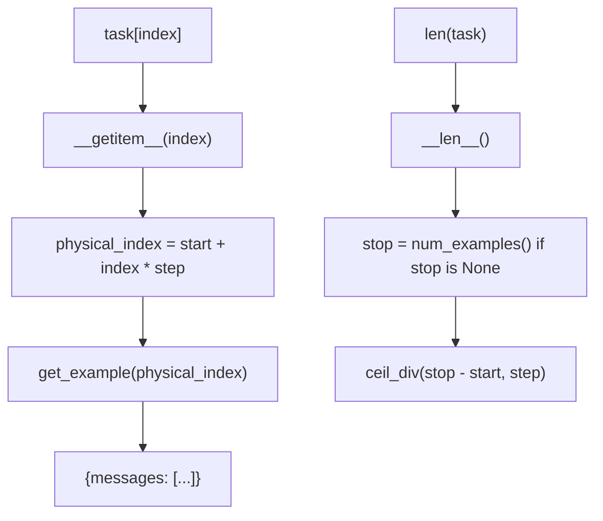
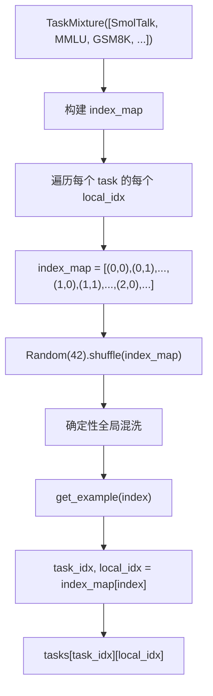
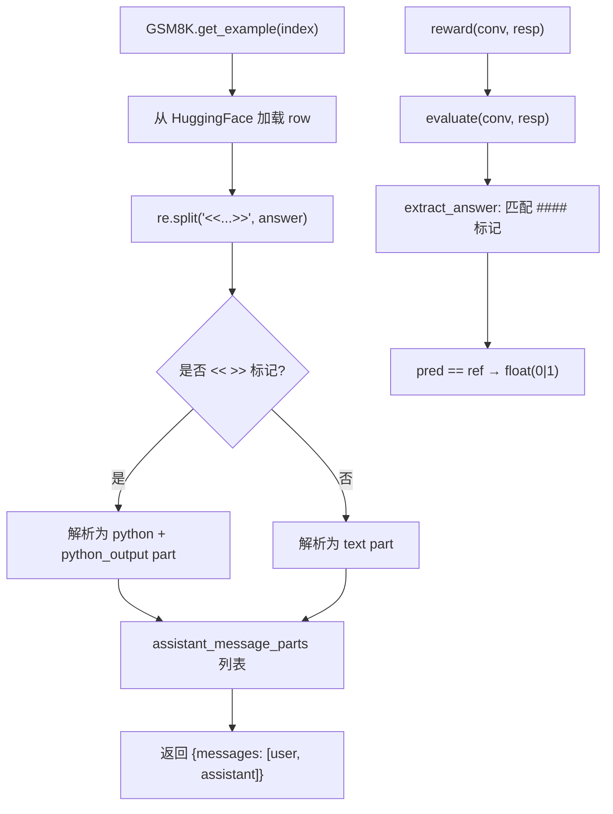

# PD-423.01 nanochat — 统一任务抽象与确定性数据混合

> 文档编号：PD-423.01
> 来源：nanochat `tasks/common.py`, `tasks/gsm8k.py`, `tasks/spellingbee.py`
> GitHub：https://github.com/karpathy/nanochat.git
> 问题域：PD-423 任务抽象与数据混合 Task Abstraction & Data Mixing
> 状态：可复用方案

---

## 第 1 章 问题与动机

### 1.1 核心问题

SFT（Supervised Fine-Tuning）和 RL（Reinforcement Learning）训练需要同时使用多种异构数据集——多选题（MMLU、ARC）、数学推理（GSM8K）、代码生成（HumanEval）、拼写计数（SpellingBee）、通用对话（SmolTalk）、自定义身份对话（CustomJSON）。这些数据集的格式、评估方式、规模差异巨大。

如果没有统一抽象，训练脚本会充斥大量 if-else 分支来处理不同数据集的加载、索引、评估逻辑，导致：
- 新增数据集需要修改训练循环核心代码
- 评估逻辑散落在各处，难以复用
- 数据混合比例调整需要手动计算索引偏移
- RL 训练需要 reward 函数但 SFT 不需要，接口不统一

### 1.2 nanochat 的解法概述

nanochat 用极简的 Python 继承体系解决了这个问题：

1. **Task 基类**（`tasks/common.py:10-51`）：定义 `get_example(index)` + `evaluate()` + `eval_type` 三件套，所有数据集统一为"按索引取对话"的接口
2. **轻量级切片**（`tasks/common.py:15-22`）：`start/stop/step` 参数实现逻辑视图，不复制数据
3. **TaskMixture**（`tasks/common.py:54-86`）：用 `Random(42)` 确定性混洗多数据集的全局索引映射
4. **TaskSequence**（`tasks/common.py:89-109`）：顺序拼接多数据集，支持课程学习
5. **eval_type 分流**（`scripts/chat_eval.py:173-178`）：`generative` 走采样评估，`categorical` 走 logits 批量评估

### 1.3 设计思想

| 设计原则 | 具体实现 | 理由 | 替代方案 |
|----------|----------|------|----------|
| 极简接口 | Task 只需实现 `num_examples()` + `get_example(index)` + `eval_type` | 新数据集 30 行代码即可接入 | HuggingFace datasets 的 map/filter 链式 API（更灵活但更重） |
| 逻辑切片 | `__len__` 和 `__getitem__` 通过 start/stop/step 计算物理索引 | 零拷贝，val 集可用 `stop=5200` 截取子集 | 物理切片 `dataset[:5200]`（需要复制数据） |
| 确定性混洗 | `random.Random(42)` 固定种子打乱 index_map | 训练可复现，不依赖外部随机状态 | PyTorch DataLoader shuffle（依赖全局 seed，多进程不确定） |
| 过采样即重复 | 同一 Task 传入多次到 TaskMixture 列表 | 零额外代码实现过采样，直觉清晰 | 显式 `weight` 参数（需要额外归一化逻辑） |
| 评估类型标签 | `eval_type` property 返回 `generative` 或 `categorical` | 训练/评估脚本自动选择正确的评估路径 | 统一用 generative（categorical 任务浪费采样开销） |

---

## 第 2 章 源码实现分析

### 2.1 架构概览

nanochat 的任务系统是一个三层结构：基类 → 具体任务 → 组合器。

```
┌─────────────────────────────────────────────────────────┐
│                    Training Script                       │
│  chat_sft.py / chat_rl.py                               │
│  ┌─────────────────────────────────────────────────┐    │
│  │           TaskMixture / TaskSequence             │    │
│  │  确定性混洗 index_map / 顺序拼接                   │    │
│  │  ┌──────┐ ┌──────┐ ┌──────┐ ┌──────┐ ┌──────┐  │    │
│  │  │SmolTk│ │ MMLU │ │GSM8K │ │Spell │ │Custom│  │    │
│  │  │460K  │ │100K×3│ │ 8K×4 │ │ 80K  │ │ 1K×2 │  │    │
│  │  └──┬───┘ └──┬───┘ └──┬───┘ └──┬───┘ └──┬───┘  │    │
│  │     └────────┴────────┴────────┴────────┘       │    │
│  │              Task 基类接口                        │    │
│  │     get_example(i) → {messages: [...]}           │    │
│  │     evaluate(conv, resp) → 0|1                   │    │
│  │     eval_type → 'generative'|'categorical'       │    │
│  └─────────────────────────────────────────────────┘    │
│                                                          │
│  Evaluation: chat_eval.py                                │
│  eval_type == 'generative' → run_generative_eval()       │
│  eval_type == 'categorical' → run_categorical_eval()     │
└─────────────────────────────────────────────────────────┘
```

### 2.2 核心实现

#### 2.2.1 Task 基类与逻辑切片



对应源码 `tasks/common.py:10-51`：

```python
class Task:
    """
    Base class of a Task. Allows for lightweight slicing of the underlying dataset.
    """

    def __init__(self, start=0, stop=None, step=1):
        # allows a lightweight logical view over a dataset
        assert start >= 0, f"Start must be non-negative, got {start}"
        assert stop is None or stop >= start, f"Stop should be greater than or equal to start, got {stop} and {start}"
        assert step >= 1, f"Step must be strictly positive, got {step}"
        self.start = start
        self.stop = stop # could be None here
        self.step = step

    @property
    def eval_type(self):
        # one of 'generative' | 'categorical'
        raise NotImplementedError

    def __len__(self):
        start = self.start
        stop = self.num_examples() if self.stop is None else self.stop
        step = self.step
        span = stop - start
        num = (span + step - 1) // step # ceil_div(span, step)
        assert num >= 0, f"Negative number of examples???: {num}"
        return num

    def __getitem__(self, index: int):
        assert isinstance(index, int), f"Index must be an integer, got {type(index)}"
        physical_index = self.start + index * self.step
        conversation = self.get_example(physical_index)
        return conversation
```

关键设计：`__getitem__` 将逻辑索引映射到物理索引，子类只需实现 `get_example(physical_index)`。`stop=None` 表示使用全部数据，`stop=5200` 可截取前 5200 条用于验证集（`scripts/chat_sft.py:174`）。

#### 2.2.2 TaskMixture 确定性混洗



对应源码 `tasks/common.py:54-86`：

```python
class TaskMixture(Task):
    """
    For SFT Training it becomes useful to train on a mixture of datasets.
    Fun trick: if you wish to oversample any task, just pass it in multiple times in the list.
    """

    def __init__(self, tasks, **kwargs):
        super().__init__(**kwargs)
        self.tasks = tasks
        self.lengths = [len(task) for task in self.tasks]
        self.num_conversations = sum(self.lengths)
        # Build list of all (task_idx, local_idx) pairs
        self.index_map = []
        for task_idx, task_length in enumerate(self.lengths):
            for local_idx in range(task_length):
                self.index_map.append((task_idx, local_idx))
        # Deterministically shuffle to mix tasks throughout training
        rng = random.Random(42)
        rng.shuffle(self.index_map)

    def get_example(self, index):
        assert 0 <= index < self.num_conversations
        task_idx, local_idx = self.index_map[index]
        return self.tasks[task_idx][local_idx]
```

核心技巧：`random.Random(42)` 创建独立的 RNG 实例，不污染全局随机状态。`index_map` 是一个 `(task_idx, local_idx)` 元组列表，混洗后按顺序遍历即可保证各任务均匀交错。


#### 2.2.3 GSM8K 工具调用解析与 reward 函数



对应源码 `tasks/gsm8k.py:52-85`：

```python
def get_example(self, index):
    """ Get a single problem from the dataset. """
    row = self.ds[index]
    question = row['question']
    answer = row['answer']
    # This is tricky because GSM8K uses tool calls, which we need to parse here.
    assistant_message_parts = []
    parts = re.split(r'(<<[^>]+>>)', answer)
    for part in parts:
        if part.startswith('<<') and part.endswith('>>'):
            inner = part[2:-2]  # Remove << >>
            if '=' in inner:
                expr, result = inner.rsplit('=', 1)
            else:
                expr, result = inner, ""
            assistant_message_parts.append({"type": "python", "text": expr})
            assistant_message_parts.append({"type": "python_output", "text": result})
        else:
            assistant_message_parts.append({"type": "text", "text": part})
    messages = [
        {"role": "user", "content": question},
        {"role": "assistant", "content": assistant_message_parts},
    ]
    conversation = {"messages": messages}
    return conversation
```

GSM8K 的 `<<12/60=0.2>>` 标记被解析为结构化的 `python` + `python_output` part，这样 tokenizer 可以用特殊 token 包裹工具调用区域，RL 训练时 mask 掉工具输出 token 不计入 loss（`scripts/chat_rl.py:145-146`）。

#### 2.2.4 SpellingBee 多语言数据增强

SpellingBee（`tasks/spellingbee.py:115-231`）展示了一个精巧的合成数据生成模式：

- 48 个用户消息模板覆盖英语、西班牙语、中文、韩语、法语、德语、日语（`tasks/spellingbee.py:55-113`）
- 每个样本用 `Random(seed=index)` 确定性生成，保证 train/test 可复现（`tasks/spellingbee.py:136-137`）
- 助手回复包含手动计数 + Python 验证的双重推理链（`tasks/spellingbee.py:162-195`）
- `reward()` 函数直接复用 `evaluate()` 返回 0.0/1.0（`tasks/spellingbee.py:226-230`）

### 2.3 实现细节

**SFT 数据混合配置**（`scripts/chat_sft.py:161-176`）：

```python
train_tasks = [
    SmolTalk(split="train"),                                    # 460K rows
    CustomJSON(filepath=identity_conversations_filepath),       # 1000 rows
    CustomJSON(filepath=identity_conversations_filepath),       # 2 epochs (过采样!)
    *[MMLU(subset="auxiliary_train", split="train") for _ in range(args.mmlu_epochs)],  # 100K × N
    *[GSM8K(subset="main", split="train") for _ in range(args.gsm8k_epochs)],           # 8K × N
    SimpleSpelling(size=200000, split="train"),                 # 200K rows
    SpellingBee(size=80000, split="train"),                     # 80K rows
]
train_dataset = TaskMixture(train_tasks)
```

过采样技巧：`CustomJSON` 传入两次实现 2 epoch，MMLU/GSM8K 用列表推导式按 `args.mmlu_epochs`/`args.gsm8k_epochs` 控制重复次数。这比引入 `weight` 参数更直觉——你想要更多某个数据集，就多传几次。

**eval_type 分流**（`scripts/chat_eval.py:159-179`）：

categorical 任务（MMLU、ARC）不需要采样，直接用 logits 在候选 letter token 上做 argmax，批量处理效率远高于 generative 评估。generative 任务（GSM8K、HumanEval、SpellingBee）需要逐题采样再用 `evaluate()` 判断正确性。

**render_mc 的 tokenizer 感知设计**（`tasks/common.py:112-131`）：

多选题格式 `choice=A` 而非 `A. choice`，且 `=` 和字母之间无空格。这是因为 tokenizer 对 `" A"` 和 `"A"` 编码为不同 token，小模型对此敏感。letter 放在 choice 后面（而非前面）也有助于小模型的 binding。

---

## 第 3 章 迁移指南

### 3.1 迁移清单

**阶段 1：核心框架（1 个文件）**
- [ ] 复制 `Task` 基类 + `TaskMixture` + `TaskSequence` 到项目中
- [ ] 确认 Python 3.8+ 环境（仅依赖标准库 `random`）

**阶段 2：接入数据集（每个数据集 1 个文件）**
- [ ] 为每个数据集实现 `Task` 子类
- [ ] 实现 `num_examples()` 返回数据集大小
- [ ] 实现 `get_example(index)` 返回 `{messages: [{role, content}]}` 格式
- [ ] 设置 `eval_type` property（`generative` 或 `categorical`）
- [ ] 如需评估，实现 `evaluate(conversation, assistant_response)`
- [ ] 如需 RL，实现 `reward(conversation, assistant_response)`

**阶段 3：组合与训练**
- [ ] 用 `TaskMixture` 组合多个 Task，调整过采样比例
- [ ] 在评估脚本中根据 `eval_type` 分流到不同评估路径

### 3.2 适配代码模板

```python
import random
from typing import Literal

class Task:
    """统一任务抽象基类。"""

    def __init__(self, start=0, stop=None, step=1):
        assert start >= 0
        assert stop is None or stop >= start
        assert step >= 1
        self.start = start
        self.stop = stop
        self.step = step

    @property
    def eval_type(self) -> Literal['generative', 'categorical']:
        raise NotImplementedError

    def num_examples(self) -> int:
        raise NotImplementedError

    def get_example(self, index: int) -> dict:
        raise NotImplementedError

    def evaluate(self, conversation: dict, response: str) -> int:
        raise NotImplementedError

    def reward(self, conversation: dict, response: str) -> float:
        """默认 reward = evaluate 结果转 float，子类可覆盖。"""
        return float(self.evaluate(conversation, response))

    def __len__(self):
        stop = self.num_examples() if self.stop is None else self.stop
        return (stop - self.start + self.step - 1) // self.step

    def __getitem__(self, index: int):
        physical_index = self.start + index * self.step
        return self.get_example(physical_index)


class TaskMixture(Task):
    """确定性混洗多数据集。过采样：同一 Task 传入多次即可。"""

    def __init__(self, tasks, seed=42, **kwargs):
        super().__init__(**kwargs)
        self.tasks = tasks
        self.index_map = []
        for task_idx, task in enumerate(tasks):
            for local_idx in range(len(task)):
                self.index_map.append((task_idx, local_idx))
        random.Random(seed).shuffle(self.index_map)

    def num_examples(self):
        return len(self.index_map)

    def get_example(self, index):
        task_idx, local_idx = self.index_map[index]
        return self.tasks[task_idx][local_idx]


class TaskSequence(Task):
    """顺序拼接多数据集，用于课程学习。"""

    def __init__(self, tasks, **kwargs):
        super().__init__(**kwargs)
        self.tasks = tasks
        self.lengths = [len(t) for t in tasks]
        self._total = sum(self.lengths)

    def num_examples(self):
        return self._total

    def get_example(self, index):
        for task_idx, length in enumerate(self.lengths):
            if index < length:
                return self.tasks[task_idx][index]
            index -= length


# --- 使用示例 ---
# train = TaskMixture([
#     MyDialogTask(split="train"),
#     MyMathTask(split="train"),
#     MyMathTask(split="train"),  # 2x 过采样
# ])
# for i in range(len(train)):
#     conversation = train[i]
#     # conversation["messages"] → [{role, content}, ...]
```

### 3.3 适用场景

| 场景 | 适用度 | 说明 |
|------|--------|------|
| 小规模 SFT（< 10 个数据集） | ⭐⭐⭐ | 完美匹配，极简且够用 |
| RL 训练（GRPO/REINFORCE） | ⭐⭐⭐ | reward() 接口天然支持 |
| 多选题 + 生成式混合评估 | ⭐⭐⭐ | eval_type 分流避免浪费 |
| 大规模预训练（TB 级数据） | ⭐ | index_map 全部展开到内存，不适合超大数据集 |
| 流式数据 / 在线学习 | ⭐ | 需要预知 num_examples()，不支持流式 |
| 需要动态权重调整 | ⭐⭐ | 需要重建 TaskMixture，不支持运行时调权 |

---

## 第 4 章 测试用例

```python
import random
import pytest

# --- Task 基类测试 ---

class DummyTask:
    """模拟一个简单的 Task 用于测试。"""
    def __init__(self, data, start=0, stop=None, step=1):
        self.data = data
        self.start = start
        self.stop = stop
        self.step = step

    @property
    def eval_type(self):
        return 'generative'

    def num_examples(self):
        return len(self.data)

    def get_example(self, index):
        return {"messages": [{"role": "user", "content": self.data[index]}]}

    def __len__(self):
        stop = self.num_examples() if self.stop is None else self.stop
        return (stop - self.start + self.step - 1) // self.step

    def __getitem__(self, index):
        physical_index = self.start + index * self.step
        return self.get_example(physical_index)


class TestTaskSlicing:
    def test_full_length(self):
        task = DummyTask(["a", "b", "c", "d", "e"])
        assert len(task) == 5

    def test_stop_slice(self):
        task = DummyTask(["a", "b", "c", "d", "e"], stop=3)
        assert len(task) == 3
        assert task[0]["messages"][0]["content"] == "a"
        assert task[2]["messages"][0]["content"] == "c"

    def test_start_stop_slice(self):
        task = DummyTask(["a", "b", "c", "d", "e"], start=1, stop=4)
        assert len(task) == 3
        assert task[0]["messages"][0]["content"] == "b"

    def test_step_slice(self):
        task = DummyTask(["a", "b", "c", "d", "e"], step=2)
        assert len(task) == 3  # ceil(5/2) = 3
        assert task[0]["messages"][0]["content"] == "a"
        assert task[1]["messages"][0]["content"] == "c"
        assert task[2]["messages"][0]["content"] == "e"


class TestTaskMixture:
    def test_deterministic_shuffle(self):
        """两次创建相同 TaskMixture 应产生相同顺序。"""
        t1 = DummyTask(["a", "b"])
        t2 = DummyTask(["x", "y"])
        mix1_map = []
        for i, t in enumerate([t1, t2]):
            for j in range(len(t)):
                mix1_map.append((i, j))
        random.Random(42).shuffle(mix1_map)

        mix2_map = []
        for i, t in enumerate([t1, t2]):
            for j in range(len(t)):
                mix2_map.append((i, j))
        random.Random(42).shuffle(mix2_map)

        assert mix1_map == mix2_map

    def test_total_length(self):
        """混合后总长度 = 各任务长度之和。"""
        t1 = DummyTask(["a", "b", "c"])
        t2 = DummyTask(["x", "y"])
        total = len(t1) + len(t2)
        assert total == 5

    def test_oversampling_by_repetition(self):
        """同一 Task 传入两次，总长度翻倍。"""
        t1 = DummyTask(["a", "b"])
        tasks = [t1, t1]
        total = sum(len(t) for t in tasks)
        assert total == 4  # 2 + 2


class TestRewardFunction:
    def test_correct_answer_reward(self):
        """正确答案 reward = 1.0。"""
        # 模拟 GSM8K 的 #### 标记评估
        import re
        pattern = re.compile(r"#### (\-?[0-9\.\,]+)")
        ref = "#### 10"
        pred = "The answer is #### 10"
        ref_match = pattern.search(ref).group(1).replace(",", "")
        pred_match = pattern.search(pred).group(1).replace(",", "")
        assert ref_match == pred_match
        assert float(int(ref_match == pred_match)) == 1.0

    def test_wrong_answer_reward(self):
        """错误答案 reward = 0.0。"""
        import re
        pattern = re.compile(r"#### (\-?[0-9\.\,]+)")
        ref = "#### 10"
        pred = "The answer is #### 15"
        ref_match = pattern.search(ref).group(1).replace(",", "")
        pred_match = pattern.search(pred).group(1).replace(",", "")
        assert ref_match != pred_match
        assert float(int(ref_match == pred_match)) == 0.0

    def test_no_answer_marker(self):
        """无 #### 标记时 extract_answer 返回 None。"""
        import re
        pattern = re.compile(r"#### (\-?[0-9\.\,]+)")
        pred = "The answer is 10"
        match = pattern.search(pred)
        assert match is None
```


---

## 第 5 章 跨域关联

| 关联域 | 关系类型 | 说明 |
|--------|----------|------|
| PD-420 高效数据加载 | 协同 | Task 抽象提供数据接口，DataLoader（`sft_data_generator_bos_bestfit`）负责 packing 和 batching |
| PD-419 BPE Tokenizer | 依赖 | `render_mc` 的 `=A` 无空格设计直接受 tokenizer 编码行为约束 |
| PD-421 高级优化器 | 协同 | TaskMixture 的混合比例影响优化器的梯度分布 |
| PD-422 LLM 训练流水线 | 被依赖 | SFT/RL 训练脚本是 Task 系统的直接消费者 |
| PD-415 分布式训练 | 协同 | 评估时按 `ddp_rank` 分片遍历 Task，`dist.all_reduce` 聚合结果 |

---

## 第 6 章 来源文件索引

| 文件 | 行范围 | 关键实现 |
|------|--------|----------|
| `tasks/common.py` | L10-L51 | Task 基类：切片、索引映射、接口定义 |
| `tasks/common.py` | L54-L86 | TaskMixture：确定性混洗、index_map 构建 |
| `tasks/common.py` | L89-L109 | TaskSequence：顺序拼接、课程学习 |
| `tasks/common.py` | L112-L131 | render_mc：tokenizer 感知的多选题格式化 |
| `tasks/gsm8k.py` | L37-L117 | GSM8K Task：工具调用解析、evaluate、reward |
| `tasks/mmlu.py` | L9-L61 | MMLU Task：categorical 评估、4 选项多选 |
| `tasks/spellingbee.py` | L55-L113 | 48 个多语言用户消息模板 |
| `tasks/spellingbee.py` | L115-L231 | SpellingBee Task：合成数据生成、双重推理链 |
| `tasks/smoltalk.py` | L10-L47 | SmolTalk Task：通用对话数据集封装 |
| `tasks/customjson.py` | L10-L65 | CustomJSON Task：JSONL 文件加载、格式校验 |
| `tasks/arc.py` | L9-L49 | ARC Task：categorical 评估、变长选项 |
| `tasks/humaneval.py` | L47-L98 | HumanEval Task：代码生成、沙箱执行评估 |
| `scripts/chat_sft.py` | L161-L176 | SFT 数据混合配置：7 个 Task 组合 |
| `scripts/chat_eval.py` | L31-L83 | generative 评估循环：逐题采样 |
| `scripts/chat_eval.py` | L90-L155 | categorical 评估循环：批量 logits argmax |
| `scripts/chat_eval.py` | L159-L179 | eval_type 分流调度 |
| `scripts/chat_rl.py` | L85-L152 | RL 训练：reward 计算、advantage 归一化 |

---

## 第 7 章 横向对比维度

```json comparison_data
{
  "project": "nanochat",
  "dimensions": {
    "抽象层级": "单层 Task 基类 + 2 个组合器（Mixture/Sequence），无中间抽象",
    "数据混合策略": "index_map 全展开 + Random(42) 确定性混洗，内存换确定性",
    "评估分流": "eval_type property 二分法：generative 采样 vs categorical logits argmax",
    "过采样机制": "同一 Task 对象重复传入列表，零额外代码",
    "切片能力": "start/stop/step 逻辑视图，零拷贝",
    "RL 支持": "reward() 方法默认复用 evaluate()，0-1 二值奖励",
    "多语言增强": "SpellingBee 48 模板覆盖 7 种语言的用户消息变体"
  }
}
```

### 域元数据补充

```json domain_metadata
{
  "solution_summary": "nanochat 用 Task 基类 + TaskMixture 确定性混洗 + eval_type 二分法，7 个异构数据集统一为 get_example(i) 接口，过采样靠重复传入实现",
  "description": "面向小模型 SFT/RL 的轻量级任务抽象，强调 tokenizer 感知和合成数据生成",
  "sub_problems": [
    "tokenizer 编码差异对多选题格式的影响",
    "合成数据的多语言模板增强",
    "工具调用标记解析与结构化 part 表示"
  ],
  "best_practices": [
    "多选题 letter 放在 choice 后面且无空格，避免 tokenizer 歧义",
    "用 Random(seed=index) 为每个样本生成确定性合成数据",
    "reward() 默认复用 evaluate() 减少重复代码"
  ]
}
```
