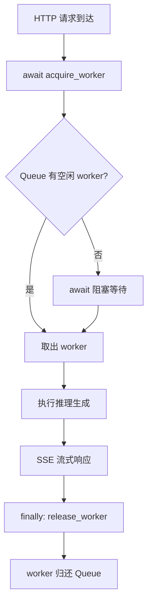
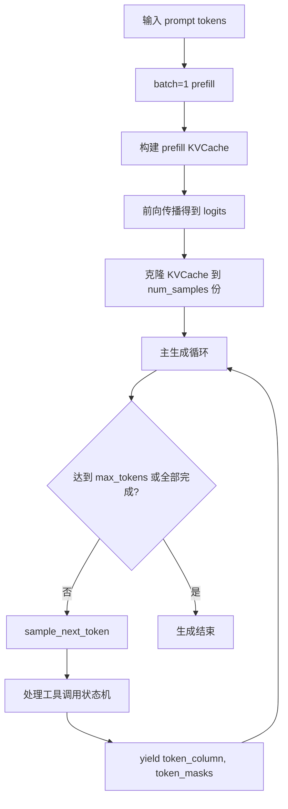
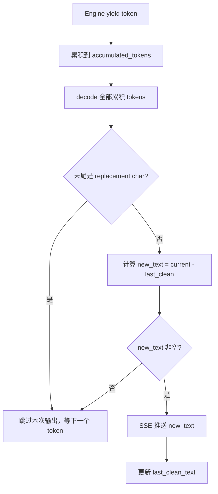

# PD-424.01 nanochat — WorkerPool 数据并行推理服务

> 文档编号：PD-424.01
> 来源：nanochat `scripts/chat_web.py`, `nanochat/engine.py`
> GitHub：https://github.com/karpathy/nanochat.git
> 问题域：PD-424 多 GPU 推理服务 Multi-GPU Inference Serving
> 状态：可复用方案

---

## 第 1 章 问题与动机

### 1.1 核心问题

当一个 LLM 推理服务需要承载多用户并发请求时，单 GPU 会成为瓶颈：
- **吞吐量受限**：自回归生成是串行的，一个请求占用 GPU 期间其他请求只能排队
- **GPU 利用率低**：单请求的 batch_size=1 无法充分利用 GPU 的并行计算能力
- **流式响应复杂**：SSE 流式输出需要处理 UTF-8 多字节字符的边界问题
- **防滥用缺失**：公开部署的推理服务需要对请求参数做严格校验

这些问题在 Karpathy 的 nanochat 项目中通过一个极简但完整的方案解决：数据并行 WorkerPool + asyncio.Queue 调度 + FastAPI SSE 流式响应。

### 1.2 nanochat 的解法概述

1. **数据并行复制**：每个 GPU 加载完整模型副本，N 个 GPU = N 个独立 worker（`scripts/chat_web.py:98-148`）
2. **asyncio.Queue 无锁调度**：用 Python 原生异步队列管理 worker 分配，请求到达时 `await queue.get()` 获取空闲 worker，完成后 `queue.put()` 归还（`scripts/chat_web.py:142-148`）
3. **KV Cache 预分配 + 单次 prefill**：Engine 先做 batch=1 的 prefill 构建 KV Cache，再克隆到多 sample 的 decode cache 中（`nanochat/engine.py:194-218`）
4. **UTF-8 安全流式输出**：token 级流式解码时累积 token 序列，检测 `�`（replacement character）来判断多字节字符是否完整（`scripts/chat_web.py:277-309`）
5. **多层防滥用校验**：消息数、单条长度、总长度、温度、top_k、max_tokens 全部做范围限制（`scripts/chat_web.py:52-61, 160-221`）

### 1.3 设计思想

| 设计原则 | 具体实现 | 理由 | 替代方案 |
|----------|----------|------|----------|
| 数据并行而非模型并行 | 每 GPU 一份完整模型副本 | 小模型（<1B）单卡可放下，数据并行最简单 | 张量并行（大模型必须）、流水线并行 |
| 无锁异步调度 | asyncio.Queue 管理 worker 池 | 与 FastAPI 的 asyncio 事件循环天然兼容 | 线程池 + Lock、进程池 + IPC |
| 流式优先 | SSE text/event-stream，逐 token 推送 | 自回归生成天然适合流式，用户体验好 | WebSocket（双向但更复杂）、轮询 |
| 防御性校验前置 | 请求进入生成前先做全量校验 | 避免恶意请求浪费 GPU 资源 | 中间件限流、API Gateway |
| KV Cache 预分配 | 一次性分配最大长度的 cache 张量 | 避免动态分配的碎片化和 OOM 风险 | PagedAttention（vLLM 方案） |

---

## 第 2 章 源码实现分析

### 2.1 架构概览

nanochat 的推理服务架构分为三层：HTTP 层（FastAPI）、调度层（WorkerPool）、计算层（Engine + KVCache）。

```
┌─────────────────────────────────────────────────────────┐
│                    FastAPI Server                        │
│  POST /chat/completions  GET /health  GET /stats        │
├─────────────────────────────────────────────────────────┤
│                   WorkerPool (调度层)                     │
│  asyncio.Queue ──→ acquire_worker() ──→ release_worker()│
├──────────┬──────────┬──────────┬───────────────────────-─┤
│ Worker 0 │ Worker 1 │ Worker 2 │ ...  Worker N-1        │
│ GPU:0    │ GPU:1    │ GPU:2    │      GPU:N-1           │
│ Engine   │ Engine   │ Engine   │      Engine             │
│ KVCache  │ KVCache  │ KVCache  │      KVCache            │
└──────────┴──────────┴──────────┴────────────────────────┘
```

每个 Worker 是一个 `@dataclass`，持有独立的 `Engine`、`tokenizer`、`autocast_ctx`，绑定到特定 GPU 设备。

### 2.2 核心实现

#### 2.2.1 WorkerPool：asyncio.Queue 驱动的 worker 调度



对应源码 `scripts/chat_web.py:98-148`：

```python
@dataclass
class Worker:
    """A worker with a model loaded on a specific GPU."""
    gpu_id: int
    device: torch.device
    engine: Engine
    tokenizer: object
    autocast_ctx: torch.amp.autocast

class WorkerPool:
    """Pool of workers, each with a model replica on a different GPU."""

    def __init__(self, num_gpus: Optional[int] = None):
        if num_gpus is None:
            if device_type == "cuda":
                num_gpus = torch.cuda.device_count()
            else:
                num_gpus = 1
        self.num_gpus = num_gpus
        self.workers: List[Worker] = []
        self.available_workers: asyncio.Queue = asyncio.Queue()

    async def initialize(self, source: str, model_tag=None, step=None):
        """Load model on each GPU."""
        for gpu_id in range(self.num_gpus):
            if device_type == "cuda":
                device = torch.device(f"cuda:{gpu_id}")
            else:
                device = torch.device(device_type)
            model, tokenizer, _ = load_model(source, device, phase="eval",
                                              model_tag=model_tag, step=step)
            engine = Engine(model, tokenizer)
            autocast_ctx = torch.amp.autocast(device_type=device_type,
                                               dtype=ptdtype) if device_type == "cuda" else nullcontext()
            worker = Worker(gpu_id=gpu_id, device=device, engine=engine,
                           tokenizer=tokenizer, autocast_ctx=autocast_ctx)
            self.workers.append(worker)
            await self.available_workers.put(worker)

    async def acquire_worker(self) -> Worker:
        return await self.available_workers.get()

    async def release_worker(self, worker: Worker):
        await self.available_workers.put(worker)
```

关键设计点：
- `asyncio.Queue` 是无界队列，初始化时放入 N 个 worker，`get()` 和 `put()` 天然实现了信号量语义
- `acquire_worker()` 在所有 worker 都忙时会 `await` 阻塞，不消耗 CPU
- worker 归还在 `finally` 块中执行（`scripts/chat_web.py:367-373`），确保异常时也能释放

#### 2.2.2 Engine：KV Cache prefill-then-clone 生成策略



对应源码 `nanochat/engine.py:170-276`：

```python
@torch.inference_mode()
def generate(self, tokens, num_samples=1, max_tokens=None,
             temperature=1.0, top_k=None, seed=42):
    device = self.model.get_device()
    dtype = torch.bfloat16 if device.type == "cuda" else torch.float32
    rng = torch.Generator(device=device)
    rng.manual_seed(seed)

    # 1) batch=1 prefill
    m = self.model.config
    kv_model_kwargs = {"num_heads": m.n_kv_head, "head_dim": m.n_embd // m.n_head,
                       "num_layers": m.n_layer}
    kv_cache_prefill = KVCache(batch_size=1, seq_len=len(tokens),
                                device=device, dtype=dtype, **kv_model_kwargs)
    ids = torch.tensor([tokens], dtype=torch.long, device=device)
    logits = self.model.forward(ids, kv_cache=kv_cache_prefill)
    logits = logits[:, -1, :].expand(num_samples, -1)

    # 2) 克隆 KV Cache 到 decode 阶段
    kv_length_hint = (len(tokens) + max_tokens) if max_tokens else self.model.config.sequence_len
    kv_cache_decode = KVCache(batch_size=num_samples, seq_len=kv_length_hint,
                               device=device, dtype=dtype, **kv_model_kwargs)
    kv_cache_decode.prefill(kv_cache_prefill)
    del kv_cache_prefill  # 释放 prefill 阶段的显存

    # 3) 主生成循环（generator 模式）
    row_states = [RowState(tokens.copy()) for _ in range(num_samples)]
    num_generated = 0
    while True:
        if max_tokens is not None and num_generated >= max_tokens:
            break
        if all(state.completed for state in row_states):
            break
        next_ids = sample_next_token(logits, rng, temperature, top_k)
        # ... 逐行处理 token，工具调用状态机 ...
        yield token_column, token_masks
        num_generated += 1
        ids = torch.tensor(token_column, dtype=torch.long, device=device).unsqueeze(1)
        logits = self.model.forward(ids, kv_cache=kv_cache_decode)[:, -1, :]
```

关键设计点：
- **prefill-then-clone**：先用 batch=1 做一次完整 prefill，再把 KV Cache 复制到 decode 阶段的多 sample cache 中，避免重复计算 prompt 部分
- **generator 模式**：`yield` 逐 token 输出，调用方可以流式消费
- **显式 RNG**：每次生成用独立的 `torch.Generator`，不污染全局随机状态

#### 2.2.3 UTF-8 多字节安全的 SSE 流式输出



对应源码 `scripts/chat_web.py:262-311`：

```python
async def generate_stream(worker, tokens, temperature=None,
                          max_new_tokens=None, top_k=None) -> AsyncGenerator[str, None]:
    accumulated_tokens = []
    last_clean_text = ""

    with worker.autocast_ctx:
        for token_column, token_masks in worker.engine.generate(
            tokens, num_samples=1, max_tokens=max_new_tokens,
            temperature=temperature, top_k=top_k,
            seed=random.randint(0, 2**31 - 1)
        ):
            token = token_column[0]
            if token == assistant_end or token == bos:
                break
            accumulated_tokens.append(token)
            current_text = worker.tokenizer.decode(accumulated_tokens)
            # 关键：检测 replacement character 判断 UTF-8 完整性
            if not current_text.endswith('\ufffd'):
                new_text = current_text[len(last_clean_text):]
                if new_text:
                    yield f"data: {json.dumps({'token': new_text, 'gpu': worker.gpu_id}, ensure_ascii=False)}\n\n"
                    last_clean_text = current_text

    yield f"data: {json.dumps({'done': True})}\n\n"
```

### 2.3 实现细节

**KVCache 的 Flash Attention 3 适配**（`nanochat/engine.py:83-133`）：

KVCache 采用 `(B, T, H, D)` 布局（而非 FA2 的 `(B, H, T, D)`），这是 FA3 的原生布局。FA3 在 `flash_attn_with_kvcache` 调用中原地更新 cache，通过 `cache_seqlens` 张量追踪每个 batch 元素的当前位置。

**请求级 worker 生命周期管理**（`scripts/chat_web.py:326-382`）：

```python
worker = await worker_pool.acquire_worker()
try:
    # ... 构建 tokens, 创建 StreamingResponse ...
    async def stream_and_release():
        try:
            async for chunk in generate_stream(worker, ...):
                yield chunk
        finally:
            await worker_pool.release_worker(worker)
    return StreamingResponse(stream_and_release(), media_type="text/event-stream")
except Exception as e:
    await worker_pool.release_worker(worker)
    raise e
```

这里有一个精妙的设计：worker 的释放不在外层 try/except 中（那样会在 StreamingResponse 返回时就释放），而是嵌入到 `stream_and_release()` 的 `finally` 中，确保流式传输完全结束后才归还 worker。外层 catch 只处理构建 response 阶段的异常。

**FastAPI lifespan 初始化**（`scripts/chat_web.py:223-231`）：

```python
@asynccontextmanager
async def lifespan(app: FastAPI):
    app.state.worker_pool = WorkerPool(num_gpus=args.num_gpus)
    await app.state.worker_pool.initialize(args.source, model_tag=args.model_tag, step=args.step)
    yield
```

使用 FastAPI 的 lifespan 上下文管理器在启动时初始化所有 GPU worker，确保模型加载完成后才开始接受请求。

---

## 第 3 章 迁移指南

### 3.1 迁移清单

**阶段 1：基础 WorkerPool（1 个文件）**
- [ ] 定义 `Worker` dataclass（gpu_id, device, model, tokenizer）
- [ ] 实现 `WorkerPool`：`__init__` 创建 `asyncio.Queue`，`initialize` 加载模型到各 GPU
- [ ] 实现 `acquire_worker` / `release_worker` 的 async 方法

**阶段 2：SSE 流式响应（1 个文件）**
- [ ] 实现 `generate_stream` async generator，包含 UTF-8 安全处理
- [ ] 在 FastAPI endpoint 中用 `StreamingResponse` 包装
- [ ] 确保 worker 在 `finally` 中释放（嵌入 stream generator 内部）

**阶段 3：防滥用校验（同文件）**
- [ ] 定义请求限制常量（消息数、长度、温度范围等）
- [ ] 实现 `validate_request` 函数，在生成前调用
- [ ] 添加 `/health` 和 `/stats` 端点用于监控

### 3.2 适配代码模板

以下是一个可直接运行的最小化 WorkerPool + SSE 服务模板：

```python
"""
最小化多 GPU 推理服务模板
基于 nanochat 的 WorkerPool 模式
依赖: pip install fastapi uvicorn torch
"""
import asyncio
import json
import random
from dataclasses import dataclass
from typing import List, Optional, AsyncGenerator
from contextlib import asynccontextmanager, nullcontext

import torch
from fastapi import FastAPI, HTTPException
from fastapi.responses import StreamingResponse
from pydantic import BaseModel

# ── 配置常量 ──
MAX_MESSAGES = 500
MAX_MSG_LEN = 8000
MAX_TOTAL_LEN = 32000
MAX_TEMPERATURE = 2.0
MAX_TOKENS_LIMIT = 4096

# ── Worker 定义 ──
@dataclass
class Worker:
    gpu_id: int
    device: torch.device
    model: object          # 替换为你的模型类
    tokenizer: object      # 替换为你的 tokenizer 类
    autocast_ctx: object   # torch.amp.autocast 或 nullcontext

class WorkerPool:
    def __init__(self, num_gpus: int = 1):
        self.num_gpus = num_gpus
        self.workers: List[Worker] = []
        self.queue: asyncio.Queue = asyncio.Queue()

    async def initialize(self, model_path: str):
        for gpu_id in range(self.num_gpus):
            device = torch.device(f"cuda:{gpu_id}" if torch.cuda.is_available() else "cpu")
            # 替换为你的模型加载逻辑
            model = load_your_model(model_path, device)
            tokenizer = load_your_tokenizer()
            ctx = (torch.amp.autocast(device_type="cuda", dtype=torch.bfloat16)
                   if device.type == "cuda" else nullcontext())
            worker = Worker(gpu_id=gpu_id, device=device, model=model,
                           tokenizer=tokenizer, autocast_ctx=ctx)
            self.workers.append(worker)
            await self.queue.put(worker)

    async def acquire(self) -> Worker:
        return await self.queue.get()

    async def release(self, worker: Worker):
        await self.queue.put(worker)

# ── 请求校验 ──
class ChatMessage(BaseModel):
    role: str
    content: str

class ChatRequest(BaseModel):
    messages: List[ChatMessage]
    temperature: Optional[float] = 0.8
    max_tokens: Optional[int] = 512

def validate_request(req: ChatRequest):
    if len(req.messages) == 0:
        raise HTTPException(400, "At least one message required")
    if len(req.messages) > MAX_MESSAGES:
        raise HTTPException(400, f"Max {MAX_MESSAGES} messages")
    total = 0
    for i, m in enumerate(req.messages):
        if len(m.content) > MAX_MSG_LEN:
            raise HTTPException(400, f"Message {i} too long (max {MAX_MSG_LEN})")
        total += len(m.content)
    if total > MAX_TOTAL_LEN:
        raise HTTPException(400, f"Total conversation too long (max {MAX_TOTAL_LEN})")
    if req.temperature is not None and not (0.0 <= req.temperature <= MAX_TEMPERATURE):
        raise HTTPException(400, f"Temperature must be 0.0-{MAX_TEMPERATURE}")

# ── UTF-8 安全流式输出 ──
async def generate_stream(worker: Worker, tokens: list,
                          temperature: float, max_tokens: int) -> AsyncGenerator[str, None]:
    accumulated = []
    last_clean = ""
    with worker.autocast_ctx:
        for token_id in your_generate_function(worker.model, tokens,
                                                temperature=temperature,
                                                max_tokens=max_tokens):
            accumulated.append(token_id)
            text = worker.tokenizer.decode(accumulated)
            if not text.endswith('\ufffd'):  # UTF-8 完整性检查
                new_text = text[len(last_clean):]
                if new_text:
                    yield f"data: {json.dumps({'token': new_text}, ensure_ascii=False)}\n\n"
                    last_clean = text
    yield f"data: {json.dumps({'done': True})}\n\n"

# ── FastAPI 应用 ──
@asynccontextmanager
async def lifespan(app: FastAPI):
    pool = WorkerPool(num_gpus=torch.cuda.device_count() or 1)
    await pool.initialize("your-model-path")
    app.state.pool = pool
    yield

app = FastAPI(lifespan=lifespan)

@app.post("/chat/completions")
async def chat(req: ChatRequest):
    validate_request(req)
    pool = app.state.pool
    worker = await pool.acquire()
    try:
        tokens = encode_conversation(worker.tokenizer, req.messages)
        async def stream_and_release():
            try:
                async for chunk in generate_stream(worker, tokens,
                                                    req.temperature, req.max_tokens):
                    yield chunk
            finally:
                await pool.release(worker)  # 流式完成后才释放
        return StreamingResponse(stream_and_release(), media_type="text/event-stream")
    except Exception:
        await pool.release(worker)
        raise

@app.get("/health")
async def health():
    pool = app.state.pool
    return {
        "status": "ok",
        "total_workers": len(pool.workers),
        "available": pool.queue.qsize(),
    }
```

### 3.3 适用场景

| 场景 | 适用度 | 说明 |
|------|--------|------|
| 小模型（<1B）多 GPU 推理 | ⭐⭐⭐ | 每卡放完整模型，数据并行最简单高效 |
| 中等并发（<100 QPS） | ⭐⭐⭐ | asyncio.Queue 调度开销极低 |
| 需要流式输出的聊天服务 | ⭐⭐⭐ | SSE + UTF-8 安全处理是标配 |
| 大模型（>7B）单卡放不下 | ⭐ | 需要张量并行或 vLLM 等方案 |
| 高并发（>1000 QPS） | ⭐ | 需要 continuous batching（vLLM/TGI） |
| 需要动态扩缩容 | ⭐⭐ | WorkerPool 是静态的，需额外编排层 |

---

## 第 4 章 测试用例

```python
"""
测试 WorkerPool 调度和 UTF-8 安全流式输出
基于 nanochat 的真实函数签名
"""
import asyncio
import pytest
import json
from unittest.mock import MagicMock, AsyncMock, patch
from dataclasses import dataclass
from typing import List
from contextlib import nullcontext


# ── Mock 定义 ──
@dataclass
class MockWorker:
    gpu_id: int
    device: str = "cpu"
    engine: object = None
    tokenizer: object = None
    autocast_ctx: object = None

    def __post_init__(self):
        self.autocast_ctx = nullcontext()


class MockWorkerPool:
    """复刻 nanochat WorkerPool 的核心逻辑"""
    def __init__(self, num_workers: int):
        self.workers: List[MockWorker] = []
        self.available_workers: asyncio.Queue = asyncio.Queue()
        for i in range(num_workers):
            w = MockWorker(gpu_id=i)
            self.workers.append(w)
            self.available_workers.put_nowait(w)

    async def acquire_worker(self):
        return await self.available_workers.get()

    async def release_worker(self, worker):
        await self.available_workers.put(worker)


# ── WorkerPool 调度测试 ──
class TestWorkerPool:

    @pytest.mark.asyncio
    async def test_acquire_release_cycle(self):
        """正常获取和归还 worker"""
        pool = MockWorkerPool(num_workers=2)
        assert pool.available_workers.qsize() == 2

        w1 = await pool.acquire_worker()
        assert pool.available_workers.qsize() == 1
        assert w1.gpu_id == 0

        w2 = await pool.acquire_worker()
        assert pool.available_workers.qsize() == 0
        assert w2.gpu_id == 1

        await pool.release_worker(w1)
        assert pool.available_workers.qsize() == 1

        await pool.release_worker(w2)
        assert pool.available_workers.qsize() == 2

    @pytest.mark.asyncio
    async def test_acquire_blocks_when_empty(self):
        """所有 worker 都忙时，acquire 应阻塞"""
        pool = MockWorkerPool(num_workers=1)
        w = await pool.acquire_worker()

        # 启动一个延迟归还的任务
        async def delayed_release():
            await asyncio.sleep(0.1)
            await pool.release_worker(w)

        asyncio.create_task(delayed_release())

        # 这个 acquire 应该阻塞直到 worker 被归还
        w2 = await asyncio.wait_for(pool.acquire_worker(), timeout=1.0)
        assert w2.gpu_id == w.gpu_id

    @pytest.mark.asyncio
    async def test_concurrent_requests(self):
        """并发请求应被正确分配到不同 worker"""
        pool = MockWorkerPool(num_workers=3)
        acquired = []

        async def use_worker():
            w = await pool.acquire_worker()
            acquired.append(w.gpu_id)
            await asyncio.sleep(0.05)
            await pool.release_worker(w)

        await asyncio.gather(*[use_worker() for _ in range(3)])
        assert sorted(acquired) == [0, 1, 2]


# ── UTF-8 安全处理测试 ──
class TestUtf8SafeStreaming:

    def test_replacement_char_detection(self):
        """replacement character 检测逻辑"""
        # 完整的 UTF-8 字符串不以 replacement char 结尾
        assert not "Hello".endswith('\ufffd')
        assert not "你好".endswith('\ufffd')
        # 不完整的多字节序列解码后会以 replacement char 结尾
        assert "Hello\ufffd".endswith('\ufffd')

    def test_incremental_decode_safety(self):
        """增量解码时只输出完整的 UTF-8 字符"""
        # 模拟 emoji "😀" 被拆成多个 token 的场景
        accumulated = []
        last_clean = ""
        outputs = []

        # 模拟 tokenizer：前两个 token 解码不完整，第三个完整
        decode_results = [
            "Hello \ufffd",      # token 1: emoji 第一部分，不完整
            "Hello \ufffd",      # token 2: emoji 仍不完整
            "Hello 😀",          # token 3: emoji 完整
        ]

        for i, current_text in enumerate(decode_results):
            if not current_text.endswith('\ufffd'):
                new_text = current_text[len(last_clean):]
                if new_text:
                    outputs.append(new_text)
                    last_clean = current_text

        assert outputs == ["Hello 😀"]  # 只在完整时输出一次


# ── 请求校验测试 ──
class TestRequestValidation:

    def test_empty_messages_rejected(self):
        """空消息列表应被拒绝"""
        from fastapi import HTTPException
        # 模拟 validate_chat_request 的逻辑
        with pytest.raises(HTTPException) as exc_info:
            if len([]) == 0:
                raise HTTPException(status_code=400, detail="At least one message is required")
        assert exc_info.value.status_code == 400

    def test_message_length_limit(self):
        """超长消息应被拒绝"""
        max_len = 8000
        long_msg = "x" * (max_len + 1)
        assert len(long_msg) > max_len

    def test_temperature_clamping(self):
        """温度参数应在有效范围内"""
        min_t, max_t = 0.0, 2.0
        assert 0.0 <= 0.8 <= max_t  # 默认值有效
        assert not (0.0 <= -0.1 <= max_t)  # 负值无效
        assert not (0.0 <= 2.5 <= max_t)  # 超上限无效

    def test_total_conversation_length(self):
        """总对话长度应受限"""
        max_total = 32000
        messages = ["x" * 10000 for _ in range(4)]  # 40000 > 32000
        total = sum(len(m) for m in messages)
        assert total > max_total
```

---

## 第 5 章 跨域关联

| 关联域 | 关系类型 | 说明 |
|--------|----------|------|
| PD-418 KV Cache 推理优化 | 依赖 | nanochat 的 Engine 核心依赖 KVCache 的 prefill-then-clone 策略，FA3 原生布局 `(B,T,H,D)` 是性能关键 |
| PD-01 上下文管理 | 协同 | KV Cache 的 `seq_len` 预分配决定了最大上下文长度，`MAX_TOTAL_CONVERSATION_LENGTH` 是应用层的上下文限制 |
| PD-04 工具系统 | 协同 | Engine 的 `RowState` 实现了 calculator 工具调用状态机（`python_start/end` + `output_start/end`），工具结果通过 `forced_tokens` 注入生成流 |
| PD-419 BPE Tokenizer | 依赖 | UTF-8 安全流式输出依赖 tokenizer 的 `decode()` 行为——不完整的多字节序列会产生 `\ufffd` replacement character |
| PD-11 可观测性 | 协同 | `/health` 和 `/stats` 端点暴露 worker 池状态（总数、可用数、忙碌数），可接入监控系统 |

---

## 第 6 章 来源文件索引

| 文件 | 行范围 | 关键实现 |
|------|--------|----------|
| `scripts/chat_web.py` | L52-L61 | 防滥用常量定义（消息数/长度/温度/top_k 限制） |
| `scripts/chat_web.py` | L89-L97 | Worker dataclass 定义 |
| `scripts/chat_web.py` | L98-L148 | WorkerPool 类：asyncio.Queue 调度、模型加载、acquire/release |
| `scripts/chat_web.py` | L150-L221 | ChatRequest Pydantic 模型 + validate_chat_request 校验函数 |
| `scripts/chat_web.py` | L223-L231 | FastAPI lifespan：启动时初始化 WorkerPool |
| `scripts/chat_web.py` | L262-L311 | generate_stream：UTF-8 安全的 SSE 流式输出 |
| `scripts/chat_web.py` | L313-L382 | /chat/completions 端点：token 构建 + stream_and_release 模式 |
| `scripts/chat_web.py` | L384-L409 | /health 和 /stats 监控端点 |
| `nanochat/engine.py` | L83-L133 | KVCache 类：FA3 布局、prefill 复制、位置追踪 |
| `nanochat/engine.py` | L136-L151 | sample_next_token：top-k 采样 + 温度控制 |
| `nanochat/engine.py` | L155-L163 | RowState：逐行生成状态（forced_tokens、工具调用状态机） |
| `nanochat/engine.py` | L164-L276 | Engine.generate：prefill-then-clone + 主生成循环 |
| `nanochat/gpt.py` | L59-L118 | CausalSelfAttention：FA3 KV Cache 集成 |
| `nanochat/common.py` | L142-L188 | autodetect_device_type + compute_init：设备检测与初始化 |

---

## 第 7 章 横向对比维度

```json comparison_data
{
  "project": "nanochat",
  "dimensions": {
    "并行策略": "数据并行：每 GPU 完整模型副本，N 卡 = N worker",
    "调度机制": "asyncio.Queue 无锁调度，await get/put 实现信号量语义",
    "流式协议": "FastAPI SSE text/event-stream，逐 token JSON 推送",
    "UTF-8 安全": "累积 token 解码 + replacement char 检测，跳过不完整序列",
    "防滥用策略": "请求前置校验：消息数/长度/温度/top_k/max_tokens 全量限制",
    "KV Cache 策略": "预分配 + prefill-then-clone，FA3 原生 (B,T,H,D) 布局",
    "监控能力": "/health + /stats 端点暴露 worker 池状态和 GPU 分配"
  }
}
```

### 域元数据补充

```json domain_metadata
{
  "solution_summary": "nanochat 用 asyncio.Queue WorkerPool 实现数据并行推理：每 GPU 加载完整模型副本，FastAPI SSE 流式响应，replacement char 检测保证 UTF-8 安全，请求前置校验防滥用",
  "description": "面向小模型的轻量级多 GPU 推理服务架构，强调极简实现和生产可用性",
  "sub_problems": [
    "KV Cache prefill-then-clone 显存优化",
    "流式生成中的 worker 生命周期管理"
  ],
  "best_practices": [
    "worker 释放嵌入 stream generator 的 finally 块而非外层 try",
    "FastAPI lifespan 确保模型加载完成后才接受请求",
    "replacement char 检测实现零延迟 UTF-8 安全流式输出"
  ]
}
```
