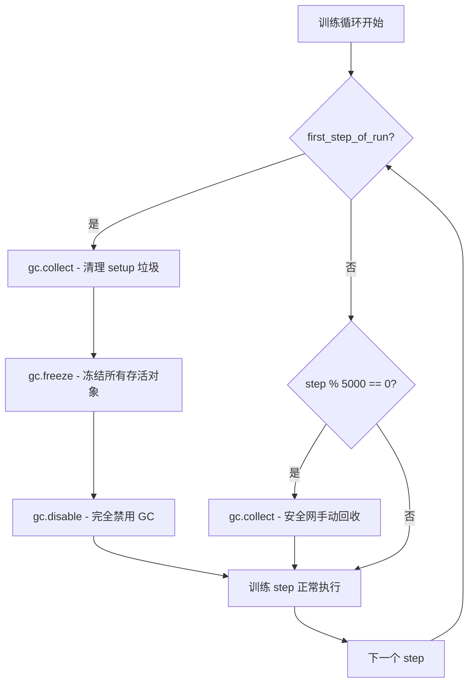
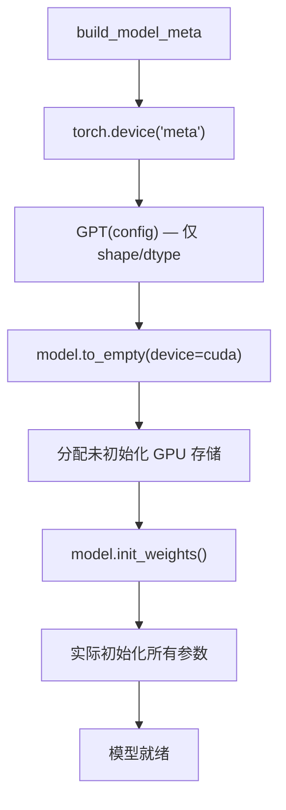

# PD-425.01 nanochat — 运行时内存管理五件套

> 文档编号：PD-425.01
> 来源：nanochat `scripts/base_train.py` `nanochat/gpt.py` `nanochat/fp8.py` `nanochat/dataloader.py`
> GitHub：https://github.com/karpathy/nanochat.git
> 问题域：PD-425 GC 与内存管理优化 Runtime Memory Optimization
> 状态：可复用方案

---

## 第 1 章 问题与动机

### 1.1 核心问题

大规模 LLM 训练中，运行时内存管理是一个被严重低估的性能瓶颈。具体表现为：

1. **Python GC 暂停**：CPython 的分代垃圾回收器在训练循环中会周期性触发 cycle detection，每次扫描耗时约 500ms。对于一个 step 仅需 200-400ms 的高效训练循环，这意味着 GC 可能吃掉 50% 以上的训练时间。
2. **GPU 显存碎片化**：PyTorch 的 CUDA 内存分配器默认使用固定大小的 segment，频繁的 alloc/free 导致碎片化，最终 OOM 即使总显存充足。
3. **模型初始化内存峰值**：传统的模型初始化在 CPU/GPU 上直接分配参数，对于大模型会产生巨大的内存峰值——即使这些参数随后会被覆盖。
4. **FP8 评估精度损失**：FP8 训练提速但评估时需要 BF16 精度，如何在两种精度间零拷贝切换是一个工程难题。
5. **数据加载 HtoD 传输开销**：频繁的小块 CPU→GPU 数据传输效率低下，需要 pinned memory 预分配来实现异步传输。

### 1.2 nanochat 的解法概述

nanochat（Karpathy 的最新 LLM 训练框架）实现了一套精细的运行时内存管理方案，包含五个互相配合的技术：

1. **手动 GC 三步曲**（`gc.collect → gc.freeze → gc.disable`）：在训练循环首个 step 后冻结所有存活对象并禁用 GC，消除 ~500ms 的周期性扫描暂停（`scripts/base_train.py:559-564`）
2. **expandable_segments 内存分配**：通过 `PYTORCH_ALLOC_CONF=expandable_segments:True` 让 CUDA 分配器使用可扩展段，减少显存碎片（`scripts/base_train.py:15`）
3. **meta device 延迟初始化**：在 meta device 上构建模型（仅 shape/dtype，零内存），再 `to_empty` 到目标设备，避免初始化内存峰值（`scripts/base_train.py:137-147`）
4. **FP8 模块运行时热切换**：通过 context manager 在评估时将 Float8Linear 临时替换为 nn.Linear（共享权重，零拷贝），确保评估精度（`scripts/base_train.py:191-235`）
5. **pinned memory 预分配 + 单次 HtoD 传输**：预分配 pinned CPU buffer 和 GPU buffer，将整个 batch 的 inputs+targets 合并为单次 HtoD 拷贝（`nanochat/dataloader.py:114-159`）

### 1.3 设计思想

| 设计原则 | 具体实现 | 理由 | 替代方案 |
|----------|----------|------|----------|
| 消除不可预测的暂停 | gc.freeze + gc.disable | GC 扫描 ~500ms 是训练循环中最大的非 GPU 开销 | 调整 GC 阈值（不够彻底） |
| 减少显存碎片 | expandable_segments:True | 固定 segment 导致碎片化 OOM | 手动 empty_cache（治标不治本） |
| 零内存初始化 | meta device + to_empty | 大模型初始化峰值可能超过设备内存 | CPU 初始化再 .to(device)（双倍内存） |
| 精度可切换 | Float8Linear ↔ nn.Linear 热切换 | FP8 训练 + BF16 评估，权重共享零拷贝 | 维护两份模型（浪费显存） |
| 最小化 HtoD 传输次数 | pinned buffer 预分配 + 单次 copy | 多次小传输的 PCIe 开销远大于单次大传输 | 每个 tensor 单独 .to(device)（多次传输） |

---

## 第 2 章 源码实现分析

### 2.1 架构概览

nanochat 的内存管理策略分布在训练生命周期的不同阶段：

```
┌─────────────────────────────────────────────────────────────────┐
│                    nanochat 内存管理时间线                        │
├─────────────────────────────────────────────────────────────────┤
│                                                                 │
│  启动阶段                                                        │
│  ├── PYTORCH_ALLOC_CONF=expandable_segments:True  (进程级)       │
│  ├── torch.device("meta") → GPT(config)           (零内存构建)   │
│  ├── model.to_empty(device=cuda)                  (分配未初始化)  │
│  └── model.init_weights()                         (实际初始化)    │
│                                                                 │
│  数据加载                                                        │
│  ├── pin_memory=True 预分配 CPU buffer                           │
│  ├── 预分配 GPU buffer                                           │
│  └── 单次 cpu_buffer → gpu_buffer copy                           │
│                                                                 │
│  训练循环                                                        │
│  ├── step 0: gc.collect → gc.freeze → gc.disable  (冻结+禁用GC)  │
│  ├── step 1..4999: 无 GC 开销                                    │
│  ├── step 5000: gc.collect (安全网)                               │
│  └── 评估时: disable_fp8 context manager (BF16 精度)             │
│                                                                 │
└─────────────────────────────────────────────────────────────────┘
```

### 2.2 核心实现

#### 2.2.1 GC 三步曲：collect → freeze → disable



对应源码 `scripts/base_train.py:556-564`：

```python
# The garbage collector is sadly a little bit overactive and for some poorly understood reason,
# it spends ~500ms scanning for cycles quite frequently, just to end up cleaning up very few tiny objects each time.
# So we manually manage and help it out here
if first_step_of_run:
    gc.collect() # manually collect a lot of garbage from setup
    gc.freeze() # immediately freeze all currently surviving objects and exclude them from GC
    gc.disable() # nuclear intervention here: disable GC entirely except:
elif step % 5000 == 0: # every 5000 steps...
    gc.collect() # manually collect, just to be safe for very, very long runs
```

同样的模式在 SFT 脚本中复现（`scripts/chat_sft.py:466-473`）：

```python
# The garbage collector spends ~500ms scanning for cycles quite frequently.
# We manually manage it to avoid these pauses during training.
if step == 1:
    gc.collect() # manually collect a lot of garbage from setup
    gc.freeze() # freeze all currently surviving objects and exclude them from GC
    gc.disable() # disable GC entirely except:
elif step % 5000 == 0: # every 5000 steps...
    gc.collect() # manually collect, just to be safe for very long runs
```

关键细节：
- `gc.freeze()` 将当前所有存活对象移入 permanent generation，后续 GC 扫描不再检查它们
- `gc.disable()` 完全禁用自动 GC，但 `gc.collect()` 仍可手动调用
- 每 5000 步手动 collect 一次作为安全网，防止极长训练中的内存泄漏

#### 2.2.2 meta device 延迟初始化



对应源码 `scripts/base_train.py:125-147`：

```python
def build_model_meta(depth):
    """Build a model on meta device for a given depth (shapes/dtypes only, no data)."""
    base_dim = depth * args.aspect_ratio
    model_dim = ((base_dim + args.head_dim - 1) // args.head_dim) * args.head_dim
    num_heads = model_dim // args.head_dim
    config = GPTConfig(
        sequence_len=args.max_seq_len, vocab_size=vocab_size,
        n_layer=depth, n_head=num_heads, n_kv_head=num_heads, n_embd=model_dim,
        window_pattern=args.window_pattern,
    )
    with torch.device("meta"):
        model_meta = GPT(config)
    return model_meta

# Build the model, move to device, init the weights
model = build_model_meta(args.depth) # 1) Build on meta device (only shapes/dtypes, no data)
model.to_empty(device=device) # 2) All tensors get storage on target device but with uninitialized (garbage) data
model.init_weights() # 3) All tensors get initialized
```

GPT 类的 `__init__` 中有明确的 footgun 警告（`nanochat/gpt.py:148-152`）：

```python
"""
NOTE a major footgun: this __init__ function runs in meta device context (!!)
Therefore, any calculations inside here are shapes and dtypes only, no actual data.
=> We actually initialize all data (parameters, buffers, etc.) in init_weights() instead.
"""
```

这个模式也被 `checkpoint_manager.py:100-105` 复用于模型加载：

```python
with torch.device("meta"):
    model = GPT(model_config)
model.to_empty(device=device)
model.init_weights()
model.load_state_dict(model_data, strict=True, assign=True)
```

### 2.3 实现细节

#### expandable_segments 配置

`scripts/base_train.py:15` 和 `scripts/chat_sft.py:15` 都在文件最顶部（import 之前）设置：

```python
import os
os.environ["PYTORCH_ALLOC_CONF"] = "expandable_segments:True"
```

必须在 `import torch` 之前设置，因为 CUDA 分配器在首次 import 时初始化。expandable_segments 让分配器使用可变大小的 segment 而非固定 2MB block，显著减少碎片化。

#### FP8 模块运行时热切换

`scripts/base_train.py:191-235` 实现了 `disable_fp8` context manager：

```python
@contextmanager
def disable_fp8(model):
    """Temporarily swap Float8Linear modules with nn.Linear for BF16 evaluation."""
    fp8_locations = []
    for name, module in model.named_modules():
        if 'Float8' in type(module).__name__:
            if '.' in name:
                parent_name, attr_name = name.rsplit('.', 1)
                parent = model.get_submodule(parent_name)
            else:
                parent = model
                attr_name = name
            fp8_locations.append((parent, attr_name, module))

    if not fp8_locations:
        yield
        return

    # Swap Float8Linear -> nn.Linear (shares the same weight tensor, no copy)
    for parent, attr_name, fp8_module in fp8_locations:
        linear = nn.Linear(
            fp8_module.in_features, fp8_module.out_features,
            bias=fp8_module.bias is not None,
            device=fp8_module.weight.device, dtype=fp8_module.weight.dtype,
        )
        linear.weight = fp8_module.weight  # share, don't copy
        if fp8_module.bias is not None:
            linear.bias = fp8_module.bias
        setattr(parent, attr_name, linear)
    try:
        yield
    finally:
        for parent, attr_name, fp8_module in fp8_locations:
            setattr(parent, attr_name, fp8_module)
```

核心技巧：`linear.weight = fp8_module.weight` 是引用赋值，不产生拷贝。评估完毕后 `setattr` 恢复原始 Float8Linear 模块。

#### FP8 模块的 meta device 构建

`nanochat/fp8.py:215-227` 中 `Float8Linear.from_float` 也使用 meta device 避免临时内存分配：

```python
@classmethod
def from_float(cls, mod):
    """Create Float8Linear from nn.Linear, sharing the same weight and bias."""
    with torch.device("meta"):
        new_mod = cls(mod.in_features, mod.out_features, bias=False)
    new_mod.weight = mod.weight
    new_mod.bias = mod.bias
    return new_mod
```

#### pinned memory 预分配与单次 HtoD 传输

`nanochat/dataloader.py:110-159` 实现了高效的数据加载管道：

```python
# Pre-allocate buffers once: layout is [inputs (B*T) | targets (B*T)]
use_cuda = device == "cuda"
row_buffer = torch.empty((B, row_capacity), dtype=torch.long)
cpu_buffer = torch.empty(2 * B * T, dtype=torch.long, pin_memory=use_cuda)
gpu_buffer = torch.empty(2 * B * T, dtype=torch.long, device=device)
cpu_inputs = cpu_buffer[:B * T].view(B, T)
cpu_targets = cpu_buffer[B * T:].view(B, T)
inputs = gpu_buffer[:B * T].view(B, T)
targets = gpu_buffer[B * T:].view(B, T)

# ... 填充 row_buffer ...

# Copy to pinned CPU buffer, then single HtoD transfer
cpu_inputs.copy_(row_buffer[:, :-1])
cpu_targets.copy_(row_buffer[:, 1:])
gpu_buffer.copy_(cpu_buffer, non_blocking=use_cuda)
yield inputs, targets, state_dict
```

设计要点：
- `pin_memory=True` 分配页锁定内存，支持 DMA 异步传输
- inputs 和 targets 在同一个连续 buffer 中，单次 `copy_` 完成全部 HtoD 传输
- `non_blocking=True` 允许 CPU 在传输期间继续工作

---

## 第 3 章 迁移指南

### 3.1 迁移清单

#### 阶段 1：GC 控制（立即可用，零依赖）

- [ ] 在训练循环首个 step 后添加 `gc.collect() → gc.freeze() → gc.disable()` 三步曲
- [ ] 添加周期性 `gc.collect()` 安全网（建议每 5000 步）
- [ ] 验证：对比添加前后单步训练时间的方差（GC 暂停会导致偶发的 ~500ms 尖峰）

#### 阶段 2：expandable_segments（一行配置）

- [ ] 在训练脚本最顶部（`import torch` 之前）添加 `os.environ["PYTORCH_ALLOC_CONF"] = "expandable_segments:True"`
- [ ] 验证：监控 `torch.cuda.max_memory_allocated()` 是否下降

#### 阶段 3：meta device 初始化（需要重构模型初始化）

- [ ] 将模型 `__init__` 中的参数初始化逻辑移到独立的 `init_weights()` 方法
- [ ] 使用 `with torch.device("meta"): model = Model(config)` 构建
- [ ] 调用 `model.to_empty(device=target_device)` 分配存储
- [ ] 调用 `model.init_weights()` 实际初始化
- [ ] 注意：`__init__` 中不能有任何依赖实际数据的计算（如 `torch.randn`）

#### 阶段 4：pinned memory 预分配（需要重构 dataloader）

- [ ] 预分配 `pin_memory=True` 的 CPU buffer
- [ ] 预分配 GPU buffer
- [ ] 将 inputs 和 targets 打包到连续 buffer 中
- [ ] 使用 `gpu_buffer.copy_(cpu_buffer, non_blocking=True)` 单次传输

#### 阶段 5：FP8 热切换（可选，需要 H100+）

- [ ] 实现 `disable_fp8` context manager
- [ ] 在评估/采样时使用 `with disable_fp8(model):` 包裹
- [ ] 确保 Float8Linear.from_float 使用 meta device 避免临时分配

### 3.2 适配代码模板

#### GC 控制模板（可直接复用）

```python
import gc

def train_loop(model, dataloader, optimizer, num_iterations):
    """训练循环，含 GC 管理。"""
    for step in range(num_iterations):
        # --- 训练 step ---
        loss = model(x, y)
        loss.backward()
        optimizer.step()
        optimizer.zero_grad(set_to_none=True)

        # --- GC 管理 ---
        if step == 0:
            # 首个 step 后：清理 setup 垃圾 → 冻结存活对象 → 禁用 GC
            gc.collect()
            gc.freeze()
            gc.disable()
        elif step % 5000 == 0:
            # 安全网：每 5000 步手动回收一次
            gc.collect()
```

#### meta device 初始化模板

```python
import torch

class MyModel(nn.Module):
    def __init__(self, config):
        super().__init__()
        # 注意：在 meta device 上下文中，这里只定义 shape/dtype
        # 不要在这里做任何依赖实际数据的计算
        self.linear = nn.Linear(config.d_model, config.d_model, bias=False)
        self.norm = nn.LayerNorm(config.d_model)

    @torch.no_grad()
    def init_weights(self):
        """在实际设备上初始化所有参数。"""
        for name, param in self.named_parameters():
            if 'weight' in name and param.ndim >= 2:
                torch.nn.init.xavier_uniform_(param)
            elif 'bias' in name:
                torch.nn.init.zeros_(param)

# 使用方式：
with torch.device("meta"):
    model = MyModel(config)           # 零内存
model.to_empty(device="cuda")         # 分配未初始化存储
model.init_weights()                  # 实际初始化
```

#### pinned memory dataloader 模板

```python
import torch

def create_efficient_dataloader(batch_size, seq_len, device):
    """预分配 pinned + GPU buffer，单次 HtoD 传输。"""
    use_cuda = device.type == "cuda"
    B, T = batch_size, seq_len

    # 预分配 buffer（整个训练期间复用）
    cpu_buffer = torch.empty(2 * B * T, dtype=torch.long, pin_memory=use_cuda)
    gpu_buffer = torch.empty(2 * B * T, dtype=torch.long, device=device)

    # 创建 view（零拷贝）
    cpu_inputs = cpu_buffer[:B * T].view(B, T)
    cpu_targets = cpu_buffer[B * T:].view(B, T)
    gpu_inputs = gpu_buffer[:B * T].view(B, T)
    gpu_targets = gpu_buffer[B * T:].view(B, T)

    while True:
        # 填充 cpu_inputs 和 cpu_targets ...
        fill_batch(cpu_inputs, cpu_targets)

        # 单次 HtoD 传输
        gpu_buffer.copy_(cpu_buffer, non_blocking=use_cuda)
        yield gpu_inputs, gpu_targets
```

### 3.3 适用场景

| 场景 | 适用度 | 说明 |
|------|--------|------|
| 大规模 LLM 预训练 | ⭐⭐⭐ | 所有五项技术都直接适用 |
| SFT / RLHF 微调 | ⭐⭐⭐ | GC 控制 + expandable_segments 收益最大 |
| 推理服务 | ⭐⭐ | meta device 初始化 + expandable_segments 有用，GC 控制收益较小 |
| 小模型训练（<1B） | ⭐⭐ | GC 控制仍有收益，其他技术收益递减 |
| CPU-only 训练 | ⭐ | 仅 GC 控制适用，其余为 CUDA 特定 |

---

## 第 4 章 测试用例

```python
import gc
import time
import unittest
from unittest.mock import patch, MagicMock
import torch
import torch.nn as nn


class TestGCManagement(unittest.TestCase):
    """测试 GC 三步曲的正确性。"""

    def test_gc_freeze_disable_eliminates_pauses(self):
        """验证 gc.freeze + gc.disable 后不再自动触发 GC。"""
        # 创建一些循环引用对象模拟 setup 阶段
        objects = []
        for _ in range(1000):
            a, b = {}, {}
            a['ref'] = b
            b['ref'] = a
            objects.append(a)
        del objects

        # 执行三步曲
        gc.collect()
        gc.freeze()
        gc.disable()

        # 验证 GC 已禁用
        assert not gc.isenabled(), "GC should be disabled after gc.disable()"

        # 创建更多循环引用——不应触发自动回收
        before_count = gc.get_count()
        for _ in range(10000):
            a, b = {}, {}
            a['ref'] = b
            b['ref'] = a

        # 手动 collect 仍然可用
        collected = gc.collect()
        assert collected > 0, "Manual gc.collect should still work"

        # 清理：重新启用 GC
        gc.enable()

    def test_periodic_collect_safety_net(self):
        """验证周期性 gc.collect 能回收累积垃圾。"""
        gc.collect()
        gc.freeze()
        gc.disable()

        # 模拟长时间训练中的垃圾累积
        for _ in range(10000):
            a, b = [], []
            a.append(b)
            b.append(a)

        # 安全网 collect
        collected = gc.collect()
        assert collected > 0, "Safety net collect should reclaim accumulated garbage"

        gc.enable()


class TestMetaDeviceInit(unittest.TestCase):
    """测试 meta device 延迟初始化模式。"""

    def test_meta_device_no_memory(self):
        """验证 meta device 上的模型不占用实际内存。"""
        with torch.device("meta"):
            linear = nn.Linear(1024, 1024, bias=False)

        # meta tensor 没有实际存储
        assert linear.weight.device.type == "meta"
        assert linear.weight.storage().size() == 0

    def test_to_empty_allocates_storage(self):
        """验证 to_empty 分配存储但不初始化。"""
        with torch.device("meta"):
            linear = nn.Linear(64, 64, bias=False)

        linear.to_empty(device="cpu")
        assert linear.weight.device.type == "cpu"
        assert linear.weight.storage().size() > 0

    def test_full_meta_init_workflow(self):
        """验证完整的 meta → to_empty → init_weights 流程。"""
        class SimpleModel(nn.Module):
            def __init__(self):
                super().__init__()
                self.fc = nn.Linear(32, 32, bias=False)

            @torch.no_grad()
            def init_weights(self):
                torch.nn.init.ones_(self.fc.weight)

        with torch.device("meta"):
            model = SimpleModel()
        assert model.fc.weight.device.type == "meta"

        model.to_empty(device="cpu")
        model.init_weights()
        assert torch.all(model.fc.weight == 1.0)


class TestExpandableSegments(unittest.TestCase):
    """测试 expandable_segments 配置。"""

    def test_env_var_set_before_torch(self):
        """验证环境变量在 torch import 前设置的模式。"""
        import os
        # 模拟 nanochat 的设置方式
        os.environ["PYTORCH_ALLOC_CONF"] = "expandable_segments:True"
        val = os.environ.get("PYTORCH_ALLOC_CONF", "")
        assert "expandable_segments:True" in val


class TestFP8HotSwap(unittest.TestCase):
    """测试 FP8 模块运行时热切换。"""

    def test_disable_fp8_context_manager(self):
        """验证 disable_fp8 正确替换和恢复模块。"""
        from contextlib import contextmanager

        @contextmanager
        def disable_fp8(model):
            """简化版 disable_fp8，用于测试。"""
            fp8_locations = []
            for name, module in model.named_modules():
                if 'Mock' in type(module).__name__:
                    if '.' in name:
                        parent_name, attr_name = name.rsplit('.', 1)
                        parent = model.get_submodule(parent_name)
                    else:
                        parent = model
                        attr_name = name
                    fp8_locations.append((parent, attr_name, module))

            for parent, attr_name, fp8_module in fp8_locations:
                linear = nn.Linear(16, 16, bias=False)
                setattr(parent, attr_name, linear)
            try:
                yield
            finally:
                for parent, attr_name, fp8_module in fp8_locations:
                    setattr(parent, attr_name, fp8_module)

        # 创建一个简单模型
        model = nn.Sequential(nn.Linear(16, 16))
        original_type = type(model[0])

        # 验证 context manager 不影响普通 Linear
        with disable_fp8(model):
            assert type(model[0]) == original_type
        assert type(model[0]) == original_type


if __name__ == "__main__":
    unittest.main()
```

---

## 第 5 章 跨域关联

| 关联域 | 关系类型 | 说明 |
|--------|----------|------|
| PD-416 混合精度训练 | 协同 | FP8 热切换是混合精度策略的运行时管理层面；nanochat 的 Float8Linear 自定义实现（`nanochat/fp8.py`）替代了 torchao 的 2000 行方案 |
| PD-420 高效数据加载 | 协同 | pinned memory 预分配和单次 HtoD 传输是数据加载效率的内存管理基础；`nanochat/dataloader.py` 的 buffer 预分配直接服务于数据加载管道 |
| PD-415 分布式训练 | 依赖 | GC 控制在 DDP 场景下尤为重要——一个 rank 的 GC 暂停会导致所有 rank 在 all-reduce 时等待；expandable_segments 在多 GPU 场景下减少每张卡的碎片化 |
| PD-422 LLM 训练流水线 | 协同 | 五项内存管理技术贯穿训练流水线的不同阶段（初始化→数据加载→训练循环→评估），是流水线效率的底层保障 |

---

## 第 6 章 来源文件索引

| 文件 | 行范围 | 关键实现 |
|------|--------|----------|
| `scripts/base_train.py` | L15 | `PYTORCH_ALLOC_CONF=expandable_segments:True` 环境变量设置 |
| `scripts/base_train.py` | L125-147 | meta device 模型构建 + to_empty + init_weights 三步流程 |
| `scripts/base_train.py` | L191-235 | `disable_fp8` context manager：Float8Linear ↔ nn.Linear 热切换 |
| `scripts/base_train.py` | L556-564 | GC 三步曲：collect → freeze → disable + 周期性安全网 |
| `scripts/chat_sft.py` | L15 | expandable_segments 配置（SFT 脚本复现） |
| `scripts/chat_sft.py` | L279 | SFT dataloader 的 pin_memory 使用 |
| `scripts/chat_sft.py` | L466-473 | GC 三步曲（SFT 脚本复现） |
| `nanochat/gpt.py` | L147-152 | GPT.__init__ meta device footgun 警告文档 |
| `nanochat/gpt.py` | L188-241 | init_weights() 实际参数初始化（与 meta device 配合） |
| `nanochat/fp8.py` | L193-227 | Float8Linear 类 + from_float 的 meta device 构建 |
| `nanochat/fp8.py` | L243-266 | convert_to_float8_training 模块树遍历替换 |
| `nanochat/dataloader.py` | L110-160 | pinned memory 预分配 + 单次 HtoD 传输管道 |
| `nanochat/checkpoint_manager.py` | L100-105 | 模型加载时的 meta device 初始化复用 |

---

## 第 7 章 横向对比维度

> **重要：** 本章用于自动填充 Butcher Wiki 的横向对比表。
> 必须严格按以下 JSON 格式输出，放在 `comparison_data` 代码块中。

```json comparison_data
{
  "project": "nanochat",
  "dimensions": {
    "GC 策略": "三步曲 collect→freeze→disable + 每5000步安全网collect",
    "显存分配": "expandable_segments 可扩展段，进程启动时环境变量配置",
    "模型初始化": "meta device 零内存构建 → to_empty → init_weights 三阶段",
    "精度切换": "Float8Linear↔nn.Linear context manager 热切换，权重共享零拷贝",
    "数据传输": "pinned memory 预分配 + inputs/targets 连续buffer 单次 HtoD copy"
  }
}
```

### 域元数据补充

```json domain_metadata
{
  "solution_summary": "nanochat 实现五件套内存管理：GC 三步曲(collect→freeze→disable)消除500ms暂停、expandable_segments减碎片、meta device零内存初始化、FP8↔BF16热切换、pinned buffer单次HtoD传输",
  "description": "训练循环中 Python GC 暂停与 GPU 显存碎片的系统性消除方案",
  "sub_problems": [
    "pinned memory 预分配与单次 HtoD 批量传输",
    "FP8 评估时的模块级精度回退"
  ],
  "best_practices": [
    "expandable_segments 必须在 import torch 之前通过环境变量设置",
    "meta device __init__ 中禁止任何依赖实际数据的计算，参数初始化必须移到独立方法",
    "FP8↔BF16 切换通过 weight 引用赋值实现零拷贝，不维护两份模型"
  ]
}
```
