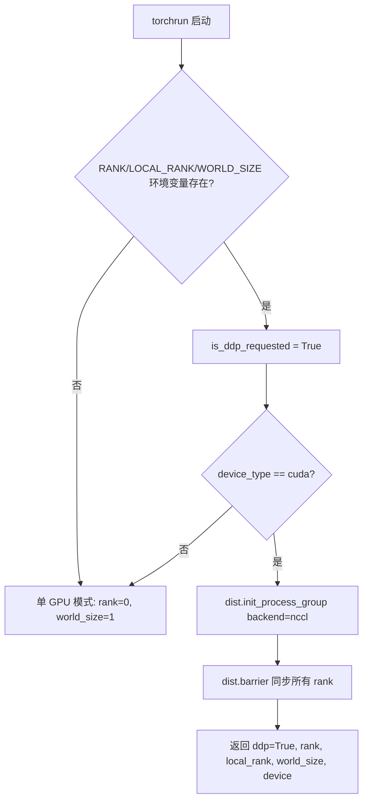
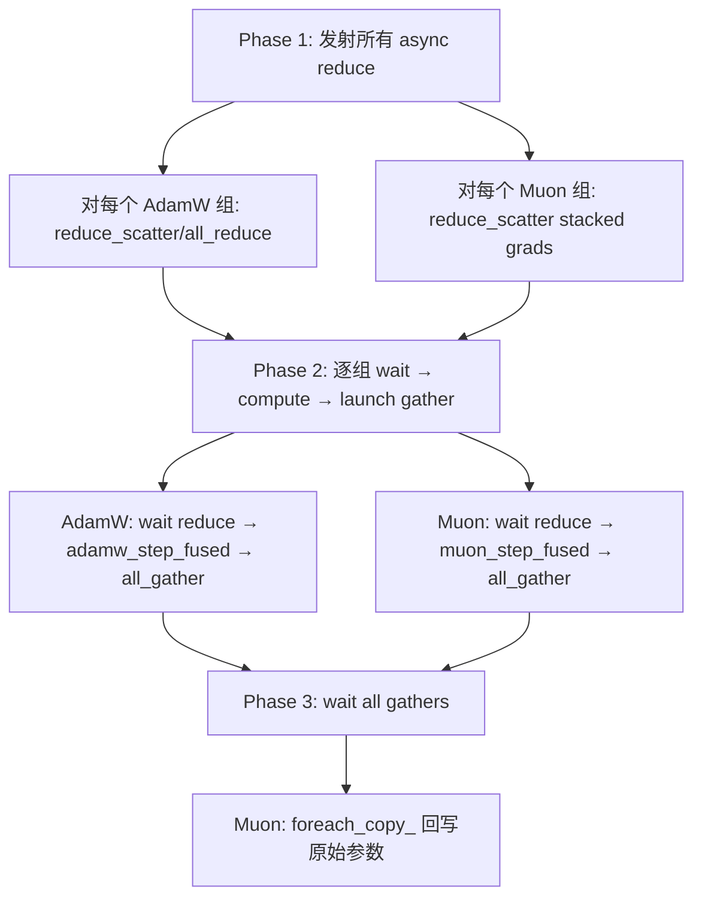
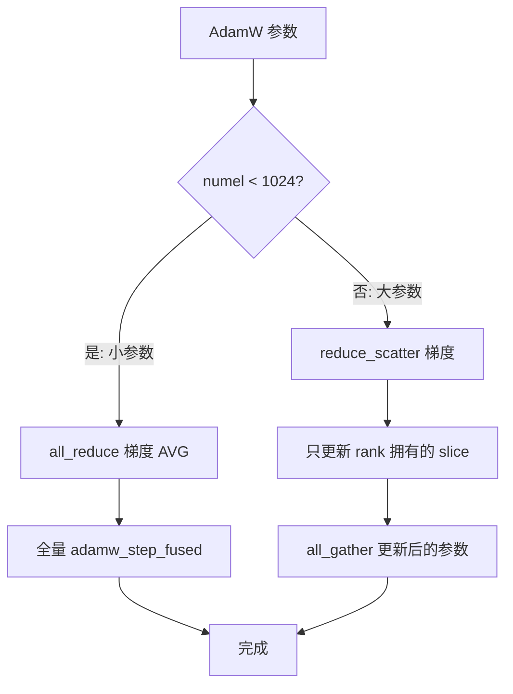

# PD-426.03 nanochat — 三阶段异步 DDP 与 ZeRO-2 优化器状态分片

> 文档编号：PD-426.03
> 来源：nanochat `nanochat/optim.py`, `nanochat/common.py`, `scripts/base_train.py`
> GitHub：https://github.com/karpathy/nanochat.git
> 问题域：PD-426 分布式训练编排 Distributed Training Orchestration
> 状态：可复用方案

---

## 第 1 章 问题与动机

### 1.1 核心问题

分布式训练面临三个核心矛盾：

1. **通信延迟 vs 计算效率**：多 GPU 间梯度同步（all_reduce/reduce_scatter）会阻塞计算，GPU 利用率下降。传统 PyTorch DDP 在 backward 结束后同步梯度，通信和计算完全串行。
2. **内存墙 vs 模型规模**：每个 rank 保存完整的优化器状态（AdamW 需要 2 倍参数量的 exp_avg + exp_avg_sq），8 GPU 训练时 7/8 的优化器内存是冗余的。
3. **单机 vs 多机切换成本**：代码需要在单 GPU 调试和多 GPU 训练之间无缝切换，不能有两套完全不同的代码路径。

### 1.2 nanochat 的解法概述

nanochat 不使用 PyTorch 内置的 DDP wrapper，而是在自定义优化器 `DistMuonAdamW` 中手动管理所有分布式通信，实现了：

1. **三阶段异步通信**（`nanochat/optim.py:508-533`）：Phase 1 发射所有 async reduce → Phase 2 逐组 wait+compute+launch gather → Phase 3 wait gathers + copy back，最大化计算-通信重叠
2. **ZeRO-2 风格优化器分片**（`nanochat/optim.py:369-384`）：大参数用 reduce_scatter 分片梯度，每个 rank 只维护 1/N 的优化器状态；小参数（<1024 元素）用 all_reduce 避免分片开销
3. **Muon 参数按 shape 分组 + 跨 rank 分片**（`nanochat/optim.py:387-406`）：同 shape 参数 stack 成单个张量做 reduce_scatter，按 chunk 分配给各 rank
4. **单 GPU / 多 GPU 自动切换**（`nanochat/gpt.py:382`）：`setup_optimizer` 根据 `get_dist_info()` 自动选择 `MuonAdamW` 或 `DistMuonAdamW`
5. **多 rank checkpoint 分片保存**（`nanochat/checkpoint_manager.py:42-59`）：模型参数由 rank 0 保存，优化器状态每个 rank 独立保存为 `optim_XXXXXX_rankN.pt`

### 1.3 设计思想

| 设计原则 | 具体实现 | 理由 | 替代方案 |
|----------|----------|------|----------|
| 通信-计算重叠 | 三阶段 async：reduce→compute→gather 流水线 | GPU 在等待通信时继续计算下一组参数 | PyTorch DDP 的 backward hook（粒度粗，不可控） |
| 内存效率 | 大参数 reduce_scatter + 分片状态，小参数 all_reduce + 复制状态 | 大参数节省 (N-1)/N 优化器内存，小参数避免分片开销 | 全量 all_reduce（简单但浪费内存） |
| 零抽象开销 | 不用 DDP wrapper，直接在 optimizer.step() 中管理通信 | 完全控制通信时机和 buffer 复用 | torch.nn.parallel.DistributedDataParallel |
| 环境自适应 | torchrun 环境变量检测 + 工厂模式选择优化器 | 同一份训练脚本，单卡/多卡零修改 | 条件分支散落在训练循环各处 |
| Buffer 复用 | Muon 的 stacked_grads buffer 在 gather 阶段复用为 stacked_params | 避免同时分配两个大 buffer | 分别分配（多用一倍显存） |

---

## 第 2 章 源码实现分析

### 2.1 架构概览

nanochat 的分布式训练架构绕过了 PyTorch DDP，将所有通信逻辑内聚到 `DistMuonAdamW` 优化器中：

```
┌─────────────────────────────────────────────────────────────────┐
│                    scripts/base_train.py                        │
│  torchrun --nproc_per_node=8 -m scripts.base_train              │
│                                                                 │
│  ┌──────────────┐   ┌──────────────┐   ┌──────────────────────┐ │
│  │ compute_init │──→│ GPT.setup_   │──→│ DistMuonAdamW        │ │
│  │ (DDP detect) │   │ optimizer()  │   │ (3-phase async comm) │ │
│  └──────────────┘   └──────────────┘   └──────────────────────┘ │
│         │                                        │              │
│         ▼                                        ▼              │
│  ┌──────────────┐                    ┌──────────────────────┐   │
│  │ NCCL backend │                    │ checkpoint_manager   │   │
│  │ init_process │                    │ rank-sharded save    │   │
│  │ _group()     │                    │ /load                │   │
│  └──────────────┘                    └──────────────────────┘   │
└─────────────────────────────────────────────────────────────────┘
```

关键设计：**没有 DDP wrapper**。模型不被 `DistributedDataParallel` 包裹，forward/backward 完全是本地操作。所有跨 rank 通信集中在 `optimizer.step()` 的三个阶段中。

### 2.2 核心实现

#### 2.2.1 环境检测与进程组初始化



对应源码 `nanochat/common.py:116-188`：

```python
def is_ddp_requested() -> bool:
    """True if launched by torchrun (env present), even before init."""
    return all(k in os.environ for k in ("RANK", "LOCAL_RANK", "WORLD_SIZE"))

def compute_init(device_type="cuda"):
    is_ddp_requested, ddp_rank, ddp_local_rank, ddp_world_size = get_dist_info()
    if is_ddp_requested and device_type == "cuda":
        device = torch.device("cuda", ddp_local_rank)
        torch.cuda.set_device(device)
        dist.init_process_group(backend="nccl", device_id=device)
        dist.barrier()
    else:
        device = torch.device(device_type)
    return is_ddp_requested, ddp_rank, ddp_local_rank, ddp_world_size, device
```

#### 2.2.2 DistMuonAdamW 三阶段异步通信

这是整个分布式训练的核心。`DistMuonAdamW.step()` 将一次优化步骤拆成三个阶段：



对应源码 `nanochat/optim.py:507-533`：

```python
@torch.no_grad()
def step(self):
    rank = dist.get_rank()
    world_size = dist.get_world_size()

    # Phase 1: launch all async reduce ops
    reduce_infos: list[dict] = []
    for group in self.param_groups:
        if group['kind'] == 'adamw':
            reduce_infos.append(self._reduce_adamw(group, world_size))
        elif group['kind'] == 'muon':
            reduce_infos.append(self._reduce_muon(group, world_size))

    # Phase 2: wait for reduces, compute updates, launch gathers
    gather_list: list[dict] = []
    for group, info in zip(self.param_groups, reduce_infos):
        if group['kind'] == 'adamw':
            self._compute_adamw(group, info, gather_list, rank, world_size)
        elif group['kind'] == 'muon':
            self._compute_muon(group, info, gather_list, rank)

    # Phase 3: wait for gathers, copy back
    self._finish_gathers(gather_list)
```

#### 2.2.3 AdamW 的 ZeRO-2 分片策略



对应源码 `nanochat/optim.py:369-384`（reduce 阶段）和 `nanochat/optim.py:408-447`（compute 阶段）：

```python
def _reduce_adamw(self, group: dict, world_size: int) -> dict:
    param_infos = {}
    for p in group['params']:
        grad = p.grad
        if p.numel() < 1024:
            # Small params: all_reduce (no scatter/gather needed)
            future = dist.all_reduce(grad, op=dist.ReduceOp.AVG, async_op=True).get_future()
            param_infos[p] = dict(future=future, grad_slice=grad, is_small=True)
        else:
            # Large params: reduce_scatter
            rank_size = grad.shape[0] // world_size
            grad_slice = torch.empty_like(grad[:rank_size])
            future = dist.reduce_scatter_tensor(
                grad_slice, grad, op=dist.ReduceOp.AVG, async_op=True
            ).get_future()
            param_infos[p] = dict(future=future, grad_slice=grad_slice, is_small=False)
    return dict(param_infos=param_infos)
```

### 2.3 实现细节

#### Muon 参数的跨 rank 分片与 Buffer 复用

Muon 组的所有参数必须同 shape（由 `setup_optimizer` 按 shape 分组保证）。分布式通信时：

1. 将 K 个参数 stack 成 `(K, *shape)` 张量
2. Zero-pad 到 `ceil(K/N) * N` 使其能被 world_size 整除
3. `reduce_scatter` 后每个 rank 得到 `chunk_size` 个参数的梯度
4. 每个 rank 只对自己拥有的 chunk 执行 `muon_step_fused`
5. `all_gather` 时复用 `stacked_grads` buffer 作为输出（`nanochat/optim.py:494-496`）

```python
# Reuse stacked_grads buffer for all_gather output
stacked_params = info["stacked_grads"]
future = dist.all_gather_into_tensor(stacked_params, updated_params, async_op=True).get_future()
```

这个 buffer 复用技巧节省了一个 `(padded_num_params, *shape)` 大小的显存分配。

#### 梯度累积

梯度累积在训练循环中实现（`scripts/base_train.py:389-396`），不在优化器内部：

```python
tokens_per_fwdbwd = args.device_batch_size * args.max_seq_len
world_tokens_per_fwdbwd = tokens_per_fwdbwd * ddp_world_size
grad_accum_steps = total_batch_size // world_tokens_per_fwdbwd
# ...
for micro_step in range(grad_accum_steps):
    loss = model(x, y)
    loss = loss / grad_accum_steps
    loss.backward()
```

注意：由于没有 DDP wrapper，backward 不会触发任何通信。所有梯度累积完成后，`optimizer.step()` 一次性处理通信+更新。

#### 多 rank Checkpoint 分片保存

`checkpoint_manager.py:42-59` 实现了分角色保存：

- **rank 0**：保存 `model_XXXXXX.pt`（完整模型参数）+ `meta_XXXXXX.json`（元数据）
- **所有 rank**：各自保存 `optim_XXXXXX_rankN.pt`（该 rank 的优化器状态分片）

恢复时每个 rank 加载自己的优化器分片（`scripts/base_train.py:156`）。


---

## 第 3 章 迁移指南

### 3.1 迁移清单

**阶段 1：环境检测与进程组管理**

- [ ] 实现 `is_ddp_requested()` 和 `get_dist_info()` 工具函数
- [ ] 实现 `compute_init()` 统一初始化（设备检测 + NCCL 进程组 + barrier）
- [ ] 实现 `compute_cleanup()` 销毁进程组
- [ ] 实现 `print0()` 仅 rank 0 打印

**阶段 2：分布式优化器**

- [ ] 将参数按类型分组（矩阵参数 vs 标量/embedding 参数）
- [ ] 实现三阶段 step()：async reduce → wait+compute+launch gather → wait gathers
- [ ] 大参数用 reduce_scatter + 分片状态，小参数用 all_reduce
- [ ] 工厂模式：根据 `is_ddp_requested` 选择单机/分布式优化器

**阶段 3：Checkpoint 分片**

- [ ] rank 0 保存模型参数和元数据
- [ ] 每个 rank 独立保存优化器状态分片
- [ ] 恢复时每个 rank 加载对应的分片文件

### 3.2 适配代码模板

以下是一个可直接复用的三阶段分布式优化器骨架：

```python
import torch
import torch.distributed as dist
from torch import Tensor

class ThreePhaseDistOptimizer(torch.optim.Optimizer):
    """
    三阶段异步分布式优化器模板。
    Phase 1: 发射所有 async reduce
    Phase 2: 逐组 wait → compute → launch gather
    Phase 3: wait gathers → copy back
    """

    def __init__(self, param_groups: list[dict]):
        super().__init__(param_groups, defaults={})

    def _reduce_group(self, group: dict, world_size: int) -> dict:
        """Phase 1: 发射 async reduce 操作"""
        infos = {}
        for p in group['params']:
            grad = p.grad
            if p.numel() < 1024:
                # 小参数: all_reduce，不分片
                fut = dist.all_reduce(grad, op=dist.ReduceOp.AVG, async_op=True).get_future()
                infos[p] = dict(future=fut, grad_slice=grad, is_small=True)
            else:
                # 大参数: reduce_scatter，分片梯度
                chunk = grad.shape[0] // world_size
                grad_slice = torch.empty_like(grad[:chunk])
                fut = dist.reduce_scatter_tensor(
                    grad_slice, grad, op=dist.ReduceOp.AVG, async_op=True
                ).get_future()
                infos[p] = dict(future=fut, grad_slice=grad_slice, is_small=False)
        return infos

    def _compute_and_gather(self, group: dict, infos: dict,
                            gather_list: list, rank: int, world_size: int):
        """Phase 2: wait reduce → compute update → launch gather"""
        for p in group['params']:
            info = infos[p]
            info['future'].wait()

            if info['is_small']:
                p_slice = p
            else:
                chunk = p.shape[0] // world_size
                p_slice = p[rank * chunk:(rank + 1) * chunk]

            state = self.state[p]
            if not state:
                state['step'] = 0
                state['exp_avg'] = torch.zeros_like(p_slice)
                state['exp_avg_sq'] = torch.zeros_like(p_slice)
            state['step'] += 1

            # --- 在此插入你的优化器更新逻辑 ---
            self._update_param(p_slice, info['grad_slice'], state, group)

            if not info['is_small']:
                fut = dist.all_gather_into_tensor(
                    p, p_slice, async_op=True
                ).get_future()
                gather_list.append(dict(future=fut))

    def _update_param(self, p, grad, state, group):
        """单参数更新逻辑，子类覆写"""
        raise NotImplementedError

    @torch.no_grad()
    def step(self):
        rank = dist.get_rank()
        world_size = dist.get_world_size()

        # Phase 1
        all_infos = []
        for group in self.param_groups:
            all_infos.append(self._reduce_group(group, world_size))

        # Phase 2
        gather_list = []
        for group, infos in zip(self.param_groups, all_infos):
            self._compute_and_gather(group, infos, gather_list, rank, world_size)

        # Phase 3
        for info in gather_list:
            info['future'].wait()
```

Checkpoint 分片保存/加载模板：

```python
def save_sharded_checkpoint(checkpoint_dir, step, model_state, optim_state, meta, rank):
    os.makedirs(checkpoint_dir, exist_ok=True)
    if rank == 0:
        torch.save(model_state, f"{checkpoint_dir}/model_{step:06d}.pt")
        with open(f"{checkpoint_dir}/meta_{step:06d}.json", "w") as f:
            json.dump(meta, f, indent=2)
    # 每个 rank 保存自己的优化器分片
    torch.save(optim_state, f"{checkpoint_dir}/optim_{step:06d}_rank{rank}.pt")

def load_sharded_checkpoint(checkpoint_dir, step, device, rank):
    model_data = torch.load(f"{checkpoint_dir}/model_{step:06d}.pt", map_location=device)
    optim_data = torch.load(f"{checkpoint_dir}/optim_{step:06d}_rank{rank}.pt", map_location=device)
    with open(f"{checkpoint_dir}/meta_{step:06d}.json") as f:
        meta = json.load(f)
    return model_data, optim_data, meta
```

### 3.3 适用场景

| 场景 | 适用度 | 说明 |
|------|--------|------|
| 单机多卡训练（1-8 GPU） | ⭐⭐⭐ | nanochat 的核心场景，torchrun 一行命令切换 |
| 自定义优化器需要精细通信控制 | ⭐⭐⭐ | 不用 DDP wrapper，完全控制通信时机 |
| 需要 ZeRO-2 级别内存优化 | ⭐⭐⭐ | 大参数分片状态，小参数全量复制 |
| 多节点跨机训练 | ⭐⭐ | 架构支持但 nanochat 未验证跨机场景 |
| 需要 ZeRO-3（参数分片） | ⭐ | 当前只分片优化器状态，不分片参数本身 |
| 异构 GPU 混合训练 | ⭐ | 假设所有 rank 同构，shape[0] 需整除 world_size |

---

## 第 4 章 测试用例

```python
import pytest
import torch
import os
from unittest.mock import patch, MagicMock

# ============================================================
# 测试 1: 环境检测逻辑
# ============================================================

class TestDDPDetection:
    """测试 torchrun 环境变量检测"""

    def test_ddp_requested_with_env(self):
        """torchrun 设置了 RANK/LOCAL_RANK/WORLD_SIZE 时返回 True"""
        with patch.dict(os.environ, {"RANK": "0", "LOCAL_RANK": "0", "WORLD_SIZE": "4"}):
            from nanochat.common import is_ddp_requested
            assert is_ddp_requested() is True

    def test_ddp_not_requested_without_env(self):
        """普通 python 启动时返回 False"""
        env = {k: v for k, v in os.environ.items()
               if k not in ("RANK", "LOCAL_RANK", "WORLD_SIZE")}
        with patch.dict(os.environ, env, clear=True):
            from nanochat.common import is_ddp_requested
            assert is_ddp_requested() is False

    def test_get_dist_info_single_gpu(self):
        """单 GPU 模式返回 rank=0, world_size=1"""
        env = {k: v for k, v in os.environ.items()
               if k not in ("RANK", "LOCAL_RANK", "WORLD_SIZE")}
        with patch.dict(os.environ, env, clear=True):
            from nanochat.common import get_dist_info
            ddp, rank, local_rank, world_size = get_dist_info()
            assert ddp is False
            assert rank == 0
            assert world_size == 1


# ============================================================
# 测试 2: 优化器工厂选择
# ============================================================

class TestOptimizerFactory:
    """测试根据 DDP 状态自动选择优化器"""

    def test_single_gpu_uses_muon_adamw(self):
        """单 GPU 应选择 MuonAdamW"""
        from nanochat.optim import MuonAdamW, DistMuonAdamW
        with patch.dict(os.environ, {}, clear=False):
            # 移除 DDP 环境变量
            for k in ("RANK", "LOCAL_RANK", "WORLD_SIZE"):
                os.environ.pop(k, None)
            from nanochat.common import get_dist_info
            ddp, *_ = get_dist_info()
            Factory = DistMuonAdamW if ddp else MuonAdamW
            assert Factory is MuonAdamW


# ============================================================
# 测试 3: AdamW 分片阈值
# ============================================================

class TestAdamWSharding:
    """测试 AdamW 参数的大小分片阈值"""

    def test_small_param_threshold(self):
        """< 1024 元素的参数应走 all_reduce 路径"""
        numel = 512
        assert numel < 1024  # 走 all_reduce

    def test_large_param_threshold(self):
        """>= 1024 元素的参数应走 reduce_scatter 路径"""
        numel = 1024
        assert numel >= 1024  # 走 reduce_scatter

    def test_large_param_divisibility(self):
        """大参数的 shape[0] 必须能被 world_size 整除"""
        world_size = 8
        shape_0 = 32768
        assert shape_0 % world_size == 0


# ============================================================
# 测试 4: Checkpoint 分片文件命名
# ============================================================

class TestCheckpointNaming:
    """测试 checkpoint 文件命名规范"""

    def test_model_filename(self):
        step = 1000
        expected = "model_001000.pt"
        assert f"model_{step:06d}.pt" == expected

    def test_optimizer_filename_per_rank(self):
        step, rank = 1000, 3
        expected = "optim_001000_rank3.pt"
        assert f"optim_{step:06d}_rank{rank:d}.pt" == expected

    def test_meta_filename(self):
        step = 1000
        expected = "meta_001000.json"
        assert f"meta_{step:06d}.json" == expected
```


---

## 第 5 章 跨域关联

| 关联域 | 关系类型 | 说明 |
|--------|----------|------|
| PD-427 混合精度训练 | 协同 | nanochat 的 `muon_step_fused` 在 Polar Express 阶段强制转 bfloat16（`optim.py:115`），分布式通信的张量也是 bf16，混合精度与分布式通信紧密耦合 |
| PD-428 Scaling Laws 自动化 | 协同 | `base_train.py:258-299` 根据模型规模自动计算最优 batch size 和学习率，这些参数直接影响梯度累积步数和分布式通信频率 |
| PD-432 高级优化器 | 依赖 | `DistMuonAdamW` 是 `MuonAdamW` 的分布式版本，Muon 的 Polar Express 正交化和 NorMuon 方差归约是核心算法，分布式只是通信层 |
| PD-431 高效数据加载 | 协同 | 训练循环中 `next(train_loader)` 在 GPU 做 forward/backward 时预取下一批数据（`base_train.py:499`），与分布式通信形成三级流水线 |
| PD-425 运行时内存优化 | 协同 | ZeRO-2 分片直接减少优化器内存；GC 管理（`base_train.py:559-564`）通过 `gc.freeze()` + `gc.disable()` 避免 GC 扫描开销 |

---

## 第 6 章 来源文件索引

| 文件 | 行范围 | 关键实现 |
|------|--------|----------|
| `nanochat/optim.py` | L1-8 | 模块说明：MuonAdamW 和 DistMuonAdamW 两个版本 |
| `nanochat/optim.py` | L20-49 | `adamw_step_fused`：torch.compile 编译的 AdamW 融合内核 |
| `nanochat/optim.py` | L90-147 | `muon_step_fused`：Nesterov 动量 → Polar Express → 方差归约 → 谨慎更新 |
| `nanochat/optim.py` | L152-291 | `MuonAdamW`：单 GPU 版本，参数按 shape stack 后批量更新 |
| `nanochat/optim.py` | L297-533 | `DistMuonAdamW`：分布式版本，三阶段异步通信 + ZeRO-2 分片 |
| `nanochat/optim.py` | L369-384 | `_reduce_adamw`：大/小参数分流的 reduce 策略 |
| `nanochat/optim.py` | L387-406 | `_reduce_muon`：stack + zero-pad + reduce_scatter |
| `nanochat/optim.py` | L449-497 | `_compute_muon`：分片计算 + buffer 复用 all_gather |
| `nanochat/optim.py` | L499-505 | `_finish_gathers`：等待 gather 完成 + foreach_copy_ 回写 |
| `nanochat/common.py` | L116-121 | `is_ddp_requested`：torchrun 环境变量检测 |
| `nanochat/common.py` | L130-141 | `get_dist_info`：获取 rank/world_size 信息 |
| `nanochat/common.py` | L142-151 | `autodetect_device_type`：CUDA → MPS → CPU 降级链 |
| `nanochat/common.py` | L153-188 | `compute_init`：进程组初始化 + NCCL backend |
| `nanochat/gpt.py` | L348-386 | `setup_optimizer`：参数分组 + 工厂模式选择优化器 |
| `nanochat/checkpoint_manager.py` | L42-59 | `save_checkpoint`：rank 0 存模型，所有 rank 存优化器分片 |
| `nanochat/checkpoint_manager.py` | L61-74 | `load_checkpoint`：按 rank 加载对应优化器分片 |
| `scripts/base_train.py` | L87-88 | `compute_init` 调用 + master_process 判断 |
| `scripts/base_train.py` | L389-396 | 梯度累积步数计算 |
| `scripts/base_train.py` | L493-510 | 训练循环：micro-step 累积 → optimizer.step() → zero_grad |
| `scripts/base_train.py` | L460-482 | checkpoint 保存（含 rank 参数） |
| `scripts/base_train.py` | L559-564 | GC 管理：freeze + disable 避免扫描开销 |

---

## 第 7 章 横向对比维度

> **重要：** 本章用于自动填充 Butcher Wiki 的横向对比表。

```json comparison_data
{
  "project": "nanochat",
  "dimensions": {
    "通信架构": "三阶段异步：reduce_scatter→compute→all_gather 流水线，不用 DDP wrapper",
    "优化器分片": "ZeRO-2 风格：大参数 reduce_scatter 分片状态，小参数 all_reduce 全量",
    "梯度累积": "训练循环 micro-step 累积，loss /= accum_steps 后 backward",
    "设备检测": "torchrun 环境变量三元组检测 + CUDA→MPS→CPU 自动降级",
    "Checkpoint 策略": "rank 0 存模型+元数据，每个 rank 独立存优化器分片",
    "Buffer 复用": "Muon stacked_grads buffer 在 gather 阶段复用为 stacked_params"
  }
}
```

### 域元数据补充

```json domain_metadata
{
  "solution_summary": "nanochat 用 DistMuonAdamW 三阶段异步通信(reduce_scatter→compute→all_gather)替代 DDP wrapper，实现 ZeRO-2 优化器分片与计算-通信重叠",
  "description": "自定义优化器内聚通信逻辑，绕过 DDP wrapper 实现精细化分布式控制",
  "sub_problems": [
    "大/小参数分流通信策略（阈值判定）",
    "同 shape 参数 stack 批量通信",
    "通信 buffer 复用减少显存分配",
    "GC freeze/disable 避免训练中垃圾回收开销"
  ],
  "best_practices": [
    "小参数(<1024元素)用 all_reduce 避免分片开销，大参数用 reduce_scatter 分片",
    "同 shape 参数 stack 成单张量做一次 reduce_scatter 减少通信次数",
    "复用 reduce 输入 buffer 作为 gather 输出 buffer 节省显存",
    "工厂模式根据环境变量自动选择单机/分布式优化器，训练脚本零修改"
  ]
}
```

