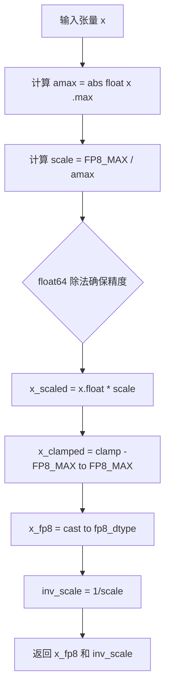
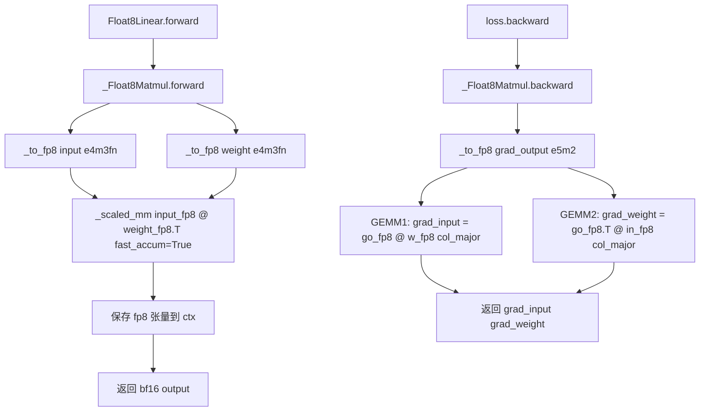
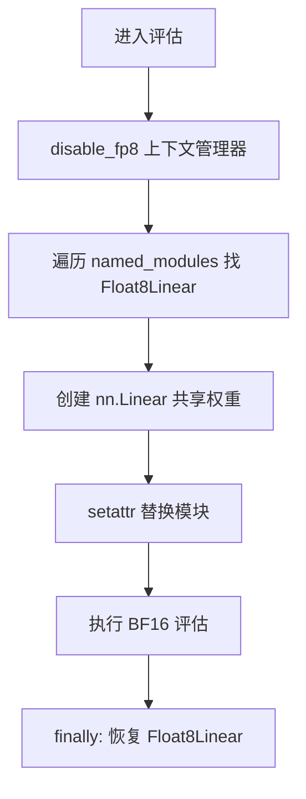

# PD-427.01 nanochat — 极简 FP8 训练：~150 行替代 torchao ~2000 行

> 文档编号：PD-427.01
> 来源：nanochat `nanochat/fp8.py`, `scripts/base_train.py`
> GitHub：https://github.com/karpathy/nanochat.git
> 问题域：PD-427 混合精度与 FP8 训练 Mixed Precision & FP8 Training
> 状态：可复用方案

---

## 第 1 章 问题与动机

### 1.1 核心问题

FP8 训练可以将 GPU 矩阵乘法吞吐量提升约 2 倍（H100 上 FP8 GEMM 峰值 ~3958 TFLOPS vs BF16 ~1979 TFLOPS），但现有的 FP8 训练库（如 torchao/float8）代码量庞大（~2000 行），引入了 tensor subclass 架构、`__torch_dispatch__` 分发表、DTensor 集成、FSDP float8 all-gather 等大量抽象层。对于单节点训练场景，这些抽象是不必要的复杂度。

核心矛盾：**FP8 训练的底层原语（`torch._scaled_mm` + `float8` dtype）已经是 PyTorch 内置的**，torchao 只是在这些原语之上做编排。能否直接调用这些原语，用最少的代码实现 FP8 训练？

### 1.2 nanochat 的解法概述

nanochat 用 ~150 行 Python 实现了完整的 FP8 训练，核心思路：

1. **单一 autograd.Function 封装三个 FP8 GEMM** — `_Float8Matmul` 类在 forward 中执行 `output = input @ weight.T`，在 backward 中执行 `grad_input = grad_output @ weight` 和 `grad_weight = grad_output.T @ input`，每个 GEMM 都先量化到 FP8 再调用 `torch._scaled_mm`（`nanochat/fp8.py:123-190`）

2. **tensorwise 动态缩放** — 每次 GEMM 前计算 `scale = FP8_MAX / max(|tensor|)`，一个标量缩放整个张量。比 rowwise（每行一个 scale）更快，因为 cuBLAS 内核原生支持 tensorwise 缩放（`nanochat/fp8.py:80-105`）

3. **`@allow_in_graph` 标记** — 让 `torch.compile` 将整个 FP8 matmul 视为一个不透明节点，避免 dynamo 尝试分解内部操作（`nanochat/fp8.py:122`）

4. **`Float8Linear` 即插即用替换** — 继承 `nn.Linear`，通过 `from_float()` 类方法零拷贝共享权重，`convert_to_float8_training()` 递归替换模型中所有符合条件的 Linear 层（`nanochat/fp8.py:193-266`）

5. **评估时 BF16 回退** — `disable_fp8()` 上下文管理器在评估时临时将 `Float8Linear` 换回 `nn.Linear`，确保评估精度不受 FP8 量化影响（`scripts/base_train.py:191-235`）

### 1.3 设计思想

| 设计原则 | 具体实现 | 理由 | 替代方案 |
|----------|----------|------|----------|
| 极简主义 | 150 行替代 2000 行 torchao | 单节点训练不需要 DTensor/FSDP 集成 | torchao 全量引入 |
| 直接调用原语 | `torch._scaled_mm` + `float8` dtype | 这些是 PyTorch 内置的，不需要中间层 | tensor subclass + dispatch table |
| 不透明编译节点 | `@allow_in_graph` 标记 autograd.Function | 避免 dynamo 分解开销，编译更快 | tensor subclass 让 Inductor 看到所有内部 op |
| 零拷贝转换 | `from_float()` 用 meta device 创建壳再共享权重 | 不额外分配内存 | 深拷贝权重到新模块 |
| 前向/反向不同精度 | forward 用 e4m3fn（高精度），backward 梯度用 e5m2（大范围） | 梯度值域更大需要更多指数位 | 统一用 e4m3fn |
| 前向快速累加 | forward `use_fast_accum=True`，backward `use_fast_accum=False` | forward 速度优先，backward 精度优先 | 全部 True 或全部 False |

---

## 第 2 章 源码实现分析

### 2.1 架构概览

nanochat 的 FP8 训练架构分为三层：量化原语层、autograd 封装层、模块替换层。

```
┌─────────────────────────────────────────────────────────┐
│                  Training Loop (base_train.py)           │
│  autocast(bf16) → model(x,y) → loss.backward()          │
│                                                          │
│  ┌─────────────────────────────────────────────────────┐ │
│  │           Float8Linear (nn.Linear 子类)              │ │
│  │  forward(): flatten → _Float8Matmul.apply() → bias  │ │
│  │  from_float(): meta device 零拷贝转换                │ │
│  │                                                      │ │
│  │  ┌──────────────────────────────────────────────┐   │ │
│  │  │     _Float8Matmul (autograd.Function)         │   │ │
│  │  │  @allow_in_graph — torch.compile 不透明节点    │   │ │
│  │  │                                               │   │ │
│  │  │  forward:  _to_fp8(input, e4m3)               │   │ │
│  │  │            _to_fp8(weight, e4m3)              │   │ │
│  │  │            _scaled_mm(fast_accum=True)         │   │ │
│  │  │                                               │   │ │
│  │  │  backward: _to_fp8(grad, e5m2)                │   │ │
│  │  │            _scaled_mm(weight, fast_accum=False)│   │ │
│  │  │            _scaled_mm(input, fast_accum=False) │   │ │
│  │  └──────────────────────────────────────────────┘   │ │
│  │                                                      │ │
│  │  ┌──────────────────────────────────────────────┐   │ │
│  │  │     _to_fp8() — tensorwise 动态量化            │   │ │
│  │  │  amax = abs(x).max()                          │   │ │
│  │  │  scale = FP8_MAX / amax  (float64 除法)        │   │ │
│  │  │  x_fp8 = clamp(x * scale).to(fp8_dtype)       │   │ │
│  │  │  return (x_fp8, 1/scale)                       │   │ │
│  │  └──────────────────────────────────────────────┘   │ │
│  └─────────────────────────────────────────────────────┘ │
│                                                          │
│  convert_to_float8_training(): 递归替换 nn.Linear        │
│  disable_fp8(): 评估时临时换回 nn.Linear                  │
└─────────────────────────────────────────────────────────┘
```

### 2.2 核心实现

#### 2.2.1 tensorwise 动态量化函数



对应源码 `nanochat/fp8.py:79-105`：

```python
@torch.no_grad()
def _to_fp8(x, fp8_dtype):
    """Dynamically quantize a tensor to FP8 using tensorwise scaling."""
    fp8_max = torch.finfo(fp8_dtype).max
    # Compute the max absolute value across the entire tensor
    amax = x.float().abs().max()
    # Scale maps [0, amax] -> [0, fp8_max]. Use float64 for the division to
    # ensure consistent numerics between torch.compile and eager mode.
    scale = fp8_max / amax.double().clamp(min=EPS)
    scale = scale.float()
    # Quantize: scale into FP8 range, saturate, then cast to FP8
    x_scaled = x.float() * scale
    x_clamped = x_scaled.clamp(-fp8_max, fp8_max)
    x_fp8 = x_clamped.to(fp8_dtype)
    # _scaled_mm expects the *inverse* of our scale
    inv_scale = scale.reciprocal()
    return x_fp8, inv_scale
```

关键细节：
- `amax.double().clamp(min=EPS)` — 用 float64 做除法，确保 `torch.compile` 和 eager 模式数值一致（`fp8.py:94`）
- `clamp(-fp8_max, fp8_max)` — 饱和截断而非溢出包裹，PyTorch 默认 cast 行为是 wrap 而非 saturate（`fp8.py:100`）
- 返回 `inv_scale` 而非 `scale` — `_scaled_mm` 内部用逆缩放因子将 FP8 值还原到原始范围（`fp8.py:103-104`）

#### 2.2.2 三路 FP8 GEMM 的 autograd.Function



对应源码 `nanochat/fp8.py:119-190`：

```python
@torch._dynamo.allow_in_graph
class _Float8Matmul(torch.autograd.Function):
    @staticmethod
    def forward(ctx, input_2d, weight):
        # Quantize both operands to e4m3 (higher precision format)
        input_fp8, input_inv = _to_fp8(input_2d, torch.float8_e4m3fn)
        weight_fp8, weight_inv = _to_fp8(weight, torch.float8_e4m3fn)
        ctx.save_for_backward(input_fp8, input_inv, weight_fp8, weight_inv)
        output = torch._scaled_mm(
            input_fp8, weight_fp8.t(),
            scale_a=input_inv, scale_b=weight_inv,
            out_dtype=input_2d.dtype,
            use_fast_accum=True,  # forward: speed > precision
        )
        return output

    @staticmethod
    def backward(ctx, grad_output):
        in_fp8, in_inv, w_fp8, w_inv = ctx.saved_tensors
        # GEMM 1: grad_input = grad_output @ weight
        go_fp8, go_inv = _to_fp8(grad_output, torch.float8_e5m2)
        w_col = _to_col_major(w_fp8)
        grad_input = torch._scaled_mm(
            go_fp8, w_col,
            scale_a=go_inv, scale_b=w_inv,
            out_dtype=grad_output.dtype,
            use_fast_accum=False,  # backward: precision > speed
        )
        # GEMM 2: grad_weight = grad_output.T @ input
        go_T = go_fp8.t().contiguous()
        in_col = _to_col_major(in_fp8)
        grad_weight = torch._scaled_mm(
            go_T, in_col,
            scale_a=go_inv, scale_b=in_inv,
            out_dtype=grad_output.dtype,
            use_fast_accum=False,
        )
        return grad_input, grad_weight
```

关键细节：
- **内存布局管理** — `_scaled_mm` 的 cuBLAS FP8 内核要求第一个参数 row-major、第二个参数 column-major。`weight_fp8.t()` 天然是 column-major 无需拷贝，但 backward 中 `w_fp8` 是 row-major 需要 `_to_col_major()` 转换（`fp8.py:108-116`）
- **forward 保存 FP8 张量** — `ctx.save_for_backward` 保存的是已量化的 FP8 张量而非原始 bf16 张量，节省显存（`fp8.py:135`）
- **梯度用 e5m2** — 梯度值域比激活值更大，需要 5 位指数（范围 ±57344）而非 4 位指数（范围 ±448）（`fp8.py:161`）

### 2.3 实现细节

#### 2.3.1 模块转换与过滤

`convert_to_float8_training()` 递归遍历模型树，将符合条件的 `nn.Linear` 替换为 `Float8Linear`（`fp8.py:243-266`）。过滤条件在 `base_train.py:174-181` 定义：

```python
def fp8_module_filter(mod: nn.Module, fqn: str) -> bool:
    if not isinstance(mod, nn.Linear):
        return False
    if mod.in_features % 16 != 0 or mod.out_features % 16 != 0:
        return False  # H100 FP8 硬件要求：维度必须是 16 的倍数
    if min(mod.in_features, mod.out_features) < 128:
        return False  # 太小的层 FP8 开销大于收益
    return True
```

#### 2.3.2 评估时精度切换



`disable_fp8()` 上下文管理器（`base_train.py:191-235`）在评估时临时将所有 `Float8Linear` 换回标准 `nn.Linear`，确保评估使用 BF16 精度。关键设计：新建的 `nn.Linear` 通过 `linear.weight = fp8_module.weight` 共享权重张量，不产生内存拷贝。

训练循环中的使用方式（`base_train.py:408`）：

```python
with disable_fp8(model), autocast_ctx:
    val_bpb = evaluate_bpb(model, val_loader, eval_steps, token_bytes)
```

#### 2.3.3 与 torch.compile 的交互

`@torch._dynamo.allow_in_graph` 装饰器（`fp8.py:122`）告诉 dynamo 不要尝试 trace `_Float8Matmul` 内部。这意味着：
- torch.compile 将整个 FP8 linear 视为一个不透明节点
- Inductor 可以优化 FP8 linear 周围的操作（attention、norm 等），但不能跨 FP8 边界融合
- 编译开销更小（不需要处理 tensor subclass dispatch），实际运行略快
- eager 模式和 compile 模式数值完全一致（bitwise identical）

torchao 的方案则让 Inductor 看到所有内部 op（amax、scale、cast、_scaled_mm），理论上可以跨边界融合，但编译开销更大且可能产生不同的浮点舍入路径。

---

## 第 3 章 迁移指南

### 3.1 迁移清单

**阶段 1：基础 FP8 支持（~30 分钟）**

- [ ] 复制 `nanochat/fp8.py` 到你的项目（~150 行，零外部依赖）
- [ ] 确认 GPU 支持 FP8（H100/H200/B100+，compute capability >= 8.9）
- [ ] 确认 PyTorch >= 2.1（`torch._scaled_mm` 可用）

**阶段 2：集成到训练循环（~1 小时）**

- [ ] 在模型初始化后、`torch.compile` 前调用 `convert_to_float8_training()`
- [ ] 编写 `module_filter_fn` 过滤不适合 FP8 的层（维度 < 128 或不是 16 的倍数）
- [ ] 实现 `disable_fp8()` 上下文管理器用于评估
- [ ] 在评估/采样代码中包裹 `with disable_fp8(model):`

**阶段 3：验证与调优**

- [ ] 对比 FP8 vs BF16 的 validation loss 曲线，确认收敛性
- [ ] 监控 MFU（Model FLOPS Utilization）提升
- [ ] 检查 `torch.compile` 是否正常工作（无 graph break）

### 3.2 适配代码模板

以下是一个完整的可运行的 FP8 训练集成模板：

```python
import torch
import torch.nn as nn
from contextlib import contextmanager

# ============================================================
# 1. FP8 量化原语（直接从 nanochat/fp8.py 复制）
# ============================================================

EPS = 1e-12

@torch.no_grad()
def _to_fp8(x, fp8_dtype):
    fp8_max = torch.finfo(fp8_dtype).max
    amax = x.float().abs().max()
    scale = fp8_max / amax.double().clamp(min=EPS)
    scale = scale.float()
    x_fp8 = (x.float() * scale).clamp(-fp8_max, fp8_max).to(fp8_dtype)
    return x_fp8, scale.reciprocal()

def _to_col_major(x):
    return x.t().contiguous().t()

@torch._dynamo.allow_in_graph
class _Float8Matmul(torch.autograd.Function):
    @staticmethod
    def forward(ctx, input_2d, weight):
        input_fp8, input_inv = _to_fp8(input_2d, torch.float8_e4m3fn)
        weight_fp8, weight_inv = _to_fp8(weight, torch.float8_e4m3fn)
        ctx.save_for_backward(input_fp8, input_inv, weight_fp8, weight_inv)
        return torch._scaled_mm(
            input_fp8, weight_fp8.t(),
            scale_a=input_inv, scale_b=weight_inv,
            out_dtype=input_2d.dtype, use_fast_accum=True,
        )

    @staticmethod
    def backward(ctx, grad_output):
        in_fp8, in_inv, w_fp8, w_inv = ctx.saved_tensors
        go_fp8, go_inv = _to_fp8(grad_output, torch.float8_e5m2)
        grad_input = torch._scaled_mm(
            go_fp8, _to_col_major(w_fp8),
            scale_a=go_inv, scale_b=w_inv,
            out_dtype=grad_output.dtype, use_fast_accum=False,
        )
        grad_weight = torch._scaled_mm(
            go_fp8.t().contiguous(), _to_col_major(in_fp8),
            scale_a=go_inv, scale_b=in_inv,
            out_dtype=grad_output.dtype, use_fast_accum=False,
        )
        return grad_input, grad_weight

class Float8Linear(nn.Linear):
    def forward(self, input):
        if torch.is_autocast_enabled():
            input = input.to(torch.get_autocast_gpu_dtype())
        orig_shape = input.shape
        input_2d = input.reshape(-1, orig_shape[-1])
        output = _Float8Matmul.apply(input_2d, self.weight)
        output = output.reshape(*orig_shape[:-1], output.shape[-1])
        if self.bias is not None:
            output = output + self.bias.to(output.dtype)
        return output

    @classmethod
    def from_float(cls, mod):
        with torch.device("meta"):
            new_mod = cls(mod.in_features, mod.out_features, bias=False)
        new_mod.weight = mod.weight
        new_mod.bias = mod.bias
        return new_mod

# ============================================================
# 2. 集成到你的训练代码
# ============================================================

def convert_to_float8_training(module, module_filter_fn=None):
    """递归替换 nn.Linear → Float8Linear"""
    def _convert(mod, prefix=""):
        for name, child in mod.named_children():
            fqn = f"{prefix}.{name}" if prefix else name
            _convert(child, fqn)
            if isinstance(child, nn.Linear) and not isinstance(child, Float8Linear):
                if module_filter_fn is None or module_filter_fn(child, fqn):
                    setattr(mod, name, Float8Linear.from_float(child))
    _convert(module)
    return module

@contextmanager
def disable_fp8(model):
    """评估时临时切回 BF16"""
    fp8_locs = []
    for name, module in model.named_modules():
        if isinstance(module, Float8Linear):
            parent_name, attr = name.rsplit('.', 1) if '.' in name else ('', name)
            parent = model.get_submodule(parent_name) if parent_name else model
            fp8_locs.append((parent, attr, module))
    for parent, attr, fp8_mod in fp8_locs:
        linear = nn.Linear(fp8_mod.in_features, fp8_mod.out_features,
                           bias=fp8_mod.bias is not None,
                           device=fp8_mod.weight.device, dtype=fp8_mod.weight.dtype)
        linear.weight = fp8_mod.weight
        if fp8_mod.bias is not None:
            linear.bias = fp8_mod.bias
        setattr(parent, attr, linear)
    try:
        yield
    finally:
        for parent, attr, fp8_mod in fp8_locs:
            setattr(parent, attr, fp8_mod)

# ============================================================
# 3. 使用示例
# ============================================================

# 初始化模型后、compile 前
def fp8_filter(mod, fqn):
    return (mod.in_features % 16 == 0 and mod.out_features % 16 == 0
            and min(mod.in_features, mod.out_features) >= 128)

# model = YourModel()
# convert_to_float8_training(model, module_filter_fn=fp8_filter)
# model = torch.compile(model)

# 训练时正常使用
# with torch.amp.autocast("cuda", dtype=torch.bfloat16):
#     loss = model(x, y)
# loss.backward()

# 评估时切回 BF16
# with disable_fp8(model), torch.amp.autocast("cuda", dtype=torch.bfloat16):
#     val_loss = evaluate(model, val_loader)
```

### 3.3 适用场景

| 场景 | 适用度 | 说明 |
|------|--------|------|
| 单节点 H100 训练 | ⭐⭐⭐ | 最佳场景，~150 行即可获得 ~2x GEMM 加速 |
| 多节点 FSDP 训练 | ⭐ | 不支持 float8 all-gather，需要 torchao |
| 推理加速 | ⭐⭐ | 可用但推理通常用 INT8/INT4 量化更合适 |
| A100 GPU | ⭐ | A100 不支持 FP8 硬件，无法使用 |
| 小模型（< 100M 参数） | ⭐ | FP8 量化开销可能抵消 GEMM 加速 |
| 大模型单节点（1-10B） | ⭐⭐⭐ | 理想场景，GEMM 占比高，FP8 收益大 |

---

## 第 4 章 测试用例

```python
import pytest
import torch
import torch.nn as nn

# 假设 fp8.py 已复制到项目中
from your_project.fp8 import (
    _to_fp8, _to_col_major, _Float8Matmul,
    Float8Linear, convert_to_float8_training
)


@pytest.mark.skipif(
    not torch.cuda.is_available() or
    torch.cuda.get_device_capability()[0] < 9,
    reason="FP8 requires H100+ (compute capability >= 9.0)"
)
class TestFP8Core:
    """核心 FP8 功能测试"""

    def test_to_fp8_roundtrip_precision(self):
        """量化-反量化的精度损失应在合理范围内"""
        x = torch.randn(256, 256, device="cuda", dtype=torch.bfloat16)
        x_fp8, inv_scale = _to_fp8(x, torch.float8_e4m3fn)
        # 反量化
        x_reconstructed = x_fp8.float() * inv_scale
        # e4m3 有 3 位尾数，相对误差应 < 10%
        rel_error = (x_reconstructed - x.float()).abs() / (x.float().abs() + 1e-8)
        assert rel_error.mean() < 0.1, f"Mean relative error too high: {rel_error.mean()}"

    def test_to_fp8_zero_tensor(self):
        """全零张量不应导致除零错误"""
        x = torch.zeros(64, 64, device="cuda", dtype=torch.bfloat16)
        x_fp8, inv_scale = _to_fp8(x, torch.float8_e4m3fn)
        assert not torch.isnan(inv_scale), "inv_scale should not be NaN for zero tensor"
        assert not torch.isinf(inv_scale), "inv_scale should not be Inf for zero tensor"

    def test_to_fp8_dtype_selection(self):
        """e4m3fn 和 e5m2 应返回对应的 dtype"""
        x = torch.randn(64, 64, device="cuda", dtype=torch.bfloat16)
        x_e4m3, _ = _to_fp8(x, torch.float8_e4m3fn)
        x_e5m2, _ = _to_fp8(x, torch.float8_e5m2)
        assert x_e4m3.dtype == torch.float8_e4m3fn
        assert x_e5m2.dtype == torch.float8_e5m2

    def test_col_major_layout(self):
        """_to_col_major 应产生 column-major 步幅"""
        x = torch.randn(32, 64, device="cuda")
        x_col = _to_col_major(x)
        assert x_col.shape == x.shape
        # column-major: stride[0] == 1, stride[1] == nrows
        assert x_col.stride(0) == 1
        assert x_col.stride(1) == 32

    def test_float8_matmul_forward_shape(self):
        """FP8 matmul 输出形状应正确"""
        B, K, N = 32, 256, 512
        input_2d = torch.randn(B, K, device="cuda", dtype=torch.bfloat16)
        weight = torch.randn(N, K, device="cuda", dtype=torch.bfloat16)
        output = _Float8Matmul.apply(input_2d, weight)
        assert output.shape == (B, N)
        assert output.dtype == torch.bfloat16

    def test_float8_matmul_gradient_flow(self):
        """FP8 matmul 应正确传播梯度"""
        B, K, N = 16, 128, 256
        input_2d = torch.randn(B, K, device="cuda", dtype=torch.bfloat16, requires_grad=True)
        weight = torch.randn(N, K, device="cuda", dtype=torch.bfloat16, requires_grad=True)
        output = _Float8Matmul.apply(input_2d, weight)
        loss = output.sum()
        loss.backward()
        assert input_2d.grad is not None
        assert weight.grad is not None
        assert input_2d.grad.shape == (B, K)
        assert weight.grad.shape == (N, K)

    def test_float8_matmul_vs_bf16_accuracy(self):
        """FP8 matmul 结果应与 BF16 matmul 接近"""
        B, K, N = 32, 256, 512
        input_2d = torch.randn(B, K, device="cuda", dtype=torch.bfloat16)
        weight = torch.randn(N, K, device="cuda", dtype=torch.bfloat16)
        # BF16 参考
        ref_output = input_2d @ weight.t()
        # FP8
        fp8_output = _Float8Matmul.apply(input_2d, weight)
        # 相对误差应 < 5%（FP8 量化引入的误差）
        rel_error = (fp8_output - ref_output).abs() / (ref_output.abs() + 1e-8)
        assert rel_error.mean() < 0.05


class TestFloat8Linear:
    """Float8Linear 模块测试"""

    @pytest.mark.skipif(
        not torch.cuda.is_available() or
        torch.cuda.get_device_capability()[0] < 9,
        reason="FP8 requires H100+"
    )
    def test_from_float_shares_weight(self):
        """from_float 应共享权重而非拷贝"""
        linear = nn.Linear(256, 512, bias=True, device="cuda")
        fp8_linear = Float8Linear.from_float(linear)
        assert fp8_linear.weight is linear.weight
        assert fp8_linear.bias is linear.bias

    @pytest.mark.skipif(
        not torch.cuda.is_available() or
        torch.cuda.get_device_capability()[0] < 9,
        reason="FP8 requires H100+"
    )
    def test_convert_to_float8_training_filter(self):
        """convert 应尊重 filter 函数，跳过小层"""
        model = nn.Sequential(
            nn.Linear(256, 512),  # 应转换
            nn.Linear(8, 16),     # 应跳过（太小）
        ).cuda()
        def fp8_filter(mod, fqn):
            return min(mod.in_features, mod.out_features) >= 128
        convert_to_float8_training(model, module_filter_fn=fp8_filter)
        assert isinstance(model[0], Float8Linear)
        assert not isinstance(model[1], Float8Linear)

    @pytest.mark.skipif(
        not torch.cuda.is_available() or
        torch.cuda.get_device_capability()[0] < 9,
        reason="FP8 requires H100+"
    )
    def test_float8_linear_3d_input(self):
        """Float8Linear 应正确处理 3D 输入（batch, seq, dim）"""
        linear = nn.Linear(256, 512, device="cuda", dtype=torch.bfloat16)
        fp8_linear = Float8Linear.from_float(linear)
        x = torch.randn(4, 32, 256, device="cuda", dtype=torch.bfloat16)
        output = fp8_linear(x)
        assert output.shape == (4, 32, 512)
```

---

## 第 5 章 跨域关联

| 关联域 | 关系类型 | 说明 |
|--------|----------|------|
| PD-426 分布式训练 | 互斥/限制 | nanochat 的极简 FP8 方案不支持 FSDP float8 all-gather，多节点分布式训练需要 torchao 的完整实现 |
| PD-431 高效数据加载 | 协同 | FP8 加速 GEMM 后，数据加载可能成为新瓶颈，需要异步预取配合 |
| PD-432 高级优化器 | 协同 | nanochat 的 FP8 与 Muon+AdamW 混合优化器协同工作，FP8 只影响 matmul 不影响优化器状态精度 |
| PD-422 LLM 训练流水线 | 依赖 | FP8 转换必须在 `torch.compile` 之前完成，是训练流水线初始化阶段的关键步骤 |
| PD-425 运行时内存优化 | 协同 | FP8 forward 保存量化后的 FP8 张量（1 byte/element vs 2 bytes/element for bf16），减少 backward 的激活内存 |

---

## 第 6 章 来源文件索引

| 文件 | 行范围 | 关键实现 |
|------|--------|----------|
| `nanochat/fp8.py` | L1-L70 | 模块文档：FP8 训练原理、dtype 选择、与 torchao 对比 |
| `nanochat/fp8.py` | L76-L105 | `_to_fp8()` tensorwise 动态量化函数 |
| `nanochat/fp8.py` | L108-L116 | `_to_col_major()` 内存布局转换 |
| `nanochat/fp8.py` | L119-L190 | `_Float8Matmul` autograd.Function（三路 FP8 GEMM） |
| `nanochat/fp8.py` | L193-L228 | `Float8Linear` 即插即用 nn.Linear 替换 |
| `nanochat/fp8.py` | L230-L240 | `Float8LinearConfig` API 兼容层 |
| `nanochat/fp8.py` | L243-L266 | `convert_to_float8_training()` 递归模块替换 |
| `scripts/base_train.py` | L46-L47 | `--fp8` 和 `--fp8-recipe` CLI 参数定义 |
| `scripts/base_train.py` | L164-L188 | FP8 初始化：import、filter、convert、统计 |
| `scripts/base_train.py` | L191-L235 | `disable_fp8()` 评估时 BF16 回退上下文管理器 |
| `scripts/base_train.py` | L408 | 评估时使用 `with disable_fp8(model), autocast_ctx:` |
| `scripts/base_train.py` | L427 | CORE metric 评估时同样 disable FP8 |
| `scripts/base_train.py` | L454 | 采样时 disable FP8 |
| `runs/speedrun.sh` | L73 | 生产配置：`--fp8` 标志启用 FP8 训练 |

---

## 第 7 章 横向对比维度

> **重要：** 本章用于自动填充 Butcher Wiki 的横向对比表。
> 必须严格按以下 JSON 格式输出，放在 `comparison_data` 代码块中。

```json comparison_data
{
  "project": "nanochat",
  "dimensions": {
    "协议标准": "直接调用 PyTorch 内置 torch._scaled_mm + float8 dtype，无外部依赖",
    "能力声明": "仅支持 tensorwise 缩放，不支持 rowwise/axiswise",
    "通信方式": "autograd.Function 封装三路 GEMM，@allow_in_graph 不透明编译",
    "部署模式": "单文件 ~150 行即插即用，替换 nn.Linear 零拷贝",
    "执行适配": "module_filter_fn 过滤不适合 FP8 的层（维度 < 128 或非 16 倍数）",
    "量化策略": "动态 tensorwise 缩放，float64 除法确保 compile/eager 一致",
    "精度分层": "forward e4m3fn+fast_accum，backward e5m2+精确累加",
    "评估回退": "disable_fp8 上下文管理器临时换回 nn.Linear 共享权重"
  }
}
```

### 域元数据补充

```json domain_metadata
{
  "solution_summary": "nanochat 用 ~150 行自定义 autograd.Function 封装三路 FP8 GEMM + tensorwise 动态缩放，直接调用 torch._scaled_mm 替代 torchao ~2000 行 tensor subclass 架构",
  "description": "极简 FP8 实现证明单节点训练无需复杂抽象层即可获得硬件加速",
  "sub_problems": [
    "cuBLAS FP8 内核的内存布局要求（row-major vs column-major）",
    "float64 中间精度确保 compile 与 eager 数值一致",
    "meta device 零拷贝模块转换避免额外显存分配"
  ],
  "best_practices": [
    "forward 用 use_fast_accum=True 加速，backward 用 False 保精度",
    "@allow_in_graph 让 compile 视 FP8 为不透明节点，减少编译开销",
    "评估时 disable_fp8 共享权重切回 nn.Linear，零内存拷贝"
  ]
}
```
