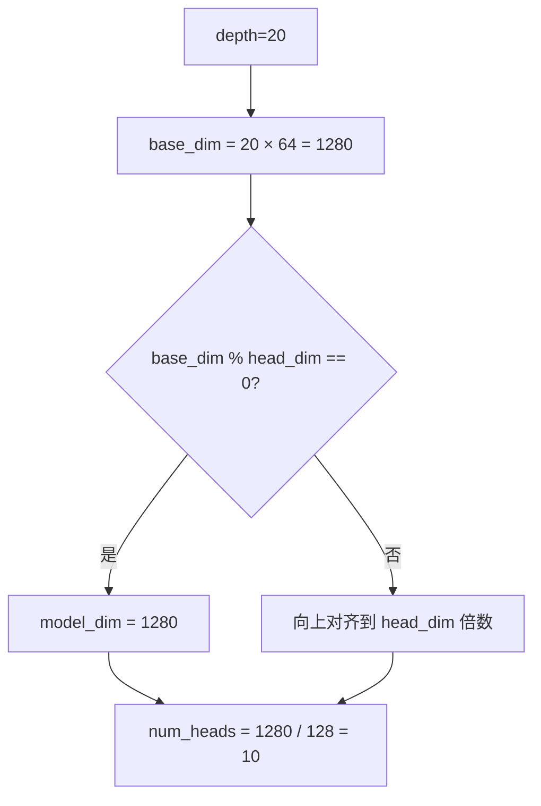
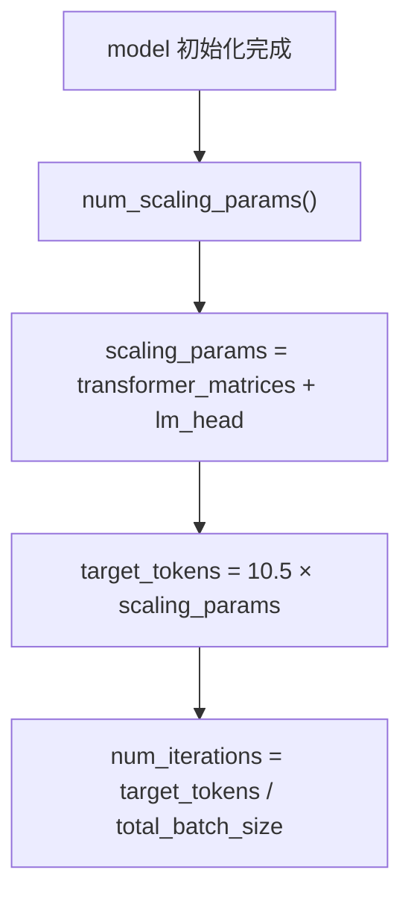
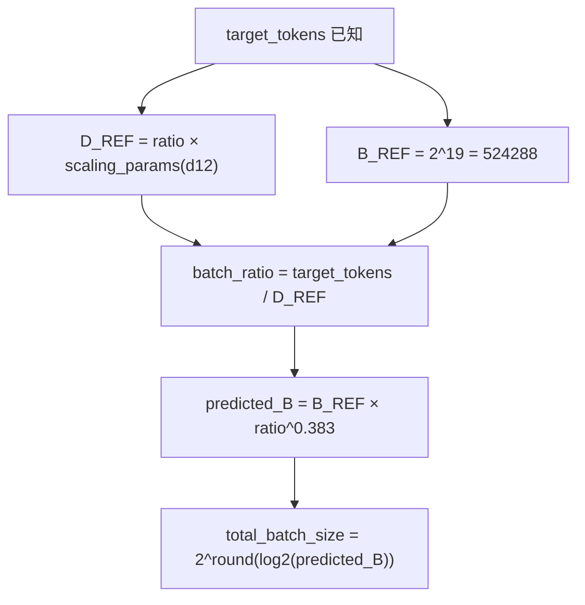
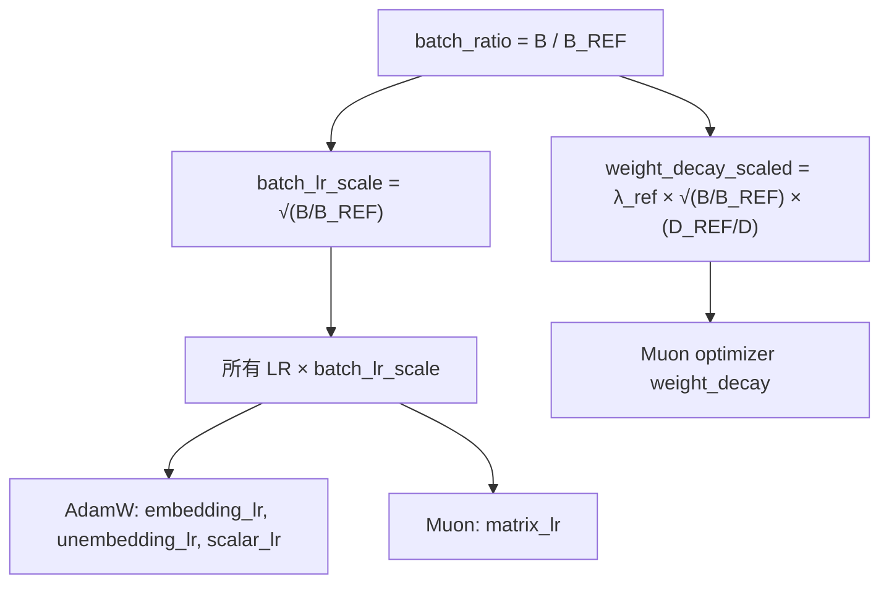

# PD-428.01 nanochat — Depth 单旋钮 Scaling Laws 全自动超参推导

> 文档编号：PD-428.01
> 来源：nanochat `scripts/base_train.py` `nanochat/gpt.py`
> GitHub：https://github.com/karpathy/nanochat.git
> 问题域：PD-428 Scaling Laws 自动化 Scaling Laws Automation
> 状态：可复用方案

---

## 第 1 章 问题与动机

### 1.1 核心问题

训练 LLM 时，超参数之间存在复杂的联动关系：模型宽度、训练 token 数、批大小、学习率、权重衰减——这些参数不是独立的，而是通过 scaling laws 相互约束。手动调参不仅耗时，而且在不同模型规模下最优值会发生变化（d12 的最优参数在 d20 上可能有害）。

核心挑战：如何让用户只设置一个参数（模型深度 `--depth`），系统自动推导出所有其他超参数，使训练结果在任意规模下都接近计算最优（compute-optimal）？

### 1.2 nanochat 的解法概述

nanochat 将 `depth`（Transformer 层数）作为唯一的复杂度旋钮，通过 4 条 scaling law 链式推导所有超参数：

1. **模型宽度**：`model_dim = depth × aspect_ratio`，然后对齐到 `head_dim` 的倍数（`scripts/base_train.py:129-130`）
2. **训练 token 数**：`target_tokens = target_param_data_ratio × scaling_params`，其中 `scaling_params = transformer_matrices + lm_head`（`scripts/base_train.py:261-264`）
3. **批大小**：Power Lines 论文的 `B_opt ∝ D^0.383` 幂律外推，以 d12 为参考点（`scripts/base_train.py:272-278`）
4. **学习率**：`η ∝ √(B/B_ref)` 批大小缩放 + `∝ 1/√(d_model/768)` 宽度缩放（`scripts/base_train.py:282-289`，`nanochat/gpt.py:362`）
5. **权重衰减**：T_epoch 框架推导 `λ = λ_ref × √(B/B_ref) × (D_ref/D)`（`scripts/base_train.py:292-299`）

### 1.3 设计思想

| 设计原则 | 具体实现 | 理由 | 替代方案 |
|----------|----------|------|----------|
| 单旋钮控制 | `--depth` 决定一切 | 消除超参搜索成本，任何 depth 都 compute-optimal | 多参数网格搜索（成本高 N 个数量级） |
| 参考点外推 | d12 作为 reference model，所有缩放公式基于 d12 的经验最优值 | d12 训练快（~5min），可快速迭代验证 | 每个 depth 独立调参（不可扩展） |
| 论文驱动缩放 | Power Lines D^0.383、T_epoch 框架、√B LR scaling | 有理论支撑，不是拍脑袋 | 纯经验拟合（泛化性差） |
| Kaplan-style 参数计数 | `transformer_matrices + lm_head` 作为 scaling params | 实验验证给出最稳定的 ~0.5 指数和 ~10.5 ratio | Chinchilla-style 全参数（ratio 不稳定） |
| muP 风格迁移 | 学习率 ∝ 1/√(d_model/768) | 小模型调好的 LR 可迁移到大模型 | 每个规模重新 sweep LR |

---

## 第 2 章 源码实现分析

### 2.1 架构概览

nanochat 的超参自动推导发生在 `scripts/base_train.py` 的 L244-L299 区间，形成一条链式推导管道：

```
┌──────────┐     ┌──────────────┐     ┌──────────────┐     ┌──────────────┐     ┌──────────────┐
│  depth   │────→│  model_dim   │────→│ target_tokens │────→│  batch_size  │────→│   LR + WD    │
│ (用户输入) │     │ depth×64     │     │ ratio×params  │     │ D^0.383 外推  │     │ √B + T_epoch │
└──────────┘     └──────────────┘     └──────────────┘     └──────────────┘     └──────────────┘
     │                                       ↑
     │            ┌──────────────┐           │
     └───────────→│ d12 reference │──────────┘
                  │ B_REF, D_REF  │
                  └──────────────┘
```

关键设计：所有缩放公式都以 d12 模型为参考点。d12 的超参数是通过 ~320 次实验 sweep 得到的经验最优值（见 `dev/LOG.md` Jan 19-22 记录），然后通过理论公式外推到任意 depth。

### 2.2 核心实现

#### 2.2.1 模型宽度自动推导



对应源码 `scripts/base_train.py:125-139`：

```python
def build_model_meta(depth):
    """Build a model on meta device for a given depth (shapes/dtypes only, no data)."""
    # Model dim is nudged up to nearest multiple of head_dim for clean division
    base_dim = depth * args.aspect_ratio
    model_dim = ((base_dim + args.head_dim - 1) // args.head_dim) * args.head_dim
    num_heads = model_dim // args.head_dim
    config = GPTConfig(
        sequence_len=args.max_seq_len, vocab_size=vocab_size,
        n_layer=depth, n_head=num_heads, n_kv_head=num_heads, n_embd=model_dim,
        window_pattern=args.window_pattern,
    )
    with torch.device("meta"):
        model_meta = GPT(config)
    return model_meta
```

`aspect_ratio=64` 是经过实验验证的最优值（`dev/LOG.md` Jan 17：aspect_ratio=128 更差，LLM 偏好"更窄更深"的架构）。`head_dim=128` 同样经过验证优于 64（更少但更大的注意力头）。

#### 2.2.2 训练 Token 数推导（Chinchilla 变体）



对应源码 `scripts/base_train.py:258-264`：

```python
def get_scaling_params(m):
    # transformer matrices + lm_head gives cleanest scaling laws (see dev/LOG.md Jan 27, 2026)
    params_counts = m.num_scaling_params()
    scaling_params = params_counts['transformer_matrices'] + params_counts['lm_head']
    return scaling_params
num_scaling_params = get_scaling_params(model)
target_tokens = int(args.target_param_data_ratio * num_scaling_params)
```

`target_param_data_ratio=10.5` 是通过 scaling laws 实验确定的（`dev/LOG.md` Jan 27）。nanochat 使用 Kaplan-style 参数计数（排除 embedding），而非 Chinchilla-style 全参数计数，因为前者给出更稳定的 ~0.5 指数和一致的 ratio。

`nanochat/gpt.py:319-346` 中的 `num_scaling_params()` 方法提供了细粒度的参数分组计数：

```python
def num_scaling_params(self):
    wte = sum(p.numel() for p in self.transformer.wte.parameters())
    value_embeds = sum(p.numel() for p in self.value_embeds.parameters())
    lm_head = sum(p.numel() for p in self.lm_head.parameters())
    transformer_matrices = sum(p.numel() for p in self.transformer.h.parameters())
    scalars = self.resid_lambdas.numel() + self.x0_lambdas.numel()
    total = wte + value_embeds + lm_head + transformer_matrices + scalars
    return {
        'wte': wte, 'value_embeds': value_embeds, 'lm_head': lm_head,
        'transformer_matrices': transformer_matrices, 'scalars': scalars, 'total': total,
    }
```

#### 2.2.3 批大小自动推导（Power Lines）



对应源码 `scripts/base_train.py:266-278`：

```python
# Reference model is d12
d12_ref = build_model_meta(12)
D_REF = args.target_param_data_ratio * get_scaling_params(d12_ref)
B_REF = 2**19  # optimal batch size at d12 ~= 524,288 tokens (measured empirically)

# Power Lines paper: Bopt ∝ D^0.383
total_batch_size = args.total_batch_size
if total_batch_size == -1:
    batch_size_ratio = target_tokens / D_REF
    predicted_batch_size = B_REF * batch_size_ratio ** 0.383
    total_batch_size = 2 ** round(math.log2(predicted_batch_size))  # clamp to power of 2
```

0.383 指数来自 Cerebras 的 Power Lines 论文（arXiv:2505.13738）。最终 clamp 到 2 的幂次是为了 GPU 效率。实际效果（`dev/LOG.md` Feb 5）：

| Depth | Auto Batch | 验证 |
|-------|-----------|------|
| d8 | 2^18 = 262K | — |
| d10-16 | 2^19 = 524K | 匹配 d12 经验最优 |
| d18-26 | 2^20 = 1.05M | 匹配 d26 经验最优 |
| d32-50 | 2^21 = 2.1M | — |

#### 2.2.4 学习率与权重衰减联动缩放



对应源码 `scripts/base_train.py:281-299`：

```python
# LR scaling: η ∝ √(B/B_ref)
batch_lr_scale = 1.0
batch_ratio = total_batch_size / B_REF
if batch_ratio != 1.0:
    batch_lr_scale = batch_ratio ** 0.5

# Weight decay: T_epoch framework (arXiv:2405.13698)
# λ = λ_ref · √(B/B_ref) · (D_ref/D)
weight_decay_scaled = args.weight_decay * math.sqrt(total_batch_size / B_REF) * (D_REF / target_tokens)
```

此外，`nanochat/gpt.py:361-363` 中还有一层 muP 风格的宽度缩放：

```python
# Scale the LR for the AdamW parameters by ∝1/√dmodel (tuned for 768 dim model)
dmodel_lr_scale = (model_dim / 768) ** -0.5
```

### 2.3 实现细节

**参数分组与差异化优化**：nanochat 使用 MuonAdamW 混合优化器（`nanochat/optim.py`），将参数分为 6 组，每组有独立的 LR 和优化策略：

| 参数组 | 优化器 | LR 基准 | 缩放方式 |
|--------|--------|---------|----------|
| lm_head | AdamW | 0.004 | × dmodel_lr_scale × batch_lr_scale |
| embedding (wte) | AdamW | 0.3 | × dmodel_lr_scale × batch_lr_scale |
| value_embeds | AdamW | 0.3 | × dmodel_lr_scale × batch_lr_scale |
| resid_lambdas | AdamW | 0.005 | × batch_lr_scale |
| x0_lambdas | AdamW | 0.5 | × batch_lr_scale, beta1=0.96 |
| transformer matrices | Muon | 0.02 | × batch_lr_scale, weight_decay=scaled |

**训练 horizon 三种模式**（`scripts/base_train.py:328-343`）：
1. `--num-iterations`：直接指定步数（最高优先级）
2. `--target-flops`：从 FLOPs 预算反推步数（用于 scaling laws 实验）
3. `--target-param-data-ratio`：从 token:param 比例推导（默认模式，最常用）

**Scaling laws 实验基础设施**：`runs/scaling_laws.sh` 在多个 FLOPs 预算（1e18 到 1e19）和多个 depth（8 到 20）上做网格搜索，输出 CSV 用于拟合最优 ratio。`runs/miniseries.sh` 则在固定 ratio 下训练 d12-d26 全系列 compute-optimal 模型。


---

## 第 3 章 迁移指南

### 3.1 迁移清单

**阶段 1：参数计数基础设施**
- [ ] 在模型类中实现 `num_scaling_params()` 方法，返回细粒度参数分组计数
- [ ] 确定哪些参数组用于 scaling law 计算（推荐：排除 embedding，只用 transformer 权重矩阵 + output head）
- [ ] 实现 `estimate_flops()` 方法，计算每 token 的 FLOPs

**阶段 2：参考点标定**
- [ ] 选择一个"参考模型"（训练快、可快速迭代的小模型）
- [ ] 在参考模型上 sweep 确定最优 batch size（B_REF）
- [ ] 在参考模型上通过 scaling laws 实验确定最优 token:param ratio
- [ ] 记录参考模型的 scaling_params 数量（D_REF = ratio × scaling_params）

**阶段 3：缩放公式集成**
- [ ] 实现 batch size 自动推导：`B = B_REF × (D/D_REF)^0.383`
- [ ] 实现 LR 缩放：`lr_scale = √(B/B_REF)`
- [ ] 实现 weight decay 缩放：`wd = wd_ref × √(B/B_REF) × (D_REF/D)`
- [ ] 实现 muP 宽度缩放：`lr_scale *= (d_model/d_ref)^-0.5`

**阶段 4：验证**
- [ ] 在 3-5 个不同规模上训练，验证 loss 曲线是否 compute-optimal
- [ ] 绘制 scaling laws 图（loss vs FLOPs，不同 depth），确认曲线包络线平滑

### 3.2 适配代码模板

以下是一个可直接复用的 scaling laws 自动推导模块：

```python
"""
Scaling Laws Auto-Tuner — 从 nanochat 提取的可复用模块
用法：
    tuner = ScalingLawsTuner(ref_scaling_params=110_000_000, ref_batch_size=524288)
    config = tuner.compute(scaling_params=400_000_000)
"""
import math
from dataclasses import dataclass

@dataclass
class ScalingConfig:
    target_tokens: int
    total_batch_size: int
    num_iterations: int
    lr_scale: float
    weight_decay: float

class ScalingLawsTuner:
    def __init__(
        self,
        ref_scaling_params: int,       # d12 的 scaling params 数量
        ref_batch_size: int = 524288,  # d12 的最优 batch size (B_REF)
        token_param_ratio: float = 10.5,  # compute-optimal token:param ratio
        ref_weight_decay: float = 0.2,    # d12 的 weight decay
        batch_power: float = 0.383,       # Power Lines 论文的指数
    ):
        self.ref_scaling_params = ref_scaling_params
        self.ref_batch_size = ref_batch_size
        self.token_param_ratio = token_param_ratio
        self.ref_weight_decay = ref_weight_decay
        self.batch_power = batch_power
        self.ref_tokens = token_param_ratio * ref_scaling_params  # D_REF

    def compute(self, scaling_params: int) -> ScalingConfig:
        # 1) Token horizon
        target_tokens = int(self.token_param_ratio * scaling_params)

        # 2) Batch size: B_opt ∝ D^0.383
        ratio = target_tokens / self.ref_tokens
        predicted_bs = self.ref_batch_size * ratio ** self.batch_power
        total_batch_size = 2 ** round(math.log2(predicted_bs))

        # 3) LR scaling: η ∝ √(B/B_ref)
        lr_scale = (total_batch_size / self.ref_batch_size) ** 0.5

        # 4) Weight decay: T_epoch framework
        weight_decay = (
            self.ref_weight_decay
            * math.sqrt(total_batch_size / self.ref_batch_size)
            * (self.ref_tokens / target_tokens)
        )

        # 5) Iterations
        num_iterations = target_tokens // total_batch_size

        return ScalingConfig(
            target_tokens=target_tokens,
            total_batch_size=total_batch_size,
            num_iterations=num_iterations,
            lr_scale=lr_scale,
            weight_decay=weight_decay,
        )

# 使用示例
if __name__ == "__main__":
    tuner = ScalingLawsTuner(ref_scaling_params=110_000_000)
    for params in [50_000_000, 110_000_000, 400_000_000, 1_000_000_000]:
        cfg = tuner.compute(params)
        print(f"Params: {params/1e6:.0f}M | Tokens: {cfg.target_tokens/1e9:.1f}B | "
              f"Batch: {cfg.total_batch_size:,} | Iters: {cfg.num_iterations:,} | "
              f"LR×: {cfg.lr_scale:.3f} | WD: {cfg.weight_decay:.4f}")
```

### 3.3 适用场景

| 场景 | 适用度 | 说明 |
|------|--------|------|
| 从零训练 LLM 系列（不同规模） | ⭐⭐⭐ | 核心场景，depth 旋钮直接适用 |
| 单一规模 LLM 训练 | ⭐⭐ | 仍可用于自动推导 batch size 和 LR |
| 微调/SFT | ⭐⭐ | nanochat 的 SFT 脚本继承预训练超参 |
| 非 Transformer 架构 | ⭐ | 需要重新标定参考点和缩放指数 |
| 超大规模（>10B 参数） | ⭐⭐ | 理论上适用，但需在目标规模验证 |

---

## 第 4 章 测试用例

```python
import math
import pytest
from dataclasses import dataclass

# 从迁移指南中的 ScalingLawsTuner 导入
# from scaling_tuner import ScalingLawsTuner, ScalingConfig

@dataclass
class ScalingConfig:
    target_tokens: int
    total_batch_size: int
    num_iterations: int
    lr_scale: float
    weight_decay: float

class ScalingLawsTuner:
    """Minimal reproduction for testing."""
    def __init__(self, ref_scaling_params, ref_batch_size=524288,
                 token_param_ratio=10.5, ref_weight_decay=0.2, batch_power=0.383):
        self.ref_scaling_params = ref_scaling_params
        self.ref_batch_size = ref_batch_size
        self.token_param_ratio = token_param_ratio
        self.ref_weight_decay = ref_weight_decay
        self.batch_power = batch_power
        self.ref_tokens = token_param_ratio * ref_scaling_params

    def compute(self, scaling_params):
        target_tokens = int(self.token_param_ratio * scaling_params)
        ratio = target_tokens / self.ref_tokens
        predicted_bs = self.ref_batch_size * ratio ** self.batch_power
        total_batch_size = 2 ** round(math.log2(predicted_bs))
        lr_scale = (total_batch_size / self.ref_batch_size) ** 0.5
        weight_decay = (self.ref_weight_decay * math.sqrt(total_batch_size / self.ref_batch_size)
                        * (self.ref_tokens / target_tokens))
        num_iterations = target_tokens // total_batch_size
        return ScalingConfig(target_tokens, total_batch_size, num_iterations, lr_scale, weight_decay)


class TestScalingLawsTuner:
    """测试 nanochat 风格的 scaling laws 自动推导。"""

    def setup_method(self):
        # 模拟 nanochat d12 参考点
        self.tuner = ScalingLawsTuner(ref_scaling_params=110_000_000)

    def test_reference_point_identity(self):
        """参考模型自身应返回 B_REF 和 lr_scale=1.0"""
        cfg = self.tuner.compute(110_000_000)
        assert cfg.total_batch_size == 524288  # B_REF = 2^19
        assert cfg.lr_scale == pytest.approx(1.0)
        assert cfg.target_tokens == int(10.5 * 110_000_000)

    def test_larger_model_gets_larger_batch(self):
        """更大模型应获得更大的 batch size"""
        cfg_small = self.tuner.compute(110_000_000)
        cfg_large = self.tuner.compute(400_000_000)
        assert cfg_large.total_batch_size >= cfg_small.total_batch_size

    def test_batch_size_is_power_of_two(self):
        """batch size 必须是 2 的幂"""
        for params in [50_000_000, 200_000_000, 1_000_000_000]:
            cfg = self.tuner.compute(params)
            assert cfg.total_batch_size & (cfg.total_batch_size - 1) == 0

    def test_lr_scale_grows_with_batch(self):
        """LR 缩放因子应随 batch size 增长"""
        cfg_ref = self.tuner.compute(110_000_000)
        cfg_big = self.tuner.compute(1_000_000_000)
        assert cfg_big.lr_scale >= cfg_ref.lr_scale

    def test_weight_decay_decreases_with_longer_training(self):
        """更长训练（更多 tokens）应降低 weight decay"""
        cfg_short = self.tuner.compute(50_000_000)
        cfg_long = self.tuner.compute(500_000_000)
        # 更大模型训练更多 tokens，D_REF/D 项使 WD 下降
        assert cfg_long.weight_decay < cfg_short.weight_decay

    def test_token_param_ratio_consistent(self):
        """token:param ratio 应始终等于 target_param_data_ratio"""
        for params in [50_000_000, 200_000_000, 800_000_000]:
            cfg = self.tuner.compute(params)
            actual_ratio = cfg.target_tokens / params
            assert actual_ratio == pytest.approx(10.5, rel=0.01)

    def test_iterations_positive(self):
        """迭代次数必须为正"""
        cfg = self.tuner.compute(110_000_000)
        assert cfg.num_iterations > 0

    def test_batch_growth_sublinear(self):
        """batch size 增长应是亚线性的（指数 0.383 < 1）"""
        cfg_1x = self.tuner.compute(110_000_000)
        cfg_10x = self.tuner.compute(1_100_000_000)
        # 10x params → 10x tokens → batch 应增长 ~10^0.383 ≈ 2.4x，不是 10x
        ratio = cfg_10x.total_batch_size / cfg_1x.total_batch_size
        assert ratio < 5  # 远小于 10x
```


---

## 第 5 章 跨域关联

| 关联域 | 关系类型 | 说明 |
|--------|----------|------|
| PD-432 高级优化器 | 协同 | nanochat 的 MuonAdamW 混合优化器是 scaling laws 自动化的执行层——不同参数组使用不同优化器（Muon for matrices, AdamW for embeddings），LR/WD 缩放公式需要感知优化器类型 |
| PD-427 混合精度训练 | 协同 | FP8 训练改变了每步的有效精度，需要在 scaling laws 中考虑"capability-matched speedup"而非原始 throughput |
| PD-426 分布式训练 | 依赖 | batch size 自动推导的结果需要能被 `world_size × device_batch_size × seq_len` 整除，分布式通信开销也影响实际 throughput |
| PD-431 高效数据加载 | 协同 | 训练 token 数自动推导后，数据加载器需要支持精确的 epoch 计数和断点续训 |
| PD-422 LLM 训练流水线 | 依赖 | scaling laws 自动化是训练流水线的"配置层"，决定了流水线的运行参数 |

---

## 第 6 章 来源文件索引

| 文件 | 行范围 | 关键实现 |
|------|--------|----------|
| `scripts/base_train.py` | L49-51 | depth/aspect_ratio/head_dim CLI 参数定义 |
| `scripts/base_train.py` | L125-139 | `build_model_meta()` 模型宽度自动推导 |
| `scripts/base_train.py` | L244-300 | 核心 scaling laws 推导管道（token horizon, batch size, LR, WD） |
| `scripts/base_train.py` | L302-312 | optimizer 初始化，应用所有缩放后的超参 |
| `scripts/base_train.py` | L328-347 | 训练 horizon 三种模式（iterations/flops/ratio） |
| `scripts/base_train.py` | L350-369 | LR schedule + momentum schedule + WD schedule |
| `nanochat/gpt.py` | L29-39 | GPTConfig dataclass，模型架构参数 |
| `nanochat/gpt.py` | L292-317 | `estimate_flops()` 每 token FLOPs 估算 |
| `nanochat/gpt.py` | L319-346 | `num_scaling_params()` 细粒度参数分组计数 |
| `nanochat/gpt.py` | L348-386 | `setup_optimizer()` 6 组参数差异化优化 |
| `nanochat/optim.py` | L1-291 | MuonAdamW 混合优化器实现 |
| `runs/scaling_laws.sh` | L1-126 | Scaling laws 实验脚本（FLOPs × depth 网格搜索） |
| `runs/miniseries.sh` | L1-111 | Miniseries 训练脚本（固定 ratio，sweep depth） |
| `dev/LOG.md` | Feb 5 | Auto Batch Size Scaling 实验记录 |
| `dev/LOG.md` | Jan 27 | Scaling params 选择实验（Kaplan vs Chinchilla） |
| `dev/LOG.md` | Jan 19-22 | 320 次优化器超参 sweep 记录 |

---

## 第 7 章 横向对比维度

```json comparison_data
{
  "project": "nanochat",
  "dimensions": {
    "复杂度旋钮": "单一 depth 参数，所有超参自动推导",
    "缩放公式": "4 条链式公式：token ratio + Power Lines batch + √B LR + T_epoch WD",
    "参考点策略": "d12 为 reference model，经验最优值 + 理论外推",
    "参数计数方式": "Kaplan-style: transformer_matrices + lm_head（排除 embedding）",
    "实验验证": "320+ sweep 实验 + scaling laws 网格搜索 + miniseries 全系列验证",
    "优化器感知": "MuonAdamW 6 组差异化 LR/WD，muP 宽度缩放 ∝ 1/√d_model"
  }
}
```

### 域元数据补充

```json domain_metadata
{
  "solution_summary": "nanochat 以 depth 为唯一旋钮，通过 Chinchilla ratio + Power Lines D^0.383 + √B LR + T_epoch WD 四条公式链式推导所有训练超参数，实现任意规模 compute-optimal 训练",
  "description": "从单一复杂度参数自动推导全部训练超参数的端到端自动化框架",
  "sub_problems": [
    "参考模型选择与经验最优值标定",
    "Kaplan vs Chinchilla 参数计数方式对 scaling law 稳定性的影响",
    "muP 风格学习率跨宽度迁移",
    "批大小 clamp 到 2 的幂次对 GPU 效率的影响"
  ],
  "best_practices": [
    "用小参考模型（d12）快速 sweep 后通过理论公式外推到大模型",
    "Kaplan-style 参数计数（排除 embedding）给出更稳定的 scaling law 指数",
    "Power Lines D^0.383 幂律外推批大小，clamp 到 2 的幂次",
    "T_epoch 框架联动缩放 weight decay 与 batch size 和训练 horizon"
  ]
}
```
