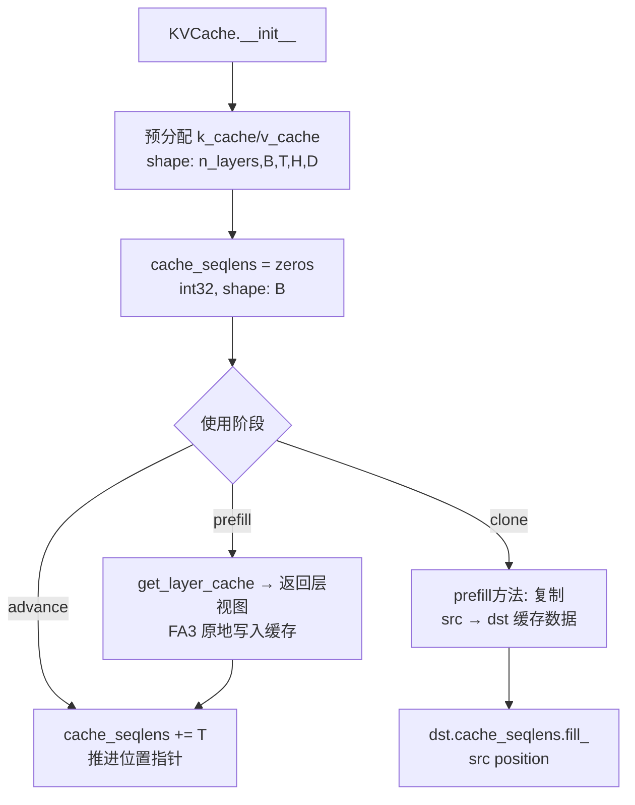
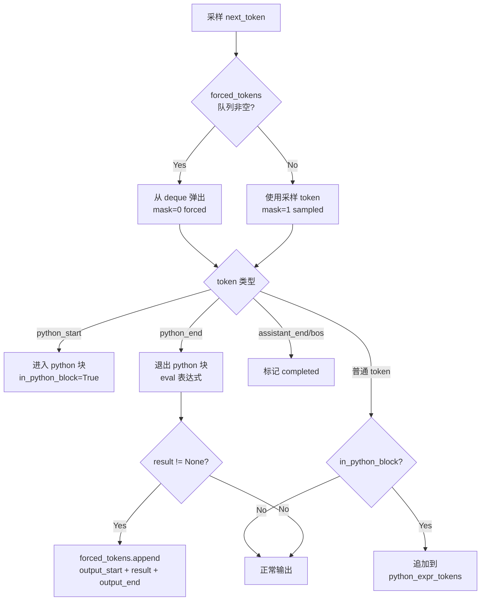

# PD-429.02 nanochat — KV Cache 推理引擎与工具调用状态机

> 文档编号：PD-429.02
> 来源：nanochat `nanochat/engine.py`, `nanochat/flash_attention.py`, `nanochat/gpt.py`
> GitHub：https://github.com/karpathy/nanochat.git
> 问题域：PD-429 KV Cache 推理引擎 KV Cache Inference Engine
> 状态：可复用方案

---

## 第 1 章 问题与动机

### 1.1 核心问题

自回归 LLM 推理的核心瓶颈在于：每生成一个 token 都需要重新计算所有历史 token 的 Key/Value 向量。对于长序列（数千 token），这意味着 O(n²) 的计算量和显存占用。KV Cache 通过缓存已计算的 K/V 张量，将每步推理降为 O(n) 的注意力计算。

但 KV Cache 本身引入了新的工程问题：
1. **缓存预分配**：推理前需要预分配固定大小的缓存张量，过大浪费显存，过小导致 OOM
2. **prefill-decode 分离**：prompt 阶段（prefill）可以并行处理所有 token，但生成阶段（decode）必须逐 token 串行
3. **多 sample 并行**：best-of-N 采样需要从同一个 prefill 结果分叉出多条独立的解码路径
4. **工具调用注入**：当模型触发工具调用（如计算器），需要将工具输出的 token 强制注入到生成流中，而不是从模型采样
5. **注意力后端切换**：不同 GPU 架构（Hopper/Ada/Blackwell）需要不同的注意力实现，且 API 不兼容

### 1.2 nanochat 的解法概述

nanochat 用三个文件、约 500 行代码实现了一套完整的 KV Cache 推理引擎：

1. **KVCache 类**（`engine.py:83-132`）：预分配 `(n_layers, B, T, H, D)` 形状的缓存张量，通过 `cache_seqlens` 追踪每个 batch 元素的当前位置，支持 `prefill()` 方法将 batch=1 的缓存克隆到多 sample
2. **Engine.generate()**（`engine.py:171-275`）：三阶段生成流程——batch=1 prefill → 缓存克隆到 N 个 sample → 逐 token 解码循环，内嵌工具调用状态机（`RowState`）处理 `<|python_start|>...<|python_end|>` 标记
3. **flash_attn 统一接口**（`flash_attention.py:176-179`）：`SimpleNamespace` 导出与 FA3 完全相同的 API，运行时自动检测 GPU 架构选择 FA3 或 SDPA fallback，对上层完全透明
4. **滑动窗口注意力**（`gpt.py:260-287`）：`window_pattern` 字符串（如 `"SSSL"`）控制每层的注意力窗口大小，最后一层强制全上下文
5. **流式 yield 生成**（`engine.py:269-270`）：每步 yield `(token_column, token_masks)` 元组，调用方可实时消费 token 流

### 1.3 设计思想

| 设计原则 | 具体实现 | 理由 | 替代方案 |
|----------|----------|------|----------|
| prefill-decode 分离 | batch=1 prefill 后 `KVCache.prefill()` 克隆到多 sample | 避免 N 份 prompt 重复计算，显存节省 (N-1)/N | 直接 batch=N prefill（浪费计算） |
| 位置追踪集中化 | `cache_seqlens` int32 张量统一追踪所有 batch 元素位置 | FA3 API 要求，且支持异步位置推进 | 每层独立追踪（冗余且易出错） |
| 注意力后端透明切换 | `SimpleNamespace` 导出统一 API，`_use_fa3()` 运行时决策 | 上层代码零修改即可在不同 GPU 上运行 | 编译时条件编译（不灵活） |
| 工具调用 token 注入 | `RowState.forced_tokens` deque + mask 标记 | 强制 token 不参与采样但正常进入 KV Cache | 修改 logits（破坏采样分布） |
| 滑动窗口模式化 | 字符串 pattern `"SSSL"` 平铺到所有层 | 一个字符控制一层，直观且可配置 | 每层独立配置（繁琐） |

---

## 第 2 章 源码实现分析

### 2.1 架构概览

nanochat 的推理引擎由三个核心组件构成，职责清晰分离：

```
┌─────────────────────────────────────────────────────────────┐
│                      Engine.generate()                       │
│  ┌──────────┐   ┌──────────────┐   ┌──────────────────────┐ │
│  │ Phase 1:  │──→│   Phase 2:   │──→│     Phase 3:         │ │
│  │ Prefill   │   │ Cache Clone  │   │   Decode Loop        │ │
│  │ (batch=1) │   │ (1 → N)      │   │   + Tool State       │ │
│  └──────────┘   └──────────────┘   │   Machine (RowState)  │ │
│       │                │            └──────────────────────┘ │
│       ▼                ▼                      │              │
│  ┌──────────┐   ┌──────────────┐              ▼              │
│  │ KVCache   │   │ KVCache      │     yield (tokens, masks)  │
│  │ (B=1)     │   │ (B=N)        │                            │
│  └──────────┘   └──────────────┘                             │
│       │                │                                     │
│       └────────┬───────┘                                     │
│                ▼                                             │
│  ┌──────────────────────────────────────────────────────┐   │
│  │              flash_attn (unified API)                  │   │
│  │  ┌─────────────┐          ┌──────────────────────┐   │   │
│  │  │ FA3 (Hopper) │    OR    │ SDPA (Ada/Blackwell) │   │   │
│  │  └─────────────┘          └──────────────────────┘   │   │
│  └──────────────────────────────────────────────────────┘   │
└─────────────────────────────────────────────────────────────┘
```

### 2.2 核心实现

#### 2.2.1 KVCache：预分配与位置追踪



对应源码 `nanochat/engine.py:83-132`：

```python
class KVCache:
    """
    KV Cache designed for Flash Attention 3's flash_attn_with_kvcache API.
    Key differences from FA2-style cache:
    - Tensors are (B, T, H, D) not (B, H, T, D)
    - FA3 updates the cache in-place during flash_attn_with_kvcache
    - Position tracked per batch element via cache_seqlens tensor
    """
    def __init__(self, batch_size, num_heads, seq_len, head_dim, num_layers, device, dtype):
        self.batch_size = batch_size
        self.max_seq_len = seq_len
        self.n_layers = num_layers
        # Pre-allocate cache tensors: (n_layers, B, T, H, D)
        self.k_cache = torch.zeros(num_layers, batch_size, seq_len, num_heads, head_dim,
                                   device=device, dtype=dtype)
        self.v_cache = torch.zeros(num_layers, batch_size, seq_len, num_heads, head_dim,
                                   device=device, dtype=dtype)
        # Current sequence length per batch element (FA3 needs int32)
        self.cache_seqlens = torch.zeros(batch_size, dtype=torch.int32, device=device)

    def prefill(self, other):
        """Copy cached KV from another cache (batch=1 prefill → multi-sample decode)."""
        assert self.get_pos() == 0, "Cannot prefill a non-empty KV cache"
        other_pos = other.get_pos()
        self.k_cache[:, :, :other_pos, :, :] = other.k_cache[:, :, :other_pos, :, :]
        self.v_cache[:, :, :other_pos, :, :] = other.v_cache[:, :, :other_pos, :, :]
        self.cache_seqlens.fill_(other_pos)
```

关键设计点：
- **张量布局 `(B, T, H, D)`**（`engine.py:100`）：匹配 FA3 的原生布局，避免 transpose 开销
- **`cache_seqlens` 为 int32**（`engine.py:103`）：FA3 API 硬性要求，用于原地更新时定位写入位置
- **`prefill()` 只复制有效数据**（`engine.py:130-131`）：`[:other_pos]` 切片避免复制未使用的缓存空间
- **位置推进在最后一层**（`gpt.py:112-113`）：`if self.layer_idx == kv_cache.n_layers - 1: kv_cache.advance(T)`，确保所有层都用同一位置读写

#### 2.2.2 Engine.generate()：三阶段推理流水线

```mermaid
graph TD
    A[输入: tokens list] --> B[Phase 1: Prefill<br/>KVCache batch=1<br/>seq_len=len tokens]
    B --> C[model.forward<br/>填充 kv_cache_prefill]
    C --> D[logits[:, -1, :].expand<br/>num_samples, vocab_size]
    D --> E[Phase 2: Clone<br/>KVCache batch=N<br/>seq_len=hint]
    E --> F[kv_cache_decode.prefill<br/>kv_cache_prefill]
    F --> G[del kv_cache_prefill<br/>释放显存]
    G --> H[Phase 3: Decode Loop]
    H --> I{all completed<br/>or max_tokens?}
    I -->|No| J[sample_next_token]
    J --> K[RowState 处理<br/>forced_tokens / tool use]
    K --> L[yield token_column,<br/>token_masks]
    L --> M[model.forward<br/>ids, kv_cache_decode]
    M --> I
    I -->|Yes| N[结束]
```

对应源码 `nanochat/engine.py:171-275`：

```python
@torch.inference_mode()
def generate(self, tokens, num_samples=1, max_tokens=None, temperature=1.0, top_k=None, seed=42):
    # 1) Run a batch 1 prefill of the prompt tokens
    kv_cache_prefill = KVCache(batch_size=1, seq_len=len(tokens), ...)
    ids = torch.tensor([tokens], dtype=torch.long, device=device)
    logits = self.model.forward(ids, kv_cache=kv_cache_prefill)
    logits = logits[:, -1, :].expand(num_samples, -1)  # (num_samples, vocab_size)

    # 2) Replicate the KV cache for each sample/row
    kv_length_hint = (len(tokens) + max_tokens) if max_tokens is not None else self.model.config.sequence_len
    kv_cache_decode = KVCache(batch_size=num_samples, seq_len=kv_length_hint, ...)
    kv_cache_decode.prefill(kv_cache_prefill)
    del kv_cache_prefill  # no need to keep this memory around

    # 3) Main generation loop
    row_states = [RowState(tokens.copy()) for _ in range(num_samples)]
    while True:
        if max_tokens is not None and num_generated >= max_tokens:
            break
        if all(state.completed for state in row_states):
            break
        next_ids = sample_next_token(logits, rng, temperature, top_k)
        # ... RowState processing, tool use, yield ...
        yield token_column, token_masks
        ids = torch.tensor(token_column, ...).unsqueeze(1)
        logits = self.model.forward(ids, kv_cache=kv_cache_decode)[:, -1, :]
```

关键设计点：
- **prefill 缓存精确分配**（`engine.py:197-199`）：`seq_len=len(tokens)` 只分配 prompt 长度，不浪费
- **decode 缓存按 hint 分配**（`engine.py:209`）：`kv_length_hint = len(tokens) + max_tokens`，预估总长度一次分配
- **logits expand 而非 repeat**（`engine.py:206`）：`expand` 不复制数据，只创建视图，节省显存
- **及时释放 prefill 缓存**（`engine.py:218`）：`del kv_cache_prefill` 立即回收显存

#### 2.2.3 工具调用状态机（RowState）



对应源码 `nanochat/engine.py:155-267`：

```python
class RowState:
    def __init__(self, current_tokens=None):
        self.current_tokens = current_tokens or []
        self.forced_tokens = deque()       # Queue of tokens to force inject
        self.in_python_block = False        # Whether inside a python block
        self.python_expr_tokens = []        # Tokens of the current python expression
        self.completed = False              # Whether this row has completed

# In generate() loop:
for i, state in enumerate(row_states):
    is_forced = len(state.forced_tokens) > 0
    token_masks.append(0 if is_forced else 1)  # mask: 0=forced, 1=sampled
    next_token = state.forced_tokens.popleft() if is_forced else sampled_tokens[i]
    # Handle tool logic
    if next_token == python_start:
        state.in_python_block = True
        state.python_expr_tokens = []
    elif next_token == python_end and state.in_python_block:
        state.in_python_block = False
        expr = self.tokenizer.decode(state.python_expr_tokens)
        result = use_calculator(expr)
        if result is not None:
            state.forced_tokens.append(output_start)
            state.forced_tokens.extend(result_tokens)
            state.forced_tokens.append(output_end)
```

关键设计点：
- **deque 作为 forced token 队列**（`engine.py:159`）：O(1) 的 popleft，工具输出可能是多个 token
- **mask 区分采样/强制**（`engine.py:243`）：下游可据此计算 log-probability 或过滤强制 token
- **每行独立状态**（`engine.py:221`）：多 sample 中每行可能在不同时刻触发工具调用，互不干扰

### 2.3 实现细节

#### Flash Attention 统一接口

`flash_attention.py` 的核心设计是用 `SimpleNamespace` 导出与 FA3 完全相同的 API（`flash_attention.py:176-179`）：

```python
from types import SimpleNamespace
flash_attn = SimpleNamespace(
    flash_attn_func=flash_attn_func,
    flash_attn_with_kvcache=flash_attn_with_kvcache,
)
```

运行时检测逻辑（`flash_attention.py:23-38`）：
- 检查 CUDA 是否可用
- 检查 GPU compute capability：只有 `major == 9`（Hopper）才加载 FA3
- Ada (sm89)、Blackwell (sm100) 自动 fallback 到 SDPA

SDPA fallback 的 KV Cache 管理（`flash_attention.py:147-159`）手动实现了 FA3 的原地更新语义：
```python
# Insert new k, v into cache (in-place, matching FA3 behavior)
if k is not None and v is not None:
    k_cache[:, pos:pos+T_new, :, :] = k
    v_cache[:, pos:pos+T_new, :, :] = v
```

#### 滑动窗口注意力

`gpt.py:260-287` 的 `_compute_window_sizes()` 将字符串 pattern 转换为 FA3 的 `(left, right)` 元组：
- `"L"` → `(sequence_len, 0)` 全上下文
- `"S"` → `(sequence_len // 2, 0)` 半上下文
- 最后一层强制 `"L"`，确保模型始终能看到完整上下文

#### 安全的计算器工具

`engine.py:36-80` 的 `use_calculator()` 实现了受限的 Python 表达式求值：
- 纯数学表达式：只允许 `0-9 * + - / . ( ) 空格`
- 字符串操作：只允许 `.count()` 方法
- 危险模式黑名单：`__`, `import`, `exec`, `eval` 等
- 超时保护：`signal.SIGALRM` 3 秒超时
- 沙箱化 eval：`{"__builtins__": {}}` 清空内置函数

---

## 第 3 章 迁移指南

### 3.1 迁移清单

**阶段 1：KV Cache 基础设施**
- [ ] 实现 `KVCache` 类，预分配 `(n_layers, B, T, H, D)` 张量
- [ ] 实现 `cache_seqlens` 位置追踪（int32）
- [ ] 实现 `get_layer_cache()` 返回层视图
- [ ] 实现 `advance()` 位置推进
- [ ] 实现 `prefill()` 缓存克隆方法
- [ ] 在注意力层的 forward 中集成 KV Cache 读写

**阶段 2：推理引擎**
- [ ] 实现三阶段 generate()：prefill → clone → decode
- [ ] 实现 `sample_next_token()` 支持 temperature/top_k
- [ ] 实现流式 yield 接口
- [ ] 实现 `generate_batch()` 非流式包装

**阶段 3：注意力后端**
- [ ] 实现 FA3/SDPA 自动检测与切换
- [ ] SDPA fallback 中手动管理 KV Cache 原地更新
- [ ] 滑动窗口注意力支持

**阶段 4：工具调用（可选）**
- [ ] 实现 `RowState` 状态机
- [ ] 实现 forced token 注入与 mask 标记
- [ ] 实现安全的表达式求值器

### 3.2 适配代码模板

以下是一个可直接复用的最小 KV Cache 推理引擎模板：

```python
import torch
import torch.nn.functional as F
from collections import deque
from dataclasses import dataclass

class KVCache:
    """Minimal KV Cache for autoregressive inference."""

    def __init__(self, batch_size: int, num_layers: int, num_kv_heads: int,
                 head_dim: int, max_seq_len: int, device: torch.device,
                 dtype: torch.dtype = torch.bfloat16):
        self.n_layers = num_layers
        self.max_seq_len = max_seq_len
        # Pre-allocate: (n_layers, B, T, H, D) — FA3 native layout
        self.k_cache = torch.zeros(
            num_layers, batch_size, max_seq_len, num_kv_heads, head_dim,
            device=device, dtype=dtype
        )
        self.v_cache = torch.zeros_like(self.k_cache)
        self.cache_seqlens = torch.zeros(batch_size, dtype=torch.int32, device=device)

    def get_pos(self) -> int:
        return self.cache_seqlens[0].item()

    def get_layer_cache(self, layer_idx: int):
        return self.k_cache[layer_idx], self.v_cache[layer_idx]

    def advance(self, num_tokens: int):
        self.cache_seqlens += num_tokens

    def reset(self):
        self.cache_seqlens.zero_()

    def clone_from(self, src: 'KVCache'):
        """Clone a batch=1 prefill cache into this multi-sample cache."""
        assert self.get_pos() == 0
        pos = src.get_pos()
        self.k_cache[:, :, :pos] = src.k_cache[:, :, :pos]
        self.v_cache[:, :, :pos] = src.v_cache[:, :, :pos]
        self.cache_seqlens.fill_(pos)


@torch.inference_mode()
def sample_next_token(logits: torch.Tensor, rng: torch.Generator,
                      temperature: float = 1.0, top_k: int | None = None) -> torch.Tensor:
    """Sample from logits (B, vocab_size) → (B, 1)."""
    if temperature == 0.0:
        return torch.argmax(logits, dim=-1, keepdim=True)
    if top_k is not None and top_k > 0:
        k = min(top_k, logits.size(-1))
        vals, idx = torch.topk(logits, k, dim=-1)
        vals = vals / temperature
        probs = F.softmax(vals, dim=-1)
        choice = torch.multinomial(probs, num_samples=1, generator=rng)
        return idx.gather(1, choice)
    logits = logits / temperature
    probs = F.softmax(logits, dim=-1)
    return torch.multinomial(probs, num_samples=1, generator=rng)


@dataclass
class RowState:
    """Per-sample state for generation with optional tool use."""
    current_tokens: list
    forced_tokens: deque  # tokens to force-inject (from tool output)
    completed: bool = False

    @classmethod
    def create(cls, prompt_tokens: list) -> 'RowState':
        return cls(current_tokens=prompt_tokens.copy(), forced_tokens=deque())


@torch.inference_mode()
def generate(model, tokens: list[int], num_samples: int = 1,
             max_tokens: int = 256, temperature: float = 1.0,
             top_k: int | None = None, seed: int = 42):
    """
    Three-phase KV Cache generation: prefill → clone → decode.
    Yields (token_column, token_masks) per step.
    """
    device = next(model.parameters()).device
    dtype = torch.bfloat16 if device.type == "cuda" else torch.float32
    cfg = model.config  # expects n_kv_head, n_embd, n_head, n_layer
    kv_kwargs = dict(
        num_layers=cfg.n_layer, num_kv_heads=cfg.n_kv_head,
        head_dim=cfg.n_embd // cfg.n_head, device=device, dtype=dtype,
    )
    rng = torch.Generator(device=device)
    rng.manual_seed(seed)

    # Phase 1: Prefill (batch=1)
    kv_prefill = KVCache(batch_size=1, max_seq_len=len(tokens), **kv_kwargs)
    ids = torch.tensor([tokens], dtype=torch.long, device=device)
    logits = model(ids, kv_cache=kv_prefill)[:, -1, :].expand(num_samples, -1)

    # Phase 2: Clone to N samples
    kv_decode = KVCache(batch_size=num_samples,
                        max_seq_len=len(tokens) + max_tokens, **kv_kwargs)
    kv_decode.clone_from(kv_prefill)
    del kv_prefill

    # Phase 3: Decode loop
    states = [RowState.create(tokens) for _ in range(num_samples)]
    for _ in range(max_tokens):
        if all(s.completed for s in states):
            break
        next_ids = sample_next_token(logits, rng, temperature, top_k)
        sampled = next_ids[:, 0].tolist()
        column, masks = [], []
        for i, state in enumerate(states):
            if state.forced_tokens:
                tok = state.forced_tokens.popleft()
                masks.append(0)
            else:
                tok = sampled[i]
                masks.append(1)
            column.append(tok)
            state.current_tokens.append(tok)
        yield column, masks
        ids = torch.tensor(column, dtype=torch.long, device=device).unsqueeze(1)
        logits = model(ids, kv_cache=kv_decode)[:, -1, :]
```

### 3.3 适用场景

| 场景 | 适用度 | 说明 |
|------|--------|------|
| 单 GPU 推理服务 | ⭐⭐⭐ | 完美匹配：预分配缓存 + 流式生成 |
| best-of-N 采样 | ⭐⭐⭐ | prefill 克隆设计的核心用例 |
| 工具增强生成 | ⭐⭐⭐ | RowState + forced_tokens 直接可用 |
| 多 GPU 张量并行 | ⭐⭐ | 需要扩展 KVCache 支持分片 |
| 连续批处理（continuous batching） | ⭐ | 需要重写为 PagedAttention 风格 |
| 长上下文（>128K） | ⭐ | 预分配策略不适合，需要分页或流式缓存 |

---

## 第 4 章 测试用例

基于 nanochat 的真实测试模式（`tests/test_engine.py`），以下测试覆盖 KV Cache 核心功能：

```python
import pytest
import torch
from collections import deque


class TestKVCache:
    """Test KVCache pre-allocation, position tracking, and clone."""

    def test_initial_state(self):
        """Cache starts at position 0 with correct shape."""
        cache = KVCache(batch_size=2, num_layers=4, num_kv_heads=8,
                        head_dim=64, max_seq_len=128, device=torch.device("cpu"),
                        dtype=torch.float32)
        assert cache.get_pos() == 0
        assert cache.k_cache.shape == (4, 2, 128, 8, 64)
        assert cache.v_cache.shape == (4, 2, 128, 8, 64)

    def test_advance_accumulates(self):
        """Position advances correctly across multiple calls."""
        cache = KVCache(batch_size=1, num_layers=2, num_kv_heads=4,
                        head_dim=32, max_seq_len=64, device=torch.device("cpu"),
                        dtype=torch.float32)
        cache.advance(10)
        assert cache.get_pos() == 10
        cache.advance(5)
        assert cache.get_pos() == 15

    def test_reset_clears_position(self):
        """Reset brings position back to 0."""
        cache = KVCache(batch_size=1, num_layers=2, num_kv_heads=4,
                        head_dim=32, max_seq_len=64, device=torch.device("cpu"),
                        dtype=torch.float32)
        cache.advance(20)
        cache.reset()
        assert cache.get_pos() == 0

    def test_clone_copies_data_and_position(self):
        """clone_from copies KV data and position from source."""
        src = KVCache(batch_size=1, num_layers=2, num_kv_heads=4,
                      head_dim=8, max_seq_len=32, device=torch.device("cpu"),
                      dtype=torch.float32)
        src.k_cache[0, 0, :16] = 1.0
        src.v_cache[0, 0, :16] = 2.0
        src.advance(16)

        dst = KVCache(batch_size=1, num_layers=2, num_kv_heads=4,
                      head_dim=8, max_seq_len=64, device=torch.device("cpu"),
                      dtype=torch.float32)
        dst.clone_from(src)
        assert dst.get_pos() == 16
        assert (dst.k_cache[0, 0, :16] == 1.0).all()
        assert (dst.v_cache[0, 0, :16] == 2.0).all()
        # Beyond copied region should still be zeros
        assert (dst.k_cache[0, 0, 16:] == 0.0).all()

    def test_clone_rejects_nonempty_dst(self):
        """Cannot clone into a cache that already has data."""
        src = KVCache(batch_size=1, num_layers=1, num_kv_heads=2,
                      head_dim=4, max_seq_len=16, device=torch.device("cpu"),
                      dtype=torch.float32)
        src.advance(8)
        dst = KVCache(batch_size=1, num_layers=1, num_kv_heads=2,
                      head_dim=4, max_seq_len=16, device=torch.device("cpu"),
                      dtype=torch.float32)
        dst.advance(1)  # non-empty
        with pytest.raises(AssertionError):
            dst.clone_from(src)


class TestRowState:
    """Test forced token injection and state transitions."""

    def test_forced_tokens_take_priority(self):
        """Forced tokens are consumed before sampled tokens."""
        state = RowState(current_tokens=[1, 2, 3], forced_tokens=deque([10, 11, 12]))
        tokens_out = []
        for _ in range(3):
            tok = state.forced_tokens.popleft()
            tokens_out.append(tok)
        assert tokens_out == [10, 11, 12]
        assert len(state.forced_tokens) == 0

    def test_mask_distinguishes_forced_vs_sampled(self):
        """Mask is 0 for forced tokens, 1 for sampled."""
        state = RowState(current_tokens=[], forced_tokens=deque([99]))
        # First token: forced
        is_forced = len(state.forced_tokens) > 0
        assert is_forced
        mask = 0 if is_forced else 1
        assert mask == 0
        state.forced_tokens.popleft()
        # Second token: sampled
        is_forced = len(state.forced_tokens) > 0
        assert not is_forced
        mask = 0 if is_forced else 1
        assert mask == 1


class TestSampleNextToken:
    """Test sampling with temperature and top_k."""

    def test_temperature_zero_is_deterministic(self):
        """Temperature=0 always returns argmax."""
        logits = torch.tensor([[0.1, 0.9, 0.5]])
        rng = torch.Generator()
        rng.manual_seed(42)
        result = sample_next_token(logits, rng, temperature=0.0)
        assert result.item() == 1  # argmax

    def test_top_k_limits_candidates(self):
        """Top-k=1 is equivalent to argmax."""
        logits = torch.tensor([[0.1, 0.9, 0.5]])
        rng = torch.Generator()
        rng.manual_seed(42)
        result = sample_next_token(logits, rng, temperature=1.0, top_k=1)
        assert result.item() == 1

    def test_seed_reproducibility(self):
        """Same seed produces same output."""
        logits = torch.randn(1, 100)
        for seed in [1, 42, 999]:
            rng1 = torch.Generator()
            rng1.manual_seed(seed)
            r1 = sample_next_token(logits, rng1, temperature=1.0)
            rng2 = torch.Generator()
            rng2.manual_seed(seed)
            r2 = sample_next_token(logits, rng2, temperature=1.0)
            assert r1.item() == r2.item()
```

---

## 第 5 章 跨域关联

| 关联域 | 关系类型 | 说明 |
|--------|----------|------|
| PD-01 上下文管理 | 协同 | KV Cache 的 `max_seq_len` 直接决定上下文窗口上限；滑动窗口注意力是一种硬件级的上下文压缩策略 |
| PD-04 工具系统 | 依赖 | Engine 的工具调用状态机依赖 tokenizer 的特殊 token 定义（`<\|python_start\|>` 等），工具系统的设计直接影响 forced token 注入的复杂度 |
| PD-05 沙箱隔离 | 协同 | `use_calculator()` 的 `{"__builtins__": {}}` 沙箱和 `SIGALRM` 超时是轻量级沙箱隔离的实例，生产环境需要更强的隔离（如 Docker/E2B） |
| PD-12 推理增强 | 协同 | best-of-N 采样（`num_samples > 1`）是一种推理增强策略；KV Cache 克隆使其在显存上可行 |
| PD-430 BPE Tokenizer | 依赖 | Engine 依赖 tokenizer 的 `encode_special()`、`decode()`、`get_bos_token_id()` 接口；特殊 token 的 ID 映射是工具调用状态机的基础 |

---

## 第 6 章 来源文件索引

| 文件 | 行范围 | 关键实现 |
|------|--------|----------|
| `nanochat/engine.py` | L83-L132 | KVCache 类：预分配、位置追踪、prefill 克隆 |
| `nanochat/engine.py` | L136-L151 | `sample_next_token()`：temperature/top_k 采样 |
| `nanochat/engine.py` | L155-L162 | RowState：per-row 状态追踪与 forced_tokens deque |
| `nanochat/engine.py` | L164-L275 | Engine 类：三阶段 generate() 与工具调用状态机 |
| `nanochat/engine.py` | L277-L299 | `generate_batch()`：非流式批量生成包装 |
| `nanochat/engine.py` | L26-L80 | 计算器工具：`timeout()` + `use_calculator()` 安全求值 |
| `nanochat/flash_attention.py` | L23-L55 | FA3 检测与 `_use_fa3()` 运行时决策 |
| `nanochat/flash_attention.py` | L61-L94 | SDPA fallback：滑动窗口 + 显式 mask 构建 |
| `nanochat/flash_attention.py` | L99-L179 | 统一 API：`flash_attn_func` + `flash_attn_with_kvcache` |
| `nanochat/gpt.py` | L59-L118 | CausalSelfAttention：KV Cache 集成与位置推进 |
| `nanochat/gpt.py` | L260-L287 | `_compute_window_sizes()`：pattern 字符串 → 窗口元组 |
| `nanochat/gpt.py` | L388-L423 | GPT.forward()：rotary offset + KV Cache 路由 |
| `nanochat/gpt.py` | L425-L454 | GPT.generate()：naive 推理（无 KV Cache 对照） |
| `tests/test_engine.py` | L84-L268 | KVCache/Engine 测试：prefill、多 sample 多样性、种子复现 |

---

## 第 7 章 横向对比维度

> **重要：** 本章用于自动填充 Butcher Wiki 的横向对比表。

```json comparison_data
{
  "project": "nanochat",
  "dimensions": {
    "缓存预分配": "固定形状 (n_layers,B,T,H,D) 一次性 zeros 分配，decode 阶段按 hint 预估总长",
    "prefill-decode分离": "batch=1 prefill 后 KVCache.prefill() 克隆到 N sample 并行解码",
    "注意力后端": "SimpleNamespace 统一 API，运行时 sm90 检测自动 FA3/SDPA 切换",
    "滑动窗口": "字符串 pattern SSSL 平铺到层，最后一层强制全上下文",
    "工具调用注入": "RowState.forced_tokens deque + mask 标记区分采样/强制 token",
    "流式生成": "yield (token_column, token_masks) 逐步输出，支持多 sample 并行"
  }
}
```

### 域元数据补充

```json domain_metadata
{
  "solution_summary": "nanochat 用 KVCache 预分配 + batch=1 prefill 克隆 + RowState forced_tokens deque 实现高效多 sample 推理与工具调用 token 注入",
  "description": "GPU 架构感知的注意力后端透明切换与滑动窗口模式化配置",
  "sub_problems": [
    "FA3/SDPA 运行时自动检测与 API 统一",
    "滑动窗口 pattern 字符串到层级窗口大小的映射",
    "安全表达式求值的沙箱化与超时保护",
    "forced token 与 sampled token 的 mask 区分"
  ],
  "best_practices": [
    "prefill 缓存精确分配 seq_len=len(tokens) 避免浪费，decode 缓存按 hint 一次分配",
    "logits.expand() 替代 repeat() 创建视图节省显存",
    "位置推进集中在最后一层 forward 确保所有层读写一致",
    "SimpleNamespace 导出统一 API 实现注意力后端零成本切换"
  ]
}
```
