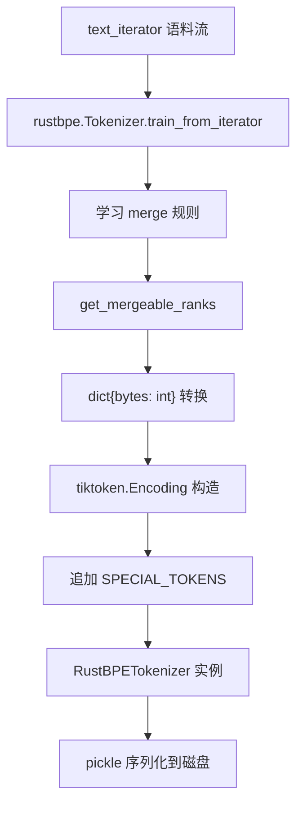
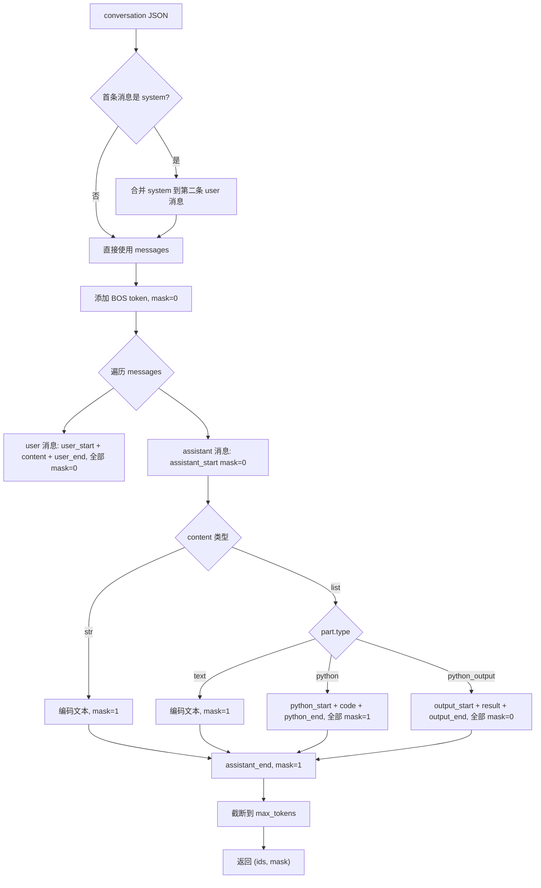

# PD-430.03 nanochat — 双后端 BPE Tokenizer：rustbpe 训练 + tiktoken 推理

> 文档编号：PD-430.03
> 来源：nanochat `nanochat/tokenizer.py`, `scripts/tok_train.py`, `scripts/tok_eval.py`
> GitHub：https://github.com/karpathy/nanochat.git
> 问题域：PD-430 BPE Tokenizer 训练与推理 BPE Tokenizer Training & Inference
> 状态：可复用方案

---

## 第 1 章 问题与动机

### 1.1 核心问题

训练一个 BPE tokenizer 和用它做推理是两个截然不同的工程需求：

- **训练**需要从原始文本语料中学习 merge 规则，计算量大，需要高效的 Rust 实现
- **推理**需要快速编码/解码，支持多线程批量处理，需要成熟的生产级库
- **特殊 token** 在训练时不参与 BPE merge，但推理时必须正确识别和处理
- **对话格式**需要将多轮对话渲染为 token 序列，并生成精确的训练 mask（只监督 assistant 输出）
- **数字分组**策略直接影响小词表模型的 token 利用效率

大多数项目要么用 HuggingFace tokenizers 全家桶（API 复杂、配置混乱），要么用 sentencepiece（C++ 依赖重）。nanochat 选择了一条更清晰的路径：用 rustbpe 做训练，用 tiktoken 做推理，两者通过 mergeable_ranks 字典桥接。

### 1.2 nanochat 的解法概述

1. **双后端架构**：`RustBPETokenizer` 类封装 rustbpe（训练）+ tiktoken（推理）的组合，训练完成后将 merge 规则转换为 tiktoken `Encoding` 对象（`nanochat/tokenizer.py:171-190`）
2. **GPT-4 风格 split pattern 优化**：采用 `\p{N}{1,2}` 替代 GPT-4 原版的 `\p{N}{1,3}`，针对 32K 小词表优化数字 token 分配（`nanochat/tokenizer.py:29-30`）
3. **9 个特殊 token 体系**：bos + 4 对 start/end token（user/assistant/python/output），支持对话、工具调用、REPL 输出的完整标记（`nanochat/tokenizer.py:13-25`）
4. **render_conversation 对话渲染**：将 JSON 对话结构转换为 token 序列 + mask 数组，精确控制哪些 token 参与 SFT 损失计算（`nanochat/tokenizer.py:266-350`）
5. **token_bytes 缓存**：训练后预计算每个 token 的 UTF-8 字节数，用于 bits-per-byte 评估指标（`scripts/tok_train.py:76-91`）

### 1.3 设计思想

| 设计原则 | 具体实现 | 理由 | 替代方案 |
|----------|----------|------|----------|
| 训练推理分离 | rustbpe 训练 → mergeable_ranks → tiktoken 推理 | 训练用 Rust 速度快，推理用 tiktoken 生态成熟 | HuggingFace tokenizers 全包（API 复杂） |
| 小词表优化 | `\p{N}{1,2}` 数字分组 | 32K 词表下 2 位数字分组是最优甜点 | GPT-4 原版 `\p{N}{1,3}` 浪费 token 空间 |
| 特殊 token 后置 | 特殊 token 不参与 BPE 训练，训练后追加到词表末尾 | 不干扰 merge 规则学习 | 预留 ID 段（浪费空间） |
| mask 精确控制 | user 内容 mask=0，assistant 内容 mask=1，python_output mask=0 | SFT 只监督模型应该生成的内容 | 全部 mask=1（学到不该学的） |
| 评估指标不变性 | token_bytes 映射实现 bits-per-byte | 不同词表大小的模型可以公平比较 | 直接用 token-level loss（受词表大小影响） |

---

## 第 2 章 源码实现分析

### 2.1 架构概览

nanochat 的 tokenizer 系统由三层组成：

```
┌─────────────────────────────────────────────────────────────┐
│                    应用层 (Scripts)                          │
│  tok_train.py    tok_eval.py    chat_sft.py    chat_rl.py   │
│  (训练词表)      (压缩率评估)   (SFT 训练)     (RL 训练)     │
└──────────────┬──────────────────────────┬───────────────────┘
               │                          │
               ▼                          ▼
┌──────────────────────────┐  ┌───────────────────────────────┐
│   RustBPETokenizer       │  │   HuggingFaceTokenizer        │
│   (主力实现)              │  │   (备选实现，API 兼容)         │
│                          │  │                               │
│  训练: rustbpe            │  │  训练: HF BpeTrainer          │
│  推理: tiktoken           │  │  推理: HF Tokenizer           │
│  序列化: pickle           │  │  序列化: tokenizer.json       │
│                          │  │                               │
│  + render_conversation() │  │  (无对话渲染能力)              │
│  + render_for_completion()│  │                               │
│  + visualize_tokenization()│ │                               │
└──────────────────────────┘  └───────────────────────────────┘
               │
               ▼
┌──────────────────────────────────────────────────────────────┐
│                    数据流层 (Dataloader)                      │
│  dataloader.py: BOS-aligned best-fit packing                 │
│  - tokenizer.encode(batch, prepend=bos, num_threads=4)       │
│  - Best-fit 算法最小化文档裁剪                                │
│  - 100% 利用率，~35% token 被裁剪                             │
└──────────────────────────────────────────────────────────────┘
```

### 2.2 核心实现

#### 2.2.1 双后端训练-推理桥接



对应源码 `nanochat/tokenizer.py:171-190`：

```python
class RustBPETokenizer:
    """Light wrapper around tiktoken (for efficient inference) but train with rustbpe"""

    def __init__(self, enc, bos_token):
        self.enc = enc
        self.bos_token_id = self.encode_special(bos_token)

    @classmethod
    def train_from_iterator(cls, text_iterator, vocab_size):
        # 1) train using rustbpe
        tokenizer = rustbpe.Tokenizer()
        vocab_size_no_special = vocab_size - len(SPECIAL_TOKENS)
        assert vocab_size_no_special >= 256
        tokenizer.train_from_iterator(text_iterator, vocab_size_no_special, pattern=SPLIT_PATTERN)
        # 2) construct the associated tiktoken encoding for inference
        pattern = tokenizer.get_pattern()
        mergeable_ranks_list = tokenizer.get_mergeable_ranks()
        mergeable_ranks = {bytes(k): v for k, v in mergeable_ranks_list}
        tokens_offset = len(mergeable_ranks)
        special_tokens = {name: tokens_offset + i for i, name in enumerate(SPECIAL_TOKENS)}
        enc = tiktoken.Encoding(
            name="rustbpe",
            pat_str=pattern,
            mergeable_ranks=mergeable_ranks,
            special_tokens=special_tokens,
        )
        return cls(enc, "<|bos|>")
```

关键设计点：
- `vocab_size_no_special = vocab_size - len(SPECIAL_TOKENS)`：预留 9 个位置给特殊 token（`tokenizer.py:175-176`）
- `tokens_offset = len(mergeable_ranks)`：特殊 token ID 紧接在普通 token 之后（`tokenizer.py:182`）
- 桥接核心是 `mergeable_ranks` 字典：`dict[bytes, int]`，将 rustbpe 的 merge 结果转换为 tiktoken 可消费的格式（`tokenizer.py:181`）

#### 2.2.2 对话渲染与 mask 生成



对应源码 `nanochat/tokenizer.py:266-350`：

```python
def render_conversation(self, conversation, max_tokens=2048):
    ids, mask = [], []
    def add_tokens(token_ids, mask_val):
        if isinstance(token_ids, int):
            token_ids = [token_ids]
        ids.extend(token_ids)
        mask.extend([mask_val] * len(token_ids))

    # system 消息合并到 user
    if conversation["messages"][0]["role"] == "system":
        conversation = copy.deepcopy(conversation)
        messages = conversation["messages"]
        messages[1]["content"] = messages[0]["content"] + "\n\n" + messages[1]["content"]
        messages = messages[1:]
    else:
        messages = conversation["messages"]

    bos = self.get_bos_token_id()
    user_start, user_end = self.encode_special("<|user_start|>"), self.encode_special("<|user_end|>")
    assistant_start, assistant_end = self.encode_special("<|assistant_start|>"), self.encode_special("<|assistant_end|>")

    add_tokens(bos, 0)
    for i, message in enumerate(messages):
        must_be_from = "user" if i % 2 == 0 else "assistant"
        assert message["role"] == must_be_from
        content = message["content"]

        if message["role"] == "user":
            add_tokens(user_start, 0)
            add_tokens(self.encode(content), 0)
            add_tokens(user_end, 0)
        elif message["role"] == "assistant":
            add_tokens(assistant_start, 0)
            if isinstance(content, str):
                add_tokens(self.encode(content), 1)
            elif isinstance(content, list):
                for part in content:
                    value_ids = self.encode(part["text"])
                    if part["type"] == "text":
                        add_tokens(value_ids, 1)
                    elif part["type"] == "python":
                        add_tokens(python_start, 1)
                        add_tokens(value_ids, 1)
                        add_tokens(python_end, 1)
                    elif part["type"] == "python_output":
                        add_tokens(output_start, 0)
                        add_tokens(value_ids, 0)
                        add_tokens(output_end, 0)
            add_tokens(assistant_end, 1)

    ids = ids[:max_tokens]
    mask = mask[:max_tokens]
    return ids, mask
```

### 2.3 实现细节

#### 训练流水线数据流

训练脚本 `scripts/tok_train.py` 的数据流：

1. **语料迭代器**（`tok_train.py:28-44`）：从 parquet 文件流式读取，每文档截断到 `doc_cap`（默认 10K 字符），总量上限 `max_chars`（默认 2B 字符）
2. **rustbpe 训练**（`tok_train.py:49`）：`RustBPETokenizer.train_from_iterator(text_iter, vocab_size=32768)`
3. **sanity check**（`tok_train.py:62-69`）：编码→解码→断言一致性
4. **token_bytes 缓存**（`tok_train.py:76-91`）：遍历词表，计算每个 token 的 UTF-8 字节数，特殊 token 记为 0，保存为 `torch.Tensor`

#### 多线程批量编码

`RustBPETokenizer.encode()` 支持 list 输入时调用 tiktoken 的 `encode_ordinary_batch`（`tokenizer.py:240`），默认 `num_threads=8`。dataloader 中实际使用 `num_threads=4`（`dataloader.py:106`），在 BOS-aligned best-fit packing 中批量编码文档。

#### 压缩率评估

`scripts/tok_eval.py` 对比三个 tokenizer（GPT-2、GPT-4、自训练）在 6 种文本类型（新闻、韩文、代码、数学、科学、训练集）上的压缩率（bytes/tokens），验证自训练 tokenizer 的质量（`tok_eval.py:163-243`）。

#### render_for_completion 用于 RL

`render_for_completion`（`tokenizer.py:367-385`）在 RL 场景中使用：移除最后一条 assistant 消息，渲染剩余对话，末尾追加 `<|assistant_start|>` token，让模型从此处开始生成。`chat_eval.py:44` 和 `chat_rl.py` 中均调用此方法。


---

## 第 3 章 迁移指南

### 3.1 迁移清单

**阶段 1：基础 tokenizer（1 个文件）**

- [ ] 安装依赖：`pip install rustbpe tiktoken`
- [ ] 定义 SPLIT_PATTERN（根据词表大小选择 `\p{N}{1,2}` 或 `\p{N}{1,3}`）
- [ ] 定义 SPECIAL_TOKENS 列表（至少 bos，按需添加角色 token）
- [ ] 实现 `train_from_iterator` 方法：rustbpe 训练 → mergeable_ranks → tiktoken Encoding
- [ ] 实现 `save/from_directory`：pickle 序列化 tiktoken Encoding 对象

**阶段 2：对话渲染（可选，SFT/RL 场景需要）**

- [ ] 实现 `render_conversation`：对话 JSON → (ids, mask) 映射
- [ ] 实现 `render_for_completion`：RL 场景的 prompt 渲染
- [ ] 定义 mask 策略：哪些角色的 token 参与损失计算

**阶段 3：评估与集成**

- [ ] 实现 token_bytes 缓存用于 bits-per-byte 评估
- [ ] 编写压缩率对比脚本（对比 GPT-2/GPT-4 基线）
- [ ] 集成到 dataloader：批量编码 + BOS prepend

### 3.2 适配代码模板

以下是一个可直接运行的最小化双后端 tokenizer 实现：

```python
"""
Minimal dual-backend BPE tokenizer: rustbpe for training, tiktoken for inference.
Adapted from nanochat/tokenizer.py
"""
import os
import pickle
from functools import lru_cache
import rustbpe
import tiktoken

# GPT-4 style split pattern, optimized for small vocab (32K)
SPLIT_PATTERN = r"""'(?i:[sdmt]|ll|ve|re)|[^\r\n\p{L}\p{N}]?+\p{L}+|\p{N}{1,2}| ?[^\s\p{L}\p{N}]++[\r\n]*|\s*[\r\n]|\s+(?!\S)|\s+"""

# Define your special tokens here
SPECIAL_TOKENS = ["<|bos|>", "<|eos|>"]

class DualBPETokenizer:
    def __init__(self, enc: tiktoken.Encoding, bos_token: str = "<|bos|>"):
        self.enc = enc
        self.bos_token_id = self.encode_special(bos_token)

    @classmethod
    def train(cls, text_iterator, vocab_size: int = 32768):
        tokenizer = rustbpe.Tokenizer()
        vocab_size_no_special = vocab_size - len(SPECIAL_TOKENS)
        tokenizer.train_from_iterator(text_iterator, vocab_size_no_special, pattern=SPLIT_PATTERN)

        # Bridge: rustbpe merge rules → tiktoken Encoding
        mergeable_ranks = {bytes(k): v for k, v in tokenizer.get_mergeable_ranks()}
        offset = len(mergeable_ranks)
        special = {name: offset + i for i, name in enumerate(SPECIAL_TOKENS)}

        enc = tiktoken.Encoding(
            name="custom_bpe",
            pat_str=tokenizer.get_pattern(),
            mergeable_ranks=mergeable_ranks,
            special_tokens=special,
        )
        return cls(enc)

    @lru_cache(maxsize=32)
    def encode_special(self, text: str) -> int:
        return self.enc.encode_single_token(text)

    def encode(self, text, num_threads: int = 8):
        if isinstance(text, str):
            return self.enc.encode_ordinary(text)
        return self.enc.encode_ordinary_batch(text, num_threads=num_threads)

    def decode(self, ids: list[int]) -> str:
        return self.enc.decode(ids)

    def save(self, path: str):
        os.makedirs(os.path.dirname(path), exist_ok=True)
        with open(path, "wb") as f:
            pickle.dump(self.enc, f)

    @classmethod
    def load(cls, path: str):
        with open(path, "rb") as f:
            enc = pickle.load(f)
        return cls(enc)
```

### 3.3 适用场景

| 场景 | 适用度 | 说明 |
|------|--------|------|
| 从零训练 LLM tokenizer | ⭐⭐⭐ | 核心场景，rustbpe 训练速度快，tiktoken 推理成熟 |
| 小词表模型（≤64K） | ⭐⭐⭐ | `\p{N}{1,2}` 优化在小词表下效果显著 |
| SFT/RLHF 对话训练 | ⭐⭐⭐ | render_conversation + mask 机制完美匹配 |
| 大词表模型（≥128K） | ⭐⭐ | 数字分组可切回 `\p{N}{1,3}`，其余架构不变 |
| 多语言 tokenizer | ⭐⭐ | 架构通用，但 split pattern 可能需要调整 |
| 已有 tokenizer 的项目 | ⭐ | 主要价值在训练阶段，已有 tokenizer 无需迁移 |

---

## 第 4 章 测试用例

```python
"""
Tests for dual-backend BPE tokenizer.
Based on actual function signatures from nanochat/tokenizer.py
"""
import pytest
import copy


class TestRustBPETokenizer:
    """Test the core tokenizer functionality"""

    def test_encode_decode_roundtrip(self, tokenizer):
        """Basic roundtrip: encode then decode should return original text"""
        text = "Hello world! This is a test. Numbers: 123, 4567"
        encoded = tokenizer.encode(text)
        decoded = tokenizer.decode(encoded)
        assert decoded == text

    def test_encode_unicode_roundtrip(self, tokenizer):
        """Unicode text should survive encode/decode roundtrip"""
        text = "你好世界 🌍 café résumé"
        encoded = tokenizer.encode(text)
        decoded = tokenizer.decode(encoded)
        assert decoded == text

    def test_special_token_encoding(self, tokenizer):
        """Special tokens should encode to single integer IDs"""
        bos_id = tokenizer.encode_special("<|bos|>")
        assert isinstance(bos_id, int)
        assert bos_id >= 0

    def test_special_tokens_not_in_ordinary_encode(self, tokenizer):
        """encode_ordinary should not recognize special token strings"""
        text = "Hello <|bos|> world"
        encoded = tokenizer.encode(text)
        bos_id = tokenizer.encode_special("<|bos|>")
        # <|bos|> in plain text should be encoded as regular characters, not as special token
        assert bos_id not in encoded

    def test_batch_encode(self, tokenizer):
        """List input should return list of token lists"""
        texts = ["Hello world", "Goodbye world", "Test 123"]
        results = tokenizer.encode(texts, num_threads=2)
        assert isinstance(results, list)
        assert len(results) == 3
        for r in results:
            assert isinstance(r, list)
            assert all(isinstance(t, int) for t in r)

    def test_prepend_append(self, tokenizer):
        """prepend/append should add special tokens at boundaries"""
        bos = tokenizer.get_bos_token_id()
        encoded = tokenizer.encode("test", prepend=bos)
        assert encoded[0] == bos

    def test_vocab_size(self, tokenizer):
        """Vocab size should match training config"""
        vs = tokenizer.get_vocab_size()
        assert vs > 256  # at least byte-level tokens
        assert isinstance(vs, int)


class TestRenderConversation:
    """Test conversation rendering and mask generation"""

    def test_simple_conversation(self, tokenizer):
        """Simple user-assistant conversation should produce valid ids and mask"""
        conv = {"messages": [
            {"role": "user", "content": "Hi"},
            {"role": "assistant", "content": "Hello!"},
        ]}
        ids, mask = tokenizer.render_conversation(conv)
        assert len(ids) == len(mask)
        assert all(m in (0, 1) for m in mask)
        # BOS should be first token with mask=0
        assert ids[0] == tokenizer.get_bos_token_id()
        assert mask[0] == 0

    def test_assistant_tokens_supervised(self, tokenizer):
        """Only assistant content tokens should have mask=1"""
        conv = {"messages": [
            {"role": "user", "content": "What is 2+2?"},
            {"role": "assistant", "content": "4"},
        ]}
        ids, mask = tokenizer.render_conversation(conv)
        # There should be at least one supervised token (the "4")
        assert 1 in mask
        # User content should not be supervised
        # (mask=0 for BOS, user_start, user content, user_end, assistant_start)

    def test_system_message_merged(self, tokenizer):
        """System message should be merged into first user message"""
        conv = {"messages": [
            {"role": "system", "content": "You are helpful."},
            {"role": "user", "content": "Hi"},
            {"role": "assistant", "content": "Hello!"},
        ]}
        ids, mask = tokenizer.render_conversation(conv)
        assert len(ids) == len(mask)

    def test_python_output_not_supervised(self, tokenizer):
        """python_output parts should have mask=0 (not supervised)"""
        conv = {"messages": [
            {"role": "user", "content": "Run code"},
            {"role": "assistant", "content": [
                {"type": "python", "text": "print(42)"},
                {"type": "python_output", "text": "42"},
                {"type": "text", "text": "The answer is 42."},
            ]},
        ]}
        ids, mask = tokenizer.render_conversation(conv)
        assert len(ids) == len(mask)

    def test_max_tokens_truncation(self, tokenizer):
        """Output should be truncated to max_tokens"""
        conv = {"messages": [
            {"role": "user", "content": "A" * 10000},
            {"role": "assistant", "content": "B" * 10000},
        ]}
        ids, mask = tokenizer.render_conversation(conv, max_tokens=100)
        assert len(ids) <= 100
        assert len(mask) <= 100


class TestRenderForCompletion:
    """Test RL-style completion rendering"""

    def test_ends_with_assistant_start(self, tokenizer):
        """render_for_completion should end with assistant_start token"""
        conv = {"messages": [
            {"role": "user", "content": "Hi"},
            {"role": "assistant", "content": "Hello!"},
        ]}
        ids = tokenizer.render_for_completion(conv)
        assistant_start = tokenizer.encode_special("<|assistant_start|>")
        assert ids[-1] == assistant_start

    def test_does_not_contain_last_assistant_content(self, tokenizer):
        """Last assistant message should be removed (model generates it)"""
        conv = {"messages": [
            {"role": "user", "content": "Hi"},
            {"role": "assistant", "content": "Hello!"},
        ]}
        ids = tokenizer.render_for_completion(conv)
        # The rendered prompt should not contain the "Hello!" tokens
        hello_ids = tokenizer.encode("Hello!")
        # Check that the hello tokens don't appear at the end (before assistant_start)
        prompt_without_last = ids[:-1]
        # This is a rough check - the exact position depends on tokenization
        assert len(ids) > 0
```

---

## 第 5 章 跨域关联

| 关联域 | 关系类型 | 说明 |
|--------|----------|------|
| PD-01 上下文管理 | 协同 | tokenizer 的 `max_tokens` 截断直接影响上下文窗口管理；token_bytes 缓存支持 bits-per-byte 评估，间接影响上下文压缩策略选择 |
| PD-431 高效数据加载 | 依赖 | dataloader 的 BOS-aligned best-fit packing 依赖 tokenizer 的批量编码能力（`encode_ordinary_batch` + `num_threads`）和 BOS token ID |
| PD-422 LLM 训练流水线 | 协同 | tokenizer 是训练流水线的第一环：tok_train → base_train → chat_sft → chat_rl，每个阶段都依赖 tokenizer 的不同能力 |
| PD-423 任务抽象 | 协同 | 各 task（GSM8K、MMLU、SpellingBee）通过 `render_conversation` / `render_for_completion` 将任务数据转换为模型输入 |

---

## 第 6 章 来源文件索引

| 文件 | 行范围 | 关键实现 |
|------|--------|----------|
| `nanochat/tokenizer.py` | L1-L30 | SPECIAL_TOKENS 定义（9 个）、SPLIT_PATTERN（GPT-4 风格，数字 1-2 位优化） |
| `nanochat/tokenizer.py` | L39-L156 | HuggingFaceTokenizer 类（备选实现，HF BpeTrainer 训练 + HF Tokenizer 推理） |
| `nanochat/tokenizer.py` | L163-L265 | RustBPETokenizer 核心类（rustbpe 训练 + tiktoken 推理、encode/decode、save/load） |
| `nanochat/tokenizer.py` | L266-L350 | render_conversation：对话 JSON → (ids, mask) 映射，含 system 消息合并、工具调用处理 |
| `nanochat/tokenizer.py` | L352-L385 | visualize_tokenization（调试辅助）、render_for_completion（RL 场景 prompt 渲染） |
| `nanochat/tokenizer.py` | L390-L406 | get_tokenizer / get_token_bytes 便捷函数 |
| `scripts/tok_train.py` | L1-L107 | 训练脚本：语料迭代器（doc_cap + max_chars）、rustbpe 训练、sanity check、token_bytes 缓存 |
| `scripts/tok_eval.py` | L1-L265 | 评估脚本：GPT-2/GPT-4/自训练三方压缩率对比，6 种文本类型（新闻/韩文/代码/数学/科学/训练集） |
| `nanochat/dataloader.py` | L73-L165 | BOS-aligned best-fit dataloader：调用 tokenizer.encode(batch, prepend=bos, num_threads=4) |
| `scripts/chat_eval.py` | L31-L50 | 生成式评估：调用 tokenizer.render_for_completion 渲染 prompt |

---

## 第 7 章 横向对比维度

> **重要：** 本章用于自动填充 Butcher Wiki 的横向对比表。
> 必须严格按以下 JSON 格式输出，放在 `comparison_data` 代码块中。

```json comparison_data
{
  "project": "nanochat",
  "dimensions": {
    "执行架构": "rustbpe 训练 + tiktoken 推理的双后端架构，pickle 序列化桥接",
    "决策管道": "SPLIT_PATTERN 预分词 → rustbpe BPE merge → tiktoken Encoding 构造",
    "模拟执行": "tok_eval.py 对比 GPT-2/GPT-4 基线的 6 类文本压缩率评估",
    "训练推理分离": "训练用 rustbpe（Rust 速度），推理用 tiktoken（多线程批量编码）",
    "特殊 token 体系": "9 个特殊 token（bos + 4 对 start/end），训练后追加不干扰 merge",
    "对话渲染策略": "render_conversation 生成 ids+mask，精确控制 SFT 监督范围",
    "数字分组优化": "\\p{N}{1,2} 替代 GPT-4 的 {1,3}，32K 词表下最优甜点"
  }
}
```

### 域元数据补充

```json domain_metadata
{
  "solution_summary": "nanochat 用 rustbpe 训练 + tiktoken 推理的双后端架构，通过 mergeable_ranks 字典桥接，配合 GPT-4 风格 split pattern（数字分组优化为 1-2 位）和 render_conversation 对话→token+mask 映射",
  "description": "训练与推理后端的工程桥接方案，以及对话格式到 token 序列的精确映射",
  "sub_problems": [
    "split pattern 数字分组位数对小词表 token 效率的影响",
    "token_bytes 缓存实现词表大小无关的 bits-per-byte 评估",
    "system 消息到 user 消息的合并策略",
    "RL 场景下 prompt 渲染与 SFT 渲染的差异处理"
  ],
  "best_practices": [
    "特殊 token 不参与 BPE 训练，训练后按 offset 追加到词表末尾",
    "python_output 类型的 token mask=0 不参与监督，因为推理时由外部工具生成",
    "训练后立即做 encode→decode roundtrip sanity check 验证正确性",
    "预计算 token_bytes 张量用于 bits-per-byte 评估，特殊 token 记为 0 字节"
  ]
}
```

