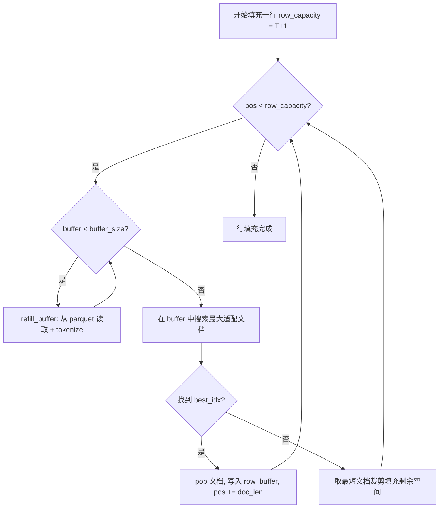
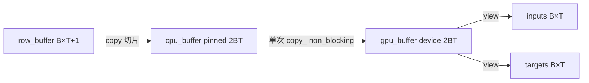
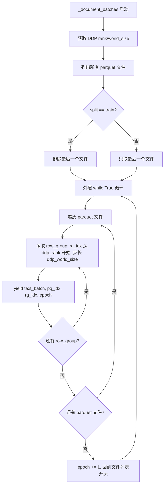

# PD-431.03 nanochat — BOS 对齐 Best-Fit 文档打包数据加载管道

> 文档编号：PD-431.03
> 来源：nanochat `nanochat/dataloader.py`, `nanochat/dataset.py`
> GitHub：https://github.com/karpathy/nanochat.git
> 问题域：PD-431 高效数据加载管道 Efficient Data Loading Pipeline
> 状态：可复用方案

---

## 第 1 章 问题与动机

### 1.1 核心问题

LLM 预训练的数据加载面临一个根本矛盾：**训练效率要求固定长度序列（GPU 矩阵运算最优），但自然文档长度参差不齐**。

传统做法有两种极端：
1. **Padding 方案**：短文档用 padding token 填充到固定长度 → 浪费算力训练无意义 token
2. **简单拼接方案**：文档首尾相连后按固定长度切割 → 切割点可能落在文档中间，模型看到的上下文跨越了不相关的文档边界，attention 计算包含"混淆 token"

nanochat 的 dataloader 提出了第三条路：**BOS 对齐 + Best-Fit 打包**，在保证 100% 利用率（零 padding）的同时，确保每行序列都以 BOS token 开头，模型永远能看到完整的文档上下文。

### 1.2 nanochat 的解法概述

1. **Best-Fit 文档打包**：维护一个 buffer（默认 1000 篇文档），为每行序列从 buffer 中搜索能完整放入的最大文档，最大化利用率（`nanochat/dataloader.py:131-144`）
2. **BOS 对齐**：每行序列必须以 BOS token 开头，通过 tokenizer 的 `prepend=bos_token` 保证每篇文档都带 BOS 前缀（`nanochat/dataloader.py:99,106`）
3. **裁剪填充**：当 buffer 中没有文档能完整放入剩余空间时，取最短文档裁剪填充，确保 100% 利用率（`nanochat/dataloader.py:146-150`）
4. **预分配 pinned memory + 单次 HtoD 传输**：预分配 CPU pinned buffer 和 GPU buffer，每个 batch 只做一次 `copy_` 传输（`nanochat/dataloader.py:110-119,159`）
5. **DDP 分片 + 多 epoch 无限迭代 + 断点恢复**：rank 交错读取 row_group，无限循环 parquet 文件，yield state_dict 支持 checkpoint 恢复（`nanochat/dataloader.py:25-70`）

### 1.3 设计思想

| 设计原则 | 具体实现 | 理由 | 替代方案 |
|----------|----------|------|----------|
| 零 padding | Best-Fit 打包 + 裁剪填充 | 每个 token 都参与训练，不浪费算力 | Padding（浪费 10-50% 算力） |
| BOS 对齐 | 每行以 BOS 开头，每篇文档 tokenize 时 prepend BOS | 模型始终能 attend 到完整文档上下文 | 简单拼接（跨文档 attention 混淆） |
| 最小化裁剪 | buffer 搜索最大适配文档 | 减少被裁剪丢弃的 token 比例 | Greedy 顺序填充（裁剪率更高） |
| 零拷贝传输 | 预分配 pinned memory + 单次 non_blocking copy | 消除每 batch 的内存分配开销 | 每 batch 新建 tensor（GC 压力大） |
| 无缝分布式 | rank 交错读取 row_group | 零通信开销的数据分片 | Scatter/Gather（需要额外通信） |

---

## 第 2 章 源码实现分析

### 2.1 架构概览

nanochat 的数据加载管道分为三层：

```
┌─────────────────────────────────────────────────────────────────┐
│                     Training Loop (base_train.py)               │
│  x, y, state_dict = next(train_loader)                         │
└──────────────────────────┬──────────────────────────────────────┘
                           │
┌──────────────────────────▼──────────────────────────────────────┐
│          Best-Fit Packing Layer (dataloader.py:73-165)          │
│  ┌──────────┐  ┌──────────────┐  ┌───────────────────────────┐ │
│  │ doc_buffer│→│ Best-Fit 搜索 │→│ row_buffer → pinned → GPU │ │
│  │ (1000 docs)│ │ + 裁剪填充   │  │ (预分配, 单次 HtoD)       │ │
│  └─────┬────┘  └──────────────┘  └───────────────────────────┘ │
│        │ refill                                                 │
└────────┼────────────────────────────────────────────────────────┘
         │
┌────────▼────────────────────────────────────────────────────────┐
│        Document Iterator Layer (dataloader.py:25-70)            │
│  Parquet files → DDP rank 交错 row_group → batch tokenize      │
│  无限循环 (multi-epoch) + state_dict 断点恢复                    │
└────────┬────────────────────────────────────────────────────────┘
         │
┌────────▼────────────────────────────────────────────────────────┐
│           Dataset Layer (dataset.py)                             │
│  Parquet 文件发现 + 按需下载 + train/val 分割                    │
└─────────────────────────────────────────────────────────────────┘
```

### 2.2 核心实现

#### 2.2.1 Best-Fit 打包算法



对应源码 `nanochat/dataloader.py:121-150`：

```python
while True:
    for row_idx in range(B):
        pos = 0
        while pos < row_capacity:
            # Ensure buffer has documents
            while len(doc_buffer) < buffer_size:
                refill_buffer()

            remaining = row_capacity - pos

            # Find largest doc that fits entirely
            best_idx = -1
            best_len = 0
            for i, doc in enumerate(doc_buffer):
                doc_len = len(doc)
                if doc_len <= remaining and doc_len > best_len:
                    best_idx = i
                    best_len = doc_len

            if best_idx >= 0:
                doc = doc_buffer.pop(best_idx)
                doc_len = len(doc)
                row_buffer[row_idx, pos:pos + doc_len] = torch.tensor(doc, dtype=torch.long)
                pos += doc_len
            else:
                # No doc fits - crop shortest to fill remaining
                shortest_idx = min(range(len(doc_buffer)), key=lambda i: len(doc_buffer[i]))
                doc = doc_buffer.pop(shortest_idx)
                row_buffer[row_idx, pos:pos + remaining] = torch.tensor(doc[:remaining], dtype=torch.long)
                pos += remaining
```

核心设计要点：
- **Best-Fit 而非 First-Fit**：遍历整个 buffer 找最大适配文档（`nanochat/dataloader.py:133-138`），而非取第一个能放下的。这最大化了单次填充量，减少后续裁剪概率
- **裁剪最短文档**：当无文档能完整放入时，选择 buffer 中最短的文档裁剪（`nanochat/dataloader.py:147`），因为短文档被裁剪后丢失的 token 绝对数量最少
- **100% 利用率**：裁剪精确填满剩余空间（`doc[:remaining]`），不留任何 padding

#### 2.2.2 预分配 pinned memory 与单次 HtoD 传输



对应源码 `nanochat/dataloader.py:110-119,152-159`：

```python
# Pre-allocate buffers once: layout is [inputs (B*T) | targets (B*T)]
use_cuda = device == "cuda"
row_buffer = torch.empty((B, row_capacity), dtype=torch.long)
cpu_buffer = torch.empty(2 * B * T, dtype=torch.long, pin_memory=use_cuda)
gpu_buffer = torch.empty(2 * B * T, dtype=torch.long, device=device)
cpu_inputs = cpu_buffer[:B * T].view(B, T)
cpu_targets = cpu_buffer[B * T:].view(B, T)
inputs = gpu_buffer[:B * T].view(B, T)
targets = gpu_buffer[B * T:].view(B, T)

# ... 填充 row_buffer 后 ...

# Copy to pinned CPU buffer, then single HtoD transfer
cpu_inputs.copy_(row_buffer[:, :-1])
cpu_targets.copy_(row_buffer[:, 1:])
gpu_buffer.copy_(cpu_buffer, non_blocking=use_cuda)
yield inputs, targets, state_dict
```

关键设计：
- **一次分配，永久复用**：`row_buffer`、`cpu_buffer`、`gpu_buffer` 在 dataloader 初始化时分配一次，之后每个 batch 只做 `copy_` 操作（`nanochat/dataloader.py:113-115`）
- **inputs/targets 共享同一块连续内存**：`cpu_buffer` 是 `2*B*T` 的一维 tensor，前半是 inputs 后半是 targets，这样只需一次 `gpu_buffer.copy_(cpu_buffer)` 就完成整个 batch 的 HtoD 传输
- **non_blocking 异步传输**：pinned memory 允许 DMA 传输与 CPU 计算重叠

#### 2.2.3 DDP 分片与多 epoch 无限迭代



对应源码 `nanochat/dataloader.py:25-70`：

```python
def _document_batches(split, resume_state_dict, tokenizer_batch_size):
    ddp, ddp_rank, ddp_local_rank, ddp_world_size = get_dist_info()
    parquet_paths = list_parquet_files()
    parquet_paths = parquet_paths[:-1] if split == "train" else parquet_paths[-1:]

    # Resume support
    resume_pq_idx = resume_state_dict["pq_idx"] if resume_state_dict is not None else 0
    resume_rg_idx = resume_state_dict["rg_idx"] if resume_state_dict is not None else None
    resume_epoch = resume_state_dict.get("epoch", 1) if resume_state_dict is not None else 1

    while True:  # infinite multi-epoch loop
        pq_idx = resume_pq_idx if first_pass else 0
        while pq_idx < len(parquet_paths):
            pf = pq.ParquetFile(parquet_paths[pq_idx])
            # DDP sharding: each rank reads every world_size-th row_group
            rg_idx = ddp_rank
            while rg_idx < pf.num_row_groups:
                rg = pf.read_row_group(rg_idx)
                batch = rg.column('text').to_pylist()
                for i in range(0, len(batch), tokenizer_batch_size):
                    yield batch[i:i+tokenizer_batch_size], (pq_idx, rg_idx, epoch)
                rg_idx += ddp_world_size
            pq_idx += 1
        epoch += 1
```

DDP 分片策略：
- **rank 交错读取**：rank 0 读 row_group 0, 4, 8...；rank 1 读 1, 5, 9...（`nanochat/dataloader.py:62,67`）
- **零通信开销**：每个 rank 独立决定读哪些 row_group，不需要 scatter/gather
- **断点恢复**：resume 时从 `(pq_idx, rg_idx)` 位置恢复，跳过已处理的数据（`nanochat/dataloader.py:52-59`）

### 2.3 实现细节

**Tokenizer 批量编码优化**：`refill_buffer` 调用 `tokenizer.encode(doc_batch, prepend=bos_token, num_threads=tokenizer_threads)`（`nanochat/dataloader.py:106`），利用 tiktoken 的多线程批量编码，默认 4 线程并行 tokenize 128 篇文档。

**Train/Val 分割策略**：最后一个 parquet 文件作为 val set，其余全部作为 train set（`nanochat/dataset.py:51`）。简单但有效，避免了复杂的随机分割逻辑。

**数据按需下载**：`dataset.py` 支持从 HuggingFace 按需下载 parquet shard，带指数退避重试（最多 5 次，`nanochat/dataset.py:76-107`），先写临时文件再 rename 保证原子性。

**row_capacity = T + 1 的设计**：每行实际存储 T+1 个 token（`nanochat/dataloader.py:97`），这样 `inputs = row[:, :-1]`（T 个 token）和 `targets = row[:, 1:]`（T 个 token）自然形成 next-token prediction 的输入输出对。


---

## 第 3 章 迁移指南

### 3.1 迁移清单

**阶段 1：基础 Best-Fit 打包（单 GPU）**
- [ ] 实现 document buffer + best-fit 搜索逻辑
- [ ] 实现裁剪填充（crop shortest when nothing fits）
- [ ] 确保每行以 BOS token 开头
- [ ] 验证 100% 利用率（无 padding token）

**阶段 2：内存优化**
- [ ] 预分配 row_buffer、cpu_buffer（pinned）、gpu_buffer
- [ ] 实现 inputs/targets 共享连续内存布局
- [ ] 使用 `copy_` + `non_blocking` 替代每 batch 新建 tensor

**阶段 3：分布式支持**
- [ ] 实现 rank 交错 row_group 读取
- [ ] 添加 state_dict yield 支持断点恢复
- [ ] 实现多 epoch 无限迭代

### 3.2 适配代码模板

以下是一个可直接运行的 Best-Fit 打包 dataloader 模板，已从 nanochat 提取并泛化：

```python
import torch
from typing import Iterator, Tuple, Dict, Any, List

def bestfit_packing_dataloader(
    doc_iterator: Iterator[List[int]],  # 迭代器，每次 yield 一个 token id 列表
    batch_size: int,                     # B
    seq_len: int,                        # T
    device: str = "cuda",
    buffer_size: int = 1000,
) -> Iterator[Tuple[torch.Tensor, torch.Tensor]]:
    """
    Best-Fit 文档打包 dataloader。
    
    - 每行以第一个文档的 BOS token 开头
    - 100% 利用率（零 padding）
    - 预分配 pinned memory + 单次 HtoD 传输
    """
    row_capacity = seq_len + 1  # +1 for next-token prediction shift
    use_cuda = device == "cuda"
    
    # 预分配 buffer（一次分配，永久复用）
    row_buffer = torch.empty((batch_size, row_capacity), dtype=torch.long)
    cpu_buffer = torch.empty(2 * batch_size * seq_len, dtype=torch.long, pin_memory=use_cuda)
    gpu_buffer = torch.empty(2 * batch_size * seq_len, dtype=torch.long, device=device)
    
    # 创建 view（零拷贝切片）
    cpu_inputs = cpu_buffer[:batch_size * seq_len].view(batch_size, seq_len)
    cpu_targets = cpu_buffer[batch_size * seq_len:].view(batch_size, seq_len)
    inputs = gpu_buffer[:batch_size * seq_len].view(batch_size, seq_len)
    targets = gpu_buffer[batch_size * seq_len:].view(batch_size, seq_len)
    
    # 文档 buffer
    doc_buffer: List[List[int]] = []
    
    def refill():
        docs = next(doc_iterator)
        if isinstance(docs, list) and isinstance(docs[0], list):
            doc_buffer.extend(docs)
        else:
            doc_buffer.append(docs)
    
    while True:
        for row_idx in range(batch_size):
            pos = 0
            while pos < row_capacity:
                while len(doc_buffer) < buffer_size:
                    refill()
                
                remaining = row_capacity - pos
                
                # Best-Fit: 找最大能完整放入的文档
                best_idx, best_len = -1, 0
                for i, doc in enumerate(doc_buffer):
                    dlen = len(doc)
                    if dlen <= remaining and dlen > best_len:
                        best_idx = i
                        best_len = dlen
                
                if best_idx >= 0:
                    doc = doc_buffer.pop(best_idx)
                    row_buffer[row_idx, pos:pos + len(doc)] = torch.tensor(doc, dtype=torch.long)
                    pos += len(doc)
                else:
                    # 裁剪最短文档填满剩余空间
                    shortest_idx = min(range(len(doc_buffer)), key=lambda i: len(doc_buffer[i]))
                    doc = doc_buffer.pop(shortest_idx)
                    row_buffer[row_idx, pos:pos + remaining] = torch.tensor(doc[:remaining], dtype=torch.long)
                    pos += remaining
        
        # 单次 HtoD 传输
        cpu_inputs.copy_(row_buffer[:, :-1])
        cpu_targets.copy_(row_buffer[:, 1:])
        gpu_buffer.copy_(cpu_buffer, non_blocking=use_cuda)
        yield inputs, targets
```

### 3.3 适用场景

| 场景 | 适用度 | 说明 |
|------|--------|------|
| LLM 预训练（大规模语料） | ⭐⭐⭐ | 最佳场景：文档数量多、长度分布广，Best-Fit 优势最大 |
| 中等规模微调（SFT） | ⭐⭐ | 可用，但文档数量少时 buffer 效果有限 |
| 短文本分类/NER | ⭐ | 文档长度接近，Best-Fit 退化为简单拼接，收益不大 |
| 多模态训练（图文混合） | ⭐⭐ | 需要扩展 token 类型，但打包思路可复用 |
| 超长文档（>T） | ⭐⭐⭐ | 自动裁剪超长文档，不会 OOM |

---

## 第 4 章 测试用例

```python
import pytest
import torch
from unittest.mock import MagicMock, patch
from typing import List

# ============================================================
# 测试 Best-Fit 打包核心逻辑
# ============================================================

class TestBestFitPacking:
    """测试 Best-Fit 文档打包算法的核心行为"""

    def _pack_one_row(self, doc_buffer: List[List[int]], row_capacity: int) -> List[int]:
        """从 doc_buffer 中打包一行，返回 token 列表"""
        row = []
        pos = 0
        while pos < row_capacity:
            remaining = row_capacity - pos
            best_idx, best_len = -1, 0
            for i, doc in enumerate(doc_buffer):
                dlen = len(doc)
                if dlen <= remaining and dlen > best_len:
                    best_idx = i
                    best_len = dlen
            if best_idx >= 0:
                doc = doc_buffer.pop(best_idx)
                row.extend(doc)
                pos += len(doc)
            else:
                shortest_idx = min(range(len(doc_buffer)), key=lambda i: len(doc_buffer[i]))
                doc = doc_buffer.pop(shortest_idx)
                row.extend(doc[:remaining])
                pos += remaining
        return row

    def test_exact_fit_no_cropping(self):
        """文档恰好填满一行时不应裁剪"""
        # row_capacity=10, 两个文档 [5 tokens] + [5 tokens] = 恰好 10
        doc_buffer = [[1, 2, 3, 4, 5], [6, 7, 8, 9, 10]]
        row = self._pack_one_row(doc_buffer, row_capacity=10)
        assert len(row) == 10
        assert len(doc_buffer) == 0  # 两个文档都被消费

    def test_best_fit_picks_largest(self):
        """应选择能放入的最大文档，而非第一个"""
        # remaining=8, buffer 有 [3 tokens], [7 tokens], [10 tokens]
        # 应选 [7 tokens]（最大能放入的），而非 [3 tokens]（第一个能放入的）
        doc_buffer = [[1, 1, 1], [2, 2, 2, 2, 2, 2, 2], [3] * 10]
        row = self._pack_one_row(doc_buffer, row_capacity=8)
        assert row[:7] == [2, 2, 2, 2, 2, 2, 2]  # 先放 7-token 文档

    def test_crop_shortest_when_nothing_fits(self):
        """无文档能完整放入时，应裁剪最短文档"""
        # remaining=3, buffer 有 [5 tokens], [10 tokens]
        # 应裁剪 [5 tokens] 的前 3 个
        doc_buffer = [[1, 2, 3, 4, 5], [6, 7, 8, 9, 10, 11, 12, 13, 14, 15]]
        row = self._pack_one_row(doc_buffer, row_capacity=3)
        assert row == [1, 2, 3]  # 裁剪最短文档的前 3 个 token

    def test_100_percent_utilization(self):
        """打包结果长度必须恰好等于 row_capacity"""
        doc_buffer = [[i] * (i + 1) for i in range(20)]  # 长度 1~20 的文档
        row = self._pack_one_row(doc_buffer, row_capacity=50)
        assert len(row) == 50  # 100% 利用率


class TestPinnedMemoryLayout:
    """测试预分配 buffer 的内存布局"""

    def test_buffer_layout(self):
        """cpu_buffer 前半是 inputs，后半是 targets"""
        B, T = 2, 4
        cpu_buffer = torch.empty(2 * B * T, dtype=torch.long)
        cpu_inputs = cpu_buffer[:B * T].view(B, T)
        cpu_targets = cpu_buffer[B * T:].view(B, T)

        # 写入 inputs
        cpu_inputs[0] = torch.tensor([1, 2, 3, 4])
        cpu_inputs[1] = torch.tensor([5, 6, 7, 8])
        # 验证 cpu_buffer 前半段
        assert cpu_buffer[:B * T].tolist() == [1, 2, 3, 4, 5, 6, 7, 8]

    def test_row_buffer_shift(self):
        """row_buffer[:, :-1] 是 inputs, row_buffer[:, 1:] 是 targets"""
        B, T = 1, 4
        row_capacity = T + 1  # 5
        row_buffer = torch.tensor([[10, 20, 30, 40, 50]])
        inputs = row_buffer[:, :-1]
        targets = row_buffer[:, 1:]
        assert inputs.tolist() == [[10, 20, 30, 40]]
        assert targets.tolist() == [[20, 30, 40, 50]]


class TestDDPSharding:
    """测试 DDP rank 交错读取逻辑"""

    def test_rank_interleaving(self):
        """rank 0 读 rg 0,2,4; rank 1 读 rg 1,3,5"""
        num_row_groups = 6
        world_size = 2
        for rank in range(world_size):
            rg_indices = list(range(rank, num_row_groups, world_size))
            if rank == 0:
                assert rg_indices == [0, 2, 4]
            else:
                assert rg_indices == [1, 3, 5]

    def test_resume_skips_processed(self):
        """断点恢复应跳过已处理的 row_group"""
        resume_rg_idx = 4
        ddp_world_size = 2
        ddp_rank = 0
        # 恢复逻辑：base_idx = resume_rg_idx // world_size + 1
        base_idx = resume_rg_idx // ddp_world_size + 1  # = 3
        rg_idx = base_idx * ddp_world_size + ddp_rank  # = 6
        # rank 0 从 rg_idx=6 开始，跳过了 0,2,4
        assert rg_idx == 6
```


---

## 第 5 章 跨域关联

| 关联域 | 关系类型 | 说明 |
|--------|----------|------|
| PD-430 BPE Tokenizer | 依赖 | dataloader 依赖 tokenizer 的 `encode(batch, prepend=bos_token, num_threads=N)` 批量编码能力，tokenizer 的多线程性能直接影响数据加载吞吐 |
| PD-426 分布式训练 | 协同 | DDP rank 交错 row_group 读取是分布式训练的数据分片策略，与 DDP 的梯度同步互补 |
| PD-427 混合精度训练 | 协同 | dataloader 输出 `torch.long` 类型的 token id，与 BF16/FP8 训练的 autocast 上下文配合使用 |
| PD-422 LLM 训练管道 | 依赖 | dataloader 是训练管道的数据供给层，`base_train.py:321` 直接调用 `tokenizing_distributed_data_loader_with_state_bos_bestfit` |
| PD-425 运行时内存优化 | 协同 | 预分配 pinned memory + 单次 HtoD 传输是内存优化的具体实践，与 `gc.freeze()` + `gc.disable()` 等运行时优化策略互补 |

---

## 第 6 章 来源文件索引

| 文件 | 行范围 | 关键实现 |
|------|--------|----------|
| `nanochat/dataloader.py` | L1-L17 | 模块文档：BOS-aligned bestfit 设计说明 |
| `nanochat/dataloader.py` | L25-L70 | `_document_batches`：DDP 分片 + 多 epoch 无限迭代 + 断点恢复 |
| `nanochat/dataloader.py` | L73-L94 | `tokenizing_distributed_data_loader_with_state_bos_bestfit` 函数签名与文档 |
| `nanochat/dataloader.py` | L97-L119 | 预分配 buffer：row_buffer、pinned cpu_buffer、gpu_buffer |
| `nanochat/dataloader.py` | L121-L160 | Best-Fit 打包主循环 + HtoD 传输 + yield |
| `nanochat/dataset.py` | L33-L57 | `list_parquet_files` + `parquets_iter_batched`：数据集发现与迭代 |
| `nanochat/dataset.py` | L60-L109 | `download_single_file`：按需下载 + 指数退避重试 |
| `nanochat/common.py` | L130-L140 | `get_dist_info`：DDP 环境信息获取 |
| `nanochat/tokenizer.py` | L125-L134 | `get_bos_token_id`：BOS token 发现逻辑 |
| `nanochat/tokenizer.py` | L225-L250 | `RustBPETokenizer.encode`：批量编码 + prepend 支持 |
| `scripts/base_train.py` | L320-L323 | 训练循环中 dataloader 的初始化与使用 |
| `scripts/base_train.py` | L466-L474 | checkpoint 保存时包含 `dataloader_state_dict` |
| `scripts/base_train.py` | L499 | 训练循环中 `next(train_loader)` 预取下一 batch |

---

## 第 7 章 横向对比维度

```json comparison_data
{
  "project": "nanochat",
  "dimensions": {
    "管道架构": "三层管道：Parquet 迭代 → Best-Fit 打包 → pinned memory HtoD",
    "特征类型": "BOS 对齐 token 序列，100% 利用率零 padding",
    "并发模型": "DDP rank 交错 row_group + tokenizer 多线程编码",
    "数据模型": "Parquet row_group 为最小读取单元，文档为打包单元",
    "可替换性": "dataloader 独立模块，接口为 Iterator[inputs, targets, state_dict]",
    "容错策略": "state_dict 断点恢复 + 数据下载指数退避重试",
    "打包算法": "Best-Fit（buffer 搜索最大适配）+ 裁剪最短文档填充",
    "内存管理": "预分配 pinned CPU + GPU buffer，单次 non_blocking copy"
  }
}
```

### 域元数据补充

```json domain_metadata
{
  "solution_summary": "nanochat 用 Best-Fit 文档打包 + BOS 对齐实现 100% 利用率零 padding 数据加载，预分配 pinned memory 单次 HtoD 传输，DDP rank 交错 row_group 分片",
  "description": "LLM 预训练中固定长度序列与变长文档的高效打包与分布式分片",
  "sub_problems": [
    "row_capacity = T+1 的 next-token prediction 移位设计",
    "buffer 搜索最大适配 vs 裁剪最短文档的策略选择",
    "inputs/targets 共享连续内存的单次 HtoD 传输优化"
  ],
  "best_practices": [
    "预分配 pinned memory + GPU buffer 消除每 batch 内存分配开销",
    "DDP rank 交错 row_group 实现零通信开销数据分片",
    "裁剪最短文档而非随机文档以最小化 token 浪费"
  ]
}
```

