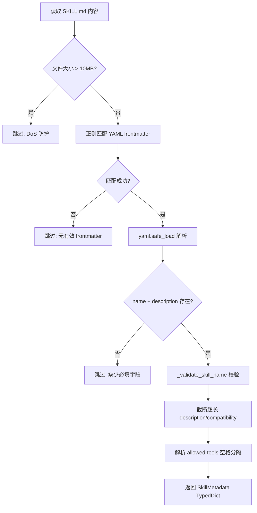
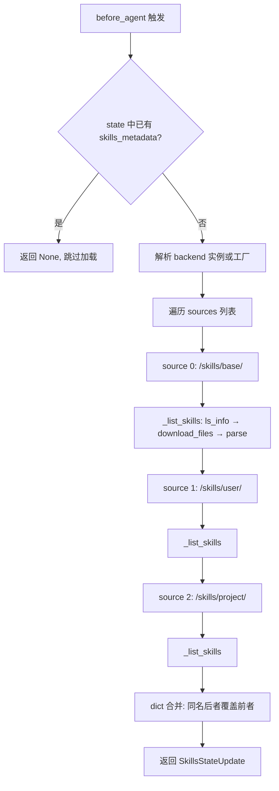
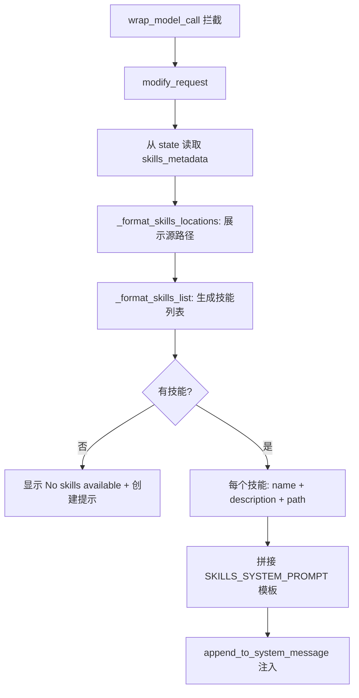

# PD-433.01 DeepAgents — SkillsMiddleware 技能系统

> 文档编号：PD-433.01
> 来源：DeepAgents `libs/deepagents/deepagents/middleware/skills.py`
> GitHub：https://github.com/langchain-ai/deepagents.git
> 问题域：PD-433 技能系统 Agent Skill System
> 状态：可复用方案

---

## 第 1 章 问题与动机

### 1.1 核心问题

Agent 系统需要一种可扩展的能力注入机制：让 Agent 在不修改核心代码的情况下获得新的领域知识和工作流程。传统做法是把所有指令塞进系统提示词，但这会导致上下文窗口膨胀、技能间耦合、无法按需加载。

核心挑战：
- **上下文经济性**：技能元数据（名称+描述）约 100 词，但完整指令可能 5000+ 词，全量注入浪费 token
- **多源覆盖**：内置技能、用户自定义技能、项目级技能需要分层管理，同名技能需要优先级覆盖
- **存储可移植**：技能不应绑定文件系统，需要支持内存状态、远程存储、数据库等多种后端
- **安全边界**：需要防止恶意技能文件（超大文件 DoS、非法名称注入等）

### 1.2 DeepAgents 的解法概述

DeepAgents 实现了一个完整的 `SkillsMiddleware`，作为 LangGraph Agent 中间件链的一环，遵循 [Agent Skills 规范](https://agentskills.io/specification)：

1. **YAML Frontmatter 元数据解析** — 每个技能是一个目录，包含 `SKILL.md` 文件，用 YAML frontmatter 声明 `name`、`description`、`license`、`compatibility`、`allowed-tools` 等元数据（`skills.py:134-192`）
2. **多源分层加载** — 支持 `base → user → project` 多源路径，后加载的同名技能覆盖先加载的（last-one-wins），CLI 层扩展到 5 级优先级（`skills.py:755-764`）
3. **渐进式披露（Progressive Disclosure）** — 系统提示词只注入技能名称和描述，Agent 需要时再通过 `Read` 工具读取完整 `SKILL.md` 内容（`skills.py:561-600`）
4. **后端抽象** — 通过 `BackendProtocol` 接口操作文件，支持 `FilesystemBackend`、`StateBackend`（内存/检查点）、`StoreBackend`（LangGraph Store）三种后端（`protocol.py:167-418`）
5. **安全约束** — 文件大小上限 10MB、名称长度 64 字符、描述长度 1024 字符、严格的名称格式校验（`skills.py:126-132`）

### 1.3 设计思想

| 设计原则 | 具体实现 | 理由 | 替代方案 |
|----------|----------|------|----------|
| 渐进式披露 | 系统提示词只注入 name+description，完整内容按需读取 | 节省 token，避免上下文膨胀 | 全量注入（Claude Code 早期做法，浪费 token） |
| Last-one-wins 覆盖 | 多源按序加载，同名技能后者覆盖前者 | 简单可预测，用户/项目级可覆盖内置 | 合并策略（复杂且语义不明确） |
| 后端抽象 | `BackendProtocol` ABC + 工厂函数 | 技能可存储在文件系统、内存、远程 Store | 直接 `os.path`（不可移植） |
| 中间件模式 | `AgentMiddleware` 的 `before_agent` + `wrap_model_call` | 与 Agent 核心解耦，可组合 | 硬编码到 Agent 构建逻辑中 |
| 一次加载 | `before_agent` 检查 state 中是否已有 `skills_metadata`，有则跳过 | 避免每轮对话重复扫描 | 每次都重新加载（浪费 I/O） |

---

## 第 2 章 源码实现分析

### 2.1 架构概览

DeepAgents 的技能系统由三层组成：中间件层（加载+注入）、后端层（存储抽象）、CLI 层（5 级路径发现）。

```
┌─────────────────────────────────────────────────────────┐
│                    Agent Runtime                         │
│  ┌──────────────┐  ┌──────────────┐  ┌──────────────┐  │
│  │ TodoList MW  │→│ Skills MW    │→│ Filesystem MW│  │
│  └──────────────┘  └──────┬───────┘  └──────────────┘  │
│                           │                              │
│              ┌────────────┼────────────┐                │
│              ▼            ▼            ▼                │
│     before_agent    wrap_model_call   modify_request    │
│     (加载元数据)    (拦截请求)       (注入系统提示)     │
│              │                         │                │
│              ▼                         ▼                │
│     BackendProtocol            SKILLS_SYSTEM_PROMPT     │
│     ┌──────────┐                                        │
│     │Filesystem│  StateBackend  StoreBackend            │
│     │ Backend  │  (内存/检查点)  (LangGraph Store)      │
│     └──────────┘                                        │
└─────────────────────────────────────────────────────────┘

CLI 5 级技能源（优先级从低到高）：
  0. built_in_skills/     (内置)
  1. ~/.deepagents/<agent>/skills/  (用户-deepagents)
  2. ~/.agents/skills/    (用户-通用)
  3. .deepagents/skills/  (项目-deepagents)
  4. .agents/skills/      (项目-通用)
```

### 2.2 核心实现

#### 2.2.1 YAML Frontmatter 解析与验证



对应源码 `libs/deepagents/deepagents/middleware/skills.py:249-351`：

```python
def _parse_skill_metadata(
    content: str,
    skill_path: str,
    directory_name: str,
) -> SkillMetadata | None:
    if len(content) > MAX_SKILL_FILE_SIZE:
        logger.warning("Skipping %s: content too large (%d bytes)", skill_path, len(content))
        return None

    frontmatter_pattern = r"^---\s*\n(.*?)\n---\s*\n"
    match = re.match(frontmatter_pattern, content, re.DOTALL)
    if not match:
        return None

    frontmatter_data = yaml.safe_load(match.group(1))
    name = str(frontmatter_data.get("name", "")).strip()
    description = str(frontmatter_data.get("description", "")).strip()
    if not name or not description:
        return None

    # 名称校验：1-64字符，Unicode小写字母数字+连字符，不能以-开头/结尾，不能连续--
    is_valid, error = _validate_skill_name(str(name), directory_name)
    if not is_valid:
        logger.warning("Skill '%s' does not follow Agent Skills specification: %s", name, error)

    # 截断超长字段
    if len(description) > MAX_SKILL_DESCRIPTION_LENGTH:
        description = description[:MAX_SKILL_DESCRIPTION_LENGTH]

    # allowed-tools: 空格分隔字符串，兼容逗号（Claude Code 格式）
    raw_tools = frontmatter_data.get("allowed-tools")
    if isinstance(raw_tools, str):
        allowed_tools = [t.strip(",") for t in raw_tools.split() if t.strip(",")]
    else:
        allowed_tools = []

    return SkillMetadata(
        name=str(name), description=description, path=skill_path,
        metadata=_validate_metadata(frontmatter_data.get("metadata", {}), skill_path),
        license=str(frontmatter_data.get("license", "")).strip() or None,
        compatibility=compatibility_str,
        allowed_tools=allowed_tools,
    )
```

#### 2.2.2 多源分层加载与 Last-One-Wins 覆盖



对应源码 `libs/deepagents/deepagents/middleware/skills.py:731-801`：

```python
def before_agent(self, state, runtime, config) -> SkillsStateUpdate | None:
    # 一次加载：已有则跳过
    if "skills_metadata" in state:
        return None

    backend = self._get_backend(state, runtime, config)
    all_skills: dict[str, SkillMetadata] = {}

    # 按序加载，后者覆盖前者（last-one-wins）
    for source_path in self.sources:
        source_skills = _list_skills(backend, source_path)
        for skill in source_skills:
            all_skills[skill["name"]] = skill  # 同名覆盖

    return SkillsStateUpdate(skills_metadata=list(all_skills.values()))
```

#### 2.2.3 渐进式披露系统提示注入



对应源码 `libs/deepagents/deepagents/middleware/skills.py:690-729`：

```python
def _format_skills_list(self, skills: list[SkillMetadata]) -> str:
    if not skills:
        paths = [f"{source_path}" for source_path in self.sources]
        return f"(No skills available yet. You can create skills in {' or '.join(paths)})"

    lines = []
    for skill in skills:
        annotations = _format_skill_annotations(skill)
        desc_line = f"- **{skill['name']}**: {skill['description']}"
        if annotations:
            desc_line += f" ({annotations})"
        lines.append(desc_line)
        if skill["allowed_tools"]:
            lines.append(f"  -> Allowed tools: {', '.join(skill['allowed_tools'])}")
        lines.append(f"  -> Read `{skill['path']}` for full instructions")
    return "\n".join(lines)
```

注入的系统提示词模板（`skills.py:561-600`）包含：
- 技能源路径列表（标注最高优先级）
- 可用技能列表（名称 + 描述 + 路径）
- 渐进式披露使用指南（识别 → 读取 → 执行 → 访问辅助文件）

### 2.3 实现细节

**后端工厂模式**：`SkillsMiddleware` 的 `backend` 参数支持两种形式 — 直接实例或工厂函数。`StateBackend` 需要运行时上下文，因此传入 `lambda rt: StateBackend(rt)` 工厂函数，在 `_get_backend` 中延迟构造（`skills.py:650-677`）。

**PrivateStateAttr**：`skills_metadata` 使用 `PrivateStateAttr` 标注，确保技能元数据不会泄露到父 Agent 或最终输出状态中（`skills.py:194-198`）。

**PurePosixPath 路径标准化**：所有路径使用 `PurePosixPath` 处理，确保跨平台一致性，后端负责平台特定转换（`skills.py:95, 444-446`）。

**CLI 5 级技能源**：`deepagents-cli` 在 `agent.py:494-507` 组装技能源列表，从内置 → 用户 → 项目，优先级递增。`config.py:642-749` 定义了 5 个路径发现方法，支持 `.deepagents/` 和 `.agents/` 双命名空间（后者是跨工具通用路径）。

**StoreBackend 命名空间隔离**：使用 `assistant_id` 作为命名空间前缀，不同 assistant 的技能互不可见（测试验证于 `test_skills_middleware.py:1453-1508`）。

---

## 第 3 章 迁移指南

### 3.1 迁移清单

**阶段 1：基础技能加载（1-2 天）**

- [ ] 定义 `SkillMetadata` 数据结构（name, description, path, metadata, license, compatibility, allowed_tools）
- [ ] 实现 YAML frontmatter 解析器（正则提取 `---` 块 + `yaml.safe_load`）
- [ ] 实现名称校验（长度、字符集、目录名匹配）
- [ ] 实现单源技能扫描（遍历目录 → 查找 SKILL.md → 解析元数据）

**阶段 2：多源覆盖 + 系统提示注入**

- [ ] 实现多源按序加载 + dict 合并（last-one-wins）
- [ ] 编写系统提示词模板（技能列表 + 渐进式披露指南）
- [ ] 集成到 Agent 中间件链（before_agent 加载 + wrap_model_call 注入）

**阶段 3：后端抽象（可选）**

- [ ] 定义 `BackendProtocol`（ls_info, download_files）
- [ ] 实现 FilesystemBackend（本地文件系统）
- [ ] 实现 StateBackend（内存/检查点，适合 LangGraph）
- [ ] 支持工厂函数延迟构造

### 3.2 适配代码模板

以下是一个独立可运行的技能加载器，不依赖 LangGraph/LangChain：

```python
"""Minimal skill loader — 可直接复用的技能系统核心。"""

import re
from dataclasses import dataclass, field
from pathlib import Path
from typing import Optional

import yaml


@dataclass
class SkillMetadata:
    """技能元数据，遵循 Agent Skills 规范。"""
    name: str
    description: str
    path: str
    license: Optional[str] = None
    compatibility: Optional[str] = None
    allowed_tools: list[str] = field(default_factory=list)
    metadata: dict[str, str] = field(default_factory=dict)


MAX_SKILL_FILE_SIZE = 10 * 1024 * 1024  # 10MB
MAX_NAME_LENGTH = 64
MAX_DESC_LENGTH = 1024
NAME_PATTERN = re.compile(r"^[a-z0-9]+(-[a-z0-9]+)*$")
FRONTMATTER_RE = re.compile(r"^---\s*\n(.*?)\n---\s*\n", re.DOTALL)


def parse_skill_md(content: str, skill_path: str, dir_name: str) -> Optional[SkillMetadata]:
    """解析 SKILL.md 的 YAML frontmatter，返回 SkillMetadata 或 None。"""
    if len(content) > MAX_SKILL_FILE_SIZE:
        return None
    match = FRONTMATTER_RE.match(content)
    if not match:
        return None
    try:
        data = yaml.safe_load(match.group(1))
    except yaml.YAMLError:
        return None
    if not isinstance(data, dict):
        return None

    name = str(data.get("name", "")).strip()
    desc = str(data.get("description", "")).strip()
    if not name or not desc:
        return None

    # 名称校验
    if len(name) > MAX_NAME_LENGTH or not NAME_PATTERN.match(name) or name != dir_name:
        return None  # 严格模式；生产环境可改为 warning

    # 截断超长描述
    desc = desc[:MAX_DESC_LENGTH]

    # 解析 allowed-tools（空格分隔字符串）
    raw_tools = data.get("allowed-tools", "")
    tools = [t.strip(",") for t in str(raw_tools).split() if t.strip(",")] if isinstance(raw_tools, str) else []

    return SkillMetadata(
        name=name, description=desc, path=skill_path,
        license=str(data.get("license", "")).strip() or None,
        compatibility=str(data.get("compatibility", "")).strip() or None,
        allowed_tools=tools,
        metadata={str(k): str(v) for k, v in data.get("metadata", {}).items()} if isinstance(data.get("metadata"), dict) else {},
    )


def load_skills_from_sources(sources: list[str]) -> list[SkillMetadata]:
    """从多个源路径加载技能，后者覆盖前者（last-one-wins）。"""
    all_skills: dict[str, SkillMetadata] = {}
    for source_dir in sources:
        source_path = Path(source_dir)
        if not source_path.is_dir():
            continue
        for skill_dir in sorted(source_path.iterdir()):
            if not skill_dir.is_dir():
                continue
            skill_md = skill_dir / "SKILL.md"
            if not skill_md.exists():
                continue
            content = skill_md.read_text(encoding="utf-8")
            meta = parse_skill_md(content, str(skill_md), skill_dir.name)
            if meta:
                all_skills[meta.name] = meta  # 同名覆盖
    return list(all_skills.values())


def format_skills_prompt(skills: list[SkillMetadata]) -> str:
    """生成渐进式披露的系统提示词片段。"""
    if not skills:
        return "(No skills available)"
    lines = []
    for s in skills:
        line = f"- **{s.name}**: {s.description}"
        if s.license or s.compatibility:
            annotations = ", ".join(filter(None, [
                f"License: {s.license}" if s.license else None,
                f"Compatibility: {s.compatibility}" if s.compatibility else None,
            ]))
            line += f" ({annotations})"
        lines.append(line)
        if s.allowed_tools:
            lines.append(f"  -> Allowed tools: {', '.join(s.allowed_tools)}")
        lines.append(f"  -> Read `{s.path}` for full instructions")
    return "\n".join(lines)


# 使用示例
if __name__ == "__main__":
    skills = load_skills_from_sources([
        "/path/to/base/skills",
        str(Path.home() / ".agents" / "skills"),
        ".agents/skills",
    ])
    prompt = format_skills_prompt(skills)
    print(prompt)
```

### 3.3 适用场景

| 场景 | 适用度 | 说明 |
|------|--------|------|
| CLI Agent 工具（类 Claude Code） | ⭐⭐⭐ | 完美匹配：多源分层 + 渐进式披露 |
| LangGraph/LangChain Agent | ⭐⭐⭐ | 原生支持，直接使用 SkillsMiddleware |
| 自定义 Agent 框架 | ⭐⭐⭐ | 迁移模板可独立运行，不依赖 LangGraph |
| SaaS 多租户 Agent | ⭐⭐ | 需要 StoreBackend 命名空间隔离 |
| 嵌入式/资源受限环境 | ⭐ | 渐进式披露减少 token，但仍需文件 I/O |

---

## 第 4 章 测试用例

基于 DeepAgents 真实测试签名（`test_skills_middleware.py`）编写的可运行测试：

```python
"""技能系统核心功能测试。"""

import tempfile
from pathlib import Path

import pytest

# 假设使用上面 3.2 的迁移模板
from skill_loader import SkillMetadata, parse_skill_md, load_skills_from_sources, format_skills_prompt


def make_skill_content(name: str, description: str, **extra) -> str:
    """生成 SKILL.md 内容。"""
    frontmatter_lines = [f"name: {name}", f"description: {description}"]
    for k, v in extra.items():
        frontmatter_lines.append(f"{k}: {v}")
    frontmatter = "\n".join(frontmatter_lines)
    return f"---\n{frontmatter}\n---\n\n# {name.title()} Skill\n\nInstructions here.\n"


class TestParseSkillMetadata:
    """测试 YAML frontmatter 解析。"""

    def test_valid_minimal(self):
        content = make_skill_content("my-skill", "A test skill")
        result = parse_skill_md(content, "/skills/my-skill/SKILL.md", "my-skill")
        assert result is not None
        assert result.name == "my-skill"
        assert result.description == "A test skill"
        assert result.license is None
        assert result.allowed_tools == []

    def test_valid_full_metadata(self):
        content = "---\nname: web-research\ndescription: Research topics\nlicense: MIT\ncompatibility: Python 3.10+\nallowed-tools: read_file write_file\nmetadata:\n  author: Test\n---\n\n# Skill\n"
        result = parse_skill_md(content, "/skills/web-research/SKILL.md", "web-research")
        assert result is not None
        assert result.license == "MIT"
        assert result.compatibility == "Python 3.10+"
        assert result.allowed_tools == ["read_file", "write_file"]
        assert result.metadata == {"author": "Test"}

    def test_no_frontmatter_returns_none(self):
        result = parse_skill_md("# No frontmatter\nJust text.", "/s/SKILL.md", "s")
        assert result is None

    def test_missing_name_returns_none(self):
        content = "---\ndescription: Only description\n---\n\nContent\n"
        result = parse_skill_md(content, "/s/SKILL.md", "s")
        assert result is None

    def test_name_mismatch_returns_none(self):
        content = make_skill_content("wrong-name", "Desc")
        result = parse_skill_md(content, "/skills/actual-name/SKILL.md", "actual-name")
        assert result is None

    def test_oversized_file_returns_none(self):
        content = make_skill_content("big", "Desc") + "X" * (10 * 1024 * 1024 + 1)
        result = parse_skill_md(content, "/s/big/SKILL.md", "big")
        assert result is None

    def test_description_truncation(self):
        long_desc = "A" * 2000
        content = make_skill_content("trunc", long_desc)
        result = parse_skill_md(content, "/s/trunc/SKILL.md", "trunc")
        assert result is not None
        assert len(result.description) == 1024


class TestMultiSourceLoading:
    """测试多源分层加载与覆盖。"""

    def test_last_one_wins_override(self, tmp_path: Path):
        base_dir = tmp_path / "base"
        user_dir = tmp_path / "user"
        for d in [base_dir, user_dir]:
            skill_dir = d / "shared-skill"
            skill_dir.mkdir(parents=True)

        (base_dir / "shared-skill" / "SKILL.md").write_text(
            make_skill_content("shared-skill", "Base version")
        )
        (user_dir / "shared-skill" / "SKILL.md").write_text(
            make_skill_content("shared-skill", "User version wins")
        )

        skills = load_skills_from_sources([str(base_dir), str(user_dir)])
        assert len(skills) == 1
        assert skills[0].description == "User version wins"

    def test_empty_source_returns_empty(self, tmp_path: Path):
        empty_dir = tmp_path / "empty"
        empty_dir.mkdir()
        skills = load_skills_from_sources([str(empty_dir)])
        assert skills == []

    def test_nonexistent_source_skipped(self):
        skills = load_skills_from_sources(["/nonexistent/path"])
        assert skills == []

    def test_multiple_skills_from_single_source(self, tmp_path: Path):
        source = tmp_path / "skills"
        for name in ["alpha", "beta", "gamma"]:
            d = source / name
            d.mkdir(parents=True)
            (d / "SKILL.md").write_text(make_skill_content(name, f"Skill {name}"))

        skills = load_skills_from_sources([str(source)])
        assert len(skills) == 3
        assert {s.name for s in skills} == {"alpha", "beta", "gamma"}


class TestProgressiveDisclosure:
    """测试渐进式披露提示词生成。"""

    def test_empty_skills_message(self):
        result = format_skills_prompt([])
        assert "No skills" in result

    def test_skill_with_path_reference(self):
        skill = SkillMetadata(name="test", description="Test skill", path="/skills/test/SKILL.md")
        result = format_skills_prompt([skill])
        assert "**test**" in result
        assert "Test skill" in result
        assert "Read `/skills/test/SKILL.md`" in result

    def test_annotations_included(self):
        skill = SkillMetadata(
            name="licensed", description="Licensed skill",
            path="/s/SKILL.md", license="MIT", compatibility="Python 3.10+",
        )
        result = format_skills_prompt([skill])
        assert "License: MIT" in result
        assert "Compatibility: Python 3.10+" in result
```

---

## 第 5 章 跨域关联

| 关联域 | 关系类型 | 说明 |
|--------|----------|------|
| PD-01 上下文管理 | 协同 | 渐进式披露直接服务于上下文经济性 — 只注入元数据（~100 词），完整内容按需加载，避免技能指令占满上下文窗口 |
| PD-04 工具系统 | 依赖 | 技能通过 `allowed_tools` 字段声明推荐工具，Agent 读取完整 SKILL.md 后使用 Read/Write/Bash 等工具执行技能工作流 |
| PD-10 中间件管道 | 依赖 | SkillsMiddleware 是 AgentMiddleware 链的一环，通过 `before_agent`（加载）和 `wrap_model_call`（注入）两个钩子参与管道 |
| PD-06 记忆持久化 | 协同 | SkillsMiddleware 与 MemoryMiddleware 并列，技能元数据通过 `PrivateStateAttr` 存入 Agent 状态，支持检查点恢复 |
| PD-05 沙箱隔离 | 协同 | 技能脚本通过 `SandboxBackendProtocol.execute()` 在沙箱中运行，技能文件通过 BackendProtocol 读写，不直接访问宿主文件系统 |
| PD-09 Human-in-the-Loop | 协同 | 技能可通过 `interrupt_on` 配置触发人工审批，CLI 层的 `HumanInTheLoopMiddleware` 与 SkillsMiddleware 共存于中间件链 |

---

## 第 6 章 来源文件索引

| 文件 | 行范围 | 关键实现 |
|------|--------|----------|
| `libs/deepagents/deepagents/middleware/skills.py` | L1-838 | 完整技能中间件：SkillMetadata TypedDict、解析器、验证器、SkillsMiddleware 类 |
| `libs/deepagents/deepagents/middleware/skills.py` | L134-192 | SkillMetadata TypedDict 定义（Agent Skills 规范字段） |
| `libs/deepagents/deepagents/middleware/skills.py` | L208-246 | `_validate_skill_name` 名称校验（Unicode 小写 + 连字符） |
| `libs/deepagents/deepagents/middleware/skills.py` | L249-351 | `_parse_skill_metadata` YAML frontmatter 解析核心 |
| `libs/deepagents/deepagents/middleware/skills.py` | L403-479 | `_list_skills` 单源技能扫描（ls_info → download_files → parse） |
| `libs/deepagents/deepagents/middleware/skills.py` | L561-600 | `SKILLS_SYSTEM_PROMPT` 渐进式披露模板 |
| `libs/deepagents/deepagents/middleware/skills.py` | L603-838 | `SkillsMiddleware` 类（before_agent、wrap_model_call、modify_request） |
| `libs/deepagents/deepagents/middleware/skills.py` | L690-707 | `_format_skills_list` 技能列表格式化 |
| `libs/deepagents/deepagents/middleware/skills.py` | L731-765 | `before_agent` 多源加载 + last-one-wins 合并 |
| `libs/deepagents/deepagents/graph.py` | L85-324 | `create_deep_agent` 中 SkillsMiddleware 集成（L213-214, L275-276） |
| `libs/deepagents/deepagents/backends/protocol.py` | L167-517 | `BackendProtocol` ABC（ls_info、download_files 等文件操作接口） |
| `libs/deepagents/deepagents/middleware/_utils.py` | L1-24 | `append_to_system_message` 系统提示词追加工具 |
| `libs/cli/deepagents_cli/agent.py` | L494-507 | CLI 层 5 级技能源组装（built_in → user → project） |
| `libs/cli/deepagents_cli/config.py` | L642-749 | Settings 类 5 个技能路径发现方法 |
| `libs/cli/deepagents_cli/built_in_skills/skill-creator/SKILL.md` | L1-400 | 内置 skill-creator 技能（技能创建指南） |
| `libs/deepagents/tests/unit_tests/middleware/test_skills_middleware.py` | L1-1602 | 完整单元测试（解析、验证、加载、覆盖、后端工厂、命名空间隔离） |

---

## 第 7 章 横向对比维度

```json comparison_data
{
  "project": "DeepAgents",
  "dimensions": {
    "技能发现": "BackendProtocol.ls_info 扫描目录 + download_files 批量下载 SKILL.md",
    "元数据格式": "YAML frontmatter 遵循 agentskills.io 规范，6 字段 TypedDict",
    "分层覆盖": "多源按序加载 dict 合并 last-one-wins，CLI 5 级优先级",
    "披露模式": "三级渐进式：元数据常驻 → SKILL.md 按需读取 → 辅助文件按需",
    "存储抽象": "BackendProtocol ABC + 工厂函数，支持 Filesystem/State/Store 三后端",
    "安全约束": "10MB 文件上限 + 64 字符名称 + Unicode 小写校验 + safe_load",
    "多租户隔离": "StoreBackend 按 assistant_id 命名空间隔离技能"
  }
}
```

### 域元数据补充

```json domain_metadata
{
  "solution_summary": "DeepAgents 用 SkillsMiddleware 中间件实现 agentskills.io 规范的 YAML frontmatter 解析、BackendProtocol 三后端抽象、CLI 5 级优先级分层覆盖和三级渐进式披露",
  "description": "技能系统的后端存储可移植性与多租户命名空间隔离",
  "sub_problems": [
    "技能存储后端可移植性（文件系统/内存/远程 Store）",
    "多租户技能命名空间隔离",
    "技能创建工具链与脚手架"
  ],
  "best_practices": [
    "通过 BackendProtocol 抽象解耦技能存储与加载逻辑",
    "使用 PrivateStateAttr 防止技能元数据泄露到父 Agent",
    "内置 skill-creator 技能实现自举式技能创建"
  ]
}
```
