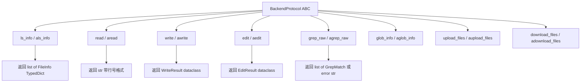
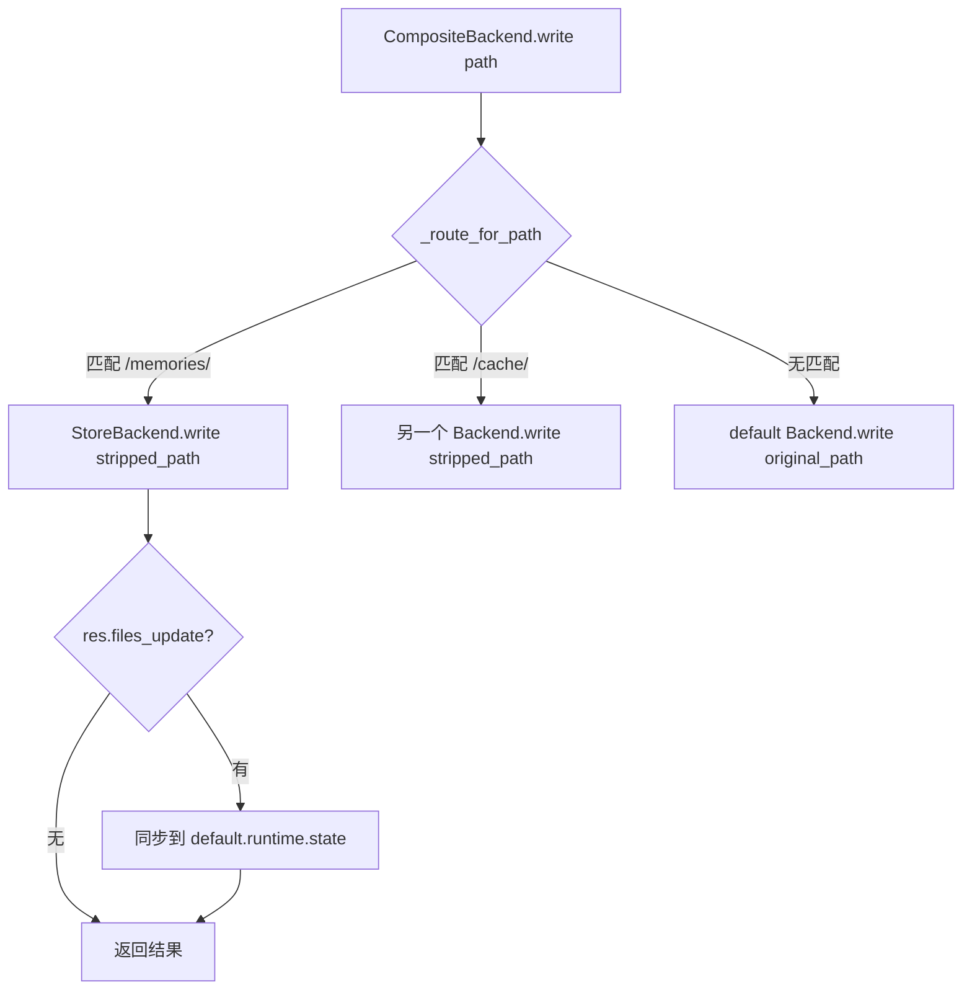

# PD-434.01 DeepAgents — BackendProtocol 可插拔后端架构

> 文档编号：PD-434.01
> 来源：DeepAgents `libs/deepagents/deepagents/backends/`
> GitHub：https://github.com/langchain-ai/deepagents.git
> 问题域：PD-434 可插拔后端架构 Pluggable Backend Architecture
> 状态：可复用方案

---

## 第 1 章 问题与动机

### 1.1 核心问题

Agent 系统需要对文件进行 ls/read/write/edit/glob/grep/execute 等操作，但运行环境千差万别：

- **开发环境**：直接操作本地文件系统，需要 shell 执行能力
- **LangGraph 状态管理**：文件存储在 agent state 中，随 checkpoint 持久化，但仅限单线程
- **跨会话持久化**：文件需要跨线程、跨会话存活，存储在 LangGraph BaseStore 中
- **沙箱环境**：Docker 容器、远程 VM 等隔离执行环境
- **混合场景**：临时文件用 state，记忆文件用 store，代码执行用沙箱

如果每种后端都要单独适配工具层，工具代码会膨胀 N 倍，且新增后端需要修改所有工具。这是一个典型的"接口爆炸"问题。

### 1.2 DeepAgents 的解法概述

DeepAgents 通过三层抽象解决这个问题：

1. **BackendProtocol 统一接口** — 定义 `ls_info/read/write/edit/grep_raw/glob_info/upload_files/download_files` 八大操作，所有后端必须实现（`protocol.py:167-418`）
2. **SandboxBackendProtocol 扩展接口** — 在 BackendProtocol 基础上增加 `execute/aexecute` 和 `id` 属性，用于支持 shell 命令执行的沙箱后端（`protocol.py:437-513`）
3. **CompositeBackend 路由组合** — 按路径前缀将不同路径路由到不同后端，实现混合存储（`composite.py:90-706`）
4. **BackendFactory 延迟创建** — `Callable[[ToolRuntime], BackendProtocol]` 类型别名，支持在运行时才创建后端实例（`protocol.py:516-517`）
5. **FilesystemMiddleware 统一消费** — 中间件层只依赖 BackendProtocol 接口，通过 `_get_backend()` 透明处理实例和工厂两种形态（`middleware/filesystem.py:465-476`）

### 1.3 设计思想

| 设计原则 | 具体实现 | 理由 | 替代方案 |
|----------|----------|------|----------|
| ABC 而非 Protocol | `BackendProtocol(abc.ABC)` 用 ABC 但不标 `@abstractmethod`，子类可只实现子集 | 避免强制实现所有方法，允许渐进式后端开发 | Python `typing.Protocol` 结构化子类型 |
| 同步/异步双轨 | 每个方法都有 sync + async 版本（如 `read/aread`），async 默认 `asyncio.to_thread(sync)` | LangGraph 支持同步和异步执行，后端只需实现 sync 即可获得 async 能力 | 只提供 async，sync 用 `asyncio.run` 包装 |
| 路径前缀路由 | CompositeBackend 按最长前缀匹配路由到子后端 | 不同路径有不同存储语义（临时 vs 持久），路径是最自然的区分维度 | 按文件类型路由、按操作类型路由 |
| 工厂延迟创建 | `BackendFactory = Callable[[ToolRuntime], BackendProtocol]` | 后端可能依赖运行时信息（state、store、config），创建时机必须延迟到工具调用时 | 在 agent 初始化时创建所有后端 |
| 结构化错误码 | `FileOperationError` 用 Literal 类型定义 5 种标准错误码 | LLM 可以理解标准化错误并采取修复行动 | 抛异常、返回字符串错误信息 |

---

## 第 2 章 源码实现分析

### 2.1 架构概览

DeepAgents 的后端体系是一个经典的策略模式 + 组合模式架构：

```
┌─────────────────────────────────────────────────────────────┐
│                   FilesystemMiddleware                       │
│  _get_backend(runtime) → BackendProtocol | BackendFactory   │
└──────────────────────────┬──────────────────────────────────┘
                           │ 统一接口
              ┌────────────┴────────────┐
              │    BackendProtocol      │  ← ABC 基类
              │  ls_info / read / write │
              │  edit / grep / glob     │
              │  upload / download      │
              └────────────┬────────────┘
                           │
        ┌──────────┬───────┼───────┬──────────────┐
        │          │       │       │              │
   StateBackend  Store  Filesystem  Composite  SandboxBackendProtocol
   (state内存)  Backend  Backend    Backend       │
                (Store)  (磁盘)   (路由组合)       │
                                                   │
                                          LocalShellBackend
                                          (磁盘 + shell)
```

CompositeBackend 的路由机制：

```
┌─────────────────────────────────────────────────┐
│              CompositeBackend                    │
│                                                  │
│  write("/temp.txt", data)                        │
│    → default (StateBackend)                      │
│                                                  │
│  write("/memories/note.md", data)                │
│    → routes["/memories/"] (StoreBackend)          │
│                                                  │
│  grep("TODO", path="/")                          │
│    → 聚合所有后端结果                              │
│                                                  │
│  execute("ls -la")                               │
│    → 始终委托给 default（需实现 SandboxBackend）   │
└─────────────────────────────────────────────────┘
```

### 2.2 核心实现

#### BackendProtocol：统一文件操作接口



对应源码 `libs/deepagents/deepagents/backends/protocol.py:167-418`：

```python
class BackendProtocol(abc.ABC):  # noqa: B024
    """Protocol for pluggable memory backends (single, unified)."""

    def ls_info(self, path: str) -> list["FileInfo"]:
        raise NotImplementedError

    async def als_info(self, path: str) -> list["FileInfo"]:
        return await asyncio.to_thread(self.ls_info, path)

    def read(self, file_path: str, offset: int = 0, limit: int = 2000) -> str:
        raise NotImplementedError

    async def aread(self, file_path: str, offset: int = 0, limit: int = 2000) -> str:
        return await asyncio.to_thread(self.read, file_path, offset, limit)

    def write(self, file_path: str, content: str) -> WriteResult:
        raise NotImplementedError

    def edit(self, file_path: str, old_string: str, new_string: str,
             replace_all: bool = False) -> EditResult:
        raise NotImplementedError

    def grep_raw(self, pattern: str, path: str | None = None,
                 glob: str | None = None) -> list["GrepMatch"] | str:
        raise NotImplementedError

    def glob_info(self, pattern: str, path: str = "/") -> list["FileInfo"]:
        raise NotImplementedError

    def upload_files(self, files: list[tuple[str, bytes]]) -> list[FileUploadResponse]:
        raise NotImplementedError

    def download_files(self, paths: list[str]) -> list[FileDownloadResponse]:
        raise NotImplementedError
```

关键设计点：
- 不使用 `@abstractmethod`（`protocol.py:166` 注释说明），允许子类只实现需要的方法
- async 版本默认用 `asyncio.to_thread` 包装 sync 版本，子类可覆盖提供原生 async 实现
- 返回值使用 dataclass（`WriteResult`、`EditResult`）而非裸字符串，携带 `files_update` 字段用于 LangGraph 状态同步

#### CompositeBackend：路径前缀路由



对应源码 `libs/deepagents/deepagents/backends/composite.py:61-87` 路由核心：

```python
def _route_for_path(
    *, default: BackendProtocol,
    sorted_routes: list[tuple[str, BackendProtocol]],
    path: str,
) -> tuple[BackendProtocol, str, str | None]:
    for route_prefix, backend in sorted_routes:
        prefix_no_slash = route_prefix.rstrip("/")
        if path == prefix_no_slash:
            return backend, "/", route_prefix
        if path.startswith(route_prefix):
            suffix = path[len(route_prefix):]
            backend_path = f"/{suffix}" if suffix else "/"
            return backend, backend_path, route_prefix
    return default, path, None
```

路由规则：
- `sorted_routes` 按前缀长度降序排列（`composite.py:129`），确保最长前缀优先匹配
- 路径 `/memories/note.md` 匹配 `/memories/` 路由后，传给子后端的路径是 `/note.md`（前缀剥离）
- grep/glob 等聚合操作在 `path="/"` 或 `path=None` 时搜索所有后端并合并结果（`composite.py:291-308`）
- execute 始终委托给 default 后端，不做路径路由（`composite.py:505-540`）

### 2.3 实现细节

#### 五种后端实现的存储语义差异

| 后端 | 存储位置 | 生命周期 | files_update | 执行能力 |
|------|----------|----------|-------------|----------|
| StateBackend | `runtime.state["files"]` | 单线程内 | 返回 dict 用于 LangGraph Command | 无 |
| StoreBackend | LangGraph BaseStore | 跨线程持久 | 返回 None（已持久化） | 无 |
| FilesystemBackend | 本地磁盘 | 永久 | 返回 None | 无 |
| LocalShellBackend | 本地磁盘 + shell | 永久 | 返回 None | subprocess.run |
| CompositeBackend | 路由到子后端 | 取决于子后端 | 透传 + 状态同步 | 委托 default |

#### BackendFactory 延迟创建机制

`protocol.py:516-517` 定义：

```python
BackendFactory: TypeAlias = Callable[[ToolRuntime], BackendProtocol]
BACKEND_TYPES = BackendProtocol | BackendFactory
```

`middleware/filesystem.py:465-476` 消费：

```python
def _get_backend(self, runtime: ToolRuntime[Any, Any]) -> BackendProtocol:
    if callable(self.backend):
        return self.backend(runtime)
    return self.backend
```

`graph.py:196` 默认值：

```python
backend = backend if backend is not None else (StateBackend)
```

这里 `StateBackend` 作为类（callable）传入，在每次工具调用时通过 `_get_backend(runtime)` 实例化，确保每次调用都能拿到最新的 runtime 上下文。

#### CompositeBackend 的状态同步

当路由后端写入文件后，CompositeBackend 会尝试将 `files_update` 同步到 default 后端的 state（`composite.py:417-428`）：

```python
def write(self, file_path: str, content: str) -> WriteResult:
    backend, stripped_key = self._get_backend_and_key(file_path)
    res = backend.write(stripped_key, content)
    if res.files_update:
        try:
            runtime = getattr(self.default, "runtime", None)
            if runtime is not None:
                state = runtime.state
                files = state.get("files", {})
                files.update(res.files_update)
                state["files"] = files
        except Exception:
            pass  # Best-effort state sync
    return res
```

这是一个 best-effort 同步：即使同步失败也不影响写入操作本身。

#### SandboxBackendProtocol 的 timeout 兼容性检查

`protocol.py:494-513` 使用 `inspect.signature` + `lru_cache` 检查后端是否支持 timeout 参数：

```python
@lru_cache(maxsize=128)
def execute_accepts_timeout(cls: type[SandboxBackendProtocol]) -> bool:
    try:
        sig = inspect.signature(cls.execute)
    except (ValueError, TypeError):
        return False
    else:
        return "timeout" in sig.parameters
```

这解决了旧版后端包未更新 SDK 依赖时的向后兼容问题。


---

## 第 3 章 迁移指南

### 3.1 迁移清单

**阶段 1：定义协议接口**

- [ ] 定义 `BackendProtocol` ABC，包含 ls/read/write/edit/grep/glob 六大操作
- [ ] 为每个方法定义 sync + async 双版本，async 默认用 `asyncio.to_thread` 包装
- [ ] 定义结构化返回类型（`WriteResult`、`EditResult`、`FileInfo`、`GrepMatch`）
- [ ] 定义 `FileOperationError` 标准错误码（Literal 类型）

**阶段 2：实现基础后端**

- [ ] 实现内存后端（类似 StateBackend），用于测试和轻量场景
- [ ] 实现文件系统后端（类似 FilesystemBackend），支持 virtual_mode 路径映射
- [ ] 如需 shell 执行，扩展 `SandboxBackendProtocol` 并实现 `execute`

**阶段 3：实现组合路由**

- [ ] 实现 CompositeBackend，按路径前缀路由到不同子后端
- [ ] 实现路径剥离和重映射逻辑（grep/glob 结果需要还原原始路径）
- [ ] 实现聚合查询（grep/glob 在 root 路径时搜索所有后端）

**阶段 4：集成工具层**

- [ ] 工具层只依赖 BackendProtocol 接口
- [ ] 支持 `BackendProtocol | BackendFactory` 双形态输入
- [ ] 在工具调用时通过 `_get_backend(runtime)` 解析实际后端

### 3.2 适配代码模板

以下是一个最小可运行的可插拔后端实现：

```python
"""Minimal pluggable backend implementation."""
import abc
import asyncio
from dataclasses import dataclass
from typing import Any, Callable, TypeAlias
from typing_extensions import TypedDict, NotRequired


# --- 结构化类型 ---

class FileInfo(TypedDict):
    path: str
    is_dir: NotRequired[bool]
    size: NotRequired[int]
    modified_at: NotRequired[str]


class GrepMatch(TypedDict):
    path: str
    line: int
    text: str


@dataclass
class WriteResult:
    error: str | None = None
    path: str | None = None
    files_update: dict[str, Any] | None = None


@dataclass
class EditResult:
    error: str | None = None
    path: str | None = None
    files_update: dict[str, Any] | None = None
    occurrences: int | None = None


# --- 协议基类 ---

class BackendProtocol(abc.ABC):
    """统一文件操作接口。子类按需实现。"""

    def ls(self, path: str) -> list[FileInfo]:
        raise NotImplementedError

    async def als(self, path: str) -> list[FileInfo]:
        return await asyncio.to_thread(self.ls, path)

    def read(self, path: str, offset: int = 0, limit: int = 2000) -> str:
        raise NotImplementedError

    async def aread(self, path: str, offset: int = 0, limit: int = 2000) -> str:
        return await asyncio.to_thread(self.read, path, offset, limit)

    def write(self, path: str, content: str) -> WriteResult:
        raise NotImplementedError

    def edit(self, path: str, old: str, new: str,
             replace_all: bool = False) -> EditResult:
        raise NotImplementedError

    def grep(self, pattern: str, path: str | None = None) -> list[GrepMatch]:
        raise NotImplementedError

    def glob(self, pattern: str, path: str = "/") -> list[FileInfo]:
        raise NotImplementedError


# --- 工厂类型 ---

BackendFactory: TypeAlias = Callable[..., BackendProtocol]


# --- 内存后端实现 ---

class InMemoryBackend(BackendProtocol):
    """最简内存后端，用于测试。"""

    def __init__(self) -> None:
        self._files: dict[str, str] = {}

    def ls(self, path: str) -> list[FileInfo]:
        prefix = path if path.endswith("/") else path + "/"
        return [{"path": k} for k in self._files if k.startswith(prefix)]

    def read(self, path: str, offset: int = 0, limit: int = 2000) -> str:
        content = self._files.get(path)
        if content is None:
            return f"Error: File '{path}' not found"
        lines = content.splitlines()
        selected = lines[offset:offset + limit]
        return "\n".join(f"{i+offset+1:6}\t{line}"
                         for i, line in enumerate(selected))

    def write(self, path: str, content: str) -> WriteResult:
        if path in self._files:
            return WriteResult(error=f"File '{path}' already exists")
        self._files[path] = content
        return WriteResult(path=path)

    def edit(self, path: str, old: str, new: str,
             replace_all: bool = False) -> EditResult:
        content = self._files.get(path)
        if content is None:
            return EditResult(error=f"File '{path}' not found")
        count = content.count(old)
        if count == 0:
            return EditResult(error=f"String not found in '{path}'")
        if not replace_all and count > 1:
            return EditResult(error=f"Multiple occurrences ({count}) found")
        self._files[path] = content.replace(old, new, -1 if replace_all else 1)
        return EditResult(path=path, occurrences=count if replace_all else 1)


# --- 组合后端 ---

class CompositeBackend(BackendProtocol):
    """按路径前缀路由到不同后端。"""

    def __init__(self, default: BackendProtocol,
                 routes: dict[str, BackendProtocol]) -> None:
        self.default = default
        self.sorted_routes = sorted(routes.items(),
                                     key=lambda x: len(x[0]), reverse=True)

    def _route(self, path: str) -> tuple[BackendProtocol, str]:
        for prefix, backend in self.sorted_routes:
            if path.startswith(prefix):
                suffix = path[len(prefix):]
                return backend, f"/{suffix}" if suffix else "/"
        return self.default, path

    def read(self, path: str, offset: int = 0, limit: int = 2000) -> str:
        backend, stripped = self._route(path)
        return backend.read(stripped, offset, limit)

    def write(self, path: str, content: str) -> WriteResult:
        backend, stripped = self._route(path)
        return backend.write(stripped, content)
```

### 3.3 适用场景

| 场景 | 适用度 | 说明 |
|------|--------|------|
| LLM Agent 文件操作工具 | ⭐⭐⭐ | 核心场景，统一 ls/read/write/edit/grep/glob 接口 |
| 混合存储（临时 + 持久） | ⭐⭐⭐ | CompositeBackend 按路径路由到不同存储 |
| 沙箱执行环境 | ⭐⭐⭐ | SandboxBackendProtocol 扩展 execute 能力 |
| 多租户隔离 | ⭐⭐ | StoreBackend 的 namespace 机制支持 per-assistant 隔离 |
| 纯 API 服务（无文件操作） | ⭐ | 过度设计，直接用简单的存储抽象即可 |

---

## 第 4 章 测试用例

```python
"""Tests for pluggable backend architecture."""
import pytest
from typing import Any


# --- 使用上面的适配代码模板 ---

class TestInMemoryBackend:
    """测试内存后端基本操作。"""

    def setup_method(self) -> None:
        self.backend = InMemoryBackend()

    def test_write_and_read(self) -> None:
        result = self.backend.write("/hello.txt", "line1\nline2\nline3")
        assert result.error is None
        assert result.path == "/hello.txt"

        content = self.backend.read("/hello.txt")
        assert "line1" in content
        assert "line2" in content

    def test_write_duplicate_fails(self) -> None:
        self.backend.write("/dup.txt", "content")
        result = self.backend.write("/dup.txt", "other")
        assert result.error is not None
        assert "already exists" in result.error

    def test_read_nonexistent(self) -> None:
        content = self.backend.read("/missing.txt")
        assert "not found" in content.lower()

    def test_edit_single_occurrence(self) -> None:
        self.backend.write("/edit.txt", "hello world")
        result = self.backend.edit("/edit.txt", "hello", "goodbye")
        assert result.error is None
        assert result.occurrences == 1
        assert "goodbye" in self.backend.read("/edit.txt")

    def test_edit_multiple_without_replace_all_fails(self) -> None:
        self.backend.write("/multi.txt", "aaa bbb aaa")
        result = self.backend.edit("/multi.txt", "aaa", "ccc")
        assert result.error is not None
        assert "Multiple" in result.error

    def test_edit_replace_all(self) -> None:
        self.backend.write("/all.txt", "aaa bbb aaa")
        result = self.backend.edit("/all.txt", "aaa", "ccc", replace_all=True)
        assert result.error is None
        assert result.occurrences == 2

    def test_ls_filters_by_prefix(self) -> None:
        self.backend.write("/dir/a.txt", "a")
        self.backend.write("/dir/b.txt", "b")
        self.backend.write("/other/c.txt", "c")
        infos = self.backend.ls("/dir")
        paths = [fi["path"] for fi in infos]
        assert "/dir/a.txt" in paths
        assert "/dir/b.txt" in paths
        assert "/other/c.txt" not in paths


class TestCompositeBackend:
    """测试组合后端路由。"""

    def setup_method(self) -> None:
        self.default = InMemoryBackend()
        self.store = InMemoryBackend()
        self.composite = CompositeBackend(
            default=self.default,
            routes={"/memories/": self.store},
        )

    def test_default_route(self) -> None:
        self.composite.write("/temp.txt", "ephemeral")
        assert "ephemeral" in self.default.read("/temp.txt")

    def test_route_to_store(self) -> None:
        self.composite.write("/memories/note.md", "persistent")
        # 路由后端收到的路径是剥离前缀后的
        assert "persistent" in self.store.read("/note.md")

    def test_read_through_composite(self) -> None:
        self.composite.write("/memories/data.txt", "stored")
        content = self.composite.read("/memories/data.txt")
        assert "stored" in content

    def test_longest_prefix_wins(self) -> None:
        deep_store = InMemoryBackend()
        composite = CompositeBackend(
            default=self.default,
            routes={
                "/a/": self.store,
                "/a/b/": deep_store,
            },
        )
        composite.write("/a/b/file.txt", "deep")
        assert "deep" in deep_store.read("/file.txt")


class TestBackendFactory:
    """测试工厂延迟创建。"""

    def test_factory_creates_on_call(self) -> None:
        call_count = 0

        def factory(runtime: Any) -> InMemoryBackend:
            nonlocal call_count
            call_count += 1
            return InMemoryBackend()

        # 工厂未被调用
        assert call_count == 0

        # 模拟 _get_backend 逻辑
        backend = factory(None) if callable(factory) else factory
        assert call_count == 1
        assert isinstance(backend, InMemoryBackend)
```


---

## 第 5 章 跨域关联

| 关联域 | 关系类型 | 说明 |
|--------|----------|------|
| PD-04 工具系统 | 依赖 | FilesystemMiddleware 将 BackendProtocol 包装为 ls/read/write/edit/glob/grep 六个 LangChain Tool，工具系统是后端的消费者 |
| PD-05 沙箱隔离 | 协同 | SandboxBackendProtocol 扩展了 execute 能力，LocalShellBackend 提供本地 shell 执行，FilesystemBackend 的 virtual_mode 提供路径级隔离 |
| PD-06 记忆持久化 | 协同 | StoreBackend 基于 LangGraph BaseStore 实现跨会话持久化，StateBackend 基于 LangGraph state 实现单线程内持久化 |
| PD-10 中间件管道 | 依赖 | FilesystemMiddleware 是 AgentMiddleware 的实现，通过中间件管道注入工具和系统提示 |
| PD-01 上下文管理 | 协同 | SummarizationMiddleware 也接受 BACKEND_TYPES 参数，用后端存储被驱逐的大型工具结果 |

---

## 第 6 章 来源文件索引

| 文件 | 行范围 | 关键实现 |
|------|--------|----------|
| `libs/deepagents/deepagents/backends/protocol.py` | L1-L518 | BackendProtocol ABC、SandboxBackendProtocol、BackendFactory 类型别名、结构化返回类型（WriteResult/EditResult/FileInfo/GrepMatch）、execute_accepts_timeout 兼容性检查 |
| `libs/deepagents/deepagents/backends/composite.py` | L1-L706 | CompositeBackend 路径前缀路由、_route_for_path 最长前缀匹配、grep/glob 聚合查询、execute 委托、upload/download 批量分组 |
| `libs/deepagents/deepagents/backends/state.py` | L1-L233 | StateBackend 内存后端，基于 runtime.state["files"] 存储，返回 files_update 用于 LangGraph Command |
| `libs/deepagents/deepagents/backends/store.py` | L1-L628 | StoreBackend 持久化后端，基于 LangGraph BaseStore，支持 namespace 工厂和分页搜索 |
| `libs/deepagents/deepagents/backends/filesystem.py` | L1-L725 | FilesystemBackend 磁盘后端，支持 virtual_mode 路径映射、ripgrep 优先 + Python fallback 搜索 |
| `libs/deepagents/deepagents/backends/local_shell.py` | L1-L360 | LocalShellBackend 继承 FilesystemBackend + SandboxBackendProtocol，subprocess.run 执行 shell 命令 |
| `libs/deepagents/deepagents/backends/__init__.py` | L1-L25 | 模块导出，统一暴露所有后端类 |
| `libs/deepagents/deepagents/middleware/filesystem.py` | L364-L500 | FilesystemMiddleware 消费 BackendProtocol，_get_backend() 处理实例/工厂双形态 |
| `libs/deepagents/deepagents/graph.py` | L85-L270 | create_deep_agent 接受 backend 参数，默认 StateBackend 类作为工厂 |

---

## 第 7 章 横向对比维度

```json comparison_data
{
  "project": "DeepAgents",
  "dimensions": {
    "接口定义方式": "ABC 基类 + NotImplementedError，不标 @abstractmethod 允许渐进实现",
    "后端种类": "5 种：State（内存）/ Store（持久）/ Filesystem（磁盘）/ LocalShell（磁盘+shell）/ Composite（路由组合）",
    "组合机制": "CompositeBackend 按路径前缀最长匹配路由，聚合查询自动合并多后端结果",
    "延迟创建": "BackendFactory = Callable[[ToolRuntime], BackendProtocol]，中间件 _get_backend() 运行时解析",
    "同步异步": "每个方法 sync + async 双版本，async 默认 asyncio.to_thread 包装 sync",
    "执行能力": "SandboxBackendProtocol 扩展接口，execute_accepts_timeout 反射检查向后兼容",
    "状态同步": "CompositeBackend 写入后 best-effort 同步 files_update 到 default 后端 state"
  }
}
```

### 域元数据补充

```json domain_metadata
{
  "solution_summary": "DeepAgents 用 BackendProtocol ABC 定义 8 大文件操作统一接口，提供 5 种后端实现（State/Store/Filesystem/LocalShell/Composite），CompositeBackend 按路径前缀路由组合多后端，BackendFactory 支持运行时延迟创建",
  "description": "Agent 文件操作与执行环境的统一抽象层，支持混合存储路由",
  "sub_problems": [
    "同步异步双轨接口设计",
    "路径前缀路由与结果重映射",
    "大型工具结果驱逐到后端存储"
  ],
  "best_practices": [
    "async 默认用 asyncio.to_thread 包装 sync，子类可覆盖提供原生 async",
    "CompositeBackend 聚合查询时自动还原路径前缀",
    "BackendFactory 延迟到工具调用时创建，确保拿到最新 runtime 上下文",
    "execute_accepts_timeout 用 lru_cache + inspect.signature 做向后兼容检查"
  ]
}
```

