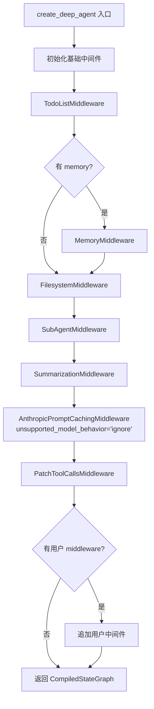
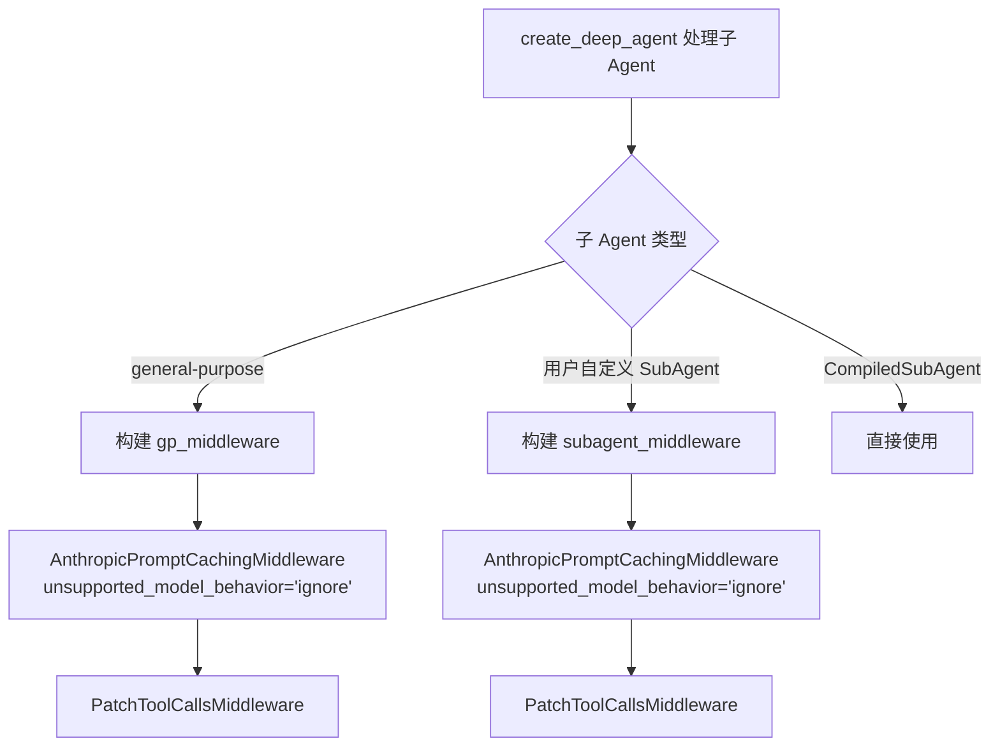

# PD-435.01 DeepAgents — Anthropic Prompt Caching 中间件集成

> 文档编号：PD-435.01
> 来源：DeepAgents `libs/deepagents/deepagents/graph.py`
> GitHub：https://github.com/langchain-ai/deepagents.git
> 问题域：PD-435 Prompt 缓存优化 Prompt Caching Optimization
> 状态：可复用方案

---

## 第 1 章 问题与动机

### 1.1 核心问题

在多轮 Agent 对话中，每次 LLM 调用都会重复发送完整的系统提示（system prompt）和历史消息。对于 Anthropic Claude 模型，系统提示通常包含数千 token 的指令（如 DeepAgents 的 `BASE_AGENT_PROMPT` 约 400 token，加上中间件注入的 filesystem、subagent、summarization 等指令后可达 2000+ token）。这些内容在每轮对话中完全相同，却每次都按输入 token 计费。

Anthropic 提供了 prompt caching 功能：通过在消息中添加 `cache_control: {"type": "ephemeral"}` 标记，API 会缓存标记位置之前的内容。后续请求如果前缀匹配，则从缓存读取，输入 token 按缓存价格计费（通常为正常价格的 10%）。

问题在于：
1. 手动为每条消息添加 `cache_control` 标记繁琐且易出错
2. 多 Agent 系统中（主 Agent + 子 Agent），每个 Agent 都需要独立处理缓存
3. 当模型不是 Anthropic（如 OpenAI、Google）时，`cache_control` 字段会导致 API 报错
4. 缓存标记的位置选择影响命中率——标记太少浪费机会，标记太多增加复杂度

### 1.2 DeepAgents 的解法概述

DeepAgents 通过集成 `langchain-anthropic` 包提供的 `AnthropicPromptCachingMiddleware` 中间件，以零配置方式解决上述问题：

1. **中间件自动注入**：在 `create_deep_agent()` 中将缓存中间件硬编码到中间件栈，无需用户手动配置（`graph.py:293`）
2. **三层一致部署**：主 Agent、通用子 Agent（general-purpose）、用户自定义子 Agent 都统一注入同一中间件（`graph.py:210`, `graph.py:250`, `graph.py:293`）
3. **非 Anthropic 模型静默忽略**：通过 `unsupported_model_behavior="ignore"` 参数，当模型不支持 prompt caching 时静默跳过，不报错（`graph.py:210`）
4. **管道末端定位**：缓存中间件放在 `SummarizationMiddleware` 之后、`PatchToolCallsMiddleware` 之前，确保缓存标记在消息最终形态上操作（`graph.py:285-296`）
5. **外部依赖封装**：缓存逻辑完全由 `langchain-anthropic>=1.3.3` 提供，DeepAgents 仅负责集成和配置（`pyproject.toml:25`）

### 1.3 设计思想

| 设计原则 | 具体实现 | 理由 | 替代方案 |
|----------|----------|------|----------|
| 零配置默认开启 | `create_deep_agent()` 自动注入缓存中间件 | 降低使用门槛，所有 Anthropic 用户自动受益 | 需要用户手动添加中间件 |
| 多模型兼容 | `unsupported_model_behavior="ignore"` | 同一代码支持 Anthropic/OpenAI/Google 模型切换 | 按模型类型条件判断是否添加中间件 |
| 中间件管道模式 | 缓存作为管道中的一个独立环节 | 关注点分离，缓存逻辑不侵入业务代码 | 在 model wrapper 层面实现缓存 |
| 三层统一 | 主 Agent 和所有子 Agent 使用相同中间件栈 | 避免子 Agent 遗漏缓存优化 | 仅主 Agent 启用缓存 |
| 管道位置固定 | 缓存中间件在 Summarization 之后 | 确保对最终消息形态操作，避免缓存被后续修改失效 | 放在管道开头 |

---

## 第 2 章 源码实现分析

### 2.1 架构概览

DeepAgents 的中间件栈是一个线性管道，每个中间件按顺序处理消息。缓存中间件位于管道末端：

```
┌─────────────────────────────────────────────────────────────────┐
│                    create_deep_agent() 中间件栈                   │
├─────────────────────────────────────────────────────────────────┤
│                                                                 │
│  1. TodoListMiddleware          — 待办列表管理                    │
│  2. MemoryMiddleware            — 记忆文件加载（可选）             │
│  3. SkillsMiddleware            — 技能加载（可选）                │
│  4. FilesystemMiddleware        — 文件系统工具                    │
│  5. SubAgentMiddleware          — 子 Agent 管理                  │
│  6. SummarizationMiddleware     — 上下文压缩                     │
│  7. AnthropicPromptCachingMW    — ★ Prompt 缓存标记注入 ★        │
│  8. PatchToolCallsMiddleware    — 悬挂工具调用修补                │
│  9. 用户自定义 middleware        — 用户扩展（可选）                │
│ 10. HumanInTheLoopMiddleware    — 人工审批（可选）                │
│                                                                 │
└─────────────────────────────────────────────────────────────────┘
```

关键设计：缓存中间件（#7）在 Summarization（#6）之后，因为 Summarization 可能大幅修改消息列表（压缩、替换），缓存标记必须在消息最终形态上注入才有意义。

### 2.2 核心实现

#### 2.2.1 主 Agent 中间件栈构建



对应源码 `libs/deepagents/deepagents/graph.py:270-296`：

```python
    # Build main agent middleware stack
    deepagent_middleware: list[AgentMiddleware[Any, Any, Any]] = [
        TodoListMiddleware(),
    ]
    if memory is not None:
        deepagent_middleware.append(MemoryMiddleware(backend=backend, sources=memory))
    if skills is not None:
        deepagent_middleware.append(SkillsMiddleware(backend=backend, sources=skills))
    summarization_middleware = SummarizationMiddleware(
        model=model,
        backend=backend,
        trigger=summarization_defaults["trigger"],
        keep=summarization_defaults["keep"],
        trim_tokens_to_summarize=None,
        truncate_args_settings=summarization_defaults["truncate_args_settings"],
    )
    deepagent_middleware.extend(
        [
            FilesystemMiddleware(backend=backend),
            SubAgentMiddleware(
                backend=backend,
                subagents=all_subagents,
            ),
            summarization_middleware,
            AnthropicPromptCachingMiddleware(unsupported_model_behavior="ignore"),
            PatchToolCallsMiddleware(),
        ]
    )
```

#### 2.2.2 子 Agent 中间件栈（三层统一）



对应源码 `libs/deepagents/deepagents/graph.py:199-212`（通用子 Agent）：

```python
    gp_middleware: list[AgentMiddleware[Any, Any, Any]] = [
        TodoListMiddleware(),
        FilesystemMiddleware(backend=backend),
        SummarizationMiddleware(
            model=model,
            backend=backend,
            trigger=summarization_defaults["trigger"],
            keep=summarization_defaults["keep"],
            trim_tokens_to_summarize=None,
            truncate_args_settings=summarization_defaults["truncate_args_settings"],
        ),
        AnthropicPromptCachingMiddleware(unsupported_model_behavior="ignore"),
        PatchToolCallsMiddleware(),
    ]
```

对应源码 `libs/deepagents/deepagents/graph.py:239-252`（用户自定义子 Agent）：

```python
            subagent_middleware: list[AgentMiddleware[Any, Any, Any]] = [
                TodoListMiddleware(),
                FilesystemMiddleware(backend=backend),
                SummarizationMiddleware(
                    model=subagent_model,
                    backend=backend,
                    trigger=subagent_summarization_defaults["trigger"],
                    keep=subagent_summarization_defaults["keep"],
                    trim_tokens_to_summarize=None,
                    truncate_args_settings=subagent_summarization_defaults["truncate_args_settings"],
                ),
                AnthropicPromptCachingMiddleware(unsupported_model_behavior="ignore"),
                PatchToolCallsMiddleware(),
            ]
```

### 2.3 实现细节

#### 中间件参数解析

`AnthropicPromptCachingMiddleware` 接受一个关键参数 `unsupported_model_behavior`，DeepAgents 统一使用 `"ignore"` 值：

| 参数值 | 行为 | DeepAgents 选择 |
|--------|------|-----------------|
| `"ignore"` | 非 Anthropic 模型时静默跳过，不修改消息 | ✅ 使用此值 |
| `"error"` | 非 Anthropic 模型时抛出异常 | ❌ 不适合多模型场景 |
| `"warn"` | 非 Anthropic 模型时打印警告 | ❌ 会产生噪音日志 |

#### 缓存标记注入机制

`AnthropicPromptCachingMiddleware`（来自 `langchain-anthropic>=1.3.3`）的工作原理：

```
请求消息流:
┌──────────────┐    ┌─────────────────────┐    ┌──────────────┐
│ 原始消息列表  │───→│ CachingMiddleware    │───→│ 带缓存标记的  │
│ (无缓存标记)  │    │ wrap_model_call()    │    │ 消息列表      │
└──────────────┘    └─────────────────────┘    └──────────────┘
                           │
                    ┌──────┴──────┐
                    │ 检测模型类型 │
                    └──────┬──────┘
                    ┌──────┴──────┐
              ┌─────┤ Anthropic?  ├─────┐
              │是   └─────────────┘  否 │
              ▼                         ▼
    ┌─────────────────┐      ┌──────────────────┐
    │ 为 system msg   │      │ 静默跳过          │
    │ 和最后几条消息   │      │ (ignore 模式)     │
    │ 添加 cache_     │      └──────────────────┘
    │ control 标记    │
    └─────────────────┘
```

#### 多模型切换的数据流

DeepAgents 支持通过 `model` 参数传入字符串（如 `"openai:gpt-5"`）来切换模型。缓存中间件的 `ignore` 策略确保切换无感知：

```python
# graph.py:179-191 — 模型初始化
if model is None:
    model = get_default_model()  # ChatAnthropic(model_name="claude-sonnet-4-5-20250929")
elif isinstance(model, str):
    if model.startswith("openai:"):
        model_init_params: dict = {"use_responses_api": True}
    else:
        model_init_params = {}
    model = init_chat_model(model, **model_init_params)
```

无论最终 `model` 是 `ChatAnthropic` 还是 `ChatOpenAI`，中间件栈中的 `AnthropicPromptCachingMiddleware(unsupported_model_behavior="ignore")` 都会被添加。当模型为 OpenAI 时，中间件检测到模型类型不匹配，直接透传消息不做修改。


---

## 第 3 章 迁移指南

### 3.1 迁移清单

#### 阶段 1：基础集成（最小可用）

- [ ] 安装依赖：`pip install langchain-anthropic>=1.3.3`
- [ ] 在中间件栈末端添加 `AnthropicPromptCachingMiddleware(unsupported_model_behavior="ignore")`
- [ ] 确保中间件在所有消息修改操作（如 summarization）之后

#### 阶段 2：多 Agent 统一

- [ ] 为所有子 Agent 的中间件栈也添加缓存中间件
- [ ] 确保子 Agent 使用相同的 `unsupported_model_behavior="ignore"` 配置

#### 阶段 3：验证与监控

- [ ] 通过 Anthropic API 响应头 `anthropic-cache-creation-input-tokens` 和 `anthropic-cache-read-input-tokens` 验证缓存命中
- [ ] 对比启用前后的 token 消耗和费用

### 3.2 适配代码模板

#### 模板 1：LangChain Agent 中间件集成（推荐）

```python
"""Prompt caching middleware integration for LangChain agents.

Adapted from DeepAgents graph.py pattern.
Requires: langchain-anthropic>=1.3.3
"""

from langchain.agents import create_agent
from langchain.agents.middleware import AgentMiddleware
from langchain_anthropic import ChatAnthropic
from langchain_anthropic.middleware import AnthropicPromptCachingMiddleware


def create_cached_agent(
    model: str | None = None,
    middleware: list[AgentMiddleware] | None = None,
    system_prompt: str = "You are a helpful assistant.",
):
    """Create an agent with automatic Anthropic prompt caching.

    The caching middleware is always added at the end of the middleware stack,
    with unsupported_model_behavior="ignore" for multi-model compatibility.
    """
    if model is None:
        chat_model = ChatAnthropic(
            model_name="claude-sonnet-4-5-20250929",
            max_tokens=8192,
        )
    else:
        from langchain.chat_models import init_chat_model
        chat_model = init_chat_model(model)

    # Build middleware stack: user middleware first, then caching at the end
    full_middleware: list[AgentMiddleware] = list(middleware or [])
    full_middleware.append(
        AnthropicPromptCachingMiddleware(unsupported_model_behavior="ignore")
    )

    return create_agent(
        chat_model,
        system_prompt=system_prompt,
        middleware=full_middleware,
    )
```

#### 模板 2：原生 Anthropic SDK 手动缓存标记

```python
"""Manual prompt caching for direct Anthropic SDK usage.

Use this when NOT using LangChain middleware.
"""

import anthropic


def create_cached_messages(
    system_prompt: str,
    conversation_history: list[dict],
) -> tuple[list[dict], list[dict]]:
    """Add cache_control markers to system prompt and conversation.

    Returns (system_blocks, messages) ready for Anthropic API.
    """
    # System prompt with cache marker
    system_blocks = [
        {
            "type": "text",
            "text": system_prompt,
            "cache_control": {"type": "ephemeral"},
        }
    ]

    # Add cache marker to the last few conversation turns
    messages = []
    cache_breakpoints = {len(conversation_history) - 1}  # Cache up to last message

    for i, msg in enumerate(conversation_history):
        entry = {"role": msg["role"], "content": msg["content"]}
        if i in cache_breakpoints and msg["role"] == "user":
            # Add cache control to user message content
            if isinstance(entry["content"], str):
                entry["content"] = [
                    {
                        "type": "text",
                        "text": entry["content"],
                        "cache_control": {"type": "ephemeral"},
                    }
                ]
        messages.append(entry)

    return system_blocks, messages


def call_with_caching(
    client: anthropic.Anthropic,
    system_prompt: str,
    conversation: list[dict],
    model: str = "claude-sonnet-4-5-20250929",
) -> anthropic.types.Message:
    """Make an API call with prompt caching enabled."""
    system_blocks, messages = create_cached_messages(system_prompt, conversation)

    return client.messages.create(
        model=model,
        max_tokens=8192,
        system=system_blocks,
        messages=messages,
    )
```

### 3.3 适用场景

| 场景 | 适用度 | 说明 |
|------|--------|------|
| 多轮 Agent 对话（Anthropic 模型） | ⭐⭐⭐ | 系统提示和早期对话被缓存，节省 60-90% 输入 token 费用 |
| 多 Agent 系统（主 Agent + 子 Agent） | ⭐⭐⭐ | 每个 Agent 独立缓存，子 Agent 的系统提示也受益 |
| 多模型混合部署 | ⭐⭐⭐ | `ignore` 策略确保非 Anthropic 模型不受影响 |
| 单轮问答（无历史） | ⭐ | 缓存收益低，仅系统提示可缓存 |
| 短系统提示（<100 token） | ⭐ | 缓存节省的 token 数量有限 |
| 高频相同前缀请求 | ⭐⭐⭐ | 缓存命中率最高的场景 |

---

## 第 4 章 测试用例

```python
"""Tests for Anthropic prompt caching middleware integration.

Based on DeepAgents graph.py integration pattern.
"""

import pytest
from unittest.mock import MagicMock, patch


class TestAnthropicPromptCachingIntegration:
    """Test the prompt caching middleware integration in agent creation."""

    def test_caching_middleware_in_main_agent_stack(self):
        """Verify AnthropicPromptCachingMiddleware is in the main agent middleware."""
        from langchain_anthropic.middleware import AnthropicPromptCachingMiddleware

        # Simulate the middleware stack construction from graph.py:285-296
        middleware_stack = []
        middleware_stack.append(AnthropicPromptCachingMiddleware(unsupported_model_behavior="ignore"))

        assert len(middleware_stack) == 1
        mw = middleware_stack[0]
        assert isinstance(mw, AnthropicPromptCachingMiddleware)

    def test_ignore_mode_for_non_anthropic_model(self):
        """Verify unsupported_model_behavior='ignore' doesn't raise for non-Anthropic models."""
        from langchain_anthropic.middleware import AnthropicPromptCachingMiddleware

        mw = AnthropicPromptCachingMiddleware(unsupported_model_behavior="ignore")
        # The middleware should be created without error
        assert mw is not None

    def test_caching_middleware_position_after_summarization(self):
        """Verify caching middleware comes after summarization in the stack.

        This is critical: summarization modifies messages, so caching must
        operate on the final message form.
        """
        # Simulate the ordering from graph.py:285-296
        from langchain_anthropic.middleware import AnthropicPromptCachingMiddleware

        stack_order = [
            "FilesystemMiddleware",
            "SubAgentMiddleware",
            "SummarizationMiddleware",
            "AnthropicPromptCachingMiddleware",  # Must be after Summarization
            "PatchToolCallsMiddleware",
        ]

        summarization_idx = stack_order.index("SummarizationMiddleware")
        caching_idx = stack_order.index("AnthropicPromptCachingMiddleware")
        patch_idx = stack_order.index("PatchToolCallsMiddleware")

        assert caching_idx > summarization_idx, "Caching must come after summarization"
        assert caching_idx < patch_idx, "Caching must come before patch tool calls"

    def test_three_layer_consistency(self):
        """Verify main agent, GP subagent, and custom subagent all use same caching config."""
        from langchain_anthropic.middleware import AnthropicPromptCachingMiddleware

        # All three layers use identical configuration
        main_mw = AnthropicPromptCachingMiddleware(unsupported_model_behavior="ignore")
        gp_mw = AnthropicPromptCachingMiddleware(unsupported_model_behavior="ignore")
        custom_mw = AnthropicPromptCachingMiddleware(unsupported_model_behavior="ignore")

        # All should be valid instances with same behavior
        for mw in [main_mw, gp_mw, custom_mw]:
            assert isinstance(mw, AnthropicPromptCachingMiddleware)

    def test_model_switching_does_not_break_caching(self):
        """Verify that switching from Anthropic to OpenAI model doesn't cause errors."""
        from langchain_anthropic.middleware import AnthropicPromptCachingMiddleware

        mw = AnthropicPromptCachingMiddleware(unsupported_model_behavior="ignore")

        # The middleware exists in the stack regardless of model type
        # When model is not Anthropic, it should silently pass through
        assert mw is not None


class TestCachingCostEstimation:
    """Test cost estimation helpers for prompt caching."""

    def test_cache_savings_calculation(self):
        """Estimate savings from prompt caching."""
        system_prompt_tokens = 2000
        turns = 20
        input_price_per_mtok = 3.0  # Claude Sonnet pricing example
        cache_read_price_per_mtok = 0.3  # 10% of input price

        # Without caching: system prompt sent every turn
        no_cache_cost = system_prompt_tokens * turns * input_price_per_mtok / 1_000_000

        # With caching: first turn full price, rest cached
        cache_cost = (
            system_prompt_tokens * input_price_per_mtok / 1_000_000  # First turn
            + system_prompt_tokens * (turns - 1) * cache_read_price_per_mtok / 1_000_000  # Cached turns
        )

        savings_pct = (1 - cache_cost / no_cache_cost) * 100
        assert savings_pct > 80, f"Expected >80% savings, got {savings_pct:.1f}%"

    def test_cache_breakeven_at_two_turns(self):
        """Prompt caching breaks even at 2 turns (cache write cost + cache read < 2x input)."""
        system_tokens = 1000
        input_price = 3.0
        cache_write_price = 3.75  # 25% premium for cache write
        cache_read_price = 0.3   # 90% discount for cache read

        # 2 turns without caching
        no_cache = 2 * system_tokens * input_price / 1_000_000

        # 2 turns with caching: write on first, read on second
        with_cache = (
            system_tokens * cache_write_price / 1_000_000
            + system_tokens * cache_read_price / 1_000_000
        )

        assert with_cache < no_cache, "Caching should be cheaper at 2 turns"
```


---

## 第 5 章 跨域关联

| 关联域 | 关系类型 | 说明 |
|--------|----------|------|
| PD-01 上下文管理 | 协同 | Summarization 压缩消息后，缓存中间件对压缩后的消息注入标记，两者配合降低 token 消耗 |
| PD-10 中间件管道 | 依赖 | 缓存中间件依赖中间件管道架构来确定执行顺序，管道位置直接影响缓存效果 |
| PD-11 可观测性 | 协同 | 缓存命中率是成本追踪的关键指标，需要通过 API 响应头获取缓存统计数据 |
| PD-02 多 Agent 编排 | 协同 | 多 Agent 系统中每个 Agent 独立缓存，编排层需确保所有 Agent 都启用缓存 |
| PD-04 工具系统 | 弱关联 | 工具定义（tool schemas）也是输入 token 的一部分，长工具列表可从缓存中受益 |

---

## 第 6 章 来源文件索引

| 文件 | 行范围 | 关键实现 |
|------|--------|----------|
| `libs/deepagents/deepagents/graph.py` | L12 | `AnthropicPromptCachingMiddleware` 导入 |
| `libs/deepagents/deepagents/graph.py` | L85-324 | `create_deep_agent()` 完整函数，包含三处缓存中间件注入 |
| `libs/deepagents/deepagents/graph.py` | L199-212 | 通用子 Agent (general-purpose) 中间件栈，含缓存中间件 |
| `libs/deepagents/deepagents/graph.py` | L239-252 | 用户自定义子 Agent 中间件栈，含缓存中间件 |
| `libs/deepagents/deepagents/graph.py` | L270-296 | 主 Agent 中间件栈，含缓存中间件 |
| `libs/deepagents/deepagents/graph.py` | L179-191 | 模型初始化逻辑，支持多模型切换 |
| `libs/deepagents/deepagents/middleware/patch_tool_calls.py` | L1-45 | PatchToolCallsMiddleware，缓存中间件的下游邻居 |
| `libs/deepagents/deepagents/middleware/summarization.py` | L135-169 | `compute_summarization_defaults()`，缓存中间件的上游邻居 |
| `libs/deepagents/pyproject.toml` | L25 | `langchain-anthropic>=1.3.3` 依赖声明 |

---

## 第 7 章 横向对比维度

> **重要：** 本章用于自动填充 Butcher Wiki 的横向对比表。
> 必须严格按以下 JSON 格式输出，放在 `comparison_data` 代码块中。

```json comparison_data
{
  "project": "DeepAgents",
  "dimensions": {
    "缓存策略": "langchain-anthropic AnthropicPromptCachingMiddleware 自动注入 cache_control 标记",
    "多模型兼容": "unsupported_model_behavior='ignore' 静默跳过非 Anthropic 模型",
    "集成方式": "中间件管道模式，零配置默认开启，三层 Agent 统一部署",
    "管道位置": "Summarization 之后、PatchToolCalls 之前，确保对最终消息形态操作",
    "成本控制": "系统提示和长对话前缀自动缓存，多轮对话可节省 60-90% 输入 token 费用"
  }
}
```

### 域元数据补充

```json domain_metadata
{
  "solution_summary": "DeepAgents 通过 langchain-anthropic 的 AnthropicPromptCachingMiddleware 实现零配置 prompt 缓存，三层 Agent 统一部署，ignore 模式兼容多模型",
  "description": "中间件管道中的缓存位置选择对命中率有决定性影响",
  "sub_problems": [
    "多 Agent 系统中子 Agent 缓存一致性保障",
    "缓存中间件与上下文压缩中间件的执行顺序协调"
  ],
  "best_practices": [
    "为所有层级 Agent（主 Agent + 子 Agent）统一注入缓存中间件",
    "缓存中间件应在消息修改类中间件（如 Summarization）之后执行"
  ]
}
```
