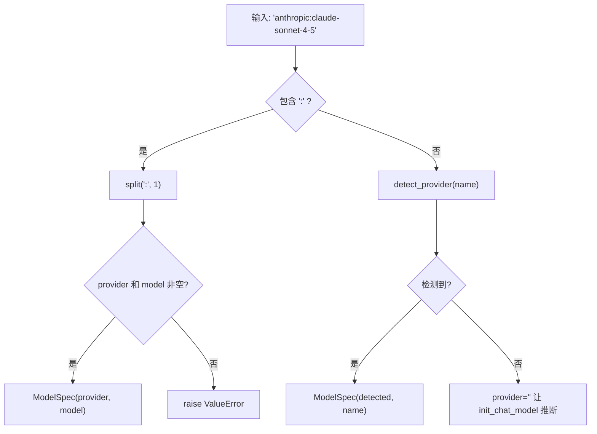
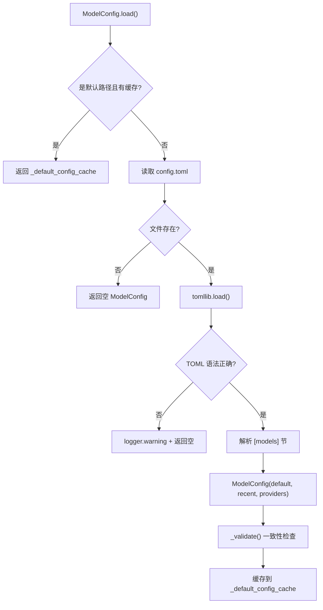
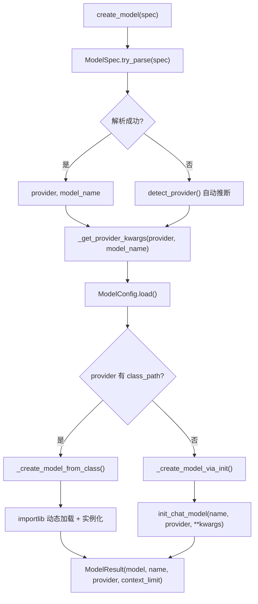

# PD-436.01 DeepAgents — TOML 驱动多模型提供商管理

> 文档编号：PD-436.01
> 来源：DeepAgents CLI `libs/cli/deepagents_cli/model_config.py`, `config.py`
> GitHub：https://github.com/langchain-ai/deepagents.git
> 问题域：PD-436 多模型提供商管理 Multi-Provider Model Management
> 状态：可复用方案

---

## 第 1 章 问题与动机

### 1.1 核心问题

Agent CLI 工具需要同时支持多个 LLM 提供商（OpenAI、Anthropic、Google、Fireworks、Ollama 等），每个提供商有不同的 API 密钥环境变量、base URL、构造参数和认证方式。用户需要在运行时无缝切换模型，同时保持会话连续性。核心挑战包括：

1. **提供商碎片化**：17+ 提供商各有不同的 SDK 包、认证方式和参数格式
2. **运行时热切换**：用户在对话中途切换模型时，需要保持 LangGraph checkpoint 状态
3. **凭证管理**：需要在模型选择前验证凭证可用性，避免运行时失败
4. **自定义扩展**：用户可能使用非标准提供商（如本地 Ollama），需要支持任意 `BaseChatModel` 子类加载
5. **参数覆盖**：同一提供商下不同模型可能需要不同的 temperature、max_tokens 等参数

### 1.2 DeepAgents 的解法概述

DeepAgents CLI 采用 **TOML 配置文件 + 硬编码注册表 + LangChain init_chat_model 三层协作** 的方案：

1. **`provider:model` 统一标识格式** — `ModelSpec` 值对象封装解析逻辑，支持 `anthropic:claude-sonnet-4-5` 格式（`model_config.py:32-104`）
2. **TOML 配置驱动** — `~/.deepagents/config.toml` 存储提供商配置、默认模型、最近使用模型，`ModelConfig` frozen dataclass 解析并缓存（`model_config.py:450-536`）
3. **17 提供商硬编码凭证映射** — `PROVIDER_API_KEY_ENV` 字典映射提供商到环境变量名，支持快速凭证检测（`model_config.py:154-172`）
4. **双路径模型创建** — 标准提供商走 `init_chat_model`，自定义提供商走 `class_path` importlib 动态加载（`config.py:1208-1266`）
5. **热切换 + 持久化** — `/model` 命令通过 `_switch_model` 重建 agent 并保存 `recent` 到 TOML（`app.py:2287-2416`）

### 1.3 设计思想

| 设计原则 | 具体实现 | 理由 | 替代方案 |
|----------|----------|------|----------|
| 配置与代码分离 | TOML 文件存储提供商配置，代码只读取 | 用户无需改代码即可添加新提供商 | 环境变量（不够结构化）、YAML（Python 标准库不支持） |
| 不可变配置对象 | `ModelConfig` 用 `frozen=True` dataclass + `MappingProxyType` | 防止全局缓存被意外修改 | 普通 dict（易被修改导致状态不一致） |
| 双层默认值 | `default` > `recent` > 环境检测 | 区分用户主动设置和最近使用，避免 `/model` 切换覆盖用户意图 | 单一 default 字段（无法区分意图） |
| 原子写入 | tempfile + rename 写 TOML | 防止写入中断导致配置文件损坏 | 直接写入（中断时文件损坏） |
| 凭证前置检测 | 模型创建前检查 `has_provider_credentials` | 提前给出友好错误信息，而非等 SDK 抛异常 | 延迟到 SDK 报错（用户体验差） |

---

## 第 2 章 源码实现分析

### 2.1 架构概览

DeepAgents 的多模型提供商管理分为四层：

```
┌─────────────────────────────────────────────────────────┐
│                    UI Layer (app.py)                      │
│  /model 命令 → ModelSelectorScreen → _switch_model()     │
├─────────────────────────────────────────────────────────┤
│                 Creation Layer (config.py)                │
│  create_model() → _get_provider_kwargs()                 │
│       ├─ init_chat_model()     (标准提供商)               │
│       └─ _create_model_from_class()  (自定义 class_path)  │
├─────────────────────────────────────────────────────────┤
│              Config Layer (model_config.py)               │
│  ModelConfig.load() → TOML 解析 + 缓存                    │
│  ModelSpec.parse() → provider:model 解析                  │
│  PROVIDER_API_KEY_ENV → 17 提供商凭证映射                  │
├─────────────────────────────────────────────────────────┤
│              Storage Layer (~/.deepagents/)               │
│  config.toml → [models] default/recent/providers         │
└─────────────────────────────────────────────────────────┘
```

### 2.2 核心实现

#### 2.2.1 ModelSpec 值对象 — provider:model 统一标识



对应源码 `libs/cli/deepagents_cli/model_config.py:32-104`：

```python
@dataclass(frozen=True)
class ModelSpec:
    """A model specification in `provider:model` format."""
    provider: str
    model: str

    def __post_init__(self) -> None:
        if not self.provider:
            raise ValueError("Provider cannot be empty")
        if not self.model:
            raise ValueError("Model cannot be empty")

    @classmethod
    def parse(cls, spec: str) -> ModelSpec:
        if ":" not in spec:
            raise ValueError(
                f"Invalid model spec '{spec}': must be in provider:model format"
            )
        provider, model = spec.split(":", 1)
        return cls(provider=provider, model=model)

    @classmethod
    def try_parse(cls, spec: str) -> ModelSpec | None:
        try:
            return cls.parse(spec)
        except ValueError:
            return None
```

#### 2.2.2 TOML 配置加载与缓存



对应源码 `libs/cli/deepagents_cli/model_config.py:473-536`：

```python
@classmethod
def load(cls, config_path: Path | None = None) -> ModelConfig:
    global _default_config_cache
    is_default = config_path is None
    if is_default and _default_config_cache is not None:
        return _default_config_cache

    if config_path is None:
        config_path = DEFAULT_CONFIG_PATH

    if not config_path.exists():
        fallback = cls()
        if is_default:
            _default_config_cache = fallback
        return fallback

    try:
        with config_path.open("rb") as f:
            data = tomllib.load(f)
    except tomllib.TOMLDecodeError as e:
        logger.warning("Config file %s has invalid TOML syntax: %s.", config_path, e)
        fallback = cls()
        if is_default:
            _default_config_cache = fallback
        return fallback

    models_section = data.get("models", {})
    config = cls(
        default_model=models_section.get("default"),
        recent_model=models_section.get("recent"),
        providers=models_section.get("providers", {}),
    )
    config._validate()
    if is_default:
        _default_config_cache = config
    return config
```

#### 2.2.3 双路径模型创建 — init_chat_model vs class_path



对应源码 `libs/cli/deepagents_cli/config.py:1208-1266`：

```python
def _create_model_from_class(
    class_path: str, model_name: str, provider: str, kwargs: dict[str, Any],
) -> BaseChatModel:
    from langchain_core.language_models import BaseChatModel as _BaseChatModel

    if ":" not in class_path:
        raise ModelConfigError(
            f"Invalid class_path '{class_path}': must be in module.path:ClassName format"
        )
    module_path, class_name = class_path.rsplit(":", 1)

    try:
        module = importlib.import_module(module_path)
    except ImportError as e:
        raise ModelConfigError(f"Could not import module '{module_path}': {e}") from e

    cls = getattr(module, class_name, None)
    if cls is None:
        raise ModelConfigError(f"Class '{class_name}' not found in module '{module_path}'")

    if not (isinstance(cls, type) and issubclass(cls, _BaseChatModel)):
        raise ModelConfigError(f"'{class_path}' is not a BaseChatModel subclass")

    try:
        return cls(model=model_name, **kwargs)
    except Exception as e:
        raise ModelConfigError(f"Failed to instantiate '{class_path}': {e}") from e
```

### 2.3 实现细节

#### per-model 参数覆盖机制

`get_kwargs` 方法实现了两层参数合并：provider 级别的 flat key 作为默认值，model 名称作为 key 的 sub-table 作为覆盖值。

对应源码 `libs/cli/deepagents_cli/model_config.py:669-695`：

```python
def get_kwargs(self, provider_name: str, *, model_name: str | None = None) -> dict[str, Any]:
    provider = self.providers.get(provider_name)
    if not provider:
        return {}
    params = provider.get("params", {})
    # Flat keys are provider-wide defaults; dict values are per-model overrides
    result = {k: v for k, v in params.items() if not isinstance(v, dict)}
    if model_name:
        overrides = params.get(model_name)
        if isinstance(overrides, dict):
            result.update(overrides)
    return result
```

TOML 配置示例：

```toml
[models]
default = "anthropic:claude-sonnet-4-5"

[models.providers.ollama]
base_url = "http://localhost:11434/v1"
api_key_env = "OLLAMA_API_KEY"
models = ["llama3.1:8b", "qwen3:4b"]

[models.providers.ollama.params]
temperature = 0.7  # provider-wide default

[models.providers.ollama.params."qwen3:4b"]
temperature = 0.3  # per-model override
num_predict = 4096
```

#### 凭证三层检测链

`has_provider_credentials` 按优先级检查三个来源（`model_config.py:391-428`）：

1. **config.toml 的 `api_key_env`** — 用户自定义提供商优先
2. **`PROVIDER_API_KEY_ENV` 硬编码映射** — 17 个已知提供商
3. **LangChain 内置注册表** — 返回 `None`（未知状态），让 SDK 自行处理

#### 原子写入保护

所有 TOML 写入操作（`save_default_model`、`save_recent_model`）都使用 tempfile + rename 模式（`model_config.py:698-748`），确保写入中断不会损坏配置文件。


---

## 第 3 章 迁移指南

### 3.1 迁移清单

**阶段 1：基础配置层（必须）**

- [ ] 定义 `ModelSpec` 值对象，封装 `provider:model` 解析
- [ ] 创建 `ModelConfig` frozen dataclass，从 TOML 加载配置
- [ ] 实现 `PROVIDER_API_KEY_ENV` 凭证映射表
- [ ] 实现 `has_provider_credentials()` 三层凭证检测

**阶段 2：模型创建（必须）**

- [ ] 实现 `create_model()` 入口函数，支持 `provider:model` 和裸模型名
- [ ] 实现 `_get_provider_kwargs()` 参数合并（provider 默认 + per-model 覆盖）
- [ ] 实现 `_create_model_via_init()` 标准路径
- [ ] 实现 `_create_model_from_class()` 自定义 class_path 路径

**阶段 3：热切换（可选）**

- [ ] 实现 `/model` 命令和 `ModelSelectorScreen` UI
- [ ] 实现 `save_recent_model()` / `save_default_model()` 持久化
- [ ] 实现 `_switch_model()` 运行时热切换（需要 checkpointer 支持）

### 3.2 适配代码模板

以下是一个可直接复用的最小化多提供商管理模块：

```python
"""Minimal multi-provider model management inspired by DeepAgents CLI."""

from __future__ import annotations

import importlib
import os
import tomllib
from dataclasses import dataclass, field
from pathlib import Path
from typing import Any

# pip install langchain langchain-openai langchain-anthropic tomli-w

PROVIDER_API_KEY_ENV: dict[str, str] = {
    "anthropic": "ANTHROPIC_API_KEY",
    "openai": "OPENAI_API_KEY",
    "google_genai": "GOOGLE_API_KEY",
    "fireworks": "FIREWORKS_API_KEY",
    "ollama": "OLLAMA_API_KEY",  # custom
}

CONFIG_PATH = Path.home() / ".myagent" / "config.toml"


@dataclass(frozen=True)
class ModelSpec:
    provider: str
    model: str

    @classmethod
    def parse(cls, spec: str) -> ModelSpec:
        if ":" not in spec:
            raise ValueError(f"Invalid spec '{spec}': use provider:model format")
        provider, model = spec.split(":", 1)
        if not provider or not model:
            raise ValueError(f"Invalid spec '{spec}': provider and model required")
        return cls(provider=provider, model=model)


@dataclass(frozen=True)
class ProviderConfig:
    base_url: str | None = None
    api_key_env: str | None = None
    class_path: str | None = None
    params: dict[str, Any] = field(default_factory=dict)


def load_config() -> dict[str, ProviderConfig]:
    """Load provider configs from TOML file."""
    if not CONFIG_PATH.exists():
        return {}
    with CONFIG_PATH.open("rb") as f:
        data = tomllib.load(f)
    providers = {}
    for name, cfg in data.get("models", {}).get("providers", {}).items():
        providers[name] = ProviderConfig(
            base_url=cfg.get("base_url"),
            api_key_env=cfg.get("api_key_env"),
            class_path=cfg.get("class_path"),
            params=cfg.get("params", {}),
        )
    return providers


def has_credentials(provider: str) -> bool | None:
    """Check if credentials are available. True/False/None(unknown)."""
    configs = load_config()
    if provider in configs and configs[provider].api_key_env:
        return bool(os.environ.get(configs[provider].api_key_env))
    env_var = PROVIDER_API_KEY_ENV.get(provider)
    if env_var:
        return bool(os.environ.get(env_var))
    return None


def get_provider_kwargs(
    provider: str, model_name: str | None = None
) -> dict[str, Any]:
    """Build kwargs with per-model overrides."""
    configs = load_config()
    cfg = configs.get(provider)
    if not cfg:
        return {}
    # Provider-wide flat params
    result = {k: v for k, v in cfg.params.items() if not isinstance(v, dict)}
    # Per-model overrides
    if model_name:
        overrides = cfg.params.get(model_name)
        if isinstance(overrides, dict):
            result.update(overrides)
    if cfg.base_url:
        result["base_url"] = cfg.base_url
    if cfg.api_key_env:
        api_key = os.environ.get(cfg.api_key_env)
        if api_key:
            result["api_key"] = api_key
    return result


def create_model(spec: str, **extra_kwargs: Any):
    """Create a chat model from provider:model spec."""
    from langchain.chat_models import init_chat_model

    parsed = ModelSpec.parse(spec)
    kwargs = get_provider_kwargs(parsed.provider, parsed.model)
    kwargs.update(extra_kwargs)

    # Check for custom class_path
    configs = load_config()
    cfg = configs.get(parsed.provider)
    if cfg and cfg.class_path:
        return _create_from_class(cfg.class_path, parsed.model, kwargs)

    return init_chat_model(
        parsed.model, model_provider=parsed.provider, **kwargs
    )


def _create_from_class(class_path: str, model_name: str, kwargs: dict):
    """Import and instantiate a custom BaseChatModel."""
    module_path, class_name = class_path.rsplit(":", 1)
    module = importlib.import_module(module_path)
    cls = getattr(module, class_name)
    return cls(model=model_name, **kwargs)
```

### 3.3 适用场景

| 场景 | 适用度 | 说明 |
|------|--------|------|
| CLI Agent 工具 | ⭐⭐⭐ | 完美匹配：用户需要在终端中切换模型 |
| 多租户 SaaS | ⭐⭐ | 需要扩展为 per-tenant 配置，TOML 不够 |
| 本地 + 云混合部署 | ⭐⭐⭐ | class_path 机制天然支持 Ollama 等本地模型 |
| CI/CD 管道 | ⭐⭐ | 环境变量检测好用，但 TOML 文件需要额外管理 |
| 微服务架构 | ⭐ | 单进程缓存不适合分布式场景，需要改为远程配置 |

---

## 第 4 章 测试用例

基于 DeepAgents 真实测试模式（`tests/unit_tests/test_model_config.py`）编写：

```python
"""Tests for multi-provider model management."""

import os
import tomli_w
from pathlib import Path
from unittest.mock import patch

import pytest


class TestModelSpec:
    """Tests for ModelSpec value object."""

    def test_parse_valid_spec(self):
        spec = ModelSpec.parse("anthropic:claude-sonnet-4-5")
        assert spec.provider == "anthropic"
        assert spec.model == "claude-sonnet-4-5"

    def test_parse_with_colons_in_model(self):
        spec = ModelSpec.parse("ollama:qwen3:4b")
        assert spec.provider == "ollama"
        assert spec.model == "qwen3:4b"

    def test_parse_raises_on_bare_name(self):
        with pytest.raises(ValueError, match="provider:model"):
            ModelSpec.parse("gpt-4o")

    def test_parse_raises_on_empty_provider(self):
        with pytest.raises(ValueError):
            ModelSpec.parse(":claude-sonnet-4-5")

    def test_frozen_immutable(self):
        spec = ModelSpec.parse("openai:gpt-4o")
        with pytest.raises(AttributeError):
            spec.provider = "anthropic"


class TestProviderCredentials:
    """Tests for credential detection."""

    def test_known_provider_with_key(self):
        with patch.dict(os.environ, {"ANTHROPIC_API_KEY": "sk-test"}):
            assert has_credentials("anthropic") is True

    def test_known_provider_without_key(self):
        with patch.dict(os.environ, {}, clear=True):
            # Remove the key if present
            os.environ.pop("ANTHROPIC_API_KEY", None)
            assert has_credentials("anthropic") is False

    def test_unknown_provider_returns_none(self):
        assert has_credentials("unknown_provider") is None


class TestProviderKwargs:
    """Tests for per-model parameter overrides."""

    def test_flat_params_returned(self, tmp_path):
        config_file = tmp_path / "config.toml"
        config_data = {
            "models": {
                "providers": {
                    "ollama": {
                        "base_url": "http://localhost:11434/v1",
                        "params": {"temperature": 0.7},
                    }
                }
            }
        }
        with config_file.open("wb") as f:
            tomli_w.dump(config_data, f)

        # Load and verify
        kwargs = get_provider_kwargs("ollama")
        assert kwargs.get("temperature") == 0.7

    def test_per_model_override(self, tmp_path):
        config_data = {
            "models": {
                "providers": {
                    "ollama": {
                        "params": {
                            "temperature": 0.7,
                            "qwen3:4b": {"temperature": 0.3, "num_predict": 4096},
                        }
                    }
                }
            }
        }
        # Per-model should override provider default
        # temperature: 0.7 → 0.3, num_predict: added
        kwargs = get_provider_kwargs("ollama", model_name="qwen3:4b")
        assert kwargs["temperature"] == 0.3
        assert kwargs["num_predict"] == 4096


class TestModelCreation:
    """Tests for dual-path model creation."""

    def test_standard_provider_uses_init_chat_model(self):
        """Standard providers should go through init_chat_model."""
        with patch("langchain.chat_models.init_chat_model") as mock_init:
            mock_init.return_value = "mock_model"
            model = create_model("openai:gpt-4o")
            mock_init.assert_called_once()
            assert model == "mock_model"

    def test_class_path_uses_importlib(self, tmp_path):
        """Custom class_path should bypass init_chat_model."""
        # This tests the importlib loading path
        # In real usage: class_path = "my_package.models:MyChatModel"
        pass  # Requires mock module setup


class TestAtomicWrite:
    """Tests for atomic TOML write operations."""

    def test_save_creates_parent_dirs(self, tmp_path):
        config_path = tmp_path / "subdir" / "config.toml"
        from model_config import _save_model_field
        result = _save_model_field("recent", "openai:gpt-4o", config_path)
        assert result is True
        assert config_path.exists()

    def test_save_preserves_existing_keys(self, tmp_path):
        config_path = tmp_path / "config.toml"
        initial = {"models": {"default": "anthropic:claude-sonnet-4-5"}}
        with config_path.open("wb") as f:
            tomli_w.dump(initial, f)

        _save_model_field("recent", "openai:gpt-4o", config_path)

        import tomllib
        with config_path.open("rb") as f:
            data = tomllib.load(f)
        assert data["models"]["default"] == "anthropic:claude-sonnet-4-5"
        assert data["models"]["recent"] == "openai:gpt-4o"
```


---

## 第 5 章 跨域关联

| 关联域 | 关系类型 | 说明 |
|--------|----------|------|
| PD-04 工具系统 | 协同 | 模型切换后需要重建 agent 的工具绑定，`create_cli_agent` 接收新 model 并重新注册工具 |
| PD-01 上下文管理 | 协同 | `model_context_limit` 从模型 profile 提取，用于上下文窗口管理和压缩触发 |
| PD-03 容错与重试 | 依赖 | 模型创建失败时的 `ModelConfigError` 异常链和 settings 回滚机制依赖容错设计 |
| PD-09 Human-in-the-Loop | 协同 | `ModelSelectorScreen` 是 HITL 模式的一种实现，用户通过交互式 UI 选择模型 |
| PD-11 可观测性 | 协同 | `settings.model_name` 和 `model_provider` 被注入到 LangSmith 追踪中，用于按模型维度分析成本 |
| PD-06 记忆持久化 | 协同 | 热切换依赖 LangGraph checkpointer 保持会话状态，无 checkpointer 时降级为保存偏好 |

---

## 第 6 章 来源文件索引

| 文件 | 行范围 | 关键实现 |
|------|--------|----------|
| `libs/cli/deepagents_cli/model_config.py` | L32-L104 | `ModelSpec` 值对象：`provider:model` 解析与验证 |
| `libs/cli/deepagents_cli/model_config.py` | L107-L145 | `ProviderConfig` TypedDict：提供商配置结构定义 |
| `libs/cli/deepagents_cli/model_config.py` | L154-L172 | `PROVIDER_API_KEY_ENV`：17 提供商凭证环境变量映射 |
| `libs/cli/deepagents_cli/model_config.py` | L308-L376 | `get_available_models()`：动态发现已安装提供商的可用模型 |
| `libs/cli/deepagents_cli/model_config.py` | L391-L428 | `has_provider_credentials()`：三层凭证检测链 |
| `libs/cli/deepagents_cli/model_config.py` | L450-L536 | `ModelConfig.load()`：TOML 配置加载、解析与缓存 |
| `libs/cli/deepagents_cli/model_config.py` | L669-L695 | `get_kwargs()`：per-model 参数覆盖合并 |
| `libs/cli/deepagents_cli/model_config.py` | L698-L748 | `_save_model_field()`：原子 TOML 写入 |
| `libs/cli/deepagents_cli/config.py` | L1083-L1116 | `detect_provider()`：模型名前缀自动推断提供商 |
| `libs/cli/deepagents_cli/config.py` | L1119-L1155 | `_get_default_model_spec()`：三层默认值优先级链 |
| `libs/cli/deepagents_cli/config.py` | L1168-L1205 | `_get_provider_kwargs()`：配置读取 + OpenRouter headers 注入 |
| `libs/cli/deepagents_cli/config.py` | L1208-L1266 | `_create_model_from_class()`：importlib 动态加载自定义 BaseChatModel |
| `libs/cli/deepagents_cli/config.py` | L1269-L1312 | `_create_model_via_init()`：标准 init_chat_model 路径 |
| `libs/cli/deepagents_cli/config.py` | L1341-L1435 | `create_model()`：统一入口，双路径分发 |
| `libs/cli/deepagents_cli/app.py` | L2287-L2416 | `_switch_model()`：运行时热切换 + 回滚保护 |
| `libs/cli/deepagents_cli/widgets/model_selector.py` | L85-L631 | `ModelSelectorScreen`：交互式模型选择 UI |

---

## 第 7 章 横向对比维度

```json comparison_data
{
  "project": "DeepAgents",
  "dimensions": {
    "配置格式": "TOML 文件 (~/.deepagents/config.toml)，tomllib 标准库解析",
    "提供商注册": "17 提供商硬编码 PROVIDER_API_KEY_ENV + TOML 自定义扩展",
    "模型标识": "provider:model 格式 ModelSpec 值对象，支持裸名自动推断",
    "凭证检测": "三层链：config.toml api_key_env → 硬编码映射 → LangChain 注册表",
    "热切换机制": "/model 命令 + LangGraph checkpointer 保持会话状态",
    "自定义扩展": "class_path importlib 动态加载任意 BaseChatModel 子类",
    "参数覆盖": "TOML params 表 flat key 为 provider 默认，sub-table 为 per-model 覆盖",
    "持久化策略": "default/recent 双字段分离，tempfile+rename 原子写入"
  }
}
```

### 域元数据补充

```json domain_metadata
{
  "solution_summary": "DeepAgents CLI 通过 TOML 配置 + 17 提供商硬编码映射 + class_path importlib 动态加载三层协作，实现 provider:model 统一标识、per-model 参数覆盖和 LangGraph checkpoint 热切换",
  "description": "涵盖模型标识解析、配置缓存、凭证前置检测和运行时热切换的完整生命周期",
  "sub_problems": [
    "模型 profile 能力验证（tool_calling 支持检测）",
    "default vs recent 双字段意图区分",
    "LangChain 内置提供商注册表动态发现"
  ],
  "best_practices": [
    "frozen dataclass + MappingProxyType 防止全局缓存被意外修改",
    "tempfile + rename 原子写入防止配置文件损坏",
    "模型创建前凭证前置检测，提前给出友好错误信息"
  ]
}
```

