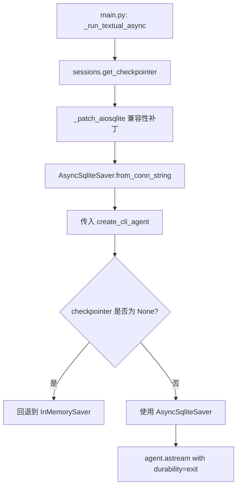
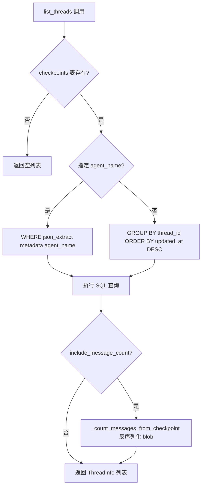
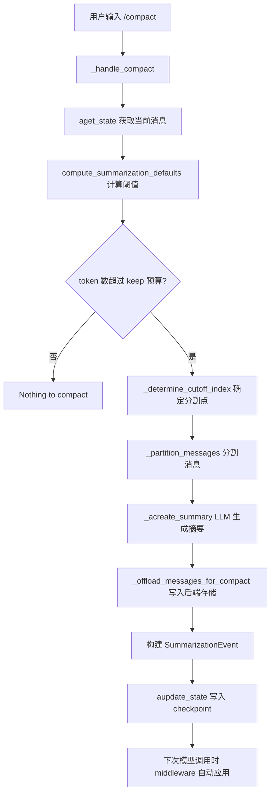

# PD-437.01 DeepAgents — LangGraph Checkpointer 多线程会话管理

> 文档编号：PD-437.01
> 来源：DeepAgents CLI `libs/cli/deepagents_cli/sessions.py`
> GitHub：https://github.com/langchain-ai/deepagents.git
> 问题域：PD-437 会话与线程管理 Session & Thread Management
> 状态：可复用方案

---

## 第 1 章 问题与动机

### 1.1 核心问题

CLI 形态的 Agent 应用需要支持多轮对话的持久化和恢复。用户可能在不同时间段与不同 Agent 进行多个独立对话，每个对话需要：

1. **线程级状态隔离** — 不同对话的消息历史、工具调用状态互不干扰
2. **跨会话持久化** — 关闭 CLI 后重新打开，能恢复之前的对话上下文
3. **线程生命周期管理** — 创建、列表、切换、删除、模糊搜索
4. **会话压缩** — 长对话的 token 膨胀问题，需要在保留语义的前提下压缩历史

传统做法是自建消息存储层，但这会引入大量样板代码且难以与 LangGraph 的状态机模型对齐。

### 1.2 DeepAgents 的解法概述

DeepAgents CLI 采用 **LangGraph Checkpointer 原生机制** 作为会话持久化的唯一真相源（single source of truth），避免了自建存储层：

1. **AsyncSqliteSaver 作为 Checkpointer** — 所有线程状态通过 LangGraph 的 checkpoint 机制自动持久化到 `~/.deepagents/sessions.db`（`sessions.py:68`）
2. **8 字符 hex thread_id** — 用 `uuid4().hex[:8]` 生成短 ID，兼顾唯一性和用户友好（`sessions.py:133`）
3. **元数据存储在 checkpoint metadata 中** — agent_name、updated_at 等通过 `json_extract` 从 checkpoint 的 metadata JSON 字段查询（`sessions.py:171-174`）
4. **TextualSessionState 管理运行时状态** — 轻量 dataclass 持有 thread_id 和 auto_approve，与 checkpoint 持久化解耦（`app.py:212-237`）
5. **SummarizationMiddleware 实现 compact** — 通过 `_summarization_event` 写入 checkpoint state，下次模型调用时中间件自动应用摘要替换旧消息（`app.py:1293-1466`）

### 1.3 设计思想

| 设计原则 | 具体实现 | 理由 | 替代方案 |
|----------|----------|------|----------|
| 复用框架原语 | 用 LangGraph Checkpointer 而非自建存储 | 避免状态同步问题，checkpoint 与 graph 执行天然一致 | 自建 SQLite 消息表 + 手动序列化 |
| 元数据内嵌 | agent_name/updated_at 存在 checkpoint metadata JSON 中 | 无需额外表，SQLite json_extract 即可查询 | 独立 threads 元数据表 |
| 短 ID 设计 | uuid4 截取 8 字符 hex | CLI 场景下用户需要手动输入 thread ID，短 ID 更友好 | 完整 UUID / 自增 ID |
| 运行时与持久化分离 | TextualSessionState 只持有 thread_id + auto_approve | 运行时状态变更不触发 DB 写入，减少 I/O | 每次状态变更都写 DB |
| 渐进式压缩 | SummarizationEvent 记录 cutoff_index + summary | 支持多次压缩叠加，不丢失压缩历史 | 直接删除旧消息 |

---

## 第 2 章 源码实现分析

### 2.1 架构概览

DeepAgents 的会话管理分为三层：持久化层（sessions.py + AsyncSqliteSaver）、运行时层（TextualSessionState）、UI 层（ThreadSelectorScreen + WelcomeBanner）。

```
┌─────────────────────────────────────────────────────────┐
│                    Textual App (app.py)                  │
│  ┌──────────────┐  ┌──────────────┐  ┌───────────────┐  │
│  │ SessionState │  │  UIAdapter   │  │ ThreadSelector│  │
│  │ thread_id    │  │ stream_config│  │ /threads modal│  │
│  │ auto_approve │  │ durability   │  │ resume/switch │  │
│  └──────┬───────┘  └──────┬───────┘  └───────┬───────┘  │
│         │                 │                   │          │
│         ▼                 ▼                   ▼          │
│  ┌─────────────────────────────────────────────────┐    │
│  │           sessions.py (线程管理 API)             │    │
│  │  list_threads / get_most_recent / delete_thread  │    │
│  │  find_similar_threads / thread_exists            │    │
│  │  get_checkpointer → AsyncSqliteSaver             │    │
│  └──────────────────────┬──────────────────────────┘    │
│                         │                                │
│                         ▼                                │
│  ┌─────────────────────────────────────────────────┐    │
│  │     ~/.deepagents/sessions.db (SQLite)           │    │
│  │  checkpoints 表: thread_id, metadata(JSON),      │    │
│  │                   checkpoint(blob), checkpoint_id │    │
│  │  writes 表: thread_id, pending writes             │    │
│  └─────────────────────────────────────────────────┘    │
└─────────────────────────────────────────────────────────┘
```

### 2.2 核心实现

#### 2.2.1 Checkpointer 初始化与连接管理



对应源码 `sessions.py:372-384`：
```python
@asynccontextmanager
async def get_checkpointer() -> AsyncIterator[AsyncSqliteSaver]:
    """Get AsyncSqliteSaver for the global database."""
    from langgraph.checkpoint.sqlite.aio import AsyncSqliteSaver

    _patch_aiosqlite()

    async with AsyncSqliteSaver.from_conn_string(str(get_db_path())) as checkpointer:
        yield checkpointer
```

关键细节：`_patch_aiosqlite()`（`sessions.py:24-51`）为 aiosqlite.Connection 动态添加 `is_alive()` 方法，解决 langgraph-checkpoint>=2.1.0 的兼容性问题。这是一个防御性 monkey-patch，用模块级 flag `_aiosqlite_patched` 确保只执行一次。

#### 2.2.2 线程列表与元数据查询



对应源码 `sessions.py:147-209`：
```python
async def list_threads(
    agent_name: str | None = None,
    limit: int = 20,
    include_message_count: bool = False,
) -> list[ThreadInfo]:
    async with _connect() as conn:
        if not await _table_exists(conn, "checkpoints"):
            return []

        if agent_name:
            query = """
                SELECT thread_id,
                       json_extract(metadata, '$.agent_name') as agent_name,
                       MAX(json_extract(metadata, '$.updated_at')) as updated_at
                FROM checkpoints
                WHERE json_extract(metadata, '$.agent_name') = ?
                GROUP BY thread_id
                ORDER BY updated_at DESC
                LIMIT ?
            """
```

消息计数通过反序列化最新 checkpoint blob 实现（`sessions.py:212-256`），使用 `JsonPlusSerializer` 解码 checkpoint 数据，从 `channel_values.messages` 获取消息列表长度。这是因为 `durability="exit"` 模式下消息存储在 checkpoint blob 中而非 writes 表。

#### 2.2.3 线程切换与状态恢复

对应源码 `app.py:2201-2285`：
```python
async def _resume_thread(self, thread_id: str) -> None:
    # Save previous state for rollback on failure
    prev_thread_id = self._lc_thread_id
    prev_session_thread = self._session_state.thread_id

    try:
        # Clear conversation
        self._pending_messages.clear()
        self._queued_widgets.clear()
        await self._clear_messages()

        # Switch to the selected thread
        self._session_state.thread_id = thread_id
        self._lc_thread_id = thread_id

        # Load thread history
        await self._load_thread_history()
    except Exception as exc:
        # Restore previous thread IDs
        self._session_state.thread_id = prev_session_thread
        self._lc_thread_id = prev_thread_id
        await self._load_thread_history()  # Restore previous history
```

线程切换采用 **事务性回滚模式**：先保存旧状态，切换失败时恢复旧 thread_id 并重新加载旧历史。

### 2.3 实现细节

#### stream config 中的 thread_id 传播

`textual_adapter.py:46-75` 中 `_build_stream_config` 将 thread_id 放入 `configurable` 字典，LangGraph 自动将其传播为 run metadata，同时用于 LangSmith 过滤：

```python
def _build_stream_config(thread_id: str, assistant_id: str | None) -> dict[str, Any]:
    metadata: dict[str, str] = {}
    if assistant_id:
        metadata.update({
            "assistant_id": assistant_id,
            "agent_name": assistant_id,
            "updated_at": datetime.now(UTC).isoformat(),
        })
    return {
        "configurable": {"thread_id": thread_id},
        "metadata": metadata,
    }
```

#### durability="exit" 模式

`textual_adapter.py:347` 中 `agent.astream(..., durability="exit")` 表示只在 stream 结束时写入 checkpoint，而非每个 step 都写。这大幅减少了 SQLite I/O，但代价是中途崩溃会丢失当前轮次的状态。

#### 会话压缩（compact）数据流



`SummarizationEvent`（`summarization.py:87-98`）是压缩的核心数据结构，包含 `cutoff_index`（分割点）、`summary_message`（摘要消息）和 `file_path`（历史导出路径）。多次压缩通过 `_compute_state_cutoff` 累加 cutoff_index 实现叠加。

---

## 第 3 章 迁移指南

### 3.1 迁移清单

**阶段 1：基础持久化（最小可用）**

- [ ] 安装依赖：`langgraph-checkpoint-sqlite`、`aiosqlite`
- [ ] 创建 `sessions.py` 模块，包含 `get_db_path()`、`get_checkpointer()`、`generate_thread_id()`
- [ ] 添加 `_patch_aiosqlite()` 兼容性补丁（如果使用 langgraph-checkpoint>=2.1.0）
- [ ] 在 agent 创建时传入 AsyncSqliteSaver 作为 checkpointer
- [ ] 在 stream 调用中设置 `configurable.thread_id` 和 `durability="exit"`

**阶段 2：线程管理 API**

- [ ] 实现 `list_threads()`：基于 checkpoint metadata 的 `json_extract` 查询
- [ ] 实现 `thread_exists()`、`delete_thread()`、`find_similar_threads()`
- [ ] 实现 `get_most_recent()` 用于 `-r` 快速恢复最近线程
- [ ] 定义 `ThreadInfo` TypedDict 作为线程元数据的标准结构

**阶段 3：会话压缩**

- [ ] 集成 SummarizationMiddleware 或自建等效逻辑
- [ ] 实现 `SummarizationEvent` 数据结构（cutoff_index + summary_message + file_path）
- [ ] 通过 `aupdate_state` 将压缩事件写入 checkpoint
- [ ] 实现历史导出到后端存储（可选）

### 3.2 适配代码模板

#### 最小可用的线程持久化

```python
"""Minimal thread-persistent session management using LangGraph Checkpointer."""

from __future__ import annotations

import uuid
from contextlib import asynccontextmanager
from pathlib import Path
from typing import AsyncIterator, TypedDict

import aiosqlite


# --- 兼容性补丁 ---
_patched = False

def patch_aiosqlite() -> None:
    """Patch aiosqlite.Connection with is_alive() for langgraph-checkpoint>=2.1.0."""
    global _patched
    if _patched:
        return
    if not hasattr(aiosqlite.Connection, "is_alive"):
        def _is_alive(self: aiosqlite.Connection) -> bool:
            return bool(self._running and self._connection is not None)
        aiosqlite.Connection.is_alive = _is_alive  # type: ignore[attr-defined]
    _patched = True


# --- 数据库路径 ---
def get_db_path() -> Path:
    db_dir = Path.home() / ".myagent"
    db_dir.mkdir(parents=True, exist_ok=True)
    return db_dir / "sessions.db"


# --- Checkpointer ---
@asynccontextmanager
async def get_checkpointer() -> AsyncIterator:
    from langgraph.checkpoint.sqlite.aio import AsyncSqliteSaver
    patch_aiosqlite()
    async with AsyncSqliteSaver.from_conn_string(str(get_db_path())) as saver:
        yield saver


# --- 线程 ID ---
def generate_thread_id() -> str:
    return uuid.uuid4().hex[:8]


# --- 线程列表 ---
class ThreadInfo(TypedDict):
    thread_id: str
    agent_name: str | None
    updated_at: str | None


async def list_threads(agent_name: str | None = None, limit: int = 20) -> list[ThreadInfo]:
    patch_aiosqlite()
    async with aiosqlite.connect(str(get_db_path()), timeout=30.0) as conn:
        # 检查表是否存在
        async with conn.execute(
            "SELECT 1 FROM sqlite_master WHERE type='table' AND name='checkpoints'"
        ) as cur:
            if not await cur.fetchone():
                return []

        query = """
            SELECT thread_id,
                   json_extract(metadata, '$.agent_name') as agent_name,
                   MAX(json_extract(metadata, '$.updated_at')) as updated_at
            FROM checkpoints
            {where}
            GROUP BY thread_id
            ORDER BY updated_at DESC
            LIMIT ?
        """
        if agent_name:
            sql = query.format(where="WHERE json_extract(metadata, '$.agent_name') = ?")
            params = (agent_name, limit)
        else:
            sql = query.format(where="")
            params = (limit,)

        async with conn.execute(sql, params) as cur:
            return [
                ThreadInfo(thread_id=r[0], agent_name=r[1], updated_at=r[2])
                for r in await cur.fetchall()
            ]


# --- 使用示例 ---
async def run_agent_with_session():
    from langgraph.graph import StateGraph
    # 1. 获取 checkpointer
    async with get_checkpointer() as checkpointer:
        # 2. 创建 agent（传入 checkpointer）
        agent = build_your_agent(checkpointer=checkpointer)

        # 3. 生成或恢复 thread_id
        thread_id = generate_thread_id()  # 或从 list_threads 中选择

        # 4. stream 时传入 thread_id
        config = {
            "configurable": {"thread_id": thread_id},
            "metadata": {"agent_name": "my-agent", "updated_at": "..."},
        }
        async for chunk in agent.astream(
            {"messages": [{"role": "user", "content": "Hello"}]},
            config=config,
            durability="exit",  # 只在 stream 结束时写 checkpoint
        ):
            process_chunk(chunk)
```

### 3.3 适用场景

| 场景 | 适用度 | 说明 |
|------|--------|------|
| CLI Agent 多轮对话 | ⭐⭐⭐ | 完美匹配，DeepAgents 的原生场景 |
| Web 应用会话管理 | ⭐⭐ | 可用但需替换 SQLite 为 PostgreSQL checkpointer |
| 多用户 SaaS | ⭐ | 需要额外的用户隔离层，SQLite 不适合高并发 |
| 短期任务（无需持久化） | ⭐⭐ | 可用 InMemorySaver 替代，无需 SQLite |
| 分布式 Agent 系统 | ⭐ | SQLite 是单机方案，需换用 Redis/PostgreSQL checkpointer |

---

## 第 4 章 测试用例

```python
"""Tests for thread-persistent session management (DeepAgents pattern)."""

import uuid
from pathlib import Path
from unittest.mock import AsyncMock, MagicMock, patch

import pytest


class TestGenerateThreadId:
    """Test thread ID generation."""

    def test_length_is_8(self):
        """Thread ID should be 8 characters."""
        from sessions import generate_thread_id
        tid = generate_thread_id()
        assert len(tid) == 8

    def test_is_hex(self):
        """Thread ID should be valid hex."""
        from sessions import generate_thread_id
        tid = generate_thread_id()
        int(tid, 16)  # Should not raise

    def test_uniqueness(self):
        """Generated IDs should be unique."""
        from sessions import generate_thread_id
        ids = {generate_thread_id() for _ in range(1000)}
        assert len(ids) == 1000


class TestSessionState:
    """Test TextualSessionState runtime behavior."""

    def test_default_thread_id_generated(self):
        """Should generate thread_id when not provided."""
        from app import TextualSessionState
        state = TextualSessionState()
        assert len(state.thread_id) == 8

    def test_explicit_thread_id(self):
        """Should use provided thread_id."""
        from app import TextualSessionState
        state = TextualSessionState(thread_id="abc12345")
        assert state.thread_id == "abc12345"

    def test_reset_thread(self):
        """reset_thread should generate new ID."""
        from app import TextualSessionState
        state = TextualSessionState(thread_id="old_id")
        new_id = state.reset_thread()
        assert new_id != "old_id"
        assert len(new_id) == 8
        assert state.thread_id == new_id


class TestListThreads:
    """Test thread listing from checkpoint metadata."""

    @pytest.mark.asyncio
    async def test_empty_db(self, tmp_path):
        """Should return empty list when no checkpoints table."""
        from sessions import list_threads
        with patch("sessions.get_db_path", return_value=tmp_path / "test.db"):
            result = await list_threads()
            assert result == []

    @pytest.mark.asyncio
    async def test_agent_filter(self, tmp_path):
        """Should filter threads by agent_name in metadata."""
        # Setup: create checkpoints table with test data
        import aiosqlite
        db_path = tmp_path / "test.db"
        async with aiosqlite.connect(str(db_path)) as conn:
            await conn.execute("""
                CREATE TABLE checkpoints (
                    thread_id TEXT, checkpoint_id TEXT,
                    metadata TEXT, type TEXT, checkpoint BLOB
                )
            """)
            await conn.execute(
                "INSERT INTO checkpoints VALUES (?, ?, ?, ?, ?)",
                ("t1", "c1", '{"agent_name":"bot-a","updated_at":"2025-01-01T00:00:00"}',
                 "json", b"{}"),
            )
            await conn.execute(
                "INSERT INTO checkpoints VALUES (?, ?, ?, ?, ?)",
                ("t2", "c2", '{"agent_name":"bot-b","updated_at":"2025-01-02T00:00:00"}',
                 "json", b"{}"),
            )
            await conn.commit()

        from sessions import list_threads
        with patch("sessions.get_db_path", return_value=db_path):
            result = await list_threads(agent_name="bot-a")
            assert len(result) == 1
            assert result[0]["thread_id"] == "t1"


class TestBuildStreamConfig:
    """Test stream config construction."""

    def test_thread_id_in_configurable(self):
        """thread_id should be in configurable dict."""
        from textual_adapter import _build_stream_config
        config = _build_stream_config("abc123", "my-agent")
        assert config["configurable"]["thread_id"] == "abc123"

    def test_metadata_includes_agent_name(self):
        """Metadata should include agent_name and updated_at."""
        from textual_adapter import _build_stream_config
        config = _build_stream_config("abc123", "my-agent")
        assert config["metadata"]["agent_name"] == "my-agent"
        assert "updated_at" in config["metadata"]

    def test_no_assistant_id(self):
        """Metadata should be empty when no assistant_id."""
        from textual_adapter import _build_stream_config
        config = _build_stream_config("abc123", None)
        assert config["metadata"] == {}


class TestThreadSwitchRollback:
    """Test transactional rollback on thread switch failure."""

    @pytest.mark.asyncio
    async def test_rollback_on_failure(self):
        """Should restore previous thread_id on switch failure."""
        from app import TextualSessionState
        state = TextualSessionState(thread_id="original")
        prev_id = state.thread_id

        # Simulate failed switch
        state.thread_id = "new_thread"
        # On failure, rollback:
        state.thread_id = prev_id
        assert state.thread_id == "original"
```

---

## 第 5 章 跨域关联

| 关联域 | 关系类型 | 说明 |
|--------|----------|------|
| PD-01 上下文管理 | 协同 | compact 压缩直接服务于上下文窗口管理，SummarizationMiddleware 通过 cutoff_index 控制保留消息量 |
| PD-06 记忆持久化 | 协同 | 线程持久化是记忆系统的基础设施，MemoryMiddleware 依赖 checkpoint 中的 thread_id 隔离不同对话的记忆 |
| PD-09 Human-in-the-Loop | 依赖 | HITL 中断恢复依赖 checkpoint 持久化，`Command(resume=hitl_response)` 需要 thread 状态完整 |
| PD-04 工具系统 | 协同 | `compact_conversation` 作为 LangGraph tool 暴露给 Agent，通过 SummarizationToolMiddleware 注册 |
| PD-11 可观测性 | 协同 | thread_id 自动传播为 LangSmith run metadata，支持按线程过滤 trace |

---

## 第 6 章 来源文件索引

| 文件 | 行范围 | 关键实现 |
|------|--------|----------|
| `libs/cli/deepagents_cli/sessions.py` | L1-488 | 线程管理核心：ThreadInfo、list_threads、get_checkpointer、delete_thread、find_similar_threads |
| `libs/cli/deepagents_cli/sessions.py` | L24-51 | _patch_aiosqlite 兼容性补丁 |
| `libs/cli/deepagents_cli/sessions.py` | L72-86 | ThreadInfo TypedDict 定义 |
| `libs/cli/deepagents_cli/sessions.py` | L127-133 | generate_thread_id（8 字符 hex） |
| `libs/cli/deepagents_cli/sessions.py` | L147-209 | list_threads 元数据查询（json_extract） |
| `libs/cli/deepagents_cli/sessions.py` | L212-256 | _count_messages_from_checkpoint（blob 反序列化） |
| `libs/cli/deepagents_cli/sessions.py` | L372-384 | get_checkpointer（AsyncSqliteSaver 工厂） |
| `libs/cli/deepagents_cli/app.py` | L212-237 | TextualSessionState（运行时状态） |
| `libs/cli/deepagents_cli/app.py` | L405-518 | DeepAgentsApp.__init__ + on_mount（session 初始化） |
| `libs/cli/deepagents_cli/app.py` | L1181-1204 | /clear 和 /compact 命令处理 |
| `libs/cli/deepagents_cli/app.py` | L1293-1466 | _handle_compact（会话压缩完整流程） |
| `libs/cli/deepagents_cli/app.py` | L1771-1836 | _load_thread_history（线程历史恢复） |
| `libs/cli/deepagents_cli/app.py` | L2187-2285 | _show_thread_selector + _resume_thread（线程切换） |
| `libs/cli/deepagents_cli/textual_adapter.py` | L46-75 | _build_stream_config（thread_id 传播） |
| `libs/cli/deepagents_cli/textual_adapter.py` | L342-348 | astream with durability="exit" |
| `libs/cli/deepagents_cli/agent.py` | L584-596 | create_cli_agent（checkpointer 注入） |
| `libs/cli/deepagents_cli/main.py` | L493 | get_checkpointer async context manager 使用 |
| `libs/cli/deepagents_cli/main.py` | L904-965 | 线程恢复 CLI 入口（-r 参数处理） |
| `libs/cli/deepagents_cli/widgets/thread_selector.py` | L88-562 | ThreadSelectorScreen（交互式线程选择 UI） |
| `libs/deepagents/deepagents/middleware/summarization.py` | L87-98 | SummarizationEvent TypedDict |
| `libs/deepagents/deepagents/middleware/summarization.py` | L449-485 | _apply_event_to_messages（压缩事件应用） |

---

## 第 7 章 横向对比维度

```json comparison_data
{
  "project": "DeepAgents",
  "dimensions": {
    "持久化方式": "AsyncSqliteSaver + LangGraph Checkpointer 原生机制",
    "线程标识": "uuid4 截取 8 字符 hex，CLI 友好",
    "元数据存储": "checkpoint metadata JSON 字段，json_extract 查询",
    "状态恢复": "aget_state + bulk_load 虚拟化渲染，事务性回滚",
    "压缩策略": "SummarizationEvent cutoff_index 叠加，LLM 生成摘要 + 后端存储导出",
    "durability 模式": "exit 模式，仅 stream 结束时写 checkpoint"
  }
}
```

### 域元数据补充

```json domain_metadata
{
  "solution_summary": "DeepAgents 用 LangGraph AsyncSqliteSaver 作为唯一持久化层，通过 checkpoint metadata json_extract 查询线程元数据，支持 durability=exit 低 I/O 模式和 SummarizationEvent 叠加式压缩",
  "description": "CLI Agent 场景下线程持久化与 LangGraph checkpoint 机制的深度集成",
  "sub_problems": [
    "线程模糊搜索与 did-you-mean 提示",
    "checkpoint blob 反序列化获取消息计数",
    "线程切换的事务性回滚保护"
  ],
  "best_practices": [
    "用 durability=exit 减少 SQLite I/O，仅 stream 结束时写 checkpoint",
    "线程切换采用 save-switch-rollback 事务模式防止状态损坏",
    "通过 monkey-patch 解决 aiosqlite 与 langgraph-checkpoint 版本兼容问题"
  ]
}
```
