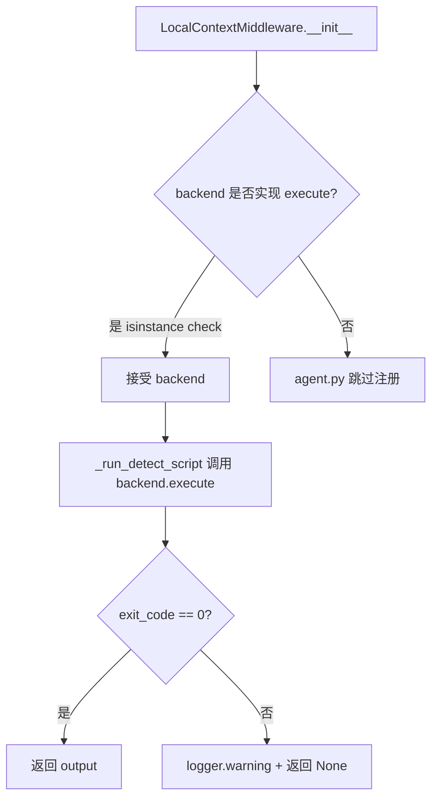
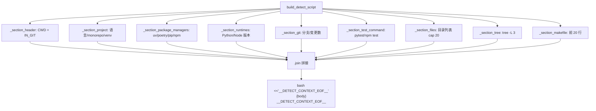
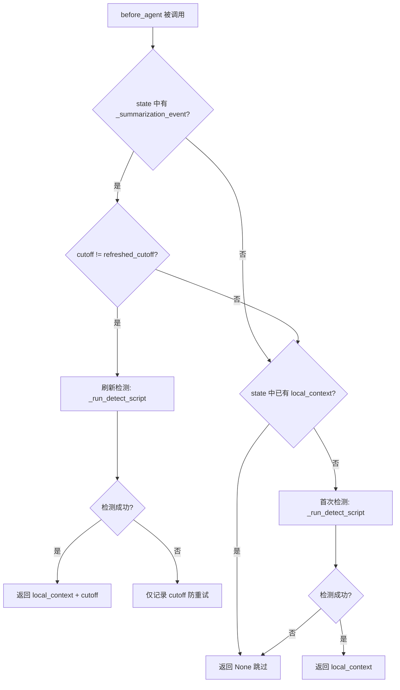

# PD-438.01 DeepAgents — LocalContextMiddleware 环境上下文感知

> 文档编号：PD-438.01
> 来源：DeepAgents `libs/cli/deepagents_cli/local_context.py`
> GitHub：https://github.com/langchain-ai/deepagents.git
> 问题域：PD-438 环境上下文感知 Environment Context Awareness
> 状态：可复用方案

---

## 第 1 章 问题与动机

### 1.1 核心问题

Agent 在启动时对自身运行环境一无所知——不知道当前目录是什么项目、用什么语言、什么包管理器、git 处于什么状态。这导致 Agent 在回答问题或执行任务时缺乏关键上下文，需要用户手动描述环境，或者 Agent 自己花费多轮工具调用去探测。

更棘手的是，在长会话中环境可能发生变化（用户切换分支、安装新依赖、创建新文件），而 Agent 的上下文信息已经过期。如果 Agent 运行在远程沙箱中，检测逻辑还需要在沙箱内部执行，而非在宿主机上。

### 1.2 DeepAgents 的解法概述

DeepAgents 通过 `LocalContextMiddleware` 实现了一套完整的环境上下文感知方案：

1. **Bash 检测脚本组合器** — 将环境检测拆分为 9 个独立的 bash section 函数（`_section_header`, `_section_project`, `_section_package_managers` 等），每个函数返回一段 bash 代码片段，最终由 `build_detect_script()` 拼接成完整脚本（`local_context.py:300-318`）
2. **后端抽象执行** — 通过 `_ExecutableBackend` Protocol 将脚本交给 `backend.execute()` 执行，无论是本地 `LocalShellBackend` 还是远程沙箱，同一套检测逻辑都能工作（`local_context.py:38-42`）
3. **中间件生命周期钩子** — 利用 `AgentMiddleware.before_agent()` 在首次交互时自动运行检测，利用 `wrap_model_call()` / `awrap_model_call()` 在每次 LLM 调用前将上下文追加到系统提示（`local_context.py:407-457`）
4. **摘要事件驱动刷新** — 监听 `_summarization_event` 的 `cutoff_index` 变化，在上下文压缩后自动重新检测环境，确保信息不过期（`local_context.py:434-448`）
5. **防重试循环** — 刷新失败时记录 `_local_context_refreshed_at_cutoff` 但不覆盖已有上下文，避免无限重试（`local_context.py:449-451`）

### 1.3 设计思想

| 设计原则 | 具体实现 | 理由 | 替代方案 |
|----------|----------|------|----------|
| 后端无关性 | `_ExecutableBackend` Protocol + `backend.execute()` | 同一检测脚本在本地 shell 和远程沙箱中都能运行 | 直接调用 subprocess（无法跨后端） |
| 可组合脚本 | 9 个独立 section 函数各返回 bash 片段 | 每个 section 可独立测试、独立启用/禁用 | 单一大脚本（难以测试和维护） |
| 防御性检测 | 每个 section 用 `command -v` 检查工具是否存在 | 缺少 git/tree/python3 时静默跳过而非报错 | 假设工具存在（在精简容器中会失败） |
| 状态驱动刷新 | 监听 `_summarization_event.cutoff_index` 变化 | 仅在上下文压缩后刷新，避免每轮都重新检测 | 定时刷新（浪费资源）或不刷新（信息过期） |
| 私有状态隔离 | `PrivateStateAttr` 标记 `_local_context_refreshed_at_cutoff` | 刷新状态不暴露给子代理，避免状态污染 | 公开状态（子代理可能误读或覆盖） |

---

## 第 2 章 源码实现分析

### 2.1 架构概览

LocalContextMiddleware 的整体架构是一个三层结构：检测脚本层、中间件层、注入层。

```
┌─────────────────────────────────────────────────────────┐
│                   Agent Runtime                          │
│                                                          │
│  ┌──────────────────┐    ┌───────────────────────────┐  │
│  │  before_agent()   │───→│  _run_detect_script()     │  │
│  │  (首次 / 摘要后)  │    │  → backend.execute(script) │  │
│  └──────────────────┘    └───────────┬───────────────┘  │
│           │                          │                   │
│           ▼                          ▼                   │
│  ┌──────────────────┐    ┌───────────────────────────┐  │
│  │  AgentState       │    │  Bash Detection Script     │  │
│  │  {local_context}  │    │  9 sections 拼接           │  │
│  └────────┬─────────┘    │  _section_header()         │  │
│           │              │  _section_project()        │  │
│           ▼              │  _section_package_managers()│  │
│  ┌──────────────────┐    │  _section_runtimes()       │  │
│  │ wrap_model_call() │    │  _section_git()            │  │
│  │ system_prompt +=  │    │  _section_test_command()   │  │
│  │   local_context   │    │  _section_files()          │  │
│  └──────────────────┘    │  _section_tree()           │  │
│                          │  _section_makefile()       │  │
│                          └───────────────────────────┘  │
│                                      │                   │
│                          ┌───────────▼───────────────┐  │
│                          │  Backend (Protocol)        │  │
│                          │  LocalShellBackend         │  │
│                          │  ModalBackend (sandbox)    │  │
│                          └───────────────────────────┘  │
└─────────────────────────────────────────────────────────┘
```

### 2.2 核心实现

#### 2.2.1 后端抽象协议



对应源码 `libs/cli/deepagents_cli/local_context.py:38-42`：

```python
@runtime_checkable
class _ExecutableBackend(Protocol):
    """Any backend that supports `execute(command) -> ExecuteResponse`."""

    def execute(self, command: str) -> ExecuteResponse: ...
```

在 `agent.py:539-540` 中通过 `isinstance` 检查决定是否启用：

```python
if isinstance(backend, _ExecutableBackend):
    agent_middleware.append(LocalContextMiddleware(backend=backend))
```

这个设计的精妙之处在于：`_ExecutableBackend` 是一个 `runtime_checkable` Protocol，不需要后端类显式继承，只要实现了 `execute(command: str)` 方法就自动满足协议。这意味着 `LocalShellBackend`、`ModalBackend` 等任何支持 shell 执行的后端都能无缝接入。

#### 2.2.2 检测脚本组合器



对应源码 `libs/cli/deepagents_cli/local_context.py:300-321`：

```python
def build_detect_script() -> str:
    """Concatenate all section functions into the full detection script."""
    sections = [
        _section_header(),
        _section_project(),
        _section_package_managers(),
        _section_runtimes(),
        _section_git(),
        _section_test_command(),
        _section_files(),
        _section_tree(),
        _section_makefile(),
    ]
    body = "\n".join(sections)
    return f"bash <<'__DETECT_CONTEXT_EOF__'\n{body}\n__DETECT_CONTEXT_EOF__\n"

DETECT_CONTEXT_SCRIPT = build_detect_script()
```

每个 section 函数都是纯函数，返回一段 bash 代码字符串。以语言检测为例（`local_context.py:86-92`）：

```python
def _section_project() -> str:
    return r"""# --- Project ---
PROJ_LANG=""
[ -f pyproject.toml ] || [ -f setup.py ] && PROJ_LANG="python"
[ -z "$PROJ_LANG" ] && [ -f package.json ] && PROJ_LANG="javascript/typescript"
[ -z "$PROJ_LANG" ] && [ -f Cargo.toml ] && PROJ_LANG="rust"
[ -z "$PROJ_LANG" ] && [ -f go.mod ] && PROJ_LANG="go"
[ -z "$PROJ_LANG" ] && { [ -f pom.xml ] || [ -f build.gradle ]; } && PROJ_LANG="java"
..."""
```

通过文件标志物（`pyproject.toml` → Python, `package.json` → JS/TS, `Cargo.toml` → Rust）进行语言检测，优先级从上到下。

#### 2.2.3 摘要后自动刷新



对应源码 `libs/cli/deepagents_cli/local_context.py:407-457`：

```python
def before_agent(self, state: LocalContextState, runtime: Runtime) -> dict[str, Any] | None:
    # --- Post-summarization refresh ---
    raw_event = state.get("_summarization_event")
    if raw_event is not None:
        event: SummarizationEvent = raw_event
        cutoff = event.get("cutoff_index")
        refreshed_cutoff = state.get("_local_context_refreshed_at_cutoff")
        if cutoff != refreshed_cutoff:
            output = self._run_detect_script()
            if output:
                return {
                    "local_context": output,
                    "_local_context_refreshed_at_cutoff": cutoff,
                }
            # Script failed — record cutoff to avoid retry loop
            return {"_local_context_refreshed_at_cutoff": cutoff}

    # --- Initial detection (first invocation) ---
    if state.get("local_context"):
        return None
    output = self._run_detect_script()
    if output:
        return {"local_context": output}
    return None
```

### 2.3 实现细节

**系统提示注入机制**：`wrap_model_call()` 和 `awrap_model_call()` 在每次 LLM 调用前拦截请求，将 `local_context` 追加到 `system_prompt` 末尾（`local_context.py:462-477`）：

```python
@staticmethod
def _get_modified_request(request: ModelRequest) -> ModelRequest | None:
    state = cast("LocalContextState", request.state)
    local_context = state.get("local_context", "")
    if not local_context:
        return None
    system_prompt = request.system_prompt or ""
    new_prompt = system_prompt + "\n\n" + local_context
    return request.override(system_prompt=new_prompt)
```

**中间件注册位置**：在 `agent.py:536-540`，`LocalContextMiddleware` 被添加到中间件栈的最后位置（在 `MemoryMiddleware` 和 `SkillsMiddleware` 之后），确保环境上下文在所有其他中间件处理完成后注入。

**ACP 集成**：在 `libs/acp/examples/demo_agent.py:79` 中，ACP（Agent Communication Protocol）示例同样使用了 `LocalContextMiddleware`，证明该中间件在不同运行模式下的通用性。

**检测脚本的防御性设计**：每个 section 都用 `command -v` 检查外部工具是否存在（如 `git`, `tree`, `python3`, `node`），缺失时静默跳过。文件列表 section 还排除了常见的构建产物目录（`node_modules`, `__pycache__`, `.pytest_cache` 等），并将输出限制在 20 个文件以内（`local_context.py:230-251`）。


---

## 第 3 章 迁移指南

### 3.1 迁移清单

**阶段 1：最小可用（1 个文件）**
- [ ] 复制 `local_context.py` 到你的项目
- [ ] 实现 `_ExecutableBackend` Protocol（你的后端需要有 `execute(command: str)` 方法）
- [ ] 在 Agent 初始化时注册 `LocalContextMiddleware(backend=your_backend)`

**阶段 2：适配你的中间件框架**
- [ ] 如果不使用 LangChain/LangGraph，将 `AgentMiddleware` 替换为你的中间件基类
- [ ] 将 `before_agent()` 逻辑迁移到你的 Agent 生命周期钩子
- [ ] 将 `wrap_model_call()` 逻辑迁移到你的 LLM 调用拦截器

**阶段 3：定制检测内容**
- [ ] 根据需要增删 section 函数（如添加 Docker 检测、CI 环境检测）
- [ ] 调整文件列表的排除规则和数量上限
- [ ] 如果需要检测更多语言，扩展 `_section_project()` 的文件标志物列表

### 3.2 适配代码模板

以下是一个不依赖 LangChain 的独立实现模板：

```python
"""Standalone local context detection middleware."""

from __future__ import annotations

import subprocess
from dataclasses import dataclass, field
from typing import Protocol


# --- Backend Protocol ---

@dataclass
class ExecuteResult:
    output: str
    exit_code: int


class ExecutableBackend(Protocol):
    def execute(self, command: str) -> ExecuteResult: ...


class LocalShellBackend:
    """Simple local shell backend."""

    def __init__(self, cwd: str = ".") -> None:
        self.cwd = cwd

    def execute(self, command: str) -> ExecuteResult:
        result = subprocess.run(
            ["bash", "-c", command],
            capture_output=True,
            text=True,
            cwd=self.cwd,
        )
        return ExecuteResult(
            output=result.stdout,
            exit_code=result.returncode,
        )


# --- Detection Script Builder ---

SECTIONS = {
    "header": r'''CWD="$(pwd)"
echo "## Local Context"
echo "**Current Directory**: \`${CWD}\`"
echo ""
IN_GIT=false
command -v git >/dev/null 2>&1 \
  && git rev-parse --is-inside-work-tree >/dev/null 2>&1 \
  && IN_GIT=true''',

    "project": r'''PROJ_LANG=""
[ -f pyproject.toml ] || [ -f setup.py ] && PROJ_LANG="python"
[ -z "$PROJ_LANG" ] && [ -f package.json ] && PROJ_LANG="javascript/typescript"
[ -n "$PROJ_LANG" ] && echo "**Language**: ${PROJ_LANG}" && echo ""''',

    "git": r'''if $IN_GIT; then
  BRANCH="$(git rev-parse --abbrev-ref HEAD 2>/dev/null)"
  echo "**Git**: branch \`${BRANCH}\`"
  DC=$(git status --porcelain 2>/dev/null | wc -l | tr -d ' ')
  [ "$DC" -gt 0 ] && echo "  ${DC} uncommitted changes"
  echo ""
fi''',
}


def build_detect_script(section_names: list[str] | None = None) -> str:
    """Build detection script from selected sections."""
    names = section_names or list(SECTIONS.keys())
    body = "\n".join(SECTIONS[n] for n in names if n in SECTIONS)
    return f"bash <<'__EOF__'\n{body}\n__EOF__\n"


# --- Middleware ---

@dataclass
class LocalContextMiddleware:
    """Detect environment and inject into system prompt."""

    backend: ExecutableBackend
    _context: str = field(default="", init=False)
    _last_summary_cutoff: int | None = field(default=None, init=False)

    def detect(self) -> str | None:
        """Run detection script, return markdown output or None."""
        script = build_detect_script()
        try:
            result = self.backend.execute(script)
        except Exception:
            return None
        if result.exit_code != 0 or not result.output.strip():
            return None
        return result.output.strip()

    def on_agent_start(self, summary_cutoff: int | None = None) -> None:
        """Call at agent start or after summarization."""
        if summary_cutoff is not None and summary_cutoff != self._last_summary_cutoff:
            # Post-summarization refresh
            output = self.detect()
            self._last_summary_cutoff = summary_cutoff
            if output:
                self._context = output
            return

        if not self._context:
            output = self.detect()
            if output:
                self._context = output

    def inject_system_prompt(self, system_prompt: str) -> str:
        """Append local context to system prompt."""
        if self._context:
            return system_prompt + "\n\n" + self._context
        return system_prompt


# --- Usage ---
if __name__ == "__main__":
    backend = LocalShellBackend(cwd=".")
    mw = LocalContextMiddleware(backend=backend)
    mw.on_agent_start()
    prompt = mw.inject_system_prompt("You are a helpful assistant.")
    print(prompt)
```

### 3.3 适用场景

| 场景 | 适用度 | 说明 |
|------|--------|------|
| CLI Agent（本地开发） | ⭐⭐⭐ | 最佳场景，自动感知项目环境减少用户输入 |
| 远程沙箱 Agent | ⭐⭐⭐ | 通过 backend.execute() 在沙箱内检测，无需额外适配 |
| Web IDE Agent | ⭐⭐ | 需要将 bash 脚本替换为 API 调用获取项目信息 |
| 无文件系统的纯对话 Agent | ⭐ | 无运行环境可检测，不适用 |
| 多项目工作区 | ⭐⭐ | 当前只检测 CWD，monorepo 子目录需要额外处理 |

---

## 第 4 章 测试用例

基于 `libs/cli/tests/unit_tests/test_local_context.py` 中的真实测试模式：

```python
"""Tests for local context middleware — portable version."""

from __future__ import annotations

import subprocess
from dataclasses import dataclass
from pathlib import Path
from unittest.mock import Mock

import pytest


@dataclass
class ExecuteResult:
    output: str
    exit_code: int


def _make_backend(output: str = "", exit_code: int = 0) -> Mock:
    """Create a mock backend with execute() returning given output."""
    backend = Mock()
    result = Mock()
    result.output = output
    result.exit_code = exit_code
    backend.execute.return_value = result
    return backend


SAMPLE_CONTEXT = (
    "## Local Context\n\n"
    "**Current Directory**: `/home/user/project`\n\n"
    "**Git**: Current branch `main`, 1 uncommitted change\n"
)


class TestLocalContextMiddleware:
    """Core middleware behavior tests."""

    def test_first_invocation_runs_detection(self) -> None:
        """First call should run script and store context."""
        backend = _make_backend(output=SAMPLE_CONTEXT)
        # Simulate: middleware.before_agent with empty state
        result = backend.execute("detect_script")
        assert result.output == SAMPLE_CONTEXT
        backend.execute.assert_called_once()

    def test_skip_when_context_exists(self) -> None:
        """Should not re-run when local_context already in state."""
        state = {"local_context": "already set"}
        assert state.get("local_context") is not None
        # Middleware returns None, no execute call

    def test_script_failure_returns_none(self) -> None:
        """Non-zero exit code should return None."""
        backend = _make_backend(output="", exit_code=1)
        result = backend.execute("detect_script")
        assert result.exit_code != 0

    def test_exception_returns_none(self) -> None:
        """Backend exception should be caught gracefully."""
        backend = Mock()
        backend.execute.side_effect = RuntimeError("connection failed")
        with pytest.raises(RuntimeError):
            backend.execute("detect_script")

    def test_summarization_triggers_refresh(self) -> None:
        """New summarization cutoff should trigger re-detection."""
        state = {
            "local_context": "stale",
            "_summarization_event": {"cutoff_index": 5},
            "_local_context_refreshed_at_cutoff": None,
        }
        cutoff = state["_summarization_event"]["cutoff_index"]
        refreshed = state.get("_local_context_refreshed_at_cutoff")
        assert cutoff != refreshed  # Should trigger refresh

    def test_same_cutoff_skips_refresh(self) -> None:
        """Same cutoff should not re-run detection."""
        state = {
            "_summarization_event": {"cutoff_index": 5},
            "_local_context_refreshed_at_cutoff": 5,
        }
        cutoff = state["_summarization_event"]["cutoff_index"]
        refreshed = state["_local_context_refreshed_at_cutoff"]
        assert cutoff == refreshed  # Should skip

    def test_refresh_failure_records_cutoff(self) -> None:
        """Failed refresh should record cutoff to prevent retry loop."""
        backend = _make_backend(output="", exit_code=1)
        result = backend.execute("detect_script")
        # Should return {"_local_context_refreshed_at_cutoff": cutoff}
        # without overwriting local_context
        assert result.exit_code != 0


class TestBashSections:
    """Test individual bash detection sections."""

    def test_header_prints_cwd(self, tmp_path: Path) -> None:
        script = r'CWD="$(pwd)"; echo "CWD=${CWD}"'
        result = subprocess.run(
            ["bash", "-c", script],
            capture_output=True, text=True, cwd=tmp_path,
        )
        assert str(tmp_path) in result.stdout

    def test_python_project_detected(self, tmp_path: Path) -> None:
        (tmp_path / "pyproject.toml").write_text("")
        script = r'[ -f pyproject.toml ] && echo "python"'
        result = subprocess.run(
            ["bash", "-c", script],
            capture_output=True, text=True, cwd=tmp_path,
        )
        assert "python" in result.stdout

    def test_git_branch_detected(self, tmp_path: Path) -> None:
        subprocess.run(["git", "init", "-b", "feat-x"], cwd=tmp_path, capture_output=True)
        subprocess.run(
            ["git", "commit", "--allow-empty", "-m", "init"],
            cwd=tmp_path, capture_output=True,
            env={"GIT_AUTHOR_NAME": "t", "GIT_AUTHOR_EMAIL": "t@t",
                 "GIT_COMMITTER_NAME": "t", "GIT_COMMITTER_EMAIL": "t@t",
                 "HOME": str(tmp_path)},
        )
        script = r'git rev-parse --abbrev-ref HEAD 2>/dev/null'
        result = subprocess.run(
            ["bash", "-c", script],
            capture_output=True, text=True, cwd=tmp_path,
        )
        assert "feat-x" in result.stdout
```

---

## 第 5 章 跨域关联

| 关联域 | 关系类型 | 说明 |
|--------|----------|------|
| PD-01 上下文管理 | 协同 | 摘要事件触发上下文刷新，LocalContextMiddleware 监听 SummarizationEvent 来决定何时重新检测环境 |
| PD-05 沙箱隔离 | 依赖 | 通过 `_ExecutableBackend` Protocol 抽象，检测脚本在沙箱内部执行，依赖沙箱后端提供 shell 能力 |
| PD-10 中间件管道 | 依赖 | LocalContextMiddleware 继承 `AgentMiddleware` 基类，依赖中间件管道的 `before_agent` 和 `wrap_model_call` 生命周期钩子 |
| PD-04 工具系统 | 协同 | 检测到的测试命令（`pytest`/`npm test`）和包管理器信息可辅助工具系统选择正确的执行命令 |
| PD-06 记忆持久化 | 互补 | LocalContext 提供短期环境快照（每次会话重新检测），Memory 提供跨会话持久化知识，两者共同构成 Agent 的完整上下文 |


---

## 第 6 章 来源文件索引

| 文件 | 行范围 | 关键实现 |
|------|--------|----------|
| `libs/cli/deepagents_cli/local_context.py` | L38-L42 | `_ExecutableBackend` Protocol 定义 |
| `libs/cli/deepagents_cli/local_context.py` | L60-L298 | 9 个 bash section 函数（检测脚本片段） |
| `libs/cli/deepagents_cli/local_context.py` | L300-L321 | `build_detect_script()` 脚本组合器 + `DETECT_CONTEXT_SCRIPT` 常量 |
| `libs/cli/deepagents_cli/local_context.py` | L328-L342 | `LocalContextState` 状态 schema（含 `PrivateStateAttr`） |
| `libs/cli/deepagents_cli/local_context.py` | L350-L514 | `LocalContextMiddleware` 完整实现（before_agent + wrap_model_call） |
| `libs/cli/deepagents_cli/local_context.py` | L371-L403 | `_run_detect_script()` 错误处理与日志 |
| `libs/cli/deepagents_cli/local_context.py` | L407-L457 | `before_agent()` 首次检测 + 摘要后刷新逻辑 |
| `libs/cli/deepagents_cli/local_context.py` | L462-L477 | `_get_modified_request()` 系统提示注入 |
| `libs/cli/deepagents_cli/agent.py` | L40 | `LocalContextMiddleware` 导入 |
| `libs/cli/deepagents_cli/agent.py` | L536-L540 | 中间件注册（`isinstance` 检查 + `append`） |
| `libs/acp/examples/demo_agent.py` | L21, L79 | ACP 示例中的 LocalContextMiddleware 使用 |
| `libs/cli/tests/unit_tests/test_local_context.py` | L1-L916 | 完整测试套件（中间件行为 + bash section 集成测试） |

---

## 第 7 章 横向对比维度

```json comparison_data
{
  "project": "DeepAgents",
  "dimensions": {
    "检测方式": "9 段可组合 bash section 函数拼接为完整检测脚本",
    "检测内容": "CWD/语言/monorepo/包管理器/运行时版本/git/测试命令/文件列表/tree/Makefile",
    "注入机制": "AgentMiddleware.wrap_model_call 拦截每次 LLM 调用追加到 system_prompt",
    "刷新策略": "监听 SummarizationEvent.cutoff_index 变化触发重新检测",
    "跨后端兼容": "runtime_checkable Protocol 抽象，本地 shell 和远程沙箱统一 execute() 接口",
    "防御性设计": "command -v 检查工具存在性，失败静默跳过；刷新失败记录 cutoff 防重试循环"
  }
}
```

### 域元数据补充

```json domain_metadata
{
  "solution_summary": "DeepAgents 用 9 段可组合 bash section 函数 + _ExecutableBackend Protocol 实现跨后端环境检测，通过 AgentMiddleware 生命周期钩子注入系统提示并监听摘要事件自动刷新",
  "description": "可组合检测脚本架构与中间件生命周期驱动的环境感知",
  "sub_problems": [
    "检测脚本的可组合与可测试性设计",
    "防重试循环的失败状态记录",
    "私有状态隔离防止子代理污染"
  ],
  "best_practices": [
    "用 runtime_checkable Protocol 实现后端无关的检测执行",
    "每个检测 section 独立为纯函数便于单元测试",
    "刷新失败时记录 cutoff 而非清空已有上下文"
  ]
}
```

