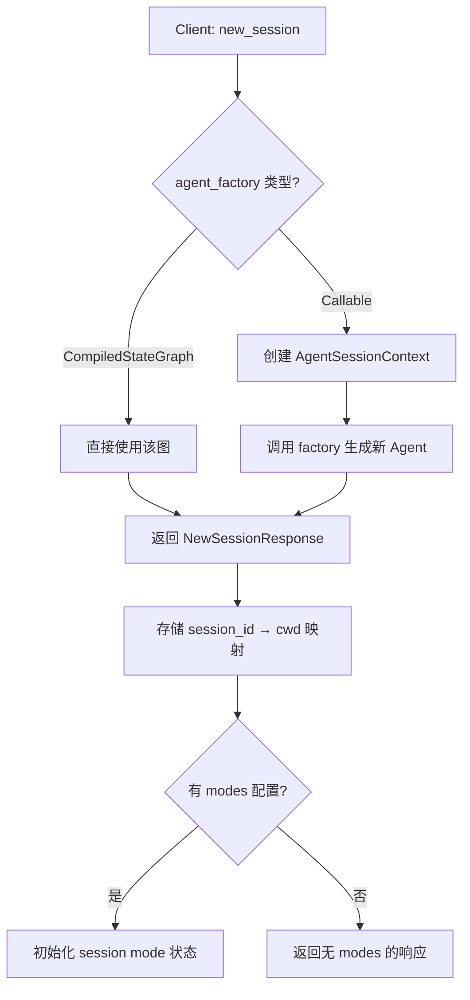
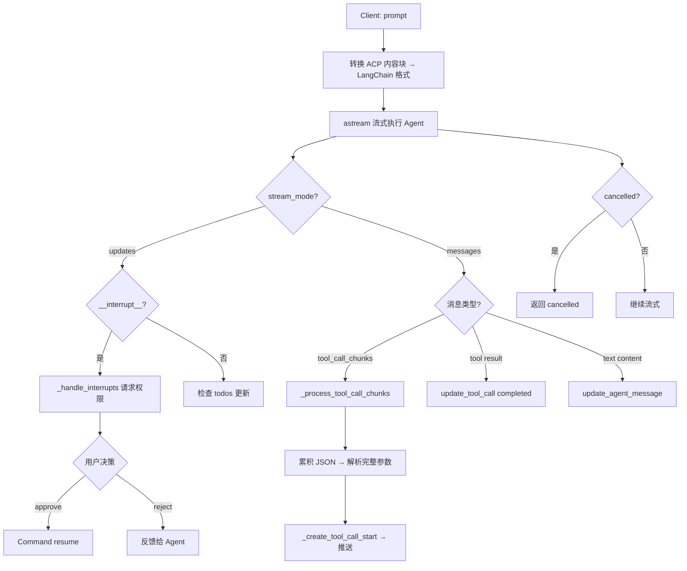

# PD-439.01 DeepAgents — ACP 标准化 Agent 通信服务器

> 文档编号：PD-439.01
> 来源：DeepAgents `libs/acp/deepagents_acp/server.py`
> GitHub：https://github.com/langchain-ai/deepagents.git
> 问题域：PD-439 Agent 通信协议 Agent Communication Protocol
> 状态：可复用方案

---

## 第 1 章 问题与动机

### 1.1 核心问题

Agent 系统需要与外部客户端（IDE、Web UI、CLI）进行标准化通信。传统做法是每个 Agent 框架自定义 HTTP/WebSocket API，导致：

1. **协议碎片化**：每个 Agent 框架的通信接口不同，客户端需要为每个框架写适配器
2. **会话管理缺失**：多轮对话的状态管理、中断恢复、取消操作没有统一规范
3. **工具调用不透明**：Agent 执行工具时，客户端无法实时感知进度和结果
4. **权限控制粗粒度**：要么全部自动执行，要么全部需要人工确认，缺乏细粒度控制
5. **多模态支持不一致**：文本、图片、音频、资源文件的传输格式各异

DeepAgents 通过实现 ACP（Agent Client Protocol）标准，将 LangGraph Agent 桥接到任何支持 ACP 的客户端（如 Zed 编辑器），解决了上述所有问题。

### 1.2 DeepAgents 的解法概述

1. **AgentServerACP 桥接层**：继承 `acp.Agent` 基类，将 LangGraph `CompiledStateGraph` 的流式输出转换为 ACP 协议事件（`server.py:81-618`）
2. **会话生命周期管理**：通过 `new_session` / `set_session_mode` / `cancel` 实现完整的会话创建、模式切换、取消流程（`server.py:136-177`）
3. **工具调用流式更新**：实时解析 LangGraph 的 `tool_call_chunks`，将工具启动、进度、完成事件推送给客户端（`server.py:269-418`）
4. **三级权限控制**：支持 approve_once / reject_once / approve_always 三种权限决策，并按命令签名粒度记忆已授权操作（`server.py:620-793`）
5. **多模态内容块转换**：将 ACP 的 5 种内容块（Text/Image/Audio/Resource/EmbeddedResource）转换为 LangChain 格式（`utils.py:18-98`）

### 1.3 设计思想

| 设计原则 | 具体实现 | 理由 | 替代方案 |
|----------|----------|------|----------|
| 协议标准化 | 实现 ACP 标准接口（`acp.Agent` 基类） | 一次实现，所有 ACP 客户端可用 | 自定义 REST/WebSocket API |
| 桥接模式 | `AgentServerACP` 作为 LangGraph ↔ ACP 的适配器 | 不侵入 Agent 核心逻辑 | 直接在 Agent 中嵌入通信代码 |
| 工厂模式 | 支持 `CompiledStateGraph` 或 `Callable[AgentSessionContext, CompiledStateGraph]` | 支持按会话模式动态创建 Agent | 单例 Agent 共享所有会话 |
| 命令签名权限 | `extract_command_types` 按命令+子命令粒度授权 | 防止 `approve_always` 过度授权 | 按工具名粗粒度授权 |
| 流式 chunk 累积 | `tool_call_accumulator` 按 index 累积 JSON 片段 | 处理 LLM 流式输出的不完整 JSON | 等待完整消息再处理 |

---

## 第 2 章 源码实现分析

### 2.1 架构概览

DeepAgents ACP 的核心是一个桥接层，将 LangGraph 的流式 Agent 执行转换为 ACP 协议事件：

```
┌─────────────────────────────────────────────────────────┐
│                    ACP Client (Zed IDE)                  │
│  prompt() ──→ session_update() ←── request_permission() │
└────────────────────────┬────────────────────────────────┘
                         │ ACP Protocol (stdio/SSE)
┌────────────────────────▼────────────────────────────────┐
│              AgentServerACP (server.py)                  │
│  ┌──────────┐  ┌──────────────┐  ┌───────────────────┐  │
│  │ Session  │  │ Tool Call    │  │ Permission        │  │
│  │ Manager  │  │ Streamer     │  │ Handler (HITL)    │  │
│  └──────────┘  └──────────────┘  └───────────────────┘  │
│  ┌──────────────────────────────────────────────────┐   │
│  │ Content Block Converter (utils.py)               │   │
│  │ Text | Image | Audio | Resource | EmbeddedRes    │   │
│  └──────────────────────────────────────────────────┘   │
└────────────────────────┬────────────────────────────────┘
                         │ LangGraph astream()
┌────────────────────────▼────────────────────────────────┐
│           LangGraph CompiledStateGraph                   │
│  ┌──────────┐  ┌──────────┐  ┌──────────────────────┐   │
│  │ Agent    │  │ Tools    │  │ HumanInTheLoop       │   │
│  │ Node     │  │ Node     │  │ Middleware            │   │
│  └──────────┘  └──────────┘  └──────────────────────┘   │
└─────────────────────────────────────────────────────────┘
```

### 2.2 核心实现

#### 2.2.1 会话创建与 Agent 工厂



对应源码 `libs/acp/deepagents_acp/server.py:86-156`：

```python
class AgentServerACP(ACPAgent):
    def __init__(
        self,
        agent: CompiledStateGraph | Callable[[AgentSessionContext], CompiledStateGraph],
        *,
        modes: SessionModeState | None = None,
    ) -> None:
        super().__init__()
        self._cwd = ""
        self._agent_factory = agent
        self._agent: CompiledStateGraph | None = None
        # 按会话跟踪模式、计划、工作目录、已授权命令
        self._session_modes: dict[str, str] = {}
        self._session_mode_states: dict[str, SessionModeState] = {}
        self._session_plans: dict[str, list[dict[str, Any]]] = {}
        self._session_cwds: dict[str, str] = {}
        self._allowed_command_types: dict[str, set[tuple[str, str | None]]] = {}

    async def new_session(
        self, cwd: str,
        mcp_servers: list[HttpMcpServer | SseMcpServer | McpServerStdio] | None = None,
        **kwargs: Any,
    ) -> NewSessionResponse:
        session_id = uuid4().hex
        self._session_cwds[session_id] = cwd
        if self._modes is not None:
            self._session_modes[session_id] = self._modes.current_mode_id
            self._session_mode_states[session_id] = self._modes
            return NewSessionResponse(session_id=session_id, modes=self._modes)
        return NewSessionResponse(session_id=session_id)
```

#### 2.2.2 流式 Prompt 处理与工具调用追踪



对应源码 `libs/acp/deepagents_acp/server.py:269-336`：

```python
async def _process_tool_call_chunks(
    self, session_id: str, message_chunk: Any,
    active_tool_calls: dict, tool_call_accumulator: dict,
) -> None:
    if (not isinstance(message_chunk, str)
        and hasattr(message_chunk, "tool_call_chunks")
        and message_chunk.tool_call_chunks):
        for chunk in message_chunk.tool_call_chunks:
            chunk_id = chunk.get("id")
            chunk_name = chunk.get("name")
            chunk_args = chunk.get("args", "")
            chunk_index = chunk.get("index", 0)
            # 按 index 累积 args JSON 片段
            is_new_tool_call = (
                chunk_index not in tool_call_accumulator
                or chunk_id != tool_call_accumulator[chunk_index].get("id")
            )
            if chunk_id and chunk_name and is_new_tool_call:
                tool_call_accumulator[chunk_index] = {
                    "id": chunk_id, "name": chunk_name, "args_str": "",
                }
            if chunk_args and chunk_index in tool_call_accumulator:
                tool_call_accumulator[chunk_index]["args_str"] += chunk_args
        # 尝试解析完整 JSON 并启动工具调用
        for _index, acc in list(tool_call_accumulator.items()):
            tool_id = acc.get("id")
            tool_name = acc.get("name")
            args_str = acc.get("args_str", "")
            if tool_id and tool_id not in active_tool_calls and args_str:
                try:
                    tool_args = json.loads(args_str)
                    active_tool_calls[tool_id] = {"name": tool_name, "args": tool_args}
                    update = self._create_tool_call_start(tool_id, tool_name, tool_args)
                    await self._conn.session_update(
                        session_id=session_id, update=update, source="DeepAgent",
                    )
                except json.JSONDecodeError:
                    pass  # JSON 尚不完整，继续累积
```

### 2.3 实现细节

#### 工具类型映射与 UI 展示

`_create_tool_call_start` 方法（`server.py:337-418`）将工具名映射为 ACP 的 `ToolKind` 枚举，并为每种工具生成友好的标题：

- `read_file` → kind=`read`，标题 `Read \`path\``
- `edit_file` → kind=`edit`，标题 `Edit \`path\``，附带 diff 内容
- `execute` → kind=`execute`，标题为实际命令
- 其他工具 → kind=`other`

#### 命令签名提取的安全设计

`extract_command_types`（`utils.py:101-272`）对敏感命令（python/node/npm/uv 等）提取完整签名而非仅基础命令名，防止 `approve_always` 过度授权：

- `python -m pytest` → 签名 `python -m pytest`（不会自动授权 `python -m pip`）
- `npm install` → 签名 `npm install`（不会自动授权 `npm run arbitrary-script`）
- `python -c 'code'` → 签名 `python -c`（不同代码内容共享同一签名）

#### 多模态内容块转换

`utils.py:18-98` 实现了 5 种 ACP 内容块到 LangChain 格式的转换：

| ACP 类型 | LangChain 输出 | 处理方式 |
|----------|---------------|----------|
| `TextContentBlock` | `{"type": "text", "text": ...}` | 直接映射 |
| `ImageContentBlock` | `{"type": "image_url", "image_url": {"url": "data:..."}}` | base64 data URI |
| `AudioContentBlock` | — | 抛出 `NotImplementedError` |
| `ResourceContentBlock` | `{"type": "text", "text": "[Resource: ...]"}` | 文本化，截断 root_dir |
| `EmbeddedResourceContentBlock` | `{"type": "text", "text": "[Embedded ...]"}` | 文本化或 base64 |

---

## 第 3 章 迁移指南

### 3.1 迁移清单

#### 阶段 1：基础 ACP 服务器（1-2 天）

- [ ] 安装 `agent-client-protocol>=0.8.0` 依赖
- [ ] 创建 `AgentServerACP` 子类，继承 `acp.Agent`
- [ ] 实现 `initialize()` 返回服务器能力声明
- [ ] 实现 `new_session()` 创建会话并分配 session_id
- [ ] 实现 `prompt()` 将用户输入转发给你的 Agent 并流式返回结果
- [ ] 用 `run_agent(server)` 启动 stdio 传输

#### 阶段 2：工具调用流式更新（1-2 天）

- [ ] 实现 `_process_tool_call_chunks()` 累积流式 JSON 片段
- [ ] 实现 `_create_tool_call_start()` 为不同工具类型生成友好标题
- [ ] 在工具执行完成时发送 `update_tool_call(status="completed")`

#### 阶段 3：权限控制（HITL）（1-2 天）

- [ ] 实现 `_handle_interrupts()` 处理 LangGraph interrupt
- [ ] 构建 `PermissionOption` 列表（approve/reject/approve_always）
- [ ] 实现命令签名提取和 `_allowed_command_types` 记忆机制
- [ ] 处理 `write_todos` 的计划审批流程

#### 阶段 4：多模态与高级功能（可选）

- [ ] 实现内容块转换器（Text/Image/Resource/EmbeddedResource）
- [ ] 添加会话模式（SessionModeState）支持
- [ ] 集成 MCP 服务器

### 3.2 适配代码模板

以下是一个最小可运行的 ACP Agent 服务器模板：

```python
"""Minimal ACP Agent Server — 可直接运行。"""
import asyncio
from dataclasses import dataclass
from typing import Any
from uuid import uuid4

from acp import (
    Agent as ACPAgent,
    InitializeResponse,
    NewSessionResponse,
    PromptResponse,
    run_agent,
    text_block,
    update_agent_message,
)
from acp.schema import (
    AgentCapabilities,
    PromptCapabilities,
    TextContentBlock,
)


@dataclass(frozen=True, slots=True)
class SessionContext:
    cwd: str
    session_id: str


class MyACPServer(ACPAgent):
    """将你的 Agent 桥接到 ACP 协议。"""

    def __init__(self, agent_factory):
        super().__init__()
        self._agent_factory = agent_factory
        self._sessions: dict[str, SessionContext] = {}

    def on_connect(self, conn):
        self._conn = conn

    async def initialize(self, protocol_version, **kwargs) -> InitializeResponse:
        return InitializeResponse(
            protocol_version=protocol_version,
            agent_capabilities=AgentCapabilities(
                prompt_capabilities=PromptCapabilities(image=True),
            ),
        )

    async def new_session(self, cwd, **kwargs) -> NewSessionResponse:
        session_id = uuid4().hex
        self._sessions[session_id] = SessionContext(cwd=cwd, session_id=session_id)
        return NewSessionResponse(session_id=session_id)

    async def prompt(self, prompt, session_id, **kwargs) -> PromptResponse:
        # 1. 提取文本
        text = ""
        for block in prompt:
            if isinstance(block, TextContentBlock):
                text += block.text

        # 2. 调用你的 Agent
        agent = self._agent_factory(self._sessions[session_id])
        response = await agent.run(text)

        # 3. 流式推送结果
        update = update_agent_message(text_block(response))
        await self._conn.session_update(
            session_id=session_id, update=update, source="MyAgent"
        )

        return PromptResponse(stop_reason="end_turn")


async def main():
    server = MyACPServer(agent_factory=lambda ctx: YourAgent(ctx))
    await run_agent(server)

if __name__ == "__main__":
    asyncio.run(main())
```

### 3.3 适用场景

| 场景 | 适用度 | 说明 |
|------|--------|------|
| IDE 集成（Zed/VS Code） | ⭐⭐⭐ | ACP 的核心场景，DeepAgents 已验证 Zed 集成 |
| 多 Agent 编排通信 | ⭐⭐ | ACP 面向 Client-Agent，Agent 间通信需额外协议 |
| Web UI 对接 | ⭐⭐⭐ | 通过 SSE 传输可直接对接 Web 前端 |
| CLI 工具集成 | ⭐⭐⭐ | stdio 传输天然适合 CLI 场景 |
| 移动端 Agent | ⭐ | ACP 目前主要面向桌面开发场景 |

---

## 第 4 章 测试用例

基于 DeepAgents 真实测试代码（`libs/acp/tests/test_agent.py`）的模式，以下是可复用的测试模板：

```python
"""ACP Agent Server 测试用例 — 基于 DeepAgents 测试模式。"""
import pytest
from typing import Any, Literal
from acp import text_block, update_agent_message
from acp.interfaces import Client
from acp.schema import (
    AllowedOutcome,
    PermissionOption,
    RequestPermissionResponse,
    TextContentBlock,
    ToolCallUpdate,
)


class FakeACPClient(Client):
    """模拟 ACP 客户端，记录所有事件。"""

    def __init__(self, *, permission_outcomes: list[Literal["approve", "reject"]] | None = None):
        self.events: list[dict[str, Any]] = []
        self.permission_outcomes = list(permission_outcomes or ["approve"])

    async def session_update(self, session_id: str, update: Any, source: str) -> None:
        self.events.append({
            "type": "session_update",
            "session_id": session_id,
            "update": update,
            "source": source,
        })

    async def request_permission(
        self, options, session_id, tool_call, **kwargs
    ) -> RequestPermissionResponse:
        self.events.append({
            "type": "request_permission",
            "session_id": session_id,
            "tool_call": tool_call,
        })
        outcome = self.permission_outcomes.pop(0) if self.permission_outcomes else "approve"
        return RequestPermissionResponse(
            outcome=AllowedOutcome(outcome="selected", option_id=outcome)
        )


class TestACPServerBasic:
    """基础功能测试。"""

    async def test_initialize_returns_capabilities(self, server):
        init = await server.initialize(protocol_version=1)
        assert init.agent_capabilities.prompt_capabilities.image is True

    async def test_new_session_returns_unique_id(self, server):
        s1 = await server.new_session(cwd="/tmp")
        s2 = await server.new_session(cwd="/tmp")
        assert s1.session_id != s2.session_id

    async def test_prompt_streams_text_response(self, server, client):
        session = await server.new_session(cwd="/tmp")
        resp = await server.prompt(
            [TextContentBlock(type="text", text="Hi")],
            session_id=session.session_id,
        )
        assert resp.stop_reason == "end_turn"
        # 验证至少有一个 session_update 事件
        assert any(e["type"] == "session_update" for e in client.events)

    async def test_cancel_stops_execution(self, server, client):
        session = await server.new_session(cwd="/tmp")
        await server.cancel(session_id=session.session_id)
        # cancel 后的 prompt 应返回 cancelled
        resp = await server.prompt(
            [TextContentBlock(type="text", text="Hi")],
            session_id=session.session_id,
        )
        assert resp.stop_reason in {"cancelled", "end_turn"}


class TestPermissionControl:
    """权限控制测试。"""

    async def test_hitl_requests_permission_for_write(self, hitl_server, client):
        session = await hitl_server.new_session(cwd="/tmp")
        resp = await hitl_server.prompt(
            [TextContentBlock(type="text", text="write a file")],
            session_id=session.session_id,
        )
        permission_requests = [e for e in client.events if e["type"] == "request_permission"]
        assert len(permission_requests) >= 1

    async def test_approve_always_remembers_command_type(self, hitl_server, client):
        """approve_always 应记住命令签名，后续相同命令自动通过。"""
        session = await hitl_server.new_session(cwd="/tmp")
        # 第一次需要权限
        # 第二次相同命令应自动通过
        assert session.session_id not in hitl_server._allowed_command_types


class TestCommandTypeExtraction:
    """命令签名提取测试 — 直接复用 DeepAgents 的测试逻辑。"""

    def test_sensitive_commands_include_subcommand(self):
        from deepagents_acp.utils import extract_command_types
        assert extract_command_types("python -m pytest") == ["python -m pytest"]
        assert extract_command_types("npm install") == ["npm install"]
        assert extract_command_types("uv run pytest") == ["uv run pytest"]

    def test_different_modules_are_different_types(self):
        from deepagents_acp.utils import extract_command_types
        assert extract_command_types("python -m pytest") != extract_command_types("python -m pip")

    def test_chained_commands_extract_all(self):
        from deepagents_acp.utils import extract_command_types
        assert extract_command_types("cd /path && npm install") == ["cd", "npm install"]


class TestContentBlockConversion:
    """多模态内容块转换测试。"""

    def test_text_block_conversion(self):
        from deepagents_acp.utils import convert_text_block_to_content_blocks
        result = convert_text_block_to_content_blocks(
            TextContentBlock(type="text", text="hello")
        )
        assert result == [{"type": "text", "text": "hello"}]

    def test_image_block_with_data(self):
        from acp.schema import ImageContentBlock
        from deepagents_acp.utils import convert_image_block_to_content_blocks
        result = convert_image_block_to_content_blocks(
            ImageContentBlock(type="image", mime_type="image/png", data="AAAA")
        )
        assert result[0]["type"] == "image_url"
        assert "data:image/png;base64,AAAA" in result[0]["image_url"]["url"]

    def test_resource_block_truncates_root_dir(self):
        from acp.schema import ResourceContentBlock
        from deepagents_acp.utils import convert_resource_block_to_content_blocks
        result = convert_resource_block_to_content_blocks(
            ResourceContentBlock(
                type="resource_link", name="file",
                uri="file:///root/subdir/file.txt",
                description=None, mime_type=None,
            ),
            root_dir="/root",
        )
        assert "subdir/file.txt" in result[0]["text"]
```

---

## 第 5 章 跨域关联

| 关联域 | 关系类型 | 说明 |
|--------|----------|------|
| PD-04 工具系统 | 依赖 | ACP 服务器需要将 Agent 的工具调用事件转换为 ACP 协议的 `ToolCallStart`/`ToolCallUpdate`，工具系统的设计直接影响 ACP 层的工具类型映射（`kind_map`） |
| PD-09 Human-in-the-Loop | 协同 | ACP 的 `request_permission` 机制是 HITL 的协议层实现，DeepAgents 通过 LangGraph 的 `interrupt()` + ACP 权限请求实现了完整的人机协作流程 |
| PD-01 上下文管理 | 协同 | ACP 会话的 `session_id` 与 LangGraph 的 `thread_id` 绑定，通过 `MemorySaver` checkpointer 实现跨轮次上下文持久化 |
| PD-10 中间件管道 | 协同 | `LocalContextMiddleware` 示例展示了如何在 ACP 会话中注入环境上下文（git 状态、项目结构等），中间件管道与 ACP 通信层正交但互补 |
| PD-05 沙箱隔离 | 依赖 | ACP 的 `cwd` 参数和 `CompositeBackend` 路由机制为 Agent 提供了工作目录隔离，`LocalShellBackend` vs `FilesystemBackend(virtual_mode=True)` 决定了隔离级别 |
| PD-02 多 Agent 编排 | 协同 | ACP 支持嵌套 Agent 调用（测试用例 `test_acp_agent_nested_agent_tool_call_returns_final_text`），外层 Agent 通过工具调用内层 Agent，ACP 只暴露外层的流式事件 |

---

## 第 6 章 来源文件索引

| 文件 | 行范围 | 关键实现 |
|------|--------|----------|
| `libs/acp/deepagents_acp/server.py` | L73-80 | `AgentSessionContext` 数据类 |
| `libs/acp/deepagents_acp/server.py` | L81-118 | `AgentServerACP.__init__` — 会话状态初始化 |
| `libs/acp/deepagents_acp/server.py` | L119-134 | `initialize()` — 服务器能力声明 |
| `libs/acp/deepagents_acp/server.py` | L136-156 | `new_session()` — 会话创建与模式初始化 |
| `libs/acp/deepagents_acp/server.py` | L158-173 | `set_session_mode()` — 会话模式切换 |
| `libs/acp/deepagents_acp/server.py` | L269-336 | `_process_tool_call_chunks()` — 流式工具调用累积 |
| `libs/acp/deepagents_acp/server.py` | L337-418 | `_create_tool_call_start()` — 工具类型映射与 UI 标题 |
| `libs/acp/deepagents_acp/server.py` | L432-618 | `prompt()` — 核心流式处理循环 |
| `libs/acp/deepagents_acp/server.py` | L620-793 | `_handle_interrupts()` — HITL 权限处理 |
| `libs/acp/deepagents_acp/utils.py` | L18-98 | 5 种内容块转换函数 |
| `libs/acp/deepagents_acp/utils.py` | L101-272 | `extract_command_types()` — 命令签名提取 |
| `libs/acp/deepagents_acp/utils.py` | L278-331 | `truncate_execute_command_for_display()` / `format_execute_result()` |
| `libs/acp/examples/demo_agent.py` | L24-39 | `_get_interrupt_config()` — 三种权限模式配置 |
| `libs/acp/examples/demo_agent.py` | L42-104 | `_serve_example_agent()` — 完整 Agent 工厂 + 模式配置 |
| `libs/acp/examples/local_context.py` | L350-511 | `LocalContextMiddleware` — 环境上下文注入中间件 |
| `libs/acp/tests/test_agent.py` | L37-77 | `FakeACPClient` — 测试用模拟客户端 |
| `libs/acp/tests/test_agent.py` | L469-528 | `test_acp_agent_hitl_approve_always_execute_auto_approves_next_time` |
| `libs/acp/tests/test_command_allowlist.py` | L12-133 | `TestExtractCommandTypes` — 命令签名提取完整测试 |

---

## 第 7 章 横向对比维度

```json comparison_data
{
  "project": "DeepAgents",
  "dimensions": {
    "协议标准": "ACP（Agent Client Protocol）标准，agent-client-protocol>=0.8.0",
    "传输方式": "stdio + SSE 双传输，支持 Zed IDE 和 Web 客户端",
    "会话管理": "uuid4 session_id + 模式切换（ask_before_edits/accept_edits/accept_everything）",
    "权限控制": "三级决策（approve_once/reject_once/approve_always）+ 命令签名粒度记忆",
    "多模态支持": "Text/Image/Resource/EmbeddedResource 四种内容块转换（Audio 未实现）",
    "工具调用透明度": "流式 chunk 累积 + ToolKind 分类（read/edit/execute/search/other）",
    "中断恢复": "LangGraph interrupt() + Command(resume=decisions) 循环恢复"
  }
}
```

### 域元数据补充

```json domain_metadata
{
  "solution_summary": "DeepAgents 通过 AgentServerACP 桥接层将 LangGraph Agent 接入 ACP 标准协议，实现流式工具调用追踪、三级权限控制（命令签名粒度）和多模态内容块转换",
  "description": "Agent 与外部客户端（IDE/Web/CLI）的标准化通信桥接",
  "sub_problems": [
    "命令签名粒度的权限记忆与过度授权防护",
    "流式 JSON chunk 累积与不完整参数处理",
    "会话模式动态切换与 Agent 实例重建"
  ],
  "best_practices": [
    "按命令+子命令粒度提取签名防止 approve_always 过度授权",
    "用工厂模式支持按会话模式动态创建不同配置的 Agent 实例",
    "工具调用 chunk 累积时用 try/except JSONDecodeError 容忍不完整片段"
  ]
}
```
