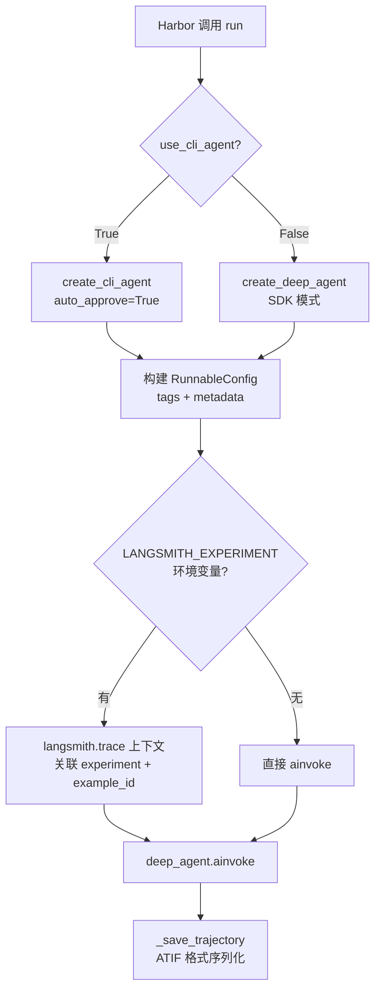
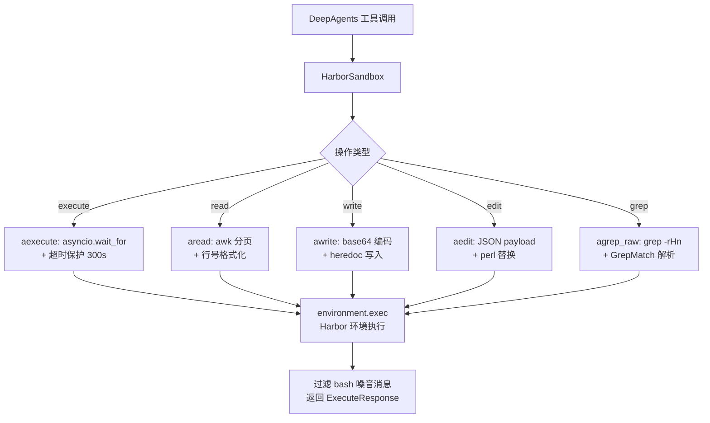
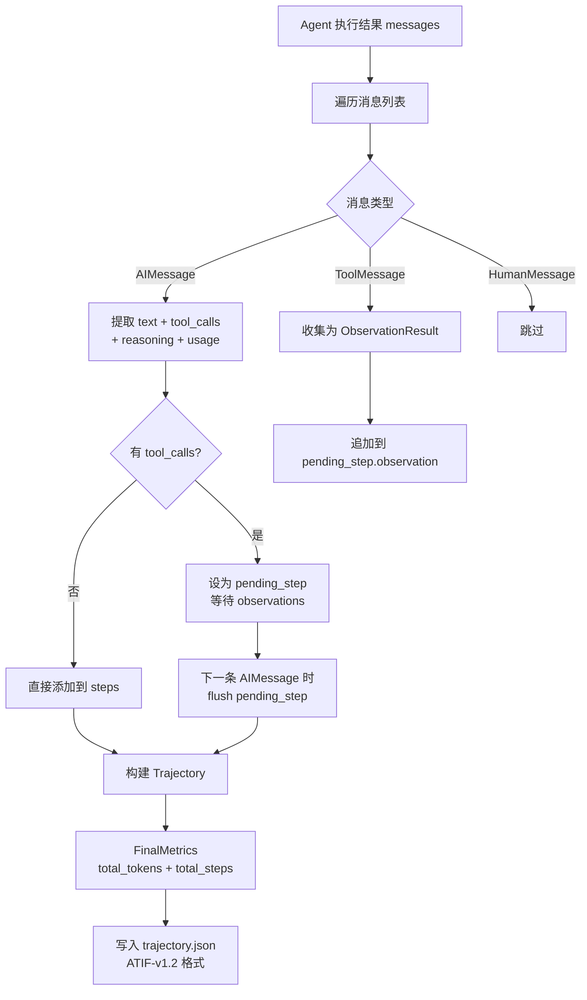

# PD-440.01 DeepAgents — Harbor Agent 评估框架

> 文档编号：PD-440.01
> 来源：DeepAgents `libs/harbor/deepagents_harbor/`
> GitHub：https://github.com/langchain-ai/deepagents.git
> 问题域：PD-440 Agent 评估框架 Agent Evaluation Framework
> 状态：可复用方案

---

## 第 1 章 问题与动机

### 1.1 核心问题

Agent 系统开发面临一个根本性挑战：如何系统化地评估 Agent 在真实任务上的表现？

传统软件测试（单元测试、集成测试）无法覆盖 Agent 的核心能力维度——工具选择是否正确、执行步骤是否高效、面对错误能否恢复。Agent 的输出是非确定性的，同一任务可能有多种正确解法，传统的"预期输出 == 实际输出"断言模式失效。

DeepAgents 的 harbor 模块解决的是：**如何将 Agent 接入标准化评估基准（benchmark），并通过可观测性平台追踪每次评估运行的全链路数据**。

### 1.2 DeepAgents 的解法概述

1. **Wrapper 适配层**：`DeepAgentsWrapper` 继承 Harbor 框架的 `BaseAgent`，将 DeepAgents SDK/CLI Agent 适配为 Harbor 可执行的标准接口（`libs/harbor/deepagents_harbor/deepagents_wrapper.py:66`）
2. **沙箱后端桥接**：`HarborSandbox` 实现 `SandboxBackendProtocol`，将 Harbor 的 Docker/Modal/Daytona 环境桥接为 DeepAgents 的文件操作和命令执行后端（`libs/harbor/deepagents_harbor/backend.py:34`）
3. **LangSmith 追踪集成**：通过 `langsmith.trace` 上下文管理器将评估运行链接到 LangSmith 实验，支持 dataset → experiment → feedback 的完整评估闭环（`libs/harbor/deepagents_harbor/deepagents_wrapper.py:257-268`）
4. **ATIF 轨迹记录**：将 Agent 执行过程序列化为 ATIF（Agent Trajectory Interchange Format）标准格式，记录每步的工具调用、观察结果和 token 用量（`libs/harbor/deepagents_harbor/deepagents_wrapper.py:282-397`）
5. **确定性 Example ID**：通过 SHA-256 哈希从 instruction 生成确定性 UUID，确保跨运行的评估样本可追踪（`libs/harbor/deepagents_harbor/tracing.py:7-32`）

### 1.3 设计思想

| 设计原则 | 具体实现 | 理由 | 替代方案 |
|----------|----------|------|----------|
| 适配器模式隔离评估逻辑 | `DeepAgentsWrapper(BaseAgent)` 封装 Agent 实例 | Agent 核心代码不感知评估框架，评估逻辑独立演进 | 直接在 Agent 中嵌入评估代码（耦合度高） |
| 协议驱动的后端抽象 | `HarborSandbox(SandboxBackendProtocol)` 桥接环境 | 同一 Agent 可在 Docker/Modal/Daytona 等不同沙箱中评估 | 为每种环境写独立 Agent（重复代码） |
| 确定性 ID 映射 | SHA-256(seed + instruction) → UUID | 跨运行可追踪同一评估样本，无需外部 ID 注册表 | 随机 UUID（无法跨运行关联） |
| 优雅降级 | LangSmith 不可用时静默跳过追踪 | 评估运行不因可观测性故障而中断 | 强依赖 LangSmith（单点故障） |
| 双模式 Agent 创建 | `use_cli_agent` 开关切换 CLI/SDK 模式 | 同一评估框架可对比不同 Agent 实现的表现 | 为每种模式写独立 Wrapper |

---

## 第 2 章 源码实现分析

### 2.1 架构概览

DeepAgents 的评估架构分为三层：Harbor 评估框架（外部）→ Wrapper 适配层（桥接）→ DeepAgents Agent（核心）。

```
┌─────────────────────────────────────────────────────────────────┐
│                    Harbor 评估框架（外部）                        │
│  ┌──────────┐  ┌──────────────┐  ┌───────────────────────────┐ │
│  │ Registry │  │ Environment  │  │ Verifier (test + reward)  │ │
│  │ (数据集)  │  │ (Docker/     │  │ (0.0-1.0 评分)            │ │
│  │          │  │  Modal/...)   │  │                           │ │
│  └────┬─────┘  └──────┬───────┘  └───────────────────────────┘ │
│       │               │                                         │
├───────┼───────────────┼─────────────────────────────────────────┤
│       │    Wrapper 适配层 (deepagents_harbor)                    │
│  ┌────▼─────────────────▼──────────────────────────────────┐    │
│  │           DeepAgentsWrapper(BaseAgent)                   │    │
│  │  ┌─────────────┐  ┌──────────────┐  ┌───────────────┐  │    │
│  │  │ HarborSandbox│  │ LangSmith    │  │ ATIF Trajectory│  │    │
│  │  │ (后端桥接)   │  │ trace 集成   │  │ 序列化         │  │    │
│  │  └──────┬──────┘  └──────────────┘  └───────────────┘  │    │
│  └─────────┼──────────────────────────────────────────────┘    │
│            │                                                    │
├────────────┼────────────────────────────────────────────────────┤
│            │     DeepAgents Core                                │
│  ┌─────────▼──────────────────────────────────────────────┐    │
│  │  create_deep_agent() / create_cli_agent()              │    │
│  │  ┌──────────┐  ┌────────────┐  ┌──────────────────┐   │    │
│  │  │ LangGraph │  │ Middleware │  │ Tools (fs/bash)  │   │    │
│  │  │ StateGraph│  │ (memory,   │  │                  │   │    │
│  │  │          │  │  planning)  │  │                  │   │    │
│  │  └──────────┘  └────────────┘  └──────────────────┘   │    │
│  └────────────────────────────────────────────────────────┘    │
└─────────────────────────────────────────────────────────────────┘
```

### 2.2 核心实现

#### 2.2.1 DeepAgentsWrapper — Agent 评估适配器



对应源码 `libs/harbor/deepagents_harbor/deepagents_wrapper.py:179-280`：

```python
async def run(
    self,
    instruction: str,
    environment: BaseEnvironment,
    context: AgentContext,
) -> None:
    configuration = json.loads(environment.trial_paths.config_path.read_text())
    backend = HarborSandbox(environment)

    # 双模式 Agent 创建
    if self._use_cli_agent:
        harbor_system_prompt = await self._get_formatted_system_prompt(backend)
        deep_agent, _ = create_cli_agent(
            model=self._model,
            assistant_id=environment.session_id,
            sandbox=backend,
            system_prompt=harbor_system_prompt,
            auto_approve=True,       # 评估模式跳过 HITL
            enable_memory=False,
            enable_skills=False,
            enable_shell=False,       # 沙箱提供执行能力
        )
    else:
        system_prompt = await self._get_formatted_system_prompt(backend)
        deep_agent = create_deep_agent(
            model=self._model, backend=backend, system_prompt=system_prompt
        )

    # LangSmith 实验追踪
    example_id = self._instruction_to_example_id.get(instruction)
    langsmith_experiment_name = os.environ.get("LANGSMITH_EXPERIMENT", "").strip() or None

    if langsmith_experiment_name:
        with trace(
            name=environment.session_id,
            reference_example_id=example_id,
            inputs={"instruction": instruction},
            project_name=langsmith_experiment_name,
            metadata=metadata,
        ) as run_tree:
            result = await deep_agent.ainvoke(
                {"messages": [{"role": "user", "content": instruction}]},
                config=config,
            )
            last_message = result["messages"][-1]
            if isinstance(last_message, AIMessage):
                run_tree.end(outputs={"last_message": last_message.text})
    else:
        result = await deep_agent.ainvoke(...)

    self._save_trajectory(environment, instruction, result)
```

#### 2.2.2 HarborSandbox — 沙箱后端桥接



对应源码 `libs/harbor/deepagents_harbor/backend.py:34-120`：

```python
class HarborSandbox(SandboxBackendProtocol):
    def __init__(self, environment: BaseEnvironment) -> None:
        self.environment = environment

    async def aexecute(
        self, command: str, *, timeout: int | None = None,
    ) -> ExecuteResponse:
        timeout_sec = timeout if timeout is not None else DEFAULT_COMMAND_TIMEOUT_SEC
        try:
            if timeout_sec > 0:
                result = await asyncio.wait_for(
                    self.environment.exec(command), timeout=timeout_sec,
                )
            else:
                result = await self.environment.exec(command)
        except asyncio.TimeoutError:
            return ExecuteResponse(
                output=f"ERROR: Command timed out after {timeout_sec} seconds.\n...",
                exit_code=124, truncated=False,
            )

        # 过滤 Harbor 环境中的 bash 噪音消息
        error_messages = [
            "bash: cannot set terminal process group (-1): Inappropriate ioctl for device",
            "bash: no job control in this shell",
            ...
        ]
        # ... 清理 stdout/stderr 并返回
```

#### 2.2.3 ATIF 轨迹序列化



对应源码 `libs/harbor/deepagents_harbor/deepagents_wrapper.py:282-397`：

```python
def _save_trajectory(self, environment, instruction, result) -> None:
    total_prompt_tokens = 0
    total_completion_tokens = 0
    steps = [Step(step_id=1, timestamp=..., source="user", message=instruction)]
    observations = []
    pending_step = None

    for msg in result["messages"]:
        if isinstance(msg, AIMessage):
            usage = msg.usage_metadata
            if usage:
                total_prompt_tokens += usage["input_tokens"]
                total_completion_tokens += usage["output_tokens"]
            # flush pending step with collected observations
            if pending_step is not None:
                if pending_step.tool_calls and observations:
                    pending_step.observation = Observation(results=observations)
                    observations = []
                steps.append(pending_step)
            # extract content blocks: text, reasoning, tool_call
            for cb in msg.content_blocks:
                if cb["type"] == "tool_call":
                    atf_tool_calls.append(ToolCall(...))
            # ...
        elif isinstance(msg, ToolMessage):
            observations.append(ObservationResult(
                source_call_id=msg.tool_call_id, content=str(msg.content),
            ))

    trajectory = Trajectory(
        schema_version="ATIF-v1.2",
        session_id=environment.session_id,
        agent=Agent(name="deepagent-harbor", version="0.0.1", ...),
        steps=steps, final_metrics=metrics,
    )
    trajectory_path.write_text(json.dumps(trajectory.to_json_dict(), indent=2))
```

### 2.3 实现细节

**评估数据流全链路：**

```
harbor_langsmith.py create-dataset
  → 下载 Harbor Registry 任务集
  → 读取 instruction.md + task.toml + solution/solve.sh
  → SHA-256(instruction) → 确定性 example_id
  → 上传到 LangSmith Dataset

harbor run --agent-import-path deepagents_harbor:DeepAgentsWrapper
  → Harbor 为每个 task 创建沙箱环境
  → DeepAgentsWrapper.run(instruction, environment)
  → Agent 在沙箱中执行任务
  → 轨迹写入 trajectory.json (ATIF-v1.2)
  → Harbor Verifier 运行测试 → reward (0.0-1.0)

harbor_langsmith.py add-feedback
  → 扫描 job 目录中的 trial 结果
  → 匹配 LangSmith trace → 添加 harbor_reward feedback

scripts/analyze.py
  → 扫描 trial 目录 → 统计成功率/工具使用
  → 对失败 trial 用 DeepAgent 做根因分析
```

**确定性 Example ID 机制**（`libs/harbor/deepagents_harbor/tracing.py:7-32`）：

```python
def create_example_id_from_instruction(instruction: str, seed: int = 42) -> str:
    normalized = instruction.strip()
    seeded_data = seed.to_bytes(8, byteorder="big") + normalized.encode("utf-8")
    hash_bytes = hashlib.sha256(seeded_data).digest()
    example_uuid = uuid.UUID(bytes=hash_bytes[:16])
    return str(example_uuid)
```

这个设计确保：同一 instruction 在不同运行中生成相同的 UUID，使得 LangSmith 可以跨实验关联同一评估样本的不同运行结果。seed 参数防止与已有 example 的 ID 冲突。

**Eval 测试框架**（`libs/deepagents/tests/evals/`）：

SDK 层面的评估使用 `TrajectoryExpectations` 数据类定义期望行为（`libs/deepagents/tests/evals/utils.py:55-112`），支持：
- `num_agent_steps`：精确的 Agent 步数断言
- `num_tool_call_requests`：精确的工具调用次数断言
- `require_tool_call(step, name, args_contains)`：特定步骤的工具调用断言
- `require_final_text_contains(text)`：最终输出文本包含断言

所有断言结果通过 `langsmith.testing.log_feedback` 上报到 LangSmith，实现评估指标的持久化和可视化。


---

## 第 3 章 迁移指南

### 3.1 迁移清单

**阶段 1：评估 Wrapper 适配（核心）**

- [ ] 定义你的 Agent 的 `BaseAgent` 适配器类
- [ ] 实现 `run(instruction, environment, context)` 方法
- [ ] 将你的 Agent 后端适配为 `SandboxBackendProtocol`
- [ ] 实现 `aexecute()` 方法桥接沙箱命令执行
- [ ] 实现 `aread()`/`awrite()`/`aedit()` 文件操作桥接

**阶段 2：追踪集成**

- [ ] 集成 LangSmith `trace()` 上下文管理器
- [ ] 实现确定性 Example ID 生成（SHA-256 哈希）
- [ ] 在 `__init__` 中构建 instruction → example_id 映射
- [ ] 添加 `LANGSMITH_EXPERIMENT` 环境变量支持

**阶段 3：轨迹记录**

- [ ] 实现 ATIF 格式的轨迹序列化
- [ ] 记录每步的工具调用、观察结果、token 用量
- [ ] 输出 `trajectory.json` 到 logs 目录

**阶段 4：评估闭环**

- [ ] 编写 dataset 创建脚本（Harbor Registry → LangSmith Dataset）
- [ ] 编写 feedback 回写脚本（Harbor reward → LangSmith feedback）
- [ ] 编写失败分析脚本（trajectory → LLM 根因分析）

### 3.2 适配代码模板

#### 评估 Wrapper 模板

```python
"""评估 Wrapper 模板 — 将你的 Agent 适配为 Harbor 可评估的标准接口。"""

import json
import os
import uuid
from typing import Any

from harbor.agents.base import BaseAgent
from harbor.environments.base import BaseEnvironment
from harbor.models.agent.context import AgentContext
from langsmith import trace


class MyAgentWrapper(BaseAgent):
    """将你的 Agent 适配为 Harbor 评估接口。"""

    def __init__(self, logs_dir, model_name=None, **kwargs):
        super().__init__(logs_dir, model_name, **kwargs)
        self._model_name = model_name or "default-model"
        # 构建 instruction → example_id 映射（可选，用于 LangSmith 实验关联）
        self._instruction_to_example_id: dict[str, str] = {}

    @staticmethod
    def name() -> str:
        return "my-agent-harbor"

    def version(self) -> str | None:
        return "0.1.0"

    async def setup(self, environment: BaseEnvironment) -> None:
        """初始化环境（如预装依赖等）。"""
        pass

    async def run(
        self,
        instruction: str,
        environment: BaseEnvironment,
        context: AgentContext,
    ) -> None:
        # 1. 创建沙箱后端
        backend = MySandboxBackend(environment)

        # 2. 创建你的 Agent 实例
        agent = create_my_agent(backend=backend)

        # 3. 构建运行配置
        config = {
            "run_name": environment.session_id,
            "tags": [self._model_name, environment.session_id],
            "configurable": {"thread_id": str(uuid.uuid4())},
        }

        # 4. 可选：LangSmith 实验追踪
        experiment_name = os.environ.get("LANGSMITH_EXPERIMENT", "").strip() or None
        example_id = self._instruction_to_example_id.get(instruction)

        if experiment_name:
            with trace(
                name=environment.session_id,
                reference_example_id=example_id,
                inputs={"instruction": instruction},
                project_name=experiment_name,
            ) as run_tree:
                result = await agent.ainvoke(
                    {"messages": [{"role": "user", "content": instruction}]},
                    config=config,
                )
                run_tree.end(outputs={"result": str(result)})
        else:
            result = await agent.ainvoke(
                {"messages": [{"role": "user", "content": instruction}]},
                config=config,
            )

        # 5. 保存轨迹
        self._save_trajectory(environment, instruction, result)
```

#### 确定性 Example ID 生成模板

```python
"""确定性 Example ID — 确保跨运行的评估样本可追踪。"""

import hashlib
import uuid


def create_example_id(instruction: str, seed: int = 42) -> str:
    """从 instruction 生成确定性 UUID，用于 LangSmith 样本关联。"""
    normalized = instruction.strip()
    seeded_data = seed.to_bytes(8, byteorder="big") + normalized.encode("utf-8")
    hash_bytes = hashlib.sha256(seeded_data).digest()
    return str(uuid.UUID(bytes=hash_bytes[:16]))
```

### 3.3 适用场景

| 场景 | 适用度 | 说明 |
|------|--------|------|
| Agent 基准测试（SWE-bench, Terminal Bench 等） | ⭐⭐⭐ | 核心场景，Harbor 原生支持多种 benchmark |
| Agent 回归测试（CI/CD 集成） | ⭐⭐⭐ | TrajectoryExpectations 模式适合自动化回归 |
| Agent A/B 对比实验 | ⭐⭐⭐ | LangSmith experiment 支持 side-by-side 对比 |
| 单次 Agent 调试 | ⭐⭐ | 轨迹记录有用，但 Harbor 框架偏重批量评估 |
| 非 LLM Agent 评估 | ⭐ | 架构假设 LLM 消息格式（AIMessage/ToolMessage） |

---

## 第 4 章 测试用例

```python
"""基于 DeepAgents 评估框架的测试用例模板。"""

import hashlib
import json
import uuid
from dataclasses import dataclass
from typing import Any
from unittest.mock import AsyncMock, MagicMock, patch

import pytest


# ============================================================
# 测试 1：确定性 Example ID 生成
# ============================================================

class TestCreateExampleId:
    def test_deterministic_same_input(self):
        """同一 instruction 生成相同 UUID。"""
        from deepagents_harbor.tracing import create_example_id_from_instruction

        id1 = create_example_id_from_instruction("Read /foo.md and tell me the content.")
        id2 = create_example_id_from_instruction("Read /foo.md and tell me the content.")
        assert id1 == id2
        # 验证是合法 UUID
        uuid.UUID(id1)

    def test_different_input_different_id(self):
        """不同 instruction 生成不同 UUID。"""
        from deepagents_harbor.tracing import create_example_id_from_instruction

        id1 = create_example_id_from_instruction("Task A")
        id2 = create_example_id_from_instruction("Task B")
        assert id1 != id2

    def test_whitespace_normalization(self):
        """前后空白被 strip 后结果一致。"""
        from deepagents_harbor.tracing import create_example_id_from_instruction

        id1 = create_example_id_from_instruction("  hello  ")
        id2 = create_example_id_from_instruction("hello")
        assert id1 == id2

    def test_different_seed_different_id(self):
        """不同 seed 生成不同 UUID。"""
        from deepagents_harbor.tracing import create_example_id_from_instruction

        id1 = create_example_id_from_instruction("same", seed=42)
        id2 = create_example_id_from_instruction("same", seed=99)
        assert id1 != id2


# ============================================================
# 测试 2：TrajectoryExpectations 断言框架
# ============================================================

class TestTrajectoryExpectations:
    """测试评估断言框架的链式 API。"""

    def test_require_tool_call_chain(self):
        """链式添加多个工具调用期望。"""
        from tests.evals.utils import TrajectoryExpectations

        expect = (
            TrajectoryExpectations(num_agent_steps=3, num_tool_call_requests=2)
            .require_tool_call(step=1, name="read_file", args_contains={"file_path": "/a.md"})
            .require_tool_call(step=2, name="write_file", args_contains={"file_path": "/b.md"})
            .require_final_text_contains("done")
        )
        assert len(expect.tool_calls) == 2
        assert len(expect.final_text_contains) == 1

    def test_step_must_be_positive(self):
        """step 参数必须为正数。"""
        from tests.evals.utils import TrajectoryExpectations

        with pytest.raises(ValueError, match="step must be positive"):
            TrajectoryExpectations().require_tool_call(step=0, name="read_file")


# ============================================================
# 测试 3：HarborSandbox 超时保护
# ============================================================

class TestHarborSandboxTimeout:
    @pytest.mark.asyncio
    async def test_command_timeout_returns_error(self):
        """命令超时返回 exit_code=124 和错误提示。"""
        mock_env = AsyncMock()
        mock_env.exec = AsyncMock(side_effect=lambda cmd: asyncio.sleep(10))

        from deepagents_harbor.backend import HarborSandbox
        import asyncio

        sandbox = HarborSandbox(mock_env)
        result = await sandbox.aexecute("sleep 100", timeout=0.01)

        assert result.exit_code == 124
        assert "timed out" in result.output

    @pytest.mark.asyncio
    async def test_bash_noise_filtered(self):
        """Harbor 环境的 bash 噪音消息被过滤。"""
        mock_env = AsyncMock()
        mock_result = MagicMock()
        mock_result.stdout = "actual output\nbash: no job control in this shell"
        mock_result.stderr = ""
        mock_result.return_code = 0
        mock_env.exec = AsyncMock(return_value=mock_result)

        from deepagents_harbor.backend import HarborSandbox

        sandbox = HarborSandbox(mock_env)
        result = await sandbox.aexecute("echo hello")

        assert "actual output" in result.output
        # bash 噪音被移到 stderr 或过滤
        assert "no job control" not in result.output.split("\n")[0]


# ============================================================
# 测试 4：ATIF 轨迹序列化
# ============================================================

class TestATIFTrajectory:
    def test_trajectory_schema_version(self):
        """轨迹输出包含正确的 schema 版本。"""
        # 模拟 _save_trajectory 的输出
        trajectory = {
            "schema_version": "ATIF-v1.2",
            "session_id": "test-session",
            "agent": {
                "name": "deepagent-harbor",
                "version": "0.0.1",
                "model_name": "anthropic:claude-sonnet-4-5-20250929",
            },
            "steps": [
                {"step_id": 1, "source": "user", "message": "test instruction"},
                {"step_id": 2, "source": "agent", "message": "response",
                 "tool_calls": [{"tool_call_id": "tc1", "function_name": "read_file",
                                 "arguments": {"file_path": "/test.md"}}]},
            ],
            "final_metrics": {
                "total_prompt_tokens": 100,
                "total_completion_tokens": 50,
                "total_steps": 2,
            },
        }
        assert trajectory["schema_version"] == "ATIF-v1.2"
        assert trajectory["agent"]["name"] == "deepagent-harbor"
        assert len(trajectory["steps"]) == 2
        assert trajectory["steps"][1]["tool_calls"][0]["function_name"] == "read_file"
```


---

## 第 5 章 跨域关联

| 关联域 | 关系类型 | 说明 |
|--------|----------|------|
| PD-04 工具系统 | 依赖 | 评估框架通过 `SandboxBackendProtocol` 桥接工具系统，Agent 的工具调用在沙箱中执行并被轨迹记录 |
| PD-05 沙箱隔离 | 依赖 | Harbor 提供 Docker/Modal/Daytona 等沙箱环境，评估 Wrapper 通过 `HarborSandbox` 桥接沙箱执行 |
| PD-11 可观测性 | 协同 | LangSmith 追踪集成是评估框架的核心组成部分，评估指标（reward、tool_usage、token_count）通过 LangSmith feedback 持久化 |
| PD-01 上下文管理 | 协同 | 评估中的 system prompt 注入环境上下文（工作目录、文件列表），`_get_formatted_system_prompt` 动态构建上下文 |
| PD-09 Human-in-the-Loop | 互斥 | 评估模式下 `auto_approve=True` 跳过 HITL，确保评估可自动化运行 |
| PD-03 容错与重试 | 协同 | `HarborSandbox.aexecute` 的超时保护（300s）和 bash 噪音过滤是评估环境中的容错机制 |

---

## 第 6 章 来源文件索引

| 文件 | 行范围 | 关键实现 |
|------|--------|----------|
| `libs/harbor/deepagents_harbor/__init__.py` | L1-10 | 模块入口，导出 DeepAgentsWrapper 和 HarborSandbox |
| `libs/harbor/deepagents_harbor/deepagents_wrapper.py` | L66-107 | DeepAgentsWrapper 类定义和初始化（LangSmith 映射构建） |
| `libs/harbor/deepagents_harbor/deepagents_wrapper.py` | L141-177 | 动态 system prompt 构建（环境上下文注入） |
| `libs/harbor/deepagents_harbor/deepagents_wrapper.py` | L179-280 | run() 核心方法：双模式 Agent 创建 + LangSmith 追踪 |
| `libs/harbor/deepagents_harbor/deepagents_wrapper.py` | L282-397 | ATIF 轨迹序列化（消息遍历 + Step/ToolCall/Observation 构建） |
| `libs/harbor/deepagents_harbor/backend.py` | L34-119 | HarborSandbox 类：aexecute 超时保护 + bash 噪音过滤 |
| `libs/harbor/deepagents_harbor/backend.py` | L135-168 | aread：awk 分页读取 + 行号格式化 |
| `libs/harbor/deepagents_harbor/backend.py` | L179-213 | awrite：base64 编码 + heredoc 写入 |
| `libs/harbor/deepagents_harbor/backend.py` | L223-318 | aedit：JSON payload + perl 字符串替换 |
| `libs/harbor/deepagents_harbor/tracing.py` | L7-32 | 确定性 Example ID 生成（SHA-256 → UUID） |
| `libs/harbor/scripts/harbor_langsmith.py` | L40-158 | Dataset 创建：Harbor Registry → LangSmith Dataset |
| `libs/harbor/scripts/harbor_langsmith.py` | L165-259 | Experiment 创建：LangSmith session 管理 |
| `libs/harbor/scripts/harbor_langsmith.py` | L267-396 | Feedback 回写：Harbor reward → LangSmith feedback |
| `libs/harbor/scripts/analyze.py` | L85-105 | Trial 数据模型（status/reward/trajectory/solution） |
| `libs/harbor/scripts/analyze.py` | L175-202 | 工具使用统计（遍历 ATIF 轨迹中的 tool_calls） |
| `libs/harbor/scripts/analyze.py` | L446-539 | 失败分析 prompt（ANALYSIS_PROMPT，指导 LLM 做根因分析） |
| `libs/harbor/scripts/analyze.py` | L542-601 | LLM 驱动的失败 trial 根因分析 |
| `libs/deepagents/deepagents/backends/protocol.py` | L167-179 | BackendProtocol 基类定义 |
| `libs/deepagents/deepagents/backends/protocol.py` | L437-513 | SandboxBackendProtocol：execute/aexecute 接口 |
| `libs/deepagents/tests/evals/utils.py` | L55-112 | TrajectoryExpectations：评估断言数据类 |
| `libs/deepagents/tests/evals/utils.py` | L266-301 | run_agent：评估运行入口（invoke + log + assert） |
| `libs/deepagents/tests/evals/conftest.py` | L1-29 | 评估 pytest 配置（--model 参数化） |
| `libs/deepagents/tests/evals/test_file_operations.py` | L1-383 | 文件操作评估用例（14 个场景） |
| `libs/harbor/pyproject.toml` | L1-30 | Harbor 包配置（依赖、版本、构建） |
| `libs/harbor/README.md` | L1-163 | Harbor 集成文档（架构、快速开始、LangSmith 工作流） |

---

## 第 7 章 横向对比维度

```json comparison_data
{
  "project": "DeepAgents",
  "dimensions": {
    "评估架构": "Wrapper 适配器模式，BaseAgent 接口 + SandboxBackendProtocol 桥接",
    "追踪集成": "LangSmith trace 上下文管理器，支持 experiment/dataset/feedback 闭环",
    "轨迹格式": "ATIF-v1.2 标准格式，含 Step/ToolCall/Observation/FinalMetrics",
    "沙箱支持": "Docker/Modal/Daytona/Runloop 四种环境，通过 Harbor 统一抽象",
    "断言框架": "TrajectoryExpectations 链式 API，支持步数/工具调用/输出文本断言",
    "失败分析": "LLM 驱动的根因分析，对比 reference solution 识别失败模式"
  }
}
```

### 域元数据补充

```json domain_metadata
{
  "solution_summary": "DeepAgents 用 Wrapper 适配器 + HarborSandbox 桥接将 Agent 接入 Harbor 评估框架，通过 LangSmith trace 实现 dataset→experiment→feedback 评估闭环，ATIF 格式记录完整执行轨迹",
  "description": "Agent 评估需要标准化的沙箱环境、轨迹记录格式和可观测性集成来形成改进闭环",
  "sub_problems": [
    "评估结果到 LangSmith 的 feedback 回写",
    "LLM 驱动的失败 trial 根因分析",
    "跨运行评估样本的确定性关联"
  ],
  "best_practices": [
    "确定性 Example ID（SHA-256 哈希 instruction）实现跨运行样本追踪",
    "评估模式自动跳过 HITL（auto_approve=True）确保可自动化",
    "TrajectoryExpectations 链式断言 API 实现精确的行为期望验证"
  ]
}
```

