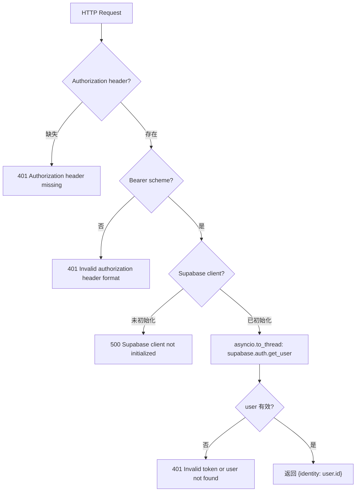
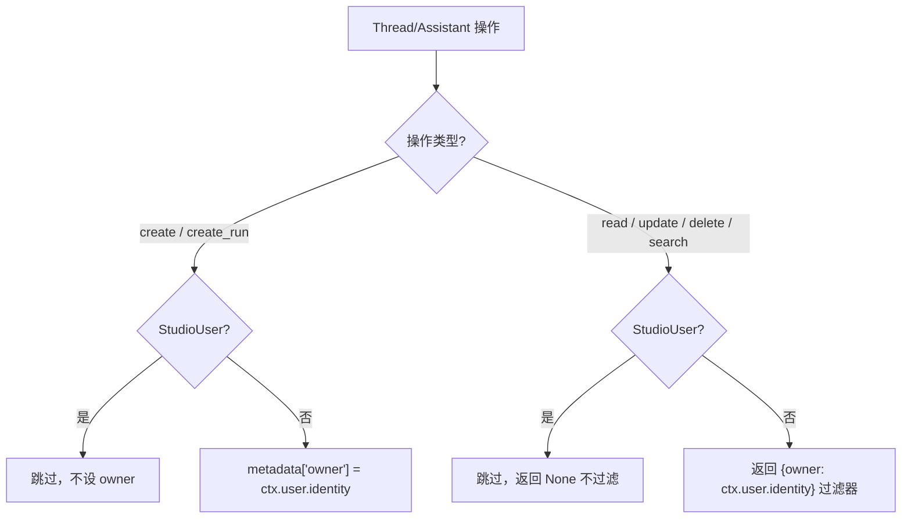
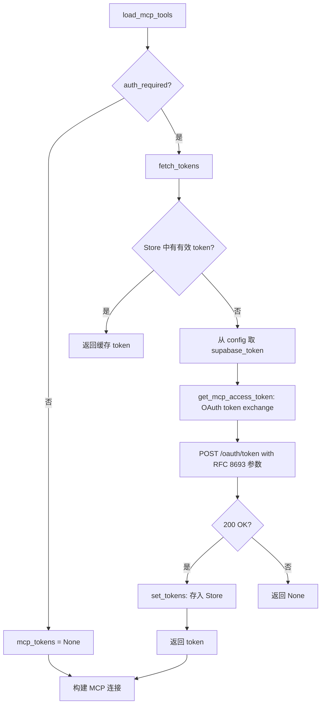

# PD-441.01 Open Deep Research — Supabase JWT 认证与 LangGraph Auth 资源隔离

> 文档编号：PD-441.01
> 来源：Open Deep Research `src/security/auth.py` `src/open_deep_research/utils.py`
> GitHub：https://github.com/langchain-ai/open_deep_research.git
> 问题域：PD-441 认证授权 Authentication & Authorization
> 状态：可复用方案

---

## 第 1 章 问题与动机

### 1.1 核心问题

LangGraph 部署的 Agent 服务面临三层认证授权挑战：

1. **请求级认证**：每个 API 请求必须携带有效身份凭证，防止未授权访问
2. **资源级隔离**：不同用户创建的 thread、assistant、store 数据必须严格隔离，用户 A 不能读取用户 B 的研究线程
3. **工具级授权**：MCP 外部工具需要独立的 OAuth 令牌，且令牌生命周期需要自动管理（获取、缓存、过期刷新）

传统 Web 应用的 session-based 认证无法直接适配 LangGraph 的异步、多线程、多 Agent 架构。Agent 服务的特殊性在于：一个用户请求可能触发多个并行子 Agent，每个子 Agent 可能调用外部 MCP 工具，整个调用链都需要一致的身份上下文传递。

### 1.2 Open Deep Research 的解法概述

Open Deep Research 采用 **LangGraph Auth 装饰器 + Supabase JWT + OAuth Token Exchange** 三层架构：

1. **统一认证入口**：通过 `@auth.authenticate` 装饰器拦截所有请求，验证 Bearer JWT token（`src/security/auth.py:21-69`）
2. **资源所有权注入**：在 thread/assistant 创建时自动注入 `owner` metadata，读取时自动过滤（`src/security/auth.py:72-156`）
3. **MCP Token Exchange**：通过 RFC 8693 标准的 OAuth token exchange 将 Supabase token 换取 MCP 访问令牌（`src/open_deep_research/utils.py:250-291`）
4. **令牌生命周期管理**：基于 LangGraph Store 持久化令牌，自动检测过期并刷新（`src/open_deep_research/utils.py:293-383`）
5. **StudioUser 豁免**：LangGraph Studio 开发环境用户跳过所有权检查，方便调试（`src/security/auth.py:85`）

### 1.3 设计思想

| 设计原则 | 具体实现 | 理由 | 替代方案 |
|----------|----------|------|----------|
| 声明式认证 | `@auth.authenticate` 装饰器自动拦截 | 零侵入业务代码，认证逻辑与业务完全解耦 | 手动在每个 endpoint 检查 token |
| 资源级 RBAC | metadata `owner` 字段 + 过滤器返回值 | LangGraph 原生支持 metadata 过滤，无需额外数据库 | 独立的 ACL 表 |
| 令牌委托 | OAuth token exchange (RFC 8693) | 标准协议，Supabase token 不直接暴露给 MCP 服务 | 直接传递 Supabase token |
| 异步验证 | `asyncio.to_thread` 包装同步 Supabase SDK | 避免阻塞事件循环，保持高并发性能 | 使用异步 Supabase 客户端 |
| 开发友好 | `StudioUser` 类型检查跳过认证 | 本地开发无需配置 Supabase | 环境变量开关 |

---

## 第 2 章 源码实现分析

### 2.1 架构概览

Open Deep Research 的认证授权系统分为三层，通过 `langgraph.json` 配置文件将 auth 模块挂载到 LangGraph 服务：

```
┌─────────────────────────────────────────────────────────────────┐
│                    LangGraph Platform                           │
│                                                                 │
│  langgraph.json: { "auth": { "path": "./src/security/auth.py:auth" } }  │
│                                                                 │
│  ┌──────────────────────────────────────────────────────────┐   │
│  │ Layer 1: Request Authentication (auth.py)                │   │
│  │  @auth.authenticate → JWT 验证 → MinimalUserDict        │   │
│  └──────────────┬───────────────────────────────────────────┘   │
│                 │ identity                                       │
│  ┌──────────────▼───────────────────────────────────────────┐   │
│  │ Layer 2: Resource Authorization (auth.py)                │   │
│  │  @auth.on.threads.create → 注入 owner metadata          │   │
│  │  @auth.on.threads.read   → 返回 {owner: identity} 过滤  │   │
│  │  @auth.on.assistants.*   → 同上                          │   │
│  │  @auth.on.store()        → namespace[0] == identity      │   │
│  └──────────────┬───────────────────────────────────────────┘   │
│                 │ owner context                                  │
│  ┌──────────────▼───────────────────────────────────────────┐   │
│  │ Layer 3: MCP Tool Auth (utils.py)                        │   │
│  │  fetch_tokens → get_tokens / get_mcp_access_token        │   │
│  │  → OAuth token exchange → Store 持久化                   │   │
│  │  → wrap_mcp_authenticate_tool → 错误处理                 │   │
│  └──────────────────────────────────────────────────────────┘   │
└─────────────────────────────────────────────────────────────────┘
```

### 2.2 核心实现

#### 2.2.1 JWT 认证中间件



对应源码 `src/security/auth.py:21-69`：

```python
@auth.authenticate
async def get_current_user(authorization: str | None) -> Auth.types.MinimalUserDict:
    """Check if the user's JWT token is valid using Supabase."""
    if not authorization:
        raise Auth.exceptions.HTTPException(
            status_code=401, detail="Authorization header missing"
        )
    try:
        scheme, token = authorization.split()
        assert scheme.lower() == "bearer"
    except (ValueError, AssertionError):
        raise Auth.exceptions.HTTPException(
            status_code=401, detail="Invalid authorization header format"
        )
    if not supabase:
        raise Auth.exceptions.HTTPException(
            status_code=500, detail="Supabase client not initialized"
        )
    try:
        async def verify_token() -> dict[str, Any]:
            response = await asyncio.to_thread(supabase.auth.get_user, token)
            return response
        response = await verify_token()
        user = response.user
        if not user:
            raise Auth.exceptions.HTTPException(
                status_code=401, detail="Invalid token or user not found"
            )
        return {"identity": user.id}
    except Exception as e:
        raise Auth.exceptions.HTTPException(
            status_code=401, detail=f"Authentication error: {str(e)}"
        )
```

关键设计点：
- `asyncio.to_thread` 将同步的 `supabase.auth.get_user` 调用放入线程池，避免阻塞事件循环（`auth.py:50`）
- 返回 `MinimalUserDict` 只包含 `identity` 字段，最小化用户信息传递（`auth.py:62-64`）
- Supabase 客户端在模块级别初始化，通过环境变量 `SUPABASE_URL` 和 `SUPABASE_KEY` 配置（`auth.py:8-13`）

#### 2.2.2 资源所有权隔离



对应源码 `src/security/auth.py:72-156`：

```python
@auth.on.threads.create
@auth.on.threads.create_run
async def on_thread_create(
    ctx: Auth.types.AuthContext,
    value: Auth.types.on.threads.create.value,
):
    if isinstance(ctx.user, StudioUser):
        return
    metadata = value.setdefault("metadata", {})
    metadata["owner"] = ctx.user.identity

@auth.on.threads.read
@auth.on.threads.delete
@auth.on.threads.update
@auth.on.threads.search
async def on_thread_read(
    ctx: Auth.types.AuthContext,
    value: Auth.types.on.threads.read.value,
):
    if isinstance(ctx.user, StudioUser):
        return
    return {"owner": ctx.user.identity}

@auth.on.store()
async def authorize_store(ctx: Auth.types.AuthContext, value: dict):
    if isinstance(ctx.user, StudioUser):
        return
    namespace: tuple = value["namespace"]
    assert namespace[0] == ctx.user.identity, "Not authorized"
```

关键设计点：
- **写入时注入**：`create` 操作通过 `value.setdefault("metadata", {})` 安全地注入 owner（`auth.py:90-91`）
- **读取时过滤**：`read/update/delete/search` 操作返回过滤字典，LangGraph 自动应用（`auth.py:111`）
- **Store 隔离**：通过 namespace 第一段必须等于用户 identity 实现数据隔离（`auth.py:155-156`）
- **装饰器堆叠**：多个操作共享同一处理函数，减少代码重复（`auth.py:94-97`）

#### 2.2.3 MCP OAuth Token Exchange



对应源码 `src/open_deep_research/utils.py:250-291`：

```python
async def get_mcp_access_token(
    supabase_token: str,
    base_mcp_url: str,
) -> Optional[Dict[str, Any]]:
    """Exchange Supabase token for MCP access token using OAuth token exchange."""
    try:
        form_data = {
            "client_id": "mcp_default",
            "subject_token": supabase_token,
            "grant_type": "urn:ietf:params:oauth:grant-type:token-exchange",
            "resource": base_mcp_url.rstrip("/") + "/mcp",
            "subject_token_type": "urn:ietf:params:oauth:token-type:access_token",
        }
        async with aiohttp.ClientSession() as session:
            token_url = base_mcp_url.rstrip("/") + "/oauth/token"
            headers = {"Content-Type": "application/x-www-form-urlencoded"}
            async with session.post(token_url, headers=headers, data=form_data) as response:
                if response.status == 200:
                    token_data = await response.json()
                    return token_data
                else:
                    response_text = await response.text()
                    logging.error(f"Token exchange failed: {response_text}")
    except Exception as e:
        logging.error(f"Error during token exchange: {e}")
    return None
```

### 2.3 实现细节

#### 令牌生命周期管理

令牌通过 LangGraph Store 持久化，以 `(user_id, "tokens")` 为 namespace、`"data"` 为 key 存储。`get_tokens` 函数（`utils.py:293-329`）在读取时自动检查过期：

```python
expires_in = tokens.value.get("expires_in")  # 秒数
created_at = tokens.created_at               # Store 记录的创建时间
current_time = datetime.now(timezone.utc)
expiration_time = created_at + timedelta(seconds=expires_in)
if current_time > expiration_time:
    await store.adelete((user_id, "tokens"), "data")
    return None
```

这种设计利用了 Store 自带的 `created_at` 时间戳，无需额外存储过期时间点。

#### MCP 工具认证包装器

`wrap_mcp_authenticate_tool`（`utils.py:385-447`）为每个 MCP 工具注入错误处理层，特别处理 MCP 协议的 `-32003` 错误码（交互要求）：

```python
if error_code == -32003:  # Interaction required error code
    message_payload = error_data.get("message", {})
    error_message = "Required interaction"
    if isinstance(message_payload, dict):
        error_message = message_payload.get("text") or error_message
    if url := error_data.get("url"):
        error_message = f"{error_message} {url}"
    raise ToolException(error_message) from original_error
```

该包装器递归搜索异常链（包括 Python 3.11+ 的 `ExceptionGroup`），确保嵌套的 MCP 错误不会被吞掉。

#### langgraph.json 配置集成

认证模块通过 `langgraph.json` 的 `auth` 字段声明式挂载（`langgraph.json:11-13`）：

```json
{
    "auth": {
        "path": "./src/security/auth.py:auth"
    }
}
```

LangGraph Platform 在启动时加载该模块，自动将 `auth` 对象注册为全局认证中间件。

---

## 第 3 章 迁移指南

### 3.1 迁移清单

#### 阶段一：基础 JWT 认证（1 个文件）

- [ ] 安装依赖：`pip install supabase langgraph-sdk`
- [ ] 创建 `src/security/auth.py`，实现 `@auth.authenticate` 装饰器
- [ ] 配置环境变量 `SUPABASE_URL` 和 `SUPABASE_KEY`
- [ ] 在 `langgraph.json` 中添加 `"auth": {"path": "./src/security/auth.py:auth"}`

#### 阶段二：资源隔离（同一文件扩展）

- [ ] 添加 `@auth.on.threads.create` 处理器注入 owner metadata
- [ ] 添加 `@auth.on.threads.read/update/delete/search` 处理器返回过滤器
- [ ] 添加 `@auth.on.assistants.*` 处理器（同 threads 模式）
- [ ] 添加 `@auth.on.store()` 处理器验证 namespace 所有权

#### 阶段三：MCP Token Exchange（utils.py 扩展）

- [ ] 实现 `get_mcp_access_token` 函数（OAuth token exchange）
- [ ] 实现 `get_tokens` / `set_tokens` / `fetch_tokens` 令牌生命周期管理
- [ ] 实现 `wrap_mcp_authenticate_tool` 错误处理包装器
- [ ] 在 `load_mcp_tools` 中集成认证流程

### 3.2 适配代码模板

以下是一个最小化的 LangGraph Auth 认证模块，可直接复用：

```python
"""Minimal LangGraph Auth module with Supabase JWT + resource isolation."""
import os
import asyncio
from langgraph_sdk import Auth
from langgraph_sdk.auth.types import StudioUser
from supabase import create_client

# Initialize Supabase client from environment
supabase_url = os.environ.get("SUPABASE_URL")
supabase_key = os.environ.get("SUPABASE_KEY")
supabase = create_client(supabase_url, supabase_key) if supabase_url and supabase_key else None

auth = Auth()

@auth.authenticate
async def get_current_user(authorization: str | None) -> Auth.types.MinimalUserDict:
    if not authorization:
        raise Auth.exceptions.HTTPException(status_code=401, detail="Missing auth header")
    try:
        scheme, token = authorization.split()
        assert scheme.lower() == "bearer"
    except (ValueError, AssertionError):
        raise Auth.exceptions.HTTPException(status_code=401, detail="Invalid auth format")
    if not supabase:
        raise Auth.exceptions.HTTPException(status_code=500, detail="Auth not configured")
    response = await asyncio.to_thread(supabase.auth.get_user, token)
    user = response.user
    if not user:
        raise Auth.exceptions.HTTPException(status_code=401, detail="Invalid token")
    return {"identity": user.id}

@auth.on.threads.create
@auth.on.threads.create_run
async def on_create(ctx: Auth.types.AuthContext, value):
    if isinstance(ctx.user, StudioUser):
        return
    metadata = value.setdefault("metadata", {})
    metadata["owner"] = ctx.user.identity

@auth.on.threads.read
@auth.on.threads.delete
@auth.on.threads.update
@auth.on.threads.search
async def on_read(ctx: Auth.types.AuthContext, value):
    if isinstance(ctx.user, StudioUser):
        return
    return {"owner": ctx.user.identity}

@auth.on.store()
async def on_store(ctx: Auth.types.AuthContext, value: dict):
    if isinstance(ctx.user, StudioUser):
        return
    namespace: tuple = value["namespace"]
    assert namespace[0] == ctx.user.identity, "Not authorized"
```

对应的 `langgraph.json` 配置：

```json
{
    "graphs": {
        "my_agent": "./src/agent/graph.py:graph"
    },
    "auth": {
        "path": "./src/security/auth.py:auth"
    }
}
```

### 3.3 适用场景

| 场景 | 适用度 | 说明 |
|------|--------|------|
| LangGraph Platform 多租户部署 | ⭐⭐⭐ | 完美匹配，原生支持 Auth 装饰器 |
| 需要 MCP 工具认证的 Agent | ⭐⭐⭐ | OAuth token exchange 方案成熟 |
| Supabase 作为用户管理后端 | ⭐⭐⭐ | 直接复用，零适配成本 |
| 自建 JWT 认证（非 Supabase） | ⭐⭐ | 需替换 `supabase.auth.get_user` 为自定义 JWT 验证 |
| 非 LangGraph 框架 | ⭐ | Auth 装饰器是 LangGraph 专有，需重写为通用中间件 |
| 细粒度权限（角色/组） | ⭐ | 当前仅支持 owner 级别，需扩展 metadata 结构 |

---

## 第 4 章 测试用例

```python
"""Tests for LangGraph Auth authentication and authorization."""
import asyncio
import pytest
from unittest.mock import AsyncMock, MagicMock, patch
from datetime import datetime, timedelta, timezone


class TestJWTAuthentication:
    """Test JWT token validation via Supabase."""

    @pytest.mark.asyncio
    async def test_missing_authorization_header(self):
        """Should return 401 when Authorization header is missing."""
        from security.auth import get_current_user, Auth
        with pytest.raises(Auth.exceptions.HTTPException) as exc_info:
            await get_current_user(None)
        assert exc_info.value.status_code == 401
        assert "missing" in exc_info.value.detail.lower()

    @pytest.mark.asyncio
    async def test_invalid_scheme(self):
        """Should return 401 when scheme is not Bearer."""
        from security.auth import get_current_user, Auth
        with pytest.raises(Auth.exceptions.HTTPException) as exc_info:
            await get_current_user("Basic abc123")
        assert exc_info.value.status_code == 401
        assert "format" in exc_info.value.detail.lower()

    @pytest.mark.asyncio
    async def test_valid_token_returns_identity(self):
        """Should return user identity dict for valid JWT."""
        from security.auth import get_current_user
        mock_user = MagicMock()
        mock_user.id = "user-uuid-123"
        mock_response = MagicMock()
        mock_response.user = mock_user
        with patch("security.auth.supabase") as mock_sb:
            mock_sb.auth.get_user.return_value = mock_response
            result = await get_current_user("Bearer valid-jwt-token")
        assert result == {"identity": "user-uuid-123"}

    @pytest.mark.asyncio
    async def test_supabase_not_initialized(self):
        """Should return 500 when Supabase client is None."""
        from security.auth import get_current_user, Auth
        with patch("security.auth.supabase", None):
            with pytest.raises(Auth.exceptions.HTTPException) as exc_info:
                await get_current_user("Bearer some-token")
            assert exc_info.value.status_code == 500


class TestResourceIsolation:
    """Test owner-based resource isolation."""

    @pytest.mark.asyncio
    async def test_thread_create_injects_owner(self):
        """Should inject owner metadata on thread creation."""
        from security.auth import on_thread_create
        ctx = MagicMock()
        ctx.user = MagicMock()
        ctx.user.identity = "user-abc"
        # Simulate StudioUser check
        from langgraph_sdk.auth.types import StudioUser
        ctx.user.__class__ = type("RegularUser", (), {})
        value = {}
        await on_thread_create(ctx, value)
        assert value["metadata"]["owner"] == "user-abc"

    @pytest.mark.asyncio
    async def test_thread_read_returns_filter(self):
        """Should return owner filter for read operations."""
        from security.auth import on_thread_read
        ctx = MagicMock()
        ctx.user = MagicMock()
        ctx.user.identity = "user-xyz"
        ctx.user.__class__ = type("RegularUser", (), {})
        result = await on_thread_read(ctx, {})
        assert result == {"owner": "user-xyz"}

    @pytest.mark.asyncio
    async def test_store_namespace_validation(self):
        """Should reject store access when namespace doesn't match user."""
        from security.auth import authorize_store
        ctx = MagicMock()
        ctx.user = MagicMock()
        ctx.user.identity = "user-abc"
        ctx.user.__class__ = type("RegularUser", (), {})
        with pytest.raises(AssertionError, match="Not authorized"):
            await authorize_store(ctx, {"namespace": ("other-user", "tokens")})


class TestMCPTokenExchange:
    """Test OAuth token exchange for MCP tools."""

    @pytest.mark.asyncio
    async def test_token_exchange_success(self):
        """Should exchange Supabase token for MCP access token."""
        from open_deep_research.utils import get_mcp_access_token
        mock_token_data = {"access_token": "mcp-token-123", "expires_in": 3600}
        with patch("aiohttp.ClientSession") as mock_session_cls:
            mock_response = AsyncMock()
            mock_response.status = 200
            mock_response.json = AsyncMock(return_value=mock_token_data)
            mock_session = AsyncMock()
            mock_session.post.return_value.__aenter__ = AsyncMock(return_value=mock_response)
            mock_session_cls.return_value.__aenter__ = AsyncMock(return_value=mock_session)
            result = await get_mcp_access_token("supabase-jwt", "https://mcp.example.com")
        assert result == mock_token_data

    @pytest.mark.asyncio
    async def test_token_expiration_check(self):
        """Should return None for expired tokens and clean up store."""
        from open_deep_research.utils import get_tokens
        mock_store = AsyncMock()
        mock_token = MagicMock()
        mock_token.value = {"expires_in": 3600}
        mock_token.created_at = datetime.now(timezone.utc) - timedelta(hours=2)
        mock_store.aget.return_value = mock_token
        with patch("open_deep_research.utils.get_store", return_value=mock_store):
            config = {"configurable": {"thread_id": "t1"}, "metadata": {"owner": "u1"}}
            result = await get_tokens(config)
        assert result is None
        mock_store.adelete.assert_called_once()
```

---

## 第 5 章 跨域关联

| 关联域 | 关系类型 | 说明 |
|--------|----------|------|
| PD-04 工具系统 | 依赖 | MCP 工具加载（`load_mcp_tools`）依赖认证层提供的 token，`wrap_mcp_authenticate_tool` 将认证错误转化为 `ToolException` |
| PD-06 记忆持久化 | 协同 | 令牌通过 LangGraph Store 持久化（`get_tokens`/`set_tokens`），Store 访问本身受 `@auth.on.store()` 保护，形成双向依赖 |
| PD-09 Human-in-the-Loop | 协同 | MCP 工具的 `-32003` 交互要求错误码需要用户介入，认证层将其转化为可读的 `ToolException` 消息 |
| PD-10 中间件管道 | 依赖 | `@auth.authenticate` 本质上是 LangGraph 的请求中间件，认证是管道的第一个环节 |
| PD-11 可观测性 | 协同 | 认证失败的错误日志（`logging.error`）可接入可观测性系统追踪异常认证模式 |

---

## 第 6 章 来源文件索引

| 文件 | 行范围 | 关键实现 |
|------|--------|----------|
| `src/security/auth.py` | L1-L16 | Supabase 客户端初始化 + Auth 容器创建 |
| `src/security/auth.py` | L21-L69 | `@auth.authenticate` JWT 验证中间件 |
| `src/security/auth.py` | L72-L91 | Thread 创建时 owner metadata 注入 |
| `src/security/auth.py` | L94-L111 | Thread 读取时 owner 过滤器 |
| `src/security/auth.py` | L114-L146 | Assistant 创建/读取的所有权控制 |
| `src/security/auth.py` | L149-L156 | Store namespace 所有权验证 |
| `src/open_deep_research/utils.py` | L250-L291 | `get_mcp_access_token` OAuth token exchange |
| `src/open_deep_research/utils.py` | L293-L329 | `get_tokens` 令牌读取与过期检查 |
| `src/open_deep_research/utils.py` | L331-L350 | `set_tokens` 令牌持久化存储 |
| `src/open_deep_research/utils.py` | L352-L383 | `fetch_tokens` 令牌获取与刷新编排 |
| `src/open_deep_research/utils.py` | L385-L447 | `wrap_mcp_authenticate_tool` MCP 错误处理包装器 |
| `src/open_deep_research/utils.py` | L449-L524 | `load_mcp_tools` MCP 工具加载与认证集成 |
| `src/open_deep_research/configuration.py` | L19-L36 | `MCPConfig` 含 `auth_required` 字段 |
| `langgraph.json` | L11-L13 | Auth 模块声明式挂载配置 |

---

## 第 7 章 横向对比维度

```json comparison_data
{
  "project": "Open Deep Research",
  "dimensions": {
    "认证方式": "Supabase JWT + LangGraph Auth 装饰器，asyncio.to_thread 异步验证",
    "资源隔离": "metadata owner 字段 + 过滤器返回值，覆盖 thread/assistant/store 三类资源",
    "令牌管理": "LangGraph Store 持久化 + created_at 过期检测 + 自动刷新",
    "MCP 授权": "RFC 8693 OAuth token exchange，Supabase token 换取 MCP access token",
    "开发体验": "StudioUser 类型检查跳过认证，langgraph.json 声明式挂载",
    "错误处理": "MCP -32003 交互错误码转 ToolException，递归搜索 ExceptionGroup"
  }
}
```

### 域元数据补充

```json domain_metadata
{
  "solution_summary": "Open Deep Research 用 LangGraph Auth 装饰器 + Supabase JWT 实现三层认证：请求级 JWT 验证、资源级 owner metadata 隔离、MCP 工具级 OAuth token exchange",
  "description": "Agent 平台中认证需覆盖请求、资源、工具三个层级的令牌传递与隔离",
  "sub_problems": [
    "LangGraph Store 的 namespace 级数据隔离",
    "MCP 工具交互错误码(-32003)的用户友好处理",
    "同步认证 SDK 在异步事件循环中的线程池适配"
  ],
  "best_practices": [
    "通过 langgraph.json 声明式挂载 auth 模块实现零侵入集成",
    "利用 Store 的 created_at 时间戳管理令牌过期而非额外存储过期时间",
    "为开发环境提供 StudioUser 豁免机制避免本地调试配置负担"
  ]
}
```
