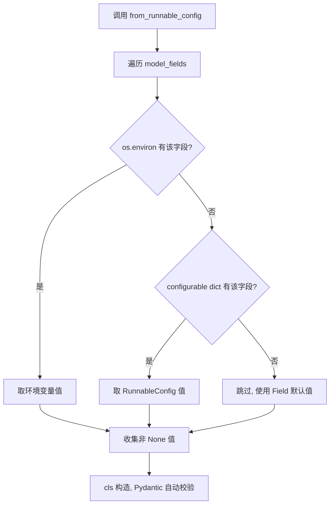
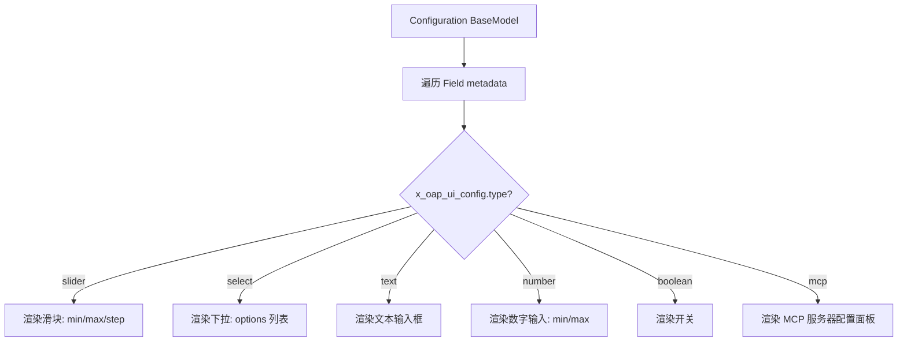
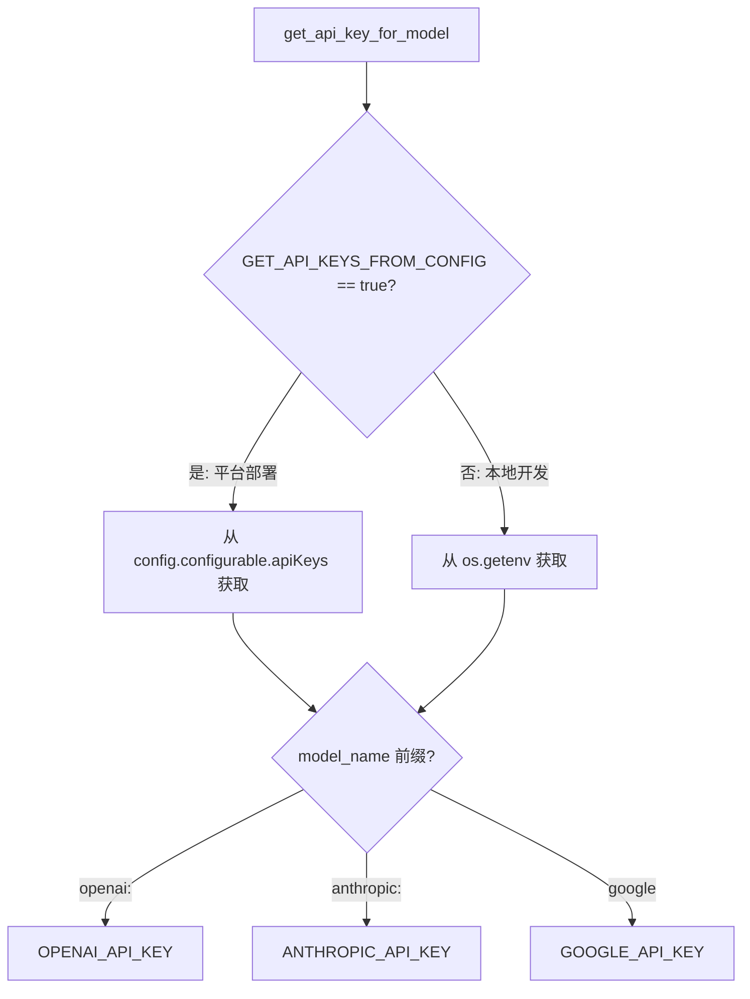

# PD-442.01 Open Deep Research — 三层配置源合并与 UI 元数据驱动

> 文档编号：PD-442.01
> 来源：Open Deep Research `src/open_deep_research/configuration.py`
> GitHub：https://github.com/langchain-ai/open_deep_research.git
> 问题域：PD-442 配置管理 Configuration Management
> 状态：可复用方案

---

## 第 1 章 问题与动机

### 1.1 核心问题

Agent 系统的配置管理面临三重挑战：

1. **多源配置合并** — 同一个参数可能来自环境变量（部署时设定）、运行时 API 调用（用户动态传入）、或代码默认值。需要一套清晰的优先级规则来决定最终生效值。
2. **配置驱动 UI 生成** — 当 Agent 部署到平台（如 Open Agent Platform）时，前端需要为每个配置字段自动生成合适的 UI 控件（slider、select、text input 等），而不是手写表单。
3. **运行时热切换** — 研究型 Agent 需要在不重启服务的情况下切换模型、搜索 API、并发数等参数，每次调用可以携带不同配置。
4. **API Key 双轨分发** — 本地开发用环境变量，平台部署时 API Key 从 RunnableConfig 的 `apiKeys` 字段注入，两条路径需要统一抽象。

### 1.2 Open Deep Research 的解法概述

Open Deep Research 采用 Pydantic BaseModel 定义单一配置类，通过 `from_runnable_config` 类方法实现三层配置源合并：

1. **Pydantic BaseModel 作为 Schema** — `Configuration` 类定义所有字段及其类型、默认值、约束（`configuration.py:38-252`）
2. **三层优先级合并** — `from_runnable_config()` 方法按 环境变量 > RunnableConfig > 默认值 的优先级合并配置（`configuration.py:236-247`）
3. **x_oap_ui_config 元数据** — 每个 Field 的 `metadata` 字段携带 UI 组件描述（type/min/max/step/options），驱动 Open Agent Platform 自动生成配置面板（`configuration.py:44-232`）
4. **LangGraph config_schema 集成** — StateGraph 构建时传入 `config_schema=Configuration`，使配置自动流经整个图执行链路（`deep_researcher.py:353,592,704`）
5. **API Key 双轨获取** — `get_api_key_for_model()` 根据 `GET_API_KEYS_FROM_CONFIG` 环境变量决定从环境变量还是 RunnableConfig 获取 API Key（`utils.py:892-914`）

### 1.3 设计思想

| 设计原则 | 具体实现 | 理由 | 替代方案 |
|----------|----------|------|----------|
| Schema 即文档 | Pydantic BaseModel + Field metadata | 类型、约束、UI 描述一处定义，消除配置与 UI 的同步问题 | JSON Schema 文件 + 手写 UI 映射 |
| 环境变量优先 | `os.environ.get(field_name.upper())` 先于 configurable | 部署环境的覆盖权最高，符合 12-Factor App 原则 | 配置文件优先（不利于容器化部署） |
| 每次调用独立配置 | `from_runnable_config(config)` 在每个节点函数入口调用 | 支持同一服务实例处理不同配置的并发请求 | 全局单例配置（不支持多租户） |
| 声明式 UI 映射 | `x_oap_ui_config` 中的 type/min/max/step/options | 前端无需了解业务语义即可渲染控件 | 手写前端表单（维护成本高） |
| 渐进式演进 | legacy/ 保留 dataclass 版本，新版迁移到 Pydantic | 向后兼容，允许逐步迁移 | 一次性重写（风险高） |

---

## 第 2 章 源码实现分析

### 2.1 架构概览

Open Deep Research 的配置系统由三层组成：定义层（Pydantic Schema）、合并层（from_runnable_config）、消费层（LangGraph 节点函数）。

```
┌─────────────────────────────────────────────────────────────────┐
│                    配置消费层 (LangGraph Nodes)                   │
│                                                                 │
│  clarify_with_user()  supervisor()  researcher()  final_report()│
│       │                    │             │              │        │
│       └────────────────────┴─────────────┴──────────────┘        │
│                            │                                     │
│              Configuration.from_runnable_config(config)           │
│                            │                                     │
├────────────────────────────┼─────────────────────────────────────┤
│                    配置合并层                                     │
│                            │                                     │
│    ┌───────────┐    ┌──────┴──────┐    ┌──────────────┐         │
│    │ 环境变量   │ >  │ Runnable    │ >  │ Field 默认值  │         │
│    │ (最高优先) │    │ Config      │    │ (最低优先)    │         │
│    └───────────┘    └─────────────┘    └──────────────┘         │
│                                                                 │
├─────────────────────────────────────────────────────────────────┤
│                    配置定义层 (Pydantic Schema)                   │
│                                                                 │
│  Configuration(BaseModel)                                       │
│    ├─ max_concurrent_research_units: int  [slider 1-20]         │
│    ├─ search_api: SearchAPI              [select]               │
│    ├─ research_model: str                [text]                 │
│    ├─ allow_clarification: bool          [boolean]              │
│    ├─ mcp_config: MCPConfig              [mcp]                  │
│    └─ ...（15+ 字段，每个携带 x_oap_ui_config）                  │
│                                                                 │
│  StateGraph(AgentState, config_schema=Configuration)            │
│    → 配置自动注入到每个节点的 RunnableConfig 参数                  │
└─────────────────────────────────────────────────────────────────┘
```

### 2.2 核心实现

#### 2.2.1 三层配置源合并



对应源码 `src/open_deep_research/configuration.py:236-247`：

```python
@classmethod
def from_runnable_config(
    cls, config: Optional[RunnableConfig] = None
) -> "Configuration":
    """Create a Configuration instance from a RunnableConfig."""
    configurable = config.get("configurable", {}) if config else {}
    field_names = list(cls.model_fields.keys())
    values: dict[str, Any] = {
        field_name: os.environ.get(field_name.upper(), configurable.get(field_name))
        for field_name in field_names
    }
    return cls(**{k: v for k, v in values.items() if v is not None})
```

关键设计点：
- `os.environ.get(field_name.upper(), configurable.get(field_name))` — 环境变量作为第一参数，RunnableConfig 作为 fallback，实现了 ENV > Runtime > Default 的三层优先级
- `if v is not None` 过滤 — 只传入有值的字段，让 Pydantic 的 `default` 值自然生效
- 字段名自动大写映射 — `max_concurrent_research_units` → `MAX_CONCURRENT_RESEARCH_UNITS`

#### 2.2.2 UI 元数据驱动配置面板



对应源码 `src/open_deep_research/configuration.py:64-76`（slider 示例）：

```python
max_concurrent_research_units: int = Field(
    default=5,
    metadata={
        "x_oap_ui_config": {
            "type": "slider",
            "default": 5,
            "min": 1,
            "max": 20,
            "step": 1,
            "description": "Maximum number of research units to run concurrently. "
                         "This will allow the researcher to use multiple sub-agents "
                         "to conduct research. Note: with more concurrency, you may "
                         "run into rate limits."
        }
    }
)
```

对应源码 `src/open_deep_research/configuration.py:78-93`（select 示例）：

```python
search_api: SearchAPI = Field(
    default=SearchAPI.TAVILY,
    metadata={
        "x_oap_ui_config": {
            "type": "select",
            "default": "tavily",
            "description": "Search API to use for research.",
            "options": [
                {"label": "Tavily", "value": SearchAPI.TAVILY.value},
                {"label": "OpenAI Native Web Search", "value": SearchAPI.OPENAI.value},
                {"label": "Anthropic Native Web Search", "value": SearchAPI.ANTHROPIC.value},
                {"label": "None", "value": SearchAPI.NONE.value}
            ]
        }
    }
)
```

6 种 UI 组件类型覆盖了 Agent 配置的全部场景：

| UI 类型 | 字段示例 | 用途 |
|---------|---------|------|
| `slider` | max_concurrent_research_units, max_researcher_iterations | 有界整数，需要直观调节 |
| `select` | search_api | 枚举选择 |
| `text` | research_model, summarization_model | 自由文本（模型名） |
| `number` | max_content_length, summarization_model_max_tokens | 数值输入 |
| `boolean` | allow_clarification | 开关 |
| `mcp` | mcp_config | MCP 服务器专用配置面板 |

### 2.3 实现细节

#### API Key 双轨分发机制

`get_api_key_for_model()` 函数（`utils.py:892-914`）根据部署模式选择 API Key 来源：



这种设计让同一份代码在本地开发（`.env` 文件）和平台部署（OAP 注入）两种场景下无缝切换。

#### LangGraph config_schema 集成

三个 StateGraph 均绑定 `config_schema=Configuration`（`deep_researcher.py:353,592,704`）：

```python
# 主图
deep_researcher_builder = StateGraph(
    AgentState, input=AgentInputState, config_schema=Configuration
)
# Supervisor 子图
supervisor_builder = StateGraph(SupervisorState, config_schema=Configuration)
# Researcher 子图
researcher_builder = StateGraph(
    ResearcherState, output=ResearcherOutputState, config_schema=Configuration
)
```

这使得 LangGraph 在编译图时自动将 Configuration 的字段暴露为可配置参数，调用方通过 `{"configurable": {"research_model": "anthropic:claude-sonnet-4-20250514"}}` 即可动态覆盖。

#### Legacy 到 Pydantic 的演进

legacy 版本（`src/legacy/configuration.py:31-67`）使用 `@dataclass(kw_only=True)` + `fields(cls)` 实现相同的三层合并逻辑，但缺少 UI 元数据能力。新版迁移到 Pydantic BaseModel 后获得了：
- `metadata` 字段支持（dataclass 的 `field.metadata` 语义不同）
- 自动 JSON Schema 导出（`model_json_schema()`）
- 嵌套模型验证（`MCPConfig` 作为子模型）
- `model_fields` 替代 `fields(cls)` 的更丰富的字段内省

---

## 第 3 章 迁移指南

### 3.1 迁移清单

**阶段 1：定义配置 Schema**
- [ ] 创建 Pydantic BaseModel 配置类，列出所有可配置字段
- [ ] 为每个字段设置类型、默认值、约束
- [ ] 为需要 UI 展示的字段添加 `x_oap_ui_config` 元数据

**阶段 2：实现三层合并**
- [ ] 实现 `from_runnable_config()` 类方法
- [ ] 确保环境变量名与字段名的大写映射一致
- [ ] 处理 None 值过滤，让默认值自然生效

**阶段 3：集成到 LangGraph**
- [ ] 在 StateGraph 构建时传入 `config_schema=YourConfiguration`
- [ ] 在每个节点函数入口调用 `Configuration.from_runnable_config(config)`
- [ ] 通过 configurable 对象访问配置值

**阶段 4：API Key 管理**
- [ ] 实现 `get_api_key_for_model()` 双轨函数
- [ ] 配置 `GET_API_KEYS_FROM_CONFIG` 环境变量控制模式切换
- [ ] 在 `.env.example` 中列出所有需要的 Key

### 3.2 适配代码模板

以下模板可直接复用到任何 LangGraph Agent 项目：

```python
"""可复用的三层配置管理模板"""

import os
from enum import Enum
from typing import Any, Optional

from langchain_core.runnables import RunnableConfig
from pydantic import BaseModel, Field


class ModelProvider(Enum):
    """可选的模型提供商"""
    OPENAI = "openai"
    ANTHROPIC = "anthropic"
    GOOGLE = "google"


class AgentConfiguration(BaseModel):
    """Agent 配置类 — 三层配置源合并 + UI 元数据驱动"""

    # 模型配置
    primary_model: str = Field(
        default="openai:gpt-4.1",
        metadata={
            "x_oap_ui_config": {
                "type": "text",
                "default": "openai:gpt-4.1",
                "description": "Primary model for agent reasoning"
            }
        }
    )
    max_tokens: int = Field(
        default=8192,
        metadata={
            "x_oap_ui_config": {
                "type": "number",
                "default": 8192,
                "min": 1024,
                "max": 32768,
                "description": "Maximum output tokens"
            }
        }
    )
    # 行为配置
    max_iterations: int = Field(
        default=5,
        metadata={
            "x_oap_ui_config": {
                "type": "slider",
                "default": 5,
                "min": 1,
                "max": 20,
                "step": 1,
                "description": "Maximum reasoning iterations"
            }
        }
    )
    temperature: float = Field(
        default=0.7,
        metadata={
            "x_oap_ui_config": {
                "type": "slider",
                "default": 0.7,
                "min": 0.0,
                "max": 2.0,
                "step": 0.1,
                "description": "Model temperature for generation"
            }
        }
    )

    @classmethod
    def from_runnable_config(
        cls, config: Optional[RunnableConfig] = None
    ) -> "AgentConfiguration":
        """三层配置源合并：ENV > RunnableConfig > Default"""
        configurable = config.get("configurable", {}) if config else {}
        values: dict[str, Any] = {
            name: os.environ.get(name.upper(), configurable.get(name))
            for name in cls.model_fields.keys()
        }
        return cls(**{k: v for k, v in values.items() if v is not None})


def get_api_key_for_model(model_name: str, config: RunnableConfig) -> Optional[str]:
    """API Key 双轨获取：平台部署从 config，本地从环境变量"""
    from_config = os.getenv("GET_API_KEYS_FROM_CONFIG", "false").lower() == "true"
    model_name = model_name.lower()

    if from_config:
        api_keys = config.get("configurable", {}).get("apiKeys", {})
        key_map = {
            "openai:": "OPENAI_API_KEY",
            "anthropic:": "ANTHROPIC_API_KEY",
            "google": "GOOGLE_API_KEY",
        }
    else:
        api_keys = None
        key_map = {
            "openai:": "OPENAI_API_KEY",
            "anthropic:": "ANTHROPIC_API_KEY",
            "google": "GOOGLE_API_KEY",
        }

    for prefix, key_name in key_map.items():
        if model_name.startswith(prefix):
            return api_keys.get(key_name) if from_config and api_keys else os.getenv(key_name)
    return None


# 使用示例：在 LangGraph 节点中消费配置
async def my_agent_node(state: dict, config: RunnableConfig):
    cfg = AgentConfiguration.from_runnable_config(config)
    model = init_chat_model(
        model=cfg.primary_model,
        max_tokens=cfg.max_tokens,
        api_key=get_api_key_for_model(cfg.primary_model, config),
    )
    # ... 使用 model 执行任务
```

### 3.3 适用场景

| 场景 | 适用度 | 说明 |
|------|--------|------|
| LangGraph Agent 部署到 OAP | ⭐⭐⭐ | 完美匹配：config_schema + x_oap_ui_config 直接驱动平台 UI |
| 多租户 Agent 服务 | ⭐⭐⭐ | 每次调用独立配置，天然支持多租户 |
| 本地开发 + 云端部署双模式 | ⭐⭐⭐ | API Key 双轨机制无缝切换 |
| 需要动态切换模型的 Agent | ⭐⭐⭐ | 运行时通过 RunnableConfig 传入不同模型名 |
| 简单脚本/单次运行 Agent | ⭐ | 过度设计，直接用环境变量即可 |
| 非 LangGraph 框架 | ⭐⭐ | 三层合并和 UI 元数据可复用，但 config_schema 集成不适用 |

---

## 第 4 章 测试用例

```python
"""测试三层配置合并与 UI 元数据"""

import os
import pytest
from unittest.mock import patch
from pydantic import BaseModel, Field
from typing import Any, Optional


# 复用上方模板中的 AgentConfiguration 类
class TestConfiguration(BaseModel):
    """测试用配置类"""
    model_name: str = Field(default="openai:gpt-4.1")
    max_tokens: int = Field(default=8192)
    temperature: float = Field(default=0.7)

    @classmethod
    def from_runnable_config(cls, config=None):
        configurable = config.get("configurable", {}) if config else {}
        values: dict[str, Any] = {
            name: os.environ.get(name.upper(), configurable.get(name))
            for name in cls.model_fields.keys()
        }
        return cls(**{k: v for k, v in values.items() if v is not None})


class TestThreeLayerMerge:
    """测试三层配置源优先级合并"""

    def test_default_values(self):
        """无外部输入时使用 Field 默认值"""
        cfg = TestConfiguration.from_runnable_config(None)
        assert cfg.model_name == "openai:gpt-4.1"
        assert cfg.max_tokens == 8192
        assert cfg.temperature == 0.7

    def test_runnable_config_overrides_default(self):
        """RunnableConfig 覆盖默认值"""
        config = {"configurable": {"model_name": "anthropic:claude-sonnet-4-20250514"}}
        cfg = TestConfiguration.from_runnable_config(config)
        assert cfg.model_name == "anthropic:claude-sonnet-4-20250514"
        assert cfg.max_tokens == 8192  # 未覆盖的字段保持默认

    @patch.dict(os.environ, {"MODEL_NAME": "google:gemini-pro"})
    def test_env_overrides_runnable_config(self):
        """环境变量优先于 RunnableConfig"""
        config = {"configurable": {"model_name": "anthropic:claude-sonnet-4-20250514"}}
        cfg = TestConfiguration.from_runnable_config(config)
        assert cfg.model_name == "google:gemini-pro"  # ENV 胜出

    @patch.dict(os.environ, {"MAX_TOKENS": "16384"})
    def test_env_overrides_default(self):
        """环境变量优先于默认值"""
        cfg = TestConfiguration.from_runnable_config(None)
        assert cfg.max_tokens == 16384

    def test_partial_override(self):
        """部分字段覆盖，其余保持默认"""
        config = {"configurable": {"temperature": 0.3}}
        cfg = TestConfiguration.from_runnable_config(config)
        assert cfg.temperature == 0.3
        assert cfg.model_name == "openai:gpt-4.1"

    def test_empty_config(self):
        """空 configurable dict 等同于无配置"""
        config = {"configurable": {}}
        cfg = TestConfiguration.from_runnable_config(config)
        assert cfg.model_name == "openai:gpt-4.1"


class TestUIMetadata:
    """测试 UI 元数据结构"""

    def test_slider_metadata_structure(self):
        """slider 类型元数据包含 min/max/step"""
        from open_deep_research.configuration import Configuration
        field = Configuration.model_fields["max_concurrent_research_units"]
        ui_config = field.metadata[0]["x_oap_ui_config"]
        assert ui_config["type"] == "slider"
        assert "min" in ui_config
        assert "max" in ui_config
        assert "step" in ui_config

    def test_select_metadata_has_options(self):
        """select 类型元数据包含 options 列表"""
        from open_deep_research.configuration import Configuration
        field = Configuration.model_fields["search_api"]
        ui_config = field.metadata[0]["x_oap_ui_config"]
        assert ui_config["type"] == "select"
        assert len(ui_config["options"]) >= 3

    def test_all_fields_have_ui_config(self):
        """所有非 Optional 字段都有 x_oap_ui_config"""
        from open_deep_research.configuration import Configuration
        for name, field in Configuration.model_fields.items():
            if field.metadata:
                ui_configs = [m for m in field.metadata if isinstance(m, dict) and "x_oap_ui_config" in m]
                assert len(ui_configs) > 0, f"Field {name} missing x_oap_ui_config"


class TestAPIKeyDualTrack:
    """测试 API Key 双轨获取"""

    @patch.dict(os.environ, {"GET_API_KEYS_FROM_CONFIG": "false", "OPENAI_API_KEY": "sk-test"})
    def test_local_mode_uses_env(self):
        """本地模式从环境变量获取 Key"""
        from open_deep_research.utils import get_api_key_for_model
        key = get_api_key_for_model("openai:gpt-4.1", {})
        assert key == "sk-test"

    @patch.dict(os.environ, {"GET_API_KEYS_FROM_CONFIG": "true"})
    def test_platform_mode_uses_config(self):
        """平台模式从 RunnableConfig 获取 Key"""
        from open_deep_research.utils import get_api_key_for_model
        config = {"configurable": {"apiKeys": {"OPENAI_API_KEY": "sk-platform"}}}
        key = get_api_key_for_model("openai:gpt-4.1", config)
        assert key == "sk-platform"
```

---

## 第 5 章 跨域关联

| 关联域 | 关系类型 | 说明 |
|--------|----------|------|
| PD-04 工具系统 | 协同 | MCP 工具配置（MCPConfig）作为 Configuration 的嵌套子模型，工具系统的可用工具集由配置决定 |
| PD-01 上下文管理 | 协同 | `max_content_length`、`max_tokens` 等配置直接影响上下文窗口的使用策略 |
| PD-02 多 Agent 编排 | 依赖 | `max_concurrent_research_units` 控制并发子 Agent 数量，编排层依赖配置层提供并发限制 |
| PD-11 可观测性 | 协同 | 配置中的 `tags: ["langsmith:nostream"]` 影响 LangSmith 追踪行为，可观测性依赖配置传递追踪标记 |
| PD-09 Human-in-the-Loop | 协同 | `allow_clarification` 配置控制是否启用用户澄清流程，HITL 行为由配置开关控制 |
| PD-03 容错与重试 | 协同 | `max_structured_output_retries` 配置控制结构化输出的重试次数，容错策略参数化 |
| PD-443 多模型路由 | 依赖 | 4 个模型字段（research/summarization/compression/final_report）+ 对应 max_tokens 构成多模型路由的配置基础 |

---

## 第 6 章 来源文件索引

| 文件 | 行范围 | 关键实现 |
|------|--------|----------|
| `src/open_deep_research/configuration.py` | L1-L252 | Configuration 类定义、SearchAPI 枚举、MCPConfig 子模型、from_runnable_config 合并方法 |
| `src/open_deep_research/configuration.py` | L38-L233 | 15+ 字段的 x_oap_ui_config 元数据定义（slider/select/text/number/boolean/mcp） |
| `src/open_deep_research/configuration.py` | L236-L247 | 三层配置源合并核心逻辑 |
| `src/open_deep_research/deep_researcher.py` | L56-L58 | configurable_model 全局初始化（configurable_fields） |
| `src/open_deep_research/deep_researcher.py` | L74 | clarify_with_user 节点消费配置 |
| `src/open_deep_research/deep_researcher.py` | L193 | supervisor 节点消费配置 |
| `src/open_deep_research/deep_researcher.py` | L353,592,704 | 三个 StateGraph 绑定 config_schema=Configuration |
| `src/open_deep_research/utils.py` | L79 | tavily_search 工具消费配置 |
| `src/open_deep_research/utils.py` | L462 | load_mcp_tools 消费 MCPConfig |
| `src/open_deep_research/utils.py` | L892-L914 | get_api_key_for_model 双轨 API Key 获取 |
| `src/open_deep_research/utils.py` | L916-L925 | get_tavily_api_key 双轨获取 |
| `src/legacy/configuration.py` | L31-L67 | Legacy dataclass 版 Configuration（对比参考） |
| `src/legacy/configuration.py` | L69-L103 | Legacy MultiAgentConfiguration（多 Agent 专用配置） |
| `.env.example` | L1-L13 | 环境变量模板，含 GET_API_KEYS_FROM_CONFIG 开关 |

---

## 第 7 章 横向对比维度

```json comparison_data
{
  "project": "OpenDeepResearch",
  "dimensions": {
    "配置定义方式": "Pydantic BaseModel + Field metadata 声明式定义",
    "配置源优先级": "ENV > RunnableConfig > Field default 三层合并",
    "UI 驱动能力": "x_oap_ui_config 元数据驱动 6 种 UI 组件自动生成",
    "运行时热切换": "每个 LangGraph 节点入口调用 from_runnable_config 独立解析",
    "API Key 管理": "GET_API_KEYS_FROM_CONFIG 开关控制双轨分发",
    "配置粒度": "4 个独立模型字段 + 对应 max_tokens，支持按阶段选模型"
  }
}
```

### 域元数据补充

```json domain_metadata
{
  "solution_summary": "Open Deep Research 用 Pydantic BaseModel + x_oap_ui_config 元数据实现三层配置合并(ENV>Runtime>Default)，6 种 UI 组件自动生成，支持 LangGraph config_schema 注入与 API Key 双轨分发",
  "description": "配置系统需要同时服务本地开发与平台部署两种模式的 API Key 分发",
  "sub_problems": [
    "API Key 双轨分发（环境变量 vs 平台注入）",
    "配置 Schema 从 dataclass 到 Pydantic 的渐进式迁移",
    "嵌套子模型配置（如 MCP 服务器配置）的验证与 UI 映射"
  ],
  "best_practices": [
    "用 GET_API_KEYS_FROM_CONFIG 环境变量切换 Key 来源模式",
    "LangGraph StateGraph 绑定 config_schema 实现配置自动流经全图",
    "每个节点函数入口独立调用 from_runnable_config 保证多租户隔离"
  ]
}
```
