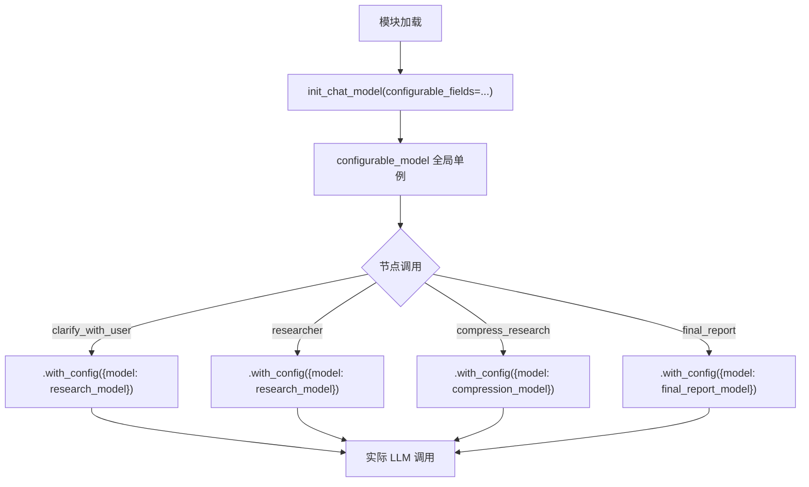
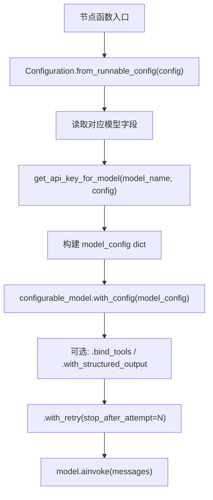
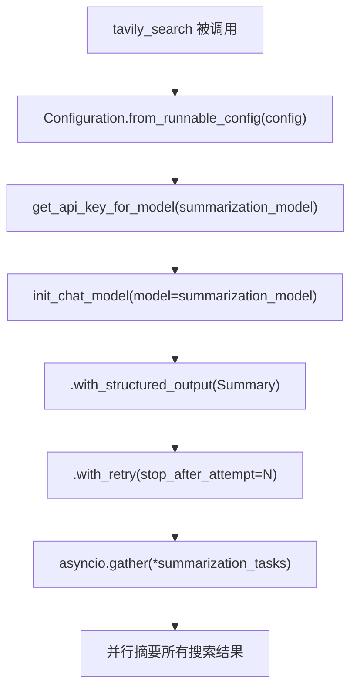

# PD-443.01 OpenDeepResearch — 四阶段模型路由与 configurable_fields 热切换

> 文档编号：PD-443.01
> 来源：OpenDeepResearch `src/open_deep_research/configuration.py`, `deep_researcher.py`, `utils.py`
> GitHub：https://github.com/langchain-ai/open_deep_research.git
> 问题域：PD-443 多模型路由 Multi-Model Routing
> 状态：可复用方案

---

## 第 1 章 问题与动机

### 1.1 核心问题

深度研究 Agent 的工作流包含多个阶段——搜索摘要、研究执行、结果压缩、最终报告——每个阶段对模型能力的需求截然不同。搜索摘要只需快速提取关键信息，用小模型即可；而最终报告需要综合推理和长文本生成，必须用强模型。如果全流程使用同一模型，要么成本过高（全用强模型），要么质量不足（全用弱模型）。

多模型路由的核心挑战是：如何在一个 LangGraph 工作流中，让不同节点使用不同模型，同时保持运行时可配置、支持多供应商切换、并感知各模型的 token 限制？

### 1.2 OpenDeepResearch 的解法概述

1. **四角色模型分离**：在 `Configuration` 类中定义 4 个独立模型字段——`summarization_model`、`research_model`、`compression_model`、`final_report_model`，每个都有独立的 `max_tokens` 配置（`configuration.py:121-212`）
2. **全局 configurable_model 单例**：通过 `init_chat_model(configurable_fields=("model", "max_tokens", "api_key"))` 创建一个可运行时配置的模型单例，所有节点共享同一实例但传入不同配置（`deep_researcher.py:56-58`）
3. **provider:model 命名约定**：所有模型名使用 `provider:model` 格式（如 `openai:gpt-4.1-mini`），`init_chat_model` 自动解析 provider 前缀并路由到对应 SDK（`configuration.py:122`）
4. **API Key 按 provider 自动分发**：`get_api_key_for_model()` 根据模型名前缀自动选择对应的环境变量或配置中的 API Key（`utils.py:892-914`）
5. **MODEL_TOKEN_LIMITS 全局映射表**：维护 40+ 模型的 token 限制映射，用于报告生成时的渐进式截断重试（`utils.py:788-829`）

### 1.3 设计思想

| 设计原则 | 具体实现 | 理由 | 替代方案 |
|----------|----------|------|----------|
| 按阶段分配模型 | 4 个独立模型字段 + 4 个 max_tokens 字段 | 不同阶段对能力/成本需求不同，细粒度控制 | 单一模型字段 + 全局 max_tokens |
| 运行时热切换 | `configurable_fields` + `with_config()` | 无需重启即可切换模型，支持 A/B 测试 | 每次创建新模型实例 |
| provider 自动路由 | `provider:model` 命名约定 | 一行代码支持 6+ 供应商，无需手动选择 SDK | 手动 if-else 判断 provider |
| token 限制感知 | 静态映射表 + 渐进式截断 | 不同模型上下文窗口差异巨大，需主动适配 | 统一假设固定上下文长度 |
| 双源 API Key | 环境变量 + config 配置双通道 | 本地开发用环境变量，云部署用 config 注入 | 仅支持环境变量 |

---

## 第 2 章 源码实现分析

### 2.1 架构概览

OpenDeepResearch 的多模型路由架构围绕一个核心设计：**全局 configurable_model 单例 + 节点级配置注入**。

```
┌─────────────────────────────────────────────────────────────────┐
│                    Configuration (Pydantic)                      │
│  ┌──────────────────┐  ┌──────────────────┐                     │
│  │ summarization_   │  │ research_model   │                     │
│  │ model            │  │ (gpt-4.1)        │                     │
│  │ (gpt-4.1-mini)   │  │ max_tokens:10000 │                     │
│  │ max_tokens:8192  │  │                  │                     │
│  └────────┬─────────┘  └────────┬─────────┘                     │
│  ┌────────┴─────────┐  ┌────────┴─────────┐                     │
│  │ compression_     │  │ final_report_    │                     │
│  │ model            │  │ model            │                     │
│  │ (gpt-4.1)        │  │ (gpt-4.1)        │                     │
│  │ max_tokens:8192  │  │ max_tokens:10000 │                     │
│  └──────────────────┘  └──────────────────┘                     │
└─────────────────────────────────────────────────────────────────┘
                              │
                    ┌─────────▼──────────┐
                    │  configurable_model │  ← init_chat_model(
                    │  (全局单例)          │     configurable_fields=
                    │                    │     ("model","max_tokens",
                    │                    │      "api_key"))
                    └─────────┬──────────┘
                              │ .with_config({...})
          ┌───────────────────┼───────────────────┐
          ▼                   ▼                   ▼
   ┌──────────────┐  ┌──────────────┐  ┌──────────────┐
   │ clarify_with │  │  researcher  │  │ final_report │
   │ _user        │  │  (ReAct)     │  │ _generation  │
   │              │  │              │  │              │
   │ research_    │  │ research_    │  │ final_report │
   │ model        │  │ model        │  │ _model       │
   └──────────────┘  └──────────────┘  └──────────────┘
          │                   │
          │          ┌────────┴────────┐
          │          ▼                 ▼
          │   ┌────────────┐   ┌────────────┐
          │   │ tavily_    │   │ compress_  │
          │   │ search     │   │ research   │
          │   │            │   │            │
          │   │ summarize_ │   │ compression│
          │   │ model      │   │ _model     │
          │   └────────────┘   └────────────┘
          │
   ┌──────▼──────────────────────────────────┐
   │  get_api_key_for_model(model_name)      │
   │  ├─ openai:*   → OPENAI_API_KEY        │
   │  ├─ anthropic:* → ANTHROPIC_API_KEY     │
   │  └─ google:*   → GOOGLE_API_KEY        │
   └─────────────────────────────────────────┘
```

### 2.2 核心实现

#### 2.2.1 全局 configurable_model 单例



对应源码 `src/open_deep_research/deep_researcher.py:56-58`：

```python
# Initialize a configurable model that we will use throughout the agent
configurable_model = init_chat_model(
    configurable_fields=("model", "max_tokens", "api_key"),
)
```

这是整个路由系统的核心。`init_chat_model` 不指定具体模型，而是声明三个可配置字段。后续每个节点通过 `.with_config()` 注入不同的模型名、token 限制和 API Key，实现同一实例的多模型复用。

#### 2.2.2 节点级模型配置注入



对应源码 `src/open_deep_research/deep_researcher.py:525-532`（compress_research 节点为例）：

```python
# Step 1: Configure the compression model
configurable = Configuration.from_runnable_config(config)
synthesizer_model = configurable_model.with_config({
    "model": configurable.compression_model,
    "max_tokens": configurable.compression_model_max_tokens,
    "api_key": get_api_key_for_model(configurable.compression_model, config),
    "tags": ["langsmith:nostream"]
})
```

每个节点遵循相同模式：从 `Configuration` 读取该阶段的模型名 → 获取对应 API Key → 构建 config dict → 注入到全局单例。这种模式在 `clarify_with_user`（L80-86）、`write_research_brief`（L134-139）、`supervisor`（L194-199）、`researcher`（L392-397）、`final_report_generation`（L627-632）中重复出现。

#### 2.2.3 summarization_model 的独立初始化



对应源码 `src/open_deep_research/utils.py:85-93`：

```python
# Initialize summarization model with retry logic
model_api_key = get_api_key_for_model(configurable.summarization_model, config)
summarization_model = init_chat_model(
    model=configurable.summarization_model,
    max_tokens=configurable.summarization_model_max_tokens,
    api_key=model_api_key,
    tags=["langsmith:nostream"]
).with_structured_output(Summary).with_retry(
    stop_after_attempt=configurable.max_structured_output_retries
)
```

注意：`summarization_model` 没有使用全局 `configurable_model` 单例，而是直接 `init_chat_model` 创建新实例。这是因为它在工具函数内部调用，需要 `.with_structured_output(Summary)` 绑定结构化输出，且每次搜索都可能并行创建多个摘要任务。

#### 2.2.4 API Key 按 provider 自动分发

对应源码 `src/open_deep_research/utils.py:892-914`：

```python
def get_api_key_for_model(model_name: str, config: RunnableConfig):
    """Get API key for a specific model from environment or config."""
    should_get_from_config = os.getenv("GET_API_KEYS_FROM_CONFIG", "false")
    model_name = model_name.lower()
    if should_get_from_config.lower() == "true":
        api_keys = config.get("configurable", {}).get("apiKeys", {})
        if not api_keys:
            return None
        if model_name.startswith("openai:"):
            return api_keys.get("OPENAI_API_KEY")
        elif model_name.startswith("anthropic:"):
            return api_keys.get("ANTHROPIC_API_KEY")
        elif model_name.startswith("google"):
            return api_keys.get("GOOGLE_API_KEY")
        return None
    else:
        if model_name.startswith("openai:"):
            return os.getenv("OPENAI_API_KEY")
        elif model_name.startswith("anthropic:"):
            return os.getenv("ANTHROPIC_API_KEY")
        elif model_name.startswith("google"):
            return os.getenv("GOOGLE_API_KEY")
        return None
```

双通道设计：`GET_API_KEYS_FROM_CONFIG` 环境变量控制 Key 来源。本地开发时从 `os.environ` 读取，LangGraph Cloud 部署时从 `config.configurable.apiKeys` 读取。

### 2.3 实现细节

#### token 限制感知与渐进式截断

`final_report_generation` 节点在遇到 token 超限时，不是简单报错，而是执行渐进式截断重试（`deep_researcher.py:639-683`）：

1. 第一次重试：查 `MODEL_TOKEN_LIMITS` 映射表获取模型上下文窗口，乘以 4 作为字符截断阈值
2. 后续重试：每次缩减 10%（`findings_token_limit * 0.9`）
3. 最多重试 3 次

`MODEL_TOKEN_LIMITS` 映射表（`utils.py:788-829`）覆盖 40+ 模型，包括 OpenAI、Anthropic、Google、Cohere、Mistral、Ollama、Bedrock 等供应商。

#### 多供应商 token 超限检测

`is_token_limit_exceeded()` 函数（`utils.py:665-701`）实现了跨供应商的统一 token 超限检测：

- 先从模型名前缀推断 provider
- 按 provider 调用专用检测函数（`_check_openai_token_limit`、`_check_anthropic_token_limit`、`_check_gemini_token_limit`）
- 如果 provider 未知，则遍历所有检测函数

每个 provider 的检测逻辑不同：OpenAI 检查 `BadRequestError` + token 关键词，Anthropic 检查 `prompt is too long`，Gemini 检查 `ResourceExhausted`。

---

## 第 3 章 迁移指南

### 3.1 迁移清单

**阶段 1：定义模型配置（1 个文件）**

- [ ] 创建 Pydantic `Configuration` 类，为每个工作流阶段定义独立的 `model` 和 `max_tokens` 字段
- [ ] 使用 `provider:model` 命名约定（如 `openai:gpt-4.1-mini`）
- [ ] 实现 `from_runnable_config()` 类方法，支持从环境变量和 RunnableConfig 双源读取

**阶段 2：创建全局 configurable_model（1 行代码）**

- [ ] 在图定义模块顶层调用 `init_chat_model(configurable_fields=("model", "max_tokens", "api_key"))`
- [ ] 确保该实例在所有节点间共享

**阶段 3：实现 API Key 分发（1 个函数）**

- [ ] 实现 `get_api_key_for_model(model_name, config)` 函数
- [ ] 按 `provider:` 前缀路由到对应的环境变量或 config 字段

**阶段 4：节点级配置注入（每个节点 5-8 行）**

- [ ] 在每个节点函数中：读取 Configuration → 获取 API Key → 构建 config dict → `configurable_model.with_config()`
- [ ] 按需链式调用 `.bind_tools()` / `.with_structured_output()` / `.with_retry()`

**阶段 5：token 限制感知（可选）**

- [ ] 维护 `MODEL_TOKEN_LIMITS` 映射表
- [ ] 在长文本生成节点实现渐进式截断重试

### 3.2 适配代码模板

```python
"""多模型路由适配模板 — 基于 OpenDeepResearch 方案"""

import os
from enum import Enum
from typing import Any, Optional

from langchain.chat_models import init_chat_model
from langchain_core.runnables import RunnableConfig
from pydantic import BaseModel, Field


# ── Step 1: 配置类 ──────────────────────────────────────────────

class PipelineConfig(BaseModel):
    """工作流配置，每个阶段独立模型。"""

    # 轻量任务：摘要、分类、提取
    light_model: str = Field(default="openai:gpt-4.1-mini")
    light_model_max_tokens: int = Field(default=4096)

    # 重量任务：推理、规划、生成
    heavy_model: str = Field(default="anthropic:claude-sonnet-4")
    heavy_model_max_tokens: int = Field(default=8192)

    @classmethod
    def from_runnable_config(cls, config: Optional[RunnableConfig] = None) -> "PipelineConfig":
        configurable = config.get("configurable", {}) if config else {}
        values = {
            field: os.environ.get(field.upper(), configurable.get(field))
            for field in cls.model_fields
        }
        return cls(**{k: v for k, v in values.items() if v is not None})


# ── Step 2: 全局 configurable_model ─────────────────────────────

configurable_model = init_chat_model(
    configurable_fields=("model", "max_tokens", "api_key"),
)


# ── Step 3: API Key 分发 ────────────────────────────────────────

PROVIDER_KEY_MAP = {
    "openai:": "OPENAI_API_KEY",
    "anthropic:": "ANTHROPIC_API_KEY",
    "google:": "GOOGLE_API_KEY",
    "groq:": "GROQ_API_KEY",
}

def get_api_key(model_name: str) -> Optional[str]:
    """根据 provider 前缀自动获取 API Key。"""
    model_lower = model_name.lower()
    for prefix, env_var in PROVIDER_KEY_MAP.items():
        if model_lower.startswith(prefix):
            return os.getenv(env_var)
    return None


# ── Step 4: 节点级配置注入 ──────────────────────────────────────

def get_model_for_stage(config: RunnableConfig, stage: str = "heavy"):
    """获取指定阶段的已配置模型实例。"""
    cfg = PipelineConfig.from_runnable_config(config)

    if stage == "light":
        model_name = cfg.light_model
        max_tokens = cfg.light_model_max_tokens
    else:
        model_name = cfg.heavy_model
        max_tokens = cfg.heavy_model_max_tokens

    return configurable_model.with_config({
        "model": model_name,
        "max_tokens": max_tokens,
        "api_key": get_api_key(model_name),
    })


# ── 使用示例 ────────────────────────────────────────────────────

async def summarize_node(state, config: RunnableConfig):
    """轻量模型处理摘要。"""
    model = get_model_for_stage(config, "light")
    return await model.ainvoke(state["messages"])

async def reasoning_node(state, config: RunnableConfig):
    """重量模型处理推理。"""
    model = get_model_for_stage(config, "heavy")
    return await model.ainvoke(state["messages"])
```

### 3.3 适用场景

| 场景 | 适用度 | 说明 |
|------|--------|------|
| LangGraph 多阶段工作流 | ⭐⭐⭐ | 完美匹配，直接复用 configurable_fields 模式 |
| 需要运行时切换模型的 SaaS | ⭐⭐⭐ | 用户可在 UI 上选择不同模型，通过 config 注入 |
| 多供应商容灾切换 | ⭐⭐ | 可扩展为 fallback 链，但原方案未实现自动 fallback |
| 单模型简单 Agent | ⭐ | 过度设计，直接用 init_chat_model 指定模型即可 |
| 非 LangChain 技术栈 | ⭐ | configurable_fields 是 LangChain 特有机制，需自行实现类似抽象 |

---

## 第 4 章 测试用例

```python
"""测试多模型路由核心功能 — 基于 OpenDeepResearch 真实接口"""

import os
from unittest.mock import AsyncMock, MagicMock, patch

import pytest
from langchain_core.runnables import RunnableConfig

# 假设已将适配模板中的代码放入 pipeline_config 模块
# from pipeline_config import PipelineConfig, get_api_key, get_model_for_stage


class TestPipelineConfig:
    """测试配置类的双源读取。"""

    def test_default_values(self):
        """默认配置应使用预设模型。"""
        cfg = PipelineConfig()
        assert cfg.light_model == "openai:gpt-4.1-mini"
        assert cfg.heavy_model == "anthropic:claude-sonnet-4"
        assert cfg.light_model_max_tokens == 4096

    def test_from_runnable_config_override(self):
        """RunnableConfig 应覆盖默认值。"""
        config: RunnableConfig = {
            "configurable": {
                "light_model": "google:gemini-1.5-flash",
                "heavy_model_max_tokens": 16384,
            }
        }
        cfg = PipelineConfig.from_runnable_config(config)
        assert cfg.light_model == "google:gemini-1.5-flash"
        assert cfg.heavy_model_max_tokens == 16384

    @patch.dict(os.environ, {"LIGHT_MODEL": "anthropic:claude-3-5-haiku"})
    def test_env_var_override(self):
        """环境变量应覆盖默认值。"""
        cfg = PipelineConfig.from_runnable_config(None)
        assert cfg.light_model == "anthropic:claude-3-5-haiku"


class TestGetApiKey:
    """测试 API Key 按 provider 分发。"""

    @patch.dict(os.environ, {"OPENAI_API_KEY": "sk-test-openai"})
    def test_openai_key(self):
        assert get_api_key("openai:gpt-4.1") == "sk-test-openai"

    @patch.dict(os.environ, {"ANTHROPIC_API_KEY": "sk-test-anthropic"})
    def test_anthropic_key(self):
        assert get_api_key("anthropic:claude-sonnet-4") == "sk-test-anthropic"

    @patch.dict(os.environ, {"GOOGLE_API_KEY": "goog-test"})
    def test_google_key(self):
        assert get_api_key("google:gemini-1.5-pro") == "goog-test"

    def test_unknown_provider_returns_none(self):
        assert get_api_key("unknown:some-model") is None


class TestTokenLimitDetection:
    """测试跨供应商 token 超限检测（基于 utils.py:665-701）。"""

    def test_openai_context_length_exceeded(self):
        """OpenAI BadRequestError 应被识别为 token 超限。"""
        exc = type("BadRequestError", (Exception,), {
            "__module__": "openai",
            "code": "context_length_exceeded",
            "type": "invalid_request_error",
        })("maximum context length exceeded")
        # is_token_limit_exceeded(exc, "openai:gpt-4.1") should return True

    def test_anthropic_prompt_too_long(self):
        """Anthropic prompt too long 应被识别为 token 超限。"""
        exc = type("BadRequestError", (Exception,), {
            "__module__": "anthropic",
        })("prompt is too long: 250000 tokens > 200000 maximum")
        # is_token_limit_exceeded(exc, "anthropic:claude-sonnet-4") should return True

    def test_normal_error_not_detected(self):
        """普通异常不应被误判为 token 超限。"""
        exc = ValueError("invalid argument")
        # is_token_limit_exceeded(exc) should return False


class TestModelTokenLimits:
    """测试 MODEL_TOKEN_LIMITS 映射表查询。"""

    def test_known_model_lookup(self):
        """已知模型应返回正确的 token 限制。"""
        from open_deep_research.utils import get_model_token_limit
        assert get_model_token_limit("openai:gpt-4.1") == 1047576
        assert get_model_token_limit("anthropic:claude-sonnet-4") == 200000

    def test_unknown_model_returns_none(self):
        """未知模型应返回 None。"""
        from open_deep_research.utils import get_model_token_limit
        assert get_model_token_limit("unknown:model-x") is None
```

---

## 第 5 章 跨域关联

| 关联域 | 关系类型 | 说明 |
|--------|----------|------|
| PD-01 上下文管理 | 依赖 | token 限制感知直接影响上下文窗口管理策略；`remove_up_to_last_ai_message` 是上下文压缩的一种形式 |
| PD-02 多 Agent 编排 | 协同 | supervisor 和 researcher 使用不同模型配置，模型路由是编排系统的基础设施 |
| PD-03 容错与重试 | 协同 | `is_token_limit_exceeded` 跨供应商检测 + 渐进式截断重试是容错机制的一部分 |
| PD-04 工具系统 | 协同 | 不同模型对工具调用的支持不同（如 Anthropic/OpenAI 原生搜索），模型选择影响可用工具集 |
| PD-11 可观测性 | 协同 | `tags=["langsmith:nostream"]` 标签用于 LangSmith 追踪，模型路由信息是可观测性的关键维度 |
| PD-436 多模型提供商管理 | 互补 | PD-436 (DeepAgents) 用 TOML 配置驱动，本方案用 Pydantic + configurable_fields，两种不同的配置管理范式 |

---

## 第 6 章 来源文件索引

| 文件 | 行范围 | 关键实现 |
|------|--------|----------|
| `src/open_deep_research/configuration.py` | L38-252 | Configuration 类：4 个模型字段 + 4 个 max_tokens 字段 + from_runnable_config |
| `src/open_deep_research/configuration.py` | L121-212 | 模型配置字段定义（summarization/research/compression/final_report） |
| `src/open_deep_research/deep_researcher.py` | L56-58 | 全局 configurable_model 单例初始化 |
| `src/open_deep_research/deep_researcher.py` | L80-94 | clarify_with_user 节点的模型配置注入 |
| `src/open_deep_research/deep_researcher.py` | L134-147 | write_research_brief 节点的模型配置注入 |
| `src/open_deep_research/deep_researcher.py` | L194-209 | supervisor 节点的模型配置注入 |
| `src/open_deep_research/deep_researcher.py` | L392-411 | researcher 节点的模型配置注入 |
| `src/open_deep_research/deep_researcher.py` | L525-532 | compress_research 节点使用 compression_model |
| `src/open_deep_research/deep_researcher.py` | L627-650 | final_report_generation 节点使用 final_report_model |
| `src/open_deep_research/deep_researcher.py` | L639-683 | 渐进式截断重试逻辑 |
| `src/open_deep_research/utils.py` | L85-93 | summarization_model 独立初始化（非 configurable_model） |
| `src/open_deep_research/utils.py` | L665-701 | is_token_limit_exceeded 跨供应商检测 |
| `src/open_deep_research/utils.py` | L788-829 | MODEL_TOKEN_LIMITS 全局映射表（40+ 模型） |
| `src/open_deep_research/utils.py` | L831-846 | get_model_token_limit 查询函数 |
| `src/open_deep_research/utils.py` | L892-914 | get_api_key_for_model 双源 API Key 分发 |

---

## 第 7 章 横向对比维度

```json comparison_data
{
  "project": "OpenDeepResearch",
  "dimensions": {
    "路由粒度": "四阶段独立模型：summarization/research/compression/final_report",
    "切换机制": "init_chat_model configurable_fields + with_config 运行时注入",
    "供应商支持": "provider:model 命名约定，自动路由 OpenAI/Anthropic/Google/Cohere/Mistral/Ollama/Bedrock",
    "token感知": "MODEL_TOKEN_LIMITS 静态映射表 + 渐进式截断重试（每次缩减10%）",
    "Key管理": "双通道：环境变量（本地）+ config.apiKeys（云部署），按 provider 前缀自动分发",
    "配置方式": "Pydantic BaseModel + x_oap_ui_config 元数据驱动 UI 表单"
  }
}
```

### 域元数据补充

```json domain_metadata
{
  "solution_summary": "OpenDeepResearch 用 init_chat_model configurable_fields 创建全局可配置模型单例，4 个阶段（摘要/研究/压缩/报告）各自注入不同 provider:model 配置，支持 7+ 供应商运行时热切换",
  "description": "通过 Pydantic 配置类与 LangChain configurable_fields 实现声明式多阶段模型绑定",
  "sub_problems": [
    "跨供应商 token 超限异常的统一检测与分类",
    "长文本生成时的渐进式截断重试策略",
    "本地开发与云部署的 API Key 双通道管理"
  ],
  "best_practices": [
    "用 provider:model 命名约定让 init_chat_model 自动路由到对应 SDK",
    "为每个模型字段配套独立的 max_tokens 字段实现细粒度控制",
    "token 超限时按 10% 递减截断重试而非直接失败"
  ]
}
```
