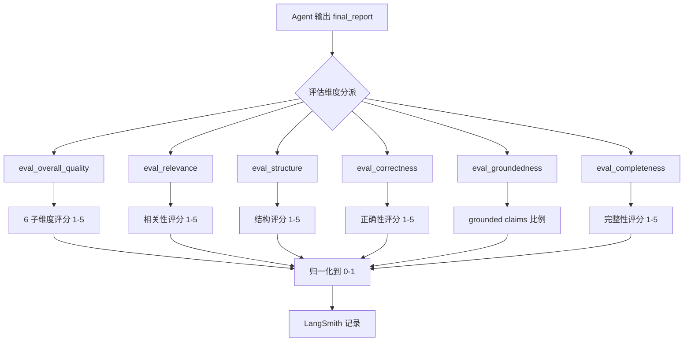
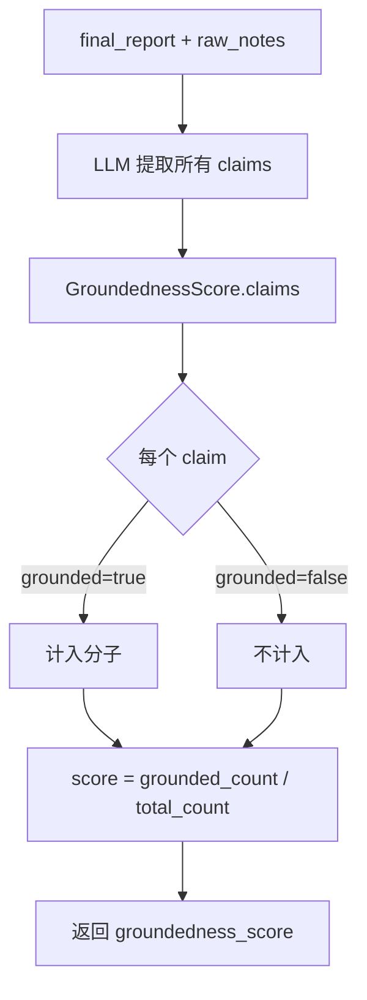
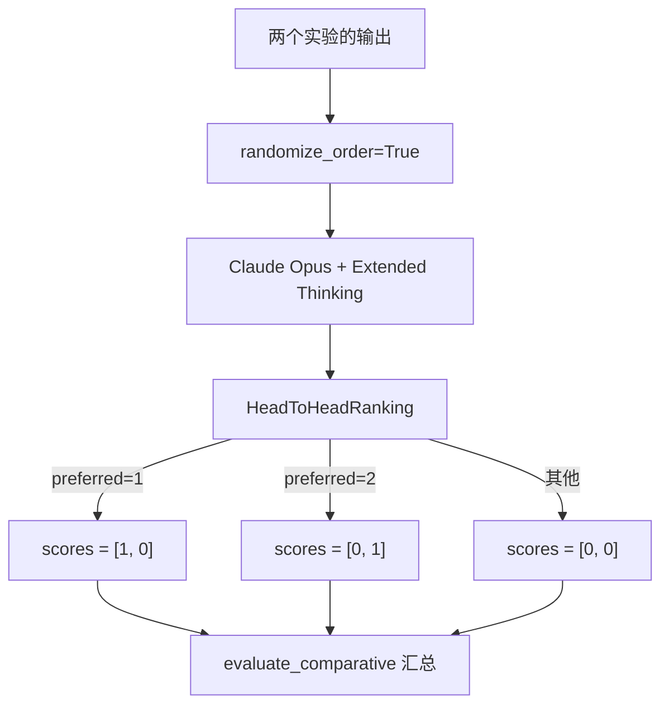

# PD-444.01 OpenDeepResearch — Eval-Driven Development 流水线

> 文档编号：PD-444.01
> 来源：OpenDeepResearch `tests/evaluators.py` `tests/run_evaluate.py` `tests/pairwise_evaluation.py`
> GitHub：https://github.com/langchain-ai/open_deep_research.git
> 问题域：PD-444 评估驱动开发 Eval-Driven Development
> 状态：可复用方案

---

## 第 1 章 问题与动机

### 1.1 核心问题

Deep Research Agent 的输出是长篇研究报告（通常 3000-10000 字），传统的精确匹配或 BLEU 等指标完全无法评估其质量。核心挑战包括：

1. **多维度质量评估**：研究报告的"好"不是单一维度——深度、准确性、来源质量、写作水平都需要独立衡量
2. **可复现的实验管理**：不同模型配置（GPT-4.1 vs GPT-5 vs Claude Sonnet 4）需要在相同数据集上公平对比
3. **跨系统对比**：不仅要评估自己的 Agent，还要与其他 Deep Research 实现进行 pairwise 对比
4. **结果标准化导出**：评估结果需要导出为标准格式提交到公共排行榜（HuggingFace Deep Research Bench）

没有系统化的评估流水线，Agent 开发就是"凭感觉调参"——无法量化改进，无法复现实验，无法与社区对比。

### 1.2 OpenDeepResearch 的解法概述

OpenDeepResearch 构建了一套完整的 Eval-Driven Development 流水线：

1. **8 维 LLM-as-Judge 评分体系**：6 个独立质量维度（depth/source/rigor/value/balance/writing）+ relevance + structure + correctness + groundedness + completeness，每个维度由专门的 Pydantic 模型和评估 prompt 驱动（`tests/evaluators.py:25-174`）
2. **LangSmith aevaluate 集成**：基于 LangSmith 的 `client.aevaluate()` 异步评估框架，支持 100 题并发评估、实验元数据记录、结果可视化（`tests/run_evaluate.py:63-86`）
3. **Pairwise 对比评估**：使用 Claude Opus + Extended Thinking 作为裁判，支持 2 路 head-to-head 和 3 路 free-for-all 排名（`tests/pairwise_evaluation.py:35-110`）
4. **Supervisor 并行评估**：验证 Supervisor 的并行分派行为是否正确（`tests/supervisor_parallel_evaluation.py:10-17`）
5. **JSONL 导出 → 排行榜提交**：从 LangSmith 提取实验数据，导出标准 JSONL 格式提交到 HuggingFace Deep Research Bench（`tests/extract_langsmith_data.py:13-58`）

### 1.3 设计思想

| 设计原则 | 具体实现 | 理由 | 替代方案 |
|----------|----------|------|----------|
| 维度正交性 | 每个评估维度独立函数+独立 Pydantic 模型 | 避免维度间干扰，可独立迭代 | 单一综合评分（丢失细节） |
| 评估模型与被评估模型分离 | 评估用 GPT-4.1，被评估用任意模型 | 避免自我评估偏差 | 人工评估（成本高不可扩展） |
| 配置即实验 | 所有参数通过 configurable 注入并记录到 metadata | 实验完全可复现 | 硬编码参数（无法追溯） |
| Extended Thinking 裁判 | Pairwise 评估用 Claude Opus + 16K thinking budget | 深度推理提升裁判质量 | 普通 LLM 直接输出（推理浅） |
| 标准化导出 | JSONL 格式对齐 Deep Research Bench 规范 | 可直接提交公共排行榜 | 自定义格式（无法对比） |

---

## 第 2 章 源码实现分析

### 2.1 架构概览

OpenDeepResearch 的评估系统由 5 个核心文件组成，形成完整的 EDD 流水线：

```
┌─────────────────────────────────────────────────────────────────┐
│                    Eval-Driven Development Pipeline              │
├─────────────────────────────────────────────────────────────────┤
│                                                                  │
│  ┌──────────────┐    ┌──────────────┐    ┌──────────────────┐   │
│  │  prompts.py  │───→│ evaluators.py│───→│ run_evaluate.py  │   │
│  │ (6 评估 Prompt)│    │ (8 评估函数)  │    │ (aevaluate 编排) │   │
│  └──────────────┘    └──────────────┘    └────────┬─────────┘   │
│                                                    │             │
│                                                    ▼             │
│  ┌──────────────────┐    ┌─────────────────────────────────┐    │
│  │ pairwise_eval.py │    │       LangSmith Platform        │    │
│  │ (A/B + 3路对比)   │    │  (实验追踪 + 结果可视化)         │    │
│  └──────────────────┘    └────────────┬────────────────────┘    │
│                                        │                         │
│  ┌──────────────────┐                  ▼                         │
│  │ supervisor_       │    ┌─────────────────────────────────┐    │
│  │ parallel_eval.py  │    │  extract_langsmith_data.py      │    │
│  │ (并行行为验证)     │    │  (JSONL 导出 → HF 排行榜)       │    │
│  └──────────────────┘    └─────────────────────────────────┘    │
│                                                                  │
└─────────────────────────────────────────────────────────────────┘
```

### 2.2 核心实现

#### 2.2.1 多维度 LLM-as-Judge 评分体系



对应源码 `tests/evaluators.py:25-55`：

```python
class OverallQualityScore(BaseModel):
    """Score the overall quality of the report against specific criteria."""
    research_depth: int = Field(description="Integer score 1-5 ...")
    source_quality: int = Field(description="Integer score 1-5 ...")
    analytical_rigor: int = Field(description="Integer score 1-5 ...")
    practical_value: int = Field(description="Integer score 1-5 ...")
    balance_and_objectivity: int = Field(description="Integer score 1-5 ...")
    writing_quality: int = Field(description="Integer score 1-5 ...")

def eval_overall_quality(inputs: dict, outputs: dict):
    query = _format_input_query(inputs)
    final_report = outputs["final_report"]
    eval_result = cast(OverallQualityScore,
        eval_model.with_structured_output(OverallQualityScore).invoke([
            {"role": "system", "content": OVERALL_QUALITY_PROMPT.format(today=get_today_str())},
            {"role": "user", "content": user_input_content}
        ]))
    return [
        {"key": "research_depth_score", "score": eval_result.research_depth / 5},
        {"key": "source_quality_score", "score": eval_result.source_quality / 5},
        # ... 6 个维度各自归一化到 0-1
    ]
```

关键设计点：
- 每个维度用独立的 Pydantic `BaseModel` 约束输出结构（`tests/evaluators.py:25-32`）
- 评分 1-5 整数，除以 5 归一化到 0-1 区间（`tests/evaluators.py:49-54`）
- `OverallQualityScore` 一次调用返回 6 个子维度，减少 LLM 调用次数
- 支持 Anthropic prompt caching（`cache_control: {"type": "ephemeral", "ttl": "1h"}`）（`tests/evaluators.py:39-43`）

#### 2.2.2 Groundedness 评估 — 基于 Claim 提取的事实核查



对应源码 `tests/evaluators.py:125-151`：

```python
class GroundednessClaim(BaseModel):
    claim: str = Field(description="The claim extracted from the report.")
    grounded: bool = Field(description="Whether the claim is grounded in the context.")

class GroundednessScore(BaseModel):
    claims: list[GroundednessClaim] = Field(
        description="All claims extracted from the report, and whether or not they are grounded.")

def eval_groundedness(inputs: dict, outputs: dict):
    final_report = outputs["final_report"]
    context = str(outputs["raw_notes"])
    eval_result = cast(GroundednessScore,
        eval_model.with_structured_output(GroundednessScore)
        .with_retry(stop_after_attempt=3)
        .invoke([{"role": "user", "content": GROUNDEDNESS_PROMPT.format(...)}]))
    grounded_claims = [c for c in eval_result.claims if c.grounded]
    return {"key": "groundedness_score",
            "score": len(grounded_claims) / len(eval_result.claims)}
```

关键设计点：
- 不是直接打分，而是先提取所有 claims 再逐一判断是否有依据（`tests/evaluators.py:130-132`）
- 使用 `with_retry(stop_after_attempt=3)` 容错（`tests/evaluators.py:146`）
- 评分 = grounded claims 数 / 总 claims 数，天然归一化（`tests/evaluators.py:150-151`）

#### 2.2.3 Pairwise 对比评估



对应源码 `tests/pairwise_evaluation.py:35-54`：

```python
def head_to_head_evaluator(inputs: dict, outputs: list[dict]) -> list:
    grader_llm = ChatAnthropic(
        model="claude-opus-4-20250514",
        max_tokens=20000,
        thinking={"type": "enabled", "budget_tokens": 16000},
    )
    response = grader_llm.with_structured_output(HeadToHeadRanking).invoke(
        HEAD_TO_HEAD_PROMPT.format(
            question=inputs["messages"][0]["content"],
            answer_a=outputs[0].get("final_report", "N/A"),
            answer_b=outputs[1].get("final_report", "N/A"),
        ))
    if response.preferred_answer == 1:
        scores = [1, 0]
    elif response.preferred_answer == 2:
        scores = [0, 1]
    else:
        scores = [0, 0]
    return scores
```

关键设计点：
- 使用 Claude Opus + Extended Thinking（16K budget）作为裁判（`tests/pairwise_evaluation.py:36-39`）
- `randomize_order=True` 消除位置偏差（`tests/pairwise_evaluation.py:127`）
- 支持 2 路 head-to-head 和 3 路 free-for-all 两种模式（`tests/pairwise_evaluation.py:92-110`）
- 3 路模式用 1/0.5/0 分值区分排名（`tests/pairwise_evaluation.py:107-109`）

### 2.3 实现细节

#### 实验配置与元数据追踪

`tests/run_evaluate.py` 的核心设计是"配置即实验"——所有影响 Agent 行为的参数都显式声明并记录到 LangSmith metadata：

```
run_evaluate.py:17-30 声明 14 个配置参数
  ├── max_concurrent_research_units = 10
  ├── search_api = "tavily"
  ├── research_model = "openai:gpt-5"
  ├── summarization_model = "openai:gpt-4.1-mini"
  └── ... 全部注入 config["configurable"]

run_evaluate.py:70-85 记录到 metadata
  └── client.aevaluate(metadata={...所有参数...})
```

这确保了：
- 每次实验的完整配置可追溯
- 不同实验之间可精确对比差异
- LangSmith UI 上可按 metadata 筛选和分组

#### JSONL 导出流水线

`tests/extract_langsmith_data.py:13-58` 实现了从 LangSmith 到 HuggingFace 排行榜的数据桥接：

1. 通过 `client.read_project()` 获取实验的 reference_dataset_id（`extract_langsmith_data.py:21`）
2. 通过 `client.list_examples()` 获取数据集中的所有样本（`extract_langsmith_data.py:24-28`）
3. 通过 `client.list_runs()` 获取实验运行结果（`extract_langsmith_data.py:31-39`）
4. 组装 `{id, prompt, article}` 格式的 JSONL（`extract_langsmith_data.py:41-47`）
5. 写入 `tests/expt_results/deep_research_bench_{model}.jsonl`（`extract_langsmith_data.py:50-54`）


---

## 第 3 章 迁移指南

### 3.1 迁移清单

**阶段 1：基础评估框架（1-2 天）**
- [ ] 安装依赖：`langsmith`, `langchain-openai`, `langchain-anthropic`, `pydantic`
- [ ] 创建 LangSmith 账号并获取 API Key
- [ ] 在 LangSmith 上创建评估数据集（≥20 条样本）
- [ ] 定义评估维度的 Pydantic 模型（参考 `OverallQualityScore`）
- [ ] 编写评估 prompt（参考 `tests/prompts.py` 的 6 个 prompt 模板）

**阶段 2：评估函数实现（1-2 天）**
- [ ] 实现各维度评估函数，遵循 `(inputs, outputs) -> dict` 签名
- [ ] 实现 groundedness 评估（claim 提取 + 事实核查模式）
- [ ] 添加 Anthropic prompt caching 支持（可选）
- [ ] 编写 `run_evaluate.py` 入口脚本

**阶段 3：对比评估（可选）**
- [ ] 实现 pairwise head-to-head 评估函数
- [ ] 配置 `evaluate_comparative` 调用
- [ ] 实现 JSONL 导出脚本

### 3.2 适配代码模板

#### 模板 1：通用多维度评估框架

```python
"""通用 Eval-Driven Development 框架 — 可直接复用"""
from typing import cast
from pydantic import BaseModel, Field
from langchain_openai import ChatOpenAI
from langsmith import Client

# 1. 定义评估维度 Pydantic 模型
class QualityScore(BaseModel):
    """自定义评估维度 — 根据你的 Agent 输出特点调整"""
    accuracy: int = Field(description="准确性评分 1-5")
    completeness: int = Field(description="完整性评分 1-5")
    coherence: int = Field(description="连贯性评分 1-5")

# 2. 评估 prompt 模板
QUALITY_PROMPT = """你是一个专业评估员。请评估以下 Agent 输出的质量。
用户问题：{question}
Agent 输出：{output}
按 accuracy/completeness/coherence 三个维度打分（1-5）。"""

# 3. 评估函数 — 遵循 LangSmith evaluator 签名
eval_model = ChatOpenAI(model="gpt-4.1")

def eval_quality(inputs: dict, outputs: dict):
    question = inputs["messages"][0]["content"]
    output_text = outputs.get("final_report", outputs.get("output", ""))
    result = cast(QualityScore,
        eval_model.with_structured_output(QualityScore).invoke([
            {"role": "system", "content": QUALITY_PROMPT.format(
                question=question, output=output_text)}
        ]))
    return [
        {"key": "accuracy", "score": result.accuracy / 5},
        {"key": "completeness", "score": result.completeness / 5},
        {"key": "coherence", "score": result.coherence / 5},
    ]

# 4. 运行评估
async def run_eval(target_fn, dataset_name: str, experiment_name: str, **metadata):
    client = Client()
    return await client.aevaluate(
        target_fn,
        data=dataset_name,
        evaluators=[eval_quality],
        experiment_prefix=experiment_name,
        max_concurrency=10,
        metadata=metadata,
    )
```

#### 模板 2：Pairwise 对比评估

```python
"""Pairwise 对比评估模板 — 使用 Extended Thinking 裁判"""
from pydantic import BaseModel, Field
from langchain_anthropic import ChatAnthropic
from langsmith.evaluation import evaluate_comparative

class PairwiseRanking(BaseModel):
    reasoning: str = Field(description="选择理由")
    preferred: int = Field(description="偏好答案 1 或 2")

COMPARE_PROMPT = """比较两个 Agent 的输出，选择更好的一个。
问题：{question}
Agent A：{answer_a}
Agent B：{answer_b}
"""

def pairwise_evaluator(inputs: dict, outputs: list[dict]) -> list:
    judge = ChatAnthropic(
        model="claude-opus-4-20250514",
        max_tokens=20000,
        thinking={"type": "enabled", "budget_tokens": 16000},
    )
    result = judge.with_structured_output(PairwiseRanking).invoke(
        COMPARE_PROMPT.format(
            question=inputs["messages"][0]["content"],
            answer_a=outputs[0].get("output", "N/A"),
            answer_b=outputs[1].get("output", "N/A"),
        ))
    return [1, 0] if result.preferred == 1 else [0, 1]

# 运行对比
evaluate_comparative(
    ("experiment_a_name", "experiment_b_name"),
    evaluators=[pairwise_evaluator],
    randomize_order=True,
)
```

### 3.3 适用场景

| 场景 | 适用度 | 说明 |
|------|--------|------|
| Deep Research Agent 质量评估 | ⭐⭐⭐⭐⭐ | 完全匹配，直接复用 |
| RAG 系统输出质量评估 | ⭐⭐⭐⭐ | groundedness 评估特别适合 |
| 多模型 A/B 测试 | ⭐⭐⭐⭐ | pairwise 评估 + LangSmith 实验追踪 |
| 代码生成 Agent 评估 | ⭐⭐⭐ | 需替换评估维度为代码质量相关 |
| 对话 Agent 评估 | ⭐⭐ | 需大幅调整评估维度和 prompt |
| 实时流式 Agent 评估 | ⭐ | 当前框架面向批量离线评估 |

---

## 第 4 章 测试用例

```python
"""基于 OpenDeepResearch 真实函数签名的测试用例"""
import pytest
from unittest.mock import MagicMock, patch, AsyncMock
from pydantic import BaseModel, Field


# ---- 测试 eval_overall_quality 的输入输出格式 ----

class TestEvalOverallQuality:
    """测试 eval_overall_quality 函数（tests/evaluators.py:34-55）"""

    def test_returns_six_dimension_scores(self):
        """正常路径：应返回 6 个维度的归一化分数"""
        mock_score = MagicMock()
        mock_score.research_depth = 4
        mock_score.source_quality = 3
        mock_score.analytical_rigor = 5
        mock_score.practical_value = 2
        mock_score.balance_and_objectivity = 4
        mock_score.writing_quality = 3

        with patch("tests.evaluators.eval_model") as mock_model:
            mock_model.with_structured_output.return_value.invoke.return_value = mock_score
            from tests.evaluators import eval_overall_quality
            result = eval_overall_quality(
                inputs={"messages": [{"content": "What is quantum computing?"}]},
                outputs={"final_report": "Quantum computing is..."}
            )

        assert len(result) == 6
        assert result[0] == {"key": "research_depth_score", "score": 0.8}
        assert all(0 <= r["score"] <= 1 for r in result)

    def test_single_message_input_format(self):
        """边界：单条消息输入应正确提取 query"""
        from tests.evaluators import _format_input_query
        result = _format_input_query({"messages": [{"content": "test query"}]})
        assert result == "test query"

    def test_multi_turn_input_format(self):
        """边界：多轮对话输入应格式化为 XML 标签"""
        from tests.evaluators import _format_input_query
        result = _format_input_query({"messages": [
            {"role": "user", "content": "initial question"},
            {"role": "assistant", "content": "clarification"},
            {"role": "user", "content": "follow up"},
        ]})
        assert "<user_input>" in result
        assert "<assistant_follow_up>" in result


class TestEvalGroundedness:
    """测试 eval_groundedness 函数（tests/evaluators.py:134-151）"""

    def test_all_claims_grounded(self):
        """正常路径：所有 claims 都有依据时 score=1.0"""
        mock_result = MagicMock()
        mock_result.claims = [
            MagicMock(grounded=True),
            MagicMock(grounded=True),
            MagicMock(grounded=True),
        ]
        with patch("tests.evaluators.eval_model") as mock_model:
            mock_model.with_structured_output.return_value.with_retry.return_value.invoke.return_value = mock_result
            from tests.evaluators import eval_groundedness
            result = eval_groundedness(
                inputs={"messages": [{"content": "test"}]},
                outputs={"final_report": "report", "raw_notes": "notes"}
            )
        assert result["score"] == 1.0

    def test_partial_grounding(self):
        """正常路径：部分 claims 有依据"""
        mock_result = MagicMock()
        mock_result.claims = [
            MagicMock(grounded=True),
            MagicMock(grounded=False),
        ]
        with patch("tests.evaluators.eval_model") as mock_model:
            mock_model.with_structured_output.return_value.with_retry.return_value.invoke.return_value = mock_result
            from tests.evaluators import eval_groundedness
            result = eval_groundedness(
                inputs={"messages": [{"content": "test"}]},
                outputs={"final_report": "report", "raw_notes": "notes"}
            )
        assert result["score"] == 0.5


class TestPairwiseEvaluation:
    """测试 pairwise 评估函数（tests/pairwise_evaluation.py:35-54）"""

    def test_head_to_head_prefers_first(self):
        """正常路径：裁判选择第一个答案"""
        mock_ranking = MagicMock()
        mock_ranking.preferred_answer = 1
        with patch("tests.pairwise_evaluation.ChatAnthropic") as mock_cls:
            mock_cls.return_value.with_structured_output.return_value.invoke.return_value = mock_ranking
            from tests.pairwise_evaluation import head_to_head_evaluator
            scores = head_to_head_evaluator(
                inputs={"messages": [{"content": "test question"}]},
                outputs=[{"final_report": "answer A"}, {"final_report": "answer B"}]
            )
        assert scores == [1, 0]

    def test_head_to_head_prefers_second(self):
        """正常路径：裁判选择第二个答案"""
        mock_ranking = MagicMock()
        mock_ranking.preferred_answer = 2
        with patch("tests.pairwise_evaluation.ChatAnthropic") as mock_cls:
            mock_cls.return_value.with_structured_output.return_value.invoke.return_value = mock_ranking
            from tests.pairwise_evaluation import head_to_head_evaluator
            scores = head_to_head_evaluator(
                inputs={"messages": [{"content": "test question"}]},
                outputs=[{"final_report": "answer A"}, {"final_report": "answer B"}]
            )
        assert scores == [0, 1]

    def test_head_to_head_tie(self):
        """降级：裁判无法决定时返回平局"""
        mock_ranking = MagicMock()
        mock_ranking.preferred_answer = 0
        with patch("tests.pairwise_evaluation.ChatAnthropic") as mock_cls:
            mock_cls.return_value.with_structured_output.return_value.invoke.return_value = mock_ranking
            from tests.pairwise_evaluation import head_to_head_evaluator
            scores = head_to_head_evaluator(
                inputs={"messages": [{"content": "test question"}]},
                outputs=[{"final_report": "answer A"}, {"final_report": "answer B"}]
            )
        assert scores == [0, 0]
```


---

## 第 5 章 跨域关联

| 关联域 | 关系类型 | 说明 |
|--------|----------|------|
| PD-11 可观测性 | 强依赖 | 评估流水线依赖 LangSmith 的实验追踪、结果可视化和数据导出能力。LangSmith 既是可观测性平台也是评估基础设施 |
| PD-01 上下文管理 | 协同 | 评估 prompt（如 OVERALL_QUALITY_PROMPT）本身很长，需要合理管理上下文窗口。Anthropic prompt caching 的使用体现了上下文管理意识 |
| PD-02 多 Agent 编排 | 协同 | supervisor_parallel_evaluation.py 专门验证 Supervisor 的并行分派行为是否正确，评估驱动了编排逻辑的质量保证 |
| PD-07 质量检查 | 互补 | PD-07 关注运行时质量检查（Agent 自检），PD-444 关注离线批量评估。两者共同构成完整的质量保证体系 |
| PD-08 搜索与检索 | 协同 | groundedness 评估直接检验搜索检索的质量——Agent 找到的 raw_notes 是否支撑了最终报告的 claims |
| PD-12 推理增强 | 协同 | Pairwise 评估使用 Extended Thinking（16K budget）增强裁判推理深度，体现了推理增强在评估场景的应用 |

---

## 第 6 章 来源文件索引

| 文件 | 行范围 | 关键实现 |
|------|--------|----------|
| `tests/evaluators.py` | L1-174 | 8 个评估函数 + 6 个 Pydantic 评分模型 |
| `tests/evaluators.py` | L25-55 | `OverallQualityScore` 6 维评分模型 + `eval_overall_quality` |
| `tests/evaluators.py` | L125-151 | `GroundednessClaim/Score` + claim 提取式事实核查 |
| `tests/prompts.py` | L1-257 | 6 个评估 prompt 模板（overall/correctness/relevance/structure/groundedness/completeness） |
| `tests/run_evaluate.py` | L1-90 | LangSmith aevaluate 编排入口 + 14 个实验配置参数 |
| `tests/run_evaluate.py` | L63-86 | `client.aevaluate()` 调用 + metadata 记录 |
| `tests/pairwise_evaluation.py` | L1-128 | head-to-head + free-for-all 对比评估 |
| `tests/pairwise_evaluation.py` | L35-54 | `head_to_head_evaluator` + Claude Opus Extended Thinking 裁判 |
| `tests/pairwise_evaluation.py` | L92-110 | `free_for_all_evaluator` 3 路排名 |
| `tests/supervisor_parallel_evaluation.py` | L1-61 | Supervisor 并行行为验证评估 |
| `tests/supervisor_parallel_evaluation.py` | L10-17 | `right_parallelism_evaluator` 并行分派正确性检查 |
| `tests/extract_langsmith_data.py` | L1-83 | LangSmith → JSONL 导出 + CLI 参数解析 |
| `tests/extract_langsmith_data.py` | L41-54 | JSONL 格式组装（id/prompt/article） |
| `src/open_deep_research/configuration.py` | L38-252 | 14 个可配置参数定义（评估时注入） |

---

## 第 7 章 横向对比维度

```json comparison_data
{
  "project": "OpenDeepResearch",
  "dimensions": {
    "评估维度": "8 维独立评估：6 子维度 overall + relevance/structure/correctness/groundedness/completeness",
    "评估模型": "GPT-4.1 做评估，Claude Opus + Extended Thinking 做 pairwise 裁判",
    "实验追踪": "LangSmith aevaluate 全托管，metadata 记录 14 个配置参数",
    "对比模式": "head-to-head 2 路 + free-for-all 3 路 + randomize_order 消除位置偏差",
    "排行榜集成": "JSONL 导出 → HuggingFace Deep Research Bench 公共排行榜",
    "事实核查": "claim 提取式 groundedness 评估，逐条判断是否有 raw_notes 支撑"
  }
}
```

### 域元数据补充

```json domain_metadata
{
  "solution_summary": "OpenDeepResearch 用 LangSmith aevaluate + 8 维 LLM-as-Judge + Claude Opus Extended Thinking pairwise 裁判构建完整 EDD 流水线，JSONL 导出对接 HuggingFace 排行榜",
  "description": "Agent 系统通过离线批量评估驱动迭代，用 LLM 裁判替代人工评审实现可扩展质量度量",
  "sub_problems": [
    "Supervisor 并行分派行为的正确性验证",
    "评估结果从平台到公共排行榜的标准化导出"
  ],
  "best_practices": [
    "用 claim 提取式 groundedness 评估替代直接打分实现细粒度事实核查",
    "Pairwise 评估用 randomize_order 消除位置偏差",
    "用 Extended Thinking 增强裁判推理深度提升对比评估质量",
    "将全部实验配置参数记录到 metadata 确保可复现性"
  ]
}
```

