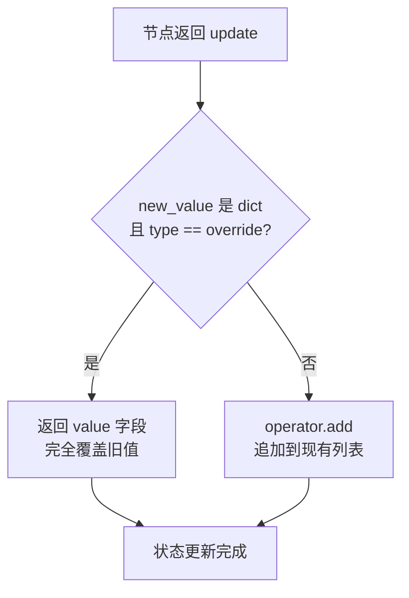
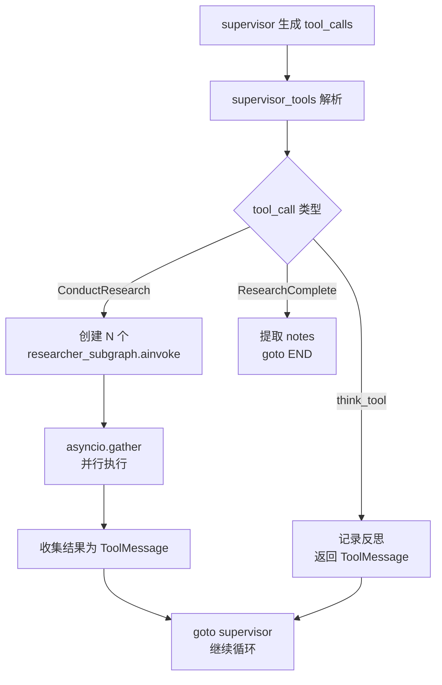
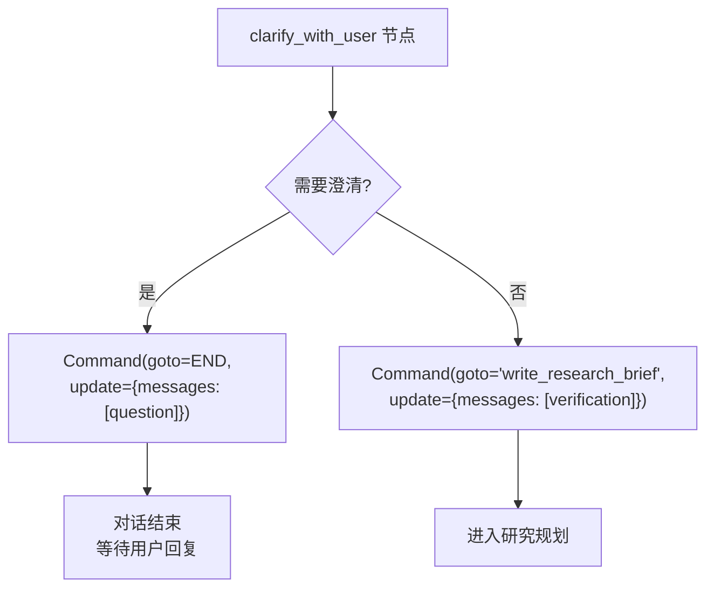
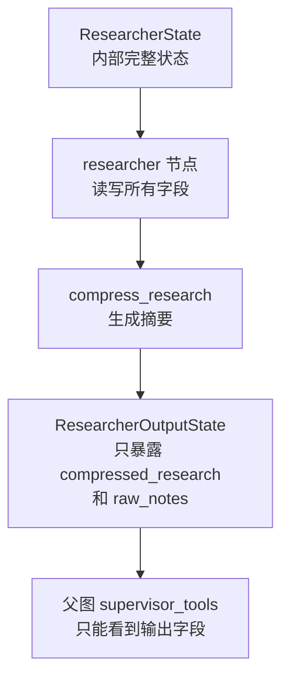

# PD-445.01 Open Deep Research — LangGraph 三层子图 + override_reducer 状态管理

> 文档编号：PD-445.01
> 来源：Open Deep Research `src/open_deep_research/deep_researcher.py`, `src/open_deep_research/state.py`, `src/legacy/graph.py`
> GitHub：https://github.com/langchain-ai/open_deep_research.git
> 问题域：PD-445 LangGraph 状态图模式 LangGraph State Graph Patterns
> 状态：可复用方案

---

## 第 1 章 问题与动机

### 1.1 核心问题

在构建复杂的多 Agent 研究系统时，LangGraph StateGraph 面临三个核心挑战：

1. **状态累积膨胀**：Annotated list 字段默认使用 `operator.add` reducer，消息和笔记只增不减，导致上下文窗口快速耗尽。需要一种机制在特定节点"重置"列表状态，而非永远追加。
2. **子图数据隔离**：主图（AgentState）、监督者子图（SupervisorState）、研究者子图（ResearcherState）各自需要不同的状态字段。如果共享同一个 State，字段污染和意外覆盖不可避免。
3. **动态并行分发**：研究任务数量在运行时由 LLM 决定（supervisor 可能一次发起 1-5 个 ConductResearch 调用），无法在编译期确定并行度。需要运行时动态创建并行分支。

### 1.2 Open Deep Research 的解法概述

Open Deep Research 通过以下 5 个关键设计解决上述问题：

1. **自定义 override_reducer**（`state.py:55-60`）：一个 12 行的 reducer 函数，通过检测 `{"type": "override", "value": ...}` 信号切换"覆盖"与"追加"双模式，让同一个 list 字段既能累积也能重置。
2. **三层嵌套子图**（`deep_researcher.py:701-719`）：主图嵌入 supervisor_subgraph，supervisor 内部通过 `asyncio.gather` 并行调用 researcher_subgraph，形成 main → supervisor → researcher 三层架构。
3. **Command 对象条件路由**（`deep_researcher.py:60-115`）：每个节点函数返回 `Command(goto=..., update=...)` 而非普通 dict，将路由决策和状态更新合并为原子操作。
4. **input/output schema 分离**（`deep_researcher.py:589-593`）：researcher_subgraph 使用 `ResearcherState` 作为内部状态、`ResearcherOutputState` 作为输出 schema，严格控制子图向父图暴露的数据。
5. **Send API 动态并行**（`legacy/graph.py:180-184, 465-469`）：legacy 版本使用 `Send()` API 在运行时动态创建并行节点实例，每个 section 独立执行搜索-写作循环。

### 1.3 设计思想

| 设计原则 | 具体实现 | 理由 | 替代方案 |
|----------|----------|------|----------|
| 双模式 reducer | `override_reducer` 检测 dict 信号切换 add/override | 避免为"可重置列表"创建两个字段 | 用两个字段分别存累积和临时数据 |
| 子图状态隔离 | 每层子图独立 TypedDict/BaseModel | 防止字段污染，明确数据边界 | 共享单一大 State，用前缀区分 |
| 原子路由+更新 | Command 对象封装 goto + update | 避免路由和状态更新分离导致的竞态 | conditional_edges + 普通 dict 返回 |
| 输出 schema 过滤 | StateGraph(output=OutputState) | 子图只暴露必要字段给父图 | 父图手动过滤子图返回值 |
| 运行时并行 | asyncio.gather + Send API | 并行度由 LLM 运行时决定，非编译期固定 | 固定 N 个 worker 节点 |

---

## 第 2 章 源码实现分析

### 2.1 架构概览

Open Deep Research 的 LangGraph 架构分为两个版本：新版（deep_researcher.py）采用三层子图 + asyncio.gather 并行，旧版（legacy/graph.py）采用两层子图 + Send API 并行。

```
┌─────────────────────────────────────────────────────────────┐
│                    Main Graph (AgentState)                    │
│  input=AgentInputState                                       │
│                                                              │
│  ┌──────────────┐   ┌────────────────┐   ┌───────────────┐  │
│  │ clarify_with │──→│ write_research │──→│  supervisor   │  │
│  │    _user     │   │    _brief      │   │  _subgraph    │  │
│  └──────────────┘   └────────────────┘   └───────┬───────┘  │
│        │ (Command:END)                           │           │
│        ↓                                         ↓           │
│     [用户澄清]                          ┌───────────────┐   │
│                                         │ final_report  │   │
│                                         │ _generation   │   │
│                                         └───────────────┘   │
│                                                              │
│  ┌─────────────────────────────────────────────────────┐     │
│  │         Supervisor Subgraph (SupervisorState)        │     │
│  │                                                      │     │
│  │  ┌────────────┐   ┌─────────────────┐               │     │
│  │  │ supervisor │←─→│ supervisor_tools │               │     │
│  │  └────────────┘   └────────┬────────┘               │     │
│  │                            │ asyncio.gather          │     │
│  │                   ┌────────┴────────┐                │     │
│  │                   ↓        ↓        ↓                │     │
│  │              ┌─────────────────────────┐             │     │
│  │              │  Researcher Subgraph ×N  │             │     │
│  │              │  (ResearcherState)       │             │     │
│  │              │  output=ResearcherOutput │             │     │
│  │              │                          │             │     │
│  │              │  researcher → tools →    │             │     │
│  │              │  compress_research       │             │     │
│  │              └─────────────────────────┘             │     │
│  └─────────────────────────────────────────────────────┘     │
└─────────────────────────────────────────────────────────────┘
```

### 2.2 核心实现

#### 2.2.1 override_reducer：双模式状态管理



对应源码 `src/open_deep_research/state.py:55-60`：

```python
def override_reducer(current_value, new_value):
    """Reducer function that allows overriding values in state."""
    if isinstance(new_value, dict) and new_value.get("type") == "override":
        return new_value.get("value", new_value)
    else:
        return operator.add(current_value, new_value)
```

使用示例 — `write_research_brief` 节点用 override 模式重置 supervisor_messages（`deep_researcher.py:163-175`）：

```python
return Command(
    goto="research_supervisor", 
    update={
        "research_brief": response.research_brief,
        "supervisor_messages": {
            "type": "override",
            "value": [
                SystemMessage(content=supervisor_system_prompt),
                HumanMessage(content=response.research_brief)
            ]
        }
    }
)
```

而 `supervisor` 节点用普通列表追加模式（`deep_researcher.py:217-223`）：

```python
return Command(
    goto="supervisor_tools",
    update={
        "supervisor_messages": [response],  # 普通 list → operator.add 追加
        "research_iterations": state.get("research_iterations", 0) + 1
    }
)
```

同一个 `supervisor_messages` 字段，在 `write_research_brief` 中被完全重置（override），在 `supervisor` 中被追加（add）。这是 override_reducer 的核心价值。

#### 2.2.2 三层子图嵌套与 asyncio.gather 并行



对应源码 `src/open_deep_research/deep_researcher.py:288-305`：

```python
if conduct_research_calls:
    try:
        # 限制并发数防止资源耗尽
        allowed_conduct_research_calls = conduct_research_calls[:configurable.max_concurrent_research_units]
        overflow_conduct_research_calls = conduct_research_calls[configurable.max_concurrent_research_units:]
        
        # 并行执行研究任务
        research_tasks = [
            researcher_subgraph.ainvoke({
                "researcher_messages": [
                    HumanMessage(content=tool_call["args"]["research_topic"])
                ],
                "research_topic": tool_call["args"]["research_topic"]
            }, config) 
            for tool_call in allowed_conduct_research_calls
        ]
        
        tool_results = await asyncio.gather(*research_tasks)
```

关键设计：
- **并发限制**：`max_concurrent_research_units`（默认 5）截断超额调用，溢出部分返回错误 ToolMessage（`deep_researcher.py:316-321`）
- **子图编译**：`researcher_subgraph = researcher_builder.compile()`（`deep_researcher.py:605`），编译后的子图作为可调用对象被 `ainvoke`

#### 2.2.3 Command 对象条件路由



对应源码 `src/open_deep_research/deep_researcher.py:104-115`：

```python
if response.need_clarification:
    return Command(
        goto=END, 
        update={"messages": [AIMessage(content=response.question)]}
    )
else:
    return Command(
        goto="write_research_brief", 
        update={"messages": [AIMessage(content=response.verification)]}
    )
```

Command 的优势在于将路由（goto）和状态更新（update）绑定为原子操作。对比 legacy 版本的 `human_feedback` 节点（`legacy/graph.py:180-192`），Command 还能嵌套 Send：

```python
if isinstance(feedback, bool) and feedback is True:
    return Command(goto=[
        Send("build_section_with_web_research", 
             {"topic": topic, "section": s, "search_iterations": 0}) 
        for s in sections if s.research
    ])
elif isinstance(feedback, str):
    return Command(goto="generate_report_plan", 
                   update={"feedback_on_report_plan": [feedback]})
```

#### 2.2.4 input/output schema 分离



对应源码 `src/open_deep_research/deep_researcher.py:589-605`：

```python
# Researcher 内部状态：包含 messages、iterations、topic 等
researcher_builder = StateGraph(
    ResearcherState, 
    output=ResearcherOutputState,  # 输出只暴露 compressed_research + raw_notes
    config_schema=Configuration
)
```

`ResearcherState`（`state.py:83-91`）有 4 个字段，但 `ResearcherOutputState`（`state.py:92-96`）只暴露 2 个：

```python
class ResearcherState(TypedDict):
    researcher_messages: Annotated[list[MessageLikeRepresentation], operator.add]
    tool_call_iterations: int = 0
    research_topic: str
    compressed_research: str
    raw_notes: Annotated[list[str], override_reducer] = []

class ResearcherOutputState(BaseModel):
    compressed_research: str
    raw_notes: Annotated[list[str], override_reducer] = []
```

主图同样使用 input schema 分离（`deep_researcher.py:701-705`）：

```python
deep_researcher_builder = StateGraph(
    AgentState,           # 内部状态：messages + supervisor_messages + notes + ...
    input=AgentInputState,  # 输入只接受 messages
    config_schema=Configuration
)
```

### 2.3 实现细节

#### Legacy 版本的 Send API 并行

legacy 版本（`legacy/graph.py:464-469`）使用 LangGraph 原生 Send API 实现编译期并行：

```python
def initiate_final_section_writing(state: ReportState):
    return [
        Send("write_final_sections", {
            "topic": state["topic"], 
            "section": s, 
            "report_sections_from_research": state["report_sections_from_research"]
        }) 
        for s in state["sections"] if not s.research
    ]
```

Send API 与 asyncio.gather 的关键区别：
- **Send**：LangGraph 框架级并行，每个 Send 创建独立的节点执行实例，状态通过 reducer 自动合并
- **asyncio.gather**：应用级并行，在单个节点内手动管理并发，结果手动聚合为 ToolMessage

新版选择 asyncio.gather 的原因：researcher_subgraph 是编译后的独立图，需要 `ainvoke` 调用而非 Send 分发。

#### 状态字段的 reducer 选择策略

| 字段 | reducer | 原因 |
|------|---------|------|
| `messages` | MessagesState 内置 | 对话历史只增不减 |
| `supervisor_messages` | override_reducer | 每轮研究需要重置系统提示 |
| `raw_notes` | override_reducer | 研究完成后需要清空 |
| `notes` | override_reducer | 最终报告生成后需要清空 |
| `researcher_messages` | operator.add | 单次研究内消息只追加 |
| `completed_sections` | operator.add | 各 section 并行完成后合并 |


---

## 第 3 章 迁移指南

### 3.1 迁移清单

**阶段 1：基础状态管理（1 个文件）**
- [ ] 实现 `override_reducer` 函数
- [ ] 定义主图 State（TypedDict），为需要重置的 list 字段标注 `Annotated[list, override_reducer]`
- [ ] 定义 InputState 和 OutputState 分离输入输出边界

**阶段 2：子图拆分（2-3 个文件）**
- [ ] 将独立功能模块提取为子图（StateGraph + compile）
- [ ] 为每个子图定义独立的 State 和 OutputState
- [ ] 在父图中用 `add_node("name", subgraph.compile())` 嵌入子图

**阶段 3：Command 路由（改造现有节点）**
- [ ] 将节点返回值从 `dict` 改为 `Command(goto=..., update=...)`
- [ ] 移除 `add_conditional_edges`，改用节点内 Command 路由
- [ ] 对需要动态并行的场景，在 Command.goto 中嵌套 Send 列表

**阶段 4：并行执行（可选）**
- [ ] 对子图调用改用 `asyncio.gather` 实现应用级并行
- [ ] 添加并发限制（max_concurrent）防止资源耗尽
- [ ] 为溢出调用返回错误消息

### 3.2 适配代码模板

#### 模板 1：override_reducer + 三层状态定义

```python
import operator
from typing import Annotated, Optional
from typing_extensions import TypedDict
from pydantic import BaseModel
from langgraph.graph import MessagesState, StateGraph, START, END
from langgraph.types import Command
from langchain_core.messages import MessageLikeRepresentation


def override_reducer(current_value, new_value):
    """支持覆盖和追加双模式的 reducer。
    
    用法：
    - 追加模式：update={"field": [new_item]}  → operator.add
    - 覆盖模式：update={"field": {"type": "override", "value": [new_list]}}
    """
    if isinstance(new_value, dict) and new_value.get("type") == "override":
        return new_value.get("value", new_value)
    return operator.add(current_value, new_value)


# 主图状态
class AgentInputState(MessagesState):
    """外部输入只接受 messages"""
    pass

class AgentState(MessagesState):
    """主图内部完整状态"""
    worker_messages: Annotated[list[MessageLikeRepresentation], override_reducer]
    notes: Annotated[list[str], override_reducer] = []
    final_output: str = ""

# 子图状态
class WorkerState(TypedDict):
    """Worker 子图内部状态"""
    worker_messages: Annotated[list[MessageLikeRepresentation], operator.add]
    task: str
    iterations: int

class WorkerOutputState(BaseModel):
    """Worker 子图只暴露结果"""
    result: str
    raw_data: Annotated[list[str], override_reducer] = []
```

#### 模板 2：Command 路由 + asyncio.gather 并行

```python
import asyncio
from typing import Literal
from langgraph.types import Command


async def dispatcher(state: DispatcherState, config) -> Command[Literal["dispatcher_tools"]]:
    """调度器节点：决定分发哪些任务"""
    model = get_model(config)
    response = await model.ainvoke(state["dispatcher_messages"])
    return Command(
        goto="dispatcher_tools",
        update={"dispatcher_messages": [response]}
    )


async def dispatcher_tools(state: DispatcherState, config) -> Command[Literal["dispatcher", "__end__"]]:
    """执行调度器的工具调用，包括并行子图调用"""
    messages = state["dispatcher_messages"]
    last_msg = messages[-1]
    
    if not last_msg.tool_calls or is_complete(last_msg):
        return Command(goto=END, update={"notes": extract_notes(messages)})
    
    # 并行执行子图
    task_calls = [tc for tc in last_msg.tool_calls if tc["name"] == "DoTask"]
    max_concurrent = config.get("configurable", {}).get("max_concurrent", 5)
    allowed = task_calls[:max_concurrent]
    overflow = task_calls[max_concurrent:]
    
    tasks = [
        worker_subgraph.ainvoke(
            {"worker_messages": [HumanMessage(content=tc["args"]["task"])],
             "task": tc["args"]["task"]},
            config
        )
        for tc in allowed
    ]
    results = await asyncio.gather(*tasks)
    
    tool_messages = [
        ToolMessage(content=r["result"], name=tc["name"], tool_call_id=tc["id"])
        for r, tc in zip(results, allowed)
    ]
    # 溢出调用返回错误
    for tc in overflow:
        tool_messages.append(ToolMessage(
            content=f"Error: exceeded max concurrent limit ({max_concurrent})",
            name=tc["name"], tool_call_id=tc["id"]
        ))
    
    return Command(goto="dispatcher", update={"dispatcher_messages": tool_messages})
```

### 3.3 适用场景

| 场景 | 适用度 | 说明 |
|------|--------|------|
| 多 Agent 研究/分析系统 | ⭐⭐⭐ | 核心场景：supervisor 分发 + researcher 并行执行 |
| 多步骤报告生成 | ⭐⭐⭐ | 各 section 独立研究后合并，天然适合子图 + Send |
| 对话式 Agent（需要状态重置） | ⭐⭐⭐ | override_reducer 解决多轮对话中的状态膨胀 |
| 简单线性工作流 | ⭐ | 过度设计，普通 StateGraph + dict 返回即可 |
| 实时流式交互 | ⭐⭐ | Command 路由支持，但 asyncio.gather 会阻塞直到所有子图完成 |

---

## 第 4 章 测试用例

```python
import operator
import pytest
from typing import Annotated
from typing_extensions import TypedDict


# ===== 测试 override_reducer =====

def override_reducer(current_value, new_value):
    if isinstance(new_value, dict) and new_value.get("type") == "override":
        return new_value.get("value", new_value)
    return operator.add(current_value, new_value)


class TestOverrideReducer:
    """测试 override_reducer 的双模式行为"""
    
    def test_append_mode_with_list(self):
        """普通列表追加"""
        current = ["a", "b"]
        new = ["c"]
        result = override_reducer(current, new)
        assert result == ["a", "b", "c"]
    
    def test_override_mode_replaces_entirely(self):
        """override 信号完全替换"""
        current = ["old1", "old2", "old3"]
        new = {"type": "override", "value": ["new1"]}
        result = override_reducer(current, new)
        assert result == ["new1"]
    
    def test_override_with_empty_list(self):
        """override 为空列表（清空状态）"""
        current = ["a", "b", "c"]
        new = {"type": "override", "value": []}
        result = override_reducer(current, new)
        assert result == []
    
    def test_append_mode_with_strings(self):
        """字符串追加（operator.add 对字符串是拼接）"""
        current = "hello "
        new = "world"
        result = override_reducer(current, new)
        assert result == "hello world"
    
    def test_dict_without_override_type_appends(self):
        """普通 dict（无 type=override）走追加路径"""
        current = [{"a": 1}]
        new = [{"b": 2}]
        result = override_reducer(current, new)
        assert result == [{"a": 1}, {"b": 2}]
    
    def test_override_preserves_value_type(self):
        """override 保持 value 的原始类型"""
        current = [1, 2, 3]
        new = {"type": "override", "value": [100]}
        result = override_reducer(current, new)
        assert result == [100]
        assert isinstance(result, list)


# ===== 测试状态 Schema 隔离 =====

class TestStateIsolation:
    """测试子图状态隔离设计"""
    
    def test_researcher_output_filters_internal_fields(self):
        """ResearcherOutputState 不包含内部字段"""
        from pydantic import BaseModel
        
        class ResearcherOutputState(BaseModel):
            compressed_research: str
            raw_notes: Annotated[list[str], override_reducer] = []
        
        output = ResearcherOutputState(
            compressed_research="summary",
            raw_notes=["note1"]
        )
        # 验证输出 schema 不包含 researcher_messages、tool_call_iterations 等内部字段
        assert hasattr(output, "compressed_research")
        assert hasattr(output, "raw_notes")
        assert not hasattr(output, "researcher_messages")
        assert not hasattr(output, "tool_call_iterations")
    
    def test_input_state_only_has_messages(self):
        """AgentInputState 只包含 messages 字段"""
        from langgraph.graph import MessagesState
        
        class AgentInputState(MessagesState):
            pass
        
        # MessagesState 只有 messages 字段
        fields = set(AgentInputState.__annotations__.keys())
        assert "messages" in fields or len(fields) == 0  # MessagesState 内置 messages


# ===== 测试并发限制逻辑 =====

class TestConcurrencyLimit:
    """测试并发限制和溢出处理"""
    
    def test_allowed_calls_within_limit(self):
        """并发数在限制内，全部执行"""
        calls = [{"id": f"call_{i}", "name": "ConductResearch", "args": {"research_topic": f"topic_{i}"}} for i in range(3)]
        max_concurrent = 5
        allowed = calls[:max_concurrent]
        overflow = calls[max_concurrent:]
        assert len(allowed) == 3
        assert len(overflow) == 0
    
    def test_overflow_calls_beyond_limit(self):
        """并发数超限，溢出部分被截断"""
        calls = [{"id": f"call_{i}", "name": "ConductResearch", "args": {"research_topic": f"topic_{i}"}} for i in range(8)]
        max_concurrent = 5
        allowed = calls[:max_concurrent]
        overflow = calls[max_concurrent:]
        assert len(allowed) == 5
        assert len(overflow) == 3
    
    def test_zero_calls_no_error(self):
        """零个调用不报错"""
        calls = []
        max_concurrent = 5
        allowed = calls[:max_concurrent]
        overflow = calls[max_concurrent:]
        assert len(allowed) == 0
        assert len(overflow) == 0
```


---

## 第 5 章 跨域关联

| 关联域 | 关系类型 | 说明 |
|--------|----------|------|
| PD-01 上下文管理 | 协同 | override_reducer 的核心动机就是控制上下文膨胀；`compress_research` 节点（`deep_researcher.py:511-585`）在子图内压缩研究结果，与上下文管理直接相关 |
| PD-02 多 Agent 编排 | 依赖 | 三层子图嵌套本质上是多 Agent 编排的实现方式；supervisor → researcher 的分发模式是 PD-02 的具体实例 |
| PD-03 容错与重试 | 协同 | `compress_research` 的 3 次重试 + token 超限时裁剪消息（`deep_researcher.py:544-574`）；`supervisor_tools` 的异常捕获降级（`deep_researcher.py:332-342`） |
| PD-04 工具系统 | 协同 | researcher 子图通过 `get_all_tools` 动态加载搜索工具和 MCP 工具（`utils.py:569-597`），工具系统设计影响子图的工具绑定方式 |
| PD-09 Human-in-the-Loop | 协同 | legacy 版本的 `human_feedback` 节点使用 `interrupt()` + Command 实现计划审批（`legacy/graph.py:170-192`）；新版 `clarify_with_user` 用 Command(goto=END) 实现用户澄清 |
| PD-10 中间件管道 | 互补 | LangGraph StateGraph 本身就是一种管道模式，但 Open Deep Research 没有使用中间件抽象，而是直接在节点函数中处理横切关注点 |

---

## 第 6 章 来源文件索引

| 文件 | 行范围 | 关键实现 |
|------|--------|----------|
| `src/open_deep_research/state.py` | L55-L60 | override_reducer 双模式 reducer |
| `src/open_deep_research/state.py` | L62-L96 | AgentInputState / AgentState / SupervisorState / ResearcherState / ResearcherOutputState 五层状态定义 |
| `src/open_deep_research/deep_researcher.py` | L60-L115 | clarify_with_user：Command 条件路由（END vs write_research_brief） |
| `src/open_deep_research/deep_researcher.py` | L118-L175 | write_research_brief：override 模式重置 supervisor_messages |
| `src/open_deep_research/deep_researcher.py` | L178-L223 | supervisor：LLM 调用 + Command 路由到 supervisor_tools |
| `src/open_deep_research/deep_researcher.py` | L225-L349 | supervisor_tools：asyncio.gather 并行调用 researcher_subgraph + 并发限制 |
| `src/open_deep_research/deep_researcher.py` | L351-L363 | supervisor_subgraph 构建与编译 |
| `src/open_deep_research/deep_researcher.py` | L365-L424 | researcher 节点：工具绑定 + Command 路由 |
| `src/open_deep_research/deep_researcher.py` | L435-L509 | researcher_tools：工具执行 + 迭代限制 + 退出条件 |
| `src/open_deep_research/deep_researcher.py` | L511-L585 | compress_research：研究压缩 + token 超限重试 |
| `src/open_deep_research/deep_researcher.py` | L587-L605 | researcher_subgraph 构建（output=ResearcherOutputState） |
| `src/open_deep_research/deep_researcher.py` | L607-L697 | final_report_generation：最终报告 + token 超限渐进截断 |
| `src/open_deep_research/deep_researcher.py` | L699-L719 | 主图构建：input=AgentInputState + 嵌入 supervisor_subgraph |
| `src/legacy/graph.py` | L142-L192 | human_feedback：interrupt + Command + Send 组合路由 |
| `src/legacy/graph.py` | L451-L469 | initiate_final_section_writing：Send API 动态并行 |
| `src/legacy/graph.py` | L471-L503 | legacy 两层子图构建（section_builder + builder） |
| `src/open_deep_research/configuration.py` | L38-L252 | Configuration：max_concurrent_research_units / max_researcher_iterations 等并发控制参数 |

---

## 第 7 章 横向对比维度

```json comparison_data
{
  "project": "OpenDeepResearch",
  "dimensions": {
    "状态管理": "override_reducer 双模式：dict 信号切换覆盖/追加",
    "子图架构": "三层嵌套：main → supervisor → researcher，编译后 ainvoke",
    "并行机制": "asyncio.gather 应用级并行 + max_concurrent 限流",
    "路由方式": "Command 对象封装 goto + update 原子操作",
    "数据边界": "input/output schema 分离，ResearcherOutputState 过滤内部字段",
    "状态重置": "override_reducer 支持运行时清空 list 字段"
  }
}
```

### 域元数据补充

```json domain_metadata
{
  "solution_summary": "Open Deep Research 用 override_reducer 双模式 reducer + 三层嵌套子图(main→supervisor→researcher) + asyncio.gather 并行实现复杂研究工作流的状态管理与动态分发",
  "description": "涵盖 LangGraph 编译子图的 ainvoke 调用模式与应用级并行策略",
  "sub_problems": [
    "asyncio.gather 应用级并行与 Send 框架级并行的选择",
    "编译后子图的 ainvoke 调用与状态传递"
  ],
  "best_practices": [
    "用 max_concurrent 限流防止并行子图资源耗尽",
    "compress_research 节点在子图内压缩结果控制输出体积"
  ]
}
```
