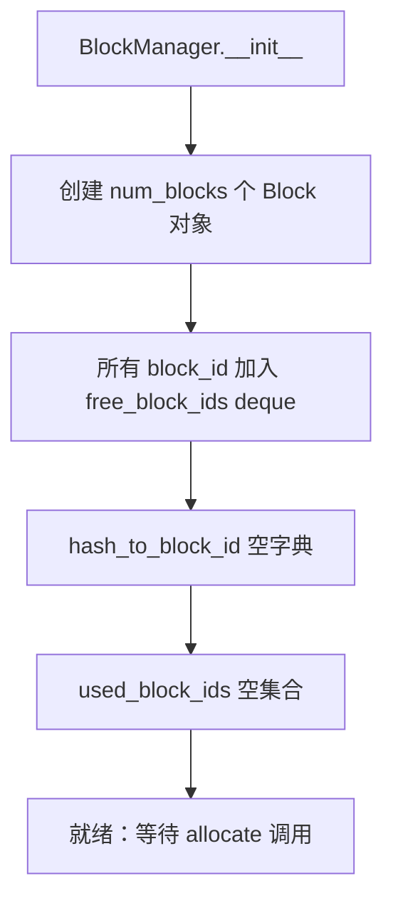
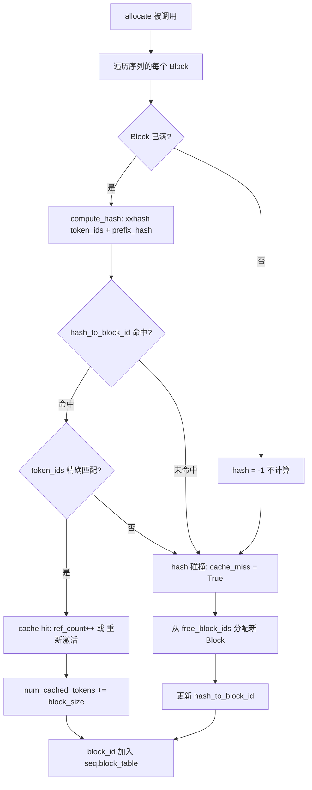
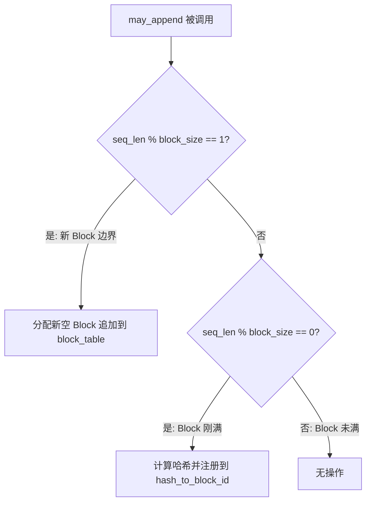

# PD-446.01 nano-vllm — 分页 KV Cache 与 xxhash 前缀缓存

> 文档编号：PD-446.01
> 来源：nano-vllm `nanovllm/engine/block_manager.py`
> GitHub：https://github.com/GeeeekExplorer/nano-vllm.git
> 问题域：PD-446 KV Cache 分页与前缀缓存 Paged KV Cache & Prefix Caching
> 状态：可复用方案

---

## 第 1 章 问题与动机

### 1.1 核心问题

LLM 推理中，KV Cache 是 Transformer 自回归解码的核心加速结构——每个 token 生成时需要访问之前所有 token 的 Key/Value 向量。随着序列长度和并发请求增长，KV Cache 面临两个关键挑战：

1. **内存碎片化**：朴素实现为每个序列预分配 `max_seq_len × num_layers × 2 × num_heads × head_dim` 的连续显存。实际序列长度远小于最大值时，大量显存被浪费。多个序列的分配/释放导致显存碎片化，降低 GPU 利用率。

2. **前缀重复计算**：批量推理中，多个请求可能共享相同的 system prompt 或 few-shot 示例。朴素实现对每个请求独立计算 KV Cache，造成大量冗余的 prefill 计算和显存占用。

这两个问题在高并发服务场景下尤为严重——显存是 GPU 推理的最稀缺资源，KV Cache 通常占据 30-60% 的 GPU 显存。

### 1.2 nano-vllm 的解法概述

nano-vllm 用极简代码（~113 行 `block_manager.py`）实现了 vLLM 论文的核心思想：

1. **分页管理**：将 KV Cache 显存划分为固定大小的 Block（默认 256 token），按需分配给序列，消除碎片（`block_manager.py:26-33`）
2. **引用计数**：每个 Block 维护 `ref_count`，支持多序列共享同一 Block，释放时仅当引用归零才回收（`block_manager.py:8-14`）
3. **内容哈希寻址**：用 xxhash 对 Block 内 token_ids 计算哈希，相同前缀的不同序列自动命中缓存（`block_manager.py:36-41`）
4. **链式哈希**：每个 Block 的哈希包含前一个 Block 的哈希作为前缀，形成哈希链，确保前缀匹配的精确性（`block_manager.py:38-39`）
5. **Triton 内核写入**：用自定义 Triton kernel 通过 slot_mapping 将 KV 写入分页缓存，避免 Python 循环开销（`attention.py:11-30`）

### 1.3 设计思想

| 设计原则 | 具体实现 | 理由 | 替代方案 |
|----------|----------|------|----------|
| 虚拟内存分页 | Block 固定 256 token，按需分配 | 消除预分配浪费，类似 OS 页式内存管理 | 连续分配（浪费显存）、Buddy System（实现复杂） |
| 内容寻址缓存 | xxhash(token_ids, prefix_hash) | O(1) 查找，快速判断前缀是否已缓存 | 前缀树 Trie（内存开销大）、序列 ID 匹配（不支持跨请求复用） |
| 引用计数生命周期 | ref_count 控制 Block 释放 | 简单可靠，支持多序列共享 | GC 标记清除（延迟高）、Copy-on-Write（实现复杂） |
| 延迟哈希更新 | 仅满 Block 计算哈希 | 未满 Block 内容不稳定，避免无效哈希 | 每次 append 都更新（计算浪费） |
| Triton 内核直写 | store_kvcache_kernel 按 slot_mapping 写入 | GPU 原生并行，零 Python 开销 | PyTorch scatter（额外内存）、CUDA kernel（开发成本高） |

---

## 第 2 章 源码实现分析

### 2.1 架构概览

nano-vllm 的 KV Cache 管理涉及 4 个核心组件，形成清晰的分层架构：

```
┌─────────────────────────────────────────────────────────────┐
│                      LLMEngine                               │
│  add_request() → Scheduler.schedule() → ModelRunner.run()   │
└──────────────────────┬──────────────────────────────────────┘
                       │
        ┌──────────────┴──────────────┐
        │         Scheduler           │
        │  waiting/running queues     │
        │  prefill / decode 调度      │
        └──────────┬──────────────────┘
                   │ allocate / deallocate / may_append
        ┌──────────┴──────────────────┐
        │       BlockManager          │
        │  blocks[] + free/used sets  │
        │  hash_to_block_id 缓存表    │
        │  xxhash 链式内容寻址        │
        └──────────┬──────────────────┘
                   │ block_table → slot_mapping
        ┌──────────┴──────────────────┐
        │    Attention (Triton)       │
        │  store_kvcache_kernel       │
        │  flash_attn_varlen_func     │
        │  flash_attn_with_kvcache    │
        └─────────────────────────────┘
```

数据流：Scheduler 通过 BlockManager 为序列分配 Block，生成 `block_table`（逻辑→物理映射）。ModelRunner 将 `block_table` 转换为 `slot_mapping`（token 级物理地址）。Attention 层的 Triton kernel 按 `slot_mapping` 将 KV 写入预分配的显存池，Flash Attention 按 `block_table` 读取。

### 2.2 核心实现

#### 2.2.1 Block 数据结构与 BlockManager 初始化



对应源码 `nanovllm/engine/block_manager.py:8-33`：

```python
class Block:
    def __init__(self, block_id):
        self.block_id = block_id
        self.ref_count = 0
        self.hash = -1
        self.token_ids = []

    def update(self, hash: int, token_ids: list[int]):
        self.hash = hash
        self.token_ids = token_ids

    def reset(self):
        self.ref_count = 1
        self.hash = -1
        self.token_ids = []

class BlockManager:
    def __init__(self, num_blocks: int, block_size: int):
        self.block_size = block_size
        self.blocks: list[Block] = [Block(i) for i in range(num_blocks)]
        self.hash_to_block_id: dict[int, int] = dict()
        self.free_block_ids: deque[int] = deque(range(num_blocks))
        self.used_block_ids: set[int] = set()
```

Block 是最小管理单元，每个 Block 持有 `block_id`（物理地址）、`ref_count`（引用计数）、`hash`（内容哈希，-1 表示未满/未计算）、`token_ids`（用于哈希碰撞时的精确比对）。BlockManager 维护三个索引：`blocks` 数组（O(1) 按 ID 访问）、`free_block_ids`（空闲池，deque 实现 O(1) 分配）、`hash_to_block_id`（内容寻址表）。

#### 2.2.2 分配与前缀缓存命中



对应源码 `nanovllm/engine/block_manager.py:36-82`：

```python
@classmethod
def compute_hash(cls, token_ids: list[int], prefix: int = -1):
    h = xxhash.xxh64()
    if prefix != -1:
        h.update(prefix.to_bytes(8, "little"))
    h.update(np.array(token_ids).tobytes())
    return h.intdigest()

def allocate(self, seq: Sequence):
    assert not seq.block_table
    h = -1
    cache_miss = False
    for i in range(seq.num_blocks):
        token_ids = seq.block(i)
        h = self.compute_hash(token_ids, h) if len(token_ids) == self.block_size else -1
        block_id = self.hash_to_block_id.get(h, -1)
        if block_id == -1 or self.blocks[block_id].token_ids != token_ids:
            cache_miss = True
        if cache_miss:
            block_id = self.free_block_ids[0]
            block = self._allocate_block(block_id)
        else:
            seq.num_cached_tokens += self.block_size
            if block_id in self.used_block_ids:
                block = self.blocks[block_id]
                block.ref_count += 1
            else:
                block = self._allocate_block(block_id)
        if h != -1:
            block.update(h, token_ids)
            self.hash_to_block_id[h] = block_id
        seq.block_table.append(block_id)
```

关键设计点：

- **链式哈希**（`block_manager.py:38-39`）：`compute_hash` 将前一个 Block 的哈希作为 prefix 参与当前 Block 的哈希计算。这确保了只有完全相同的前缀序列才会命中缓存——即使两个序列的第 N 个 Block 内容相同，如果前 N-1 个 Block 不同，哈希也不同。
- **碰撞处理**（`block_manager.py:67`）：哈希命中后还要比对 `token_ids`，防止 xxhash 碰撞导致错误复用。
- **cache_miss 传播**（`block_manager.py:68-69`）：一旦某个 Block 未命中，后续所有 Block 都标记为 miss（因为链式哈希依赖前缀连续性）。
- **延迟哈希**（`block_manager.py:65`）：最后一个不满的 Block 不计算哈希（`hash = -1`），因为它还会被 append 修改。

#### 2.2.3 Decode 阶段的增量 Block 管理



对应源码 `nanovllm/engine/block_manager.py:96-112`：

```python
def may_append(self, seq: Sequence):
    block_table = seq.block_table
    last_block = self.blocks[block_table[-1]]
    if len(seq) % self.block_size == 1:
        assert last_block.hash != -1
        block_id = self.free_block_ids[0]
        self._allocate_block(block_id)
        block_table.append(block_id)
    elif len(seq) % self.block_size == 0:
        assert last_block.hash == -1
        token_ids = seq.block(seq.num_blocks-1)
        prefix = self.blocks[block_table[-2]].hash if len(block_table) > 1 else -1
        h = self.compute_hash(token_ids, prefix)
        last_block.update(h, token_ids)
        self.hash_to_block_id[h] = last_block.block_id
```

`may_append` 在每次 decode step 后被调用。当序列长度刚好跨越 Block 边界（`% block_size == 1`），分配新 Block；当 Block 刚好填满（`% block_size == 0`），计算哈希并注册到缓存表，使该 Block 可被后续请求复用。

### 2.3 实现细节

#### KV Cache 显存池分配

ModelRunner 在初始化时一次性分配整个 KV Cache 显存池（`model_runner.py:100-118`）：

```python
def allocate_kv_cache(self):
    free, total = torch.cuda.mem_get_info()
    used = total - free
    peak = torch.cuda.memory_stats()["allocated_bytes.all.peak"]
    current = torch.cuda.memory_stats()["allocated_bytes.all.current"]
    block_bytes = 2 * hf_config.num_hidden_layers * self.block_size \
                  * num_kv_heads * head_dim * hf_config.torch_dtype.itemsize
    config.num_kvcache_blocks = int(
        total * config.gpu_memory_utilization - used - peak + current
    ) // block_bytes
    self.kv_cache = torch.empty(
        2, hf_config.num_hidden_layers, config.num_kvcache_blocks,
        self.block_size, num_kv_heads, head_dim
    )
```

策略：先 warmup 模型获取峰值显存，再用 `total × gpu_memory_utilization - peak` 计算剩余可用显存，除以单 Block 字节数得到 Block 总数。这个 6 维张量 `[2, layers, blocks, block_size, kv_heads, head_dim]` 就是整个 KV Cache 的物理存储，Block ID 直接对应第 3 维的索引。

#### Triton Kernel 的 slot_mapping 机制

`slot_mapping` 是 token 级的物理地址映射。ModelRunner 在 `prepare_prefill` 中将 `block_table` 展开为 `slot_mapping`（`model_runner.py:147-153`）：

```python
for i in range(seq.num_cached_blocks, seq.num_blocks):
    start = seq.block_table[i] * self.block_size
    end = start + (self.block_size if i != seq.num_blocks - 1
                   else seq.last_block_num_tokens)
    slot_mapping.extend(list(range(start, end)))
```

每个 token 的 slot = `block_id × block_size + offset`。Triton kernel `store_kvcache_kernel`（`attention.py:11-30`）按 slot 并行写入 KV，每个 GPU 线程处理一个 token。

#### 前缀缓存的 Prefill 优化

当序列有缓存命中时，`num_cached_tokens > 0`，prefill 只需计算未缓存部分的 KV（`model_runner.py:137-138`）：

```python
input_ids.extend(seq[seq.num_cached_tokens:])
positions.extend(list(range(seq.num_cached_tokens, seqlen)))
```

但 Attention 仍需访问完整的 KV（包括缓存部分），因此 `cu_seqlens_k` 包含完整长度，而 `cu_seqlens_q` 只包含新计算部分。当 `cu_seqlens_k[-1] > cu_seqlens_q[-1]` 时（`model_runner.py:154`），传入 `block_tables` 让 Flash Attention 从分页缓存中读取已缓存的 KV。


---

## 第 3 章 迁移指南

### 3.1 迁移清单

**阶段 1：基础分页 KV Cache（无前缀缓存）**

- [ ] 定义 Block 数据结构：`block_id`, `ref_count`, `token_ids`
- [ ] 实现 BlockManager：`free_block_ids` deque + `used_block_ids` set
- [ ] 实现 `allocate(seq)` / `deallocate(seq)` 基础分配释放
- [ ] 修改 KV Cache 显存分配：从连续张量改为 `[2, layers, num_blocks, block_size, kv_heads, head_dim]` 6 维池
- [ ] 实现 `block_table → slot_mapping` 转换逻辑
- [ ] 实现 Triton `store_kvcache_kernel` 或等效的 KV 写入逻辑
- [ ] 集成 Flash Attention 的 `block_table` 参数

**阶段 2：前缀缓存**

- [ ] 添加 `hash` 字段到 Block，实现 `compute_hash` 链式哈希
- [ ] 实现 `hash_to_block_id` 缓存表
- [ ] 修改 `allocate` 支持缓存命中路径（ref_count++ / 重新激活）
- [ ] 添加碰撞检测（哈希命中后比对 token_ids）
- [ ] 实现 `may_append` 的延迟哈希注册
- [ ] 修改 prefill 逻辑：缓存命中时跳过已缓存 token 的计算

**阶段 3：调度集成**

- [ ] 修改 Scheduler 的 prefill 路径：`num_batched_tokens += len(seq) - seq.num_cached_tokens`
- [ ] 实现 preempt（抢占）：deallocate 后重新入队
- [ ] 实现 decode 阶段的 `can_append` / `may_append` 调用

### 3.2 适配代码模板

以下是一个可独立运行的最小 BlockManager 实现，不依赖 nano-vllm 的其他模块：

```python
"""最小可运行的分页 KV Cache + 前缀缓存 BlockManager"""
from collections import deque
from dataclasses import dataclass, field
import xxhash
import numpy as np


@dataclass
class Block:
    block_id: int
    ref_count: int = 0
    hash: int = -1
    token_ids: list[int] = field(default_factory=list)

    def update(self, h: int, token_ids: list[int]):
        self.hash = h
        self.token_ids = token_ids

    def reset(self):
        self.ref_count = 1
        self.hash = -1
        self.token_ids = []


class PagedKVCacheManager:
    """分页 KV Cache 管理器，支持前缀缓存。

    用法:
        mgr = PagedKVCacheManager(num_blocks=1024, block_size=256)
        block_table = mgr.allocate(token_ids)  # 返回 block_id 列表
        num_cached = mgr.num_cached_tokens     # 前缀缓存命中的 token 数
        mgr.deallocate(block_table)            # 释放
    """

    def __init__(self, num_blocks: int, block_size: int = 256):
        self.block_size = block_size
        self.blocks = [Block(i) for i in range(num_blocks)]
        self.hash_to_block_id: dict[int, int] = {}
        self.free_ids: deque[int] = deque(range(num_blocks))
        self.used_ids: set[int] = set()
        self.num_cached_tokens = 0

    @staticmethod
    def _hash(token_ids: list[int], prefix: int = -1) -> int:
        h = xxhash.xxh64()
        if prefix != -1:
            h.update(prefix.to_bytes(8, "little"))
        h.update(np.array(token_ids).tobytes())
        return h.intdigest()

    def _alloc(self, block_id: int) -> Block:
        blk = self.blocks[block_id]
        blk.reset()
        self.free_ids.remove(block_id)
        self.used_ids.add(block_id)
        return blk

    def _dealloc(self, block_id: int):
        self.used_ids.remove(block_id)
        self.free_ids.append(block_id)

    def allocate(self, token_ids: list[int]) -> list[int]:
        """为 token 序列分配 Block，返回 block_table。"""
        bs = self.block_size
        num_blocks = (len(token_ids) + bs - 1) // bs
        if len(self.free_ids) < num_blocks:
            raise MemoryError(f"需要 {num_blocks} blocks，仅剩 {len(self.free_ids)}")

        block_table = []
        self.num_cached_tokens = 0
        h = -1
        cache_miss = False

        for i in range(num_blocks):
            chunk = token_ids[i * bs : (i + 1) * bs]
            h = self._hash(chunk, h) if len(chunk) == bs else -1
            bid = self.hash_to_block_id.get(h, -1)

            if bid == -1 or self.blocks[bid].token_ids != chunk:
                cache_miss = True

            if cache_miss:
                bid = self.free_ids[0]
                blk = self._alloc(bid)
            else:
                self.num_cached_tokens += bs
                if bid in self.used_ids:
                    self.blocks[bid].ref_count += 1
                    blk = self.blocks[bid]
                else:
                    blk = self._alloc(bid)

            if h != -1:
                blk.update(h, chunk)
                self.hash_to_block_id[h] = bid
            block_table.append(bid)

        return block_table

    def deallocate(self, block_table: list[int]):
        """释放 block_table 中的所有 Block。"""
        for bid in reversed(block_table):
            blk = self.blocks[bid]
            blk.ref_count -= 1
            if blk.ref_count == 0:
                self._dealloc(bid)
```

### 3.3 适用场景

| 场景 | 适用度 | 说明 |
|------|--------|------|
| 高并发 LLM 推理服务 | ⭐⭐⭐ | 核心场景，分页显著提升显存利用率 |
| 共享 system prompt 的批量请求 | ⭐⭐⭐ | 前缀缓存直接跳过重复 prefill |
| Few-shot 推理（共享示例） | ⭐⭐⭐ | 多请求共享相同 few-shot 前缀 |
| 单请求低并发场景 | ⭐ | 分页管理开销大于收益 |
| 超长序列（>32K token） | ⭐⭐ | 分页有效，但 block_size 需调优 |
| 流式对话（多轮） | ⭐⭐ | 前缀缓存可复用历史轮次的 KV |

---

## 第 4 章 测试用例

```python
"""基于 nano-vllm BlockManager 真实接口的测试用例"""
import pytest
from collections import deque


# ---- 最小 Block/BlockManager 实现（从适配模板复制） ----
# 实际使用时 import PagedKVCacheManager
# 这里内联以便独立运行

import xxhash
import numpy as np
from dataclasses import dataclass, field


@dataclass
class Block:
    block_id: int
    ref_count: int = 0
    hash: int = -1
    token_ids: list = field(default_factory=list)
    def update(self, h, tids): self.hash, self.token_ids = h, tids
    def reset(self): self.ref_count, self.hash, self.token_ids = 1, -1, []


class BlockManager:
    def __init__(self, num_blocks, block_size):
        self.block_size = block_size
        self.blocks = [Block(i) for i in range(num_blocks)]
        self.hash_to_block_id = {}
        self.free_block_ids = deque(range(num_blocks))
        self.used_block_ids = set()

    @classmethod
    def compute_hash(cls, token_ids, prefix=-1):
        h = xxhash.xxh64()
        if prefix != -1: h.update(prefix.to_bytes(8, "little"))
        h.update(np.array(token_ids).tobytes())
        return h.intdigest()

    def _allocate_block(self, block_id):
        blk = self.blocks[block_id]
        blk.reset()
        self.free_block_ids.remove(block_id)
        self.used_block_ids.add(block_id)
        return blk

    def _deallocate_block(self, block_id):
        self.used_block_ids.remove(block_id)
        self.free_block_ids.append(block_id)

    def num_free(self): return len(self.free_block_ids)


class TestBlockManagerBasic:
    """基础分页分配/释放"""

    def test_allocate_single_block(self):
        mgr = BlockManager(num_blocks=8, block_size=4)
        assert mgr.num_free() == 8
        blk = mgr._allocate_block(0)
        assert blk.ref_count == 1
        assert mgr.num_free() == 7
        assert 0 in mgr.used_block_ids

    def test_deallocate_returns_to_free(self):
        mgr = BlockManager(num_blocks=8, block_size=4)
        mgr._allocate_block(0)
        mgr.blocks[0].ref_count -= 1
        mgr._deallocate_block(0)
        assert mgr.num_free() == 8
        assert 0 not in mgr.used_block_ids

    def test_allocate_all_blocks(self):
        mgr = BlockManager(num_blocks=4, block_size=4)
        for i in range(4):
            mgr._allocate_block(i)
        assert mgr.num_free() == 0


class TestHashComputation:
    """xxhash 链式哈希"""

    def test_same_tokens_same_hash(self):
        h1 = BlockManager.compute_hash([1, 2, 3, 4])
        h2 = BlockManager.compute_hash([1, 2, 3, 4])
        assert h1 == h2

    def test_different_tokens_different_hash(self):
        h1 = BlockManager.compute_hash([1, 2, 3, 4])
        h2 = BlockManager.compute_hash([5, 6, 7, 8])
        assert h1 != h2

    def test_chain_hash_depends_on_prefix(self):
        """相同 token_ids 但不同 prefix → 不同哈希"""
        h1 = BlockManager.compute_hash([1, 2, 3, 4], prefix=100)
        h2 = BlockManager.compute_hash([1, 2, 3, 4], prefix=200)
        assert h1 != h2

    def test_chain_hash_no_prefix(self):
        """prefix=-1 时不参与哈希"""
        h1 = BlockManager.compute_hash([1, 2, 3, 4], prefix=-1)
        h2 = BlockManager.compute_hash([1, 2, 3, 4])
        assert h1 == h2


class TestPrefixCaching:
    """前缀缓存命中/碰撞"""

    def test_prefix_cache_hit(self):
        mgr = BlockManager(num_blocks=16, block_size=4)
        tokens_a = [1, 2, 3, 4, 5, 6, 7, 8, 9]  # 3 blocks: [1234][5678][9]
        tokens_b = [1, 2, 3, 4, 5, 6, 7, 8, 10]  # 共享前 2 个满 block

        h = BlockManager.compute_hash([1, 2, 3, 4])
        h2 = BlockManager.compute_hash([5, 6, 7, 8], h)

        # 注册前缀
        blk0 = mgr._allocate_block(0)
        blk0.update(h, [1, 2, 3, 4])
        mgr.hash_to_block_id[h] = 0

        blk1 = mgr._allocate_block(1)
        blk1.update(h2, [5, 6, 7, 8])
        mgr.hash_to_block_id[h2] = 1

        # 验证缓存命中
        lookup_h = BlockManager.compute_hash([1, 2, 3, 4])
        assert mgr.hash_to_block_id.get(lookup_h) == 0
        assert mgr.blocks[0].token_ids == [1, 2, 3, 4]

    def test_hash_collision_detected(self):
        """token_ids 不同但假设哈希相同时，应检测碰撞"""
        mgr = BlockManager(num_blocks=8, block_size=4)
        blk = mgr._allocate_block(0)
        blk.update(12345, [1, 2, 3, 4])
        mgr.hash_to_block_id[12345] = 0

        # 模拟碰撞：不同 token_ids 映射到相同哈希
        bid = mgr.hash_to_block_id.get(12345, -1)
        assert bid == 0
        assert mgr.blocks[bid].token_ids != [9, 9, 9, 9]  # 碰撞检测


class TestEdgeCases:
    """边界情况"""

    def test_empty_free_pool(self):
        mgr = BlockManager(num_blocks=1, block_size=4)
        mgr._allocate_block(0)
        assert mgr.num_free() == 0

    def test_ref_count_increment(self):
        mgr = BlockManager(num_blocks=4, block_size=4)
        blk = mgr._allocate_block(0)
        assert blk.ref_count == 1
        blk.ref_count += 1
        assert blk.ref_count == 2
        blk.ref_count -= 1
        assert blk.ref_count == 1
```


---

## 第 5 章 跨域关联

| 关联域 | 关系类型 | 说明 |
|--------|----------|------|
| PD-447 Tensor Parallelism | 协同 | KV Cache 的 `num_kv_heads` 按 `tensor_parallel_size` 切分，每个 GPU 只存储本地 KV heads 的分页缓存。BlockManager 运行在 rank 0，通过 SharedMemory 同步 block_table 到其他 rank |
| PD-448 CUDA Graph 优化 | 协同 | CUDA Graph capture 时需要固定 `block_tables`/`slot_mapping` 的最大尺寸，decode 阶段通过 `graph_vars` 填充实际值后 replay。分页缓存的 block_table 长度可变，需要 padding 到 `max_num_blocks` |
| PD-449 Continuous Batching | 依赖 | Scheduler 的 prefill/decode 两阶段调度依赖 BlockManager 的 `can_allocate`/`can_append` 判断。preempt（抢占）通过 `deallocate` 释放 Block 为高优先级请求腾出显存 |
| PD-452 GPU 显存管理 | 依赖 | `allocate_kv_cache` 基于 warmup 后的峰值显存计算可用 Block 数，`gpu_memory_utilization` 参数控制显存占比上限。Block 数量直接决定最大并发能力 |
| PD-451 Triton 自定义内核 | 协同 | `store_kvcache_kernel` 是 Triton JIT 编译的 GPU kernel，按 `slot_mapping` 并行写入分页 KV Cache，是分页机制在 GPU 端的关键实现 |
| PD-01 上下文管理 | 互补 | 分页 KV Cache 解决的是显存层面的上下文存储问题，与 token 层面的上下文窗口压缩（PD-01）互补——前者管理物理存储，后者管理逻辑内容 |

---

## 第 6 章 来源文件索引

| 文件 | 行范围 | 关键实现 |
|------|--------|----------|
| `nanovllm/engine/block_manager.py` | L1-113 | Block 数据结构、BlockManager 全部逻辑（分配/释放/前缀缓存/链式哈希） |
| `nanovllm/engine/block_manager.py` | L8-23 | Block 类：ref_count、hash、token_ids、reset/update |
| `nanovllm/engine/block_manager.py` | L26-33 | BlockManager 初始化：blocks 数组、free/used 集合、hash 缓存表 |
| `nanovllm/engine/block_manager.py` | L36-41 | compute_hash：xxhash 链式哈希，prefix 参与计算 |
| `nanovllm/engine/block_manager.py` | L59-82 | allocate：前缀缓存命中/miss 分支、碰撞检测、cache_miss 传播 |
| `nanovllm/engine/block_manager.py` | L84-91 | deallocate：逆序释放、ref_count 递减、归零回收 |
| `nanovllm/engine/block_manager.py` | L96-112 | may_append：decode 阶段增量 Block 管理、延迟哈希注册 |
| `nanovllm/engine/model_runner.py` | L100-118 | allocate_kv_cache：基于 warmup 峰值显存计算 Block 数、6 维张量分配 |
| `nanovllm/engine/model_runner.py` | L120-124 | prepare_block_tables：block_table → padded CUDA tensor |
| `nanovllm/engine/model_runner.py` | L126-162 | prepare_prefill：slot_mapping 生成、前缀缓存跳过已缓存 token |
| `nanovllm/engine/model_runner.py` | L164-180 | prepare_decode：单 token slot_mapping、context_lens |
| `nanovllm/layers/attention.py` | L11-30 | store_kvcache_kernel：Triton JIT kernel，按 slot 并行写入 KV |
| `nanovllm/layers/attention.py` | L43-75 | Attention.forward：prefill/decode 分支、前缀缓存时从 block_table 读取 |
| `nanovllm/engine/sequence.py` | L14-84 | Sequence：block_table、num_cached_tokens/blocks、block() 切片 |
| `nanovllm/engine/scheduler.py` | L8-71 | Scheduler：prefill/decode 调度、preempt 抢占、BlockManager 集成 |
| `nanovllm/config.py` | L7-27 | Config：kvcache_block_size=256、gpu_memory_utilization=0.9 |
| `nanovllm/utils/context.py` | L1-27 | Context dataclass：is_prefill、slot_mapping、block_tables 等运行时上下文 |

---

## 第 7 章 横向对比维度

> **重要：** 本章用于自动填充 Butcher Wiki 的横向对比表。

```json comparison_data
{
  "project": "nano-vllm",
  "dimensions": {
    "分页策略": "固定 256 token Block，deque 空闲池 O(1) 分配",
    "前缀缓存": "xxhash 链式哈希内容寻址，碰撞时 token_ids 精确比对",
    "引用计数": "Block 级 ref_count，多序列共享，归零即回收",
    "显存分配": "warmup 峰值探测后一次性分配 6 维张量池",
    "KV 写入": "Triton JIT kernel 按 slot_mapping 并行写入",
    "调度集成": "Scheduler 双阶段调度，preempt 抢占释放 Block"
  }
}
```

### 域元数据补充

```json domain_metadata
{
  "solution_summary": "nano-vllm 用 113 行 BlockManager 实现 vLLM 分页 KV Cache 核心，xxhash 链式哈希做前缀缓存，Triton kernel 按 slot_mapping 并行写入，warmup 峰值探测自动计算 Block 数量",
  "description": "分页 KV Cache 的调度器集成与 CUDA Graph 兼容性设计",
  "sub_problems": [
    "Decode 阶段 Block 边界跨越时的增量分配时机",
    "CUDA Graph 固定张量尺寸与可变 block_table 长度的兼容",
    "Preempt 抢占后序列重新入队的缓存失效处理"
  ],
  "best_practices": [
    "链式哈希将前一 Block 哈希作为 prefix 参与计算，确保前缀连续性",
    "cache_miss 一旦触发即传播到后续所有 Block，避免断裂的部分命中",
    "warmup 模型后用峰值显存差值计算可用 Block 数，最大化显存利用"
  ]
}
```

