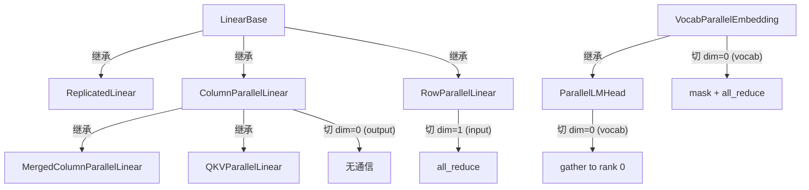
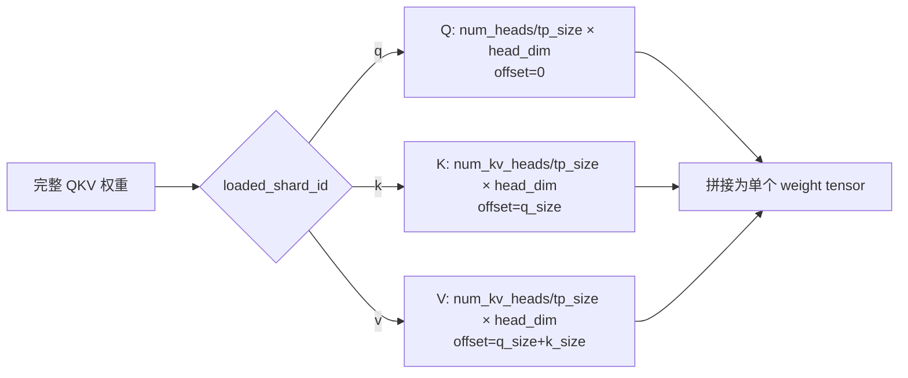
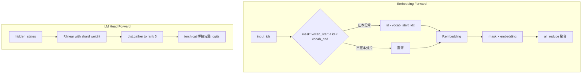

# PD-447.01 nano-vllm — 四层张量并行推理架构

> 文档编号：PD-447.01
> 来源：nano-vllm `nanovllm/layers/linear.py` `nanovllm/layers/embed_head.py` `nanovllm/engine/model_runner.py`
> GitHub：https://github.com/GeeeekExplorer/nano-vllm.git
> 问题域：PD-447 张量并行推理 Tensor Parallelism
> 状态：可复用方案

---

## 第 1 章 问题与动机

### 1.1 核心问题

大语言模型（LLM）的参数规模已远超单张 GPU 的显存容量。一个 70B 参数的模型在 FP16 下需要约 140GB 显存，而单张 A100/H100 最多 80GB。张量并行（Tensor Parallelism, TP）是解决这一问题的核心技术：将模型的权重矩阵沿特定维度切分到多张 GPU 上，每张 GPU 只持有权重的一个分片，通过 NCCL 集合通信（all_reduce / gather）在前向传播中同步中间结果。

关键挑战包括：
- **权重分片策略**：不同层（Attention QKV、MLP gate/up/down、Embedding、LM Head）需要不同的切分方式
- **通信开销最小化**：all_reduce 是同步阻塞操作，需要精心设计通信点位
- **进程间指令同步**：rank 0 需要将调度指令广播给所有 worker，传统 socket 方案延迟高
- **词表并行与 logits 聚合**：Embedding 和 LM Head 的词表维度切分需要特殊处理

### 1.2 nano-vllm 的解法概述

nano-vllm 用不到 300 行代码实现了完整的张量并行推理，设计极其精炼：

1. **四类并行 Linear 层**：`ColumnParallelLinear`（切输出维度）、`RowParallelLinear`（切输入维度 + all_reduce）、`QKVParallelLinear`（Q/K/V 异构分片）、`MergedColumnParallelLinear`（gate/up 合并分片）— `nanovllm/layers/linear.py:54-153`
2. **词表并行 Embedding + LM Head**：`VocabParallelEmbedding`（词表按 rank 分片 + mask + all_reduce）、`ParallelLMHead`（gather 聚合 logits）— `nanovllm/layers/embed_head.py:9-66`
3. **SharedMemory + Event 进程间通信**：rank 0 通过共享内存 pickle 序列化指令，Event 信号量通知 worker — `nanovllm/engine/model_runner.py:41-88`
4. **weight_loader 自动分片加载**：每个并行层自带 `weight_loader` 方法，加载时自动按 rank 切片 — `nanovllm/utils/loader.py:12-28`
5. **仅 rank 0 执行采样**：logits 只在 rank 0 聚合，采样仅在 rank 0 执行，减少不必要的通信 — `nanovllm/engine/model_runner.py:210-212`

### 1.3 设计思想

| 设计原则 | 具体实现 | 理由 | 替代方案 |
|----------|----------|------|----------|
| Megatron-LM 分片范式 | Column 切 dim=0，Row 切 dim=1 | 经典且通信最优：Column 无通信，Row 只需一次 all_reduce | Pipeline Parallelism（增加气泡） |
| 通信点最少化 | 每个 Transformer 层仅 2 次 all_reduce（Attention o_proj + MLP down_proj） | all_reduce 是同步阻塞，越少越好 | 每个 Linear 后都通信（开销翻倍） |
| SharedMemory 替代 socket | 1MB 共享内存 + pickle + Event 信号量 | 同机多进程场景下延迟远低于 TCP socket | gRPC / ZeroMQ / torch.distributed.rpc |
| weight_loader 绑定参数 | 每个 Parameter 挂载 weight_loader 回调 | 加载时自动分片，无需外部分片逻辑 | 预处理分片文件（需额外存储） |
| 非对称采样 | 仅 rank 0 gather logits 并采样 | 其他 rank 不需要完整 logits，节省通信 | 全 rank broadcast token_id（多一次通信） |

---

## 第 2 章 源码实现分析

### 2.1 架构概览

nano-vllm 的张量并行架构分为四层：

```
┌─────────────────────────────────────────────────────────────────┐
│                        LLMEngine (rank 0)                       │
│  ┌──────────┐  ┌───────────┐  ┌──────────────────────────────┐  │
│  │Scheduler │  │ Tokenizer │  │ ModelRunner (rank 0)         │  │
│  └──────────┘  └───────────┘  │  ┌─────────────────────────┐ │  │
│                               │  │ SharedMemory (1MB)      │ │  │
│                               │  │ write_shm() → Event.set │ │  │
│                               │  └────────┬────────────────┘ │  │
│                               └───────────┼──────────────────┘  │
└───────────────────────────────────────────┼─────────────────────┘
                    ┌───────────────────────┼───────────────────┐
                    ▼                       ▼                   ▼
        ┌──────────────────┐  ┌──────────────────┐  ┌──────────────────┐
        │ ModelRunner (r=1)│  │ ModelRunner (r=2)│  │ ModelRunner (r=N)│
        │ Event.wait()     │  │ Event.wait()     │  │ Event.wait()     │
        │ read_shm()       │  │ read_shm()       │  │ read_shm()       │
        │ loop()           │  │ loop()           │  │ loop()           │
        └──────────────────┘  └──────────────────┘  └──────────────────┘
                    │                       │                   │
                    └───────── NCCL all_reduce / gather ────────┘
```

每个 Transformer 层内部的通信模式：

```
Input x ──→ [QKV ColumnParallel] ──→ Attention ──→ [O RowParallel + all_reduce]
                                                            │
                                                            ▼
                                                   [gate_up ColumnParallel] ──→ SiLU ──→ [down RowParallel + all_reduce]
                                                                                                    │
                                                                                                    ▼
                                                                                              Output (synced)
```

### 2.2 核心实现

#### 2.2.1 权重分片层级体系



对应源码 `nanovllm/layers/linear.py:12-153`：

```python
class LinearBase(nn.Module):
    def __init__(self, input_size: int, output_size: int, bias: bool = False, tp_dim: int | None = None):
        super().__init__()
        self.tp_dim = tp_dim
        self.tp_rank = dist.get_rank()
        self.tp_size = dist.get_world_size()
        self.weight = nn.Parameter(torch.empty(output_size, input_size))
        self.weight.weight_loader = self.weight_loader  # 关键：绑定分片加载回调

class ColumnParallelLinear(LinearBase):
    def __init__(self, input_size: int, output_size: int, bias: bool = False):
        tp_size = dist.get_world_size()
        super().__init__(input_size, divide(output_size, tp_size), bias, 0)  # tp_dim=0, 切输出维度

    def weight_loader(self, param, loaded_weight):
        shard_size = param.data.size(self.tp_dim)
        start_idx = self.tp_rank * shard_size
        loaded_weight = loaded_weight.narrow(self.tp_dim, start_idx, shard_size)  # narrow 切片
        param.data.copy_(loaded_weight)

class RowParallelLinear(LinearBase):
    def __init__(self, input_size: int, output_size: int, bias: bool = False):
        tp_size = dist.get_world_size()
        super().__init__(divide(input_size, tp_size), output_size, bias, 1)  # tp_dim=1, 切输入维度

    def forward(self, x: torch.Tensor) -> torch.Tensor:
        y = F.linear(x, self.weight, self.bias if self.tp_rank == 0 else None)  # bias 仅 rank 0 加
        if self.tp_size > 1:
            dist.all_reduce(y)  # 关键：输入维度切分后需要 all_reduce 聚合
        return y
```

#### 2.2.2 QKV 异构分片



对应源码 `nanovllm/layers/linear.py:96-128`：

```python
class QKVParallelLinear(ColumnParallelLinear):
    def __init__(self, hidden_size, head_size, total_num_heads, total_num_kv_heads=None, bias=False):
        tp_size = dist.get_world_size()
        self.num_heads = divide(total_num_heads, tp_size)
        self.num_kv_heads = divide(total_num_kv_heads, tp_size)
        output_size = (total_num_heads + 2 * total_num_kv_heads) * self.head_size
        super().__init__(hidden_size, output_size, bias)

    def weight_loader(self, param, loaded_weight, loaded_shard_id: str):
        if loaded_shard_id == "q":
            shard_size = self.num_heads * self.head_size
            shard_offset = 0
        elif loaded_shard_id == "k":
            shard_size = self.num_kv_heads * self.head_size
            shard_offset = self.num_heads * self.head_size
        else:  # "v"
            shard_size = self.num_kv_heads * self.head_size
            shard_offset = self.num_heads * self.head_size + self.num_kv_heads * self.head_size
        param_data = param.data.narrow(self.tp_dim, shard_offset, shard_size)
        loaded_weight = loaded_weight.chunk(self.tp_size, self.tp_dim)[self.tp_rank]
        param_data.copy_(loaded_weight)
```

#### 2.2.3 词表并行与 logits 聚合



对应源码 `nanovllm/layers/embed_head.py:9-66`：

```python
class VocabParallelEmbedding(nn.Module):
    def __init__(self, num_embeddings, embedding_dim):
        self.num_embeddings_per_partition = num_embeddings // self.tp_size
        self.vocab_start_idx = self.num_embeddings_per_partition * self.tp_rank
        self.vocab_end_idx = self.vocab_start_idx + self.num_embeddings_per_partition
        self.weight = nn.Parameter(torch.empty(self.num_embeddings_per_partition, embedding_dim))

    def forward(self, x):
        if self.tp_size > 1:
            mask = (x >= self.vocab_start_idx) & (x < self.vocab_end_idx)
            x = mask * (x - self.vocab_start_idx)  # 偏移到本分片的局部索引
        y = F.embedding(x, self.weight)
        if self.tp_size > 1:
            y = mask.unsqueeze(1) * y  # 不属于本分片的位置置零
            dist.all_reduce(y)         # 聚合所有分片的结果
        return y

class ParallelLMHead(VocabParallelEmbedding):
    def forward(self, x):
        logits = F.linear(x, self.weight)  # 每个 rank 计算局部 logits
        if self.tp_size > 1:
            all_logits = [torch.empty_like(logits) for _ in range(self.tp_size)] if self.tp_rank == 0 else None
            dist.gather(logits, all_logits, 0)  # 只 gather 到 rank 0
            logits = torch.cat(all_logits, -1) if self.tp_rank == 0 else None
        return logits
```

### 2.3 实现细节

#### SharedMemory + Event 进程间指令分发

nano-vllm 不使用 `torch.distributed` 的 broadcast 来同步调度指令，而是用 `multiprocessing.SharedMemory` + `Event` 实现了一个极轻量的 IPC 机制：

- rank 0 创建 1MB 共享内存（`nanovllm/engine/model_runner.py:43`）
- 指令通过 `pickle.dumps` 序列化写入共享内存前 4 字节存长度，后续存数据（`model_runner.py:76-83`）
- worker 通过 `Event.wait()` 阻塞等待，收到信号后从共享内存反序列化指令（`model_runner.py:68-73`）
- worker 进入 `loop()` 无限循环，收到 `"exit"` 指令时退出（`model_runner.py:61-66`）

进程启动流程（`nanovllm/engine/llm_engine.py:17-30`）：

```python
class LLMEngine:
    def __init__(self, model, **kwargs):
        ctx = mp.get_context("spawn")
        for i in range(1, config.tensor_parallel_size):
            event = ctx.Event()
            process = ctx.Process(target=ModelRunner, args=(config, i, event))
            process.start()
        self.model_runner = ModelRunner(config, 0, self.events)  # rank 0 在主进程
```

关键设计：rank 0 的 `ModelRunner.__init__` 中，非 rank 0 的进程在初始化完成后直接进入 `self.loop()`（`model_runner.py:48`），永远不会返回到 `LLMEngine`。这意味着 worker 进程的整个生命周期都在 `ModelRunner` 内部管理。

#### KV Cache 按 TP 分片

KV Cache 的 `num_kv_heads` 按 `world_size` 均分（`model_runner.py:107`）：

```python
num_kv_heads = hf_config.num_key_value_heads // self.world_size
self.kv_cache = torch.empty(2, hf_config.num_hidden_layers, config.num_kvcache_blocks, 
                            self.block_size, num_kv_heads, head_dim)
```

每个 rank 只分配自己负责的 KV heads 对应的缓存空间，显存占用线性下降。

#### packed_modules_mapping 权重映射

模型定义中的 `packed_modules_mapping`（`nanovllm/models/qwen3.py:186-192`）将 HuggingFace checkpoint 中分离的 `q_proj/k_proj/v_proj` 映射到合并的 `qkv_proj`，将 `gate_proj/up_proj` 映射到合并的 `gate_up_proj`。`load_model`（`nanovllm/utils/loader.py:12-28`）在加载时自动处理这个映射，调用对应的 `weight_loader` 并传入 `shard_id`。


---

## 第 3 章 迁移指南

### 3.1 迁移清单

**阶段 1：基础并行层（1-2 天）**
- [ ] 实现 `LinearBase` 基类，包含 `tp_dim`、`tp_rank`、`tp_size` 和 `weight_loader` 绑定
- [ ] 实现 `ColumnParallelLinear`：`output_size // tp_size`，`tp_dim=0`
- [ ] 实现 `RowParallelLinear`：`input_size // tp_size`，`tp_dim=1`，forward 中 `dist.all_reduce`
- [ ] 实现 `ReplicatedLinear`：不分片的层（如 LayerNorm 后的投影）

**阶段 2：复合并行层（1 天）**
- [ ] 实现 `MergedColumnParallelLinear`：支持多个输出合并（gate + up）
- [ ] 实现 `QKVParallelLinear`：Q/K/V 异构 head 数分片
- [ ] 实现 `VocabParallelEmbedding`：词表按 rank 分片 + mask + all_reduce
- [ ] 实现 `ParallelLMHead`：gather logits 到 rank 0

**阶段 3：进程管理与通信（1 天）**
- [ ] 实现 SharedMemory + Event IPC 机制
- [ ] 实现 worker loop 和指令分发
- [ ] 实现 NCCL 进程组初始化
- [ ] 实现 KV Cache 按 TP 分片分配

**阶段 4：权重加载（半天）**
- [ ] 实现 `weight_loader` 回调机制
- [ ] 实现 `packed_modules_mapping` 权重名映射
- [ ] 验证 safetensors 分片加载正确性

### 3.2 适配代码模板

以下是一个可直接复用的最小张量并行 Linear 层实现：

```python
import torch
from torch import nn
import torch.nn.functional as F
import torch.distributed as dist


def divide(numerator: int, denominator: int) -> int:
    assert numerator % denominator == 0, f"{numerator} not divisible by {denominator}"
    return numerator // denominator


class ColumnParallelLinear(nn.Module):
    """切输出维度，前向无通信。用于 Attention QKV、MLP gate/up。"""

    def __init__(self, input_size: int, output_size: int, bias: bool = False):
        super().__init__()
        self.tp_rank = dist.get_rank()
        self.tp_size = dist.get_world_size()
        self.output_size_per_partition = divide(output_size, self.tp_size)
        self.weight = nn.Parameter(torch.empty(self.output_size_per_partition, input_size))
        self.bias = nn.Parameter(torch.empty(self.output_size_per_partition)) if bias else None

    def load_weight(self, full_weight: torch.Tensor):
        shard = full_weight.narrow(0, self.tp_rank * self.output_size_per_partition,
                                   self.output_size_per_partition)
        self.weight.data.copy_(shard)

    def forward(self, x: torch.Tensor) -> torch.Tensor:
        return F.linear(x, self.weight, self.bias)


class RowParallelLinear(nn.Module):
    """切输入维度，前向 all_reduce。用于 Attention o_proj、MLP down_proj。"""

    def __init__(self, input_size: int, output_size: int, bias: bool = False):
        super().__init__()
        self.tp_rank = dist.get_rank()
        self.tp_size = dist.get_world_size()
        self.input_size_per_partition = divide(input_size, self.tp_size)
        self.weight = nn.Parameter(torch.empty(output_size, self.input_size_per_partition))
        self.bias = nn.Parameter(torch.empty(output_size)) if bias else None

    def load_weight(self, full_weight: torch.Tensor):
        shard = full_weight.narrow(1, self.tp_rank * self.input_size_per_partition,
                                   self.input_size_per_partition)
        self.weight.data.copy_(shard)

    def forward(self, x: torch.Tensor) -> torch.Tensor:
        y = F.linear(x, self.weight, self.bias if self.tp_rank == 0 else None)
        if self.tp_size > 1:
            dist.all_reduce(y)
        return y


class VocabParallelEmbedding(nn.Module):
    """词表按 rank 均分，forward 中 mask + all_reduce。"""

    def __init__(self, num_embeddings: int, embedding_dim: int):
        super().__init__()
        self.tp_rank = dist.get_rank()
        self.tp_size = dist.get_world_size()
        assert num_embeddings % self.tp_size == 0
        self.shard_size = num_embeddings // self.tp_size
        self.start_idx = self.shard_size * self.tp_rank
        self.end_idx = self.start_idx + self.shard_size
        self.weight = nn.Parameter(torch.empty(self.shard_size, embedding_dim))

    def forward(self, x: torch.Tensor) -> torch.Tensor:
        if self.tp_size > 1:
            mask = (x >= self.start_idx) & (x < self.end_idx)
            x = mask * (x - self.start_idx)
        y = F.embedding(x, self.weight)
        if self.tp_size > 1:
            y = mask.unsqueeze(-1) * y
            dist.all_reduce(y)
        return y
```

### 3.3 适用场景

| 场景 | 适用度 | 说明 |
|------|--------|------|
| 单机多卡推理（2-8 GPU） | ⭐⭐⭐ | 最佳场景，SharedMemory IPC 延迟极低 |
| 教学/研究用 TP 实现 | ⭐⭐⭐ | 代码极简，适合理解 Megatron-LM 分片原理 |
| 生产级推理引擎 | ⭐⭐ | 缺少跨机 TP、自动分片策略、通信重叠优化 |
| 训练场景 | ⭐ | 仅实现推理路径，无梯度同步逻辑 |
| 跨机多节点 TP | ⭐ | SharedMemory 仅限同机，需替换为 dist.broadcast |

---

## 第 4 章 测试用例

```python
import pytest
import torch
import torch.distributed as dist
import torch.multiprocessing as mp
from unittest.mock import patch, MagicMock


class TestColumnParallelLinear:
    """测试 ColumnParallelLinear 权重分片正确性"""

    def test_weight_shape_with_tp2(self):
        """TP=2 时输出维度减半"""
        with patch.object(dist, 'get_world_size', return_value=2), \
             patch.object(dist, 'get_rank', return_value=0):
            from nanovllm.layers.linear import ColumnParallelLinear
            layer = ColumnParallelLinear(1024, 4096)
            assert layer.weight.shape == (2048, 1024)  # 4096 / 2

    def test_weight_loader_shard_correctness(self):
        """weight_loader 按 rank 正确切片"""
        with patch.object(dist, 'get_world_size', return_value=2), \
             patch.object(dist, 'get_rank', return_value=1):
            from nanovllm.layers.linear import ColumnParallelLinear
            layer = ColumnParallelLinear(4, 8)
            full_weight = torch.arange(32).reshape(8, 4).float()
            layer.weight_loader(layer.weight, full_weight)
            expected = full_weight[4:8, :]  # rank 1 取后半
            assert torch.equal(layer.weight.data, expected)


class TestRowParallelLinear:
    """测试 RowParallelLinear 分片 + all_reduce"""

    def test_weight_shape_with_tp2(self):
        """TP=2 时输入维度减半"""
        with patch.object(dist, 'get_world_size', return_value=2), \
             patch.object(dist, 'get_rank', return_value=0):
            from nanovllm.layers.linear import RowParallelLinear
            layer = RowParallelLinear(4096, 1024)
            assert layer.weight.shape == (1024, 2048)  # 4096 / 2

    def test_bias_only_rank0(self):
        """bias 仅在 rank 0 参与计算，避免 all_reduce 后重复加"""
        with patch.object(dist, 'get_world_size', return_value=2), \
             patch.object(dist, 'get_rank', return_value=1):
            from nanovllm.layers.linear import RowParallelLinear
            layer = RowParallelLinear(4, 2, bias=True)
            x = torch.randn(1, 2)
            with patch.object(dist, 'all_reduce'):
                y = layer(x)
                # rank 1 不加 bias
                expected = torch.nn.functional.linear(x, layer.weight, None)
                assert torch.equal(y, expected)


class TestQKVParallelLinear:
    """测试 QKV 异构分片"""

    def test_qkv_output_size(self):
        """QKV 合并后的输出维度正确"""
        with patch.object(dist, 'get_world_size', return_value=2), \
             patch.object(dist, 'get_rank', return_value=0):
            from nanovllm.layers.linear import QKVParallelLinear
            # 32 heads, 8 kv_heads, head_dim=128
            layer = QKVParallelLinear(4096, 128, 32, 8)
            # (32 + 2*8) * 128 / 2 = 48 * 128 / 2 = 3072
            assert layer.weight.shape[0] == 3072


class TestVocabParallelEmbedding:
    """测试词表并行 Embedding"""

    def test_partition_size(self):
        """词表按 TP 均分"""
        with patch.object(dist, 'get_world_size', return_value=4), \
             patch.object(dist, 'get_rank', return_value=2):
            from nanovllm.layers.embed_head import VocabParallelEmbedding
            emb = VocabParallelEmbedding(32000, 4096)
            assert emb.weight.shape == (8000, 4096)
            assert emb.vocab_start_idx == 16000
            assert emb.vocab_end_idx == 24000

    def test_mask_out_of_range_tokens(self):
        """不属于本分片的 token 被 mask 为零"""
        with patch.object(dist, 'get_world_size', return_value=2), \
             patch.object(dist, 'get_rank', return_value=0):
            from nanovllm.layers.embed_head import VocabParallelEmbedding
            emb = VocabParallelEmbedding(100, 8)
            emb.weight.data.fill_(1.0)
            x = torch.tensor([0, 25, 50, 75])  # 50, 75 不在 rank 0 的 [0, 50) 范围
            with patch.object(dist, 'all_reduce'):
                y = emb(x)
                assert y[2].sum() == 0  # token 50 被 mask
                assert y[3].sum() == 0  # token 75 被 mask


class TestSharedMemoryIPC:
    """测试 SharedMemory 指令分发"""

    def test_write_read_roundtrip(self):
        """pickle 序列化/反序列化往返正确"""
        import pickle
        method_name = "run"
        args = ([1, 2, 3], True)
        data = pickle.dumps([method_name, *args])
        n = len(data)
        buf = bytearray(1024)
        buf[0:4] = n.to_bytes(4, "little")
        buf[4:n+4] = data
        # 反序列化
        n_read = int.from_bytes(buf[0:4], "little")
        result = pickle.loads(buf[4:n_read+4])
        assert result[0] == "run"
        assert result[1] == [1, 2, 3]
        assert result[2] is True
```


---

## 第 5 章 跨域关联

| 关联域 | 关系类型 | 说明 |
|--------|----------|------|
| PD-446 Paged KV Cache | 协同 | KV Cache 的 `num_kv_heads` 按 TP 均分，block 分配与 TP 分片紧密耦合（`model_runner.py:107-112`） |
| PD-448 CUDA Graph 优化 | 协同 | CUDAGraph capture 需要在 TP 初始化完成后执行，graph 变量包含 block_tables 等 TP 相关张量（`model_runner.py:216-251`） |
| PD-449 Continuous Batching | 依赖 | Scheduler 的调度结果通过 SharedMemory IPC 分发给所有 TP worker，batching 逻辑仅在 rank 0 执行 |
| PD-450 模型权重加载 | 依赖 | `weight_loader` 回调机制是 TP 分片加载的核心，`packed_modules_mapping` 处理 QKV/gate_up 合并映射 |
| PD-452 GPU 显存管理 | 协同 | 显存计算考虑 TP 分片后的 KV Cache 大小，`gpu_memory_utilization` 按单卡计算（`model_runner.py:100-111`） |

---

## 第 6 章 来源文件索引

| 文件 | 行范围 | 关键实现 |
|------|--------|----------|
| `nanovllm/layers/linear.py` | L1-L154 | 四类并行 Linear 层：LinearBase、ColumnParallel、RowParallel、MergedColumn、QKVParallel |
| `nanovllm/layers/linear.py` | L54-L73 | ColumnParallelLinear：切 dim=0，weight_loader narrow 分片 |
| `nanovllm/layers/linear.py` | L131-L153 | RowParallelLinear：切 dim=1，forward 中 all_reduce |
| `nanovllm/layers/linear.py` | L96-L128 | QKVParallelLinear：Q/K/V 异构 head 数分片，shard_id 路由 |
| `nanovllm/layers/linear.py` | L76-L93 | MergedColumnParallelLinear：gate/up 合并分片，shard_offset 计算 |
| `nanovllm/layers/embed_head.py` | L9-L42 | VocabParallelEmbedding：词表分片 + mask + all_reduce |
| `nanovllm/layers/embed_head.py` | L45-L66 | ParallelLMHead：gather logits 到 rank 0 + cat 拼接 |
| `nanovllm/engine/model_runner.py` | L15-L48 | ModelRunner 初始化：NCCL 进程组 + SharedMemory 创建 + worker loop 入口 |
| `nanovllm/engine/model_runner.py` | L61-L88 | SharedMemory IPC：loop/read_shm/write_shm/call 四方法 |
| `nanovllm/engine/model_runner.py` | L100-L118 | KV Cache 分配：num_kv_heads // world_size |
| `nanovllm/engine/model_runner.py` | L208-L214 | run 方法：仅 rank 0 执行采样 |
| `nanovllm/engine/llm_engine.py` | L17-L34 | LLMEngine：mp.spawn 启动 worker 进程 + Event 创建 |
| `nanovllm/utils/loader.py` | L12-L28 | load_model：packed_modules_mapping + weight_loader 回调 |
| `nanovllm/models/qwen3.py` | L14-L87 | Qwen3Attention：QKVParallelLinear + RowParallelLinear 组合 |
| `nanovllm/models/qwen3.py` | L90-L116 | Qwen3MLP：MergedColumnParallelLinear + RowParallelLinear 组合 |
| `nanovllm/models/qwen3.py` | L185-L215 | Qwen3ForCausalLM：packed_modules_mapping 定义 + tie_word_embeddings |
| `nanovllm/config.py` | L13 | tensor_parallel_size 配置项，范围 1-8 |

---

## 第 7 章 横向对比维度

```json comparison_data
{
  "project": "nano-vllm",
  "dimensions": {
    "分片策略": "Megatron-LM 范式：Column 切 dim=0 无通信，Row 切 dim=1 后 all_reduce",
    "通信原语": "NCCL all_reduce（隐藏层）+ gather（logits 仅到 rank 0）",
    "进程间同步": "SharedMemory 1MB + Event 信号量，pickle 序列化指令",
    "权重加载": "Parameter 绑定 weight_loader 回调，加载时自动按 rank 分片",
    "QKV 处理": "QKVParallelLinear 异构分片，Q/K/V 按各自 head 数独立切分",
    "词表并行": "Embedding mask+all_reduce，LM Head gather+cat 非对称设计",
    "采样策略": "仅 rank 0 执行 gather+sampling，其他 rank 不参与"
  }
}
```

### 域元数据补充

```json domain_metadata
{
  "solution_summary": "nano-vllm 用四类并行 Linear + VocabParallelEmbedding + SharedMemory Event IPC 实现完整单机多卡张量并行推理，每层仅 2 次 all_reduce",
  "description": "单机多卡场景下的轻量级张量并行实现，强调通信点最少化与进程管理极简化",
  "sub_problems": [
    "QKV 异构 head 数分片（Q heads ≠ KV heads 时的偏移计算）",
    "gate/up 合并权重的多 shard 分片加载",
    "tie_word_embeddings 下 Embedding 与 LM Head 权重共享的 TP 兼容"
  ],
  "best_practices": [
    "Parameter 绑定 weight_loader 回调实现加载时自动分片，无需预处理",
    "LM Head 用 gather 替代 all_reduce，仅 rank 0 获得完整 logits 并采样",
    "RowParallelLinear 中 bias 仅 rank 0 参与计算，避免 all_reduce 后重复累加"
  ]
}
```

