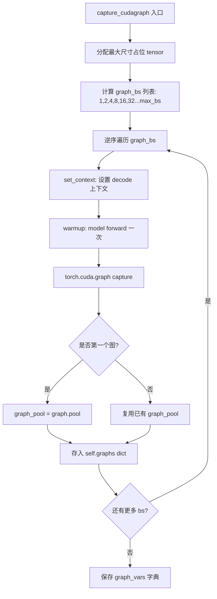
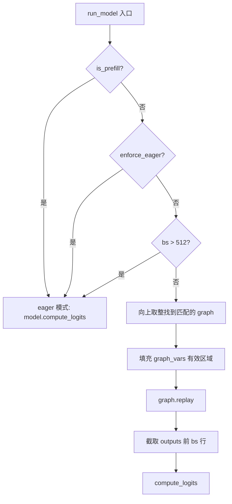

# PD-448.01 nano-vllm — CUDA Graph 预捕获与零开销 Replay

> 文档编号：PD-448.01
> 来源：nano-vllm `nanovllm/engine/model_runner.py`
> GitHub：https://github.com/GeeeekExplorer/nano-vllm.git
> 问题域：PD-448 CUDA Graph 捕获优化 CUDA Graph Capture Optimization
> 状态：可复用方案

---

## 第 1 章 问题与动机

### 1.1 核心问题

GPU 推理的 decode 阶段，每个 token 生成只需要处理 1 个 token 的前向传播，计算量极小（矩阵乘法维度为 `[1, hidden_size]`），但每次前向传播仍需要启动数十个 CUDA kernel（Embedding → LayerNorm → QKV Proj → RoPE → Attention → MLP × N layers → LM Head）。在小 batch 场景下，kernel launch overhead 占总延迟的 30-50%，成为 decode 吞吐量的瓶颈。

CUDA Graph 通过将一系列 kernel 调用"录制"成一个图，后续通过 `graph.replay()` 一次性提交所有 kernel，将 N 次 CPU→GPU 的 launch 开销压缩为 1 次，从而显著降低 decode 延迟。

核心挑战在于：CUDA Graph 要求图内所有 tensor 的形状和地址在 capture 和 replay 之间保持一致，但实际推理中 batch size 是动态变化的。如何在静态图约束下支持动态 batch，是该域的核心工程问题。

### 1.2 nano-vllm 的解法概述

nano-vllm 在 `ModelRunner` 中实现了一套极简但完整的 CUDA Graph 方案：

1. **离散 batch size 预捕获**：在初始化阶段预捕获 `[1, 2, 4, 8, 16, 32, ..., max_bs]` 共约 36 个图（`model_runner.py:228`），覆盖所有可能的 decode batch size
2. **向上取整匹配**：运行时将实际 batch size 向上取整到最近的预捕获尺寸（`model_runner.py:196`），多余位置用零填充
3. **graph_pool 内存共享**：所有图共享同一个 CUDA memory pool（`model_runner.py:238-239`），避免每个图独立分配显存
4. **graph_vars 动态填充**：通过预分配的最大尺寸 tensor 作为图的输入/输出变量，运行时只填充有效部分（`model_runner.py:244-251`）
5. **三路分支回退**：prefill / enforce_eager / 超大 batch（>512）回退到 eager 模式（`model_runner.py:191`）

### 1.3 设计思想

| 设计原则 | 具体实现 | 理由 | 替代方案 |
|----------|----------|------|----------|
| 空间换时间 | 预捕获 ~36 个离散 batch size 的图 | 避免运行时动态捕获的延迟 | 运行时按需捕获（首次慢） |
| 向上取整填充 | `next(x for x in graph_bs if x >= bs)` | 用少量冗余计算换取图复用 | padding-free 动态图（复杂度高） |
| 内存池共享 | 首个图的 `graph.pool()` 传给后续图 | 所有图共享显存，避免 OOM | 每图独立分配（显存浪费 N 倍） |
| 从大到小捕获 | `reversed(self.graph_bs)` 逆序捕获 | 大图先分配，小图复用其内存区域 | 从小到大（可能碎片化） |
| slot_mapping 哨兵值 | `fill_(-1)` 后只填有效位 | Triton kernel 中 `if slot == -1: return` 跳过无效位 | 额外 mask tensor（增加复杂度） |

---

## 第 2 章 源码实现分析

### 2.1 架构概览

nano-vllm 的 CUDA Graph 子系统由三个核心组件构成：

```
┌─────────────────────────────────────────────────────────┐
│                    ModelRunner                           │
│                                                         │
│  ┌──────────────┐   ┌──────────────┐   ┌─────────────┐ │
│  │ capture_cuda │   │   run_model   │   │  graph_vars │ │
│  │   graph()    │──→│  (dispatch)   │──→│  (shared    │ │
│  │              │   │              │   │   tensors)  │ │
│  └──────┬───────┘   └──────┬───────┘   └─────────────┘ │
│         │                  │                            │
│         ▼                  ▼                            │
│  ┌──────────────┐   ┌──────────────┐                   │
│  │  self.graphs │   │ graph.replay │                   │
│  │  {bs: graph} │   │     ()       │                   │
│  │  graph_pool  │   │              │                   │
│  └──────────────┘   └──────────────┘                   │
│                                                         │
│  Context (global)                                       │
│  ┌─────────────────────────────────────────────┐       │
│  │ slot_mapping | context_lens | block_tables  │       │
│  └─────────────────────────────────────────────┘       │
└─────────────────────────────────────────────────────────┘
         │                          │
         ▼                          ▼
┌─────────────────┐    ┌──────────────────────┐
│  Attention Layer │    │  Triton store_kvcache │
│  (flash_attn)   │    │  (slot==-1 → skip)   │
└─────────────────┘    └──────────────────────┘
```

### 2.2 核心实现

#### 2.2.1 CUDA Graph 捕获流程



对应源码 `nanovllm/engine/model_runner.py:216-251`：

```python
@torch.inference_mode()
def capture_cudagraph(self):
    config = self.config
    hf_config = config.hf_config
    max_bs = min(self.config.max_num_seqs, 512)
    max_num_blocks = (config.max_model_len + self.block_size - 1) // self.block_size
    input_ids = torch.zeros(max_bs, dtype=torch.int64)
    positions = torch.zeros(max_bs, dtype=torch.int64)
    slot_mapping = torch.zeros(max_bs, dtype=torch.int32)
    context_lens = torch.zeros(max_bs, dtype=torch.int32)
    block_tables = torch.zeros(max_bs, max_num_blocks, dtype=torch.int32)
    outputs = torch.zeros(max_bs, hf_config.hidden_size)
    self.graph_bs = [1, 2, 4, 8] + list(range(16, max_bs + 1, 16))
    self.graphs = {}
    self.graph_pool = None

    for bs in reversed(self.graph_bs):
        graph = torch.cuda.CUDAGraph()
        set_context(False, slot_mapping=slot_mapping[:bs],
                    context_lens=context_lens[:bs],
                    block_tables=block_tables[:bs])
        outputs[:bs] = self.model(input_ids[:bs], positions[:bs])    # warmup
        with torch.cuda.graph(graph, self.graph_pool):
            outputs[:bs] = self.model(input_ids[:bs], positions[:bs])    # capture
        if self.graph_pool is None:
            self.graph_pool = graph.pool()
        self.graphs[bs] = graph
        torch.cuda.synchronize()
        reset_context()

    self.graph_vars = dict(
        input_ids=input_ids, positions=positions,
        slot_mapping=slot_mapping, context_lens=context_lens,
        block_tables=block_tables, outputs=outputs,
    )
```

关键设计点：
- **L228**: `graph_bs` 采用 `[1,2,4,8]` + `range(16, max_bs+1, 16)` 的混合策略，小 batch 用 2 的幂次（精细），大 batch 用 16 步长（节省图数量）
- **L232**: 逆序遍历 `reversed(self.graph_bs)`，从最大 bs 开始捕获，确保 graph_pool 首先为最大图分配足够内存
- **L236-237**: warmup + capture 两步走，warmup 确保所有 lazy 初始化完成（如 Triton JIT 编译），capture 录制干净的 kernel 序列
- **L238-239**: 第一个图（最大 bs）创建 pool，后续图通过 `self.graph_pool` 参数共享同一内存池

#### 2.2.2 运行时 Replay 分发



对应源码 `nanovllm/engine/model_runner.py:189-206`：

```python
@torch.inference_mode()
def run_model(self, input_ids: torch.Tensor, positions: torch.Tensor, is_prefill: bool):
    if is_prefill or self.enforce_eager or input_ids.size(0) > 512:
        return self.model.compute_logits(self.model(input_ids, positions))
    else:
        bs = input_ids.size(0)
        context = get_context()
        graph = self.graphs[next(x for x in self.graph_bs if x >= bs)]
        graph_vars = self.graph_vars
        graph_vars["input_ids"][:bs] = input_ids
        graph_vars["positions"][:bs] = positions
        graph_vars["slot_mapping"].fill_(-1)
        graph_vars["slot_mapping"][:bs] = context.slot_mapping
        graph_vars["context_lens"].zero_()
        graph_vars["context_lens"][:bs] = context.context_lens
        graph_vars["block_tables"][:bs, :context.block_tables.size(1)] = context.block_tables
        graph.replay()
        return self.model.compute_logits(graph_vars["outputs"][:bs])
```

关键设计点：
- **L191**: 三路分支判断，prefill 阶段序列长度不固定（无法用固定图），enforce_eager 是调试开关，>512 是安全上限
- **L196**: `next(x for x in self.graph_bs if x >= bs)` 线性扫描找到第一个 ≥ 实际 bs 的预捕获尺寸，因为 graph_bs 已排序所以是 O(N) 最坏 ~36 次比较
- **L200**: `slot_mapping.fill_(-1)` 是关键——Triton kernel `store_kvcache_kernel` 中 `if slot == -1: return`（`attention.py:23`），确保填充位不会写入 KV cache 的有效区域
- **L202-203**: `context_lens.zero_()` 确保填充位的 attention 长度为 0，flash_attn_with_kvcache 会跳过这些位置

### 2.3 实现细节

#### Triton Kernel 与 CUDA Graph 的兼容

`store_kvcache_kernel`（`attention.py:11-30`）是一个 Triton JIT kernel，在 CUDA Graph 内被调用。关键兼容设计：

- **哨兵值跳过**：`if slot == -1: return`（`attention.py:23`）使得填充位的 kernel 实例立即返回，不产生无效写入
- **固定 grid**：kernel 的 grid 大小 `(N,)` 由 tensor 的第一维决定，在图捕获时固定为 `graph_bs` 对应的值
- **Triton warmup**：capture 前的 warmup 调用（`model_runner.py:235`）触发 Triton 的 JIT 编译和 autotuning，确保 capture 时 kernel 已编译完成

#### Context 全局状态传递

`Context` dataclass（`utils/context.py:6-14`）通过全局变量 `_CONTEXT` 在 ModelRunner 和 Attention 层之间传递元数据。CUDA Graph 捕获时，`set_context` 设置的 tensor 切片（如 `slot_mapping[:bs]`）的地址被录入图中，replay 时通过原地修改 `graph_vars` 中的同一 tensor 来更新数据。

#### 资源清理

`exit()` 方法（`model_runner.py:50-59`）显式删除 `self.graphs` 和 `self.graph_pool`，释放 CUDA Graph 占用的 GPU 内存。这在多进程 tensor parallel 场景下尤为重要，避免子进程退出时的显存泄漏。


---

## 第 3 章 迁移指南

### 3.1 迁移清单

**阶段 1：基础设施准备**
- [ ] 确认模型前向传播在 `torch.inference_mode()` 下无动态控制流（无 data-dependent branching）
- [ ] 确认所有自定义 kernel（Triton/CUDA）支持固定 grid 大小 + 哨兵值跳过
- [ ] 确认 attention 实现（flash_attn 等）支持 `block_table` 和 `cache_seqlens` 参数

**阶段 2：图捕获实现**
- [ ] 定义 `graph_bs` 离散 batch size 列表（推荐 `[1,2,4,8] + range(16, max_bs+1, 16)`）
- [ ] 预分配最大尺寸的 `graph_vars` tensor（input_ids, positions, slot_mapping, context_lens, block_tables, outputs）
- [ ] 实现逆序捕获循环，首图创建 `graph_pool`，后续图共享
- [ ] 每个 bs 先 warmup 再 capture

**阶段 3：运行时集成**
- [ ] 在 `run_model` 中实现三路分支：prefill → eager, decode ≤ max_bs → graph replay, 超大 batch → eager
- [ ] 实现 graph_vars 动态填充逻辑（注意 `fill_(-1)` 和 `zero_()` 清零）
- [ ] 在 `exit()` 中显式释放 graphs 和 graph_pool

**阶段 4：验证**
- [ ] 对比 eager vs graph 模式的输出一致性（logits diff < 1e-5）
- [ ] 基准测试 decode 吞吐量提升（预期 1.3-2x）
- [ ] 监控 GPU 显存占用（graph_pool 共享应避免显存翻倍）

### 3.2 适配代码模板

以下模板可直接集成到任何基于 PyTorch 的 LLM 推理引擎：

```python
import torch
from dataclasses import dataclass

@dataclass
class CUDAGraphConfig:
    max_batch_size: int = 512
    small_bs: list[int] = None  # [1, 2, 4, 8]
    large_bs_step: int = 16     # 16, 32, 48, ...

    def __post_init__(self):
        if self.small_bs is None:
            self.small_bs = [1, 2, 4, 8]

    @property
    def graph_batch_sizes(self) -> list[int]:
        return self.small_bs + list(
            range(self.large_bs_step, self.max_batch_size + 1, self.large_bs_step)
        )


class CUDAGraphManager:
    """可复用的 CUDA Graph 捕获与 replay 管理器。"""

    def __init__(self, model: torch.nn.Module, config: CUDAGraphConfig,
                 hidden_size: int, max_num_blocks: int):
        self.model = model
        self.config = config
        self.graph_bs = config.graph_batch_sizes
        self.graphs: dict[int, torch.cuda.CUDAGraph] = {}
        self.graph_pool = None
        max_bs = config.max_batch_size

        # 预分配最大尺寸 tensor（地址在 capture 后固定）
        self.graph_vars = {
            "input_ids": torch.zeros(max_bs, dtype=torch.int64, device="cuda"),
            "positions": torch.zeros(max_bs, dtype=torch.int64, device="cuda"),
            "slot_mapping": torch.zeros(max_bs, dtype=torch.int32, device="cuda"),
            "context_lens": torch.zeros(max_bs, dtype=torch.int32, device="cuda"),
            "block_tables": torch.zeros(max_bs, max_num_blocks, dtype=torch.int32, device="cuda"),
            "outputs": torch.zeros(max_bs, hidden_size, device="cuda"),
        }
        self._capture_all()

    @torch.inference_mode()
    def _capture_all(self):
        gv = self.graph_vars
        for bs in reversed(self.graph_bs):
            graph = torch.cuda.CUDAGraph()
            # 1) warmup: 触发 Triton JIT / lazy init
            self._set_decode_context(gv, bs)
            gv["outputs"][:bs] = self.model(gv["input_ids"][:bs], gv["positions"][:bs])
            # 2) capture
            with torch.cuda.graph(graph, self.graph_pool):
                gv["outputs"][:bs] = self.model(gv["input_ids"][:bs], gv["positions"][:bs])
            if self.graph_pool is None:
                self.graph_pool = graph.pool()
            self.graphs[bs] = graph
            torch.cuda.synchronize()

    def _set_decode_context(self, gv: dict, bs: int):
        """设置 decode 阶段的全局上下文，需适配你的 attention 实现。"""
        # 由使用者实现：set_context(False, slot_mapping=gv["slot_mapping"][:bs], ...)
        pass

    def replay(self, input_ids: torch.Tensor, positions: torch.Tensor,
               slot_mapping: torch.Tensor, context_lens: torch.Tensor,
               block_tables: torch.Tensor) -> torch.Tensor:
        bs = input_ids.size(0)
        matched_bs = next(x for x in self.graph_bs if x >= bs)
        gv = self.graph_vars

        # 动态填充有效区域
        gv["input_ids"][:bs] = input_ids
        gv["positions"][:bs] = positions
        gv["slot_mapping"].fill_(-1)
        gv["slot_mapping"][:bs] = slot_mapping
        gv["context_lens"].zero_()
        gv["context_lens"][:bs] = context_lens
        gv["block_tables"][:bs, :block_tables.size(1)] = block_tables

        self.graphs[matched_bs].replay()
        return gv["outputs"][:bs]

    def cleanup(self):
        del self.graphs, self.graph_pool
        torch.cuda.synchronize()
```

### 3.3 适用场景

| 场景 | 适用度 | 说明 |
|------|--------|------|
| LLM decode 推理服务 | ⭐⭐⭐ | 核心场景，decode 阶段 kernel launch 开销占比最高 |
| 小 batch 实时推理 | ⭐⭐⭐ | batch=1-8 时 kernel launch 占比可达 50%，收益最大 |
| 大 batch 离线推理 | ⭐⭐ | batch>128 时计算占主导，graph 收益递减但仍有效 |
| Prefill 阶段 | ⭐ | 序列长度动态变化，不适合固定图，应回退 eager |
| 含动态控制流的模型 | ❌ | MoE 路由等 data-dependent 分支无法被 CUDA Graph 捕获 |
| 频繁变更模型权重 | ❌ | 图捕获后权重地址固定，LoRA 热切换需重新捕获 |

---

## 第 4 章 测试用例

```python
import pytest
import torch

class TestCUDAGraphCapture:
    """基于 nano-vllm ModelRunner 的 CUDA Graph 测试。"""

    def test_graph_bs_coverage(self):
        """验证 graph_bs 覆盖所有合理 batch size。"""
        max_bs = 512
        graph_bs = [1, 2, 4, 8] + list(range(16, max_bs + 1, 16))
        # 任意 1-512 的 bs 都能找到 >= 它的预捕获尺寸
        for bs in range(1, max_bs + 1):
            matched = next(x for x in graph_bs if x >= bs)
            assert matched >= bs
            assert matched <= max_bs

    def test_graph_bs_order(self):
        """验证 graph_bs 严格递增。"""
        graph_bs = [1, 2, 4, 8] + list(range(16, 512 + 1, 16))
        for i in range(1, len(graph_bs)):
            assert graph_bs[i] > graph_bs[i - 1]

    def test_slot_mapping_sentinel(self):
        """验证哨兵值 -1 的填充逻辑。"""
        max_bs = 16
        slot_mapping = torch.zeros(max_bs, dtype=torch.int32, device="cuda")
        actual_bs = 5
        actual_slots = torch.arange(actual_bs, dtype=torch.int32, device="cuda")

        slot_mapping.fill_(-1)
        slot_mapping[:actual_bs] = actual_slots

        assert (slot_mapping[:actual_bs] == actual_slots).all()
        assert (slot_mapping[actual_bs:] == -1).all()

    def test_context_lens_zero_padding(self):
        """验证 context_lens 的零填充不影响有效位。"""
        max_bs = 16
        context_lens = torch.zeros(max_bs, dtype=torch.int32, device="cuda")
        actual_bs = 7
        actual_lens = torch.randint(1, 4096, (actual_bs,), dtype=torch.int32, device="cuda")

        context_lens.zero_()
        context_lens[:actual_bs] = actual_lens

        assert (context_lens[:actual_bs] == actual_lens).all()
        assert (context_lens[actual_bs:] == 0).all()

    def test_graph_vars_address_stability(self):
        """验证 graph_vars tensor 的地址在填充后不变（CUDA Graph 要求）。"""
        t = torch.zeros(32, dtype=torch.int64, device="cuda")
        original_ptr = t.data_ptr()
        t[:8] = torch.arange(8, device="cuda")
        t.fill_(0)
        assert t.data_ptr() == original_ptr, "原地操作不应改变 tensor 地址"

    def test_eager_fallback_conditions(self):
        """验证三路分支的回退条件。"""
        # prefill 必须走 eager
        assert _should_use_eager(is_prefill=True, enforce_eager=False, bs=4)
        # enforce_eager 强制 eager
        assert _should_use_eager(is_prefill=False, enforce_eager=True, bs=4)
        # 超大 batch 回退 eager
        assert _should_use_eager(is_prefill=False, enforce_eager=False, bs=600)
        # 正常 decode 走 graph
        assert not _should_use_eager(is_prefill=False, enforce_eager=False, bs=32)


def _should_use_eager(is_prefill: bool, enforce_eager: bool, bs: int) -> bool:
    """复现 model_runner.py:191 的分支逻辑。"""
    return is_prefill or enforce_eager or bs > 512
```


---

## 第 5 章 跨域关联

| 关联域 | 关系类型 | 说明 |
|--------|----------|------|
| PD-446 Paged KV Cache | 依赖 | CUDA Graph 的 `block_tables` 和 `slot_mapping` 直接依赖 Paged KV Cache 的 block 分配结果；graph_vars 中的 block_tables tensor 形状由 `max_num_blocks` 决定 |
| PD-447 Tensor Parallelism | 协同 | 多 GPU 场景下每个 rank 独立捕获自己的 CUDA Graph，通过 SharedMemory + Event 同步调用（`model_runner.py:41-48`）；graph_pool 是 per-device 的 |
| PD-449 Continuous Batching | 协同 | Scheduler 的 continuous batching 决定每步的 decode batch size，CUDA Graph 通过向上取整适配动态 batch；preempt 机制（`scheduler.py:60-63`）可能导致 batch size 突变 |
| PD-451 Triton Custom Kernels | 依赖 | `store_kvcache_kernel` 是 Triton JIT kernel，必须在 capture 前完成编译（warmup 步骤）；kernel 的 `if slot == -1: return` 哨兵逻辑是 CUDA Graph 兼容的关键 |
| PD-452 GPU Memory Management | 协同 | `allocate_kv_cache`（`model_runner.py:100-118`）在 CUDA Graph 捕获之前执行，确保 KV cache 的显存已分配；graph_pool 共享机制减少额外显存开销 |
| PD-450 Model Weight Loading | 前置 | 模型权重必须在 CUDA Graph 捕获前加载完成（`model_runner.py:32`），因为图录制时权重 tensor 的地址被固化 |

---

## 第 6 章 来源文件索引

| 文件 | 行范围 | 关键实现 |
|------|--------|----------|
| `nanovllm/engine/model_runner.py` | L15-252 | ModelRunner 完整实现：初始化、warmup、KV cache 分配、CUDA Graph 捕获与 replay |
| `nanovllm/engine/model_runner.py` | L216-251 | `capture_cudagraph()`: 核心捕获逻辑，graph_bs 定义、逆序捕获、graph_pool 共享 |
| `nanovllm/engine/model_runner.py` | L189-206 | `run_model()`: 三路分支分发，graph_vars 动态填充，graph.replay() |
| `nanovllm/engine/model_runner.py` | L50-59 | `exit()`: 资源清理，显式删除 graphs 和 graph_pool |
| `nanovllm/config.py` | L14 | `enforce_eager: bool = False`: CUDA Graph 开关配置 |
| `nanovllm/utils/context.py` | L1-27 | Context dataclass + 全局状态管理（set/get/reset_context） |
| `nanovllm/layers/attention.py` | L11-30 | `store_kvcache_kernel`: Triton kernel，slot==-1 哨兵跳过逻辑 |
| `nanovllm/layers/attention.py` | L59-75 | Attention.forward: prefill 用 flash_attn_varlen_func，decode 用 flash_attn_with_kvcache |
| `nanovllm/engine/llm_engine.py` | L17-34 | LLMEngine.__init__: 多进程初始化，ModelRunner 在每个 rank 上独立捕获图 |
| `nanovllm/engine/scheduler.py` | L24-58 | Scheduler.schedule: 决定每步的 batch size，影响 graph 匹配 |

---

## 第 7 章 横向对比维度

```json comparison_data
{
  "project": "nano-vllm",
  "dimensions": {
    "捕获策略": "初始化阶段一次性预捕获 ~36 个离散 bs 的图，逆序从大到小",
    "BS 匹配": "向上取整到最近预捕获尺寸，[1,2,4,8]+range(16,max,16) 混合步长",
    "内存管理": "graph_pool 共享：首图创建 pool，后续图复用同一内存池",
    "变量填充": "graph_vars 最大尺寸预分配，slot_mapping fill(-1) 哨兵值 + context_lens zero()",
    "回退机制": "三路分支：prefill/enforce_eager/bs>512 回退 eager 模式",
    "Kernel 兼容": "Triton store_kvcache_kernel 通过 slot==-1 哨兵值跳过无效位"
  }
}
```

### 域元数据补充

```json domain_metadata
{
  "solution_summary": "nano-vllm 在 ModelRunner 初始化阶段逆序预捕获 ~36 个离散 batch size 的 CUDA Graph，decode 时向上取整匹配并通过 graph_vars 原地填充 + slot_mapping 哨兵值实现零开销 replay",
  "description": "CUDA Graph 与 Triton JIT kernel 的兼容性设计，以及 graph_vars 原地填充的工程模式",
  "sub_problems": [
    "Triton JIT kernel 在 CUDA Graph capture 前的 warmup 编译时序",
    "逆序捕获对 graph_pool 内存分配的影响"
  ],
  "best_practices": [
    "从最大 batch size 逆序捕获，确保 graph_pool 首次分配足够内存",
    "用 slot_mapping fill(-1) 哨兵值配合 Triton kernel 跳过无效写入"
  ]
}
```

