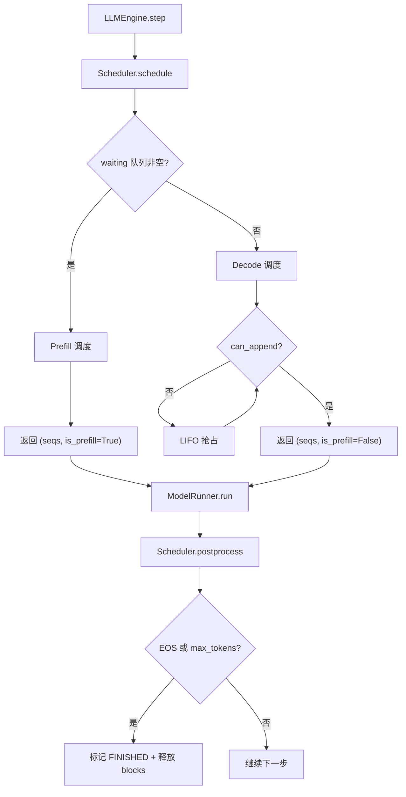
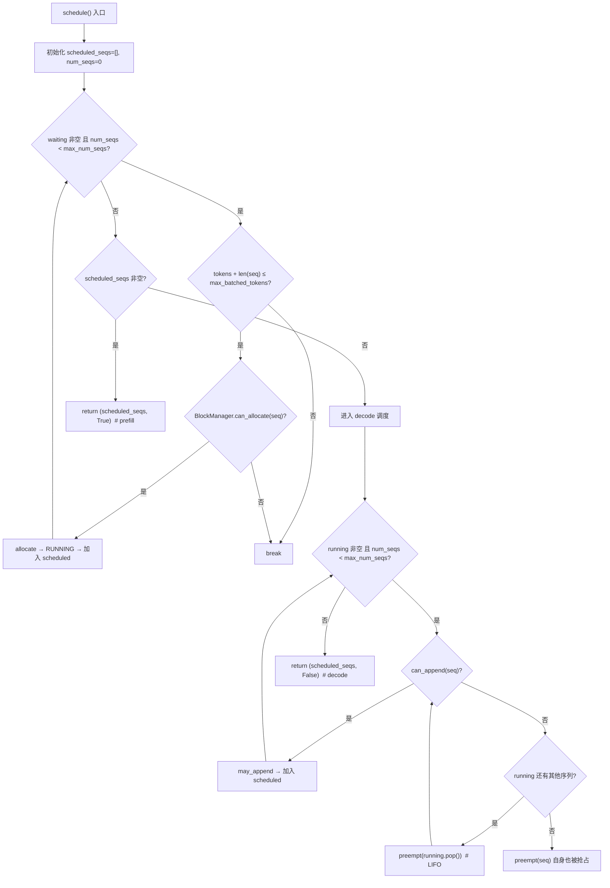
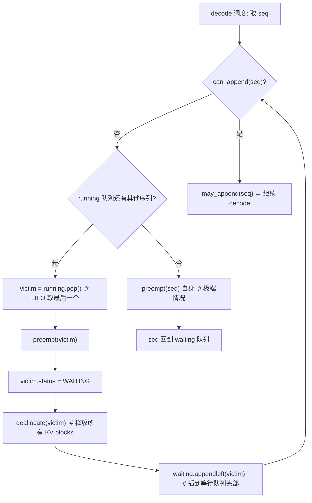
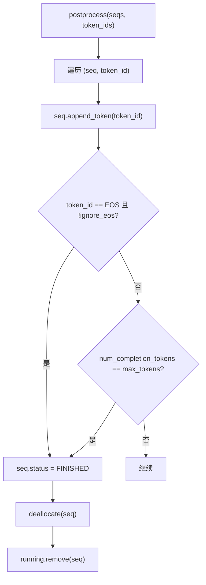

# PD-449.01 nano-vllm — Prefill 优先双阶段连续批处理调度

> 文档编号：PD-449.01
> 来源：nano-vllm `nanovllm/engine/scheduler.py`
> GitHub：https://github.com/GeeeekExplorer/nano-vllm.git
> 问题域：PD-449 连续批处理调度 Continuous Batching Scheduling
> 状态：可复用方案

---

## 第 1 章 问题与动机

### 1.1 核心问题

LLM 推理服务面临一个根本矛盾：**prefill（首次填充）和 decode（逐 token 生成）的计算特征截然不同**。Prefill 是计算密集型（一次处理数百到数千 token），decode 是内存带宽密集型（每次只处理 1 个 token）。传统静态批处理要求所有请求同时开始、同时结束，导致 GPU 利用率低下——短请求等长请求，新请求等旧批次完成。

连续批处理（Continuous Batching）的核心思想是：**不等批次结束，随时插入新请求、移除已完成请求**。但这引入了调度复杂性：何时做 prefill、何时做 decode、内存不够怎么办？

### 1.2 nano-vllm 的解法概述

nano-vllm 用不到 72 行代码（`scheduler.py`）实现了一个极简但完整的连续批处理调度器，核心设计：

1. **Prefill 优先策略**：每次 `schedule()` 调用先尝试从 waiting 队列取序列做 prefill，只有没有等待序列时才调度 decode（`scheduler.py:24-41`）
2. **双约束动态批组装**：同时受 `max_num_seqs`（最大序列数）和 `max_num_batched_tokens`（最大 token 数）约束，防止 OOM（`scheduler.py:29-31`）
3. **LIFO 抢占**：decode 阶段内存不足时，抢占最后加入 running 队列的序列（`scheduler.py:46-51`），释放 KV cache 块
4. **三态状态机**：序列在 WAITING → RUNNING → FINISHED 之间流转，被抢占时回退到 WAITING（`sequence.py:8-11`）
5. **Prefix Caching 集成**：BlockManager 用 xxhash 做 block 级内容寻址，prefill 时自动跳过已缓存的 token（`block_manager.py:59-82`）

### 1.3 设计思想

| 设计原则 | 具体实现 | 理由 | 替代方案 |
|----------|----------|------|----------|
| Prefill 绝对优先 | waiting 非空时只做 prefill，不混合 decode | 降低首 token 延迟（TTFT），新请求立即得到响应 | Chunked prefill（将 prefill 拆分与 decode 混合） |
| 双约束门控 | `max_num_seqs` + `max_num_batched_tokens` 同时检查 | 前者限制 KV cache 条目数，后者限制单步计算量 | 仅限制序列数（可能单步 token 过多导致 OOM） |
| LIFO 抢占 | `self.running.pop()` 取最后加入的序列 | 最后加入的序列生成 token 最少，重新 prefill 代价最低 | FIFO 抢占（代价高）、优先级抢占（复杂） |
| Block 级内存管理 | 256 token 为一个 block，引用计数 + hash 寻址 | 与 PagedAttention 对齐，支持 prefix caching | Token 级管理（碎片多）、固定分配（浪费） |
| 极简状态机 | 3 个状态 + 2 个队列（waiting/running） | 代码量最小化，逻辑清晰可验证 | 增加 SWAPPED 状态（支持磁盘换出） |

---

## 第 2 章 源码实现分析

### 2.1 架构概览

nano-vllm 的调度架构是一个经典的 Engine-Scheduler-BlockManager 三层结构：

```
┌─────────────────────────────────────────────────────┐
│                    LLMEngine                         │
│  ┌──────────┐    ┌───────────┐    ┌──────────────┐  │
│  │ Tokenizer│    │ Scheduler │    │ ModelRunner   │  │
│  │          │    │           │    │              │  │
│  │ encode() │───→│ add()     │    │ run(seqs,    │  │
│  │          │    │ schedule()│───→│   is_prefill)│  │
│  │ decode() │←──│postprocess│←──│   → token_ids│  │
│  └──────────┘    │           │    └──────────────┘  │
│                  │ ┌────────┐│                       │
│                  │ │Block   ││                       │
│                  │ │Manager ││                       │
│                  │ └────────┘│                       │
│                  └───────────┘                       │
└─────────────────────────────────────────────────────┘
```

每个 `step()` 调用的数据流：



### 2.2 核心实现

#### 2.2.1 调度主循环：Prefill 优先 + Decode 回退



对应源码 `nanovllm/engine/scheduler.py:24-58`：

```python
def schedule(self) -> tuple[list[Sequence], bool]:
    # prefill
    scheduled_seqs = []
    num_seqs = 0
    num_batched_tokens = 0
    while self.waiting and num_seqs < self.max_num_seqs:
        seq = self.waiting[0]
        if num_batched_tokens + len(seq) > self.max_num_batched_tokens or not self.block_manager.can_allocate(seq):
            break
        num_seqs += 1
        self.block_manager.allocate(seq)
        num_batched_tokens += len(seq) - seq.num_cached_tokens
        seq.status = SequenceStatus.RUNNING
        self.waiting.popleft()
        self.running.append(seq)
        scheduled_seqs.append(seq)
    if scheduled_seqs:
        return scheduled_seqs, True

    # decode
    while self.running and num_seqs < self.max_num_seqs:
        seq = self.running.popleft()
        while not self.block_manager.can_append(seq):
            if self.running:
                self.preempt(self.running.pop())
            else:
                self.preempt(seq)
                break
        else:
            num_seqs += 1
            self.block_manager.may_append(seq)
            scheduled_seqs.append(seq)
    assert scheduled_seqs
    self.running.extendleft(reversed(scheduled_seqs))
    return scheduled_seqs, False
```

关键细节：
- **L31**：双约束检查——token 总量不超限 **且** BlockManager 有足够空闲块
- **L35**：`len(seq) - seq.num_cached_tokens` 只计算未缓存的 token，prefix caching 的序列实际计算量更小
- **L46-51**：decode 阶段的抢占循环——`while not can_append` 持续抢占直到有空间，`running.pop()` 实现 LIFO
- **L57**：`running.extendleft(reversed(scheduled_seqs))` 将本轮调度的序列放回 running 队列头部，保持 FIFO 顺序

#### 2.2.2 抢占与重新排队



对应源码 `nanovllm/engine/scheduler.py:60-63`：

```python
def preempt(self, seq: Sequence):
    seq.status = SequenceStatus.WAITING
    self.block_manager.deallocate(seq)
    self.waiting.appendleft(seq)
```

设计要点：
- 被抢占的序列 `appendleft` 到 waiting 队列**头部**，下次 prefill 时优先重新调度
- `deallocate` 释放该序列的所有 KV cache blocks（`block_manager.py:84-91`），引用计数归零的 block 回到 free 池
- 重新 prefill 时，prefix caching 可以命中之前的 block hash，减少重复计算

#### 2.2.3 后处理：EOS 检测与序列完成



对应源码 `nanovllm/engine/scheduler.py:65-71`：

```python
def postprocess(self, seqs: list[Sequence], token_ids: list[int]) -> list[bool]:
    for seq, token_id in zip(seqs, token_ids):
        seq.append_token(token_id)
        if (not seq.ignore_eos and token_id == self.eos) or seq.num_completion_tokens == seq.max_tokens:
            seq.status = SequenceStatus.FINISHED
            self.block_manager.deallocate(seq)
            self.running.remove(seq)
```

### 2.3 实现细节

#### 序列数据结构与 Block 映射

`Sequence` 类（`sequence.py:14-83`）是调度器的核心数据载体：

- `block_table: list[int]` — 逻辑块到物理块的映射表，由 BlockManager 在 allocate 时填充
- `num_cached_tokens` — prefix caching 命中的 token 数，prefill 时跳过这些 token
- `block_size = 256` — 类变量，所有序列共享，与 Config 的 `kvcache_block_size` 对齐
- `__getstate__`/`__setstate__` — 自定义序列化，decode 阶段只传 `last_token` 而非完整 `token_ids`，减少跨进程通信开销（`sequence.py:74-83`）

#### BlockManager 的 Prefix Caching

`BlockManager.allocate`（`block_manager.py:59-82`）实现了基于内容哈希的 prefix caching：

1. 对每个完整 block 计算 `xxhash(token_ids, prefix_hash)` 链式哈希
2. 查 `hash_to_block_id` 字典，命中则复用物理块（`ref_count++`）
3. 未命中则从 `free_block_ids` 分配新块
4. 最后一个不完整 block 不计算 hash（`h = -1`），等填满后在 `may_append` 中更新

#### 内存约束的精确计算

`can_append`（`block_manager.py:93-94`）的判断极其精炼：

```python
def can_append(self, seq: Sequence) -> bool:
    return len(self.free_block_ids) >= (len(seq) % self.block_size == 1)
```

只有当 `len(seq) % block_size == 1` 时（即刚跨入新 block 的第一个 token），才需要分配一个新物理块。其他时候 append 不需要新块。


---

## 第 3 章 迁移指南

### 3.1 迁移清单

**阶段 1：核心数据结构**
- [ ] 定义 `SequenceStatus` 枚举（WAITING / RUNNING / FINISHED）
- [ ] 实现 `Sequence` 类，包含 `token_ids`、`block_table`、`num_cached_tokens`、`sampling_params`
- [ ] 确定 block_size（推荐 128 或 256，需与 attention kernel 对齐）

**阶段 2：BlockManager**
- [ ] 实现 block 分配/释放（`allocate` / `deallocate`），维护 `free_block_ids` 和 `used_block_ids`
- [ ] 实现 `can_allocate`（prefill 前检查）和 `can_append`（decode 前检查）
- [ ] （可选）实现 prefix caching：block 级 hash 寻址 + 引用计数

**阶段 3：Scheduler**
- [ ] 实现 `waiting` / `running` 双队列
- [ ] 实现 `schedule()` 方法：prefill 优先 + decode 回退 + LIFO 抢占
- [ ] 实现 `postprocess()`：EOS 检测 + 序列完成 + block 释放
- [ ] 配置 `max_num_seqs` 和 `max_num_batched_tokens` 两个约束参数

**阶段 4：Engine 集成**
- [ ] 在 Engine 的 `step()` 中调用 `scheduler.schedule()` 获取 `(seqs, is_prefill)`
- [ ] 根据 `is_prefill` 标志选择 prefill 或 decode 的数据准备路径
- [ ] 调用 model forward 后，将 token_ids 传回 `scheduler.postprocess()`

### 3.2 适配代码模板

以下是一个可独立运行的最小连续批处理调度器实现：

```python
from collections import deque
from enum import Enum, auto
from dataclasses import dataclass
from itertools import count


class SeqStatus(Enum):
    WAITING = auto()
    RUNNING = auto()
    FINISHED = auto()


@dataclass
class SchedulerConfig:
    max_num_seqs: int = 256
    max_num_batched_tokens: int = 8192
    num_blocks: int = 1024
    block_size: int = 256
    eos_token_id: int = 2


class SimpleSequence:
    _counter = count()

    def __init__(self, token_ids: list[int], max_tokens: int = 64):
        self.seq_id = next(self._counter)
        self.status = SeqStatus.WAITING
        self.token_ids = list(token_ids)
        self.num_prompt_tokens = len(token_ids)
        self.max_tokens = max_tokens
        self.num_blocks_allocated = 0

    @property
    def num_tokens(self) -> int:
        return len(self.token_ids)

    @property
    def num_completion_tokens(self) -> int:
        return self.num_tokens - self.num_prompt_tokens

    @property
    def is_finished(self) -> bool:
        return self.status == SeqStatus.FINISHED

    def blocks_needed(self, block_size: int) -> int:
        return (self.num_tokens + block_size - 1) // block_size


class SimpleBlockPool:
    """最小化 block 池：只跟踪空闲块数量"""

    def __init__(self, num_blocks: int, block_size: int):
        self.num_free = num_blocks
        self.block_size = block_size

    def can_allocate(self, seq: SimpleSequence) -> bool:
        return self.num_free >= seq.blocks_needed(self.block_size)

    def allocate(self, seq: SimpleSequence):
        n = seq.blocks_needed(self.block_size)
        self.num_free -= n
        seq.num_blocks_allocated = n

    def can_append(self, seq: SimpleSequence) -> bool:
        needs_new = (seq.num_tokens % self.block_size == 1)
        return self.num_free >= int(needs_new)

    def may_append(self, seq: SimpleSequence):
        if seq.num_tokens % self.block_size == 1:
            self.num_free -= 1
            seq.num_blocks_allocated += 1

    def deallocate(self, seq: SimpleSequence):
        self.num_free += seq.num_blocks_allocated
        seq.num_blocks_allocated = 0


class ContinuousBatchScheduler:
    """
    Prefill-优先连续批处理调度器。
    移植自 nano-vllm 的 Scheduler，去除了 prefix caching 以降低复杂度。
    """

    def __init__(self, config: SchedulerConfig):
        self.max_num_seqs = config.max_num_seqs
        self.max_num_batched_tokens = config.max_num_batched_tokens
        self.eos = config.eos_token_id
        self.block_pool = SimpleBlockPool(config.num_blocks, config.block_size)
        self.waiting: deque[SimpleSequence] = deque()
        self.running: deque[SimpleSequence] = deque()

    def add(self, seq: SimpleSequence):
        self.waiting.append(seq)

    def is_finished(self) -> bool:
        return not self.waiting and not self.running

    def schedule(self) -> tuple[list[SimpleSequence], bool]:
        scheduled = []
        num_seqs = 0
        num_tokens = 0

        # Phase 1: Prefill — 优先调度等待中的新序列
        while self.waiting and num_seqs < self.max_num_seqs:
            seq = self.waiting[0]
            if num_tokens + seq.num_tokens > self.max_num_batched_tokens:
                break
            if not self.block_pool.can_allocate(seq):
                break
            num_seqs += 1
            num_tokens += seq.num_tokens
            self.block_pool.allocate(seq)
            seq.status = SeqStatus.RUNNING
            self.waiting.popleft()
            self.running.append(seq)
            scheduled.append(seq)

        if scheduled:
            return scheduled, True  # is_prefill = True

        # Phase 2: Decode — 无新序列时调度已有序列
        while self.running and num_seqs < self.max_num_seqs:
            seq = self.running.popleft()
            while not self.block_pool.can_append(seq):
                if self.running:
                    victim = self.running.pop()  # LIFO 抢占
                    self._preempt(victim)
                else:
                    self._preempt(seq)
                    break
            else:
                num_seqs += 1
                self.block_pool.may_append(seq)
                scheduled.append(seq)

        self.running.extendleft(reversed(scheduled))
        return scheduled, False  # is_prefill = False

    def _preempt(self, seq: SimpleSequence):
        seq.status = SeqStatus.WAITING
        self.block_pool.deallocate(seq)
        self.waiting.appendleft(seq)  # 优先重新调度

    def postprocess(self, seqs: list[SimpleSequence], token_ids: list[int]):
        for seq, tid in zip(seqs, token_ids):
            seq.token_ids.append(tid)
            if tid == self.eos or seq.num_completion_tokens >= seq.max_tokens:
                seq.status = SeqStatus.FINISHED
                self.block_pool.deallocate(seq)
                self.running.remove(seq)
```

### 3.3 适用场景

| 场景 | 适用度 | 说明 |
|------|--------|------|
| 单 GPU 推理服务 | ⭐⭐⭐ | 最佳场景，代码量小、逻辑清晰 |
| 教学/原型验证 | ⭐⭐⭐ | 极简实现，适合理解连续批处理原理 |
| 多 GPU 张量并行 | ⭐⭐ | nano-vllm 支持 TP，但调度器本身是单线程的 |
| 高并发在线服务 | ⭐ | 缺少 chunked prefill、优先级队列、SLA 保障等生产特性 |
| 流式输出（SSE） | ⭐⭐ | 需要在 `step()` 外层包装流式输出逻辑 |

---

## 第 4 章 测试用例

```python
import pytest
from collections import deque
from itertools import count


# ---- 使用第 3 章的适配代码模板 ----
# from continuous_batch_scheduler import (
#     SchedulerConfig, SimpleSequence, ContinuousBatchScheduler, SeqStatus
# )


class TestSchedulerPrefillPriority:
    """测试 Prefill 优先调度策略"""

    def setup_method(self):
        SimpleSequence._counter = count()
        self.config = SchedulerConfig(
            max_num_seqs=4,
            max_num_batched_tokens=1024,
            num_blocks=32,
            block_size=256,
            eos_token_id=2,
        )
        self.scheduler = ContinuousBatchScheduler(self.config)

    def test_prefill_before_decode(self):
        """waiting 队列有序列时，应返回 is_prefill=True"""
        seq = SimpleSequence([1, 2, 3, 4], max_tokens=10)
        self.scheduler.add(seq)
        seqs, is_prefill = self.scheduler.schedule()
        assert is_prefill is True
        assert len(seqs) == 1
        assert seqs[0].status == SeqStatus.RUNNING

    def test_decode_when_no_waiting(self):
        """waiting 为空、running 有序列时，应返回 is_prefill=False"""
        seq = SimpleSequence([1, 2, 3], max_tokens=10)
        self.scheduler.add(seq)
        self.scheduler.schedule()  # prefill
        self.scheduler.postprocess([seq], [5])  # 模拟一次 decode
        seqs, is_prefill = self.scheduler.schedule()
        assert is_prefill is False
        assert len(seqs) == 1

    def test_max_num_seqs_constraint(self):
        """不超过 max_num_seqs 个序列被调度"""
        for i in range(10):
            self.scheduler.add(SimpleSequence([1, 2], max_tokens=5))
        seqs, _ = self.scheduler.schedule()
        assert len(seqs) == self.config.max_num_seqs  # 4

    def test_max_batched_tokens_constraint(self):
        """不超过 max_num_batched_tokens 个 token"""
        config = SchedulerConfig(
            max_num_seqs=100,
            max_num_batched_tokens=10,
            num_blocks=100,
            block_size=256,
        )
        scheduler = ContinuousBatchScheduler(config)
        scheduler.add(SimpleSequence([1]*6, max_tokens=5))
        scheduler.add(SimpleSequence([1]*6, max_tokens=5))
        seqs, _ = scheduler.schedule()
        assert len(seqs) == 1  # 第二个 6 token 序列超出 10 token 限制


class TestSchedulerPreemption:
    """测试 LIFO 抢占机制"""

    def setup_method(self):
        SimpleSequence._counter = count()
        self.config = SchedulerConfig(
            max_num_seqs=4,
            max_num_batched_tokens=4096,
            num_blocks=4,  # 极少的 blocks 以触发抢占
            block_size=256,
            eos_token_id=2,
        )
        self.scheduler = ContinuousBatchScheduler(self.config)

    def test_preempt_returns_to_waiting_head(self):
        """被抢占的序列应回到 waiting 队列头部"""
        seq1 = SimpleSequence([1]*100, max_tokens=10)
        seq2 = SimpleSequence([1]*100, max_tokens=10)
        self.scheduler.add(seq1)
        self.scheduler.add(seq2)
        self.scheduler.schedule()  # prefill both
        # 模拟 decode 直到 blocks 耗尽触发抢占
        # 被抢占的序列应在 waiting 头部
        assert self.scheduler.waiting == deque() or \
               self.scheduler.waiting[0].seq_id in (seq1.seq_id, seq2.seq_id)


class TestSchedulerEOSDetection:
    """测试 EOS 检测与序列完成"""

    def setup_method(self):
        SimpleSequence._counter = count()
        self.config = SchedulerConfig(eos_token_id=2, num_blocks=32, block_size=256)
        self.scheduler = ContinuousBatchScheduler(self.config)

    def test_eos_finishes_sequence(self):
        """收到 EOS token 后序列应标记为 FINISHED"""
        seq = SimpleSequence([1, 3, 4], max_tokens=100)
        self.scheduler.add(seq)
        self.scheduler.schedule()
        self.scheduler.postprocess([seq], [2])  # EOS token
        assert seq.is_finished
        assert seq not in self.scheduler.running

    def test_max_tokens_finishes_sequence(self):
        """达到 max_tokens 后序列应标记为 FINISHED"""
        seq = SimpleSequence([1, 3], max_tokens=2)
        self.scheduler.add(seq)
        self.scheduler.schedule()
        self.scheduler.postprocess([seq], [5])
        self.scheduler.schedule()
        self.scheduler.postprocess([seq], [6])
        assert seq.is_finished

    def test_finished_check(self):
        """所有序列完成后 is_finished 应返回 True"""
        seq = SimpleSequence([1], max_tokens=1)
        self.scheduler.add(seq)
        assert not self.scheduler.is_finished()
        self.scheduler.schedule()
        self.scheduler.postprocess([seq], [2])
        assert self.scheduler.is_finished()
```


---

## 第 5 章 跨域关联

| 关联域 | 关系类型 | 说明 |
|--------|----------|------|
| PD-446 Paged KV Cache | 强依赖 | Scheduler 的 block 分配/释放直接调用 BlockManager，BlockManager 实现了 PagedAttention 的物理块管理。调度决策（can_allocate / can_append）完全基于 block 可用性 |
| PD-447 张量并行 | 协同 | LLMEngine 通过 `mp.Process` 启动多 rank worker，Scheduler 在 rank 0 运行，调度结果通过共享内存分发到所有 rank 的 ModelRunner |
| PD-448 CUDA Graph 优化 | 协同 | ModelRunner 根据 `is_prefill` 标志决定是否使用 CUDA Graph：prefill 用 eager 模式，decode 用预捕获的 CUDA Graph 加速 |
| PD-450 模型权重加载 | 前置依赖 | Scheduler 在 LLMEngine.__init__ 中创建，依赖 Config 中的 `num_kvcache_blocks`，该值在模型加载后根据剩余 GPU 内存计算 |
| PD-452 GPU 内存管理 | 强依赖 | `num_kvcache_blocks` 决定了 BlockManager 的容量上限，直接影响 Scheduler 能同时调度多少序列 |
| PD-01 上下文管理 | 类比 | 连续批处理的 block 级内存管理与 Agent 的上下文窗口管理有相似的资源约束问题——都需要在有限资源下动态分配和回收 |

---

## 第 6 章 来源文件索引

| 文件 | 行范围 | 关键实现 |
|------|--------|----------|
| `nanovllm/engine/scheduler.py` | L1-71 | 完整 Scheduler 类：schedule()、preempt()、postprocess() |
| `nanovllm/engine/scheduler.py` | L24-41 | Prefill 调度阶段：双约束检查 + block 分配 |
| `nanovllm/engine/scheduler.py` | L43-58 | Decode 调度阶段：LIFO 抢占循环 |
| `nanovllm/engine/scheduler.py` | L60-63 | preempt()：状态回退 + block 释放 + 重新排队 |
| `nanovllm/engine/scheduler.py` | L65-71 | postprocess()：EOS 检测 + 序列完成 |
| `nanovllm/engine/sequence.py` | L8-11 | SequenceStatus 三态枚举 |
| `nanovllm/engine/sequence.py` | L14-83 | Sequence 类：block_table、cached_tokens、序列化优化 |
| `nanovllm/engine/sequence.py` | L74-83 | __getstate__/__setstate__：跨进程序列化优化 |
| `nanovllm/engine/block_manager.py` | L26-113 | BlockManager：block 分配/释放/prefix caching |
| `nanovllm/engine/block_manager.py` | L56-82 | allocate()：hash 链式寻址 + prefix caching |
| `nanovllm/engine/block_manager.py` | L93-94 | can_append()：精确的单 block 需求判断 |
| `nanovllm/engine/llm_engine.py` | L15-93 | LLMEngine：step() 主循环 + generate() 批量接口 |
| `nanovllm/engine/llm_engine.py` | L48-54 | step()：schedule → run → postprocess 三步流水线 |
| `nanovllm/config.py` | L7-26 | Config：max_num_seqs、max_num_batched_tokens 等调度参数 |
| `nanovllm/sampling_params.py` | L1-11 | SamplingParams：temperature、max_tokens、ignore_eos |

---

## 第 7 章 横向对比维度

> **重要：** 本章用于自动填充 Butcher Wiki 的横向对比表。

```json comparison_data
{
  "project": "nano-vllm",
  "dimensions": {
    "调度策略": "Prefill 绝对优先，waiting 非空时不做 decode",
    "批组装约束": "max_num_seqs + max_num_batched_tokens 双约束门控",
    "抢占机制": "LIFO 抢占 running 队尾序列，deallocate 全部 blocks",
    "Prefix Caching": "xxhash 链式 block 级内容寻址，allocate 时自动命中",
    "状态机复杂度": "3 态（WAITING/RUNNING/FINISHED），无 SWAPPED 状态",
    "代码规模": "Scheduler 72 行，极简教学级实现"
  }
}
```

### 域元数据补充

```json domain_metadata
{
  "solution_summary": "nano-vllm 用 72 行 Scheduler 实现 Prefill 绝对优先 + LIFO 抢占 + xxhash prefix caching 的连续批处理，双约束（max_num_seqs/max_num_batched_tokens）门控批组装",
  "description": "连续批处理中 prefix caching 与抢占重调度的协同优化",
  "sub_problems": [
    "Prefix Caching 与抢占后重调度的交互：被抢占序列重新 prefill 时如何复用已缓存 block",
    "跨进程序列序列化优化：decode 阶段只传 last_token 减少 IPC 开销"
  ],
  "best_practices": [
    "被抢占序列 appendleft 到 waiting 头部，确保优先重新调度",
    "can_append 精确判断：仅在 token 数 mod block_size == 1 时需要新 block",
    "序列 __getstate__ 优化：decode 阶段不传完整 token_ids，只传 last_token"
  ]
}
```

