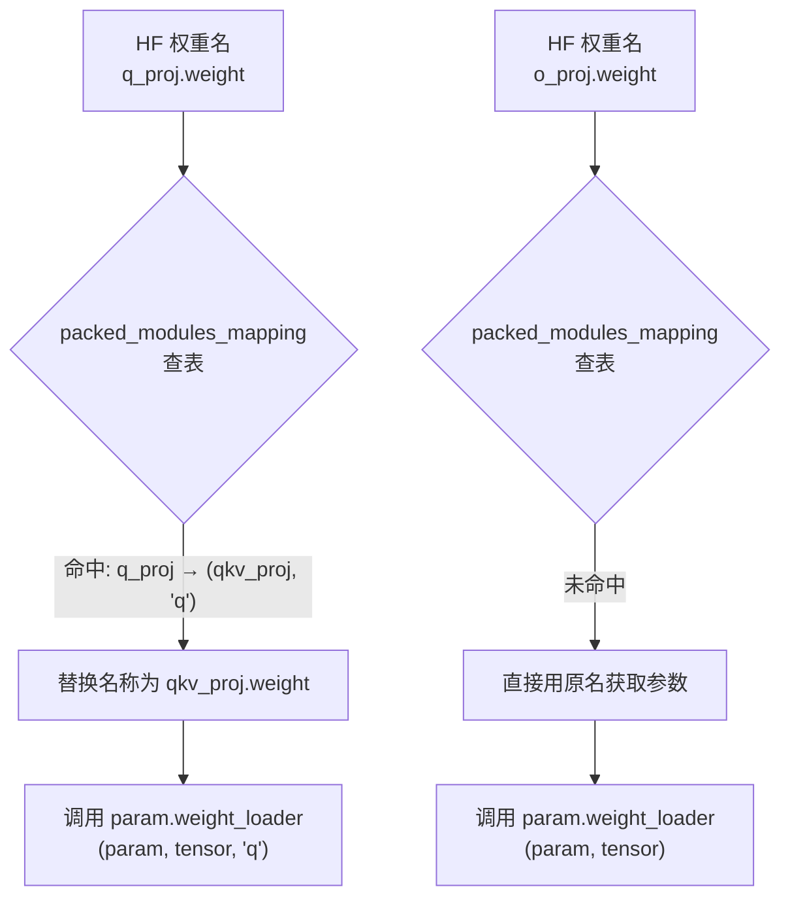
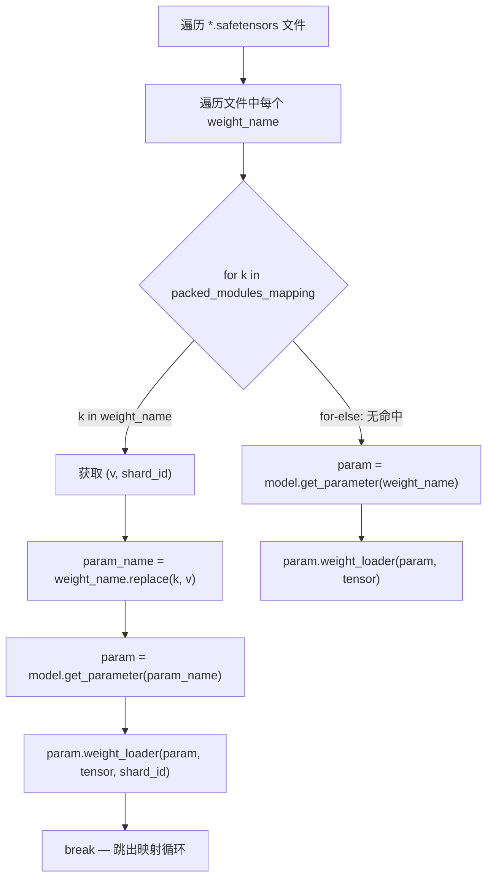
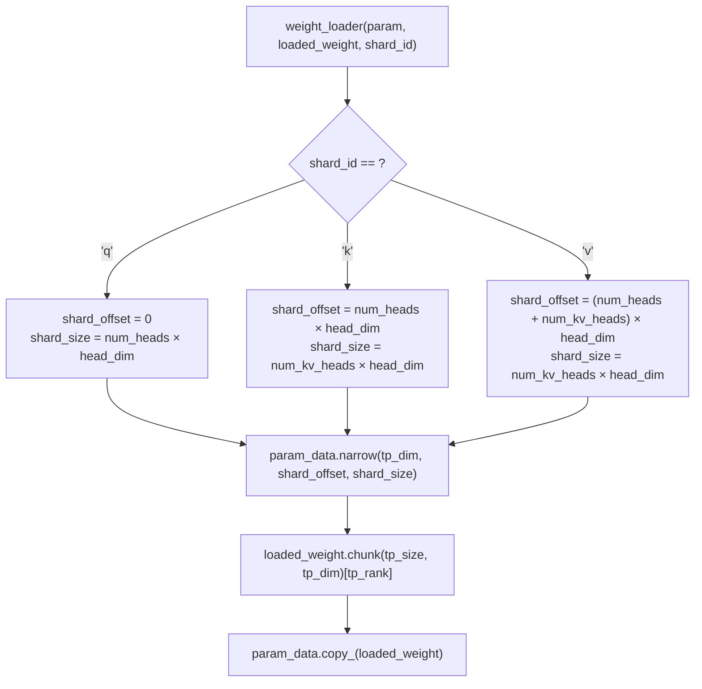

# PD-450.01 nano-vllm — safetensors 声明式权重融合与张量并行分片加载

> 文档编号：PD-450.01
> 来源：nano-vllm `nanovllm/utils/loader.py` `nanovllm/layers/linear.py` `nanovllm/models/qwen3.py`
> GitHub：https://github.com/GeeeekExplorer/nano-vllm.git
> 问题域：PD-450 模型权重加载与分片 Model Weight Loading & Sharding
> 状态：可复用方案

---

## 第 1 章 问题与动机

### 1.1 核心问题

HuggingFace 模型权重的参数命名和组织方式与推理引擎的并行线性层不一致。具体矛盾有三：

1. **命名不匹配**：HF 模型将 Q/K/V 存为三个独立权重（`q_proj.weight`、`k_proj.weight`、`v_proj.weight`），但推理引擎为了减少 kernel launch 开销，需要将它们融合为一个 `qkv_proj.weight`。同理 `gate_proj` 和 `up_proj` 需融合为 `gate_up_proj`。

2. **形状不匹配**：张量并行（Tensor Parallelism）要求每个 GPU 只持有权重的一个分片。HF 权重是完整的，加载时需要按 TP rank 切分到正确的偏移位置。

3. **融合 + 分片的组合复杂度**：QKV 融合不是简单拼接——Q 的 head 数可能与 K/V 不同（GQA），gate 和 up 的 intermediate_size 相同但偏移不同。融合和分片必须同时正确处理。

这个问题在所有 vLLM 类推理引擎中都存在，nano-vllm 用极简的方式给出了一个教科书级的解法。

### 1.2 nano-vllm 的解法概述

nano-vllm 的权重加载系统由三个协作组件构成：

1. **`packed_modules_mapping` 声明式映射表**（`nanovllm/models/qwen3.py:186-192`）：模型类上的类属性，声明 HF 权重名到融合层名 + shard_id 的映射关系。纯数据，不含逻辑。

2. **`weight_loader` 参数级回调**（`nanovllm/layers/linear.py:26`）：每个 `nn.Parameter` 在创建时被附加一个 `weight_loader` 方法。不同的并行线性层（Column/Row/Merged/QKV）各自实现自己的分片逻辑。

3. **`load_model` 统一加载器**（`nanovllm/utils/loader.py:12-28`）：遍历 safetensors 文件，对每个权重查映射表决定目标参数和 shard_id，然后调用参数自带的 `weight_loader` 完成分片写入。

### 1.3 设计思想

| 设计原则 | 具体实现 | 理由 | 替代方案 |
|----------|----------|------|----------|
| 声明式映射 | `packed_modules_mapping` 字典定义 HF→融合层的映射 | 新增模型只需改映射表，不改加载逻辑 | 硬编码 if-else 分支（vLLM 早期做法） |
| 参数自带加载器 | `param.weight_loader = self.weight_loader` | 分片逻辑与层类型绑定，加载器无需知道层的内部结构 | 集中式 loader 用 isinstance 判断层类型 |
| for-else 遍历 | `for k in mapping ... else` 模式 | 映射命中走融合路径，未命中走直接加载，代码极简 | 两遍遍历或预构建反向索引 |
| 零拷贝分片 | `narrow()` + `chunk()` 就地切片 | 不创建中间张量，内存效率最高 | `torch.split()` 返回新张量列表 |
| 统一回调签名 | 融合层的 `weight_loader` 多一个 `loaded_shard_id` 参数 | 加载器通过映射表传递 shard_id，层自己决定写入偏移 | 加载器计算偏移后直接写入（耦合） |

---

## 第 2 章 源码实现分析

### 2.1 架构概览

nano-vllm 的权重加载系统是一个三层协作架构：

```
┌─────────────────────────────────────────────────────────────────┐
│                    ModelRunner.__init__                          │
│                 nanovllm/engine/model_runner.py:32               │
│                                                                  │
│   model = Qwen3ForCausalLM(config)  ← 创建空模型（参数未初始化） │
│   load_model(model, path)           ← 填充权重                   │
└──────────────────────────────┬──────────────────────────────────┘
                               │
                               ▼
┌─────────────────────────────────────────────────────────────────┐
│                    load_model()                                   │
│                 nanovllm/utils/loader.py:12-28                    │
│                                                                  │
│   ┌─────────────┐    ┌──────────────────┐    ┌───────────────┐  │
│   │ safetensors │───→│ packed_modules   │───→│ param.weight  │  │
│   │   文件遍历   │    │ _mapping 查表    │    │ _loader 回调  │  │
│   └─────────────┘    └──────────────────┘    └───────────────┘  │
└─────────────────────────────────────────────────────────────────┘
                               │
                ┌──────────────┼──────────────┐
                ▼              ▼              ▼
┌──────────────────┐ ┌─────────────────┐ ┌──────────────────┐
│ QKVParallelLinear│ │MergedColumnPara │ │RowParallelLinear │
│  weight_loader   │ │ llelLinear      │ │  weight_loader   │
│  (q/k/v分片)     │ │ weight_loader   │ │  (行分片)         │
│  linear.py:114   │ │ (gate/up分片)   │ │  linear.py:142   │
└──────────────────┘ │ linear.py:87    │ └──────────────────┘
                     └─────────────────┘
```

### 2.2 核心实现

#### 2.2.1 声明式权重映射表



对应源码 `nanovllm/models/qwen3.py:186-192`：

```python
class Qwen3ForCausalLM(nn.Module):
    packed_modules_mapping = {
        "q_proj": ("qkv_proj", "q"),
        "k_proj": ("qkv_proj", "k"),
        "v_proj": ("qkv_proj", "v"),
        "gate_proj": ("gate_up_proj", 0),
        "up_proj": ("gate_up_proj", 1),
    }
```

映射表的 key 是 HF 权重名中的子串，value 是 `(目标参数名子串, shard_id)` 元组。`shard_id` 对 QKV 是字符串 `"q"/"k"/"v"`，对 gate/up 是整数 `0/1`。

#### 2.2.2 统一加载器 load_model



对应源码 `nanovllm/utils/loader.py:12-28`：

```python
def load_model(model: nn.Module, path: str):
    packed_modules_mapping = getattr(model, "packed_modules_mapping", {})
    for file in glob(os.path.join(path, "*.safetensors")):
        with safe_open(file, "pt", "cpu") as f:
            for weight_name in f.keys():
                for k in packed_modules_mapping:
                    if k in weight_name:
                        v, shard_id = packed_modules_mapping[k]
                        param_name = weight_name.replace(k, v)
                        param = model.get_parameter(param_name)
                        weight_loader = getattr(param, "weight_loader")
                        weight_loader(param, f.get_tensor(weight_name), shard_id)
                        break
                else:
                    param = model.get_parameter(weight_name)
                    weight_loader = getattr(param, "weight_loader", default_weight_loader)
                    weight_loader(param, f.get_tensor(weight_name))
```

关键设计点：
- `safe_open(file, "pt", "cpu")` 以 CPU 模式打开 safetensors，避免一次性加载到 GPU（`nanovllm/utils/loader.py:15`）
- Python `for...else` 语法：else 块仅在 for 循环未被 break 时执行，即权重名未命中任何映射规则时走直接加载路径（`nanovllm/utils/loader.py:25-28`）
- `default_weight_loader` 作为 fallback，对没有自定义 `weight_loader` 的参数直接 `copy_`（`nanovllm/utils/loader.py:8-9`）

#### 2.2.3 QKV 并行线性层的分片加载



对应源码 `nanovllm/layers/linear.py:96-128`：

```python
class QKVParallelLinear(ColumnParallelLinear):
    def __init__(self, hidden_size, head_size, total_num_heads,
                 total_num_kv_heads=None, bias=False):
        tp_size = dist.get_world_size()
        total_num_kv_heads = total_num_kv_heads or total_num_heads
        self.head_size = head_size
        self.num_heads = divide(total_num_heads, tp_size)
        self.num_kv_heads = divide(total_num_kv_heads, tp_size)
        output_size = (total_num_heads + 2 * total_num_kv_heads) * self.head_size
        super().__init__(hidden_size, output_size, bias)

    def weight_loader(self, param, loaded_weight, loaded_shard_id):
        param_data = param.data
        assert loaded_shard_id in ["q", "k", "v"]
        if loaded_shard_id == "q":
            shard_size = self.num_heads * self.head_size
            shard_offset = 0
        elif loaded_shard_id == "k":
            shard_size = self.num_kv_heads * self.head_size
            shard_offset = self.num_heads * self.head_size
        else:
            shard_size = self.num_kv_heads * self.head_size
            shard_offset = self.num_heads * self.head_size + self.num_kv_heads * self.head_size
        param_data = param_data.narrow(self.tp_dim, shard_offset, shard_size)
        loaded_weight = loaded_weight.chunk(self.tp_size, self.tp_dim)[self.tp_rank]
        param_data.copy_(loaded_weight)
```

这里的核心技巧：`narrow()` 返回的是原张量的视图（view），不分配新内存。`chunk()[tp_rank]` 从完整权重中取出当前 rank 的分片。两步组合实现了"先定位融合偏移，再切分 TP 分片"的双重映射。

### 2.3 实现细节

#### LinearBase 的参数级回调绑定

`nanovllm/layers/linear.py:12-31` 中，`LinearBase.__init__` 在创建 `nn.Parameter` 后立即将 `self.weight_loader` 绑定到参数上：

```python
self.weight = nn.Parameter(torch.empty(output_size, input_size))
self.weight.weight_loader = self.weight_loader
```

这是一个巧妙的设计：`weight_loader` 是实例方法，绑定到参数后，加载器只需 `getattr(param, "weight_loader")` 就能获取正确的分片逻辑，无需知道参数属于哪种层。

#### MergedColumnParallelLinear 的 gate/up 融合

`nanovllm/layers/linear.py:76-93` 处理 gate_proj 和 up_proj 的融合：

```python
class MergedColumnParallelLinear(ColumnParallelLinear):
    def __init__(self, input_size, output_sizes, bias=False):
        self.output_sizes = output_sizes
        super().__init__(input_size, sum(output_sizes), bias)

    def weight_loader(self, param, loaded_weight, loaded_shard_id):
        shard_offset = sum(self.output_sizes[:loaded_shard_id]) // self.tp_size
        shard_size = self.output_sizes[loaded_shard_id] // self.tp_size
        param_data = param_data.narrow(self.tp_dim, shard_offset, shard_size)
        loaded_weight = loaded_weight.chunk(self.tp_size, self.tp_dim)[self.tp_rank]
        param_data.copy_(loaded_weight)
```

`loaded_shard_id` 是整数（0 = gate, 1 = up），`output_sizes` 是 `[intermediate_size, intermediate_size]`。偏移计算 `sum(output_sizes[:shard_id]) // tp_size` 自动处理了 TP 分片后的偏移。

#### VocabParallelEmbedding 的词表分片

`nanovllm/layers/embed_head.py:9-32` 将词表按 TP 均分：

```python
class VocabParallelEmbedding(nn.Module):
    def __init__(self, num_embeddings, embedding_dim):
        self.num_embeddings_per_partition = num_embeddings // self.tp_size
        self.vocab_start_idx = self.num_embeddings_per_partition * self.tp_rank
        self.weight = nn.Parameter(torch.empty(self.num_embeddings_per_partition, embedding_dim))
        self.weight.weight_loader = self.weight_loader

    def weight_loader(self, param, loaded_weight):
        shard_size = param.data.size(0)
        start_idx = self.tp_rank * shard_size
        loaded_weight = loaded_weight.narrow(0, start_idx, shard_size)
        param.data.copy_(loaded_weight)
```

#### RowParallelLinear 的输入维度分片

与 ColumnParallelLinear 沿输出维度（dim=0）切分不同，`RowParallelLinear`（`nanovllm/layers/linear.py:131-153`）沿输入维度（dim=1）切分，并在 forward 中执行 `all_reduce` 聚合：

```python
class RowParallelLinear(LinearBase):
    def __init__(self, input_size, output_size, bias=False):
        tp_size = dist.get_world_size()
        super().__init__(divide(input_size, tp_size), output_size, bias, 1)  # tp_dim=1

    def forward(self, x):
        y = F.linear(x, self.weight, self.bias if self.tp_rank == 0 else None)
        if self.tp_size > 1:
            dist.all_reduce(y)
        return y
```

数据流全景：

```
HF safetensors 文件
    │
    ▼ safe_open("pt", "cpu")
CPU 张量
    │
    ▼ packed_modules_mapping 查表
    ├── 命中 → 名称替换 + shard_id
    │         ▼
    │   param.weight_loader(param, tensor, shard_id)
    │         │
    │         ├── QKVParallelLinear: narrow(偏移) + chunk(rank)
    │         ├── MergedColumnParallel: narrow(偏移) + chunk(rank)
    │         └── param_data.copy_()  → GPU 参数就地写入
    │
    └── 未命中 → 直接获取参数
              ▼
        param.weight_loader(param, tensor)
              │
              ├── ColumnParallelLinear: narrow(dim=0) → 输出维度分片
              ├── RowParallelLinear: narrow(dim=1) → 输入维度分片
              ├── VocabParallelEmbedding: narrow(dim=0) → 词表分片
              ├── ReplicatedLinear: 直接 copy_
              └── default_weight_loader: 直接 copy_
```

---

## 第 3 章 迁移指南

### 3.1 迁移清单

**阶段 1：定义并行线性层（1-2 天）**

- [ ] 实现 `LinearBase`，在 `__init__` 中为每个参数绑定 `weight_loader`
- [ ] 实现 `ColumnParallelLinear`（输出维度分片，tp_dim=0）
- [ ] 实现 `RowParallelLinear`（输入维度分片，tp_dim=1）
- [ ] 实现 `QKVParallelLinear`（支持 GQA 的 Q/K/V 融合分片）
- [ ] 实现 `MergedColumnParallelLinear`（gate/up 融合分片）

**阶段 2：定义模型映射表**

- [ ] 在模型类上定义 `packed_modules_mapping`
- [ ] 确认 HF 权重名中的子串与映射表 key 一致
- [ ] 验证 shard_id 类型（QKV 用字符串，Merged 用整数）

**阶段 3：实现加载器**

- [ ] 实现 `load_model` 函数，遍历 safetensors + 查映射表 + 调用回调
- [ ] 实现 `default_weight_loader` 作为 fallback
- [ ] 测试单 GPU 加载（tp_size=1）
- [ ] 测试多 GPU 加载（tp_size=2/4/8）

### 3.2 适配代码模板

以下是一个可直接复用的最小权重加载系统：

```python
import os
from glob import glob
import torch
from torch import nn
import torch.distributed as dist
from safetensors import safe_open


def divide(numerator: int, denominator: int) -> int:
    assert numerator % denominator == 0, f"{numerator} not divisible by {denominator}"
    return numerator // denominator


class LinearBase(nn.Module):
    """所有并行线性层的基类，核心是参数级 weight_loader 绑定"""

    def __init__(self, input_size: int, output_size: int,
                 bias: bool = False, tp_dim: int | None = None):
        super().__init__()
        self.tp_dim = tp_dim
        self.tp_rank = dist.get_rank() if dist.is_initialized() else 0
        self.tp_size = dist.get_world_size() if dist.is_initialized() else 1
        self.weight = nn.Parameter(torch.empty(output_size, input_size))
        self.weight.weight_loader = self.weight_loader  # 关键：参数级回调绑定
        if bias:
            self.bias = nn.Parameter(torch.empty(output_size))
            self.bias.weight_loader = self.weight_loader
        else:
            self.register_parameter("bias", None)

    def weight_loader(self, param: nn.Parameter, loaded_weight: torch.Tensor, *args):
        raise NotImplementedError


class ColumnParallelLinear(LinearBase):
    """输出维度分片：每个 rank 持有 output_size // tp_size 行"""

    def __init__(self, input_size: int, output_size: int, bias: bool = False):
        tp_size = dist.get_world_size() if dist.is_initialized() else 1
        super().__init__(input_size, divide(output_size, tp_size), bias, tp_dim=0)

    def weight_loader(self, param: nn.Parameter, loaded_weight: torch.Tensor):
        shard_size = param.data.size(self.tp_dim)
        start_idx = self.tp_rank * shard_size
        loaded_weight = loaded_weight.narrow(self.tp_dim, start_idx, shard_size)
        param.data.copy_(loaded_weight)


class QKVParallelLinear(ColumnParallelLinear):
    """Q/K/V 融合并行层，支持 GQA（num_kv_heads != num_heads）"""

    def __init__(self, hidden_size: int, head_size: int,
                 total_num_heads: int, total_num_kv_heads: int | None = None,
                 bias: bool = False):
        tp_size = dist.get_world_size() if dist.is_initialized() else 1
        total_num_kv_heads = total_num_kv_heads or total_num_heads
        self.head_size = head_size
        self.num_heads = divide(total_num_heads, tp_size)
        self.num_kv_heads = divide(total_num_kv_heads, tp_size)
        output_size = (total_num_heads + 2 * total_num_kv_heads) * head_size
        # 跳过 ColumnParallelLinear.__init__，直接调 LinearBase
        LinearBase.__init__(self, hidden_size, divide(output_size, tp_size), bias, tp_dim=0)

    def weight_loader(self, param: nn.Parameter, loaded_weight: torch.Tensor,
                      loaded_shard_id: str):
        param_data = param.data
        if loaded_shard_id == "q":
            shard_size = self.num_heads * self.head_size
            shard_offset = 0
        elif loaded_shard_id == "k":
            shard_size = self.num_kv_heads * self.head_size
            shard_offset = self.num_heads * self.head_size
        else:  # "v"
            shard_size = self.num_kv_heads * self.head_size
            shard_offset = self.num_heads * self.head_size + self.num_kv_heads * self.head_size
        param_data = param_data.narrow(self.tp_dim, shard_offset, shard_size)
        loaded_weight = loaded_weight.chunk(self.tp_size, self.tp_dim)[self.tp_rank]
        param_data.copy_(loaded_weight)


def default_weight_loader(param: nn.Parameter, loaded_weight: torch.Tensor):
    param.data.copy_(loaded_weight)


def load_model(model: nn.Module, path: str):
    """通用权重加载器：映射表驱动 + 参数级回调"""
    packed_modules_mapping = getattr(model, "packed_modules_mapping", {})
    for file in glob(os.path.join(path, "*.safetensors")):
        with safe_open(file, "pt", "cpu") as f:
            for weight_name in f.keys():
                for k in packed_modules_mapping:
                    if k in weight_name:
                        v, shard_id = packed_modules_mapping[k]
                        param_name = weight_name.replace(k, v)
                        param = model.get_parameter(param_name)
                        weight_loader = getattr(param, "weight_loader")
                        weight_loader(param, f.get_tensor(weight_name), shard_id)
                        break
                else:
                    param = model.get_parameter(weight_name)
                    weight_loader = getattr(param, "weight_loader", default_weight_loader)
                    weight_loader(param, f.get_tensor(weight_name))
```

### 3.3 适用场景

| 场景 | 适用度 | 说明 |
|------|--------|------|
| 自研 LLM 推理引擎 | ⭐⭐⭐ | 完美适用，直接复用全套架构 |
| 给现有框架添加新模型支持 | ⭐⭐⭐ | 只需定义 packed_modules_mapping + 并行层 |
| 单 GPU 推理（无 TP） | ⭐⭐ | 仍可用，tp_size=1 时 weight_loader 退化为直接 copy |
| 训练框架的权重加载 | ⭐ | 训练通常用 FSDP/DeepSpeed 自带的分片，不需要手动管理 |
| 非 Transformer 模型 | ⭐ | 映射表设计针对 Transformer 的 QKV/FFN 结构 |

---

## 第 4 章 测试用例

```python
import pytest
import torch
from unittest.mock import MagicMock, patch


class TestPackedModulesMapping:
    """测试声明式映射表的正确性"""

    def test_qkv_mapping_keys(self):
        mapping = {
            "q_proj": ("qkv_proj", "q"),
            "k_proj": ("qkv_proj", "k"),
            "v_proj": ("qkv_proj", "v"),
            "gate_proj": ("gate_up_proj", 0),
            "up_proj": ("gate_up_proj", 1),
        }
        # Q/K/V 映射到同一个目标参数
        assert mapping["q_proj"][0] == mapping["k_proj"][0] == mapping["v_proj"][0]
        # gate/up 映射到同一个目标参数
        assert mapping["gate_proj"][0] == mapping["up_proj"][0]
        # shard_id 类型正确
        assert all(isinstance(mapping[k][1], str) for k in ["q_proj", "k_proj", "v_proj"])
        assert all(isinstance(mapping[k][1], int) for k in ["gate_proj", "up_proj"])

    def test_name_replacement(self):
        """测试权重名替换逻辑"""
        mapping = {"q_proj": ("qkv_proj", "q")}
        weight_name = "model.layers.0.self_attn.q_proj.weight"
        k = "q_proj"
        v, shard_id = mapping[k]
        param_name = weight_name.replace(k, v)
        assert param_name == "model.layers.0.self_attn.qkv_proj.weight"
        assert shard_id == "q"


class TestWeightLoaderCallback:
    """测试参数级 weight_loader 回调"""

    def test_column_parallel_shard(self):
        """ColumnParallelLinear 沿 dim=0 切分"""
        # 模拟 tp_size=2, tp_rank=1
        full_weight = torch.randn(8, 4)  # output=8, input=4
        shard = full_weight.narrow(0, 4, 4)  # rank=1 取后半
        assert shard.shape == (4, 4)
        assert torch.equal(shard, full_weight[4:8])

    def test_qkv_shard_offsets(self):
        """QKV 融合层的偏移计算"""
        num_heads, num_kv_heads, head_dim = 8, 2, 64
        tp_size = 2
        # 每个 rank 的 head 数
        heads_per_rank = num_heads // tp_size  # 4
        kv_heads_per_rank = num_kv_heads // tp_size  # 1
        # Q 偏移
        q_offset, q_size = 0, heads_per_rank * head_dim  # 0, 256
        # K 偏移
        k_offset = q_size  # 256
        k_size = kv_heads_per_rank * head_dim  # 64
        # V 偏移
        v_offset = q_size + k_size  # 320
        v_size = kv_heads_per_rank * head_dim  # 64
        # 总大小 = Q + K + V
        total = q_size + k_size + v_size  # 384
        assert total == (heads_per_rank + 2 * kv_heads_per_rank) * head_dim

    def test_merged_column_shard_offsets(self):
        """MergedColumnParallelLinear 的 gate/up 偏移"""
        output_sizes = [1024, 1024]
        tp_size = 2
        # gate (shard_id=0): offset=0, size=512
        gate_offset = sum(output_sizes[:0]) // tp_size  # 0
        gate_size = output_sizes[0] // tp_size  # 512
        # up (shard_id=1): offset=512, size=512
        up_offset = sum(output_sizes[:1]) // tp_size  # 512
        up_size = output_sizes[1] // tp_size  # 512
        assert gate_offset == 0
        assert up_offset == 512
        assert gate_size == up_size == 512

    def test_row_parallel_shard_dim1(self):
        """RowParallelLinear 沿 dim=1 切分"""
        full_weight = torch.randn(4, 8)  # output=4, input=8
        tp_rank, tp_size = 0, 2
        shard_size = full_weight.size(1) // tp_size  # 4
        shard = full_weight.narrow(1, tp_rank * shard_size, shard_size)
        assert shard.shape == (4, 4)


class TestLoadModelIntegration:
    """测试 load_model 的集成行为"""

    def test_for_else_pattern(self):
        """for-else 模式：映射命中走 break，未命中走 else"""
        mapping = {"q_proj": ("qkv_proj", "q")}
        hit_names = []
        miss_names = []
        for weight_name in ["layer.q_proj.weight", "layer.o_proj.weight"]:
            for k in mapping:
                if k in weight_name:
                    hit_names.append(weight_name)
                    break
            else:
                miss_names.append(weight_name)
        assert hit_names == ["layer.q_proj.weight"]
        assert miss_names == ["layer.o_proj.weight"]

    def test_default_weight_loader_fallback(self):
        """无自定义 weight_loader 时使用 default_weight_loader"""
        param = torch.nn.Parameter(torch.zeros(4, 4))
        loaded = torch.ones(4, 4)
        # 模拟 default_weight_loader
        param.data.copy_(loaded)
        assert torch.equal(param.data, loaded)
```

---

## 第 5 章 跨域关联

| 关联域 | 关系类型 | 说明 |
|--------|----------|------|
| PD-447 张量并行 | 强依赖 | 权重加载的分片逻辑（Column/Row/QKV）直接服务于张量并行。`tp_dim`、`tp_rank`、`tp_size` 贯穿所有 weight_loader |
| PD-446 Paged KV Cache | 协同 | 权重加载完成后，ModelRunner 立即分配 KV Cache（`model_runner.py:100-118`），两者共享 TP 配置 |
| PD-448 CUDA Graph 优化 | 协同 | 权重加载 → warmup → KV Cache 分配 → CUDA Graph 捕获，是 ModelRunner 初始化的四步流水线（`model_runner.py:31-38`） |
| PD-453 Torch 编译优化 | 互斥 | nano-vllm 用 CUDA Graph 而非 torch.compile，但权重加载系统本身与编译方式无关 |
| PD-449 Continuous Batching | 协同 | 权重加载决定了模型的 TP 拓扑，Continuous Batching 的调度器在此拓扑上运行 |

---

## 第 6 章 来源文件索引

| 文件 | 行范围 | 关键实现 |
|------|--------|----------|
| `nanovllm/utils/loader.py` | L1-L28 | `default_weight_loader` + `load_model` 统一加载器 |
| `nanovllm/layers/linear.py` | L12-L31 | `LinearBase` 基类，参数级 weight_loader 绑定 |
| `nanovllm/layers/linear.py` | L37-L51 | `ReplicatedLinear` 全复制线性层 |
| `nanovllm/layers/linear.py` | L54-L73 | `ColumnParallelLinear` 列并行（输出维度分片） |
| `nanovllm/layers/linear.py` | L76-L93 | `MergedColumnParallelLinear` gate/up 融合分片 |
| `nanovllm/layers/linear.py` | L96-L128 | `QKVParallelLinear` Q/K/V 融合分片（支持 GQA） |
| `nanovllm/layers/linear.py` | L131-L153 | `RowParallelLinear` 行并行（输入维度分片 + all_reduce） |
| `nanovllm/layers/embed_head.py` | L9-L42 | `VocabParallelEmbedding` 词表并行分片 |
| `nanovllm/layers/embed_head.py` | L45-L66 | `ParallelLMHead` 并行输出头（gather 聚合） |
| `nanovllm/models/qwen3.py` | L186-L192 | `packed_modules_mapping` 声明式映射表 |
| `nanovllm/models/qwen3.py` | L42-L48 | `Qwen3Attention` 中 QKVParallelLinear 的使用 |
| `nanovllm/models/qwen3.py` | L99-L103 | `Qwen3MLP` 中 MergedColumnParallelLinear 的使用 |
| `nanovllm/engine/model_runner.py` | L31-L32 | ModelRunner 中模型创建 + load_model 调用入口 |

---

## 第 7 章 横向对比维度

> **重要：** 本章用于自动填充 Butcher Wiki 的横向对比表。
> 必须严格按以下 JSON 格式输出，放在 `comparison_data` 代码块中。

```json comparison_data
{
  "project": "nano-vllm",
  "dimensions": {
    "权重格式": "safetensors 逐文件遍历，CPU 模式 safe_open 避免 GPU OOM",
    "映射机制": "packed_modules_mapping 类属性声明式映射，for-else 查表",
    "分片策略": "参数级 weight_loader 回调，narrow+chunk 零拷贝分片",
    "融合支持": "QKV 三合一 + gate/up 二合一，支持 GQA 不等头数",
    "并行层体系": "5 层继承体系：Base→Column→Merged/QKV + Row + Replicated",
    "词表处理": "VocabParallelEmbedding 按 rank 均分词表行"
  }
}
```

### 域元数据补充

```json domain_metadata
{
  "solution_summary": "nano-vllm 用 packed_modules_mapping 声明式映射 + 参数级 weight_loader 回调实现 safetensors 到张量并行层的自动权重融合与分片加载",
  "description": "涵盖从 HF 权重文件到自定义并行层的完整映射链路，包括名称替换、偏移计算和零拷贝分片",
  "sub_problems": [
    "词表并行分片加载（Embedding/LMHead）",
    "for-else 模式的映射命中与 fallback 路径分离"
  ],
  "best_practices": [
    "LinearBase 基类统一绑定 weight_loader，子类只需覆写分片逻辑",
    "safe_open 以 CPU 模式打开避免 GPU 内存峰值",
    "narrow() 零拷贝视图定位偏移，chunk() 取 TP rank 分片"
  ]
}
```
