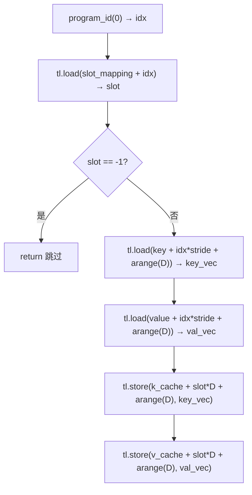
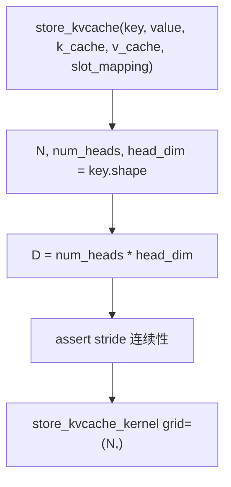
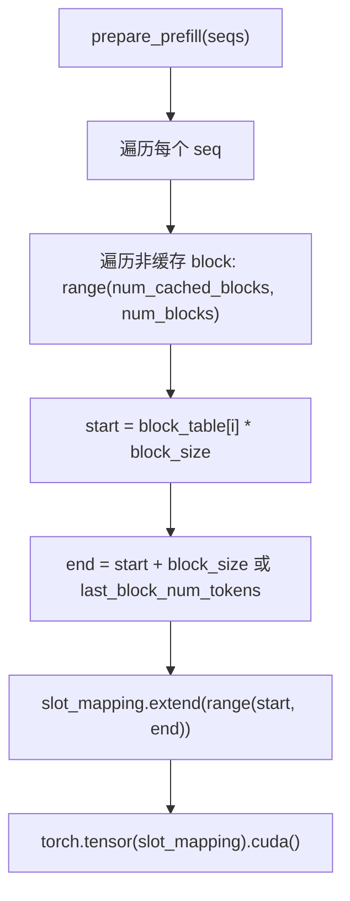

# PD-451.02 nano-vllm — Triton JIT store_kvcache 自定义算子

> 文档编号：PD-451.02
> 来源：nano-vllm `nanovllm/layers/attention.py`
> GitHub：https://github.com/GeeeekExplorer/nano-vllm.git
> 问题域：PD-451 Triton 自定义算子 Triton Custom Kernels
> 状态：可复用方案

---

## 第 1 章 问题与动机

### 1.1 核心问题

在分页 KV Cache 推理引擎中，每次 prefill 或 decode 步骤都需要将新计算的 key/value 张量写入分页缓存的正确物理位置。核心挑战在于：

1. **地址不连续**：分页缓存中，一个序列的 KV 数据分散在多个物理 block 中，逻辑 token 位置到物理 slot 的映射由 `slot_mapping` 数组描述
2. **Python 循环开销**：如果用 Python for 循环逐 token 写入缓存，每次循环都会触发一次 CUDA kernel launch，开销远超实际计算
3. **PyTorch scatter 不够灵活**：`torch.scatter` 虽然可以做分散写入，但对于 `[N, num_heads, head_dim]` → `[num_blocks * block_size, num_kv_heads * head_dim]` 这种多维到扁平化的映射，需要额外的 reshape 和 index 构造，代码复杂且性能不优
4. **CUDA C 门槛高**：手写 CUDA C kernel 可以解决问题，但编译链复杂、调试困难，不适合快速迭代的推理引擎

### 1.2 nano-vllm 的解法概述

nano-vllm 用 Triton JIT 编写了一个极简的 `store_kvcache_kernel`，仅 10 行核心逻辑即完成分散写入：

1. **一个 Triton kernel 替代 Python 循环**：每个 program instance 处理一个 token 的 KV 写入（`nanovllm/layers/attention.py:10-30`）
2. **slot_mapping 做逻辑→物理映射**：通过 `tl.load(slot_mapping_ptr + idx)` 获取物理 slot，支持 `-1` 表示跳过（`attention.py:22-23`）
3. **D = num_heads * head_dim 一次性读写**：将多头维度展平为一维，用 `tl.arange(0, D)` 一次性加载/存储整个 token 的 KV 向量（`attention.py:19,24-30`）
4. **Python wrapper 做参数校验**：`store_kvcache` 函数验证 stride 和 shape 后直接调用 kernel（`attention.py:33-40`）
5. **与 FlashAttention 无缝集成**：写入缓存后直接调用 `flash_attn_varlen_func` 或 `flash_attn_with_kvcache`（`attention.py:64-74`）

### 1.3 设计思想

| 设计原则 | 具体实现 | 理由 | 替代方案 |
|----------|----------|------|----------|
| 极简内核 | 整个 kernel 仅 10 行，无循环、无分支（除 slot==-1 跳过） | 减少 bug 面，Triton 编译器更容易优化 | 复杂 kernel 合并 RoPE+store |
| 一 token 一 program | `tl.program_id(0)` 对应 token index，grid=(N,) | 最大化 GPU 并行度，N 个 token 完全独立 | 一 block 一 program（需内部循环） |
| D 维度展平 | `D = num_heads * head_dim` 作为 `tl.constexpr` | 编译期确定向量宽度，Triton 自动向量化 | 二维 grid 分 head 和 dim |
| slot_mapping 间接寻址 | 物理 slot = `slot_mapping[token_idx]` | 解耦逻辑地址与物理地址，支持分页和 prefix cache | 直接计算 block_id * block_size + offset |
| -1 哨兵跳过 | `if slot == -1: return` | 支持 CUDA Graph 中 padding token 的跳过 | mask 张量（额外显存） |

---

## 第 2 章 源码实现分析

### 2.1 架构概览

nano-vllm 的 KV Cache 写入涉及三层组件协作：

```
┌─────────────────────────────────────────────────────────────────┐
│                        ModelRunner                              │
│  prepare_prefill() / prepare_decode()                           │
│  → 构建 slot_mapping 张量                                       │
│  → set_context(slot_mapping=..., block_tables=...)              │
├─────────────────────────────────────────────────────────────────┤
│                        Attention.forward()                      │
│  → store_kvcache(k, v, k_cache, v_cache, slot_mapping)         │
│  → flash_attn_varlen_func / flash_attn_with_kvcache            │
├─────────────────────────────────────────────────────────────────┤
│                   store_kvcache_kernel (Triton JIT)             │
│  → 每个 program 读取一个 token 的 K/V                            │
│  → 通过 slot_mapping 写入物理缓存位置                             │
└─────────────────────────────────────────────────────────────────┘
```

数据流：

```
BlockManager.allocate(seq)
  → seq.block_table = [block_id_0, block_id_1, ...]
  
ModelRunner.prepare_prefill(seqs)
  → slot_mapping = [block_id * block_size + offset, ...]  (每个非缓存 token 一个 slot)
  → set_context(slot_mapping=slot_mapping)

Attention.forward(q, k, v)
  → store_kvcache(k, v, k_cache, v_cache, context.slot_mapping)
    → store_kvcache_kernel[(N,)](key, stride, value, stride, k_cache, v_cache, slot_mapping, D)
  → flash_attn_varlen_func(q, k, v, ...)  # prefill
  → flash_attn_with_kvcache(q, k_cache, v_cache, ...)  # decode
```

### 2.2 核心实现

#### 2.2.1 Triton Kernel：store_kvcache_kernel



对应源码 `nanovllm/layers/attention.py:10-30`：

```python
@triton.jit
def store_kvcache_kernel(
    key_ptr,
    key_stride,
    value_ptr,
    value_stride,
    k_cache_ptr,
    v_cache_ptr,
    slot_mapping_ptr,
    D: tl.constexpr,
):
    idx = tl.program_id(0)
    slot = tl.load(slot_mapping_ptr + idx)
    if slot == -1: return
    key_offsets = idx * key_stride + tl.arange(0, D)
    value_offsets = idx * value_stride + tl.arange(0, D)
    key = tl.load(key_ptr + key_offsets)
    value = tl.load(value_ptr + value_offsets)
    cache_offsets = slot * D + tl.arange(0, D)
    tl.store(k_cache_ptr + cache_offsets, key)
    tl.store(v_cache_ptr + cache_offsets, value)
```

关键设计点：
- **`D: tl.constexpr`**（`attention.py:19`）：D 在编译期确定，Triton 编译器可以将 `tl.arange(0, D)` 展开为固定宽度的向量操作，避免运行时循环
- **`tl.program_id(0)`**（`attention.py:21`）：一维 grid，每个 program 处理一个 token，grid 大小 = N（token 数量）
- **`slot == -1` 哨兵**（`attention.py:23`）：CUDA Graph 捕获时 slot_mapping 可能有 padding，-1 表示无效 token，直接跳过
- **stride 参数**（`attention.py:13-15`）：key/value 的 stride(0) 作为参数传入，支持非连续张量

#### 2.2.2 Python Wrapper：store_kvcache



对应源码 `nanovllm/layers/attention.py:33-40`：

```python
def store_kvcache(key: torch.Tensor, value: torch.Tensor,
                  k_cache: torch.Tensor, v_cache: torch.Tensor,
                  slot_mapping: torch.Tensor):
    N, num_heads, head_dim = key.shape
    D = num_heads * head_dim
    assert key.stride(-1) == 1 and value.stride(-1) == 1
    assert key.stride(1) == head_dim and value.stride(1) == head_dim
    assert k_cache.stride(1) == D and v_cache.stride(1) == D
    assert slot_mapping.numel() == N
    store_kvcache_kernel[(N,)](key, key.stride(0), value, value.stride(0),
                               k_cache, v_cache, slot_mapping, D)
```

关键设计点：
- **4 条 assert**（`attention.py:36-39`）：验证张量内存布局，确保 Triton kernel 的指针算术正确。`stride(-1)==1` 确保最内层维度连续，`stride(1)==head_dim` 确保 head 维度紧凑排列
- **grid=(N,)**（`attention.py:40`）：N 个 token 启动 N 个 program，完全并行

#### 2.2.3 slot_mapping 构建



对应源码 `nanovllm/engine/model_runner.py:126-162`（prefill 路径）和 `model_runner.py:164-180`（decode 路径）：

Prefill 时，slot_mapping 包含所有非缓存 token 的物理 slot：
```python
# model_runner.py:147-153
for i in range(seq.num_cached_blocks, seq.num_blocks):
    start = seq.block_table[i] * self.block_size
    if i != seq.num_blocks - 1:
        end = start + self.block_size
    else:
        end = start + seq.last_block_num_tokens
    slot_mapping.extend(list(range(start, end)))
```

Decode 时，slot_mapping 只有一个元素（当前 token 的 slot）：
```python
# model_runner.py:173
slot_mapping.append(seq.block_table[-1] * self.block_size + seq.last_block_num_tokens - 1)
```

### 2.3 实现细节

#### KV Cache 内存布局

KV Cache 在 `ModelRunner.allocate_kv_cache()`（`model_runner.py:100-118`）中一次性分配：

```python
# model_runner.py:112
self.kv_cache = torch.empty(
    2,                          # K 和 V
    hf_config.num_hidden_layers, # 层数
    config.num_kvcache_blocks,   # 物理 block 数
    self.block_size,             # 每 block token 数（256）
    num_kv_heads,                # KV head 数
    head_dim                     # head 维度
)
```

形状为 `[2, num_layers, num_blocks, block_size, num_kv_heads, head_dim]`。每层的 `k_cache` 形状为 `[num_blocks, block_size, num_kv_heads, head_dim]`，其中 `stride(1) = num_kv_heads * head_dim = D`，这正是 Triton kernel 中 `cache_offsets = slot * D + tl.arange(0, D)` 的寻址基础。

#### CUDA Graph 兼容

在 `capture_cudagraph()`（`model_runner.py:216-251`）中，slot_mapping 被预分配为固定大小张量：

```python
# model_runner.py:224
slot_mapping = torch.zeros(max_bs, dtype=torch.int32)
```

运行时通过 `fill_(-1)` 重置后填入有效值（`model_runner.py:200-201`）：
```python
graph_vars["slot_mapping"].fill_(-1)
graph_vars["slot_mapping"][:bs] = context.slot_mapping
```

这就是 Triton kernel 中 `if slot == -1: return` 的用途——CUDA Graph 要求固定 grid 大小，多余的 program 通过哨兵值跳过。

#### 全局 Context 传递

nano-vllm 使用全局 `Context` dataclass（`utils/context.py:6-14`）在 ModelRunner 和 Attention 之间传递 slot_mapping、block_tables 等元数据，避免修改模型 forward 签名：

```python
# utils/context.py:6-14
@dataclass
class Context:
    is_prefill: bool = False
    slot_mapping: torch.Tensor | None = None
    context_lens: torch.Tensor | None = None
    block_tables: torch.Tensor | None = None
    # ...
```


---

## 第 3 章 迁移指南

### 3.1 迁移清单

**阶段 1：基础设施（前置条件）**

- [ ] 确认项目已有分页 KV Cache 机制（block_table + slot_mapping）
- [ ] 确认 `pip install triton` 可用（需要 NVIDIA GPU + CUDA）
- [ ] 确认 KV Cache 张量的内存布局：`[num_blocks, block_size, num_kv_heads, head_dim]` 或等价的连续布局

**阶段 2：核心移植**

- [ ] 复制 `store_kvcache_kernel` 和 `store_kvcache` 到你的 attention 模块
- [ ] 适配 key/value 张量的 shape 和 stride（确保 `stride(-1)==1`）
- [ ] 适配 k_cache/v_cache 的 stride（确保 `stride(1) == num_kv_heads * head_dim`）
- [ ] 构建 slot_mapping：prefill 时为每个非缓存 token 计算 `block_id * block_size + offset`

**阶段 3：CUDA Graph 兼容（可选）**

- [ ] 预分配固定大小的 slot_mapping 张量
- [ ] 运行时 `fill_(-1)` 后填入有效值
- [ ] 确认 Triton kernel 的 `-1` 哨兵跳过逻辑正常工作

### 3.2 适配代码模板

以下代码可直接复用，仅需调整 import 路径：

```python
import torch
import triton
import triton.language as tl


@triton.jit
def store_kvcache_kernel(
    key_ptr, key_stride,
    value_ptr, value_stride,
    k_cache_ptr, v_cache_ptr,
    slot_mapping_ptr,
    D: tl.constexpr,
):
    """将一个 token 的 K/V 向量写入分页缓存的物理 slot。
    
    grid: (N,)  N = token 数量
    每个 program 处理一个 token。
    """
    idx = tl.program_id(0)
    slot = tl.load(slot_mapping_ptr + idx)
    if slot == -1:
        return  # CUDA Graph padding，跳过
    # 读取 key/value（展平为 D = num_heads * head_dim）
    key_offsets = idx * key_stride + tl.arange(0, D)
    value_offsets = idx * value_stride + tl.arange(0, D)
    key = tl.load(key_ptr + key_offsets)
    value = tl.load(value_ptr + value_offsets)
    # 写入缓存
    cache_offsets = slot * D + tl.arange(0, D)
    tl.store(k_cache_ptr + cache_offsets, key)
    tl.store(v_cache_ptr + cache_offsets, value)


def store_kvcache(
    key: torch.Tensor,       # [N, num_kv_heads, head_dim]
    value: torch.Tensor,     # [N, num_kv_heads, head_dim]
    k_cache: torch.Tensor,   # [num_blocks * block_size, num_kv_heads, head_dim] 或等价
    v_cache: torch.Tensor,
    slot_mapping: torch.Tensor,  # [N] int32, 物理 slot 索引，-1 表示跳过
):
    N, num_heads, head_dim = key.shape
    D = num_heads * head_dim
    # 验证内存布局
    assert key.stride(-1) == 1 and value.stride(-1) == 1, "最内层维度必须连续"
    assert key.stride(1) == head_dim and value.stride(1) == head_dim, "head 维度紧凑排列"
    assert k_cache.stride(-2) == D and v_cache.stride(-2) == D, "cache 的 slot 维度 stride == D"
    assert slot_mapping.numel() == N
    store_kvcache_kernel[(N,)](
        key, key.stride(0),
        value, value.stride(0),
        k_cache, v_cache,
        slot_mapping, D,
    )


def build_slot_mapping_prefill(
    block_table: list[int],
    block_size: int,
    num_tokens: int,
    num_cached_tokens: int,
) -> list[int]:
    """为 prefill 阶段构建 slot_mapping。"""
    slot_mapping = []
    num_blocks = (num_tokens + block_size - 1) // block_size
    num_cached_blocks = num_cached_tokens // block_size
    for i in range(num_cached_blocks, num_blocks):
        start = block_table[i] * block_size
        if i != num_blocks - 1:
            end = start + block_size
        else:
            last_block_tokens = num_tokens - (num_blocks - 1) * block_size
            end = start + last_block_tokens
        slot_mapping.extend(range(start, end))
    return slot_mapping


def build_slot_mapping_decode(
    block_table: list[int],
    block_size: int,
    num_tokens: int,
) -> int:
    """为 decode 阶段构建单个 slot。"""
    num_blocks = (num_tokens + block_size - 1) // block_size
    last_block_tokens = num_tokens - (num_blocks - 1) * block_size
    return block_table[-1] * block_size + last_block_tokens - 1
```

### 3.3 适用场景

| 场景 | 适用度 | 说明 |
|------|--------|------|
| 分页 KV Cache 推理引擎 | ⭐⭐⭐ | 核心场景，直接复用 |
| 连续 KV Cache（无分页） | ⭐ | 不需要 slot_mapping，直接 index 即可 |
| 多 GPU 张量并行 | ⭐⭐⭐ | 每个 GPU 独立运行 kernel，KV head 已按 TP 切分 |
| CPU 推理 | ⭐ | Triton 仅支持 NVIDIA GPU |
| AMD GPU (ROCm) | ⭐⭐ | Triton 有 ROCm 后端，但需测试兼容性 |
| 需要 FP8 KV Cache | ⭐⭐ | 可在 kernel 中加 `tl.cast` 做量化写入 |

---

## 第 4 章 测试用例

```python
import pytest
import torch


def reference_store_kvcache(key, value, k_cache, v_cache, slot_mapping):
    """Python 参考实现，用于验证 Triton kernel 正确性。"""
    for i in range(key.shape[0]):
        slot = slot_mapping[i].item()
        if slot == -1:
            continue
        k_cache[slot] = key[i].flatten()
        v_cache[slot] = value[i].flatten()


class TestStoreKvcacheKernel:
    """测试 store_kvcache Triton kernel。"""

    @pytest.fixture
    def cache_params(self):
        num_blocks = 8
        block_size = 256
        num_kv_heads = 4
        head_dim = 64
        total_slots = num_blocks * block_size
        D = num_kv_heads * head_dim
        k_cache = torch.zeros(total_slots, D, device="cuda", dtype=torch.float16)
        v_cache = torch.zeros(total_slots, D, device="cuda", dtype=torch.float16)
        return num_blocks, block_size, num_kv_heads, head_dim, k_cache, v_cache

    def test_basic_store(self, cache_params):
        """正常路径：N 个 token 写入不同 slot。"""
        num_blocks, block_size, num_kv_heads, head_dim, k_cache, v_cache = cache_params
        N = 16
        key = torch.randn(N, num_kv_heads, head_dim, device="cuda", dtype=torch.float16)
        value = torch.randn(N, num_kv_heads, head_dim, device="cuda", dtype=torch.float16)
        slots = torch.arange(N, dtype=torch.int32, device="cuda")

        store_kvcache(key, value, k_cache, v_cache, slots)

        D = num_kv_heads * head_dim
        for i in range(N):
            assert torch.allclose(k_cache[i], key[i].flatten())
            assert torch.allclose(v_cache[i], value[i].flatten())

    def test_scattered_slots(self, cache_params):
        """分散 slot：模拟分页缓存的非连续写入。"""
        num_blocks, block_size, num_kv_heads, head_dim, k_cache, v_cache = cache_params
        N = 8
        key = torch.randn(N, num_kv_heads, head_dim, device="cuda", dtype=torch.float16)
        value = torch.randn(N, num_kv_heads, head_dim, device="cuda", dtype=torch.float16)
        # 分散的 slot 位置
        slots = torch.tensor([0, 256, 512, 768, 1024, 1280, 1536, 1792],
                             dtype=torch.int32, device="cuda")

        store_kvcache(key, value, k_cache, v_cache, slots)

        for i in range(N):
            slot = slots[i].item()
            assert torch.allclose(k_cache[slot], key[i].flatten())

    def test_sentinel_skip(self, cache_params):
        """哨兵值 -1：CUDA Graph padding token 应被跳过。"""
        num_blocks, block_size, num_kv_heads, head_dim, k_cache, v_cache = cache_params
        N = 4
        key = torch.randn(N, num_kv_heads, head_dim, device="cuda", dtype=torch.float16)
        value = torch.randn(N, num_kv_heads, head_dim, device="cuda", dtype=torch.float16)
        slots = torch.tensor([0, -1, 2, -1], dtype=torch.int32, device="cuda")

        k_cache_before = k_cache.clone()
        store_kvcache(key, value, k_cache, v_cache, slots)

        # slot 0 和 2 应被写入
        assert torch.allclose(k_cache[0], key[0].flatten())
        assert torch.allclose(k_cache[2], key[2].flatten())
        # slot 1 和 3 位置应保持不变（全零）
        assert torch.allclose(k_cache[1], k_cache_before[1])
        assert torch.allclose(k_cache[3], k_cache_before[3])

    def test_matches_reference(self, cache_params):
        """对比 Python 参考实现，验证数值一致性。"""
        num_blocks, block_size, num_kv_heads, head_dim, k_cache, v_cache = cache_params
        N = 32
        key = torch.randn(N, num_kv_heads, head_dim, device="cuda", dtype=torch.float16)
        value = torch.randn(N, num_kv_heads, head_dim, device="cuda", dtype=torch.float16)
        slots = torch.randint(0, num_blocks * block_size, (N,), dtype=torch.int32, device="cuda")

        k_ref = k_cache.clone()
        v_ref = v_cache.clone()
        reference_store_kvcache(key, value, k_ref, v_ref, slots)
        store_kvcache(key, value, k_cache, v_cache, slots)

        assert torch.allclose(k_cache, k_ref)
        assert torch.allclose(v_cache, v_ref)
```


---

## 第 5 章 跨域关联

| 关联域 | 关系类型 | 说明 |
|--------|----------|------|
| PD-446 分页 KV Cache | 强依赖 | store_kvcache_kernel 的存在前提是分页缓存架构，slot_mapping 由 BlockManager 生成 |
| PD-448 CUDA Graph 优化 | 协同 | CUDA Graph 要求固定 grid 大小，kernel 的 `-1` 哨兵跳过机制专为此设计 |
| PD-447 张量并行 | 协同 | 每个 TP rank 独立运行 kernel，KV head 已按 `num_kv_heads // tp_size` 切分 |
| PD-452 GPU 显存管理 | 协同 | KV Cache 的总显存由 `allocate_kv_cache()` 根据 GPU 剩余显存动态计算 |
| PD-449 连续批处理 | 协同 | Scheduler 的 prefill/decode 调度决定了 slot_mapping 的构建方式 |
| PD-453 torch.compile | 互补 | nano-vllm 中 RoPE 和 RMSNorm 用 `@torch.compile`，KV Cache 写入用 Triton，各取所长 |

---

## 第 6 章 来源文件索引

| 文件 | 行范围 | 关键实现 |
|------|--------|----------|
| `nanovllm/layers/attention.py` | L1-L76 | Triton kernel 定义、Python wrapper、Attention 模块 |
| `nanovllm/layers/attention.py` | L10-L30 | `store_kvcache_kernel` Triton JIT 核心 |
| `nanovllm/layers/attention.py` | L33-L40 | `store_kvcache` Python wrapper + stride 校验 |
| `nanovllm/layers/attention.py` | L43-L75 | `Attention.forward` 调用 store + FlashAttention |
| `nanovllm/engine/model_runner.py` | L100-L118 | `allocate_kv_cache` KV Cache 显存分配 |
| `nanovllm/engine/model_runner.py` | L126-L162 | `prepare_prefill` slot_mapping 构建（prefill） |
| `nanovllm/engine/model_runner.py` | L164-L180 | `prepare_decode` slot_mapping 构建（decode） |
| `nanovllm/engine/model_runner.py` | L216-L251 | `capture_cudagraph` CUDA Graph 捕获 + slot_mapping 预分配 |
| `nanovllm/engine/model_runner.py` | L189-L214 | `run_model` / `run` CUDA Graph replay + 哨兵填充 |
| `nanovllm/utils/context.py` | L1-L28 | `Context` dataclass + 全局 get/set |
| `nanovllm/engine/block_manager.py` | L26-L113 | `BlockManager` 分页管理 + hash 前缀缓存 |
| `nanovllm/engine/sequence.py` | L14-L84 | `Sequence` block_table 管理 |
| `nanovllm/config.py` | L7-L27 | `Config` kvcache_block_size=256 配置 |

---

## 第 7 章 横向对比维度

> **重要：** 本章用于自动填充 Butcher Wiki 的横向对比表。

```json comparison_data
{
  "project": "nano-vllm",
  "dimensions": {
    "内核粒度": "一 token 一 program，D=num_heads*head_dim 展平为一维向量操作",
    "编程模型": "Triton JIT + tl.constexpr 编译期特化，10 行核心逻辑",
    "地址映射": "slot_mapping 间接寻址，-1 哨兵支持 CUDA Graph padding",
    "与框架集成": "Python wrapper 做 stride 校验，全局 Context dataclass 传递元数据",
    "自动调优": "未使用 triton.autotune，D 为 constexpr 由编译器自动向量化"
  }
}
```

### 域元数据补充

```json domain_metadata
{
  "solution_summary": "nano-vllm 用 10 行 Triton JIT 实现 store_kvcache_kernel，通过 slot_mapping 间接寻址 + D=num_heads*head_dim 展平一次性读写，配合 -1 哨兵支持 CUDA Graph",
  "description": "Triton 自定义算子在推理引擎中替代 Python 循环和 CUDA C 的轻量级 GPU 编程方案",
  "sub_problems": [
    "CUDA Graph 固定 grid 下的 padding token 跳过机制",
    "Triton kernel 与全局 Context 的元数据传递模式"
  ],
  "best_practices": [
    "用 tl.constexpr 声明编译期常量让 Triton 自动向量化",
    "Python wrapper 中用 assert 校验 stride 确保指针算术正确",
    "用 -1 哨兵值替代 mask 张量节省显存并兼容 CUDA Graph"
  ]
}
```

