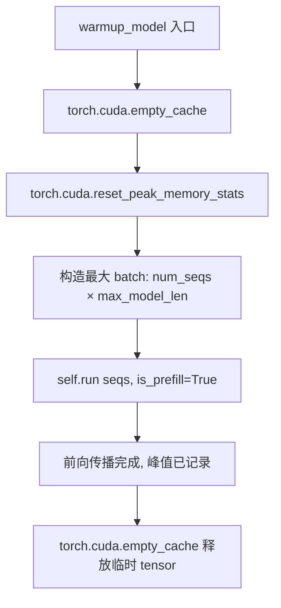
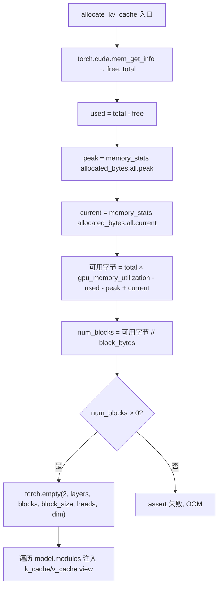

# PD-452.01 nano-vllm — Warmup 探测 + 比例分配 GPU 显存管理

> 文档编号：PD-452.01
> 来源：nano-vllm `nanovllm/engine/model_runner.py`
> GitHub：https://github.com/GeeeekExplorer/nano-vllm.git
> 问题域：PD-452 GPU 内存动态分配 GPU Memory Dynamic Allocation
> 状态：可复用方案

---

## 第 1 章 问题与动机

### 1.1 核心问题

LLM 推理引擎的显存管理面临一个根本矛盾：**模型权重 + 激活值占用的显存是动态的（取决于模型大小、batch size、序列长度），而 KV Cache 需要在推理前一次性预分配**。分配过多 KV Cache 会导致 OOM，分配过少则浪费 GPU 算力——无法同时服务更多请求。

核心挑战：
- 模型加载后的实际显存占用无法在加载前精确预测（权重量化、TP 切分、CUDA 内部碎片等因素）
- 不同 GPU 型号的总显存不同，硬编码 block 数量不可移植
- 用户可能希望为其他任务保留部分显存（如同时运行多个模型）

### 1.2 nano-vllm 的解法概述

nano-vllm 采用 **"先探测，再分配"** 的两阶段策略：

1. **Warmup 推理探测峰值显存**（`model_runner.py:91-98`）：用最大 batch × 最大序列长度做一次完整前向传播，让 PyTorch CUDA allocator 记录真实的峰值显存
2. **比例计算可用 block 数**（`model_runner.py:100-118`）：读取 `torch.cuda.mem_get_info()` 获取物理显存，结合 `memory_stats()["allocated_bytes.all.peak"]` 获取峰值分配，按 `gpu_memory_utilization` 比例计算可分配给 KV Cache 的字节数
3. **一次性 tensor 分配**（`model_runner.py:112`）：用 `torch.empty()` 分配一个 6 维 tensor 作为全部 KV Cache，然后将 view 注入到每个 Attention 层
4. **BlockManager 管理 block 生命周期**（`block_manager.py:26-113`）：基于 block 数量上限进行分配/回收/prefix cache 复用

### 1.3 设计思想

| 设计原则 | 具体实现 | 理由 | 替代方案 |
|----------|----------|------|----------|
| 实测优于估算 | warmup 推理获取真实峰值显存 | CUDA allocator 的碎片、对齐等开销无法精确预测 | 根据模型参数量估算（不准确） |
| 用户可控比例 | `gpu_memory_utilization=0.9` 默认值 | 允许用户为其他任务保留 10% 显存 | 固定占满（不灵活） |
| 统一 tensor 分配 | 一个 6D tensor 覆盖所有层的 KV Cache | 减少 CUDA malloc 次数，避免碎片 | 每层独立分配（碎片多） |
| Block 粒度管理 | 256 token/block，BlockManager 管理 | 平衡内存利用率和管理开销 | Token 级管理（开销大）或固定序列长度（浪费） |
| 峰值-当前差值修正 | `peak - current` 修正已释放的临时显存 | warmup 后 empty_cache 释放了临时 tensor，但 peak 仍记录了它们 | 只用 peak（高估占用） |

---

## 第 2 章 源码实现分析

### 2.1 架构概览

nano-vllm 的显存管理涉及 4 个核心组件，形成从配置到运行时的完整链路：

```
┌─────────────────────────────────────────────────────────────┐
│                        Config                                │
│  gpu_memory_utilization=0.9  kvcache_block_size=256          │
│  num_kvcache_blocks=-1 (待计算)                               │
└──────────────────────┬──────────────────────────────────────┘
                       │
                       ▼
┌─────────────────────────────────────────────────────────────┐
│                    ModelRunner.__init__                       │
│  1. load_model()          → 模型权重上 GPU                    │
│  2. warmup_model()        → 探测峰值显存                      │
│  3. allocate_kv_cache()   → 计算 block 数 + 分配 tensor       │
│  4. capture_cudagraph()   → CUDA Graph 捕获（可选）           │
└──────────────────────┬──────────────────────────────────────┘
                       │ config.num_kvcache_blocks 已确定
                       ▼
┌─────────────────────────────────────────────────────────────┐
│                    BlockManager                              │
│  blocks[0..N-1]  free_block_ids  used_block_ids              │
│  allocate() / deallocate() / may_append()                    │
│  hash_to_block_id → prefix cache 复用                        │
└──────────────────────┬──────────────────────────────────────┘
                       │
                       ▼
┌─────────────────────────────────────────────────────────────┐
│                    Attention Layer                            │
│  k_cache = kv_cache[0, layer_id]   (view, 无额外分配)        │
│  v_cache = kv_cache[1, layer_id]   (view, 无额外分配)        │
│  store_kvcache() → Triton kernel 写入 slot                   │
└─────────────────────────────────────────────────────────────┘
```

### 2.2 核心实现

#### 2.2.1 Warmup 峰值探测



对应源码 `nanovllm/engine/model_runner.py:91-98`：

```python
def warmup_model(self):
    torch.cuda.empty_cache()
    torch.cuda.reset_peak_memory_stats()
    max_num_batched_tokens, max_model_len = self.config.max_num_batched_tokens, self.config.max_model_len
    num_seqs = min(max_num_batched_tokens // max_model_len, self.config.max_num_seqs)
    seqs = [Sequence([0] * max_model_len) for _ in range(num_seqs)]
    self.run(seqs, True)
    torch.cuda.empty_cache()
```

关键细节：
- `reset_peak_memory_stats()` 在 warmup 前清零峰值计数器，确保只记录本次推理的峰值（`model_runner.py:93`）
- `num_seqs` 取 `max_num_batched_tokens // max_model_len` 和 `max_num_seqs` 的较小值，模拟最大负载场景（`model_runner.py:95`）
- warmup 用全零 token_ids，不关心输出正确性，只关心显存占用（`model_runner.py:96`）
- 两次 `empty_cache()`：前一次清理模型加载残留，后一次释放 warmup 产生的临时 tensor（`model_runner.py:92,98`）

#### 2.2.2 KV Cache 动态分配



对应源码 `nanovllm/engine/model_runner.py:100-118`：

```python
def allocate_kv_cache(self):
    config = self.config
    hf_config = config.hf_config
    free, total = torch.cuda.mem_get_info()
    used = total - free
    peak = torch.cuda.memory_stats()["allocated_bytes.all.peak"]
    current = torch.cuda.memory_stats()["allocated_bytes.all.current"]
    num_kv_heads = hf_config.num_key_value_heads // self.world_size
    head_dim = getattr(hf_config, "head_dim", hf_config.hidden_size // hf_config.num_attention_heads)
    block_bytes = 2 * hf_config.num_hidden_layers * self.block_size * num_kv_heads * head_dim * hf_config.torch_dtype.itemsize
    config.num_kvcache_blocks = int(total * config.gpu_memory_utilization - used - peak + current) // block_bytes
    assert config.num_kvcache_blocks > 0
    self.kv_cache = torch.empty(2, hf_config.num_hidden_layers, config.num_kvcache_blocks, self.block_size, num_kv_heads, head_dim)
    layer_id = 0
    for module in self.model.modules():
        if hasattr(module, "k_cache") and hasattr(module, "v_cache"):
            module.k_cache = self.kv_cache[0, layer_id]
            module.v_cache = self.kv_cache[1, layer_id]
            layer_id += 1
```

### 2.3 实现细节

#### 显存计算公式解析

核心公式（`model_runner.py:110`）：

```
num_kvcache_blocks = (total × gpu_memory_utilization - used - peak + current) // block_bytes
```

各变量含义：

| 变量 | 来源 | 含义 |
|------|------|------|
| `total` | `mem_get_info()[1]` | GPU 物理总显存 |
| `used` | `total - free` | 当前已占用显存（含 CUDA context、模型权重等） |
| `peak` | `memory_stats()["allocated_bytes.all.peak"]` | PyTorch allocator 记录的峰值分配 |
| `current` | `memory_stats()["allocated_bytes.all.current"]` | PyTorch allocator 当前分配 |
| `gpu_memory_utilization` | `Config` 参数，默认 0.9 | 用户期望的显存利用率上限 |

为什么需要 `- peak + current`？

warmup 后调用了 `empty_cache()`，临时 tensor 已释放，`current` < `peak`。差值 `peak - current` 代表推理时的临时显存需求（激活值等）。公式等价于：

```
可用 = total × ratio - 非PyTorch占用 - 推理峰值临时需求 - 当前常驻占用
     = total × ratio - (used - current) - peak
     = total × ratio - used - peak + current
```

其中 `used - current` 是非 PyTorch 管理的显存（CUDA context、cuDNN workspace 等）。

#### Block 字节计算

`block_bytes`（`model_runner.py:109`）的计算：

```
block_bytes = 2 × num_hidden_layers × block_size × num_kv_heads × head_dim × dtype_size
```

- `2`：K 和 V 两个 cache
- `num_hidden_layers`：所有 Transformer 层共享同一个 block 编号空间
- `block_size`：默认 256 tokens/block（`config.py:17`）
- TP 切分：`num_kv_heads // world_size`（`model_runner.py:107`）

#### KV Cache 注入机制

分配完成后，通过遍历 `model.modules()` 找到所有 `Attention` 层，将统一 tensor 的 view 注入为 `k_cache` / `v_cache`（`model_runner.py:114-118`）。Attention 层初始化时设置了空 tensor 占位符（`attention.py:57`）：

```python
self.k_cache = self.v_cache = torch.tensor([])
```

运行时通过 Triton kernel `store_kvcache` 将 K/V 写入对应 slot（`attention.py:33-40`），slot 映射由 BlockManager 管理。

#### BlockManager 与显存的衔接

`Scheduler.__init__` 使用 `config.num_kvcache_blocks`（已由 `allocate_kv_cache` 计算好）初始化 `BlockManager`（`scheduler.py:14`）：

```python
self.block_manager = BlockManager(config.num_kvcache_blocks, config.kvcache_block_size)
```

BlockManager 维护 `free_block_ids` 队列和 `used_block_ids` 集合，支持：
- `allocate(seq)`：为新序列分配 blocks，支持 prefix cache 命中复用（`block_manager.py:59-82`）
- `deallocate(seq)`：释放序列的 blocks，ref_count 降为 0 时回收（`block_manager.py:84-91`）
- `can_allocate(seq)` / `can_append(seq)`：检查是否有足够空闲 blocks（`block_manager.py:56-57, 93-94`）

---

## 第 3 章 迁移指南

### 3.1 迁移清单

**阶段 1：基础显存探测（必须）**

- [ ] 实现 warmup 函数：构造最大负载输入，执行一次前向传播
- [ ] 在 warmup 前调用 `reset_peak_memory_stats()` 清零峰值计数器
- [ ] 在 warmup 前后各调用一次 `empty_cache()` 清理碎片
- [ ] 读取 `mem_get_info()` 和 `memory_stats()` 获取显存数据

**阶段 2：KV Cache 分配（必须）**

- [ ] 根据模型配置计算单个 block 的字节数
- [ ] 应用显存计算公式得到可分配 block 数
- [ ] 一次性分配 KV Cache tensor（避免碎片）
- [ ] 将 tensor view 注入到各 Attention 层

**阶段 3：Block 管理（推荐）**

- [ ] 实现 BlockManager 管理 block 分配/回收
- [ ] 支持 prefix cache（基于 hash 的 block 复用）
- [ ] 实现 preemption（显存不足时回收低优先级序列的 blocks）

### 3.2 适配代码模板

以下模板可直接用于任何基于 PyTorch 的 LLM 推理引擎：

```python
import torch
from dataclasses import dataclass

@dataclass
class MemoryConfig:
    gpu_memory_utilization: float = 0.9
    block_size: int = 256
    num_layers: int = 32
    num_kv_heads: int = 8
    head_dim: int = 128
    dtype_bytes: int = 2  # fp16/bf16

class GPUMemoryAllocator:
    """通用 GPU 显存动态分配器，移植自 nano-vllm 的 warmup + 比例分配策略。"""

    def __init__(self, model: torch.nn.Module, config: MemoryConfig):
        self.model = model
        self.config = config

    def warmup(self, max_batch_size: int, max_seq_len: int):
        """阶段 1：执行 warmup 推理，探测峰值显存。"""
        torch.cuda.empty_cache()
        torch.cuda.reset_peak_memory_stats()

        # 构造最大负载的 dummy 输入
        dummy_input_ids = torch.zeros(max_batch_size, max_seq_len, dtype=torch.long, device="cuda")
        dummy_positions = torch.arange(max_seq_len, device="cuda").unsqueeze(0).expand(max_batch_size, -1)

        with torch.inference_mode():
            self.model(dummy_input_ids, dummy_positions)

        torch.cuda.empty_cache()

    def compute_num_blocks(self) -> int:
        """阶段 2：根据显存探测结果计算可分配的 KV Cache block 数。"""
        cfg = self.config
        free, total = torch.cuda.mem_get_info()
        used = total - free
        peak = torch.cuda.memory_stats()["allocated_bytes.all.peak"]
        current = torch.cuda.memory_stats()["allocated_bytes.all.current"]

        block_bytes = (
            2 * cfg.num_layers * cfg.block_size
            * cfg.num_kv_heads * cfg.head_dim * cfg.dtype_bytes
        )
        available = int(total * cfg.gpu_memory_utilization - used - peak + current)
        num_blocks = available // block_bytes

        if num_blocks <= 0:
            raise RuntimeError(
                f"GPU 显存不足: available={available/(1<<30):.2f}GB, "
                f"block_bytes={block_bytes}, 请降低 gpu_memory_utilization 或减小 max_model_len"
            )
        return num_blocks

    def allocate_kv_cache(self, num_blocks: int) -> torch.Tensor:
        """阶段 2：一次性分配 KV Cache tensor。"""
        cfg = self.config
        kv_cache = torch.empty(
            2, cfg.num_layers, num_blocks, cfg.block_size,
            cfg.num_kv_heads, cfg.head_dim,
            dtype=torch.float16, device="cuda"
        )
        return kv_cache

    def inject_kv_cache(self, kv_cache: torch.Tensor):
        """阶段 2：将 KV Cache view 注入到模型的 Attention 层。"""
        layer_id = 0
        for module in self.model.modules():
            if hasattr(module, "k_cache") and hasattr(module, "v_cache"):
                module.k_cache = kv_cache[0, layer_id]
                module.v_cache = kv_cache[1, layer_id]
                layer_id += 1

    def setup(self, max_batch_size: int, max_seq_len: int) -> torch.Tensor:
        """完整流程：warmup → 计算 blocks → 分配 → 注入。"""
        self.warmup(max_batch_size, max_seq_len)
        num_blocks = self.compute_num_blocks()
        kv_cache = self.allocate_kv_cache(num_blocks)
        self.inject_kv_cache(kv_cache)
        print(f"[GPUMemoryAllocator] Allocated {num_blocks} blocks, "
              f"KV Cache size: {kv_cache.nbytes / (1<<30):.2f} GB")
        return kv_cache
```

### 3.3 适用场景

| 场景 | 适用度 | 说明 |
|------|--------|------|
| 自研 LLM 推理引擎 | ⭐⭐⭐ | 完美适配，直接复用 warmup + 比例分配策略 |
| 基于 vLLM 的二次开发 | ⭐⭐ | vLLM 已有类似机制，可参考 nano-vllm 的简化实现理解原理 |
| 单 GPU 部署小模型 | ⭐⭐⭐ | 简单有效，无需复杂的分布式显存管理 |
| 多 GPU Tensor Parallel | ⭐⭐ | nano-vllm 支持 TP，但 block 数按单卡计算，需确保各卡一致 |
| 动态 batch 在线服务 | ⭐⭐⭐ | BlockManager 的 allocate/deallocate 天然支持动态 batch |
| 离线批量推理 | ⭐⭐ | 可用但 prefix cache 的收益取决于 prompt 重叠度 |

---

## 第 4 章 测试用例

```python
import pytest
import torch
from unittest.mock import patch, MagicMock
from dataclasses import dataclass


@dataclass
class MockHFConfig:
    num_hidden_layers: int = 4
    num_key_value_heads: int = 4
    num_attention_heads: int = 8
    hidden_size: int = 512
    torch_dtype: torch.dtype = torch.float16
    max_position_embeddings: int = 4096


class TestGPUMemoryAllocation:
    """测试 GPU 显存动态分配的核心逻辑（不依赖真实 GPU）。"""

    def test_block_bytes_calculation(self):
        """验证 block 字节数计算公式。"""
        hf_config = MockHFConfig()
        block_size = 256
        world_size = 1
        num_kv_heads = hf_config.num_key_value_heads // world_size
        head_dim = hf_config.hidden_size // hf_config.num_attention_heads  # 64

        block_bytes = (
            2 * hf_config.num_hidden_layers * block_size
            * num_kv_heads * head_dim * hf_config.torch_dtype.itemsize
        )
        # 2 * 4 * 256 * 4 * 64 * 2 = 1,048,576 bytes = 1 MB
        assert block_bytes == 1_048_576

    def test_num_blocks_calculation(self):
        """验证 block 数量计算公式。"""
        total = 24 * (1 << 30)       # 24 GB
        used = 4 * (1 << 30)         # 4 GB (CUDA context etc.)
        peak = 8 * (1 << 30)         # 8 GB (warmup 峰值)
        current = 6 * (1 << 30)      # 6 GB (当前常驻)
        gpu_memory_utilization = 0.9
        block_bytes = 1_048_576      # 1 MB

        available = int(total * gpu_memory_utilization - used - peak + current)
        num_blocks = available // block_bytes
        # (24*0.9 - 4 - 8 + 6) GB = 15.6 GB = 16,751,124,480 bytes
        # 16_751_124_480 // 1_048_576 = 15_980
        assert num_blocks > 0
        assert num_blocks == 15980

    def test_num_blocks_zero_raises(self):
        """显存不足时 block 数为 0，应触发断言。"""
        total = 4 * (1 << 30)        # 4 GB (小显存)
        used = 3.5 * (1 << 30)       # 3.5 GB
        peak = 3 * (1 << 30)         # 3 GB
        current = 0.5 * (1 << 30)    # 0.5 GB
        gpu_memory_utilization = 0.9
        block_bytes = 1_048_576

        available = int(total * gpu_memory_utilization - used - peak + current)
        num_blocks = available // block_bytes
        # (4*0.9 - 3.5 - 3 + 0.5) GB = -2.4 GB → 负数
        assert num_blocks <= 0

    def test_tp_kv_heads_split(self):
        """验证 Tensor Parallel 下 KV heads 正确切分。"""
        hf_config = MockHFConfig(num_key_value_heads=8)
        for world_size in [1, 2, 4, 8]:
            num_kv_heads = hf_config.num_key_value_heads // world_size
            assert num_kv_heads == 8 // world_size

    def test_kv_cache_tensor_shape(self):
        """验证 KV Cache tensor 的 shape 正确。"""
        num_layers = 4
        num_blocks = 100
        block_size = 256
        num_kv_heads = 4
        head_dim = 64

        kv_cache = torch.empty(2, num_layers, num_blocks, block_size, num_kv_heads, head_dim)
        assert kv_cache.shape == (2, 4, 100, 256, 4, 64)
        # 每层的 k_cache view
        k_cache_layer0 = kv_cache[0, 0]
        assert k_cache_layer0.shape == (100, 256, 4, 64)

    def test_gpu_memory_utilization_range(self):
        """验证 gpu_memory_utilization 参数的合理范围。"""
        total = 24 * (1 << 30)
        used = 4 * (1 << 30)
        peak = 8 * (1 << 30)
        current = 6 * (1 << 30)
        block_bytes = 1_048_576

        for ratio in [0.5, 0.7, 0.9, 0.95]:
            available = int(total * ratio - used - peak + current)
            num_blocks = available // block_bytes
            if ratio >= 0.7:
                assert num_blocks > 0, f"ratio={ratio} should yield positive blocks"
```


---

## 第 5 章 跨域关联

| 关联域 | 关系类型 | 说明 |
|--------|----------|------|
| PD-446 Paged KV Cache | 强依赖 | GPU 显存分配直接决定 KV Cache 的 block 数量上限，BlockManager 在此基础上管理 block 生命周期 |
| PD-448 CUDA Graph 优化 | 协同 | `capture_cudagraph()` 在 `allocate_kv_cache()` 之后执行，CUDA Graph 捕获需要 KV Cache 已就位 |
| PD-449 Continuous Batching | 协同 | Scheduler 依赖 `num_kvcache_blocks` 判断能否接纳新请求（`can_allocate`），显存分配直接影响并发能力 |
| PD-447 Tensor Parallelism | 协同 | TP 模式下 `num_kv_heads` 按 `world_size` 切分，每张卡独立执行 warmup 和分配，block 数一致 |
| PD-450 模型权重加载 | 前置依赖 | `load_model()` 在 `warmup_model()` 之前执行，权重加载的显存占用是 warmup 探测的基线 |
| PD-01 上下文管理 | 间接关联 | KV Cache 容量决定了可服务的最大上下文长度和并发数，是上下文窗口管理的物理约束 |

---

## 第 6 章 来源文件索引

| 文件 | 行范围 | 关键实现 |
|------|--------|----------|
| `nanovllm/engine/model_runner.py` | L15-L39 | `ModelRunner.__init__`：初始化流程（load → warmup → allocate → cudagraph） |
| `nanovllm/engine/model_runner.py` | L91-L98 | `warmup_model()`：峰值显存探测 |
| `nanovllm/engine/model_runner.py` | L100-L118 | `allocate_kv_cache()`：显存计算 + KV Cache 分配 + 注入 |
| `nanovllm/config.py` | L7-L27 | `Config` dataclass：`gpu_memory_utilization`、`kvcache_block_size`、`num_kvcache_blocks` 定义 |
| `nanovllm/engine/block_manager.py` | L26-L113 | `BlockManager`：block 分配/回收/prefix cache 复用 |
| `nanovllm/engine/scheduler.py` | L10-L14 | `Scheduler.__init__`：用 `num_kvcache_blocks` 初始化 BlockManager |
| `nanovllm/layers/attention.py` | L43-L75 | `Attention`：k_cache/v_cache 占位符 + store_kvcache Triton kernel 调用 |
| `nanovllm/layers/attention.py` | L10-L30 | `store_kvcache_kernel`：Triton JIT kernel，按 slot_mapping 写入 KV Cache |
| `nanovllm/engine/llm_engine.py` | L15-L34 | `LLMEngine.__init__`：多进程启动 ModelRunner，每个 rank 独立执行显存分配 |

---

## 第 7 章 横向对比维度

> **重要：** 本章用于自动填充 Butcher Wiki 的横向对比表。
> 必须严格按以下 JSON 格式输出，放在 `comparison_data` 代码块中。

```json comparison_data
{
  "project": "nano-vllm",
  "dimensions": {
    "探测策略": "Warmup 最大负载前向传播 + reset_peak_memory_stats 精确记录",
    "分配公式": "total×ratio - used - peak + current，峰值差值修正",
    "分配粒度": "统一 6D tensor 一次分配，view 注入各层，零碎片",
    "Block 管理": "BlockManager + xxhash prefix cache 复用",
    "TP 支持": "num_kv_heads 按 world_size 切分，各卡独立 warmup",
    "用户可控性": "gpu_memory_utilization 单参数控制，默认 0.9"
  }
}
```

### 域元数据补充

```json domain_metadata
{
  "solution_summary": "nano-vllm 通过 warmup 最大负载推理探测峰值显存，用 peak-current 差值修正公式动态计算 KV Cache block 数，统一 6D tensor 一次分配零碎片",
  "description": "GPU 显存的精确探测与高效分配是 KV Cache 容量规划的物理基础",
  "sub_problems": [
    "统一 tensor 分配 vs 逐层分配的碎片权衡",
    "CUDA Graph 捕获与 KV Cache 分配的时序依赖"
  ],
  "best_practices": [
    "用 reset_peak_memory_stats 隔离 warmup 前后的峰值统计",
    "一次性分配统一 KV Cache tensor 再 view 注入各层避免碎片",
    "用 peak-current 差值修正已释放临时显存的高估问题"
  ]
}
```

