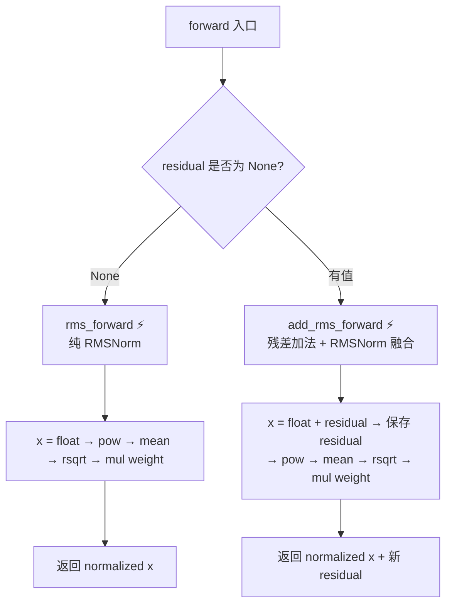
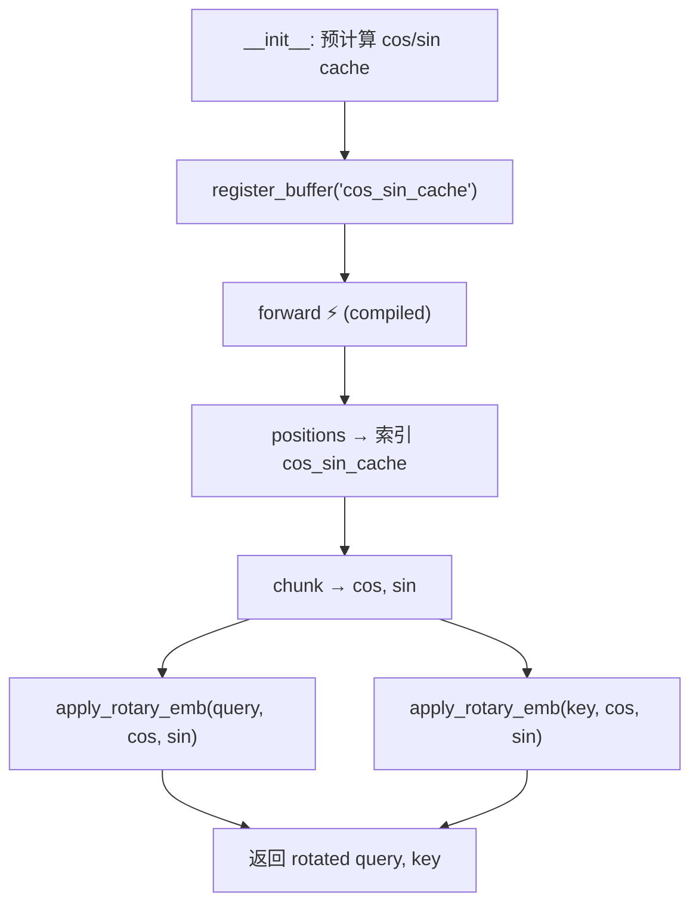
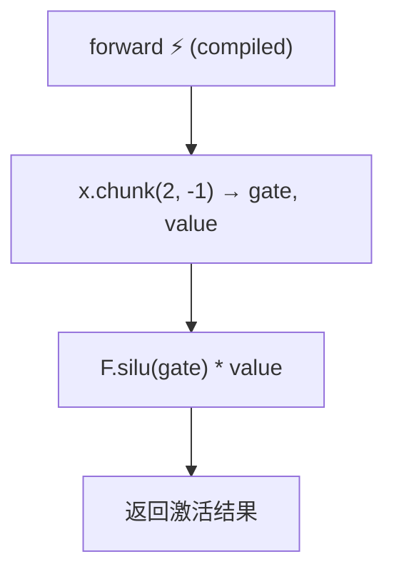
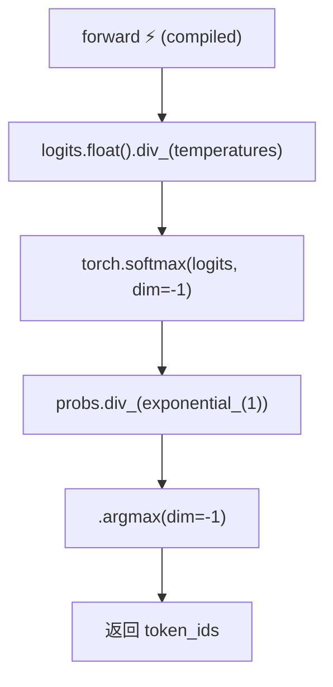

# PD-453.01 nano-vllm — @torch.compile 四模块编译优化

> 文档编号：PD-453.01
> 来源：nano-vllm `nanovllm/layers/`
> GitHub：https://github.com/GeeeekExplorer/nano-vllm.git
> 问题域：PD-453 Torch 编译优化 Torch Compilation Optimization
> 状态：可复用方案

---

## 第 1 章 问题与动机

### 1.1 核心问题

LLM 推理引擎中，RMSNorm、RotaryEmbedding、SiluAndMul、Sampler 等模块虽然计算量不如矩阵乘法大，但在每个 Transformer 层中被反复调用，累积的 kernel launch 开销和内存读写开销不可忽视。传统做法是为每个模块手写 Triton 或 CUDA kernel（如 vLLM 的做法），但这带来三个问题：

1. **开发成本高**：每个算子需要单独编写、调试、维护 GPU kernel 代码
2. **可移植性差**：手写 kernel 通常绑定特定 GPU 架构，跨硬件迁移困难
3. **迭代速度慢**：修改计算逻辑需要同步修改 kernel，拖慢实验节奏

nano-vllm 的核心洞察是：PyTorch 2.x 的 `torch.compile` 编译器已经足够成熟，能够对这类"计算密集但逻辑简单"的小模块自动完成算子融合（kernel fusion），达到接近手写 kernel 的性能，同时保持纯 Python 代码的可读性和可维护性。

### 1.2 nano-vllm 的解法概述

nano-vllm 采用"选择性编译"策略，只在 4 个计算密集的小模块上使用 `@torch.compile` 装饰器：

1. **RMSNorm**（`nanovllm/layers/layernorm.py:16-40`）— 两个编译入口：纯 RMSNorm 和 fused add+RMSNorm，后者将残差加法与归一化融合为一次 kernel 调用
2. **RotaryEmbedding**（`nanovllm/layers/rotary_embedding.py:37-48`）— 将 cos/sin 查表、chunk、旋转乘法、拼接融合为一次 kernel
3. **SiluAndMul**（`nanovllm/layers/activation.py:11-14`）— 将 chunk + SiLU + 逐元素乘法融合
4. **Sampler**（`nanovllm/layers/sampler.py:10-15`）— 将温度缩放、softmax、Gumbel 采样融合

关键设计：不在整个模型或 Transformer 层上使用 `torch.compile`，而是精确到最小的计算单元。这避免了编译器处理复杂控制流（如 prefill/decode 分支、CUDA Graph 捕获）时的兼容性问题。

### 1.3 设计思想

| 设计原则 | 具体实现 | 理由 | 替代方案 |
|----------|----------|------|----------|
| 最小编译粒度 | 只在 4 个 leaf module 的方法上加 `@torch.compile` | 避免编译器处理复杂控制流和动态 shape | 整个模型 `torch.compile`（会遇到 graph break） |
| 纯算术函数 | 被编译函数只含 tensor 运算，无 Python 控制流 | 编译器能完整 trace 整个函数，不产生 graph break | 包含 if/for 的复杂函数（会导致多次重编译） |
| 残差融合 | `add_rms_forward` 将 residual add + RMSNorm 合并 | 减少一次全局内存读写，提升 memory-bound 算子性能 | 分开调用 add 和 norm（多一次 kernel launch） |
| in-place 运算 | 大量使用 `mul_()`, `add_()`, `div_()` 等 in-place 操作 | 减少临时 tensor 分配，降低显存压力 | 创建新 tensor（增加显存碎片） |
| 预计算缓存 | RoPE 的 cos/sin 在 `__init__` 中预计算并 register_buffer | 避免每次 forward 重复计算三角函数 | 每次 forward 动态计算（浪费算力） |

---

## 第 2 章 源码实现分析

### 2.1 架构概览

nano-vllm 的 layers 模块采用"编译层 + 非编译层"分离架构：

```
┌─────────────────────────────────────────────────────────┐
│                   Qwen3ForCausalLM                       │
│  ┌───────────────────────────────────────────────────┐  │
│  │              Qwen3DecoderLayer × N                 │  │
│  │  ┌─────────────┐  ┌──────────────────────────┐   │  │
│  │  │ RMSNorm ⚡   │  │    Qwen3Attention         │   │  │
│  │  │ (compiled)   │→│  ┌──────────────────────┐ │   │  │
│  │  └─────────────┘  │  │ RotaryEmbedding ⚡    │ │   │  │
│  │                    │  │ (compiled)            │ │   │  │
│  │                    │  └──────────────────────┘ │   │  │
│  │                    │  ┌──────────────────────┐ │   │  │
│  │                    │  │ Attention (Triton+FA) │ │   │  │
│  │                    │  │ (NOT compiled)        │ │   │  │
│  │                    │  └──────────────────────┘ │   │  │
│  │                    └──────────────────────────┘   │  │
│  │  ┌─────────────┐  ┌──────────────────────────┐   │  │
│  │  │ RMSNorm ⚡   │  │    Qwen3MLP              │   │  │
│  │  │ (compiled)   │→│  ┌──────────────────────┐ │   │  │
│  │  └─────────────┘  │  │ SiluAndMul ⚡         │ │   │  │
│  │                    │  │ (compiled)            │ │   │  │
│  │                    │  └──────────────────────┘ │   │  │
│  │                    └──────────────────────────┘   │  │
│  └───────────────────────────────────────────────────┘  │
│  ┌─────────────┐                                        │
│  │ Sampler ⚡   │  ⚡ = @torch.compile                   │
│  │ (compiled)   │                                        │
│  └─────────────┘                                        │
└─────────────────────────────────────────────────────────┘
```

关键观察：Attention 层使用手写 Triton kernel（`store_kvcache_kernel`）+ FlashAttention，不使用 `torch.compile`。这是因为 Attention 涉及 KV cache 的动态索引和外部库调用，编译器难以优化。

### 2.2 核心实现

#### 2.2.1 RMSNorm — 双入口编译与残差融合

RMSNorm 是 nano-vllm 中最精巧的编译设计，提供两个独立的编译入口。



对应源码 `nanovllm/layers/layernorm.py:5-50`：

```python
class RMSNorm(nn.Module):

    def __init__(self, hidden_size: int, eps: float = 1e-6) -> None:
        super().__init__()
        self.eps = eps
        self.weight = nn.Parameter(torch.ones(hidden_size))

    @torch.compile
    def rms_forward(self, x: torch.Tensor) -> torch.Tensor:
        orig_dtype = x.dtype
        x = x.float()
        var = x.pow(2).mean(dim=-1, keepdim=True)
        x.mul_(torch.rsqrt(var + self.eps))
        x = x.to(orig_dtype).mul_(self.weight)
        return x

    @torch.compile
    def add_rms_forward(self, x: torch.Tensor, residual: torch.Tensor
    ) -> tuple[torch.Tensor, torch.Tensor]:
        orig_dtype = x.dtype
        x = x.float().add_(residual.float())
        residual = x.to(orig_dtype)
        var = x.pow(2).mean(dim=-1, keepdim=True)
        x.mul_(torch.rsqrt(var + self.eps))
        x = x.to(orig_dtype).mul_(self.weight)
        return x, residual

    def forward(self, x, residual=None):
        if residual is None:
            return self.rms_forward(x)
        else:
            return self.add_rms_forward(x, residual)
```

设计要点：
- `forward` 本身不加 `@torch.compile`，因为 `if residual is None` 分支会导致 graph break
- 两个编译入口各自是纯算术函数，编译器可以将 float 转换、pow、mean、rsqrt、mul 全部融合为一个 kernel
- `add_rms_forward` 将 `x + residual` 和 RMSNorm 融合，省去一次全局内存写入再读取的开销
- 使用 `mul_()` 和 `add_()` in-place 操作减少临时 tensor

#### 2.2.2 RotaryEmbedding — 预计算 + 编译 forward



对应源码 `nanovllm/layers/rotary_embedding.py:17-48`：

```python
class RotaryEmbedding(nn.Module):

    def __init__(self, head_size, rotary_dim, max_position_embeddings, base):
        super().__init__()
        self.head_size = head_size
        assert rotary_dim == head_size
        inv_freq = 1.0 / (base ** (torch.arange(0, rotary_dim, 2,
                          dtype=torch.float) / rotary_dim))
        t = torch.arange(max_position_embeddings, dtype=torch.float)
        freqs = torch.einsum("i,j -> ij", t, inv_freq)
        cos = freqs.cos()
        sin = freqs.sin()
        cache = torch.cat((cos, sin), dim=-1).unsqueeze_(1)
        self.register_buffer("cos_sin_cache", cache, persistent=False)

    @torch.compile
    def forward(self, positions, query, key):
        cos_sin = self.cos_sin_cache[positions]
        cos, sin = cos_sin.chunk(2, dim=-1)
        query = apply_rotary_emb(query, cos, sin)
        key = apply_rotary_emb(key, cos, sin)
        return query, key
```

设计要点：
- cos/sin 在 `__init__` 中一次性计算到 `max_position_embeddings`，运行时只做索引查表
- `apply_rotary_emb` 是模块级函数，被 `@torch.compile` 的 forward 内联，编译器将 chunk + 乘法 + cat 融合
- `lru_cache(1)` 的 `get_rope` 工厂函数确保同配置只创建一个 RotaryEmbedding 实例（`rotary_embedding.py:51-61`）

#### 2.2.3 SiluAndMul — 极简编译



对应源码 `nanovllm/layers/activation.py:6-14`：

```python
class SiluAndMul(nn.Module):

    def __init__(self):
        super().__init__()

    @torch.compile
    def forward(self, x: torch.Tensor) -> torch.Tensor:
        x, y = x.chunk(2, -1)
        return F.silu(x) * y
```

这是最简洁的编译示例：chunk + SiLU + 逐元素乘法三个操作被融合为一个 kernel。在 vLLM 中，这个操作需要一个专门的 Triton kernel `silu_and_mul_kernel`。

#### 2.2.4 Sampler — Gumbel-max 采样编译



对应源码 `nanovllm/layers/sampler.py:5-15`：

```python
class Sampler(nn.Module):

    def __init__(self):
        super().__init__()

    @torch.compile
    def forward(self, logits: torch.Tensor, temperatures: torch.Tensor):
        logits = logits.float().div_(temperatures.unsqueeze(dim=1))
        probs = torch.softmax(logits, dim=-1)
        sample_tokens = probs.div_(
            torch.empty_like(probs).exponential_(1).clamp_min_(1e-10)
        ).argmax(dim=-1)
        return sample_tokens
```

设计要点：
- 使用 Gumbel-max trick（`exponential_(1)` + `argmax`）替代 `torch.multinomial`，因为后者不被 `torch.compile` 支持
- 温度缩放、softmax、采样全部融合为一个 kernel
- `clamp_min_(1e-10)` 防止除零，是编译器友好的数值稳定写法

### 2.3 实现细节

#### 与 CUDA Graph 的协作

nano-vllm 在 decode 阶段使用 CUDA Graph 加速（`model_runner.py:217-251`），而 `@torch.compile` 的模块被包含在 CUDA Graph 捕获范围内：

```python
# model_runner.py:232-240
for bs in reversed(self.graph_bs):
    graph = torch.cuda.CUDAGraph()
    set_context(False, slot_mapping=slot_mapping[:bs], ...)
    outputs[:bs] = self.model(input_ids[:bs], positions[:bs])  # warmup
    with torch.cuda.graph(graph, self.graph_pool):
        outputs[:bs] = self.model(input_ids[:bs], positions[:bs])  # capture
```

这能工作的前提是：`@torch.compile` 的模块在 warmup 阶段已经完成编译和缓存，CUDA Graph 捕获时直接使用编译后的 kernel。`model_runner.py:91-98` 的 `warmup_model` 方法确保了这一点。

#### 编译粒度选择的数据流分析

```
输入 tokens
    │
    ▼
[Embedding] ─── 查表，无计算密集操作，不编译
    │
    ▼
[RMSNorm ⚡] ─── memory-bound，融合 float+pow+mean+rsqrt+mul
    │
    ▼
[QKV Linear] ─── compute-bound (GEMM)，cuBLAS 已最优，不编译
    │
    ▼
[RoPE ⚡] ─── memory-bound，融合 index+chunk+mul+cat
    │
    ▼
[Attention] ─── FlashAttention + Triton KV cache，外部库，不编译
    │
    ▼
[O Linear] ─── compute-bound (GEMM)，不编译
    │
    ▼
[RMSNorm ⚡] ─── 同上，add_rms_forward 融合残差
    │
    ▼
[Gate+Up Linear] ─── compute-bound (GEMM)，不编译
    │
    ▼
[SiluAndMul ⚡] ─── memory-bound，融合 chunk+silu+mul
    │
    ▼
[Down Linear] ─── compute-bound (GEMM)，不编译
    │
    ▼
[Sampler ⚡] ─── memory-bound，融合 div+softmax+sample+argmax
```

规律：所有被编译的模块都是 **memory-bound** 操作（元素级运算、归约），而 **compute-bound** 操作（矩阵乘法）由 cuBLAS 处理，不需要编译。

---

## 第 3 章 迁移指南

### 3.1 迁移清单

**阶段 1：识别编译候选模块**

- [ ] 列出模型中所有非 GEMM 的计算模块（Norm、Activation、Embedding 旋转等）
- [ ] 确认候选模块的 forward 函数是纯算术操作（无 Python 控制流、无外部库调用）
- [ ] 确认候选模块的输入 shape 在推理时是稳定的（或只有有限种 shape）

**阶段 2：应用 @torch.compile**

- [ ] 在候选模块的计算方法上添加 `@torch.compile` 装饰器
- [ ] 如果 forward 中有 if/else 分支，将不同分支拆成独立方法分别编译
- [ ] 将 `torch.multinomial` 等不支持编译的操作替换为等价的可编译实现
- [ ] 尽量使用 in-place 操作（`mul_`, `add_`, `div_`）减少临时 tensor

**阶段 3：预热与 CUDA Graph 集成**

- [ ] 在模型加载后执行一次 warmup forward，触发所有 `@torch.compile` 模块的编译
- [ ] 如果使用 CUDA Graph，确保 warmup 在 graph capture 之前完成
- [ ] 验证 CUDA Graph replay 时编译后的 kernel 正常执行

**阶段 4：验证与性能测试**

- [ ] 对比编译前后的数值精度（fp16/bf16 下 atol=1e-3）
- [ ] 对比编译前后的推理延迟和吞吐量
- [ ] 监控编译后的显存占用变化

### 3.2 适配代码模板

#### 模板 1：可编译的 RMSNorm（含残差融合）

```python
import torch
from torch import nn


class CompilableRMSNorm(nn.Module):
    """可直接复用的 RMSNorm，支持残差融合编译。"""

    def __init__(self, hidden_size: int, eps: float = 1e-6):
        super().__init__()
        self.eps = eps
        self.weight = nn.Parameter(torch.ones(hidden_size))

    @torch.compile
    def _norm(self, x: torch.Tensor) -> torch.Tensor:
        orig_dtype = x.dtype
        x = x.float()
        x.mul_(torch.rsqrt(x.pow(2).mean(-1, keepdim=True) + self.eps))
        return x.to(orig_dtype).mul_(self.weight)

    @torch.compile
    def _add_norm(self, x: torch.Tensor, residual: torch.Tensor
    ) -> tuple[torch.Tensor, torch.Tensor]:
        orig_dtype = x.dtype
        x = x.float().add_(residual.float())
        residual = x.to(orig_dtype)
        x.mul_(torch.rsqrt(x.pow(2).mean(-1, keepdim=True) + self.eps))
        return x.to(orig_dtype).mul_(self.weight), residual

    def forward(self, x, residual=None):
        return self._norm(x) if residual is None else self._add_norm(x, residual)
```

#### 模板 2：可编译的 Gumbel-max 采样器

```python
import torch
from torch import nn


class CompilableSampler(nn.Module):
    """替代 torch.multinomial 的可编译采样器。
    
    使用 Gumbel-max trick: argmax(log(probs) + Gumbel) 等价于 multinomial。
    实现中用 probs / Exp(1) 的 argmax 作为等价形式。
    """

    @torch.compile
    def forward(self, logits: torch.Tensor, temperatures: torch.Tensor):
        logits = logits.float().div_(temperatures.unsqueeze(1))
        probs = torch.softmax(logits, dim=-1)
        # Gumbel-max trick: argmax(probs / Exp(1)) ~ Categorical(probs)
        return probs.div_(
            torch.empty_like(probs).exponential_(1).clamp_min_(1e-10)
        ).argmax(dim=-1)
```

#### 模板 3：可编译的 SwiGLU / SiluAndMul 激活

```python
import torch
from torch import nn
import torch.nn.functional as F


class CompilableSiluAndMul(nn.Module):
    """Gated activation: SiLU(gate) * value，适用于 LLaMA/Qwen 系列 MLP。"""

    @torch.compile
    def forward(self, x: torch.Tensor) -> torch.Tensor:
        gate, value = x.chunk(2, dim=-1)
        return F.silu(gate) * value
```

### 3.3 适用场景

| 场景 | 适用度 | 说明 |
|------|--------|------|
| LLM 推理引擎开发 | ⭐⭐⭐ | 最佳场景，RMSNorm/RoPE/Activation 都是标准组件 |
| 模型微调训练 | ⭐⭐⭐ | `torch.compile` 同样支持反向传播，训练也能受益 |
| 快速原型验证 | ⭐⭐⭐ | 无需写 kernel 即可获得接近最优性能 |
| 多硬件部署（A100/H100/AMD） | ⭐⭐ | 编译器自动适配不同硬件，但首次编译耗时较长 |
| 已有手写 Triton kernel 的项目 | ⭐ | 手写 kernel 通常更快 5-15%，但维护成本高 |
| 需要极致延迟的生产环境 | ⭐⭐ | 编译后性能接近手写，但 warmup 时间需要考虑 |

---

## 第 4 章 测试用例

```python
import pytest
import torch


class TestRMSNorm:
    """测试 RMSNorm 的编译正确性。"""

    def setup_method(self):
        self.hidden_size = 128
        self.norm = RMSNorm(self.hidden_size, eps=1e-6).cuda()

    def test_rms_forward_shape(self):
        """正常路径：输出 shape 与输入一致。"""
        x = torch.randn(2, 16, self.hidden_size, device="cuda", dtype=torch.float16)
        out = self.norm(x)
        assert out.shape == x.shape
        assert out.dtype == torch.float16

    def test_add_rms_forward_shape(self):
        """残差融合路径：返回 normalized + 新 residual。"""
        x = torch.randn(2, 16, self.hidden_size, device="cuda", dtype=torch.float16)
        residual = torch.randn_like(x)
        out, new_residual = self.norm(x, residual)
        assert out.shape == x.shape
        assert new_residual.shape == x.shape

    def test_rms_numerical_correctness(self):
        """对比编译版本与手动计算的数值精度。"""
        x = torch.randn(4, 32, self.hidden_size, device="cuda", dtype=torch.float16)
        # 手动计算参考值
        x_float = x.float()
        var = x_float.pow(2).mean(dim=-1, keepdim=True)
        ref = (x_float * torch.rsqrt(var + 1e-6)).to(torch.float16) * self.norm.weight
        out = self.norm(x)
        torch.testing.assert_close(out, ref, atol=1e-3, rtol=1e-3)

    def test_residual_fusion_correctness(self):
        """验证 add_rms_forward 的残差值等于 x + residual。"""
        x = torch.randn(2, 8, self.hidden_size, device="cuda", dtype=torch.float16)
        residual = torch.randn_like(x)
        x_clone, res_clone = x.clone(), residual.clone()
        _, new_residual = self.norm(x, residual)
        expected_residual = (x_clone.float() + res_clone.float()).to(torch.float16)
        torch.testing.assert_close(new_residual, expected_residual, atol=1e-3, rtol=1e-3)


class TestSiluAndMul:
    """测试 SiluAndMul 的编译正确性。"""

    def setup_method(self):
        self.act = SiluAndMul().cuda()

    def test_output_shape(self):
        """输出 dim 应为输入的一半。"""
        x = torch.randn(4, 256, device="cuda", dtype=torch.float16)
        out = self.act(x)
        assert out.shape == (4, 128)

    def test_numerical_correctness(self):
        """对比 F.silu(gate) * value 的参考实现。"""
        x = torch.randn(4, 256, device="cuda", dtype=torch.float16)
        gate, value = x.chunk(2, dim=-1)
        ref = torch.nn.functional.silu(gate) * value
        out = self.act(x)
        torch.testing.assert_close(out, ref, atol=1e-3, rtol=1e-3)


class TestSampler:
    """测试 Gumbel-max 采样器。"""

    def setup_method(self):
        self.sampler = Sampler().cuda()

    def test_output_shape(self):
        """输出应为 [batch_size] 的 token id。"""
        logits = torch.randn(4, 32000, device="cuda", dtype=torch.float16)
        temps = torch.ones(4, device="cuda", dtype=torch.float32)
        out = self.sampler(logits, temps)
        assert out.shape == (4,)
        assert out.dtype == torch.int64

    def test_temperature_zero_like(self):
        """极低温度应接近 argmax 行为。"""
        logits = torch.randn(8, 100, device="cuda", dtype=torch.float16)
        temps = torch.full((8,), 0.01, device="cuda", dtype=torch.float32)
        out = self.sampler(logits, temps)
        expected = logits.float().argmax(dim=-1)
        # 极低温度下大部分应与 argmax 一致
        match_rate = (out == expected).float().mean()
        assert match_rate > 0.9

    def test_high_temperature_diversity(self):
        """高温度应产生多样化输出。"""
        logits = torch.zeros(100, 10, device="cuda", dtype=torch.float16)
        temps = torch.full((100,), 10.0, device="cuda", dtype=torch.float32)
        out = self.sampler(logits, temps)
        unique_tokens = out.unique().numel()
        assert unique_tokens > 1  # 均匀 logits + 高温度应产生多种 token
```

---

## 第 5 章 跨域关联

| 关联域 | 关系类型 | 说明 |
|--------|----------|------|
| PD-448 CUDA Graph 优化 | 协同 | `@torch.compile` 的模块在 CUDA Graph capture 前需要 warmup 完成编译；nano-vllm 的 `warmup_model`（`model_runner.py:91`）在 `capture_cudagraph`（`model_runner.py:217`）之前执行，确保编译后的 kernel 被 graph 捕获 |
| PD-451 Triton 自定义 Kernel | 互补 | nano-vllm 对 memory-bound 操作用 `torch.compile`，对 KV cache 存储用手写 Triton kernel（`attention.py:10-30`），两种方式互补覆盖不同类型的算子 |
| PD-446 Paged KV Cache | 依赖 | RMSNorm 和 RoPE 的编译优化减少了非 Attention 部分的延迟，使 Paged KV Cache 的 Attention 计算占比更突出，两者共同决定端到端性能 |
| PD-447 Tensor 并行 | 协同 | 编译后的模块在 TP 环境下每个 rank 独立编译和执行，不涉及通信操作；Linear 层的 all_reduce 在编译范围之外 |
| PD-449 Continuous Batching | 协同 | 编译模块的输入 shape 随 batch 动态变化，但 nano-vllm 通过 CUDA Graph 的固定 batch size 桶（1,2,4,8,16,...512）稳定了 decode 阶段的 shape |
| PD-452 GPU 显存管理 | 协同 | `@torch.compile` 的 in-place 操作（`mul_`, `add_`）减少临时 tensor 分配，降低显存碎片化，与 KV cache 的显存预分配策略协同 |

---

## 第 6 章 来源文件索引

| 文件 | 行范围 | 关键实现 |
|------|--------|----------|
| `nanovllm/layers/layernorm.py` | L5-L50 | RMSNorm 双入口编译：`rms_forward` + `add_rms_forward` |
| `nanovllm/layers/rotary_embedding.py` | L17-L48 | RotaryEmbedding 预计算 cos/sin + 编译 forward |
| `nanovllm/layers/rotary_embedding.py` | L6-L14 | `apply_rotary_emb` 旋转嵌入核心计算 |
| `nanovllm/layers/rotary_embedding.py` | L51-L61 | `get_rope` 工厂函数 + `lru_cache` 单例 |
| `nanovllm/layers/activation.py` | L6-L14 | SiluAndMul 编译：chunk + SiLU + mul 融合 |
| `nanovllm/layers/sampler.py` | L5-L15 | Sampler 编译：Gumbel-max trick 替代 multinomial |
| `nanovllm/layers/attention.py` | L10-L30 | Triton `store_kvcache_kernel`（对比：手写 kernel 场景） |
| `nanovllm/models/qwen3.py` | L90-L116 | Qwen3MLP 中 SiluAndMul 的使用方式 |
| `nanovllm/models/qwen3.py` | L119-L158 | Qwen3DecoderLayer 中 RMSNorm 的残差融合调用链 |
| `nanovllm/engine/model_runner.py` | L91-L98 | `warmup_model`：触发 torch.compile 编译 |
| `nanovllm/engine/model_runner.py` | L217-L251 | `capture_cudagraph`：CUDA Graph 捕获（含编译后 kernel） |
| `nanovllm/config.py` | L14 | `enforce_eager` 配置项：控制是否跳过编译 |

---

## 第 7 章 横向对比维度

```json comparison_data
{
  "project": "nano-vllm",
  "dimensions": {
    "编译粒度": "@torch.compile 装饰 4 个 leaf module 方法，不编译整个模型",
    "融合策略": "编译器自动融合 memory-bound 算子，GEMM 交给 cuBLAS",
    "采样实现": "Gumbel-max trick 替代不可编译的 torch.multinomial",
    "残差处理": "add_rms_forward 将残差加法与 RMSNorm 融合为单 kernel",
    "预热机制": "warmup_model 在 CUDA Graph capture 前触发全部编译",
    "回退策略": "enforce_eager 配置项可完全禁用编译，回退到 eager 模式"
  }
}
```

### 域元数据补充

```json domain_metadata
{
  "solution_summary": "nano-vllm 在 RMSNorm/RoPE/SiluAndMul/Sampler 四个 memory-bound 模块上使用 @torch.compile 装饰器，通过编译器自动算子融合替代手写 CUDA kernel，配合 Gumbel-max trick 解决 multinomial 不可编译问题",
  "description": "区分 memory-bound 与 compute-bound 算子，选择性编译以获得最佳性价比",
  "sub_problems": [
    "不可编译算子的等价替换（如 multinomial → Gumbel-max）",
    "条件分支导致的 graph break 规避（拆分编译入口）",
    "残差连接与归一化的跨算子融合"
  ],
  "best_practices": [
    "将含 if/else 的 forward 拆成多个纯算术方法分别编译",
    "使用 in-place 操作（mul_, add_, div_）减少编译后 kernel 的临时显存分配",
    "在 CUDA Graph capture 前执行 warmup 确保编译完成"
  ]
}
```
