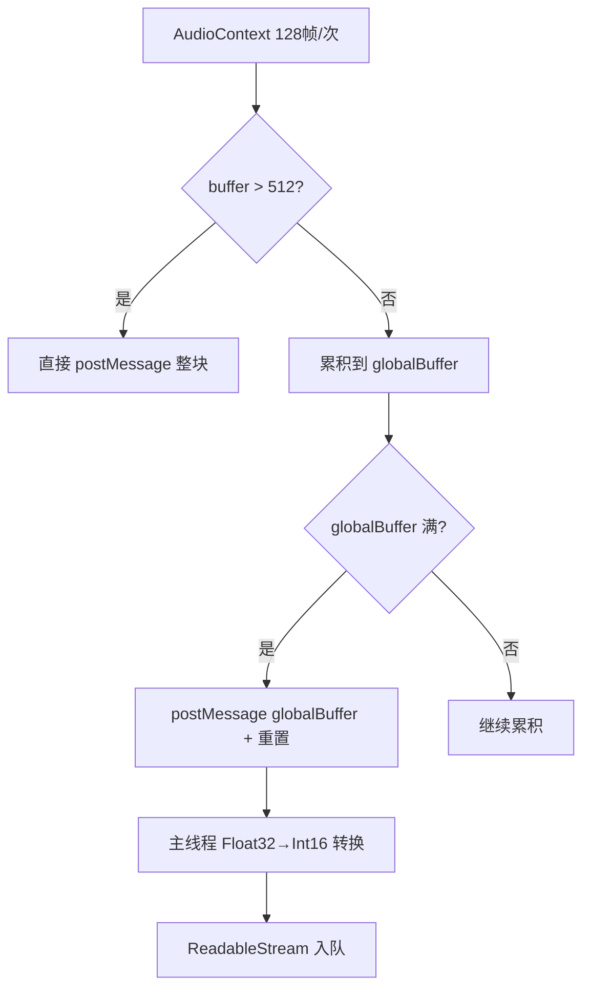
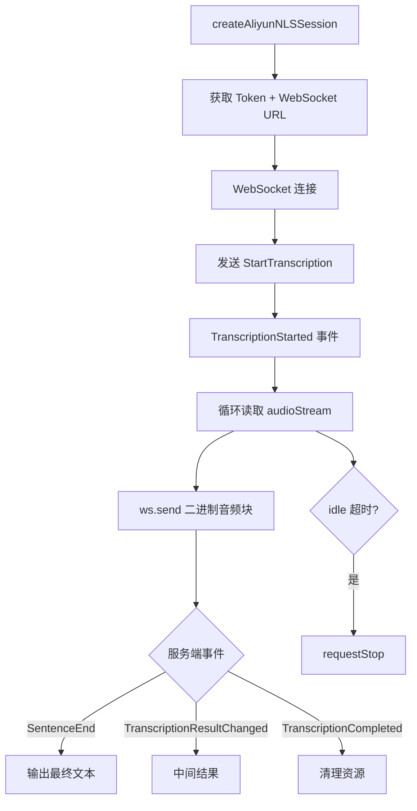
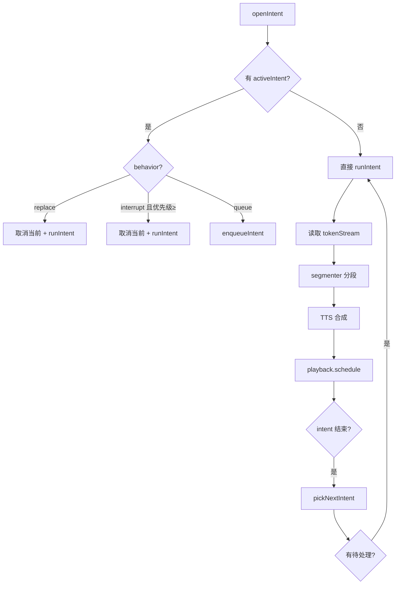

# PD-454.01 AIRI — 端到端语音管道与多引擎编排

> 文档编号：PD-454.01
> 来源：AIRI `packages/pipelines-audio/`, `packages/stage-ui/src/stores/modules/hearing.ts`, `packages/stage-ui/src/workers/vad/`
> GitHub：https://github.com/moeru-ai/airi.git
> 问题域：PD-454 语音音频管道 Speech Audio Pipeline
> 状态：可复用方案

---

## 第 1 章 问题与动机（≥ 30 行）

### 1.1 核心问题

语音交互系统需要解决一条完整的音频处理链路：从麦克风采集原始音频，经过语音活动检测（VAD）过滤静音，将有效语音片段送入语音转录（STT）引擎获取文本，再将 AI 生成的回复文本通过语音合成（TTS）引擎转为音频播放。这条链路涉及多个异构引擎（本地 Whisper、云端 OpenAI/Aliyun NLS、浏览器原生 Web Speech API）、多种音频格式转换（PCM↔WAV↔Float32↔Opus）、实时流式处理、以及优先级调度等工程难题。

AIRI 作为一个跨平台 AI 伴侣项目（Web + Discord Bot + Electron），必须在浏览器端和 Node.js 服务端同时支持语音管道，且需要让用户自由切换不同的 STT/TTS 提供商。

### 1.2 AIRI 的解法概述

1. **AudioWorklet VAD 前端采集**：使用 `VADProcessor` AudioWorklet 在浏览器音频线程中累积 512 样本最小块，通过 `postMessage` 将 Float32Array 发送到主线程（`packages/stage-ui/src/workers/vad/process.worklet.ts:18-53`）
2. **统一 Provider 抽象层**：所有 STT/TTS 引擎通过 `TranscriptionProviderWithExtraOptions` / `SpeechProviderWithExtraOptions` 接口统一，支持 OpenAI、Aliyun NLS、Web Speech API、ElevenLabs、Kokoro、Volcengine 等 10+ 提供商（`packages/stage-ui/src/stores/modules/hearing.ts:43-46`）
3. **Intent 驱动的 Speech Pipeline**：`createSpeechPipeline` 实现基于 Intent 的 TTS 调度，支持 queue/interrupt/replace 三种行为模式和 4 级优先级（`packages/pipelines-audio/src/speech-pipeline.ts:57-330`）
4. **智能文本分段器**：`chunkTtsInput` 使用 `Intl.Segmenter` 按标点和词数智能切分文本，支持 boost/limit/hard/flush/special 五种切分原因（`packages/pipelines-audio/src/processors/tts-chunker.ts:34-201`）
5. **双模式 STT**：浏览器端支持流式（Aliyun NLS WebSocket、Web Speech API）和批量（OpenAI generate）两种转录模式；Discord Bot 端支持本地 HuggingFace Whisper 和远程 OpenAI（`services/discord-bot/src/pipelines/tts.ts:15-95`）

### 1.3 设计思想

| 设计原则 | 具体实现 | 理由 | 替代方案 |
|----------|----------|------|----------|
| Provider 可插拔 | 统一 `TranscriptionProviderWithExtraOptions` 接口，所有引擎实现同一 `transcription(model, extraOptions)` 签名 | 用户可自由切换引擎而不改业务代码 | 硬编码 if-else 分支 |
| 音频线程隔离 | VAD 使用 AudioWorklet 在独立线程处理，避免主线程阻塞 | 128 样本/帧的实时音频处理不能被 UI 渲染阻塞 | 主线程 ScriptProcessorNode（已废弃） |
| Intent 优先级调度 | 4 级优先级 + queue/interrupt/replace 行为，高优先级可打断低优先级播放 | AI 伴侣场景中紧急回复需要打断正在播放的内容 | 简单 FIFO 队列 |
| 流式文本分段 | 基于 grapheme cluster 的实时分段，遇到标点即切分送 TTS | 减少首字节延迟，用户感知更快的响应 | 等全文生成完再送 TTS |
| 双端复用 | 浏览器端和 Discord Bot 端共享音频编码库 `@proj-airi/audio` | 避免重复实现 WAV 编码逻辑 | 各端独立实现 |

---

## 第 2 章 源码实现分析（≥ 60 行，核心章节）

### 2.1 架构概览

AIRI 的语音管道分为三层：采集层（VAD + AudioWorklet）、转录/合成层（Provider 抽象）、调度层（Speech Pipeline）。

```
┌─────────────────────────────────────────────────────────────────┐
│                        Browser (stage-ui)                       │
│                                                                 │
│  ┌──────────┐    ┌──────────────┐    ┌───────────────────────┐  │
│  │ Mic Input │───→│ VAD Worklet  │───→│ Hearing Store (STT)   │  │
│  │ MediaStream│   │ (512 chunk)  │    │ ┌─────────────────┐  │  │
│  └──────────┘    └──────────────┘    │ │ Aliyun NLS (WS)  │  │  │
│                                       │ │ Web Speech API   │  │  │
│                                       │ │ OpenAI (HTTP)    │  │  │
│                                       │ └─────────────────┘  │  │
│                                       └───────────────────────┘  │
│                                                 │ text           │
│                                                 ▼                │
│  ┌───────────────────────────────────────────────────────────┐  │
│  │              Speech Pipeline (TTS 调度)                    │  │
│  │  ┌──────────┐  ┌───────────┐  ┌──────────┐  ┌─────────┐ │  │
│  │  │ Intent   │→ │ Segmenter │→ │ TTS Call │→ │Playback │ │  │
│  │  │ (优先级) │  │ (分段器)  │  │ (合成)   │  │(播放)   │ │  │
│  │  └──────────┘  └───────────┘  └──────────┘  └─────────┘ │  │
│  └───────────────────────────────────────────────────────────┘  │
└─────────────────────────────────────────────────────────────────┘

┌─────────────────────────────────────────────────────────────────┐
│                     Discord Bot (Node.js)                        │
│  ┌──────────┐  ┌────────────┐  ┌──────────┐  ┌──────────────┐  │
│  │ Opus     │→ │ OpusDecoder│→ │ PCM→WAV  │→ │ Whisper/     │  │
│  │ Stream   │  │ (Transform)│  │ (Header)  │  │ OpenAI STT   │  │
│  └──────────┘  └────────────┘  └──────────┘  └──────────────┘  │
└─────────────────────────────────────────────────────────────────┘
```

### 2.2 核心实现

#### 2.2.1 VAD AudioWorklet 音频采集



对应源码 `packages/stage-ui/src/workers/vad/process.worklet.ts:18-53`：

```typescript
const MIN_CHUNK_SIZE = 512
let globalPointer = 0
const globalBuffer = new Float32Array(MIN_CHUNK_SIZE)

class VADProcessor extends AudioWorkletProcessor {
  process(inputs: Float32Array[][], _outputs: Float32Array[][], _parameters: Record<string, Float32Array>) {
    const buffer = inputs[0][0]
    if (!buffer) return true

    if (buffer.length > MIN_CHUNK_SIZE) {
      this.port.postMessage({ buffer })
    } else {
      const remaining = MIN_CHUNK_SIZE - globalPointer
      if (buffer.length >= remaining) {
        globalBuffer.set(buffer.subarray(0, remaining), globalPointer)
        this.port.postMessage({ buffer: globalBuffer })
        globalBuffer.fill(0)
        globalBuffer.set(buffer.subarray(remaining), 0)
        globalPointer = buffer.length - remaining
      } else {
        globalBuffer.set(buffer, globalPointer)
        globalPointer += buffer.length
      }
    }
    return true
  }
}
registerProcessor('vad-audio-worklet-processor', VADProcessor)
```

主线程接收后进行 Float32→Int16 PCM 转换（`packages/stage-ui/src/stores/modules/hearing.ts:256-264`）：

```typescript
function float32ToInt16(buffer: Float32Array) {
  const output = new Int16Array(buffer.length)
  for (let i = 0; i < buffer.length; i++) {
    const value = Math.max(-1, Math.min(1, buffer[i]))
    output[i] = value < 0 ? value * 0x8000 : value * 0x7FFF
  }
  return output
}
```

#### 2.2.2 Aliyun NLS WebSocket 流式转录



对应源码 `packages/stage-ui/src/stores/providers/aliyun/stream-transcription.ts:189-359`：

```typescript
async function startRealtimeSession(options: InternalRealtimeOptions): Promise<AliyunStreamTranscriptionHandle> {
  const session = createAliyunNLSSession(accessKeyId, accessKeySecret, appKey, { region })
  const reader = audioStream.getReader()
  const url = await session.websocketUrl()
  const websocket = new WebSocket(url)
  websocket.binaryType = 'arraybuffer'

  // idle 超时保护
  const bumpIdle = () => {
    if (idleTimer) clearTimeout(idleTimer)
    idleTimer = setTimeout(() => {
      void requestStop(new DOMException('Idle timeout', 'AbortError'))
    }, idleTimeoutMs)
  }

  async function onTranscriptionStarted() {
    while (true) {
      const { done, value } = await reader.read()
      if (done) break
      if (value) websocket!.send(toArrayBuffer(value))
      bumpIdle()
    }
  }

  async function onMessage(message: MessageEvent) {
    const data = JSON.parse(message.data)
    session.onEvent(data, async (event: ServerEvent) => {
      switch (event.header.name) {
        case 'TranscriptionStarted': onTranscriptionStarted(); break
        case 'SentenceEnd': await onSentenceFinal?.(event.payload); break
        case 'TranscriptionCompleted': stopWaiter.trigger(); break
      }
    })
  }
}
```

#### 2.2.3 Intent 驱动的 Speech Pipeline



对应源码 `packages/pipelines-audio/src/speech-pipeline.ts:188-282`：

```typescript
function openIntent(optionsInput?: IntentOptions): IntentHandle {
  const intentId = optionsInput?.intentId ?? createId('intent')
  const priority = priorityResolver.resolve(optionsInput?.priority)
  const behavior = optionsInput?.behavior ?? 'queue'
  const controller = new AbortController()
  const { stream, write, close } = createPushStream<TextToken>()

  const intent: IntentState = {
    intentId, streamId, priority, ownerId, behavior,
    createdAt: Date.now(), controller, stream,
    closeStream: close, canceled: false,
  }

  intents.set(intentId, intent)

  if (!activeIntent) { void runIntent(intent); return handle }
  if (behavior === 'replace') { cancelIntent(activeIntent.intentId, 'replace'); void runIntent(intent); return handle }
  if (behavior === 'interrupt' && intent.priority >= activeIntent.priority) {
    cancelIntent(activeIntent.intentId, 'interrupt'); void runIntent(intent); return handle
  }
  enqueueIntent(intent)
  return handle
}
```

### 2.3 实现细节

**WAV 编码复用**：`packages/audio/src/encoding/wav.ts:9-47` 实现了纯 JavaScript 的 WAV 编码器，手动构建 44 字节 RIFF 头 + PCM 16-bit 数据。浏览器端和 Discord Bot 端共享此实现。

**Discord Bot Opus 解码链**：`services/discord-bot/src/utils/opus.ts:6-36` 使用 `OpusScript` 库实现 Node.js Transform Stream，将 Discord 语音频道的 Opus 编码音频解码为 PCM，再通过 `convertOpusToWav`（`services/discord-bot/src/utils/audio.ts:31-48`）添加 WAV 头后送入 Whisper。

**TTS 文本分段器**：`packages/pipelines-audio/src/processors/tts-chunker.ts:34-201` 使用 `Intl.Segmenter` 进行词级分割，支持中日韩标点（`。？！，、`）和西文标点，数字中的小数点/逗号不会触发切分（如 `3.14` 不会被切开）。

**AudioMonitor 缓冲管理**：`services/discord-bot/src/utils/audio-monitor.ts:9-97` 实现了一个环形缓冲区，监听 `speakingStarted`/`speakingStopped` 事件，在说话结束时将累积的音频 Buffer 回调给转录函数。


---

## 第 3 章 迁移指南（≥ 40 行）

### 3.1 迁移清单

**阶段 1：音频采集层**
- [ ] 创建 AudioWorklet 处理器，实现最小块累积逻辑（512 样本）
- [ ] 实现 Float32→Int16 PCM 转换函数
- [ ] 创建 `createAudioStreamFromMediaStream` 将 MediaStream 转为 ReadableStream<ArrayBuffer>
- [ ] 添加静音增益节点防止回声反馈

**阶段 2：Provider 抽象层**
- [ ] 定义统一的 `TranscriptionProvider` 接口（含 `transcription(model, extraOptions)` 方法）
- [ ] 定义统一的 `SpeechProvider` 接口（含 `speech(model, extraOptions)` 方法）
- [ ] 实现至少一个 STT Provider（推荐先实现 OpenAI 兼容接口）
- [ ] 实现至少一个 TTS Provider
- [ ] 创建 Provider 注册表和动态切换机制

**阶段 3：Speech Pipeline**
- [ ] 实现 Intent 状态机（queue/interrupt/replace）
- [ ] 实现优先级解析器（4 级：critical/high/normal/low）
- [ ] 实现文本分段器（基于 Intl.Segmenter）
- [ ] 实现播放调度器

**阶段 4：格式转换**
- [ ] 实现 WAV 编码器（Float32Array → WAV ArrayBuffer）
- [ ] 如需 Discord 集成，实现 Opus→PCM 解码

### 3.2 适配代码模板

**最小可用的 VAD AudioWorklet：**

```typescript
// vad-processor.worklet.ts
const MIN_CHUNK = 512
let ptr = 0
const buf = new Float32Array(MIN_CHUNK)

class VADProcessor extends AudioWorkletProcessor {
  process(inputs: Float32Array[][]) {
    const input = inputs[0]?.[0]
    if (!input) return true

    if (input.length > MIN_CHUNK) {
      this.port.postMessage({ buffer: input })
    } else {
      const remaining = MIN_CHUNK - ptr
      if (input.length >= remaining) {
        buf.set(input.subarray(0, remaining), ptr)
        this.port.postMessage({ buffer: new Float32Array(buf) })
        buf.fill(0)
        buf.set(input.subarray(remaining), 0)
        ptr = input.length - remaining
      } else {
        buf.set(input, ptr)
        ptr += input.length
      }
    }
    return true
  }
}
registerProcessor('vad-processor', VADProcessor)
```

**最小可用的 Provider 抽象：**

```typescript
// provider.ts
interface TranscriptionProvider {
  transcription(model: string, options?: Record<string, unknown>): {
    baseURL: string | URL
    model: string
    fetch?: typeof fetch
  }
}

interface SpeechProvider {
  speech(model: string, options?: Record<string, unknown>): {
    baseURL: string | URL
    model: string
  }
}

// 使用示例
const openaiSTT: TranscriptionProvider = {
  transcription(model) {
    return {
      baseURL: 'https://api.openai.com/v1',
      model,
    }
  }
}
```

**最小可用的 Speech Pipeline：**

```typescript
// speech-pipeline.ts
type Behavior = 'queue' | 'interrupt' | 'replace'
interface Intent { id: string; priority: number; behavior: Behavior; tokens: ReadableStream<string> }

function createPipeline(tts: (text: string) => Promise<ArrayBuffer>, play: (audio: ArrayBuffer) => void) {
  let active: Intent | null = null
  const queue: Intent[] = []

  async function run(intent: Intent) {
    active = intent
    const reader = intent.tokens.getReader()
    let buf = ''
    while (true) {
      const { done, value } = await reader.read()
      if (done) break
      buf += value
      // 遇到句号切分
      if (/[.。!！?？]/.test(value)) {
        const audio = await tts(buf.trim())
        play(audio)
        buf = ''
      }
    }
    if (buf.trim()) { play(await tts(buf.trim())) }
    active = null
    const next = queue.shift()
    if (next) run(next)
  }

  return {
    submit(intent: Intent) {
      if (!active) { run(intent); return }
      if (intent.behavior === 'interrupt' && intent.priority >= active.priority) {
        active = null; run(intent); return
      }
      queue.push(intent)
    }
  }
}
```

### 3.3 适用场景

| 场景 | 适用度 | 说明 |
|------|--------|------|
| AI 语音助手/伴侣 | ⭐⭐⭐ | 完整的 VAD→STT→LLM→TTS→播放链路 |
| 会议转录系统 | ⭐⭐⭐ | 多引擎 STT + 流式转录 + 格式转换 |
| Discord/Telegram 语音机器人 | ⭐⭐⭐ | Opus 解码 + Whisper 本地转录 |
| 浏览器端语音输入 | ⭐⭐ | VAD Worklet + Web Speech API 零成本方案 |
| 批量音频转录 | ⭐ | 主要面向实时场景，批量场景过度设计 |

---

## 第 4 章 测试用例（≥ 20 行）

```typescript
import { describe, it, expect, vi } from 'vitest'

// 测试 Float32→Int16 转换
describe('float32ToInt16', () => {
  function float32ToInt16(buffer: Float32Array): Int16Array {
    const output = new Int16Array(buffer.length)
    for (let i = 0; i < buffer.length; i++) {
      const value = Math.max(-1, Math.min(1, buffer[i]))
      output[i] = value < 0 ? value * 0x8000 : value * 0x7FFF
    }
    return output
  }

  it('should convert silence to zero', () => {
    const input = new Float32Array([0, 0, 0])
    const output = float32ToInt16(input)
    expect(Array.from(output)).toEqual([0, 0, 0])
  })

  it('should clamp values to [-1, 1]', () => {
    const input = new Float32Array([1.5, -1.5, 0.5])
    const output = float32ToInt16(input)
    expect(output[0]).toBe(0x7FFF)  // max positive
    expect(output[1]).toBe(-0x8000) // max negative
    expect(output[2]).toBe(Math.round(0.5 * 0x7FFF))
  })
})

// 测试 WAV 编码器
describe('toWav', () => {
  function toWav(buffer: ArrayBufferLike, sampleRate: number, channel = 1): ArrayBuffer {
    const samples = new Float32Array(buffer)
    const arrayBuffer = new ArrayBuffer(44 + samples.length * 2)
    const view = new DataView(arrayBuffer)
    // RIFF header
    new Uint8Array(arrayBuffer, 0, 4).set([0x52, 0x49, 0x46, 0x46])
    view.setUint32(4, 36 + samples.length * 2, true)
    new Uint8Array(arrayBuffer, 8, 4).set([0x57, 0x41, 0x56, 0x45])
    view.setUint16(20, 1, true) // PCM
    view.setUint16(22, channel, true)
    view.setUint32(24, sampleRate, true)
    return arrayBuffer
  }

  it('should produce valid WAV header', () => {
    const pcm = new Float32Array([0.1, -0.2, 0.3]).buffer
    const wav = toWav(pcm, 16000)
    const view = new DataView(wav)
    expect(String.fromCharCode(view.getUint8(0), view.getUint8(1), view.getUint8(2), view.getUint8(3))).toBe('RIFF')
    expect(view.getUint16(20, true)).toBe(1) // PCM format
    expect(view.getUint32(24, true)).toBe(16000) // sample rate
  })

  it('should have correct data size', () => {
    const pcm = new Float32Array(100).buffer
    const wav = toWav(pcm, 16000)
    expect(wav.byteLength).toBe(44 + 100 * 2) // header + 16-bit samples
  })
})

// 测试优先级解析器
describe('PriorityResolver', () => {
  function createPriorityResolver() {
    const levels = { critical: 300, high: 200, normal: 100, low: 0 }
    return {
      resolve(p?: string | number) {
        if (p == null) return levels.normal
        if (typeof p === 'number') return p
        return levels[p as keyof typeof levels] ?? levels.normal
      }
    }
  }

  it('should resolve named priorities', () => {
    const resolver = createPriorityResolver()
    expect(resolver.resolve('critical')).toBe(300)
    expect(resolver.resolve('low')).toBe(0)
  })

  it('should default to normal', () => {
    const resolver = createPriorityResolver()
    expect(resolver.resolve()).toBe(100)
  })

  it('should pass through numeric priorities', () => {
    const resolver = createPriorityResolver()
    expect(resolver.resolve(42)).toBe(42)
  })
})

// 测试 TTS 分段逻辑
describe('TTS Chunking', () => {
  it('should split on hard punctuation', () => {
    const hardPunctuations = new Set('.。?？!！')
    const text = 'Hello world. How are you?'
    const chunks: string[] = []
    let buf = ''
    for (const ch of text) {
      buf += ch
      if (hardPunctuations.has(ch)) {
        chunks.push(buf.trim())
        buf = ''
      }
    }
    if (buf.trim()) chunks.push(buf.trim())
    expect(chunks).toEqual(['Hello world.', 'How are you?'])
  })

  it('should not split decimal numbers', () => {
    // 3.14 should not be split at the dot
    const text = '3.14'
    const isDecimal = /\d\.\d/.test(text)
    expect(isDecimal).toBe(true)
  })
})
```


---

## 第 5 章 跨域关联

| 关联域 | 关系类型 | 说明 |
|--------|----------|------|
| PD-04 工具系统 | 协同 | Provider 抽象层本质上是一个工具注册系统，STT/TTS 引擎作为可插拔工具被注册和调用 |
| PD-10 中间件管道 | 协同 | Speech Pipeline 的 Intent→Segment→TTS→Playback 链路是一个典型的中间件管道模式 |
| PD-01 上下文管理 | 依赖 | 语音转录结果需要进入上下文窗口供 LLM 处理，长对话场景下转录文本的累积影响上下文管理策略 |
| PD-03 容错与重试 | 协同 | Aliyun NLS 的 idle 超时保护、WebSocket 重连、Web Speech API 的 `createAndStartNewRecognitionInstance` 自动重建都是容错机制 |
| PD-09 Human-in-the-Loop | 协同 | 语音输入本身就是一种 Human-in-the-Loop 交互方式，VAD 检测说话开始/结束驱动交互流程 |
| PD-11 可观测性 | 协同 | 各 Provider 的日志输出（`useLogg`）和 Speech Pipeline 的事件系统提供了可观测性基础 |

---

## 第 6 章 来源文件索引

| 文件 | 行范围 | 关键实现 |
|------|--------|----------|
| `packages/stage-ui/src/workers/vad/process.worklet.ts` | L1-L53 | VAD AudioWorklet 处理器，512 样本最小块累积 |
| `packages/stage-ui/src/stores/modules/hearing.ts` | L48-L743 | Hearing Store：STT Provider 调度、流式转录会话管理 |
| `packages/stage-ui/src/stores/modules/speech.ts` | L23-L298 | Speech Store：TTS Provider 调度、SSML 生成、语音参数控制 |
| `packages/stage-ui/src/stores/providers/aliyun/stream-transcription.ts` | L189-L527 | Aliyun NLS WebSocket 流式转录 + SSE 桥接 |
| `packages/stage-ui/src/stores/providers/aliyun/index.ts` | L154-L255 | Aliyun NLS 会话管理、Token 刷新、事件协议 |
| `packages/stage-ui/src/stores/providers/web-speech-api/index.ts` | L53-L470 | Web Speech API Provider：浏览器原生 STT、连续模式自动重启 |
| `packages/pipelines-audio/src/speech-pipeline.ts` | L57-L330 | Intent 驱动的 Speech Pipeline：优先级调度、queue/interrupt/replace |
| `packages/pipelines-audio/src/processors/tts-chunker.ts` | L34-L299 | TTS 文本分段器：Intl.Segmenter + 标点感知 + grapheme cluster |
| `packages/pipelines-audio/src/types.ts` | L1-L123 | 完整类型定义：TextToken、TextSegment、TtsRequest、PlaybackItem |
| `packages/pipelines-audio/src/priority.ts` | L1-L28 | 4 级优先级解析器 |
| `packages/audio/src/encoding/wav.ts` | L1-L51 | WAV 编码器：Float32→16-bit PCM + RIFF 头 |
| `services/discord-bot/src/pipelines/tts.ts` | L15-L95 | Discord Bot STT：本地 Whisper (HuggingFace) + 远程 OpenAI |
| `services/discord-bot/src/utils/opus.ts` | L6-L36 | Opus→PCM 解码 Transform Stream |
| `services/discord-bot/src/utils/audio.ts` | L5-L48 | PCM→WAV 转换 + WAV 头生成 |
| `services/discord-bot/src/utils/audio-monitor.ts` | L9-L97 | 环形缓冲区音频监控，speaking 事件驱动 |

---

## 第 7 章 横向对比维度

```json comparison_data
{
  "project": "AIRI",
  "dimensions": {
    "STT引擎": "10+ Provider 统一接口：OpenAI/Aliyun NLS/Web Speech API/Whisper 本地",
    "TTS引擎": "ElevenLabs/Kokoro/Volcengine/Azure/Deepgram 等 11 个 Provider",
    "VAD方案": "AudioWorklet 512 样本累积，Float32→Int16 主线程转换",
    "流式架构": "ReadableStream 全链路：VAD→STT→Pipeline→TTS→Playback",
    "调度策略": "Intent 优先级调度，4 级优先级 + queue/interrupt/replace 三行为",
    "文本分段": "Intl.Segmenter 词级分割 + 中西文标点感知 + 数字保护",
    "格式转换": "纯 JS WAV 编码器 + OpusScript 解码 + PCM 双向转换",
    "跨平台": "Browser AudioWorklet + Node.js Transform Stream 双端复用"
  }
}
```

### 域元数据补充

```json domain_metadata
{
  "solution_summary": "AIRI 用 AudioWorklet VAD + 统一 Provider 接口（10+ STT/TTS 引擎）+ Intent 优先级调度 Pipeline 实现端到端语音管道",
  "description": "涵盖语音管道的调度编排与跨平台音频处理复用",
  "sub_problems": [
    "TTS 文本流式分段与首字节延迟优化",
    "语音意图优先级调度与打断控制",
    "跨平台音频编解码复用（Browser/Node.js）",
    "WebSocket 流式转录会话生命周期管理"
  ],
  "best_practices": [
    "AudioWorklet 隔离音频处理避免主线程阻塞",
    "Intent 行为模式（queue/interrupt/replace）解耦调度策略",
    "Intl.Segmenter 实现多语言感知的 TTS 文本分段",
    "idle 超时 + AbortController 统一管理流式会话生命周期"
  ]
}
```

