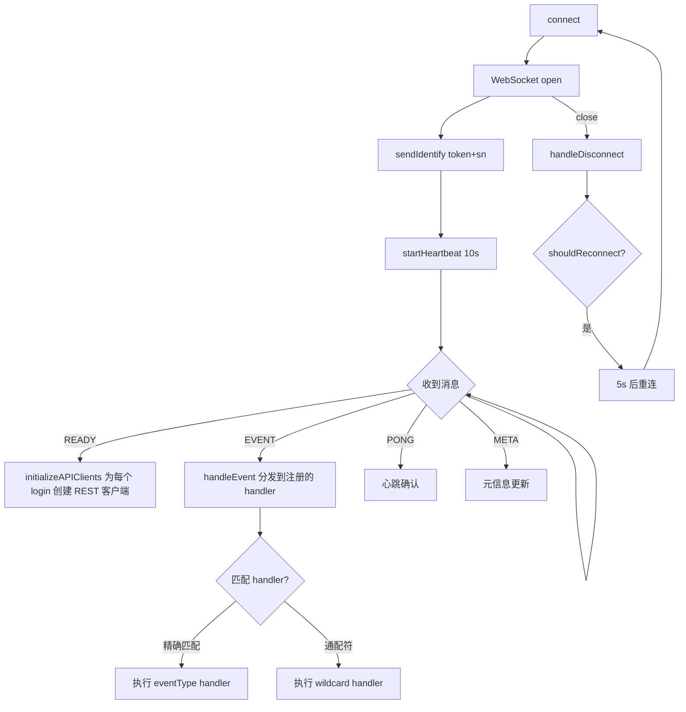
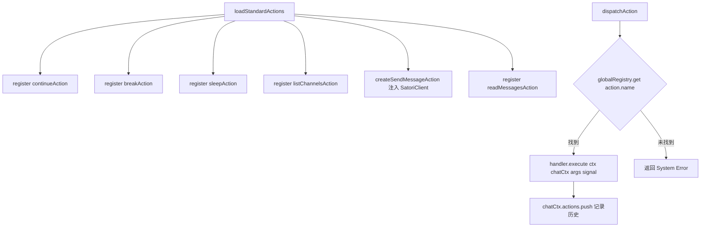

# PD-455.01 AIRI — Satori 协议驱动的多平台 Bot 统一框架

> 文档编号：PD-455.01
> 来源：AIRI `services/satori-bot/`, `services/telegram-bot/`, `services/discord-bot/`
> GitHub：https://github.com/moeru-ai/airi.git
> 问题域：PD-455 多平台Bot框架 Multi-Platform Bot Framework
> 状态：可复用方案

---

## 第 1 章 问题与动机

### 1.1 核心问题

构建一个 AI 角色（AIRI）需要同时活跃在 Telegram、Discord 等多个聊天平台上。每个平台有截然不同的 API 协议、消息格式、媒体能力（Telegram 有贴纸系统、Discord 有语音频道）和消息长度限制（Discord 2000 字符）。如果为每个平台独立开发完整的 Bot 逻辑，会导致：

1. **LLM 调用逻辑重复** — 每个平台都要实现一套 prompt 构建 + JSON 解析 + action 分发
2. **行为不一致** — 同一个 AI 角色在不同平台表现不同
3. **维护成本线性增长** — 新增平台 = 重写全部核心逻辑
4. **上下文管理碎片化** — 每个平台的会话状态、消息队列、上下文裁剪各自为政

### 1.2 AIRI 的解法概述

AIRI 采用**三层架构**解决多平台问题：

1. **Satori 协议统一层**（`services/satori-bot/`）— 以 Satori 开放聊天协议为核心，定义平台无关的事件/消息/频道/用户资源模型，通过 WebSocket 接收所有平台事件，通过 REST API 发送消息。核心 LLM 循环、Action 注册表、上下文管理全部在此层实现（`adapter/satori/client.ts:18`）
2. **平台原生适配器**（`services/telegram-bot/`, `services/discord-bot/`）— 每个平台用原生 SDK（grammy、discord.js）处理平台特有能力（贴纸、语音、slash commands），但共享相同的 BotContext/ChatContext 双层上下文模型和 LLM 调用模式
3. **全局 Action 注册表**（`capabilities/registry.ts:9`）— 通过 `ActionRegistry` + `ActionHandler` 接口实现可插拔的动作系统，平台特有动作（send_sticker）和通用动作（send_message）统一注册

### 1.3 设计思想

| 设计原则 | 具体实现 | 理由 | 替代方案 |
|----------|----------|------|----------|
| 协议统一 | Satori 协议作为中间层，定义 6 种 Opcode（EVENT/PING/PONG/IDENTIFY/READY/META） | 避免为每个平台写适配代码，Satori 是开放标准 | 自定义协议（维护成本高）、直接用各平台 SDK（无法统一） |
| 双层上下文 | BotContext（全局）+ ChatContext（per-channel），分离全局状态和会话状态 | 支持多频道并发处理，避免状态污染 | 单一全局状态（无法隔离频道）、数据库驱动（延迟高） |
| Action 注册表 | `ActionRegistry.register()` + 工厂函数注入依赖（如 `createSendMessageAction(client)`） | 平台特有动作和通用动作统一接口，支持依赖注入 | switch-case 硬编码（不可扩展）、插件系统（过度设计） |
| 递归事件循环 | `handleLoopStep()` 递归调用自身，`shouldContinue` 控制是否继续 | LLM 可能需要连续执行多个动作（读消息→回复），递归天然支持 | while 循环（Telegram 用了这种，但递归更清晰） |
| 并发安全 | 发送消息前检查 `unreadEvents[channelId].length > 0`，有新消息则中断发送 | 避免 Bot 回复过时内容，优先处理新消息 | 锁机制（复杂）、忽略新消息（体验差） |

---

## 第 2 章 源码实现分析

### 2.1 架构概览

```
┌─────────────────────────────────────────────────────────────────┐
│                        AIRI 多平台 Bot 架构                      │
├─────────────────────────────────────────────────────────────────┤
│                                                                 │
│  ┌──────────────┐  ┌──────────────┐  ┌──────────────────────┐  │
│  │ Telegram Bot  │  │ Discord Bot  │  │    Satori Bot        │  │
│  │ (grammy)      │  │ (discord.js) │  │ (Satori Protocol)    │  │
│  │              │  │              │  │                      │  │
│  │ ┌──────────┐ │  │ ┌──────────┐ │  │ ┌──────────────────┐ │  │
│  │ │ Sticker  │ │  │ │ Voice    │ │  │ │ SatoriClient     │ │  │
│  │ │ Photo    │ │  │ │ Slash Cmd│ │  │ │ (WebSocket+REST) │ │  │
│  │ │ Admin Cmd│ │  │ │ Chunking │ │  │ │ Auto-reconnect   │ │  │
│  │ └──────────┘ │  │ └──────────┘ │  │ │ Heartbeat 10s    │ │  │
│  └──────┬───────┘  └──────┬───────┘  │ └──────────────────┘ │  │
│         │                 │          └──────────┬───────────┘  │
│         │                 │                     │              │
│  ┌──────┴─────────────────┴─────────────────────┴───────────┐  │
│  │              共享模式（非共享代码，共享设计）                  │  │
│  │                                                           │  │
│  │  BotContext ──→ eventQueue / unreadEvents / processedIds  │  │
│  │  ChatContext ──→ channelId / messages[] / actions[]        │  │
│  │  handleLoopStep() ──→ imagineAnAction() ──→ dispatch()    │  │
│  │  ActionRegistry ──→ send_message / read / break / sleep   │  │
│  └───────────────────────────────────────────────────────────┘  │
│                                                                 │
│  ┌───────────────────────────────────────────────────────────┐  │
│  │                    LLM 调用层 (@xsai)                      │  │
│  │  generateText() → JSON Action → best-effort-json-parser   │  │
│  └───────────────────────────────────────────────────────────┘  │
└─────────────────────────────────────────────────────────────────┘
```

### 2.2 核心实现

#### 2.2.1 Satori 协议客户端 — 平台无关的事件总线

Satori 协议定义了 6 种 WebSocket Opcode，AIRI 的 `SatoriClient` 实现了完整的连接生命周期管理。



对应源码 `services/satori-bot/src/adapter/satori/client.ts:18-286`：

```typescript
export class SatoriClient {
  private ws?: WebSocket
  private apiClients = new Map<string, SatoriAPI>()
  private eventHandlers = new Map<string, Set<(event: SatoriEvent) => void | Promise<void>>>()

  async connect(): Promise<void> {
    this.ws = new WebSocket(this.config.url)
    this.ws.on('open', () => {
      this.sendIdentify()
      this.startHeartbeat()
    })
    this.ws.on('message', (data) => void this.handleMessage(data))
    this.ws.on('close', () => this.handleDisconnect())
  }

  private initializeAPIClients(ready: SatoriReadyBody): void {
    for (const login of ready.logins) {
      if (login.platform && login.self_id) {
        const key = `${login.platform}:${login.self_id}`
        this.apiClients.set(key, new SatoriAPI({
          baseUrl: apiBaseUrl, token: this.config.token,
          platform: login.platform, selfId: login.self_id,
        }))
      }
    }
  }

  async sendMessage(platform: string, selfId: string, channelId: string, content: string): Promise<void> {
    const api = this.apiClients.get(`${platform}:${selfId}`)
    await api.sendMessage(channelId, content)
  }
}
```

关键设计：READY 信号返回所有已登录平台的 `logins` 列表，客户端为每个 `platform:selfId` 组合创建独立的 REST API 客户端，发送消息时按 key 路由到正确的平台。

#### 2.2.2 Action 注册表 — 可插拔的动作系统



对应源码 `services/satori-bot/src/capabilities/registry.ts:9-34`：

```typescript
export class ActionRegistry {
  private actions = new Map<string, ActionHandler>()

  register(handler: ActionHandler) {
    this.actions.set(handler.name, handler)
  }

  get(name: string): ActionHandler | undefined {
    return this.actions.get(name)
  }

  loadStandardActions(client: SatoriClient) {
    this.register(continueAction)
    this.register(breakAction)
    this.register(sleepAction)
    this.register(listChannelsAction)
    this.register(createSendMessageAction(client))  // 工厂函数注入依赖
    this.register(readMessagesAction)
  }
}

export const globalRegistry = new ActionRegistry()
```

`ActionHandler` 接口定义（`capabilities/definition.ts:9-18`）：

```typescript
export interface ActionHandler {
  name: string
  description?: string
  execute: (
    ctx: BotContext, chatCtx: ChatContext,
    args: any, abortSignal?: AbortSignal,
  ) => Promise<ActionResult>
}
```

### 2.3 实现细节

#### 双层上下文模型

Satori Bot 的上下文分为全局 `BotContext` 和 per-channel `ChatContext`（`core/types.ts:30-51`）：

- **BotContext**：`eventQueue`（待处理事件队列）、`unreadEvents`（channelId → 未读事件映射）、`processedIds`（去重集合）、`chats`（channelId → ChatContext 映射）
- **ChatContext**：`channelId`、`platform`、`selfId`、`messages`（LLM 对话历史）、`actions`（动作执行历史）、`currentAbortController`（中断控制器）

Telegram Bot 的上下文结构几乎相同（`types.ts:17-40`），但用 `chatId` 替代 `channelId`，用 `messageQueue` 替代 `eventQueue`，增加了 `bot: Bot` 引用。

#### 上下文裁剪策略

`handleLoopStep()` 在每次循环开始时检查上下文大小（`core/loop/scheduler.ts:48-71`）：

| 资源 | 上限 | 裁剪后保留 | 常量定义 |
|------|------|-----------|---------|
| messages | 20 | 5 | `MAX_MESSAGES_IN_CONTEXT` / `MESSAGES_KEEP_ON_TRIM` |
| actions | 50 | 20 | `MAX_ACTIONS_IN_CONTEXT` / `ACTIONS_KEEP_ON_TRIM` |
| unreadEvents | 100/channel | 100（FIFO） | `MAX_UNREAD_EVENTS` |
| recentChannels | 5 | 5（FIFO） | `MAX_RECENT_INTERACTED_CHANNELS` |

裁剪时会注入系统消息通知 LLM："Approaching to system context limit, reducing... memory..."

#### 并发安全：发送前检查

`send_message` action 在实际发送前检查是否有新的未读消息（`capabilities/actions/send-message.ts:16-24`）：

```typescript
if (ctx.unreadEvents[channelId] && ctx.unreadEvents[channelId].length > 0) {
  return {
    success: false, shouldContinue: true,
    result: 'AIRI System: [INTERRUPT] Message sending ABORTED. New unread messages were detected.',
  }
}
```

这确保 Bot 不会回复过时的上下文，而是先读取新消息再决定回复内容。

#### 平台差异对比

| 维度 | Satori Bot | Telegram Bot | Discord Bot |
|------|-----------|-------------|-------------|
| 框架 | 自实现 Satori WebSocket | grammy | discord.js + @proj-airi/server-sdk |
| 消息队列 | `eventQueue: PendingEvent[]` | `messageQueue: {message, status}[]` | 无队列，直接转发到 AIRI Server |
| 动作分发 | `ActionRegistry` + `dispatchAction()` | 内联 `switch(action.action)` | AIRI Server 处理，适配器只负责 I/O |
| 特有能力 | 通用（任何 Satori 兼容平台） | 贴纸、照片解读、管理员命令 | 语音频道、slash commands、消息分块 |
| 消息发送 | Satori REST API | grammy `bot.api.sendMessage()` | discord.js `channel.send()` + 2000 字符分块 |
| LLM 调用 | `@xsai/generate-text` | `@xsai/generate-text` + OpenTelemetry | 由 AIRI Server 处理 |
| 数据库 | lowdb（本地 JSON） | Drizzle ORM + PostgreSQL | 无本地数据库 |

---

## 第 3 章 迁移指南

### 3.1 迁移清单

#### 阶段 1：核心协议层（必须）

- [ ] 实现 Satori 协议类型定义（6 种 Opcode + 资源模型）
- [ ] 实现 `SatoriClient`：WebSocket 连接、IDENTIFY 鉴权、PING/PONG 心跳、自动重连
- [ ] 实现 `SatoriAPI`：REST 消息发送，按 `platform:selfId` 路由
- [ ] 定义 `BotContext` + `ChatContext` 双层上下文模型

#### 阶段 2：Action 系统（必须）

- [ ] 定义 `ActionHandler` 接口和 `ActionResult` 类型
- [ ] 实现 `ActionRegistry`（register/get/loadStandardActions）
- [ ] 实现基础 actions：`continue`、`break`、`sleep`、`send_message`、`read_unread_messages`
- [ ] 实现 `dispatchAction()` 分发器

#### 阶段 3：LLM 循环（必须）

- [ ] 实现 `imagineAnAction()`：构建 prompt → LLM 调用 → JSON 解析 → 返回 Action
- [ ] 实现 `handleLoopStep()`：上下文裁剪 → LLM 调用 → 动作分发 → 递归继续
- [ ] 实现 `onMessageArrival()`：事件队列消费 → 去重 → 触发循环
- [ ] 实现 `startPeriodicLoop()`：定时检查未读消息

#### 阶段 4：平台适配器（按需）

- [ ] Telegram：grammy 框架 + 贴纸/照片解读 + 管理员命令
- [ ] Discord：discord.js + AIRI Server SDK + 语音管理 + 消息分块
- [ ] 其他 Satori 兼容平台：直接接入 Satori Bot 即可

### 3.2 适配代码模板

#### 最小可运行的 Action 注册表

```typescript
// action-types.ts
export interface ActionResult {
  success: boolean
  shouldContinue: boolean
  result: any
}

export interface ActionHandler {
  name: string
  description?: string
  execute: (
    ctx: BotContext,
    chatCtx: ChatContext,
    args: any,
    abortSignal?: AbortSignal,
  ) => Promise<ActionResult>
}

// registry.ts
export class ActionRegistry {
  private actions = new Map<string, ActionHandler>()

  register(handler: ActionHandler): void {
    this.actions.set(handler.name, handler)
  }

  get(name: string): ActionHandler | undefined {
    return this.actions.get(name)
  }

  listActions(): string[] {
    return Array.from(this.actions.keys())
  }
}

export const globalRegistry = new ActionRegistry()

// dispatcher.ts
export async function dispatchAction(
  ctx: BotContext,
  chatCtx: ChatContext,
  actionPayload: { action: string; [key: string]: any },
  abortController: AbortController,
): Promise<ActionResult> {
  if (!actionPayload?.action) {
    return { success: false, shouldContinue: true, result: 'No valid action provided.' }
  }

  const handler = globalRegistry.get(actionPayload.action)
  if (!handler) {
    return { success: false, shouldContinue: true, result: `Action "${actionPayload.action}" not found.` }
  }

  const result = await handler.execute(ctx, chatCtx, actionPayload, abortController.signal)
  chatCtx.actions.push({ action: actionPayload, result: result.result })
  return result
}
```

#### 最小可运行的双层上下文

```typescript
// context.ts
import type { Message as LLMMessage } from '@xsai/shared-chat'

export interface BotContext {
  eventQueue: Array<{ event: any; status: 'pending' | 'ready' }>
  unreadEvents: Record<string, any[]>
  processedIds: Set<string>
  processing: boolean
  chats: Map<string, ChatContext>
}

export interface ChatContext {
  channelId: string
  platform: string
  messages: LLMMessage[]
  actions: Array<{ action: any; result: unknown }>
  currentAbortController?: AbortController
}

export function ensureChatContext(bot: BotContext, channelId: string): ChatContext {
  if (bot.chats.has(channelId)) return bot.chats.get(channelId)!

  const ctx: ChatContext = {
    channelId,
    platform: '',
    messages: [],
    actions: [],
  }
  bot.chats.set(channelId, ctx)
  return ctx
}
```

### 3.3 适用场景

| 场景 | 适用度 | 说明 |
|------|--------|------|
| AI 角色多平台部署 | ⭐⭐⭐ | 核心场景，一个 AI 人格同时活跃在多个聊天平台 |
| 客服 Bot 多渠道接入 | ⭐⭐⭐ | Satori 协议天然支持多平台消息统一 |
| 社区管理 Bot | ⭐⭐ | 需要平台特有功能（踢人、禁言）时需扩展 Action |
| 单平台 Bot | ⭐ | 过度设计，直接用平台原生 SDK 更简单 |
| 实时语音 Bot | ⭐⭐ | Discord Bot 已有语音支持，但 Satori 层不直接处理音频流 |

---

## 第 4 章 测试用例

```typescript
import { describe, it, expect, vi, beforeEach } from 'vitest'

// ---- ActionRegistry 测试 ----
describe('ActionRegistry', () => {
  let registry: ActionRegistry

  beforeEach(() => {
    registry = new ActionRegistry()
  })

  it('should register and retrieve an action handler', () => {
    const handler: ActionHandler = {
      name: 'test_action',
      execute: vi.fn().mockResolvedValue({ success: true, shouldContinue: false, result: 'ok' }),
    }
    registry.register(handler)
    expect(registry.get('test_action')).toBe(handler)
  })

  it('should return undefined for unregistered action', () => {
    expect(registry.get('nonexistent')).toBeUndefined()
  })

  it('should overwrite handler with same name', () => {
    const handler1: ActionHandler = { name: 'dup', execute: vi.fn() }
    const handler2: ActionHandler = { name: 'dup', execute: vi.fn() }
    registry.register(handler1)
    registry.register(handler2)
    expect(registry.get('dup')).toBe(handler2)
  })
})

// ---- dispatchAction 测试 ----
describe('dispatchAction', () => {
  it('should return error for null action payload', async () => {
    const result = await dispatchAction({} as any, {} as any, null, new AbortController())
    expect(result.success).toBe(false)
    expect(result.result).toContain('No valid action')
  })

  it('should return error for unknown action', async () => {
    const result = await dispatchAction({} as any, { actions: [] } as any, { action: 'unknown' }, new AbortController())
    expect(result.success).toBe(false)
    expect(result.result).toContain('not found')
  })
})

// ---- send_message 并发安全测试 ----
describe('send_message concurrency safety', () => {
  it('should abort send when unread events exist', async () => {
    const ctx = {
      unreadEvents: { 'ch-1': [{ id: 1, type: 'message-created' }] },
      logger: { withField: () => ({ warn: vi.fn() }) },
    } as any

    const chatCtx = { platform: 'test', selfId: 'bot-1', messages: [], actions: [] } as any
    const mockClient = { sendMessage: vi.fn() }
    const action = createSendMessageAction(mockClient as any)

    const result = await action.execute(ctx, chatCtx, { channelId: 'ch-1', content: 'hello' })
    expect(result.success).toBe(false)
    expect(result.result).toContain('INTERRUPT')
    expect(mockClient.sendMessage).not.toHaveBeenCalled()
  })

  it('should send successfully when no unread events', async () => {
    const ctx = { unreadEvents: {}, logger: { withField: () => ({ warn: vi.fn() }) } } as any
    const chatCtx = { platform: 'test', selfId: 'bot-1', messages: [], actions: [] } as any
    const mockClient = { sendMessage: vi.fn().mockResolvedValue(undefined) }
    const action = createSendMessageAction(mockClient as any)

    const result = await action.execute(ctx, chatCtx, { channelId: 'ch-1', content: 'hello' })
    expect(result.success).toBe(true)
    expect(mockClient.sendMessage).toHaveBeenCalledWith('test', 'bot-1', 'ch-1', 'hello')
  })
})

// ---- 上下文裁剪测试 ----
describe('Context trimming', () => {
  it('should trim messages when exceeding MAX_MESSAGES_IN_CONTEXT', () => {
    const chatCtx = {
      messages: Array.from({ length: 25 }, (_, i) => ({ role: 'user', content: `msg-${i}` })),
      actions: [],
    }

    // 模拟 handleLoopStep 的裁剪逻辑
    if (chatCtx.messages.length > 20) {
      chatCtx.messages = chatCtx.messages.slice(-5)
      chatCtx.messages.push({ role: 'user', content: 'AIRI System: Approaching to system context limit...' })
    }

    expect(chatCtx.messages.length).toBe(6) // 5 kept + 1 system message
    expect(chatCtx.messages[0].content).toBe('msg-20')
  })

  it('should trim actions when exceeding MAX_ACTIONS_IN_CONTEXT', () => {
    const chatCtx = {
      messages: [],
      actions: Array.from({ length: 55 }, (_, i) => ({ action: { action: 'test' }, result: `r-${i}` })),
    }

    if (chatCtx.actions.length > 50) {
      chatCtx.actions = chatCtx.actions.slice(-20)
    }

    expect(chatCtx.actions.length).toBe(20)
    expect(chatCtx.actions[0].result).toBe('r-35')
  })
})
```

---

## 第 5 章 跨域关联

| 关联域 | 关系类型 | 说明 |
|--------|----------|------|
| PD-01 上下文管理 | 依赖 | `handleLoopStep()` 中的上下文裁剪策略（messages 20→5, actions 50→20）是典型的滑动窗口上下文管理，与 PD-01 的压缩策略直接相关 |
| PD-04 工具系统 | 协同 | `ActionRegistry` 本质上是一个工具注册表，`ActionHandler` 接口等价于工具定义，`dispatchAction()` 等价于工具调用分发 |
| PD-06 记忆持久化 | 协同 | Satori Bot 用 lowdb 持久化频道和消息记录，Telegram Bot 用 Drizzle+PostgreSQL，两者都在 `send_message` action 中调用 `recordMessage()` |
| PD-09 Human-in-the-Loop | 协同 | Telegram Bot 的 `AttentionConfig`（`types.ts:103-112`）定义了响应率衰减机制，控制 Bot 是否应该回复群聊消息，是一种被动式 HITL |
| PD-10 中间件管道 | 互斥 | AIRI 没有使用中间件管道模式，而是用 Action 注册表 + 递归循环替代。两种模式解决类似问题但架构不同 |
| PD-11 可观测性 | 协同 | Telegram Bot 集成了 OpenTelemetry（`index.ts:4-9`），包含 trace 和 metrics 导出；所有服务使用 `@guiiai/logg` 结构化日志 |

---

## 第 6 章 来源文件索引

| 文件 | 行范围 | 关键实现 |
|------|--------|----------|
| `services/satori-bot/src/adapter/satori/client.ts` | L18-L286 | SatoriClient：WebSocket 连接、心跳、事件分发、REST API 路由 |
| `services/satori-bot/src/adapter/satori/types.ts` | L1-L162 | Satori 协议完整类型定义：Opcode、Event、User、Channel、Guild、Message |
| `services/satori-bot/src/adapter/satori/api.ts` | L14-L95 | SatoriAPI：REST 消息 CRUD，platform/selfId 头部路由 |
| `services/satori-bot/src/capabilities/registry.ts` | L9-L34 | ActionRegistry：全局动作注册表，工厂函数依赖注入 |
| `services/satori-bot/src/capabilities/definition.ts` | L3-L18 | ActionHandler/ActionResult 接口定义 |
| `services/satori-bot/src/capabilities/actions/send-message.ts` | L8-L55 | send_message action：并发安全检查 + 持久化 + 状态更新 |
| `services/satori-bot/src/core/types.ts` | L30-L89 | BotContext/ChatContext/Action 类型定义 |
| `services/satori-bot/src/core/loop/scheduler.ts` | L24-L285 | 核心事件循环：handleLoopStep、onMessageArrival、startPeriodicLoop |
| `services/satori-bot/src/core/constants.ts` | L1-L22 | 上下文裁剪常量：MAX_MESSAGES=20, MAX_ACTIONS=50, PERIODIC=60s |
| `services/satori-bot/src/core/dispatcher.ts` | L6-L52 | dispatchAction：Action 分发器，错误处理 |
| `services/satori-bot/src/core/planner/llm-client.ts` | L16-L131 | imagineAnAction：LLM 调用 + JSON 解析 + think 标签清理 |
| `services/telegram-bot/src/index.ts` | L17-L48 | Telegram Bot 入口：OpenTelemetry SDK + DB 初始化 |
| `services/telegram-bot/src/types.ts` | L9-L131 | Telegram Bot 类型：BotContext/ChatContext/Action/AttentionConfig |
| `services/telegram-bot/src/bots/telegram/index.ts` | L23-L549 | Telegram Bot 核心：dispatchAction(switch-case)、handleLoopStep、消息处理 |
| `services/telegram-bot/src/bots/telegram/agent/actions/send-message.ts` | L37-L157 | Telegram 消息发送：LLM 分割 + 结构化解析 + 打字指示器 + 随机延迟 |
| `services/discord-bot/src/index.ts` | L12-L38 | Discord Bot 入口：DiscordAdapter 创建 + 优雅关闭 |
| `services/discord-bot/src/adapters/airi-adapter.ts` | L55-L336 | DiscordAdapter：双客户端(Discord+AIRI)、消息分块、语音管理、热配置 |

---

## 第 7 章 横向对比维度

```json comparison_data
{
  "project": "AIRI",
  "dimensions": {
    "协议抽象": "Satori 开放协议统一多平台，WebSocket 事件 + REST 消息 API",
    "适配器模式": "三独立 service：Satori 通用层 + Telegram/Discord 原生适配器",
    "动作系统": "ActionRegistry 全局注册表 + ActionHandler 接口 + 工厂函数依赖注入",
    "上下文模型": "BotContext(全局) + ChatContext(per-channel) 双层分离",
    "并发安全": "发送前检查 unreadEvents，有新消息则中断发送优先读取",
    "平台特化能力": "Telegram 贴纸/照片解读，Discord 语音频道/消息分块，Satori 通用"
  }
}
```

### 域元数据补充

```json domain_metadata
{
  "solution_summary": "AIRI 用 Satori 开放协议作为统一事件总线，三个独立 service（Satori/Telegram/Discord）共享 BotContext+ChatContext 双层上下文模型和 ActionRegistry 动作注册表，实现一个 AI 角色跨平台一致行为",
  "description": "通过开放聊天协议实现 AI 角色的跨平台人格一致性和行为统一",
  "sub_problems": [
    "并发安全：多频道同时触发时的消息发送竞态控制",
    "平台特化能力集成：贴纸/语音/slash commands 等平台独有功能的统一抽象",
    "上下文裁剪策略：多频道场景下 LLM 上下文窗口的分频道独立管理"
  ],
  "best_practices": [
    "用 ActionRegistry 工厂函数注入平台客户端依赖实现动作可插拔",
    "发送消息前检查未读队列实现乐观并发控制",
    "BotContext+ChatContext 双层模型隔离全局状态和会话状态"
  ]
}
```
