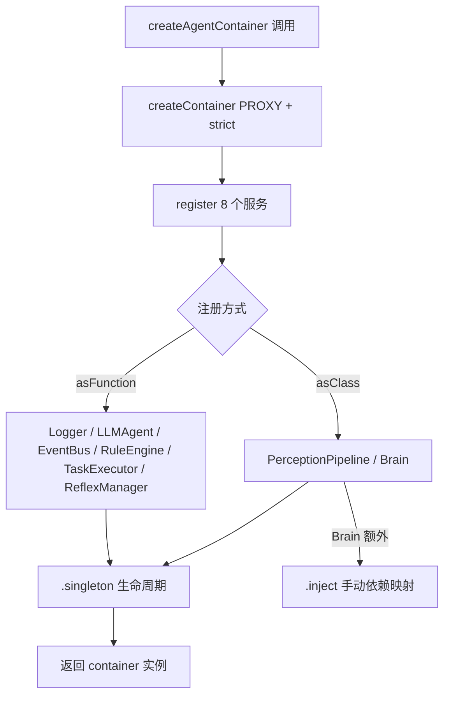
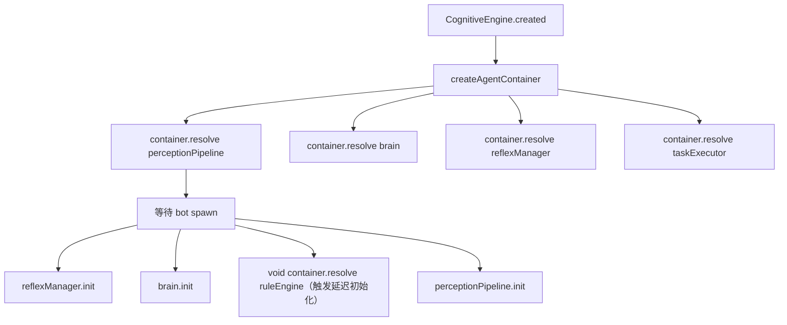

# PD-456.01 AIRI — Awilix IoC 容器驱动的认知引擎依赖注入

> 文档编号：PD-456.01
> 来源：AIRI `services/minecraft/src/cognitive/container.ts`
> GitHub：https://github.com/moeru-ai/airi.git
> 问题域：PD-456 依赖注入 Dependency Injection
> 状态：可复用方案

---

## 第 1 章 问题与动机

### 1.1 核心问题

AIRI 的 Minecraft 认知引擎是一个多层架构系统，包含感知层（PerceptionPipeline）、反射层（ReflexManager）、意识层（Brain）、行动层（TaskExecutor）以及 LLM 推理代理（LLMAgent）。这些服务之间存在复杂的依赖关系：

- Brain 依赖 EventBus、LLMAgent、ReflexManager、TaskExecutor、Logger 共 5 个服务
- ReflexManager 依赖 EventBus、TaskExecutor、Logger
- PerceptionPipeline 依赖 EventBus、Logger
- RuleEngine 依赖 EventBus 并需要在创建时立即初始化

如果用手动 `new` 构造，调用方需要关心创建顺序、生命周期、以及每个服务的具体依赖——这在服务数量增长时迅速变得不可维护。

### 1.2 AIRI 的解法概述

AIRI 选择 Awilix（v12）作为 IoC 容器，通过一个集中式的 `createAgentContainer()` 工厂函数完成所有服务的注册和装配：

1. **PROXY 注入模式**：使用 `InjectionMode.PROXY` 让服务通过解构参数自动获取依赖，无需装饰器或显式 `container.resolve()` (`container.ts:31`)
2. **全 singleton 生命周期**：所有 8 个服务均注册为 `.singleton()`，确保认知引擎内共享同一实例 (`container.ts:38-88`)
3. **延迟解析**：Awilix 天然延迟——服务在首次 `resolve()` 时才实例化，而非注册时 (`index.ts:78-79`)
4. **手动注入覆盖**：Brain 使用 `.inject()` 显式指定依赖映射，绕过 PROXY 自动解析的限制 (`container.ts:73-79`)
5. **集中式销毁**：`CognitiveEngine.beforeCleanup()` 按逆序 resolve 并调用各服务的 `destroy()` 方法 (`index.ts:146-167`)

### 1.3 设计思想

| 设计原则 | 具体实现 | 理由 | 替代方案 |
|----------|----------|------|----------|
| 透明依赖解析 | `InjectionMode.PROXY` + 解构参数 | 服务代码无需感知容器存在，纯 POJO 构造 | CLASSIC 模式（需按参数位置注入） |
| 单例共享 | 全部 `.singleton()` | 认知引擎内 EventBus/Logger 等必须全局唯一 | transient（每次新建，浪费资源） |
| 延迟实例化 | Awilix 默认 lazy + 显式 `void container.resolve('ruleEngine')` | RuleEngine 需要 EventBus 先就绪，延迟到 spawn 后再触发 | eager 注册（可能在依赖未就绪时失败） |
| 显式注入覆盖 | Brain 用 `.inject(c => ({...}))` | Brain 的构造函数接收 `BrainDeps` 接口而非解构参数，PROXY 无法自动匹配 | 改造 Brain 构造函数为解构参数（侵入性大） |
| 严格模式 | `strict: true` | 解析未注册服务时立即报错，而非返回 undefined | 非严格模式（静默失败，难以调试） |

---

## 第 2 章 源码实现分析

### 2.1 架构概览

AIRI 认知引擎的依赖注入架构分为三层：容器定义层、服务消费层、生命周期管理层。

```
┌─────────────────────────────────────────────────────────┐
│                  CognitiveEngine (Plugin)                │
│  ┌───────────────────────────────────────────────────┐  │
│  │           createAgentContainer()                   │  │
│  │  ┌─────────┐ ┌──────────┐ ┌───────────────────┐  │  │
│  │  │ Logger  │ │ EventBus │ │    LLMAgent        │  │  │
│  │  │singleton│ │singleton │ │   singleton        │  │  │
│  │  └────┬────┘ └────┬─────┘ └────────┬──────────┘  │  │
│  │       │           │                │              │  │
│  │  ┌────▼────┐ ┌────▼─────┐  ┌──────▼──────────┐  │  │
│  │  │TaskExec │ │RuleEngine│  │PerceptionPipeline│  │  │
│  │  │singleton│ │singleton │  │   singleton      │  │  │
│  │  └────┬────┘ └──────────┘  └──────────────────┘  │  │
│  │       │                                           │  │
│  │  ┌────▼──────────┐  ┌────────────────────────┐   │  │
│  │  │ ReflexManager │  │        Brain            │   │  │
│  │  │   singleton   │  │  singleton + .inject()  │   │  │
│  │  └───────────────┘  └────────────────────────┘   │  │
│  └───────────────────────────────────────────────────┘  │
│                                                         │
│  created() → resolve services → init layers             │
│  beforeCleanup() → resolve → destroy each service       │
└─────────────────────────────────────────────────────────┘
```

### 2.2 核心实现

#### 2.2.1 容器创建与服务注册



对应源码 `services/minecraft/src/cognitive/container.ts:29-92`：

```typescript
export function createAgentContainer() {
  const container = createContainer<ContainerServices>({
    injectionMode: InjectionMode.PROXY,
    strict: true,
  })

  container.register({
    // 工厂函数注册：无依赖的基础服务
    logger: asFunction(() => useLogg('agent').useGlobalConfig()).singleton(),
    llmAgent: asFunction(() => new LLMAgent({
      baseURL: config.openai.baseUrl,
      apiKey: config.openai.apiKey,
      model: config.openai.model,
    })).singleton(),
    eventBus: asFunction(() => createEventBus()).singleton(),

    // 工厂函数注册：有依赖的服务（PROXY 自动注入）
    ruleEngine: asFunction(({ eventBus }) => {
      const engine = createRuleEngine({
        eventBus,
        logger: useLogg('ruleEngine').useGlobalConfig(),
        config: { rulesDir: new URL('./perception/rules', import.meta.url).pathname, slotMs: 20 },
      })
      engine.init()
      return engine
    }).singleton(),

    // 类注册：PROXY 自动注入构造函数参数
    perceptionPipeline: asClass(PerceptionPipeline).singleton(),

    taskExecutor: asFunction(({ logger }) =>
      new TaskExecutor({ logger }),
    ).singleton(),

    // 类注册 + 手动注入覆盖
    brain: asClass(Brain)
      .singleton()
      .inject(c => ({
        eventBus: c.resolve('eventBus'),
        llmAgent: c.resolve('llmAgent'),
        reflexManager: c.resolve('reflexManager'),
        taskExecutor: c.resolve('taskExecutor'),
        logger: c.resolve('logger'),
      })),

    reflexManager: asFunction(({ eventBus, taskExecutor, logger }) =>
      new ReflexManager({ eventBus, taskExecutor, logger }),
    ).singleton(),
  })

  return container
}
```

关键设计点：
- `InjectionMode.PROXY`（`container.ts:31`）：Awilix 为每个工厂函数/类构造函数的第一个参数创建一个 Proxy 对象，属性访问时按名称从容器解析
- `strict: true`（`container.ts:32`）：解析未注册的服务名会抛出异常
- `asFunction` vs `asClass`（`container.ts:38-88`）：`asFunction` 用于需要自定义构造逻辑的服务，`asClass` 用于构造函数签名与容器服务名匹配的类

#### 2.2.2 服务消费：CognitiveEngine 插件



对应源码 `services/minecraft/src/cognitive/index.ts:9-44`：

```typescript
export function CognitiveEngine(options: CognitiveEngineOptions): MineflayerPlugin {
  let container: ReturnType<typeof createAgentContainer>

  return {
    async created(bot) {
      container = createAgentContainer()

      const perceptionPipeline = container.resolve('perceptionPipeline')
      const brain = container.resolve('brain')
      const reflexManager = container.resolve('reflexManager')
      const taskExecutor = container.resolve('taskExecutor')

      // ... 初始化逻辑

      const startCognitive = () => {
        reflexManager.init(botWithAgents)
        brain.init(botWithAgents)
        // Awilix is lazy — RuleEngine 在此处才真正实例化
        void container.resolve('ruleEngine')
        perceptionPipeline.init(botWithAgents)
      }
    },

    async beforeCleanup(bot) {
      if (container) {
        const brain = container.resolve('brain')
        brain.destroy()
        const taskExecutor = container.resolve('taskExecutor')
        await taskExecutor.destroy()
        const perceptionPipeline = container.resolve('perceptionPipeline')
        perceptionPipeline.destroy()
        const ruleEngine = container.resolve('ruleEngine')
        ruleEngine.destroy()
        const reflexManager = container.resolve('reflexManager')
        reflexManager.destroy()
      }
    },
  }
}
```

### 2.3 实现细节

**依赖图与解析顺序**

由于 Awilix 延迟解析，实际实例化顺序由 `resolve()` 调用链决定：

```
resolve('perceptionPipeline')
  → 触发 asClass(PerceptionPipeline)
    → 构造函数需要 { eventBus, logger }
      → resolve('eventBus') → createEventBus() [首次创建]
      → resolve('logger') → useLogg('agent') [首次创建]

resolve('brain')
  → 触发 asClass(Brain).inject(...)
    → inject 回调显式 resolve 5 个依赖
      → resolve('eventBus') → [已缓存，返回 singleton]
      → resolve('llmAgent') → new LLMAgent({...}) [首次创建]
      → resolve('reflexManager')
        → 触发 asFunction(({ eventBus, taskExecutor, logger }) => ...)
          → resolve('taskExecutor')
            → 触发 asFunction(({ logger }) => new TaskExecutor({...}))
              → resolve('logger') → [已缓存]
          → resolve('eventBus') → [已缓存]
          → resolve('logger') → [已缓存]
      → resolve('taskExecutor') → [已缓存]
      → resolve('logger') → [已缓存]
```

**Brain 的 `.inject()` 模式**

Brain 的构造函数签名是 `constructor(private readonly deps: BrainDeps)`（`brain.ts:314`），接收一个命名接口而非解构参数。PROXY 模式无法自动将 `deps.eventBus` 映射到容器的 `eventBus` 注册名，因此需要 `.inject()` 显式桥接：

```typescript
// brain.ts:43-49 — BrainDeps 接口定义
interface BrainDeps {
  eventBus: EventBus
  llmAgent: LLMAgent
  logger: Logg
  taskExecutor: TaskExecutor
  reflexManager: ReflexManager
}
```

**PerceptionPipeline 的 PROXY 自动注入**

相比之下，PerceptionPipeline 的构造函数直接解构 `deps` 参数（`pipeline.ts:13-16`），与容器注册名一致，PROXY 可以自动匹配：

```typescript
constructor(
  private readonly deps: {
    eventBus: EventBus
    logger: Logg
  },
) { ... }
```

这里 `asClass(PerceptionPipeline)` 能工作是因为 Awilix PROXY 模式会为构造函数的第一个参数创建代理，当访问 `deps.eventBus` 时自动从容器解析。

**ContainerServices 类型接口**

`container.ts:18-27` 定义了 `ContainerServices` 接口，为容器提供完整的类型安全：

```typescript
export interface ContainerServices {
  logger: Logg
  eventBus: EventBus
  ruleEngine: RuleEngine
  llmAgent: LLMAgent
  perceptionPipeline: PerceptionPipeline
  taskExecutor: TaskExecutor
  brain: Brain
  reflexManager: ReflexManager
}
```

这使得 `container.resolve('xxx')` 的返回值自动推断为正确类型，`container.register({...})` 的键名也受到约束。


---

## 第 3 章 迁移指南

### 3.1 迁移清单

**阶段 1：基础设施（1 个文件）**

- [ ] 安装 Awilix：`pnpm add awilix`（当前 AIRI 使用 v12.1.1）
- [ ] 创建 `container.ts`，定义 `ContainerServices` 接口和 `createContainer()` 工厂

**阶段 2：服务注册（改造现有服务）**

- [ ] 将无依赖的基础服务用 `asFunction(() => ...).singleton()` 注册
- [ ] 将有依赖的服务改造构造函数为解构参数形式，用 `asClass(Xxx).singleton()` 注册
- [ ] 对于构造函数签名不兼容 PROXY 的服务，使用 `.inject()` 显式映射

**阶段 3：消费端改造**

- [ ] 将入口点改为 `createContainer()` → `container.resolve('xxx')` 模式
- [ ] 移除手动 `new` 构造和依赖传递代码
- [ ] 添加 `destroy()` 生命周期，在容器销毁时逐一清理服务

### 3.2 适配代码模板

以下是一个可直接运行的最小 Awilix IoC 容器模板（TypeScript）：

```typescript
import { asClass, asFunction, createContainer, InjectionMode } from 'awilix'

// 1. 定义服务接口
interface AppServices {
  logger: Logger
  database: Database
  userService: UserService
  authService: AuthService
}

// 2. 服务实现（构造函数解构参数 = PROXY 友好）
class Logger {
  log(msg: string) { console.log(`[${new Date().toISOString()}] ${msg}`) }
}

class Database {
  constructor(private deps: { logger: Logger }) {}
  async query(sql: string) {
    this.deps.logger.log(`SQL: ${sql}`)
    return []
  }
  async destroy() { this.deps.logger.log('Database closed') }
}

class UserService {
  constructor(private deps: { database: Database; logger: Logger }) {}
  async findUser(id: string) {
    return this.deps.database.query(`SELECT * FROM users WHERE id = '${id}'`)
  }
}

// 3. 构造函数不兼容 PROXY 的服务 → 用 .inject() 桥接
interface AuthDeps { userService: UserService; logger: Logger }
class AuthService {
  constructor(private config: AuthDeps) {}
  async authenticate(token: string) {
    this.config.logger.log(`Auth: ${token}`)
    return this.config.userService.findUser('1')
  }
}

// 4. 容器工厂
function createAppContainer() {
  const container = createContainer<AppServices>({
    injectionMode: InjectionMode.PROXY,
    strict: true,
  })

  container.register({
    logger: asClass(Logger).singleton(),
    database: asClass(Database).singleton(),
    userService: asClass(UserService).singleton(),
    authService: asClass(AuthService)
      .singleton()
      .inject(c => ({
        userService: c.resolve('userService'),
        logger: c.resolve('logger'),
      })),
  })

  return container
}

// 5. 使用
const container = createAppContainer()
const auth = container.resolve('authService')
await auth.authenticate('token-123')

// 6. 销毁
const db = container.resolve('database')
await db.destroy()
```

### 3.3 适用场景

| 场景 | 适用度 | 说明 |
|------|--------|------|
| 多层认知/Agent 架构 | ⭐⭐⭐ | 服务间依赖复杂，singleton 共享是刚需 |
| 插件式系统（Mineflayer 插件） | ⭐⭐⭐ | 容器随插件创建/销毁，天然隔离 |
| 微服务内部 DI | ⭐⭐⭐ | 轻量级，无需 NestJS 等重框架 |
| 需要 request-scoped 隔离 | ⭐⭐ | Awilix 支持 `createScope()` 但 AIRI 未使用 |
| 前端 React/Vue 应用 | ⭐ | 前端通常用 Context/Provide-Inject，Awilix 偏后端 |

---

## 第 4 章 测试用例

基于 AIRI 的真实服务签名编写的测试代码：

```typescript
import { asClass, asFunction, createContainer, InjectionMode } from 'awilix'
import { describe, expect, it, vi } from 'vitest'

// 模拟 AIRI 的服务接口
interface MockServices {
  logger: { log: (msg: string) => void }
  eventBus: { emit: (e: any) => void; subscribe: (p: string, h: any) => () => void }
  taskExecutor: { on: any; off: any; getAvailableActions: () => any[] }
  brain: { init: (bot: any) => void; destroy: () => void }
}

describe('Awilix IoC Container — AIRI Pattern', () => {
  it('should resolve singleton services sharing the same instance', () => {
    const container = createContainer<MockServices>({
      injectionMode: InjectionMode.PROXY,
      strict: true,
    })

    const mockLogger = { log: vi.fn() }
    container.register({
      logger: asFunction(() => mockLogger).singleton(),
      eventBus: asFunction(() => ({
        emit: vi.fn(),
        subscribe: vi.fn(() => vi.fn()),
      })).singleton(),
      taskExecutor: asFunction(({ logger }) => ({
        on: vi.fn(),
        off: vi.fn(),
        getAvailableActions: () => [],
        logger,
      })).singleton(),
      brain: asFunction(({ logger }) => ({
        init: vi.fn(),
        destroy: vi.fn(),
        logger,
      })).singleton(),
    })

    const brain1 = container.resolve('brain')
    const brain2 = container.resolve('brain')
    expect(brain1).toBe(brain2) // singleton 保证同一实例

    const logger1 = container.resolve('logger')
    const logger2 = container.resolve('logger')
    expect(logger1).toBe(logger2)
  })

  it('should throw on resolving unregistered service in strict mode', () => {
    const container = createContainer<MockServices>({
      injectionMode: InjectionMode.PROXY,
      strict: true,
    })

    expect(() => container.resolve('logger')).toThrow()
  })

  it('should support lazy resolution — service not created until resolve()', () => {
    const factory = vi.fn(() => ({ log: vi.fn() }))
    const container = createContainer<Pick<MockServices, 'logger'>>({
      injectionMode: InjectionMode.PROXY,
      strict: true,
    })

    container.register({
      logger: asFunction(factory).singleton(),
    })

    expect(factory).not.toHaveBeenCalled() // 注册时不调用
    container.resolve('logger')
    expect(factory).toHaveBeenCalledOnce() // resolve 时才调用
    container.resolve('logger')
    expect(factory).toHaveBeenCalledOnce() // singleton 不重复调用
  })

  it('should inject dependencies via PROXY mode automatically', () => {
    interface ProxyTestServices {
      config: { port: number }
      server: { config: { port: number } }
    }

    const container = createContainer<ProxyTestServices>({
      injectionMode: InjectionMode.PROXY,
      strict: true,
    })

    container.register({
      config: asFunction(() => ({ port: 3000 })).singleton(),
      server: asFunction(({ config }) => ({ config })).singleton(),
    })

    const server = container.resolve('server')
    expect(server.config.port).toBe(3000)
  })

  it('should support .inject() override for non-PROXY-compatible constructors', () => {
    interface InjectTestServices {
      dep: { value: string }
      service: { getDep: () => { value: string } }
    }

    class MyService {
      constructor(private opts: { dep: { value: string } }) {}
      getDep() { return this.opts.dep }
    }

    const container = createContainer<InjectTestServices>({
      injectionMode: InjectionMode.PROXY,
      strict: true,
    })

    container.register({
      dep: asFunction(() => ({ value: 'injected' })).singleton(),
      service: asClass(MyService)
        .singleton()
        .inject(c => ({ dep: c.resolve('dep') })),
    })

    const svc = container.resolve('service')
    expect(svc.getDep().value).toBe('injected')
  })
})
```


---

## 第 5 章 跨域关联

| 关联域 | 关系类型 | 说明 |
|--------|----------|------|
| PD-02 多 Agent 编排 | 协同 | IoC 容器管理 Brain/ReflexManager/PerceptionPipeline 三层认知架构的服务装配，是编排层的基础设施 |
| PD-04 工具系统 | 协同 | TaskExecutor 通过容器注入 Logger，ActionRegistry 在 TaskExecutor 内部手动创建（未纳入容器） |
| PD-06 记忆持久化 | 协同 | Brain 内部的 conversationHistory 和 archivedContexts 依赖容器注入的 EventBus 进行状态广播 |
| PD-10 中间件管道 | 依赖 | PerceptionPipeline 作为感知中间件管道，其 EventBus 依赖通过容器注入而非手动传递 |
| PD-11 可观测性 | 协同 | Logger 作为容器的基础服务被所有层共享，DebugService 则采用静态单例模式（未纳入容器） |

---

## 第 6 章 来源文件索引

| 文件 | 行范围 | 关键实现 |
|------|--------|----------|
| `services/minecraft/src/cognitive/container.ts` | L1-92 | 容器创建、8 个服务注册、ContainerServices 类型定义 |
| `services/minecraft/src/cognitive/index.ts` | L1-178 | CognitiveEngine 插件：容器消费、服务初始化、生命周期销毁 |
| `services/minecraft/src/cognitive/conscious/brain.ts` | L43-49, L314 | BrainDeps 接口定义、构造函数签名 |
| `services/minecraft/src/cognitive/perception/pipeline.ts` | L9-50 | PerceptionPipeline 类：PROXY 友好的构造函数 |
| `services/minecraft/src/cognitive/reflex/reflex-manager.ts` | L13-34 | ReflexManager 类：解构参数依赖注入 |
| `services/minecraft/src/cognitive/action/task-executor.ts` | L11-24 | TaskExecutor 类：Logger 注入 |
| `services/minecraft/src/cognitive/conscious/llm-agent.ts` | L5-9, L26-27 | LLMAgent 类：配置注入 |
| `services/minecraft/src/cognitive/event-bus.ts` | L106-175 | EventBus 类：无依赖的基础服务 |
| `services/minecraft/src/composables/config.ts` | L58-59 | 全局 config 单例（容器外的配置源） |
| `services/minecraft/package.json` | L21 | Awilix v12.1.1 依赖声明 |

---

## 第 7 章 横向对比维度

```json comparison_data
{
  "project": "AIRI",
  "dimensions": {
    "容器框架": "Awilix v12 轻量级 IoC，无装饰器依赖",
    "注入模式": "PROXY 模式自动解析 + .inject() 手动覆盖双轨",
    "生命周期": "全 singleton，延迟实例化（resolve 时创建）",
    "类型安全": "ContainerServices 泛型接口约束注册和解析",
    "销毁策略": "入口插件 beforeCleanup 逐一 resolve + destroy",
    "作用域隔离": "单容器无 scope，每个 CognitiveEngine 实例独立容器"
  }
}
```

### 域元数据补充

```json domain_metadata
{
  "solution_summary": "AIRI 用 Awilix v12 PROXY 模式 + .inject() 双轨注入管理 8 个认知引擎服务的 singleton 生命周期，支持延迟解析和严格模式类型安全",
  "description": "轻量级 IoC 容器在游戏 AI 认知架构中的工程实践",
  "sub_problems": [
    "PROXY 自动解析与手动注入覆盖的选择策略",
    "容器外单例（如 DebugService）与容器内服务的协调"
  ],
  "best_practices": [
    "用 ContainerServices 泛型接口为容器提供编译期类型安全",
    "对构造函数签名不兼容 PROXY 的服务使用 .inject() 显式桥接",
    "利用 Awilix 延迟解析控制服务初始化时序"
  ]
}
```

