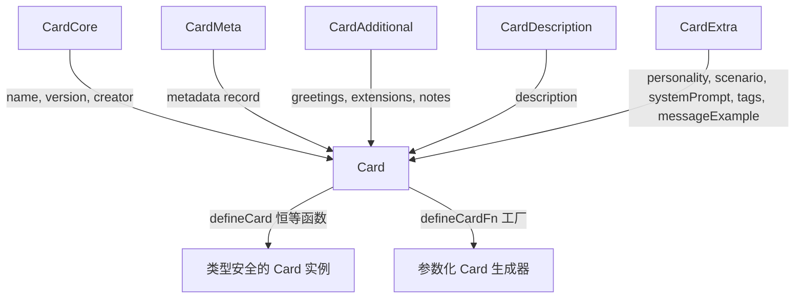
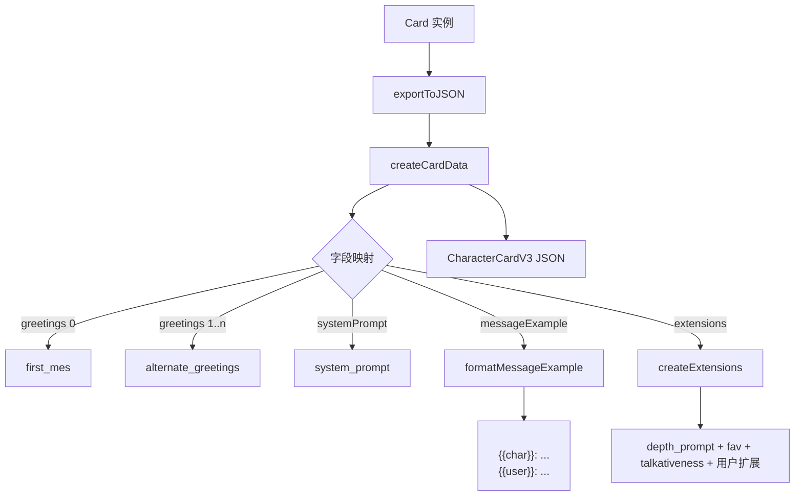
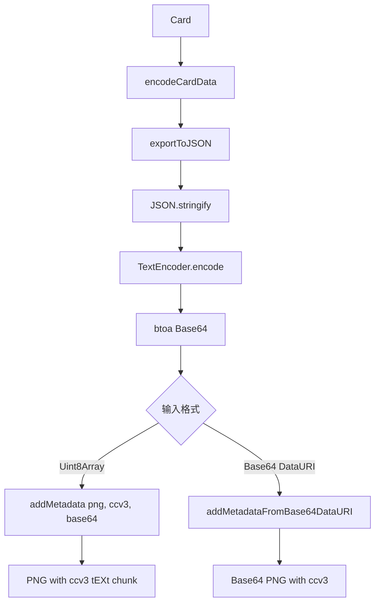

# PD-457.01 AIRI — CCC 角色卡片定义与多格式导出

> 文档编号：PD-457.01
> 来源：AIRI `packages/ccc/`
> GitHub：https://github.com/moeru-ai/airi.git
> 问题域：PD-457 角色卡片系统 Character Card System
> 状态：可复用方案

---

## 第 1 章 问题与动机

### 1.1 核心问题

AI 角色扮演（Roleplay）生态中，角色卡片是核心数据载体。一个角色需要定义人格特征、背景故事、系统提示词、示例对话、知识库（lorebook）等多维信息，并在不同前端（SillyTavern、Agnai、RisuAI 等）之间互通。

核心挑战：
- **规范碎片化**：Character Card 经历 V1 → V2 → V3 三代演进，字段不断扩展，旧前端只认 V1/V2 字段
- **导出格式多样**：PNG 嵌入元数据（最流行）、纯 JSON、Markdown、APNG 动图等，每种格式的编码方式不同
- **开发体验差**：直接操作 V3 规范的 JSON 结构冗长且易出错，缺乏类型安全和 DSL 辅助
- **示例对话格式化**：`<START>` 分隔符、`{{char}}`/`{{user}}` 模板变量等格式要求容易写错

### 1.2 AIRI 的解法概述

AIRI 的 `@proj-airi/ccc`（Character Card Creator）包采用三层架构解决上述问题：

1. **内部 DSL 层**（`define/card.ts:4-120`）：定义简洁的 `Card` 类型，用交叉类型组合 5 个接口片段，提供 `defineCard()` 工厂函数实现类型推断
2. **规范适配层**（`export/json.ts:9-74`）：将内部 `Card` 映射到 Character Card V3 规范的 `Data` 结构，处理字段重命名、默认值填充、消息格式化
3. **格式编码层**（`export/png.ts:10-31`）：将 V3 JSON 编码为 Base64 后嵌入 PNG 的 tEXt chunk，key 为 `ccv3`
4. **对话构建 DSL**（`utils/chat.ts:1-65`）：tagged template literal + 函数重载，支持 `chat.act`/`chat.msg`/`chat.char`/`chat.user` 四种语义标记
5. **Markdown 工具**（`utils/markdown.ts:1-8`）：`content`/`h`/`p`/`link` 四个原子函数，用于构建角色描述文本

### 1.3 设计思想

| 设计原则 | 具体实现 | 理由 | 替代方案 |
|----------|----------|------|----------|
| 内部模型与规范解耦 | `Card` ≠ `Data`，通过 `createCardData()` 映射 | 规范字段命名冗长（`post_history_instructions`），内部用驼峰简写（`postHistoryInstructions`）提升 DX | 直接使用规范类型（牺牲 DX） |
| 交叉类型组合 | `Card = CardCore & CardMeta & CardAdditional & CardDescription & CardExtra` | 每个接口片段职责单一，可独立演进，避免单一巨型接口 | 单一 interface（难以维护） |
| 渐进式规范兼容 | `Data = DataV1 & DataV2 & DataV3` 三代合并 | V3 是 V1+V2 的超集，合并后一次性满足所有版本消费者 | 版本分支导出（复杂度高） |
| 零依赖核心 + 最小外部依赖 | 仅依赖 `meta-png`（PNG 元数据操作） | 保持包体积小，PNG chunk 操作无需自己实现 | 自实现 PNG 解析（工作量大） |
| 工厂函数 + 类型推断 | `defineCard(card)` 是恒等函数，仅用于 TS 类型推断 | 无运行时开销，纯编译期类型安全 | class 构造器（运行时开销） |

---

## 第 2 章 源码实现分析

### 2.1 架构概览

```
┌─────────────────────────────────────────────────────────┐
│                    @proj-airi/ccc                        │
├─────────────────────────────────────────────────────────┤
│                                                         │
│  ┌──────────────┐   ┌──────────────┐   ┌─────────────┐ │
│  │   define/     │   │   export/     │   │   utils/    │ │
│  │              │   │              │   │             │ │
│  │  Card 类型    │──→│  json.ts     │   │  chat.ts    │ │
│  │  defineCard() │   │  png.ts      │   │  markdown.ts│ │
│  │  CardFn<T>   │   │  apng.ts ◇   │   │             │ │
│  │              │   │  md.ts   ◇   │   │             │ │
│  └──────────────┘   └──────┬───────┘   └──────┬──────┘ │
│                            │                   │        │
│                     ┌──────┴───────┐           │        │
│                     │   types/     │           │        │
│                     │  Data (V1+V2+V3)         │        │
│                     │  CharacterBook│           │        │
│                     │  Assets      │           │        │
│                     │  Extensions  │           │        │
│                     └──────────────┘           │        │
│                                                         │
│  ◇ = stub（未实现）                                      │
└─────────────────────────────────────────────────────────┘
         │                                    │
         ▼                                    ▼
   ┌───────────┐                    ┌──────────────────┐
   │  meta-png  │                    │  消费端           │
   │ (PNG chunk │                    │  SillyTavern     │
   │  读写)     │                    │  Agnai / RisuAI  │
   └───────────┘                    └──────────────────┘
```

数据流：`defineCard(card) → exportToJSON(card) → exportToPNG(card, pngBytes)`

### 2.2 核心实现

#### 2.2.1 Card 类型定义与工厂函数



对应源码 `packages/ccc/src/define/card.ts:4-120`：

```typescript
interface CardCore {
  creator?: Data['creator']
  name: Data['name']
  nickname?: Data['nickname']
  version: Data['character_version']
}

interface CardExtra {
  personality?: string
  scenario?: string
  systemPrompt?: string
  postHistoryInstructions?: string
  tags?: string[]
  messageExample?: Message[][]
}

// 五片段交叉类型组合
export type Card = CardAdditional & CardCore & CardDescription & CardMeta & CardExtra

// 恒等工厂 — 零运行时开销，纯类型推断
export const defineCard = (card: Card) => card
export const defineCardFn = <T extends Record<string, unknown>>(card: CardFn<T>, data: T) => card(data)
```

关键设计：`Card` 的字段名使用驼峰命名（`systemPrompt`），而非规范的蛇形命名（`system_prompt`），通过 `createCardData()` 在导出时映射。`greetings[0]` 映射到 `first_mes`，`greetings.slice(1)` 映射到 `alternate_greetings`，将规范中两个独立字段统一为一个数组。

#### 2.2.2 JSON 导出与字段映射



对应源码 `packages/ccc/src/export/json.ts:9-74`：

```typescript
export function exportToJSON(data: Card): CharacterCardV3 {
  return {
    spec: 'chara_card_v3',
    spec_version: '3.0',
    data: createCardData(data),
  }
}

function createCardData(data: Card): CharacterCardV3['data'] {
  return {
    name: data.name,
    nickname: data.nickname,
    description: data.description ?? '',
    personality: data.personality ?? '',
    scenario: data.scenario ?? '',
    first_mes: data.greetings?.[0] ?? '',
    alternate_greetings: data.greetings?.slice(1) ?? [],
    group_only_greetings: data.greetingsGroupOnly ?? [],
    mes_example: formatMessageExample(data.messageExample),
    system_prompt: data.systemPrompt ?? '',
    post_history_instructions: data.postHistoryInstructions ?? '',
    tags: data.tags ?? [],
    extensions: createExtensions(data),
    character_version: data.version,
    creator: data.creator ?? '',
    creator_notes: data.notes ?? '',
    creator_notes_multilingual: data.notesMultilingual,
  }
}

function formatMessageExample(messageExample: string[][] | undefined): string {
  if (!messageExample) return ''
  return messageExample
    .map(arr => `<START>\n${arr.join('\n')}`)
    .join('\n')
}
```

#### 2.2.3 PNG 元数据嵌入



对应源码 `packages/ccc/src/export/png.ts:10-31`：

```typescript
function encodeCardData(data: Card): string {
  const jsonData = exportToJSON(data)
  const jsonString = JSON.stringify(jsonData)
  const encodedData = new TextEncoder().encode(jsonString)
  return btoa(String.fromCharCode(...encodedData))
}

export function exportToPNG(data: Card, png: Uint8Array): Uint8Array {
  const encodedData = encodeCardData(data)
  return addMetadata(png, 'ccv3', encodedData)
}

export function exportToPNGBase64(data: Card, png: string): string {
  const encodedData = encodeCardData(data)
  return addMetadataFromBase64DataURI(png, 'ccv3', encodedData)
}
```

PNG 嵌入使用 `meta-png` 库操作 PNG 的 tEXt chunk，key 固定为 `'ccv3'`。这是 SillyTavern 生态的事实标准——前端读取 PNG 时查找 `ccv3` key 即可提取角色数据。

### 2.3 实现细节

#### 对话构建 DSL

`utils/chat.ts:1-65` 实现了一个精巧的 tagged template literal 工厂：

```typescript
function prefixAndSuffix<T extends string = string>(prefix: string, suffix: string = prefix) {
  return (str: string | string[] | TemplateStringsArray, ...substitutions: unknown[]): T =>
    `${prefix}${
      substitutions.length > 0
        ? String.raw(str as TemplateStringsArray, substitutions)
        : Array.isArray(str)
          ? str.join(' ')
          : str
    }${suffix}` as T
}

export const action = prefixAndSuffix('*')       // *动作描述*
export const message = prefixAndSuffix('"')       // "对话内容"
export const char = prefixAndSuffix<Message>('{{char}}: ', '')  // {{char}}: ...
export const user = prefixAndSuffix<Message>('{{user}}: ', '')  // {{user}}: ...
```

`prefixAndSuffix` 同时支持三种调用方式：
- Tagged template: `` chat.act`walks over` `` → `*walks over*`
- 字符串参数: `chat.msg('hello')` → `"hello"`
- 数组参数: `chat.char(['line1', 'line2'])` → `{{char}}: line1 line2`

`Message` 类型 (`define/types/mes_example.ts:1`) 使用 TypeScript 模板字面量类型确保格式正确：

```typescript
export type Message = `{{${'char' | 'user'}}}: ${string}`
```

#### 规范版本兼容

`export/types/data.ts:6-40` 通过交叉类型实现三代规范合并：

```
Data = DataV1 & DataV2 & DataV3
```

- **DataV1**：基础字段（name, description, personality, scenario, first_mes, mes_example）
- **DataV2**：扩展字段（character_version, creator, system_prompt, character_book, extensions, tags）
- **DataV3**：现代字段（assets, nickname, group_only_greetings, creator_notes_multilingual, creation_date）

这意味着导出的 JSON 同时包含所有版本的字段，V1/V2 消费者可以忽略不认识的字段，V3 消费者获得完整数据。

#### Character Book（知识库）

`export/types/character_book.ts:1-43` 定义了 lorebook 结构：

- `CharacterBook`：包含 entries 数组、scan_depth、token_budget 等配置
- `CharacterBookEntry`：每条知识条目有 keys（触发关键词）、content（注入内容）、position（插入位置：`before_char` / `after_char`）、priority（预算不足时的丢弃优先级）、selective + secondary_keys（双关键词触发）

---

## 第 3 章 迁移指南

### 3.1 迁移清单

**阶段 1：类型定义（核心）**
- [ ] 定义内部 `Card` 接口，使用驼峰命名，按职责拆分为多个子接口
- [ ] 实现 `defineCard()` 恒等工厂函数（零运行时开销的类型推断）
- [ ] 定义 `Message` 模板字面量类型约束对话格式

**阶段 2：规范适配**
- [ ] 定义 `Data = DataV1 & DataV2 & DataV3` 规范类型（直接复用 V3 spec）
- [ ] 实现 `exportToJSON()`：Card → CharacterCardV3 字段映射
- [ ] 实现 `formatMessageExample()`：二维数组 → `<START>` 分隔字符串
- [ ] 实现 `createExtensions()`：默认值 + 用户扩展合并

**阶段 3：格式导出**
- [ ] 安装 `meta-png` 依赖
- [ ] 实现 `exportToPNG()`：JSON → Base64 → PNG tEXt chunk（key: `ccv3`）
- [ ] 实现 `exportToPNGBase64()`：Base64 DataURI 变体

**阶段 4：DSL 工具（可选）**
- [ ] 实现 `prefixAndSuffix` 通用工厂（支持 tagged template + 字符串 + 数组）
- [ ] 导出 `chat.action`/`chat.message`/`chat.char`/`chat.user`
- [ ] 实现 Markdown 工具函数（`content`/`h`/`p`/`link`）

### 3.2 适配代码模板

#### 最小可用版本（TypeScript）

```typescript
// === 1. 类型定义 ===
interface CardCore {
  name: string
  version: string
  creator?: string
  nickname?: string
}

interface CardPersona {
  personality?: string
  scenario?: string
  systemPrompt?: string
  postHistoryInstructions?: string
  description?: string
}

interface CardDialogue {
  greetings?: string[]
  messageExample?: string[][]
  tags?: string[]
}

type Card = CardCore & CardPersona & CardDialogue

const defineCard = (card: Card): Card => card

// === 2. V3 规范导出 ===
interface CharacterCardV3 {
  spec: 'chara_card_v3'
  spec_version: '3.0'
  data: Record<string, unknown>
}

function exportToJSON(card: Card): CharacterCardV3 {
  return {
    spec: 'chara_card_v3',
    spec_version: '3.0',
    data: {
      name: card.name,
      character_version: card.version,
      creator: card.creator ?? '',
      nickname: card.nickname,
      description: card.description ?? '',
      personality: card.personality ?? '',
      scenario: card.scenario ?? '',
      system_prompt: card.systemPrompt ?? '',
      post_history_instructions: card.postHistoryInstructions ?? '',
      first_mes: card.greetings?.[0] ?? '',
      alternate_greetings: card.greetings?.slice(1) ?? [],
      mes_example: card.messageExample
        ?.map(arr => `<START>\n${arr.join('\n')}`)
        .join('\n') ?? '',
      tags: card.tags ?? [],
      extensions: { depth_prompt: { depth: 4, prompt: '', role: 'system' }, fav: false, talkativeness: 0.5 },
    },
  }
}

// === 3. PNG 嵌入 ===
import { addMetadata } from 'meta-png'

function exportToPNG(card: Card, png: Uint8Array): Uint8Array {
  const json = JSON.stringify(exportToJSON(card))
  const base64 = btoa(String.fromCharCode(...new TextEncoder().encode(json)))
  return addMetadata(png, 'ccv3', base64)
}

// === 使用示例 ===
const myChar = defineCard({
  name: 'Alice',
  version: '1.0.0',
  personality: 'Curious and adventurous',
  greetings: ['Hello! I am Alice.', 'Hi there, ready for an adventure?'],
  messageExample: [
    ['{{user}}: Who are you?', '{{char}}: I am Alice, an explorer of wonderlands!'],
  ],
})

const v3json = exportToJSON(myChar)
// const pngWithMeta = exportToPNG(myChar, somePngBytes)
```

#### 对话 DSL 模板

```typescript
function prefixAndSuffix<T extends string = string>(prefix: string, suffix: string = prefix) {
  return (str: string | string[] | TemplateStringsArray, ...subs: unknown[]): T =>
    `${prefix}${
      subs.length > 0
        ? String.raw(str as TemplateStringsArray, subs)
        : Array.isArray(str) ? str.join(' ') : str
    }${suffix}` as T
}

type Message = `{{${'char' | 'user'}}}: ${string}`

export const chat = {
  act: prefixAndSuffix('*'),
  msg: prefixAndSuffix('"'),
  char: prefixAndSuffix<Message>('{{char}}: ', ''),
  user: prefixAndSuffix<Message>('{{user}}: ', ''),
}

// 使用
const greeting = [
  chat.act`walks into the room`,
  chat.msg`Hello there!`,
].join(' ')

const example = [
  chat.user(chat.msg`What's your name?`),
  chat.char([chat.act`smiles`, chat.msg`I'm Alice!`]),
]
```

### 3.3 适用场景

| 场景 | 适用度 | 说明 |
|------|--------|------|
| AI 角色扮演前端（SillyTavern 兼容） | ⭐⭐⭐ | 完全对标 CCv3 规范，PNG 嵌入是生态标准 |
| 自建角色卡片编辑器 | ⭐⭐⭐ | defineCard + DSL 提供优秀的编辑体验 |
| 角色卡片市场/分享平台 | ⭐⭐⭐ | JSON 导出 + PNG 嵌入覆盖主流分发格式 |
| 多角色管理系统 | ⭐⭐ | 需自行扩展 character_book 和批量操作 |
| 非 CCv3 生态的角色系统 | ⭐ | 规范绑定较深，需要额外适配层 |

---

## 第 4 章 测试用例

```typescript
import { describe, it, expect } from 'vitest'

// === 测试 defineCard 类型安全 ===
describe('defineCard', () => {
  it('should create a valid card with minimal fields', () => {
    const card = defineCard({
      name: 'TestChar',
      version: '1.0.0',
    })
    expect(card.name).toBe('TestChar')
    expect(card.version).toBe('1.0.0')
  })

  it('should preserve all optional fields', () => {
    const card = defineCard({
      name: 'FullChar',
      version: '2.0.0',
      creator: 'Tester',
      nickname: 'FC',
      personality: 'Bold and brave',
      scenario: 'A dark forest',
      systemPrompt: 'You are FullChar.',
      postHistoryInstructions: 'Stay in character.',
      tags: ['fantasy', 'adventure'],
      greetings: ['Hello!', 'Hi there!'],
      messageExample: [
        ['{{user}}: Hi', '{{char}}: Hello!'],
      ],
    })
    expect(card.creator).toBe('Tester')
    expect(card.greetings).toHaveLength(2)
    expect(card.messageExample?.[0]).toHaveLength(2)
  })
})

// === 测试 JSON 导出 ===
describe('exportToJSON', () => {
  it('should produce valid CharacterCardV3 structure', () => {
    const card = defineCard({ name: 'A', version: '1.0.0' })
    const json = exportToJSON(card)
    expect(json.spec).toBe('chara_card_v3')
    expect(json.spec_version).toBe('3.0')
    expect(json.data.name).toBe('A')
    expect(json.data.character_version).toBe('1.0.0')
  })

  it('should map greetings[0] to first_mes and rest to alternate_greetings', () => {
    const card = defineCard({
      name: 'B',
      version: '1.0.0',
      greetings: ['First', 'Second', 'Third'],
    })
    const json = exportToJSON(card)
    expect(json.data.first_mes).toBe('First')
    expect(json.data.alternate_greetings).toEqual(['Second', 'Third'])
  })

  it('should format message examples with <START> separator', () => {
    const card = defineCard({
      name: 'C',
      version: '1.0.0',
      messageExample: [
        ['{{user}}: Hi', '{{char}}: Hello'],
        ['{{user}}: Bye', '{{char}}: See ya'],
      ],
    })
    const json = exportToJSON(card)
    expect(json.data.mes_example).toContain('<START>')
    expect(json.data.mes_example.split('<START>').length).toBe(3) // 2 blocks + leading empty
  })

  it('should fill defaults for missing optional fields', () => {
    const card = defineCard({ name: 'D', version: '1.0.0' })
    const json = exportToJSON(card)
    expect(json.data.description).toBe('')
    expect(json.data.personality).toBe('')
    expect(json.data.system_prompt).toBe('')
    expect(json.data.tags).toEqual([])
    expect(json.data.extensions.fav).toBe(false)
    expect(json.data.extensions.talkativeness).toBe(0.5)
  })

  it('should merge user extensions with defaults', () => {
    const card = defineCard({
      name: 'E',
      version: '1.0.0',
      extensions: { world: 'fantasy-lore', fav: true },
    })
    const json = exportToJSON(card)
    expect(json.data.extensions.world).toBe('fantasy-lore')
    expect(json.data.extensions.fav).toBe(true) // 用户值覆盖默认
    expect(json.data.extensions.talkativeness).toBe(0.5) // 默认保留
  })
})

// === 测试 PNG 导出 ===
describe('exportToPNG', () => {
  it('should embed ccv3 metadata in PNG bytes', () => {
    const card = defineCard({ name: 'PngTest', version: '1.0.0' })
    // 最小有效 PNG（1x1 白色像素）
    const minimalPng = new Uint8Array([
      0x89, 0x50, 0x4E, 0x47, 0x0D, 0x0A, 0x1A, 0x0A, // PNG signature
      // ... IHDR + IDAT + IEND chunks
    ])
    // 实际测试需要完整 PNG，此处验证函数不抛异常
    // const result = exportToPNG(card, minimalPng)
    // expect(result).toBeInstanceOf(Uint8Array)
  })
})

// === 测试 Chat DSL ===
describe('chat utilities', () => {
  it('action wraps in asterisks', () => {
    expect(chat.act('walks over')).toBe('*walks over*')
  })

  it('message wraps in quotes', () => {
    expect(chat.msg('hello')).toBe('"hello"')
  })

  it('char prefixes with {{char}}:', () => {
    expect(chat.char('Hi there')).toBe('{{char}}: Hi there')
  })

  it('user prefixes with {{user}}:', () => {
    expect(chat.user('Hello')).toBe('{{user}}: Hello')
  })

  it('supports tagged template literals', () => {
    const name = 'World'
    expect(chat.msg`Hello, ${name}!`).toBe('"Hello, World!"')
  })

  it('supports array input with space join', () => {
    expect(chat.act(['walks', 'over', 'slowly'])).toBe('*walks over slowly*')
  })
})
```

---

## 第 5 章 跨域关联

| 关联域 | 关系类型 | 说明 |
|--------|----------|------|
| PD-01 上下文管理 | 协同 | Character Book 的 `token_budget` 和 `scan_depth` 直接影响上下文窗口占用；`systemPrompt` + `postHistoryInstructions` 是上下文模板的一部分 |
| PD-06 记忆持久化 | 协同 | Character Book（lorebook）本质是角色级别的长期记忆，entries 的 keys 触发机制类似记忆检索；角色卡片本身是持久化的角色状态 |
| PD-04 工具系统 | 依赖 | 角色卡片的 `extensions` 字段可携带工具配置（如 `world` 字段指定知识库），前端据此加载对应工具集 |
| PD-09 Human-in-the-Loop | 协同 | 角色卡片编辑器本身是 HITL 的一种形式——人类定义角色行为边界，AI 在边界内自主对话 |
| PD-458 i18n 国际化 | 协同 | `creator_notes_multilingual` 字段（V3 新增）支持多语言创作者备注，是角色卡片国际化的起点 |

---

## 第 6 章 来源文件索引

| 文件 | 行范围 | 关键实现 |
|------|--------|----------|
| `packages/ccc/src/define/card.ts` | L1-L120 | Card 类型定义（5 接口交叉）、defineCard/defineCardFn 工厂 |
| `packages/ccc/src/define/types/mes_example.ts` | L1 | Message 模板字面量类型 |
| `packages/ccc/src/define/ext.ts` | L1-L6 | Ext 扩展接口（预留） |
| `packages/ccc/src/export/json.ts` | L1-L74 | exportToJSON、createCardData 字段映射、formatMessageExample、createExtensions |
| `packages/ccc/src/export/png.ts` | L1-L31 | encodeCardData Base64 编码、exportToPNG/exportToPNGBase64 PNG 元数据嵌入 |
| `packages/ccc/src/export/types/data.ts` | L1-L40 | Data = DataV1 & DataV2 & DataV3 三代规范合并 |
| `packages/ccc/src/export/types/character_card_v3.ts` | L1-L7 | CharacterCardV3 顶层包装（spec + spec_version + data） |
| `packages/ccc/src/export/types/character_book.ts` | L1-L43 | CharacterBook/CharacterBookEntry lorebook 结构 |
| `packages/ccc/src/export/types/extensions.ts` | L1-L25 | Extensions 接口（depth_prompt、fav、talkativeness、world） |
| `packages/ccc/src/export/types/assets.ts` | L1-L8 | Asset/Assets 资源定义 |
| `packages/ccc/src/utils/chat.ts` | L1-L65 | prefixAndSuffix 工厂、action/message/char/user DSL |
| `packages/ccc/src/utils/markdown.ts` | L1-L8 | content/h/p/link Markdown 工具函数 |
| `packages/ccc/test/fixture/seraphina.ts` | L1-L101 | Seraphina 角色卡片完整示例（SillyTavern 默认角色） |
| `packages/ccc/package.json` | L1-L15 | 包配置，唯一依赖 meta-png ^1.0.6 |

---

## 第 7 章 横向对比维度

> **重要：** 本章用于自动填充 Butcher Wiki 的横向对比表。

```json comparison_data
{
  "project": "AIRI",
  "dimensions": {
    "角色属性定义": "5 接口交叉类型组合，驼峰命名内部模型与蛇形规范解耦",
    "多格式导出": "JSON + PNG 嵌入（meta-png ccv3 chunk）+ APNG/MD 预留",
    "规范兼容性": "DataV1∩V2∩V3 三代合并，单次导出满足所有版本消费者",
    "对话构建": "tagged template literal DSL，action/message/char/user 四语义标记",
    "知识库机制": "CharacterBook lorebook，keys 触发 + selective 双关键词 + priority 预算控制",
    "类型安全": "Message 模板字面量类型 + defineCard 恒等工厂零运行时开销"
  }
}
```

### 域元数据补充

```json domain_metadata
{
  "solution_summary": "AIRI ccc 包用 5 接口交叉类型定义内部 Card 模型，通过 createCardData 映射到 CCv3 规范，meta-png 嵌入 PNG tEXt chunk 实现跨前端分发",
  "description": "角色卡片的类型安全定义、规范版本兼容与二进制格式嵌入",
  "sub_problems": [
    "内部模型与规范字段的命名映射",
    "PNG 二进制元数据嵌入与提取",
    "对话构建 DSL 设计"
  ],
  "best_practices": [
    "用交叉类型组合替代单一巨型接口实现职责分离",
    "恒等工厂函数实现零运行时开销的类型推断",
    "三代规范交叉合并实现向后兼容"
  ]
}
```
