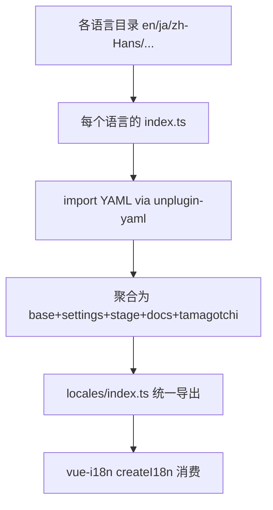
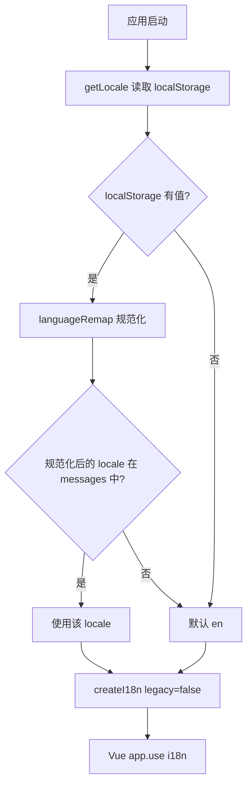
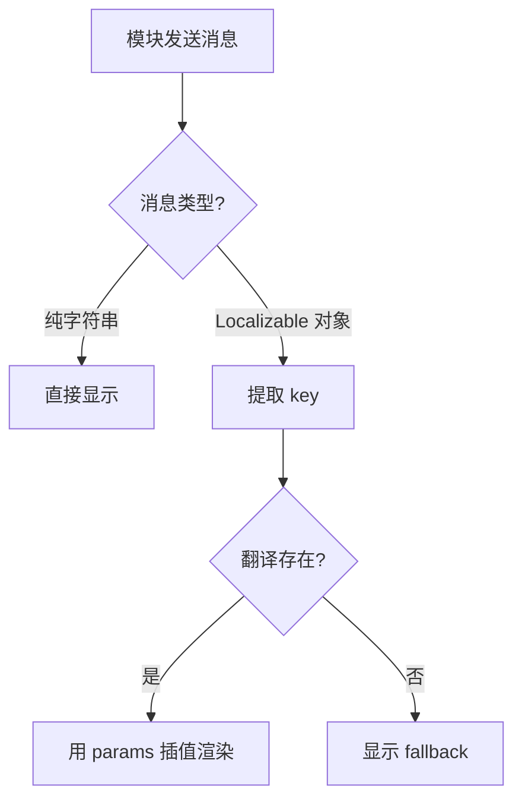

# PD-458.01 AIRI — Monorepo 独立 i18n 包 + YAML 翻译源 + Crowdin 自动同步

> 文档编号：PD-458.01
> 来源：AIRI `packages/i18n/`, `packages/plugin-protocol/src/types/events.ts`
> GitHub：https://github.com/moeru-ai/airi.git
> 问题域：PD-458 国际化 i18n & Localization
> 状态：可复用方案

---

## 第 1 章 问题与动机

### 1.1 核心问题

多平台 AI 应用（Web、桌面 Electron/Tamagotchi、文档站）需要统一的国际化方案。翻译文件分散在各个应用中会导致：
- 同一个 key 在不同应用中翻译不一致
- 新增语言时需要在多个仓库/目录中重复操作
- 社区贡献者难以找到翻译入口
- 翻译键与 UI 组件耦合，难以独立维护

AIRI 作为一个 monorepo 项目，包含 stage-web（Web 端）、stage-tamagotchi（Electron 桌面端）、stage-pocket（移动端）、docs 文档站等多个前端应用，全部基于 Vue 3，需要一套统一的 i18n 方案。

### 1.2 AIRI 的解法概述

1. **独立 i18n 包**：`@proj-airi/i18n` 作为 monorepo 中的独立包，集中管理所有翻译资源（`packages/i18n/src/locales/index.ts:1-21`）
2. **YAML 作为翻译源格式**：翻译内容使用 YAML 文件而非 JSON/TS，通过 `unplugin-yaml` 在构建时转换（`packages/i18n/tsdown.config.ts:1-19`）
3. **按功能域分层**：每个语言目录下按 `base`/`settings`/`stage`/`docs`/`tamagotchi` 分模块组织（`packages/i18n/src/locales/en/index.ts:1-13`）
4. **Crowdin 自动化同步**：GitHub Actions 定时拉取 Crowdin 翻译，自动创建 PR（`.github/workflows/crowdin-cron-sync.yml:1-30`）
5. **Localizable 类型协议**：`plugin-protocol` 定义 `Localizable` 联合类型，支持 key+fallback+params 的本地化消息传递（`packages/plugin-protocol/src/types/events.ts:161-177`）

### 1.3 设计思想

| 设计原则 | 具体实现 | 理由 | 替代方案 |
|----------|----------|------|----------|
| 翻译源与消费者分离 | 独立 `@proj-airi/i18n` 包，各应用通过 import 消费 | 避免翻译文件散落在各应用中，单一真相源 | 每个应用维护自己的翻译文件 |
| YAML 优于 JSON | 翻译文件用 `.yaml` 格式，支持多行字符串和注释 | YAML 对长文本（如 prompt）更友好，Crowdin 原生支持 | JSON 文件（无注释、多行不友好） |
| 按功能域分层 | `base`/`settings`/`stage`/`docs`/`tamagotchi` 子目录 | 不同应用只加载需要的翻译子集，减少包体积 | 单一扁平文件（所有翻译混在一起） |
| 语言代码规范化 | `languageRemap` 映射表将浏览器 locale 映射到内部 locale | 浏览器返回 `zh-CN`/`zh-TW` 等变体，需统一到 `zh-Hans` | 直接使用浏览器 locale（不可控） |
| 协议层本地化 | `Localizable` 类型 = `string \| { key, fallback, params }` | 模块间通信的消息也需要本地化，不能只在 UI 层做 | 只在 Vue 组件中做 i18n |

---

## 第 2 章 源码实现分析

### 2.1 架构概览

AIRI 的 i18n 架构分为三层：翻译源层、构建层、消费层。

```
┌─────────────────────────────────────────────────────────────┐
│                    Crowdin 翻译平台                          │
│  (社区翻译者在此协作，支持 9 种语言)                          │
└──────────────┬──────────────────────────────┬───────────────┘
               │ cron-sync (每日)              │ manual-upload
               ▼                              ▲
┌──────────────────────────────────────────────────────────────┐
│  packages/i18n/src/locales/                                  │
│  ├── en/          (源语言，开发者直接编辑)                     │
│  │   ├── base.yaml        ← prompt 模板 + 通用文案           │
│  │   ├── settings.yaml    ← 设置页 ~800 行翻译键             │
│  │   ├── stage.yaml       ← 舞台 UI 文案                    │
│  │   ├── docs/            ← 文档站翻译                       │
│  │   └── tamagotchi/      ← 桌面端专属翻译                   │
│  ├── zh-Hans/  ├── ja/  ├── ko/  ├── es/                    │
│  ├── zh-Hant/  ├── fr/  ├── ru/  └── vi/                    │
│  └── index.ts  (聚合所有语言导出)                             │
└──────────────┬───────────────────────────────────────────────┘
               │ tsdown + unplugin-yaml 构建
               ▼
┌──────────────────────────────────────────────────────────────┐
│  @proj-airi/i18n (npm 包)                                    │
│  exports: { ".", "./locales", "./locales/en", ... }          │
└──────┬───────────┬──────────────┬────────────────────────────┘
       │           │              │
       ▼           ▼              ▼
  stage-web   stage-tamagotchi  stage-pocket
  (vue-i18n)   (vue-i18n)      (vue-i18n)
```

### 2.2 核心实现

#### 2.2.1 翻译源聚合与语言注册



对应源码 `packages/i18n/src/locales/index.ts:1-21`：
```typescript
import en from './en'
import es from './es'
import fr from './fr'
import ja from './ja'
import ko from './ko'
import ru from './ru'
import vi from './vi'
import zhHans from './zh-Hans'
import zhHant from './zh-Hant'

export default {
  en,
  es,
  fr,
  ko,
  ja,
  ru,
  vi,
  'zh-Hans': zhHans,
  'zh-Hant': zhHant,
}
```

每个语言内部的聚合结构一致，以 `packages/i18n/src/locales/en/index.ts:1-13` 为例：
```typescript
import base from './base.yaml'
import docs from './docs'
import settings from './settings.yaml'
import stage from './stage.yaml'
import tamagotchi from './tamagotchi'

export default {
  base,
  docs,
  settings,
  stage,
  tamagotchi,
}
```

#### 2.2.2 vue-i18n 集成与语言切换



对应源码 `packages/stage-ui/stories/modules/i18n.ts:1-43`：
```typescript
import messages from '@proj-airi/i18n/locales'
import { createI18n } from 'vue-i18n'

const languageRemap: Record<string, string> = {
  'zh-CN': 'zh-Hans',
  'zh-TW': 'zh-Hans', // TODO: remove this when zh-Hant is supported
  'zh-HK': 'zh-Hans',
  'zh-Hant': 'zh-Hans',
  'en-US': 'en',
  'en-GB': 'en',
  'en-AU': 'en',
  'en': 'en',
  'es-ES': 'es',
  'es-MX': 'es',
  'es-AR': 'es',
  'es': 'es',
  'ru': 'ru',
  'ru-RU': 'ru',
  'fr': 'fr',
  'fr-FR': 'fr',
}

function getLocale() {
  let language = localStorage.getItem('settings/language')
  const languages = Object.keys(messages!)
  if (languageRemap[language || 'en'] != null) {
    language = languageRemap[language || 'en']
  }
  if (language && languages.includes(language))
    return language
  return 'en'
}

export const i18n = createI18n({
  legacy: false,
  locale: getLocale(),
  fallbackLocale: 'en',
  messages,
})
```

关键设计点：
- `legacy: false` 启用 Composition API 模式，配合 Vue 3 的 `useI18n()`
- `fallbackLocale: 'en'` 确保缺失翻译时回退到英文
- `languageRemap` 将浏览器的 BCP 47 变体（`zh-CN`、`en-US`）映射到项目内部的简化 locale 标识

#### 2.2.3 Localizable 协议类型



对应源码 `packages/plugin-protocol/src/types/events.ts:161-177`：
```typescript
export type Localizable
  = | string
    | {
      /**
       * Localization key owned by the module.
       * Example: "config.deprecated.model_driver.legacy"
       */
      key: string
      /**
       * Fallback display string when translation is unavailable.
       */
      fallback?: string
      /**
       * Params for string interpolation.
       */
      params?: Record<string, string | number | boolean>
    }
```

`Localizable` 在协议层被广泛使用：
- `ModuleConfigNotice.message`（`events.ts:187`）— 配置通知消息
- `ModuleConfigStep.message`（`events.ts:213`）— 配置步骤提示
- `ModuleConfigValidation.invalid[].reason`（`events.ts:276`）— 校验错误原因
- `ModuleCapability.description`（`events.ts:335`）— 能力描述

### 2.3 实现细节

#### YAML 构建管道

`packages/i18n/tsdown.config.ts:1-19` 使用 `unplugin-yaml` 将 YAML 文件在构建时转换为 JS 对象：

```typescript
import Yaml from 'unplugin-yaml/rolldown'
import { defineConfig } from 'tsdown'

export default defineConfig({
  entry: {
    'index': 'src/index.ts',
    'locales/index': 'src/locales/index.ts',
    'locales/en/index': 'src/locales/en/index.ts',
    'locales/zh-Hans/index': 'src/locales/zh-Hans/index.ts',
  },
  copy: [
    { from: 'src/locales', to: 'dist/locales' },
  ],
  unbundle: true,
  plugins: [
    Yaml(),
  ],
})
```

`copy` 配置将原始 YAML 文件也复制到 dist，使得 Crowdin 可以直接操作源文件。

#### Crowdin 双向同步

`crowdin.yml:1-9` 定义了翻译文件映射：

```yaml
project_id: "816610"
api_token_env: CROWDIN_PERSONAL_TOKEN
preserve_hierarchy: true

files:
  - source: packages/i18n/src/locales/en/**/*
    ignore:
      - '**/*.ts'
    translation: /packages/i18n/src/locales/%locale%/**/%original_file_name%
```

- `source` 指向英文源文件（YAML only，忽略 `.ts`）
- `translation` 模板使用 `%locale%` 占位符，Crowdin 自动替换为目标语言代码
- `preserve_hierarchy: true` 保持目录结构一致

#### 组件层消费模式

`packages/stage-pages/src/components/settings-general-fields.vue:1-16` 展示了典型的消费模式：

```vue
<script setup lang="ts">
import { all } from '@proj-airi/i18n'
import { useI18n } from 'vue-i18n'

const { t } = useI18n()

const languages = computed(() => {
  return Object.entries(all).map(([value, label]) => ({ value, label }))
})
</script>

<template>
  <FieldSelect
    v-model="settings.language"
    :label="t('settings.language.title')"
    :description="t('settings.language.description')"
    :options="languages"
  />
</template>
```

`all` 导出（`packages/i18n/src/index.ts:1-10`）提供语言名称映射，用于语言选择器的下拉选项。

---

## 第 3 章 迁移指南

### 3.1 迁移清单

**阶段 1：基础设施搭建**
- [ ] 在 monorepo 中创建独立 i18n 包（如 `packages/i18n`）
- [ ] 安装依赖：`vue-i18n`、`unplugin-yaml`、构建工具（tsdown/tsup/vite）
- [ ] 配置 YAML 插件到构建管道
- [ ] 定义 `package.json` 的 `exports` 字段，支持按语言/模块子路径导入

**阶段 2：翻译文件组织**
- [ ] 创建英文源文件目录结构：`src/locales/en/`
- [ ] 按功能域拆分 YAML 文件（如 `base.yaml`、`settings.yaml`）
- [ ] 编写各语言的 `index.ts` 聚合文件
- [ ] 编写顶层 `locales/index.ts` 注册所有语言

**阶段 3：应用集成**
- [ ] 在各应用中创建 `i18n.ts` 模块，初始化 `createI18n`
- [ ] 实现 `languageRemap` 映射表
- [ ] 实现 `getLocale()` 从 localStorage 读取用户偏好
- [ ] 在 Vue 组件中使用 `useI18n()` + `t()` 替换硬编码文案

**阶段 4：协作翻译**
- [ ] 注册 Crowdin 项目，配置 `crowdin.yml`
- [ ] 设置 GitHub Actions 定时同步工作流
- [ ] 设置手动上传工作流（用于推送本地翻译到 Crowdin）

### 3.2 适配代码模板

#### i18n 包 package.json

```json
{
  "name": "@your-project/i18n",
  "type": "module",
  "exports": {
    ".": {
      "types": "./dist/index.d.mts",
      "default": "./dist/index.mjs"
    },
    "./locales": {
      "types": "./dist/locales/index.d.mts",
      "default": "./dist/locales/index.mjs"
    }
  },
  "scripts": {
    "build": "tsdown"
  },
  "devDependencies": {
    "unplugin-yaml": "^4.0.0",
    "tsdown": "latest"
  }
}
```

#### tsdown 构建配置

```typescript
// tsdown.config.ts
import Yaml from 'unplugin-yaml/rolldown'
import { defineConfig } from 'tsdown'

export default defineConfig({
  entry: {
    'index': 'src/index.ts',
    'locales/index': 'src/locales/index.ts',
  },
  copy: [
    { from: 'src/locales', to: 'dist/locales' },
  ],
  unbundle: true,
  plugins: [Yaml()],
})
```

#### 语言注册入口

```typescript
// src/locales/index.ts
import en from './en'
import ja from './ja'
import zhHans from './zh-Hans'

export default {
  en,
  ja,
  'zh-Hans': zhHans,
}
```

#### 应用侧 vue-i18n 初始化

```typescript
// modules/i18n.ts
import messages from '@your-project/i18n/locales'
import { createI18n } from 'vue-i18n'

const languageRemap: Record<string, string> = {
  'zh-CN': 'zh-Hans',
  'zh-TW': 'zh-Hant',
  'en-US': 'en',
  'en-GB': 'en',
}

function getLocale(): string {
  let lang = localStorage.getItem('settings/language')
  const available = Object.keys(messages)
  if (lang && languageRemap[lang]) lang = languageRemap[lang]
  return lang && available.includes(lang) ? lang : 'en'
}

export const i18n = createI18n({
  legacy: false,
  locale: getLocale(),
  fallbackLocale: 'en',
  messages,
})
```

#### Localizable 协议类型

```typescript
// types/localizable.ts
export type Localizable =
  | string
  | {
      key: string
      fallback?: string
      params?: Record<string, string | number | boolean>
    }

// 解析工具函数
export function resolveLocalizable(
  value: Localizable,
  t: (key: string, params?: Record<string, unknown>) => string
): string {
  if (typeof value === 'string') return value
  const translated = t(value.key, value.params)
  return translated !== value.key ? translated : (value.fallback ?? value.key)
}
```

#### Crowdin 配置

```yaml
# crowdin.yml
project_id: "YOUR_PROJECT_ID"
api_token_env: CROWDIN_PERSONAL_TOKEN
preserve_hierarchy: true

files:
  - source: packages/i18n/src/locales/en/**/*
    ignore:
      - '**/*.ts'
    translation: /packages/i18n/src/locales/%locale%/**/%original_file_name%
```

#### GitHub Actions 同步工作流

```yaml
# .github/workflows/crowdin-sync.yml
name: Crowdin sync translations
on:
  schedule:
    - cron: '0 2 * * *'
  workflow_dispatch:
permissions:
  contents: write
  pull-requests: write
jobs:
  sync:
    runs-on: ubuntu-latest
    steps:
      - uses: actions/checkout@v4
      - uses: crowdin/github-action@v2
        with:
          upload_sources: true
          download_translations: true
          localization_branch_name: crowdin
          create_pull_request: true
          commit_message: 'chore(i18n): update translations'
          pull_request_title: 'chore(i18n): update translations'
          pull_request_base_branch_name: main
        env:
          GITHUB_TOKEN: ${{ secrets.GITHUB_TOKEN }}
          CROWDIN_PERSONAL_TOKEN: ${{ secrets.CROWDIN_PERSONAL_TOKEN }}
```

### 3.3 适用场景

| 场景 | 适用度 | 说明 |
|------|--------|------|
| Vue 3 monorepo 多应用共享翻译 | ⭐⭐⭐ | 完美匹配，直接复用 |
| 单应用 Vue 项目 | ⭐⭐ | 可简化为不需要独立包，直接在 src/locales 下组织 |
| React/Svelte 项目 | ⭐⭐ | YAML 翻译源 + Crowdin 流程可复用，vue-i18n 需替换为 react-i18next 等 |
| 需要运行时动态加载语言包 | ⭐ | AIRI 方案是构建时全量打包，不支持按需加载 |
| 模块间通信需要本地化消息 | ⭐⭐⭐ | Localizable 类型协议可直接复用 |
| 需要 Crowdin 社区协作翻译 | ⭐⭐⭐ | 完整的双向同步工作流可直接复用 |

---

## 第 4 章 测试用例

```typescript
import { describe, expect, it, vi } from 'vitest'

// 模拟 Localizable 类型
type Localizable =
  | string
  | { key: string; fallback?: string; params?: Record<string, string | number | boolean> }

function resolveLocalizable(
  value: Localizable,
  t: (key: string, params?: Record<string, unknown>) => string
): string {
  if (typeof value === 'string') return value
  const translated = t(value.key, value.params)
  return translated !== value.key ? translated : (value.fallback ?? value.key)
}

// 模拟 languageRemap
const languageRemap: Record<string, string> = {
  'zh-CN': 'zh-Hans',
  'zh-TW': 'zh-Hans',
  'en-US': 'en',
  'en-GB': 'en',
  'es-ES': 'es',
}

function normalizeLocale(browserLocale: string): string {
  return languageRemap[browserLocale] ?? browserLocale
}

const availableLocales = ['en', 'ja', 'zh-Hans', 'zh-Hant', 'es', 'fr', 'ru', 'vi', 'ko']

function getLocale(stored: string | null): string {
  if (!stored) return 'en'
  const normalized = normalizeLocale(stored)
  return availableLocales.includes(normalized) ? normalized : 'en'
}

describe('languageRemap normalization', () => {
  it('should map zh-CN to zh-Hans', () => {
    expect(normalizeLocale('zh-CN')).toBe('zh-Hans')
  })

  it('should map en-US to en', () => {
    expect(normalizeLocale('en-US')).toBe('en')
  })

  it('should pass through unmapped locales', () => {
    expect(normalizeLocale('ja')).toBe('ja')
  })

  it('should map zh-TW to zh-Hans (current AIRI behavior)', () => {
    expect(normalizeLocale('zh-TW')).toBe('zh-Hans')
  })
})

describe('getLocale', () => {
  it('should return en when no stored language', () => {
    expect(getLocale(null)).toBe('en')
  })

  it('should return stored language if available', () => {
    expect(getLocale('ja')).toBe('ja')
  })

  it('should normalize and return if available', () => {
    expect(getLocale('zh-CN')).toBe('zh-Hans')
  })

  it('should fallback to en for unknown locale', () => {
    expect(getLocale('xx-YY')).toBe('en')
  })
})

describe('resolveLocalizable', () => {
  const mockT = vi.fn((key: string, params?: Record<string, unknown>) => {
    const translations: Record<string, string> = {
      'config.deprecated': 'This config is deprecated',
      'error.validation': 'Validation failed for {field}',
    }
    let result = translations[key] ?? key
    if (params) {
      for (const [k, v] of Object.entries(params)) {
        result = result.replace(`{${k}}`, String(v))
      }
    }
    return result
  })

  it('should return string directly for plain string', () => {
    expect(resolveLocalizable('Hello', mockT)).toBe('Hello')
  })

  it('should resolve key when translation exists', () => {
    expect(resolveLocalizable({ key: 'config.deprecated' }, mockT)).toBe('This config is deprecated')
  })

  it('should use fallback when translation missing', () => {
    expect(resolveLocalizable({ key: 'missing.key', fallback: 'Default text' }, mockT)).toBe('Default text')
  })

  it('should return key when no translation and no fallback', () => {
    expect(resolveLocalizable({ key: 'missing.key' }, mockT)).toBe('missing.key')
  })

  it('should interpolate params', () => {
    expect(resolveLocalizable(
      { key: 'error.validation', params: { field: 'email' } },
      mockT
    )).toBe('Validation failed for email')
  })
})

describe('YAML locale structure', () => {
  it('should have consistent structure across languages', () => {
    // 验证每个语言的 index.ts 导出相同的顶层 key
    const expectedKeys = ['base', 'docs', 'settings', 'stage', 'tamagotchi']
    // 在实际测试中，import 各语言包并验证
    expect(expectedKeys).toEqual(['base', 'docs', 'settings', 'stage', 'tamagotchi'])
  })
})
```

---

## 第 5 章 跨域关联

| 关联域 | 关系类型 | 说明 |
|--------|----------|------|
| PD-462 模块生命周期协议 | 依赖 | `Localizable` 类型定义在 `plugin-protocol` 中，模块配置校验（`ModuleConfigValidation`）、配置通知（`ModuleConfigNotice`）、能力描述（`ModuleCapability`）都使用 `Localizable` 进行本地化消息传递 |
| PD-460 跨平台部署 | 协同 | i18n 包作为独立包被 stage-web（Web）、stage-tamagotchi（Electron）、stage-pocket（移动端）共同消费，统一翻译源是跨平台一致性的基础 |
| PD-442 配置管理 | 协同 | 语言偏好通过 `localStorage.getItem('settings/language')` 持久化，与应用设置系统集成 |
| PD-457 角色卡系统 | 协同 | `base.yaml` 中的 `prompt.prefix` 包含角色设定的本地化版本（如中文版 AIRI 人设），角色系统的多语言支持依赖 i18n 基础设施 |

---

## 第 6 章 来源文件索引

| 文件 | 行范围 | 关键实现 |
|------|--------|----------|
| `packages/i18n/src/locales/index.ts` | L1-L21 | 9 种语言注册与聚合导出 |
| `packages/i18n/src/locales/en/index.ts` | L1-L13 | 英文源语言的 5 模块聚合 |
| `packages/i18n/src/index.ts` | L1-L10 | 语言名称映射表导出（`all`） |
| `packages/i18n/package.json` | 全文 | 包配置、exports 子路径、构建脚本 |
| `packages/i18n/tsdown.config.ts` | L1-L19 | YAML 插件 + 构建入口 + 文件复制 |
| `packages/plugin-protocol/src/types/events.ts` | L161-L177 | `Localizable` 联合类型定义 |
| `packages/plugin-protocol/src/types/events.ts` | L179-L218 | `ModuleConfigNotice`/`ModuleConfigStep` 使用 Localizable |
| `packages/stage-ui/stories/modules/i18n.ts` | L1-L43 | stage-web 的 vue-i18n 初始化 + languageRemap |
| `apps/stage-tamagotchi/src/renderer/modules/i18n.ts` | L1-L43 | tamagotchi 的 vue-i18n 初始化（含 vi 语言） |
| `packages/stage-pages/src/components/settings-general-fields.vue` | L1-L16 | 语言选择器组件（消费 `all` + `useI18n`） |
| `crowdin.yml` | L1-L9 | Crowdin 项目配置 + 文件映射 |
| `.github/workflows/crowdin-cron-sync.yml` | L1-L30 | 每日定时同步翻译 + 自动创建 PR |
| `.github/workflows/crowdin-manual-upload.yml` | L1-L25 | 手动推送本地翻译到 Crowdin |
| `packages/i18n/src/locales/en/base.yaml` | L1-L59 | 基础翻译（含 AI 角色 prompt 模板） |
| `packages/i18n/src/locales/en/settings.yaml` | L1-L800+ | 设置页翻译键（最大的翻译文件） |
| `packages/i18n/src/locales/en/stage.yaml` | L1-L34 | 舞台 UI 翻译 |
| `packages/i18n/src/locales/en/docs/theme.yaml` | L1-L51 | 文档站主题翻译 |
| `packages/i18n/src/locales/en/tamagotchi/settings.yaml` | L1-L56 | 桌面端设置翻译 |

---

## 第 7 章 横向对比维度

```json comparison_data
{
  "project": "AIRI",
  "dimensions": {
    "翻译源格式": "YAML 文件，unplugin-yaml 构建时转换，支持多行字符串和注释",
    "翻译键组织": "按功能域分层（base/settings/stage/docs/tamagotchi），每语言 5 模块聚合",
    "语言切换": "localStorage 持久化 + languageRemap 规范化浏览器 locale 变体",
    "协作翻译": "Crowdin 双向同步：每日 cron 拉取 + 手动 dispatch 推送，自动创建 PR",
    "协议层本地化": "Localizable 联合类型（string | {key,fallback,params}），模块间通信消息可本地化",
    "框架集成": "vue-i18n Composition API（legacy:false），各应用独立初始化共享翻译源",
    "语言覆盖": "9 种语言（en/ja/ko/zh-Hans/zh-Hant/es/fr/ru/vi），monorepo 独立包统一管理"
  }
}
```

### 域元数据补充

```json domain_metadata
{
  "solution_summary": "AIRI 用独立 @proj-airi/i18n 包 + YAML 翻译源 + unplugin-yaml 构建管道 + Crowdin 每日 cron 双向同步，支持 9 种语言的 monorepo 多应用共享翻译",
  "description": "monorepo 多应用共享翻译源的包级隔离与构建管道设计",
  "sub_problems": [
    "浏览器 locale 变体到内部 locale 标识的规范化映射",
    "协议层消息的本地化类型设计（Localizable 联合类型）",
    "AI 角色 prompt 模板的多语言维护"
  ],
  "best_practices": [
    "YAML 作为翻译源格式优于 JSON，支持多行字符串和注释",
    "Crowdin 双向同步用两个独立 workflow 分离拉取和推送避免冲突",
    "languageRemap 映射表统一处理浏览器 BCP 47 locale 变体"
  ]
}
```
