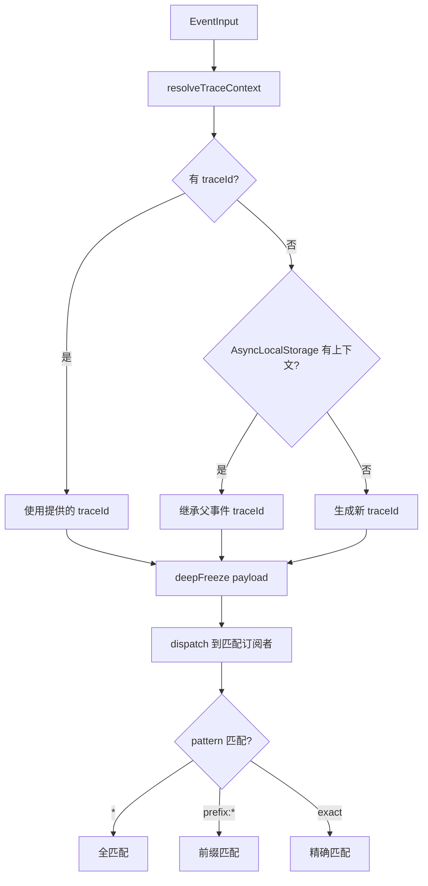
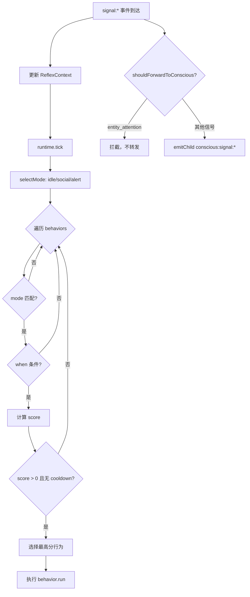

# PD-459.01 AIRI — 三层仿生认知架构

> 文档编号：PD-459.01
> 来源：AIRI `services/minecraft/src/cognitive/`
> GitHub：https://github.com/moeru-ai/airi.git
> 问题域：PD-459 认知架构 Cognitive Architecture
> 状态：可复用方案

---

## 第 1 章 问题与动机

### 1.1 核心问题

游戏 Agent（如 Minecraft Bot）需要在实时环境中同时处理大量异构事件：玩家聊天、实体移动、环境变化、威胁出现等。如果所有事件都直接送入 LLM 决策，会导致：

1. **延迟不可控** — LLM 推理耗时 1-5 秒，无法满足即时反应需求（如躲避攻击、注视玩家）
2. **成本爆炸** — 每个 tick 产生数十个原始事件，全部送 LLM 会导致 token 消耗失控
3. **行为僵硬** — 纯 LLM 驱动的 Agent 在等待响应时完全静止，缺乏"活物感"
4. **上下文污染** — 低级事件（实体移动）淹没高级信号（玩家对话），LLM 无法聚焦

核心挑战：如何让 Agent 既有即时反应能力，又有深度思考能力，同时控制 LLM 调用成本？

### 1.2 AIRI 的解法概述

AIRI 实现了一个三层仿生认知架构，灵感来自神经科学的感知-反射-意识模型：

1. **感知层 PerceptionPipeline** — 将 Mineflayer 原始事件转为标准化信号（`pipeline.ts:9-50`），通过 YAML 规则引擎聚合和过滤（`engine.ts:41-282`）
2. **反射层 ReflexManager** — 订阅信号后执行即时行为（注视、跟随），无需 LLM 参与（`reflex-manager.ts:13-187`）
3. **意识层 Brain** — 仅接收经反射层过滤的高级信号，通过 LLM 进行深度决策（`brain.ts:254-2326`）
4. **EventBus 解耦** — 三层通过事件总线通信，支持 trace 追踪和模式匹配订阅（`event-bus.ts:106-175`）
5. **DI 容器** — Awilix 管理所有服务的单例生命周期（`container.ts:29-92`）

### 1.3 设计思想

| 设计原则 | 具体实现 | 理由 | 替代方案 |
|----------|----------|------|----------|
| 仿生分层 | Perception → Reflex → Conscious 三层 | 模拟人类神经系统：脊髓反射不经大脑 | 单层 LLM 全权决策 |
| 信号过滤 | ReflexManager 拦截 entity_attention，不转发给 Brain | 减少 LLM 输入噪声，降低 token 成本 | 全部信号送 LLM，靠 prompt 过滤 |
| 规则引擎 | YAML 定义感知规则 + 时间窗口累加器 | 配置化，非开发者可调整感知灵敏度 | 硬编码 if-else 判断 |
| 行为评分 | when() + score() + cooldown 三阶段选择 | 避免行为抖动，支持优先级竞争 | 简单 if-else 优先级链 |
| 事件溯源 | EventBus 所有事件带 traceId/parentId | 支持调试时追踪信号来源链路 | 无追踪的简单 pub/sub |
| 上下文边界 | Brain 的 enterContext/exitContext 管理对话窗口 | 防止 O(turns²) 内存增长 | 固定长度滑动窗口 |

---

## 第 2 章 源码实现分析

### 2.1 架构概览

AIRI 的认知引擎是一个 Mineflayer 插件，通过 DI 容器组装三层服务：

```
┌─────────────────────────────────────────────────────────────┐
│                    CognitiveEngine Plugin                     │
│                     (index.ts:9-178)                          │
├─────────────────────────────────────────────────────────────┤
│                                                               │
│  ┌──────────────┐    ┌──────────────┐    ┌──────────────┐   │
│  │  Perception   │    │    Reflex     │    │    Brain      │   │
│  │  Pipeline     │    │   Manager     │    │  (Conscious)  │   │
│  │              │    │              │    │              │   │
│  │ EventRegistry │    │ ReflexRuntime │    │  LLM Agent   │   │
│  │ RuleEngine   │    │ Behaviors    │    │  REPL Planner │   │
│  │ YAML Rules   │    │ Context      │    │  ActionQueue  │   │
│  └──────┬───────┘    └──────┬───────┘    └──────┬───────┘   │
│         │                   │                   │           │
│         │  raw:*            │  signal:*         │           │
│         ▼                   ▼                   ▼           │
│  ┌─────────────────────────────────────────────────────┐    │
│  │              EventBus (event-bus.ts)                  │    │
│  │  Pattern matching · Trace context · Deep freeze      │    │
│  └─────────────────────────────────────────────────────┘    │
│                                                               │
│  ┌─────────────────────────────────────────────────────┐    │
│  │           Awilix DI Container (container.ts)          │    │
│  │  Singleton lifecycle · Lazy resolution · Strict mode  │    │
│  └─────────────────────────────────────────────────────┘    │
└─────────────────────────────────────────────────────────────┘
```

数据流：
```
Mineflayer Bot Events
  → PerceptionPipeline (raw:{modality}:{kind})
    → RuleEngine (YAML 规则 + 累加器)
      → signal:{type}
        → ReflexManager (行为选择 + 即时执行)
          → conscious:signal:{type} (过滤后转发)
            → Brain (LLM 决策 + REPL 执行)
```

### 2.2 核心实现

#### 2.2.1 EventBus — 带追踪的事件总线



对应源码 `services/minecraft/src/cognitive/event-bus.ts:106-171`：
```typescript
export class EventBus {
  private readonly subscriptions = new Map<number, Subscription>()
  private nextSubId = 0

  public emit<T>(input: EventInput<T>): TracedEvent<T> {
    const trace = resolveTraceContext({
      traceId: input.traceId,
      parentId: input.parentId,
    })
    const event = deepFreeze({
      id: generateEventId(),
      traceId: trace.traceId,
      parentId: trace.parentId,
      type: input.type,
      payload: input.payload,
      timestamp: Date.now(),
      source: input.source,
    } satisfies TracedEvent<T>)
    this.dispatch(event)
    return event
  }

  private dispatch(event: TracedEvent): void {
    for (const sub of this.subscriptions.values()) {
      if (!matchesPattern(sub.pattern, event.type))
        continue
      try {
        withTraceContext(event.traceId, event.id, () => {
          sub.handler(event)
        })
      }
      catch {
        // 隔离订阅者失败，保持 dispatch 弹性
      }
    }
  }
}
```

关键设计：
- **不可变事件** — `deepFreeze` 递归冻结所有 payload，防止下游修改（`event-bus.ts:67-81`）
- **AsyncLocalStorage 追踪** — 子事件自动继承父事件的 traceId（`event-bus.ts:83-104`）
- **故障隔离** — 单个订阅者抛异常不影响其他订阅者（`event-bus.ts:166-168`）

#### 2.2.2 RuleEngine — YAML 驱动的感知规则

```mermaid
graph TD
    A[raw:* 事件到达] --> B{遍历所有规则}
    B --> C{TypeScript 规则?}
    C -->|是| D[调用 rule.process]
    C -->|否| E{eventType 匹配?}
    E -->|否| F[跳过]
    E -->|是| G{where 条件匹配?}
    G -->|否| F
    G -->|是| H[processAccumulator]
    H --> I{累加器触发?}
    I -->|否| J[更新累加器状态]
    I -->|是| K[renderTemplate 生成描述]
    K --> L[emitChild signal:{type}]
    D --> M{result.fired?}
    M -->|是| N[emitChild signal]
    M -->|否| J
```

对应源码 `services/minecraft/src/cognitive/perception/rules/engine.ts:133-194`：
```typescript
private processEvent(event: TracedEvent): void {
  const nowMs = Date.now()
  const slotMs = this.deps.config.slotMs ?? DEFAULT_SLOT_MS
  for (const rule of this.rules) {
    try {
      if (isTypeScriptRule(rule)) {
        this.processTypeScriptRule(rule, event, nowMs)
      } else {
        this.processYamlRule(rule, event, nowMs, slotMs)
      }
    } catch (err) {
      this.deps.logger
        .withError(err as Error)
        .withFields({ ruleName: rule.name })
        .error('RuleEngine: rule processing failed')
    }
  }
}

private processYamlRule(rule: ParsedRule, event: TracedEvent, nowMs: number, slotMs: number): void {
  if (!matchEventType(rule.trigger.eventType, event.type)) return
  if (!matchWhere(rule.trigger.where, event.payload)) return
  let accState = this.accumulators[rule.name]
  if (!accState) {
    const windowSlots = calculateWindowSlots(rule.accumulator.windowMs, slotMs)
    accState = createAccumulatorState(windowSlots)
  }
  const [fired, newAccState] = processAccumulator(accState, rule.accumulator.threshold, nowMs, slotMs)
  this.accumulators = Object.freeze({ ...this.accumulators, [rule.name]: newAccState })
  if (fired) this.emitSignal(rule, event)
}
```

关键设计：
- **双轨规则** — YAML 规则处理简单模式匹配，TypeScript 规则处理复杂逻辑（`engine.ts:91-101`）
- **时间窗口累加器** — 基于 slot 的滑动窗口，防止单个事件误触发（`engine.ts:174-188`）
- **不可变状态更新** — 每次处理都 `Object.freeze` 新状态（`engine.ts:185-188`）

#### 2.2.3 ReflexManager — 信号过滤与行为选择



对应源码 `services/minecraft/src/cognitive/reflex/reflex-manager.ts:116-178`：
```typescript
private onSignal(event: TracedEvent<PerceptionSignal>): void {
  const bot = this.bot
  if (!bot) return
  const signal = event.payload
  const now = Date.now()

  // 更新上下文
  this.runtime.getContext().updateNow(now)
  this.runtime.getContext().updateAttention({
    lastSignalType: signal.type,
    lastSignalSourceId: signal.sourceId ?? null,
    lastSignalAt: now,
  })
  if (signal.type === 'chat_message') {
    this.runtime.getContext().updateSocial({
      lastSpeaker: username,
      lastMessage: message,
      lastMessageAt: now,
    })
  }

  // 行为选择
  this.runtime.tick(bot, 0)

  // 信号过滤：entity_attention 不转发给意识层
  if (this.shouldForwardToConscious(signal)) {
    this.deps.eventBus.emitChild(event, {
      type: `conscious:signal:${signal.type}`,
      payload: signal,
      source: { component: 'reflex', id: 'reflexManager' },
    })
  }
}

private shouldForwardToConscious(signal: PerceptionSignal): boolean {
  return signal.type !== 'entity_attention'
}
```

### 2.3 实现细节

#### 模式选择（modes.ts:5-13）

```typescript
export function selectMode(ctx: ReflexContextState): ReflexModeId {
  if (ctx.threat.threatScore > 0) return 'alert'
  if (ctx.social.lastMessageAt && ctx.now - ctx.social.lastMessageAt < 15_000) return 'social'
  return 'idle'
}
```

三种自动模式 + 两种外部模式（work/wander 由 Brain 通过 TaskExecutor 设置）。

#### 事件优先级调度（brain.ts:222-252）

Brain 内部实现了优先级队列合并：
- **Priority 0** — 玩家聊天（最高优先级）
- **Priority 1** — 感知信号
- **Priority 2** — 反馈事件
- **Priority 3** — 无动作跟进

当玩家聊天等待时，自动丢弃低优先级的 no-action follow-up 事件（`brain.ts:1677-1720`）。

#### 上下文边界管理（brain.ts:521-705）

Brain 实现了 `enterContext`/`exitContext` 机制：
- 活跃上下文超过 30 条消息时自动裁剪一半（`MAX_ACTIVE_CONTEXT_MESSAGES = 30`）
- 归档上下文超过 10 个时折叠最旧的（`MAX_CONTEXT_SUMMARIES_IN_PREFIX = 10`）
- 对话历史硬上限 200 条（`MAX_CONVERSATION_HISTORY_MESSAGES = 200`）

#### 错误爆发防护（brain.ts:1029-1138）

当最近 5 个 turn 中有 3 个以上包含错误时，触发 Error Burst Guard：
- 强制 LLM 执行 `giveUp()` + `chat()` 组合
- 防止 Agent 陷入无限错误循环

---

## 第 3 章 迁移指南

### 3.1 迁移清单

**阶段 1：基础设施（EventBus + DI）**
- [ ] 实现带 traceId 的 EventBus（可直接复用 `event-bus.ts`，约 175 行）
- [ ] 选择 DI 框架（Awilix / tsyringe / 手动工厂）
- [ ] 定义 `TracedEvent<T>` 和 `EventInput<T>` 类型

**阶段 2：感知层**
- [ ] 定义 `PerceptionSignal` 类型（7 种信号类型）
- [ ] 实现 EventRegistry 适配你的事件源（替换 Mineflayer 为你的平台）
- [ ] 编写 YAML 规则或 TypeScript 规则
- [ ] 实现时间窗口累加器（防抖/聚合）

**阶段 3：反射层**
- [ ] 定义 `ReflexBehavior` 接口（id, modes, when, score, run）
- [ ] 实现 `ReflexRuntime`（行为选择循环）
- [ ] 实现 `ReflexContext`（状态快照）
- [ ] 定义模式选择函数 `selectMode`
- [ ] 实现信号过滤逻辑（哪些信号转发给意识层）

**阶段 4：意识层**
- [ ] 实现 Brain 事件队列 + 优先级合并
- [ ] 集成 LLM Agent（支持重试 + 速率限制退避）
- [ ] 实现上下文边界管理（enterContext/exitContext）
- [ ] 实现 REPL 执行器（将 LLM 输出作为代码执行）
- [ ] 实现错误爆发防护

### 3.2 适配代码模板

以下是一个可直接运行的三层认知架构骨架（TypeScript）：

```typescript
// === EventBus（直接复用 AIRI 实现） ===
import { AsyncLocalStorage } from 'node:async_hooks'
import { nanoid } from 'nanoid'

interface TracedEvent<T = unknown> {
  readonly id: string
  readonly traceId: string
  readonly parentId?: string
  readonly type: string
  readonly payload: Readonly<T>
  readonly timestamp: number
}

class EventBus {
  private subs = new Map<number, { pattern: string; handler: (e: TracedEvent) => void }>()
  private nextId = 0

  emit<T>(type: string, payload: T, traceId?: string): TracedEvent<T> {
    const event = Object.freeze({
      id: nanoid(12),
      traceId: traceId ?? nanoid(16),
      type,
      payload: Object.freeze(payload) as Readonly<T>,
      timestamp: Date.now(),
    })
    for (const sub of this.subs.values()) {
      if (sub.pattern === '*' || type.startsWith(sub.pattern.replace(':*', ':')))
        try { sub.handler(event as TracedEvent) } catch {}
    }
    return event
  }

  subscribe(pattern: string, handler: (e: TracedEvent) => void): () => void {
    const id = this.nextId++
    this.subs.set(id, { pattern, handler })
    return () => this.subs.delete(id)
  }
}

// === 反射行为接口 ===
type ModeId = 'idle' | 'social' | 'alert' | 'work'

interface ReflexBehavior {
  id: string
  modes: ModeId[]
  cooldownMs?: number
  when: (ctx: ContextSnapshot) => boolean
  score: (ctx: ContextSnapshot) => number
  run: (api: ReflexApi) => Promise<void> | void
}

// === 反射运行时 ===
class ReflexRuntime {
  private behaviors: ReflexBehavior[] = []
  private cooldowns = new Map<string, number>()
  private mode: ModeId = 'idle'

  register(behavior: ReflexBehavior) { this.behaviors.push(behavior) }

  tick(ctx: ContextSnapshot, api: ReflexApi): string | null {
    let best: { b: ReflexBehavior; s: number } | null = null
    const now = Date.now()
    for (const b of this.behaviors) {
      if (!b.modes.includes(this.mode)) continue
      if (!b.when(ctx)) continue
      const s = b.score(ctx)
      if (s <= 0) continue
      const last = this.cooldowns.get(b.id) ?? 0
      if (b.cooldownMs && now - last < b.cooldownMs) continue
      if (!best || s > best.s) best = { b, s }
    }
    if (!best) return null
    this.cooldowns.set(best.b.id, now)
    best.b.run(api)
    return best.b.id
  }
}

// === 意识层骨架 ===
class Brain {
  private queue: Array<{ event: TracedEvent; resolve: () => void }> = []
  private processing = false

  constructor(
    private eventBus: EventBus,
    private llm: { call: (messages: any[]) => Promise<string> },
    private reflexRuntime: ReflexRuntime,
  ) {
    eventBus.subscribe('conscious:signal:*', (event) => {
      this.enqueue(event)
    })
  }

  private enqueue(event: TracedEvent) {
    this.queue.push({ event, resolve: () => {} })
    if (!this.processing) this.processQueue()
  }

  private async processQueue() {
    this.processing = true
    while (this.queue.length > 0) {
      // 优先级排序
      this.queue.sort((a, b) => this.priority(a.event) - this.priority(b.event))
      const item = this.queue.shift()!
      const response = await this.llm.call([
        { role: 'system', content: 'You are a game agent...' },
        { role: 'user', content: JSON.stringify(item.event.payload) },
      ])
      // 执行 LLM 决策...
      item.resolve()
    }
    this.processing = false
  }

  private priority(event: TracedEvent): number {
    if ((event.payload as any)?.type === 'chat_message') return 0
    return 1
  }
}
```

### 3.3 适用场景

| 场景 | 适用度 | 说明 |
|------|--------|------|
| 游戏 AI Agent（Minecraft/Roblox） | ⭐⭐⭐ | 完美匹配，AIRI 的原生场景 |
| 实时对话机器人 | ⭐⭐⭐ | 反射层处理快速回复，意识层处理深度对话 |
| IoT 设备控制 Agent | ⭐⭐ | 感知层适配传感器，反射层处理紧急响应 |
| 纯文本 Agent（无实时需求） | ⭐ | 过度设计，单层 LLM 即可 |
| 多模态 Agent（视觉+语音） | ⭐⭐⭐ | 感知层天然支持多模态信号聚合 |

---

## 第 4 章 测试用例

```typescript
import { describe, it, expect, vi, beforeEach } from 'vitest'

// === EventBus 测试 ===
describe('EventBus', () => {
  let bus: EventBus

  beforeEach(() => {
    bus = new EventBus()
  })

  it('should dispatch events to matching subscribers', () => {
    const handler = vi.fn()
    bus.subscribe('signal:chat_message', handler)
    bus.emit({ type: 'signal:chat_message', payload: { text: 'hello' }, source: { component: 'test' } })
    expect(handler).toHaveBeenCalledOnce()
    expect(handler.mock.calls[0][0].payload.text).toBe('hello')
  })

  it('should support wildcard pattern matching', () => {
    const handler = vi.fn()
    bus.subscribe('signal:*', handler)
    bus.emit({ type: 'signal:chat_message', payload: {}, source: { component: 'test' } })
    bus.emit({ type: 'signal:entity_attention', payload: {}, source: { component: 'test' } })
    bus.emit({ type: 'raw:sighted:moved', payload: {}, source: { component: 'test' } })
    expect(handler).toHaveBeenCalledTimes(2) // 只匹配 signal:* 前缀
  })

  it('should deep-freeze event payloads', () => {
    const handler = vi.fn()
    bus.subscribe('*', handler)
    bus.emit({ type: 'test', payload: { nested: { value: 1 } }, source: { component: 'test' } })
    const event = handler.mock.calls[0][0]
    expect(() => { (event.payload as any).nested.value = 2 }).toThrow()
  })

  it('should isolate subscriber failures', () => {
    const badHandler = vi.fn(() => { throw new Error('boom') })
    const goodHandler = vi.fn()
    bus.subscribe('*', badHandler)
    bus.subscribe('*', goodHandler)
    bus.emit({ type: 'test', payload: {}, source: { component: 'test' } })
    expect(goodHandler).toHaveBeenCalledOnce() // 不受 badHandler 影响
  })
})

// === ReflexRuntime 测试 ===
describe('ReflexRuntime', () => {
  it('should select highest-scoring behavior', () => {
    const runtime = new ReflexRuntime({ logger: mockLogger })
    runtime.registerBehavior({
      id: 'low', modes: ['idle'], when: () => true, score: () => 1, run: vi.fn(),
    })
    runtime.registerBehavior({
      id: 'high', modes: ['idle'], when: () => true, score: () => 10, run: vi.fn(),
    })
    const result = runtime.tick(mockBot, 0)
    expect(result).toBe('high')
  })

  it('should respect cooldown', () => {
    const runtime = new ReflexRuntime({ logger: mockLogger })
    const runFn = vi.fn()
    runtime.registerBehavior({
      id: 'gaze', modes: ['idle'], cooldownMs: 5000,
      when: () => true, score: () => 1, run: runFn,
    })
    runtime.tick(mockBot, 0) // 第一次执行
    runtime.tick(mockBot, 0) // cooldown 内，不执行
    expect(runFn).toHaveBeenCalledOnce()
  })

  it('should filter behaviors by mode', () => {
    const runtime = new ReflexRuntime({ logger: mockLogger })
    const idleRun = vi.fn()
    const alertRun = vi.fn()
    runtime.registerBehavior({
      id: 'idle-only', modes: ['idle'], when: () => true, score: () => 1, run: idleRun,
    })
    runtime.registerBehavior({
      id: 'alert-only', modes: ['alert'], when: () => true, score: () => 1, run: alertRun,
    })
    // 默认 idle 模式
    runtime.tick(mockBot, 0)
    expect(idleRun).toHaveBeenCalledOnce()
    expect(alertRun).not.toHaveBeenCalled()
  })
})

// === 信号过滤测试 ===
describe('ReflexManager signal filtering', () => {
  it('should forward chat_message to conscious layer', () => {
    const signal: PerceptionSignal = { type: 'chat_message', description: 'test', timestamp: Date.now(), metadata: {} }
    expect(shouldForwardToConscious(signal)).toBe(true)
  })

  it('should block entity_attention from conscious layer', () => {
    const signal: PerceptionSignal = { type: 'entity_attention', description: 'test', timestamp: Date.now(), metadata: {} }
    expect(shouldForwardToConscious(signal)).toBe(false)
  })
})

// === 模式选择测试 ===
describe('selectMode', () => {
  it('should return alert when threat exists', () => {
    const ctx = { ...defaultCtx, threat: { threatScore: 5, lastThreatAt: Date.now() } }
    expect(selectMode(ctx)).toBe('alert')
  })

  it('should return social when recent chat', () => {
    const ctx = { ...defaultCtx, social: { lastMessageAt: Date.now() - 5000 } }
    expect(selectMode(ctx)).toBe('social')
  })

  it('should return idle by default', () => {
    expect(selectMode(defaultCtx)).toBe('idle')
  })
})
```

---

## 第 5 章 跨域关联

| 关联域 | 关系类型 | 说明 |
|--------|----------|------|
| PD-01 上下文管理 | 依赖 | Brain 的 enterContext/exitContext + autoTrimActiveContext 是上下文窗口管理的具体实现 |
| PD-02 多 Agent 编排 | 协同 | 三层架构本质是单 Agent 内部的"多层编排"，Reflex 和 Brain 可视为两个协作 Agent |
| PD-03 容错与重试 | 依赖 | Brain 的 LLM 重试逻辑（3 次 + 指数退避）和 Error Burst Guard 是容错机制 |
| PD-04 工具系统 | 依赖 | Brain 通过 TaskExecutor 调用工具，ActionQueue 管理异步工具执行 |
| PD-10 中间件管道 | 协同 | 感知层的 RuleEngine 是一种规则中间件管道，信号依次经过匹配→累加→触发 |
| PD-11 可观测性 | 协同 | EventBus 的 traceId/parentId 支持全链路追踪，DebugService 提供实时状态广播 |

---

## 第 6 章 来源文件索引

| 文件 | 行范围 | 关键实现 |
|------|--------|----------|
| `services/minecraft/src/cognitive/index.ts` | L1-178 | CognitiveEngine 插件入口，三层初始化编排 |
| `services/minecraft/src/cognitive/event-bus.ts` | L1-176 | EventBus 实现：TracedEvent、模式匹配、deepFreeze、AsyncLocalStorage |
| `services/minecraft/src/cognitive/container.ts` | L1-93 | Awilix DI 容器，8 个单例服务注册 |
| `services/minecraft/src/cognitive/perception/pipeline.ts` | L1-50 | PerceptionPipeline：EventRegistry 封装，raw 事件发射 |
| `services/minecraft/src/cognitive/perception/rules/engine.ts` | L41-282 | RuleEngine：YAML/TS 双轨规则、累加器、信号发射 |
| `services/minecraft/src/cognitive/reflex/reflex-manager.ts` | L13-187 | ReflexManager：信号订阅、上下文更新、行为触发、信号过滤转发 |
| `services/minecraft/src/cognitive/reflex/runtime.ts` | L12-299 | ReflexRuntime：行为选择循环、cooldown、模式转换、自动跟随 |
| `services/minecraft/src/cognitive/reflex/modes.ts` | L1-13 | selectMode：threat→alert, chat→social, default→idle |
| `services/minecraft/src/cognitive/conscious/brain.ts` | L254-2326 | Brain 核心：事件队列、优先级合并、LLM 调用、REPL 执行、上下文边界、错误防护 |

---

## 第 7 章 横向对比维度

```json comparison_data
{
  "project": "AIRI",
  "dimensions": {
    "认知分层": "三层仿生架构：Perception→Reflex→Conscious，反射层无需LLM",
    "事件通信": "EventBus 带 traceId/parentId 追踪 + deepFreeze 不可变 + 模式匹配订阅",
    "信号过滤": "ReflexManager 拦截 entity_attention，仅转发高级信号给 Brain",
    "行为选择": "when()+score()+cooldown 三阶段竞争选择，支持 5 种模式",
    "规则引擎": "YAML 规则 + TypeScript 规则双轨，时间窗口累加器防抖",
    "上下文管理": "enterContext/exitContext 边界管理 + 自动裁剪 + 归档折叠",
    "错误防护": "Error Burst Guard：5 turn 内 3 错误触发强制 giveUp",
    "DI容器": "Awilix 单例注入，8 个服务 lazy 解析"
  }
}
```

### 域元数据补充

```json domain_metadata
{
  "solution_summary": "AIRI 用 Perception→Reflex→Brain 三层仿生架构，反射层通过 when/score/cooldown 行为选择实现无 LLM 即时反应，意识层通过优先级队列合并和上下文边界管理控制 LLM 调用成本",
  "description": "仿生认知分层如何在实时环境中平衡即时反应与深度推理的成本和延迟",
  "sub_problems": [
    "行为竞争选择与 cooldown 防抖",
    "LLM 调用的错误爆发防护",
    "上下文边界的自动裁剪与归档折叠",
    "事件不可变性与追踪链路保持"
  ],
  "best_practices": [
    "反射层拦截低级信号避免 LLM 上下文污染",
    "三阶段行为选择(when/score/cooldown)防止行为抖动",
    "deepFreeze 事件 payload 保证跨层数据不可变",
    "Error Burst Guard 防止 Agent 陷入无限错误循环"
  ]
}
```
