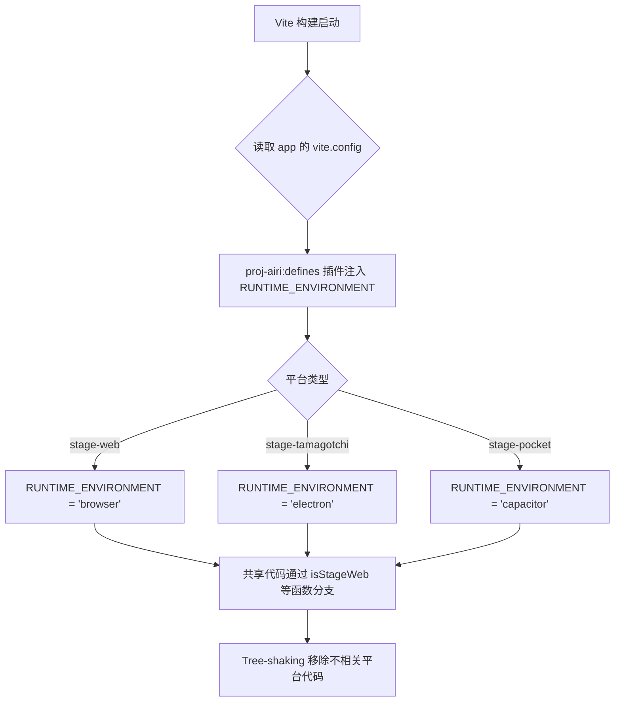
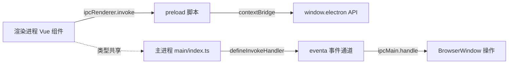

# PD-460.01 AIRI — pnpm Monorepo 四平台跨端部署

> 文档编号：PD-460.01
> 来源：AIRI `apps/stage-web` `apps/stage-tamagotchi` `apps/stage-pocket` `docs`
> GitHub：https://github.com/moeru-ai/airi.git
> 问题域：PD-460 跨平台部署 Cross-Platform Deployment
> 状态：可复用方案

---

## 第 1 章 问题与动机

### 1.1 核心问题

当一个 AI 虚拟角色应用需要同时覆盖 Web（PWA）、桌面（Electron）、移动端（Capacitor iOS/Android）和文档站（VitePress）四个平台时，核心挑战是：

1. **代码复用率**：四个平台共享 90%+ 的 Vue 组件、Pinia Store、Composable 逻辑，如何避免四份拷贝？
2. **平台差异隔离**：Electron 有 IPC/preload/main 进程，Capacitor 有原生桥接，Web 是纯浏览器——如何让共享代码不感知平台差异？
3. **构建工具统一**：四个 app 都基于 Vite，但 Electron 需要 `electron-vite`（main/preload/renderer 三入口），Capacitor 需要 `cap sync`，PWA 需要 `vite-plugin-pwa`——如何在同一 monorepo 中协调？
4. **大资产分发**：Live2D 模型、VRM 模型、WASM 文件动辄几十 MB，不同平台的资产加载路径不同（`file://` vs `https://`）。

### 1.2 AIRI 的解法概述

AIRI 采用 pnpm workspace monorepo 架构，通过五层抽象实现四平台统一：

1. **共享包层**：`stage-ui`（UI 组件 + Store）、`stage-shared`（环境检测 + 工具函数）、`stage-pages`（共享页面路由）、`stage-layouts`（共享布局）四个 workspace 包，被所有 app 通过 `workspace:^` 引用（`packages/stage-ui/package.json:1`）
2. **编译时环境注入**：通过 Vite `define` 插件在编译时注入 `RUNTIME_ENVIRONMENT`（`'electron'` / `'capacitor'` / `'browser'`），共享代码通过 `isStageWeb()` / `isStageTamagotchi()` / `isStageCapacitor()` 三个函数做平台分支（`packages/stage-shared/src/environment.ts:1-25`）
3. **Electron IPC 抽象**：独立的 `electron-eventa` 包封装 IPC 通信为类型安全的事件协议，preload 脚本通过 `contextBridge` 暴露 API（`packages/electron-eventa/src/electron/window.ts:1-27`）
4. **路由/布局共享**：`unplugin-vue-router` 和 `vite-plugin-vue-layouts` 配置多目录源，让 stage-web 和 stage-tamagotchi 共享 `stage-pages` 和 `stage-layouts` 的路由和布局（`apps/stage-web/vite.config.ts:104-117`）
5. **大资产外置**：Web 端通过 `WarpDrivePlugin` 将 WASM/TTF/VRM 等大文件上传到 S3 并重写 URL，Electron 端打包进 asar（`apps/stage-web/vite.config.ts:230-260`）

### 1.3 设计思想

| 设计原则 | 具体实现 | 理由 | 替代方案 |
|----------|----------|------|----------|
| 编译时平台分支 | `import.meta.env.RUNTIME_ENVIRONMENT` + `define` 插件 | 零运行时开销，Tree-shaking 可移除不相关平台代码 | 运行时 `navigator.userAgent` 检测（无法 tree-shake） |
| 共享包不构建 | `stage-ui` 的 build 脚本是 `echo "No build step required"`，直接源码引用 | 避免包间构建依赖链，Vite alias 直接解析到 `src/` | 预构建为 ESM（增加构建复杂度） |
| IPC 类型安全 | `@moeru/eventa` 的 `defineInvokeEventa` 定义类型化通道 | 主进程/渲染进程共享类型定义，编译时检查 | 手写 `ipcMain.handle` + `ipcRenderer.invoke`（无类型保障） |
| 路由多源合并 | `VueRouter({ routesFolder: [本地页面, stage-pages] })` | 平台特有页面在本地，共享页面在 stage-pages | 手动维护路由表（易遗漏） |
| DI 管理窗口 | `injeca` 依赖注入管理 Electron 多窗口生命周期 | 声明式依赖关系，自动拓扑排序启动 | 手动 `await` 链（脆弱） |

---

## 第 2 章 源码实现分析

### 2.1 架构概览

AIRI 的跨平台架构分为三层：共享包层、平台适配层、应用层。

```
┌─────────────────────────────────────────────────────────────────┐
│                        应用层 (apps/)                           │
│  ┌──────────────┐ ┌──────────────┐ ┌──────────────┐ ┌────────┐ │
│  │  stage-web   │ │stage-tamagot.│ │ stage-pocket │ │  docs  │ │
│  │  (PWA/Vite)  │ │ (Electron)   │ │ (Capacitor)  │ │(ViteP.)│ │
│  │  RUNTIME=    │ │  RUNTIME=    │ │  RUNTIME=    │ │        │ │
│  │  'browser'   │ │  'electron'  │ │  'capacitor' │ │        │ │
│  └──────┬───────┘ └──────┬───────┘ └──────┬───────┘ └────────┘ │
│         │                │                │                     │
├─────────┼────────────────┼────────────────┼─────────────────────┤
│         │         平台适配层 (packages/)    │                     │
│         │    ┌────────────────────────┐    │                     │
│         │    │   electron-eventa      │    │                     │
│         │    │   electron-vueuse      │    │                     │
│         │    │   electron-screen-cap. │    │                     │
│         │    └────────────────────────┘    │                     │
├─────────┼─────────────────────────────────┼─────────────────────┤
│         └──────────────┬──────────────────┘                     │
│                  共享包层 (packages/)                             │
│  ┌──────────────┐ ┌──────────────┐ ┌──────────────┐            │
│  │  stage-ui    │ │ stage-shared │ │ stage-pages  │            │
│  │  (组件+Store)│ │ (环境+工具)  │ │ (共享路由)   │            │
│  └──────────────┘ └──────────────┘ └──────────────┘            │
│  ┌──────────────┐ ┌──────────────┐ ┌──────────────┐            │
│  │stage-layouts │ │     ui       │ │     i18n     │            │
│  │  (共享布局)  │ │ (基础组件)   │ │  (国际化)    │            │
│  └──────────────┘ └──────────────┘ └──────────────┘            │
└─────────────────────────────────────────────────────────────────┘
```

### 2.2 核心实现

#### 2.2.1 编译时环境注入与平台分支



对应源码 `packages/stage-shared/src/environment.ts:1-25`：

```typescript
export enum StageEnvironment {
  Web = 'web',
  Capacitor = 'capacitor',
  Tamagotchi = 'tamagotchi',
}

export function isStageWeb(): boolean {
  return !import.meta.env.RUNTIME_ENVIRONMENT || import.meta.env.RUNTIME_ENVIRONMENT === 'browser'
}

export function isStageCapacitor(): boolean {
  return import.meta.env.RUNTIME_ENVIRONMENT === 'capacitor'
}

export function isStageTamagotchi(): boolean {
  return import.meta.env.RUNTIME_ENVIRONMENT === 'electron'
}

export function isUrlMode(mode: 'file' | 'server'): boolean {
  if (!import.meta.env.URL_MODE) {
    return mode === 'server'
  }
  return import.meta.env.URL_MODE === mode
}
```

每个 app 的 Vite 配置中通过自定义插件注入环境变量。以 `apps/stage-pocket/vite.config.ts:141-156` 为例：

```typescript
{
  name: 'proj-airi:defines',
  config(ctx) {
    const define: Record<string, any> = {
      'import.meta.env.RUNTIME_ENVIRONMENT': '\'capacitor\'',
    }
    if (ctx.mode === 'development') {
      define['import.meta.env.URL_MODE'] = '\'server\''
    }
    if (ctx.mode === 'production') {
      define['import.meta.env.URL_MODE'] = '\'file\''
    }
    return { define }
  },
},
```

#### 2.2.2 Electron IPC 抽象：eventa 类型化事件协议



对应源码 `packages/electron-eventa/src/electron/window.ts:1-27`：

```typescript
import type { BrowserWindow, Rectangle } from 'electron'
import { defineEventa, defineInvokeEventa } from '@moeru/eventa'

export const bounds = defineEventa<Rectangle>('eventa:event:electron:window:bounds')
export const startLoopGetBounds = defineInvokeEventa('eventa:event:electron:window:start-loop-get-bounds')

const getBounds = defineInvokeEventa<ReturnType<BrowserWindow['getBounds']>>('eventa:invoke:electron:window:get-bounds')
const setBounds = defineInvokeEventa<void, Parameters<BrowserWindow['setBounds']>>('eventa:invoke:electron:window:set-bounds')
const setIgnoreMouseEvents = defineInvokeEventa<void, [boolean, { forward: boolean }]>('eventa:invoke:electron:window:set-ignore-mouse-events')
const setVibrancy = defineInvokeEventa<void, Parameters<BrowserWindow['setVibrancy']> | [null]>('eventa:invoke:electron:window:set-vibrancy')
const setBackgroundMaterial = defineInvokeEventa<void, Parameters<BrowserWindow['setBackgroundMaterial']>>('eventa:invoke:electron:window:set-background-material')
const resize = defineInvokeEventa<void, { deltaX: number, deltaY: number, direction: ResizeDirection }>('eventa:invoke:electron:window:resize')

export const window = {
  getBounds, setBounds, setIgnoreMouseEvents,
  setVibrancy, setBackgroundMaterial, resize,
}
```

preload 脚本通过 `contextBridge` 暴露标准化 API（`apps/stage-tamagotchi/src/preload/shared.ts:1-49`）：

```typescript
export function expose() {
  ipcRenderer.setMaxListeners(0)
  if (contextIsolated) {
    try {
      contextBridge.exposeInMainWorld('electron', electronAPI)
      contextBridge.exposeInMainWorld('platform', platform)
    } catch (error) {
      console.error(error)
    }
  } else {
    window.electron = electronAPI
    window.platform = platform
  }
}
```

共享代码通过类型守卫安全访问 Electron API（`packages/stage-shared/src/window.ts:1-13`）：

```typescript
export interface ElectronWindow<CustomApi = unknown> {
  electron: ElectronAPI
  platform: NodeJS.Platform
  api: CustomApi
}

export function isElectronWindow<CustomApi = unknown>(window: Window): window is (Window & ElectronWindow<CustomApi>) {
  return isStageTamagotchi() && typeof window === 'object' && window !== null && 'electron' in window
}
```

### 2.3 实现细节

#### 路由与布局多源合并

三个 stage app 共享 `stage-pages` 和 `stage-layouts` 的路由和布局。以 `apps/stage-web/vite.config.ts:99-117` 为例：

```typescript
VueRouter({
  extensions: ['.vue', '.md'],
  routesFolder: [
    resolve(import.meta.dirname, 'src', 'pages'),                              // 本地页面
    resolve(import.meta.dirname, '..', '..', 'packages', 'stage-pages', 'src', 'pages'), // 共享页面
  ],
  exclude: ['**/components/**'],
}),
Layouts({
  layoutsDirs: [
    resolve(import.meta.dirname, 'src', 'layouts'),                              // 本地布局
    resolve(import.meta.dirname, '..', '..', 'packages', 'stage-layouts', 'src', 'layouts'), // 共享布局
  ],
}),
```

Electron 版本可以排除特定共享页面（`apps/stage-tamagotchi/electron.vite.config.ts:143-156`）：

```typescript
VueRouter({
  routesFolder: [
    {
      src: resolve(import.meta.dirname, '..', '..', 'packages', 'stage-pages', 'src', 'pages'),
      exclude: base => [
        ...base,
        '**/settings/system/general.vue',  // Electron 有自己的系统设置页
      ],
    },
    resolve(import.meta.dirname, 'src', 'renderer', 'pages'),  // Electron 特有页面
  ],
}),
```

#### Electron 多窗口 DI 管理

主进程通过 `injeca` 依赖注入框架管理多窗口生命周期（`apps/stage-tamagotchi/src/main/index.ts:73-120`）：

```typescript
app.whenReady().then(async () => {
  const serverChannel = injeca.provide('modules:channel-server', () => setupServerChannelHandlers())
  const autoUpdater = injeca.provide('services:auto-updater', () => setupAutoUpdater())
  const widgetsManager = injeca.provide('windows:widgets', () => setupWidgetsWindowManager())

  const mainWindow = injeca.provide('windows:main', {
    dependsOn: { settingsWindow, chatWindow, widgetsManager, noticeWindow, beatSync, autoUpdater },
    build: async ({ dependsOn }) => setupMainWindow(dependsOn),
  })

  const tray = injeca.provide('app:tray', {
    dependsOn: { mainWindow, settingsWindow, captionWindow, widgetsWindow: widgetsManager, ... },
    build: async ({ dependsOn }) => setupTray(dependsOn),
  })

  injeca.start().catch(err => console.error(err))
})
```

#### 大资产 S3 外置（Web 端）

Web 端通过 `WarpDrivePlugin` 将超大静态资产上传到 S3 并在构建时重写 URL（`apps/stage-web/vite.config.ts:230-260`）：

```typescript
WarpDrivePlugin({
  prefix: env.STAGE_WEB_WARP_DRIVE_PREFIX || 'proj-airi/stage-web/main/',
  include: [/\.wasm$/i, /\.ttf$/i, /\.vrm$/i, /\.zip$/i],
  manifest: true,
  provider: createS3Provider({
    endpoint: env.S3_ENDPOINT,
    accessKeyId: env.S3_ACCESS_KEY_ID,
    secretAccessKey: env.S3_SECRET_ACCESS_KEY,
    region: env.S3_REGION,
    publicBaseUrl: env.WARP_DRIVE_PUBLIC_BASE ?? env.S3_ENDPOINT,
  }),
}),
```

#### URL 路径适配

共享代码通过 `withBase()` 函数适配不同平台的资源路径（`packages/stage-shared/src/url.ts:14-24`）：

```typescript
export function withBase(url: string) {
  if (isUrlMode('server')) {
    return url  // Web dev / Capacitor dev: 绝对路径
  }
  return url.startsWith('/')
    ? `.${url}`       // Electron production: file:// 需要相对路径
    : url.startsWith('./')
      ? url
      : `./${url}`
}
```

---

## 第 3 章 迁移指南

### 3.1 迁移清单

#### 阶段一：Monorepo 基础设施

- [ ] 初始化 pnpm workspace，配置 `pnpm-workspace.yaml` 包含 `packages/**`、`apps/**`
- [ ] 创建共享包结构：`packages/shared`（环境检测）、`packages/ui`（共享组件）、`packages/pages`（共享路由）、`packages/layouts`（共享布局）
- [ ] 配置 `catalog:` 统一依赖版本管理（pnpm 10+ 特性）
- [ ] 配置 Turbo 或其他 monorepo 构建编排工具

#### 阶段二：编译时平台分支

- [ ] 在每个 app 的 Vite 配置中添加 `proj-defines` 插件，注入 `RUNTIME_ENVIRONMENT`
- [ ] 在共享包中实现 `environment.ts`，提供 `isPlatformX()` 系列函数
- [ ] 实现 `url.ts` 的 `withBase()` 函数，适配 `file://` 和 `https://` 路径差异

#### 阶段三：路由/布局共享

- [ ] 配置 `unplugin-vue-router` 的 `routesFolder` 为多目录源
- [ ] 配置 `vite-plugin-vue-layouts` 的 `layoutsDirs` 为多目录源
- [ ] 在 Vite `resolve.alias` 中将共享包指向 `src/` 目录（避免预构建）

#### 阶段四：平台特有适配

- [ ] Electron：配置 `electron-vite`（main/preload/renderer 三入口），实现 IPC 抽象层
- [ ] Capacitor：配置 `capacitor.config.ts`，设置 `webDir: 'dist'`
- [ ] PWA：配置 `vite-plugin-pwa`，设置 manifest 和 workbox
- [ ] 大资产：实现 S3 上传插件或 CDN 分发策略

### 3.2 适配代码模板

#### 环境检测模块（可直接复用）

```typescript
// packages/shared/src/environment.ts

export function isPlatformWeb(): boolean {
  return !import.meta.env.RUNTIME_ENVIRONMENT
    || import.meta.env.RUNTIME_ENVIRONMENT === 'browser'
}

export function isPlatformElectron(): boolean {
  return import.meta.env.RUNTIME_ENVIRONMENT === 'electron'
}

export function isPlatformCapacitor(): boolean {
  return import.meta.env.RUNTIME_ENVIRONMENT === 'capacitor'
}

// Vite 插件模板（放在每个 app 的 vite.config.ts 中）
function platformDefinesPlugin(platform: 'browser' | 'electron' | 'capacitor') {
  return {
    name: 'platform-defines',
    config(ctx: { mode: string }) {
      const define: Record<string, string> = {
        'import.meta.env.RUNTIME_ENVIRONMENT': JSON.stringify(platform),
      }
      define['import.meta.env.URL_MODE'] = JSON.stringify(
        ctx.mode === 'development' ? 'server' : 'file'
      )
      return { define }
    },
  }
}
```

#### Electron IPC 类型安全抽象（可直接复用）

```typescript
// packages/electron-ipc/src/channels.ts
import { defineInvokeEventa } from '@moeru/eventa'

// 定义类型化 IPC 通道
export const getWindowBounds = defineInvokeEventa<
  { x: number; y: number; width: number; height: number }
>('invoke:window:get-bounds')

export const setWindowBounds = defineInvokeEventa<
  void,
  [{ x: number; y: number; width: number; height: number }]
>('invoke:window:set-bounds')

// packages/shared/src/window.ts — 类型守卫
export function isElectronWindow(win: Window): win is Window & { electron: ElectronAPI } {
  return isPlatformElectron()
    && typeof win === 'object'
    && win !== null
    && 'electron' in win
}
```

#### 路由多源合并配置模板

```typescript
// apps/my-web-app/vite.config.ts
import { resolve } from 'node:path'
import VueRouter from 'unplugin-vue-router/vite'
import Layouts from 'vite-plugin-vue-layouts'

export default defineConfig({
  resolve: {
    alias: {
      '@my/ui': resolve(import.meta.dirname, '../../packages/ui/src'),
      '@my/shared': resolve(import.meta.dirname, '../../packages/shared/src'),
      '@my/pages': resolve(import.meta.dirname, '../../packages/pages/src'),
    },
  },
  plugins: [
    VueRouter({
      routesFolder: [
        resolve(import.meta.dirname, 'src/pages'),                    // 本地页面
        resolve(import.meta.dirname, '../../packages/pages/src/pages'), // 共享页面
      ],
    }),
    Layouts({
      layoutsDirs: [
        resolve(import.meta.dirname, 'src/layouts'),
        resolve(import.meta.dirname, '../../packages/layouts/src/layouts'),
      ],
    }),
    platformDefinesPlugin('browser'),
  ],
})
```

### 3.3 适用场景

| 场景 | 适用度 | 说明 |
|------|--------|------|
| Vue 3 + Vite 多平台应用 | ⭐⭐⭐ | 完美匹配，AIRI 的原生场景 |
| React + Vite 多平台应用 | ⭐⭐ | 环境注入和路由共享思路可复用，但路由插件需替换 |
| 纯 Electron 应用（无 Web 版） | ⭐ | 过度设计，直接用 electron-vite 即可 |
| 需要 React Native 的移动端 | ⭐ | Capacitor 方案不适用，需要不同的共享策略 |
| 大型 monorepo（50+ 包） | ⭐⭐⭐ | pnpm catalog + workspace 协议天然适合 |

---

## 第 4 章 测试用例

```typescript
import { describe, expect, it, vi } from 'vitest'

// 模拟 import.meta.env
function createEnvMock(runtime?: string, urlMode?: string) {
  return {
    RUNTIME_ENVIRONMENT: runtime,
    URL_MODE: urlMode,
  }
}

describe('PD-460: 跨平台环境检测', () => {
  describe('StageEnvironment 检测函数', () => {
    it('默认环境应识别为 Web', () => {
      // 无 RUNTIME_ENVIRONMENT 时默认为 Web
      vi.stubGlobal('import.meta', { env: createEnvMock() })
      // isStageWeb() 在无环境变量时返回 true
      expect(!undefined || undefined === 'browser').toBe(true)
    })

    it('electron 环境应正确识别', () => {
      const env = createEnvMock('electron')
      expect(env.RUNTIME_ENVIRONMENT === 'electron').toBe(true)
      expect(env.RUNTIME_ENVIRONMENT === 'capacitor').toBe(false)
    })

    it('capacitor 环境应正确识别', () => {
      const env = createEnvMock('capacitor')
      expect(env.RUNTIME_ENVIRONMENT === 'capacitor').toBe(true)
      expect(env.RUNTIME_ENVIRONMENT === 'electron').toBe(false)
    })
  })

  describe('URL 模式适配', () => {
    it('server 模式下 withBase 返回原始路径', () => {
      // isUrlMode('server') === true
      const url = '/assets/model.vrm'
      // server 模式直接返回
      expect(url).toBe('/assets/model.vrm')
    })

    it('file 模式下 withBase 转换为相对路径', () => {
      const url = '/assets/model.vrm'
      // file 模式：/ 开头转为 ./
      const result = url.startsWith('/') ? `.${url}` : url
      expect(result).toBe('./assets/model.vrm')
    })

    it('已是相对路径时不重复处理', () => {
      const url = './assets/model.vrm'
      const result = url.startsWith('/')
        ? `.${url}`
        : url.startsWith('./')
          ? url
          : `./${url}`
      expect(result).toBe('./assets/model.vrm')
    })
  })

  describe('Electron 窗口类型守卫', () => {
    it('非 Electron 环境下 isElectronWindow 返回 false', () => {
      const mockWindow = {} as Window
      // isStageTamagotchi() 为 false 时直接返回 false
      const isElectron = false && typeof mockWindow === 'object'
      expect(isElectron).toBe(false)
    })

    it('Electron 环境下有 electron 属性时返回 true', () => {
      const mockWindow = { electron: {} } as any
      const isElectron = true // isStageTamagotchi() === true
        && typeof mockWindow === 'object'
        && mockWindow !== null
        && 'electron' in mockWindow
      expect(isElectron).toBe(true)
    })
  })

  describe('Vite define 插件', () => {
    it('development 模式注入 server URL_MODE', () => {
      const ctx = { mode: 'development' }
      const define: Record<string, any> = {
        'import.meta.env.RUNTIME_ENVIRONMENT': '\'capacitor\'',
      }
      if (ctx.mode === 'development') {
        define['import.meta.env.URL_MODE'] = '\'server\''
      }
      expect(define['import.meta.env.URL_MODE']).toBe('\'server\'')
    })

    it('production 模式注入 file URL_MODE', () => {
      const ctx = { mode: 'production' }
      const define: Record<string, any> = {
        'import.meta.env.RUNTIME_ENVIRONMENT': '\'electron\'',
      }
      if (ctx.mode === 'production') {
        define['import.meta.env.URL_MODE'] = '\'file\''
      }
      expect(define['import.meta.env.URL_MODE']).toBe('\'file\'')
    })
  })
})
```

---

## 第 5 章 跨域关联

| 关联域 | 关系类型 | 说明 |
|--------|----------|------|
| PD-04 工具系统 | 协同 | Electron 版通过 `injeca` DI 管理插件宿主（`setupPluginHost`），Capacitor/Web 版无此能力 |
| PD-06 记忆持久化 | 协同 | 不同平台的存储后端不同：Electron 用文件系统 + DuckDB WASM，Web 用 IndexedDB/localforage，Capacitor 用 Capacitor Storage |
| PD-11 可观测性 | 协同 | `stage-shared/src/perf/tracer.ts` 提供跨平台性能追踪，PostHog 分析在所有平台统一集成 |
| PD-458 国际化 | 依赖 | `@proj-airi/i18n` 包被所有四个平台共享，通过 `@intlify/unplugin-vue-i18n` 统一编译 |
| PD-457 角色卡系统 | 协同 | `@proj-airi/core-character` 包跨平台共享角色定义，`stage-pages` 中的角色卡设置页面在 Web/Electron/Capacitor 三端复用 |
| PD-456 依赖注入 | 依赖 | Electron 主进程的多窗口管理完全依赖 `injeca` DI 框架，声明式依赖拓扑排序 |

---

## 第 6 章 来源文件索引

| 文件 | 行范围 | 关键实现 |
|------|--------|----------|
| `packages/stage-shared/src/environment.ts` | L1-L25 | 平台检测枚举与三个 `isStageX()` 函数 |
| `packages/stage-shared/src/url.ts` | L1-L24 | `withBase()` URL 路径适配（file:// vs https://） |
| `packages/stage-shared/src/window.ts` | L1-L13 | `ElectronWindow` 接口与 `isElectronWindow` 类型守卫 |
| `packages/electron-eventa/src/electron/window.ts` | L1-L27 | eventa 类型化 IPC 通道定义（窗口操作） |
| `apps/stage-tamagotchi/src/preload/shared.ts` | L1-L49 | preload 脚本：`contextBridge` 暴露 Electron API |
| `apps/stage-tamagotchi/src/main/index.ts` | L73-L151 | Electron 主进程：injeca DI 管理多窗口生命周期 |
| `apps/stage-tamagotchi/electron.vite.config.ts` | L22-L185 | electron-vite 三入口配置（main/preload/renderer） |
| `apps/stage-tamagotchi/electron-builder.config.ts` | L40-L155 | electron-builder 多平台打包配置（Win/Mac/Linux） |
| `apps/stage-web/vite.config.ts` | L25-L262 | Web PWA 配置 + WarpDrive S3 大资产外置 |
| `apps/stage-pocket/vite.config.ts` | L22-L158 | Capacitor 配置 + RUNTIME_ENVIRONMENT='capacitor' |
| `apps/stage-pocket/capacitor.config.ts` | L1-L19 | Capacitor 原生桥接配置 |
| `packages/stage-ui/package.json` | L1-L180 | 共享 UI 组件包（无构建步骤，源码直引） |
| `packages/stage-pages/package.json` | L1-L65 | 共享页面路由包 |
| `packages/stage-layouts/src/layouts/` | 全目录 | 5 个共享布局：default/home/plain/settings/stage |
| `pnpm-workspace.yaml` | L1-L143 | monorepo workspace 配置 + catalog 版本管理 |
| `package.json`（根） | L14-L42 | 根级脚本：`dev:web`/`dev:tamagotchi`/`dev:pocket`/`build:web`/`build:tamagotchi` |
| `apps/stage-tamagotchi/src/main/windows/shared/window.ts` | L25-L46 | 透明窗口/毛玻璃窗口配置工厂函数 |

---

## 第 7 章 横向对比维度

```json comparison_data
{
  "project": "AIRI",
  "dimensions": {
    "平台覆盖": "PWA + Electron + Capacitor iOS + VitePress 四平台",
    "共享策略": "pnpm workspace 源码直引，stage-ui/shared/pages/layouts 四包共享",
    "平台分支": "编译时 define 注入 RUNTIME_ENVIRONMENT，isStageX() 三函数分支",
    "IPC 抽象": "eventa 类型化事件协议 + contextBridge preload 暴露",
    "构建工具": "Vite + electron-vite + Capacitor CLI + VitePress 统一 Vite 生态",
    "大资产处理": "WarpDrivePlugin S3 外置 WASM/TTF/VRM，Electron 打包进 asar",
    "窗口管理": "injeca DI 框架声明式依赖拓扑排序管理 10+ 窗口",
    "路由共享": "unplugin-vue-router routesFolder 多目录源 + 平台级排除"
  }
}
```

### 域元数据补充

```json domain_metadata
{
  "solution_summary": "AIRI 用 pnpm workspace + 编译时 RUNTIME_ENVIRONMENT 注入 + eventa 类型化 IPC 实现 PWA/Electron/Capacitor/VitePress 四平台单代码库部署",
  "description": "monorepo 中多构建工具协调与大资产跨平台分发策略",
  "sub_problems": [
    "大资产跨平台分发（S3外置 vs asar打包 vs CDN）",
    "多窗口生命周期依赖管理",
    "编译时平台分支与Tree-shaking优化",
    "路由/布局多源合并与平台级排除"
  ],
  "best_practices": [
    "编译时define注入平台标识实现零运行时开销分支",
    "共享包不预构建直接源码引用减少构建链复杂度",
    "用DI框架管理Electron多窗口拓扑依赖",
    "pnpm catalog统一monorepo依赖版本"
  ]
}
```
