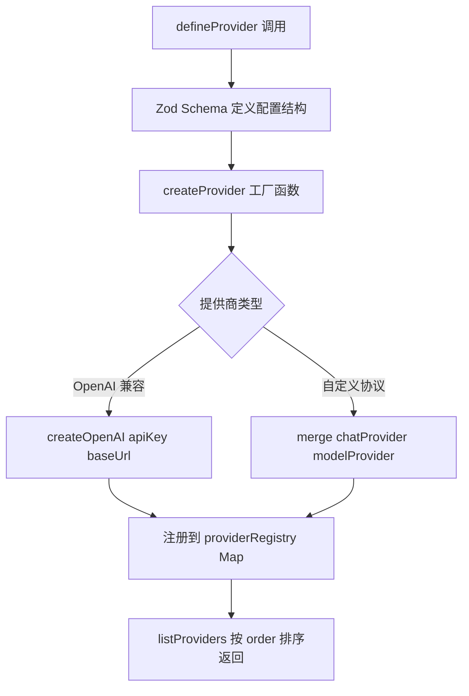
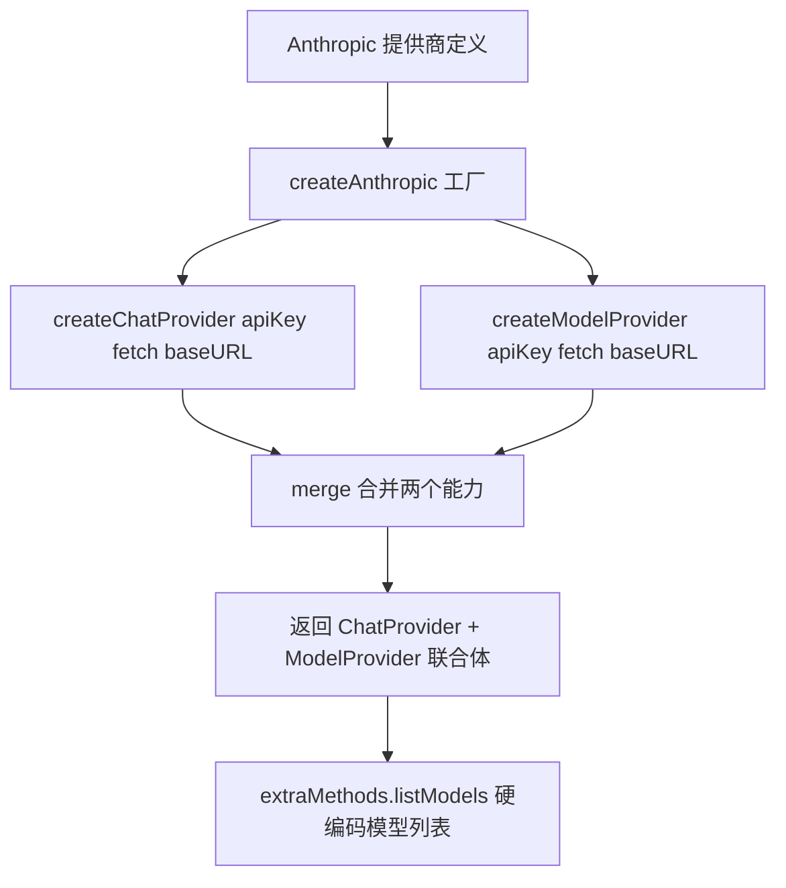
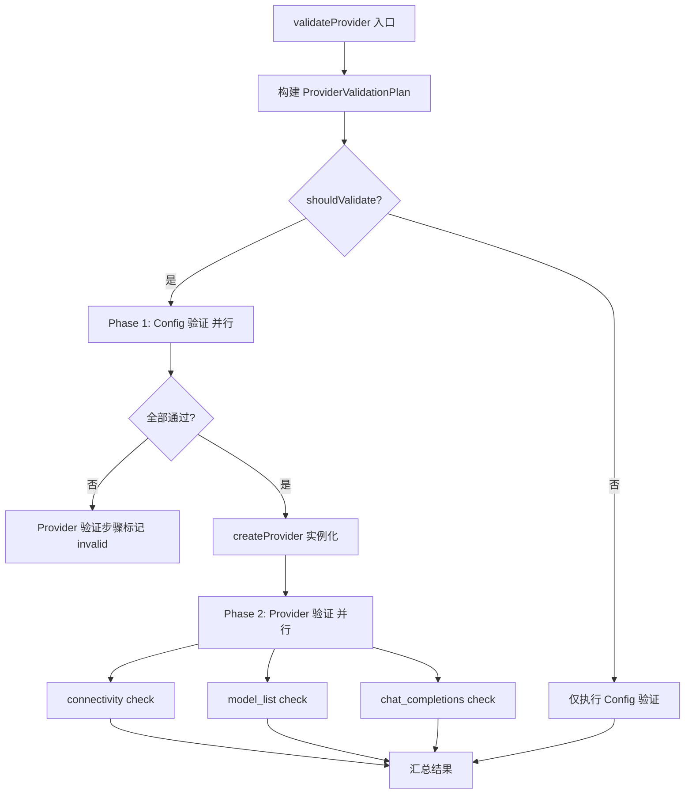

# PD-461.01 AIRI — xsai 四类模型提供商统一抽象

> 文档编号：PD-461.01
> 来源：AIRI `packages/stage-ui/src/stores/providers.ts` `packages/stage-ui/src/libs/providers/`
> GitHub：https://github.com/moeru-ai/airi.git
> 问题域：PD-461 LLM提供商抽象 LLM Provider Abstraction
> 状态：可复用方案

---

## 第 1 章 问题与动机

### 1.1 核心问题

AI 应用需要对接大量 LLM/语音/嵌入提供商（OpenAI、Anthropic、Groq、ElevenLabs、Deepgram 等），每家 API 格式、认证方式、模型发现机制各不相同。如果为每个提供商写硬编码集成，会导致：

- 新增提供商的边际成本线性增长
- 凭证管理、验证逻辑重复散落各处
- 前端 UI 与后端 SDK 耦合，无法独立演进
- Chat/Embed/Speech/Transcription 四类能力无法统一调度

AIRI 作为一个跨平台 AI 伴侣项目（Web + Tauri 桌面 + Discord Bot），需要在浏览器端、桌面端、服务端三种运行时统一管理 25+ 提供商，且支持 WebGPU 本地推理，问题尤为突出。

### 1.2 AIRI 的解法概述

AIRI 构建了一套三层提供商抽象体系：

1. **xsai 轻量 SDK 层**：`@xsai-ext/providers` 提供 `createOpenAI`/`createChatProvider`/`createSpeechProvider` 等工厂函数，输出标准化的 Provider 接口（`ChatProvider`/`EmbedProvider`/`SpeechProvider`/`TranscriptionProvider`），替代 Vercel AI SDK 减少包体积（`packages/stage-ui/src/libs/providers/providers/openai/index.ts:1`）
2. **声明式注册层**：`defineProvider<TConfig>()` + Zod schema 声明式定义每个提供商的配置结构、工厂函数、验证器和能力声明（`packages/stage-ui/src/libs/providers/providers/registry.ts:20`）
3. **运行时 Store 层**：Pinia `useProvidersStore` 管理凭证持久化（localStorage）、实例缓存、模型列表拉取、配置变更监听和自动重验证（`packages/stage-ui/src/stores/providers.ts:189`）

### 1.3 设计思想

| 设计原则 | 具体实现 | 理由 | 替代方案 |
|----------|----------|------|----------|
| OpenAI 兼容优先 | 大部分提供商通过 `createOpenAI(apiKey, baseUrl)` 一行接入 | 90% 的 LLM 提供商兼容 OpenAI API 格式 | 每家写独立 SDK 适配器 |
| 声明式注册 | `defineProvider()` + Zod schema 定义配置、验证、工厂 | 新增提供商只需一个文件，无需修改核心代码 | 命令式注册 + 手动类型定义 |
| 四类能力正交 | Chat/Embed/Speech/Transcription 独立接口，`merge()` 组合 | 同一提供商可能只支持部分能力 | 单一 Provider 接口包含所有方法 |
| 两阶段验证 | Config 验证（同步/本地）→ Provider 验证（异步/网络） | 避免无效配置触发网络请求 | 单阶段全量验证 |
| 渐进式迁移 | `convertProviderDefinitionsToMetadata()` 桥接新旧两套注册系统 | 23 个 Chat 提供商已迁移到新系统，Speech/Transcription 仍用旧系统 | 一次性全量迁移 |

---

## 第 2 章 源码实现分析

### 2.1 架构概览

AIRI 的提供商抽象分为三层，从底层 SDK 到上层 UI 状态管理：

```
┌─────────────────────────────────────────────────────────────────┐
│                    Pinia Store (providers.ts)                    │
│  providerCredentials (localStorage) ← → providerRuntimeState   │
│  providerInstanceCache    providerMetadata (merged registry)    │
├─────────────────────────────────────────────────────────────────┤
│              Converter Bridge (converters.ts)                    │
│  ProviderDefinition ──→ ProviderMetadata                        │
│  extractSchemaDefaults()  getCategoryFromTasks()                │
├─────────────────────────────────────────────────────────────────┤
│           Declaration Layer (libs/providers/)                    │
│  defineProvider<T>()  ←  Zod Schema  ←  createOpenAI()         │
│  registry.ts          types.ts        validators/               │
├─────────────────────────────────────────────────────────────────┤
│              xsai SDK (@xsai-ext/providers)                     │
│  createOpenAI  createChatProvider  createSpeechProvider         │
│  createModelProvider  createTranscriptionProvider  merge()      │
│  listModels()  generateText()  generateTranscription()         │
└─────────────────────────────────────────────────────────────────┘
```

### 2.2 核心实现

#### 2.2.1 声明式提供商注册



对应源码 `packages/stage-ui/src/libs/providers/providers/registry.ts:8-28`：

```typescript
const providerRegistry = new Map<string, ProviderDefinition>()

export function listProviders(): ProviderDefinition[] {
  const providerDefs = Array.from(providerRegistry.values()).map(def => ({ order: 99999, ...def }))
  const sorted = orderBy(providerDefs, [p => p.order, 'name'], ['asc', 'asc'])
  return sorted
}

export function defineProvider<T>(definition: { createProviderConfig: (contextOptions: { t: ComposerTranslation }) => $ZodType<T> } & ProviderDefinition<T>): ProviderDefinition<T> {
  const provider = { ...definition }
  providerRegistry.set(definition.id, definition)
  return provider
}
```

每个提供商只需一个文件即可完成注册。以 OpenAI 为例（`packages/stage-ui/src/libs/providers/providers/openai/index.ts:18-53`）：

```typescript
export const providerOpenAI = defineProvider<OpenAICompatibleConfig>({
  id: 'openai',
  order: 1,
  name: 'OpenAI',
  nameLocalize: ({ t }) => t('settings.pages.providers.provider.openai.title'),
  tasks: ['chat'],
  icon: 'i-lobe-icons:openai',
  createProviderConfig: ({ t }) => openAICompatibleConfigSchema.extend({
    apiKey: openAICompatibleConfigSchema.shape.apiKey.meta({
      labelLocalized: t('...api-key.label'),
      type: 'password',
    }),
    baseUrl: openAICompatibleConfigSchema.shape.baseUrl.meta({
      labelLocalized: t('...base-url.label'),
    }),
  }),
  createProvider(config) {
    return createOpenAI(config.apiKey, config.baseUrl)
  },
  validationRequiredWhen(config) {
    return !!config.apiKey?.trim()
  },
  validators: {
    ...createOpenAICompatibleValidators({
      checks: ['connectivity', 'model_list', 'chat_completions'],
    }),
  },
})
```

#### 2.2.2 非 OpenAI 兼容提供商的 merge 组合



对应源码 `packages/stage-ui/src/libs/providers/providers/anthropic/index.ts:20-37`：

```typescript
function createAnthropic(apiKey: string, baseURL: string = 'https://api.anthropic.com/v1/') {
  const anthropicFetch = async (input: any, init: any) => {
    init.headers ??= {}
    if (Array.isArray(init.headers))
      init.headers.push(['anthropic-dangerous-direct-browser-access', 'true'])
    else if (init.headers instanceof Headers)
      init.headers.append('anthropic-dangerous-direct-browser-access', 'true')
    else
      init.headers['anthropic-dangerous-direct-browser-access'] = 'true'
    return fetch(input, init)
  }
  return merge(
    createChatProvider({ apiKey, fetch: anthropicFetch, baseURL }),
    createModelProvider({ apiKey, fetch: anthropicFetch, baseURL }),
  )
}
```

#### 2.2.3 两阶段验证管道



对应源码 `packages/stage-ui/src/libs/providers/validators/run.ts:84-160`：

```typescript
export async function validateProvider(
  plan: ProviderValidationPlan,
  contextOptions: { t: ComposerTranslation },
  callbacks: ProviderValidationCallbacks = {},
) {
  const { configValidators, providerValidators, steps, config, definition, providerExtra } = plan
  const runContext = { ...contextOptions, validationCache: new Map<string, unknown>() }

  // Phase 1: Config validators (parallel)
  const configResults = await Promise.all(configValidators.map(async (validatorDefinition, index) => {
    const step = steps[index]
    step.status = 'validating'
    const result = await validatorDefinition.validator(config, runContext)
    step.status = result.valid ? 'valid' : 'invalid'
    return result
  }))

  const configIsValid = configResults.every(result => result.valid)
  if (!configIsValid) {
    // Skip provider validators if config is invalid
    for (let i = 0; i < providerValidators.length; i++) {
      steps[providerStepOffset + i].status = 'invalid'
      steps[providerStepOffset + i].reason = 'Fix configuration checks first.'
    }
    return steps
  }

  // Phase 2: Provider validators (parallel, with shared cache + Mutex)
  let providerInstance = await definition.createProvider(config)
  await Promise.all(providerValidators.map(async (validatorDefinition, index) => {
    const step = steps[providerStepOffset + index]
    step.status = 'validating'
    const result = await validatorDefinition.validator(config, providerInstance, providerExtra, runContext)
    step.status = result.valid ? 'valid' : 'invalid'
  }))
  return steps
}
```

### 2.3 实现细节

**ProviderMetadata 接口**（`packages/stage-ui/src/stores/providers.ts:69-154`）是运行时的核心数据结构，统一了四类提供商的元数据：

- `category: 'chat' | 'embed' | 'speech' | 'transcription'` — 四类能力分类
- `createProvider(config)` — 工厂函数，返回 xsai Provider 实例
- `capabilities.listModels/listVoices/loadModel` — 可选能力声明
- `validators.validateProviderConfig` — 配置验证入口
- `isAvailableBy()` — 平台可用性检测（WebGPU、Tauri、浏览器）
- `transcriptionFeatures` — 转录特性声明（流式输入/输出）

**凭证持久化与实例缓存**（`packages/stage-ui/src/stores/providers.ts:190-192`）：

```typescript
const providerCredentials = useLocalStorage<Record<string, Record<string, unknown>>>('settings/credentials/providers', {})
const addedProviders = useLocalStorage<Record<string, boolean>>('settings/providers/added', {})
const providerInstanceCache = ref<Record<string, unknown>>({})
```

凭证变更时自动触发重验证和实例缓存失效（`providers.ts:1873-1896`），通过 JSON hash 比对避免重复验证。

**渐进式迁移桥接**（`packages/stage-ui/src/stores/providers/converters.ts:93-242`）：`convertProviderDefinitionToMetadata()` 将新的 `ProviderDefinition`（Zod schema + 声明式验证器）转换为旧的 `ProviderMetadata` 格式，使 23 个 Chat 提供商已迁移到新系统，而 Speech/Transcription 提供商仍使用旧的手写 metadata。


---

## 第 3 章 迁移指南

### 3.1 迁移清单

**阶段 1：基础抽象层（1 个文件）**

- [ ] 定义 `ProviderDefinition<TConfig>` 接口（参考 `libs/providers/types.ts`）
- [ ] 实现 `defineProvider()` 注册函数 + 全局 Map 注册表
- [ ] 定义四类 Provider 接口：`ChatProvider`/`EmbedProvider`/`SpeechProvider`/`TranscriptionProvider`

**阶段 2：验证管道（2 个文件）**

- [ ] 实现两阶段验证：Config 验证 → Provider 验证
- [ ] 提取 `createOpenAICompatibleValidators()` 可复用验证器工厂
- [ ] 添加 Mutex 缓存避免重复网络请求

**阶段 3：提供商实现（每个提供商 1 个文件）**

- [ ] OpenAI 兼容提供商：`createOpenAI(apiKey, baseUrl)` 一行接入
- [ ] 非兼容提供商：`merge(createChatProvider(), createModelProvider())` 组合
- [ ] 本地推理提供商：WebGPU/Worker 特殊处理

**阶段 4：状态管理层**

- [ ] 凭证持久化（localStorage/数据库）
- [ ] 实例缓存 + 凭证变更自动失效
- [ ] 模型列表动态拉取 + 加载状态管理

### 3.2 适配代码模板

以下是一个可直接运行的最小化提供商注册系统（TypeScript）：

```typescript
// === types.ts ===
import type { z } from 'zod'

export interface ChatProvider {
  chat: (model: string) => { baseURL: string; model: string; apiKey?: string }
}

export interface ModelProvider {
  model: () => { baseURL: string; apiKey?: string }
}

export type ProviderInstance = ChatProvider | ModelProvider | (ChatProvider & ModelProvider)

export interface ProviderDefinition<TConfig = any> {
  id: string
  order?: number
  name: string
  tasks: string[]
  createProviderConfig: () => z.ZodType<TConfig>
  createProvider: (config: TConfig) => ProviderInstance
  validationRequiredWhen?: (config: TConfig) => boolean
  validators?: {
    validateConfig?: Array<{ id: string; validator: (config: TConfig) => Promise<ValidationResult> }>
    validateProvider?: Array<{ id: string; validator: (config: TConfig, provider: ProviderInstance) => Promise<ValidationResult> }>
  }
}

export interface ValidationResult {
  valid: boolean
  reason: string
  errors: Array<{ error: unknown }>
}

// === registry.ts ===
const registry = new Map<string, ProviderDefinition>()

export function defineProvider<T>(def: ProviderDefinition<T>): ProviderDefinition<T> {
  registry.set(def.id, def as any)
  return def
}

export function listProviders(): ProviderDefinition[] {
  return [...registry.values()].sort((a, b) => (a.order ?? 9999) - (b.order ?? 9999))
}

// === validators.ts ===
export function createOpenAICompatibleValidators(checks: string[]) {
  const validators: ProviderDefinition['validators'] = { validateConfig: [], validateProvider: [] }

  validators.validateConfig!.push({
    id: 'check-config',
    validator: async (config: any) => {
      const errors: Array<{ error: unknown }> = []
      if (!config.apiKey?.trim()) errors.push({ error: new Error('API key required') })
      if (!config.baseUrl?.trim()) errors.push({ error: new Error('Base URL required') })
      return { valid: errors.length === 0, reason: errors.map(e => (e.error as Error).message).join(', '), errors }
    },
  })

  if (checks.includes('connectivity')) {
    validators.validateProvider!.push({
      id: 'check-connectivity',
      validator: async (config: any, _provider) => {
        try {
          const res = await fetch(`${config.baseUrl}models`, {
            headers: { Authorization: `Bearer ${config.apiKey}` },
          })
          return { valid: res.ok, reason: res.ok ? '' : `HTTP ${res.status}`, errors: [] }
        } catch (e) {
          return { valid: false, reason: (e as Error).message, errors: [{ error: e }] }
        }
      },
    })
  }

  return validators
}

// === 使用示例：注册 OpenAI ===
import { z } from 'zod'

const openaiConfig = z.object({
  apiKey: z.string(),
  baseUrl: z.string().default('https://api.openai.com/v1/'),
})

defineProvider({
  id: 'openai',
  order: 1,
  name: 'OpenAI',
  tasks: ['chat'],
  createProviderConfig: () => openaiConfig,
  createProvider: (config) => ({
    chat: (model: string) => ({ baseURL: config.baseUrl, model, apiKey: config.apiKey }),
    model: () => ({ baseURL: config.baseUrl, apiKey: config.apiKey }),
  }),
  validationRequiredWhen: (config) => !!config.apiKey?.trim(),
  validators: createOpenAICompatibleValidators(['connectivity']),
})
```

### 3.3 适用场景

| 场景 | 适用度 | 说明 |
|------|--------|------|
| 多提供商 AI 应用（5+ 提供商） | ⭐⭐⭐ | 声明式注册 + 统一验证管道大幅降低边际成本 |
| 跨平台应用（Web + Desktop + Server） | ⭐⭐⭐ | `isAvailableBy()` 平台检测 + WebGPU 本地推理支持 |
| 需要 Speech/Transcription 的 AI 应用 | ⭐⭐⭐ | 四类能力正交设计，`unspeech` 统一语音提供商 |
| 单提供商简单应用 | ⭐ | 过度设计，直接用 SDK 即可 |
| 后端 Agent 框架 | ⭐⭐ | 可复用注册 + 验证层，但 Pinia Store 层需替换 |

---

## 第 4 章 测试用例

```typescript
import { describe, it, expect, vi, beforeEach } from 'vitest'

// === 测试 Registry ===
describe('ProviderRegistry', () => {
  let registry: Map<string, any>
  let defineProvider: Function
  let listProviders: Function

  beforeEach(() => {
    registry = new Map()
    defineProvider = (def: any) => { registry.set(def.id, def); return def }
    listProviders = () => [...registry.values()].sort((a, b) => (a.order ?? 9999) - (b.order ?? 9999))
  })

  it('should register and retrieve providers', () => {
    defineProvider({ id: 'openai', order: 1, name: 'OpenAI', tasks: ['chat'] })
    defineProvider({ id: 'anthropic', order: 5, name: 'Anthropic', tasks: ['chat'] })
    expect(registry.size).toBe(2)
    expect(listProviders()[0].id).toBe('openai')
    expect(listProviders()[1].id).toBe('anthropic')
  })

  it('should sort by order then name', () => {
    defineProvider({ id: 'z-provider', order: 1, name: 'Z Provider', tasks: ['chat'] })
    defineProvider({ id: 'a-provider', order: 1, name: 'A Provider', tasks: ['chat'] })
    const sorted = listProviders()
    // Same order, sorted by name
    expect(sorted[0].name).toBe('A Provider')
  })

  it('should default order to 99999', () => {
    defineProvider({ id: 'no-order', name: 'No Order', tasks: ['chat'] })
    defineProvider({ id: 'ordered', order: 1, name: 'Ordered', tasks: ['chat'] })
    expect(listProviders()[0].id).toBe('ordered')
  })
})

// === 测试两阶段验证 ===
describe('TwoPhaseValidation', () => {
  it('should skip provider validation when config is invalid', async () => {
    const configValidator = vi.fn().mockResolvedValue({ valid: false, reason: 'API key required' })
    const providerValidator = vi.fn().mockResolvedValue({ valid: true, reason: '' })

    // Phase 1: config validation fails
    const configResult = await configValidator({})
    expect(configResult.valid).toBe(false)

    // Phase 2: should not be called
    if (configResult.valid) {
      await providerValidator({}, {})
    }
    expect(providerValidator).not.toHaveBeenCalled()
  })

  it('should run provider validation when config is valid', async () => {
    const configValidator = vi.fn().mockResolvedValue({ valid: true, reason: '' })
    const providerValidator = vi.fn().mockResolvedValue({ valid: true, reason: '' })

    const configResult = await configValidator({ apiKey: 'sk-test', baseUrl: 'https://api.openai.com/v1/' })
    expect(configResult.valid).toBe(true)

    const providerResult = await providerValidator({ apiKey: 'sk-test' }, {})
    expect(providerResult.valid).toBe(true)
    expect(providerValidator).toHaveBeenCalledTimes(1)
  })
})

// === 测试 Category 推断 ===
describe('getCategoryFromTasks', () => {
  function getCategoryFromTasks(tasks: string[]): string {
    if (tasks.some(t => ['speech-to-text', 'asr', 'stt'].includes(t.toLowerCase()))) return 'transcription'
    if (tasks.some(t => ['text-to-speech', 'tts'].includes(t.toLowerCase()))) return 'speech'
    if (tasks.some(t => ['embed', 'embedding'].includes(t.toLowerCase()))) return 'embed'
    return 'chat'
  }

  it('should detect chat category', () => {
    expect(getCategoryFromTasks(['chat'])).toBe('chat')
    expect(getCategoryFromTasks(['text-generation'])).toBe('chat')
  })

  it('should detect speech category', () => {
    expect(getCategoryFromTasks(['text-to-speech'])).toBe('speech')
    expect(getCategoryFromTasks(['tts'])).toBe('speech')
  })

  it('should detect transcription category', () => {
    expect(getCategoryFromTasks(['speech-to-text'])).toBe('transcription')
    expect(getCategoryFromTasks(['asr'])).toBe('transcription')
  })

  it('should prioritize transcription over speech', () => {
    expect(getCategoryFromTasks(['text-to-speech', 'speech-to-text'])).toBe('transcription')
  })
})

// === 测试凭证变更检测 ===
describe('CredentialChangeDetection', () => {
  it('should detect config changes via JSON hash', () => {
    const prev = JSON.stringify({ apiKey: 'old', baseUrl: 'https://api.openai.com/v1/' })
    const next = JSON.stringify({ apiKey: 'new', baseUrl: 'https://api.openai.com/v1/' })
    expect(prev !== next).toBe(true)
  })

  it('should skip re-validation for identical config', () => {
    const config = { apiKey: 'sk-test', baseUrl: 'https://api.openai.com/v1/' }
    const hash1 = JSON.stringify(config)
    const hash2 = JSON.stringify(config)
    expect(hash1 === hash2).toBe(true)
  })
})
```


---

## 第 5 章 跨域关联

| 关联域 | 关系类型 | 说明 |
|--------|----------|------|
| PD-04 工具系统 | 协同 | 提供商抽象为工具系统提供统一的 LLM 调用接口，工具执行结果通过 Chat Provider 返回 |
| PD-06 记忆持久化 | 协同 | 凭证通过 `useLocalStorage` 持久化，与记忆系统共享持久化策略 |
| PD-11 可观测性 | 依赖 | 提供商验证管道的 `ProviderValidationCallbacks`（onStart/onSuccess/onError）可接入可观测性系统 |
| PD-01 上下文管理 | 协同 | `ModelInfo.contextLength` 字段为上下文窗口管理提供模型级别的 token 限制信息 |
| PD-442 配置管理 | 依赖 | 提供商配置（API Key、Base URL）是配置管理系统的核心子集，Zod schema 驱动配置验证 |
| PD-443 多模型路由 | 协同 | `allAvailableModels` 聚合所有已配置提供商的模型列表，为多模型路由提供候选池 |
| PD-454 语音音频管道 | 依赖 | Speech/Transcription 提供商（ElevenLabs、Deepgram、Kokoro）直接服务于语音管道 |

---

## 第 6 章 来源文件索引

| 文件 | 行范围 | 关键实现 |
|------|--------|----------|
| `packages/stage-ui/src/libs/providers/types.ts` | L1-L146 | ProviderDefinition 接口、ProviderInstance 联合类型、ModelInfo/VoiceInfo 数据结构 |
| `packages/stage-ui/src/libs/providers/providers/registry.ts` | L1-L28 | defineProvider() 注册函数、listProviders() 排序查询、全局 providerRegistry Map |
| `packages/stage-ui/src/libs/providers/validators/run.ts` | L54-L160 | getValidatorsOfProvider() 构建验证计划、validateProvider() 两阶段执行 |
| `packages/stage-ui/src/libs/providers/validators/openai-compatible.ts` | L92-L307 | createOpenAICompatibleValidators() 可复用验证器工厂、Mutex 缓存、connectivity/model_list/chat_completions 三种检查 |
| `packages/stage-ui/src/libs/providers/providers/openai/index.ts` | L1-L53 | OpenAI 提供商声明式定义示例 |
| `packages/stage-ui/src/libs/providers/providers/anthropic/index.ts` | L1-L100 | Anthropic 非兼容提供商的 merge 组合 + 自定义 fetch 注入 |
| `packages/stage-ui/src/stores/providers.ts` | L69-L154 | ProviderMetadata 运行时接口定义 |
| `packages/stage-ui/src/stores/providers.ts` | L189-L2093 | useProvidersStore Pinia Store：凭证持久化、实例缓存、模型拉取、配置监听 |
| `packages/stage-ui/src/stores/providers/converters.ts` | L93-L258 | convertProviderDefinitionToMetadata() 新旧系统桥接转换器 |
| `packages/stage-ui/src/stores/providers/openai-compatible-builder.ts` | L36-L285 | buildOpenAICompatibleProvider() 动态构建 OpenAI 兼容提供商元数据 |
| `services/discord-bot/src/pipelines/tts.ts` | L73-L95 | 服务端 createOpenAI + generateTranscription 使用示例 |

---

## 第 7 章 横向对比维度

```json comparison_data
{
  "project": "AIRI",
  "dimensions": {
    "接口统一方式": "xsai 轻量 SDK 工厂函数 + merge() 组合四类能力",
    "模型列表发现": "listModels API 动态拉取 + 硬编码 fallback 双模式",
    "API密钥管理": "Pinia + localStorage 持久化，JSON hash 变更检测自动重验证",
    "验证架构": "两阶段管道：Config 同步验证 → Provider 异步网络验证 + Mutex 缓存",
    "提供商注册": "defineProvider() 声明式注册 + 全局 Map + order 排序",
    "本地推理支持": "WebGPU 检测 + Worker 线程 Kokoro TTS + isAvailableBy 平台门控",
    "语音提供商统一": "unspeech SDK 统一 ElevenLabs/Deepgram/Microsoft/Volcengine/AlibabaCloud"
  }
}
```

### 域元数据补充

```json domain_metadata
{
  "solution_summary": "AIRI 通过 xsai 轻量 SDK + defineProvider() 声明式注册 + 两阶段验证管道，统一 25+ 提供商的 Chat/Embed/Speech/Transcription 四类能力接口",
  "description": "跨平台运行时（Web/Desktop/Server）的提供商能力检测与渐进式迁移",
  "sub_problems": [
    "跨平台可用性检测（WebGPU/Tauri/Browser）",
    "提供商实例缓存与凭证变更自动失效",
    "新旧注册系统渐进式迁移桥接",
    "语音提供商统一（unspeech SDK）"
  ],
  "best_practices": [
    "两阶段验证管道：Config同步验证通过后才触发Provider异步网络验证",
    "merge()组合正交能力替代单一Provider大接口",
    "Mutex缓存避免并行验证重复网络请求",
    "convertProviderDefinitionsToMetadata桥接实现渐进式迁移"
  ]
}
```

