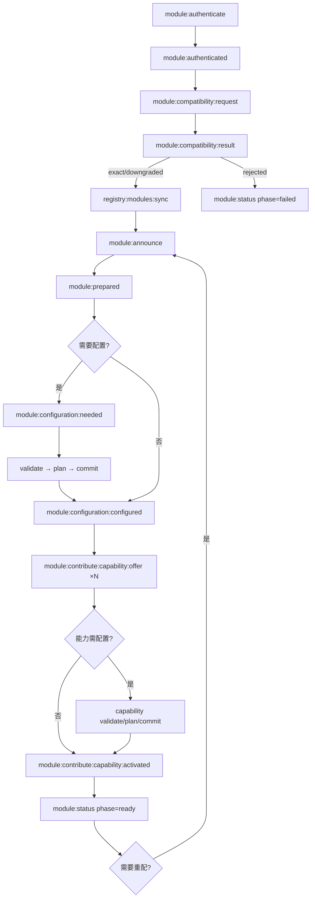
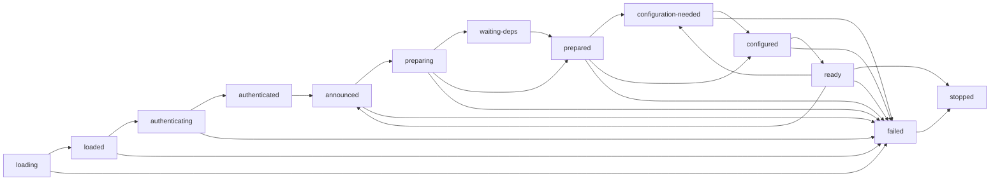
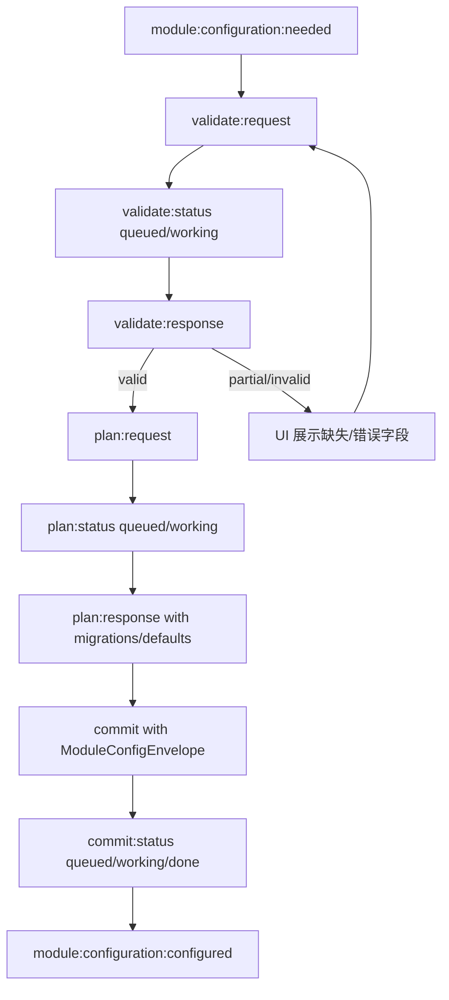

# PD-462.01 AIRI — plugin-protocol 十步模块生命周期协议

> 文档编号：PD-462.01
> 来源：AIRI `packages/plugin-protocol/src/types/events.ts`
> GitHub：https://github.com/moeru-ai/airi.git
> 问题域：PD-462 模块生命周期协议 Module Lifecycle Protocol
> 状态：可复用方案

---

## 第 1 章 问题与动机（≥ 30 行）

### 1.1 核心问题

在多模块 Agent 系统中，插件/模块的启动不是简单的"加载→运行"。一个模块需要经历认证、兼容性协商、依赖发现、配置验证、能力声明等多个阶段，每个阶段都可能失败或需要外部输入（如用户填写配置）。如果没有统一的生命周期协议：

- 模块启动顺序不确定，依赖关系无法表达
- 配置变更无法安全地验证和回滚
- 能力（capability）的注册和撤销缺乏标准化流程
- 多个模块并发启动时状态混乱，难以调试
- 远程模块（WebSocket）和本地模块（in-memory）无法共享同一套 API

AIRI 的 plugin-protocol 通过定义一套完整的 10 步生命周期事件协议，配合 XState 状态机验证转换合法性，解决了上述所有问题。

### 1.2 AIRI 的解法概述

1. **事件驱动协议**：用 `@moeru/eventa` 定义 40+ 类型安全事件，覆盖从认证到就绪的全流程（`packages/plugin-protocol/src/types/events.ts:816-852`）
2. **XState 状态机**：13 态状态机严格校验每次转换的合法性，非法跳转直接抛异常（`packages/plugin-sdk/src/plugin-host/core.ts:173-259`）
3. **三阶段配置流**：validate → plan → commit 的配置管道，支持乐观并发控制（`baseRevision`）和配置迁移（`packages/plugin-protocol/src/types/events.ts:220-258`）
4. **能力贡献系统**：模块配置完成后，逐个声明能力（capability），每个能力可独立配置和激活（`packages/plugin-protocol/src/types/events.ts:620-702`）
5. **传输无关设计**：同一套协议支持 in-memory、WebSocket、Web Worker、Electron IPC 五种传输（`packages/plugin-sdk/src/plugin-host/transports/index.ts:1-6`）

### 1.3 设计思想

| 设计原则 | 具体实现 | 理由 | 替代方案 |
|----------|----------|------|----------|
| 事件驱动 | 40+ defineEventa 事件定义，每个事件有独立 TypeScript 类型 | 解耦模块与宿主，支持远程/本地统一 | 直接方法调用（耦合传输层） |
| 状态机守卫 | XState createMachine 13 态 + assertTransition 校验 | 防止非法状态跳转，确保生命周期确定性 | if-else 手动检查（易遗漏） |
| 乐观并发控制 | ModuleConfigEnvelope.baseRevision 字段 | 多方并发修改配置时检测冲突 | 悲观锁（阻塞其他配置操作） |
| 能力粒度配置 | 每个 capability 有独立的 validate/plan/commit 流 | 一个模块可贡献多个能力，各自独立配置 | 模块级统一配置（粒度太粗） |
| K8s 风格标签 | ModuleIdentity.labels + RouteTargetExpression | 灵活的路由和策略选择 | 硬编码模块名路由（不可扩展） |

---

## 第 2 章 源码实现分析（≥ 60 行，核心章节）

### 2.1 架构概览

AIRI 的模块生命周期协议分为三层：协议定义层（plugin-protocol）、宿主编排层（plugin-sdk/plugin-host）、传输层（server-runtime / in-memory）。

```
┌─────────────────────────────────────────────────────────────┐
│                    Plugin Host (编排层)                       │
│  ┌──────────┐  ┌──────────────┐  ┌───────────────────────┐  │
│  │ XState   │  │ Capability   │  │ FileSystem            │  │
│  │ 状态机    │  │ Registry     │  │ Loader                │  │
│  │ 13 态    │  │ 4 态追踪     │  │ Manifest → Plugin     │  │
│  └────┬─────┘  └──────┬───────┘  └───────────┬───────────┘  │
│       │               │                      │              │
│  ┌────▼───────────────▼──────────────────────▼───────────┐  │
│  │              Eventa Context (per-plugin isolated)      │  │
│  └────────────────────────┬──────────────────────────────┘  │
│                           │                                  │
├───────────────────────────┼──────────────────────────────────┤
│         Transport Layer   │                                  │
│  ┌────────┐ ┌──────────┐ │ ┌───────────┐ ┌──────────────┐  │
│  │in-memory│ │WebSocket │ │ │Web Worker │ │Electron IPC  │  │
│  └────────┘ └──────────┘ │ └───────────┘ └──────────────┘  │
├───────────────────────────┼──────────────────────────────────┤
│     Protocol Layer        │                                  │
│  ┌────────────────────────▼──────────────────────────────┐  │
│  │  plugin-protocol: 40+ typed events (defineEventa)     │  │
│  │  ProtocolEvents<C> 可扩展联合类型                       │  │
│  └───────────────────────────────────────────────────────┘  │
└─────────────────────────────────────────────────────────────┘
```

### 2.2 核心实现

#### 2.2.1 十步生命周期事件流



对应源码 `packages/plugin-protocol/src/types/events.ts:490-502`：

```typescript
// Module orchestration (local or remote transport):
//
// 1) module:authenticate → module:authenticated
// 2) registry:modules:sync (host → module bootstrap)
// 3) module:announce (identity, deps, config schema)
// 4) module:prepared
// 5) module:configuration:* (validate/plan/commit flow)
// 6) module:configuration:configured
// 7) module:contribute:capability:offer (repeat per capability)
// 8) module:contribute:capability:configuration:* (optional)
// 9) module:contribute:capability:activated
// 10) module:status (ready)
// 11) module:status:change (to re-run phases)
```

#### 2.2.2 XState 状态机与转换守卫



对应源码 `packages/plugin-sdk/src/plugin-host/core.ts:173-259`：

```typescript
const pluginLifecycleMachine = createMachine({
  id: 'plugin-lifecycle',
  initial: 'loading',
  states: {
    'loading': {
      on: {
        SESSION_LOADED: 'loaded',
        SESSION_FAILED: 'failed',
      },
    },
    'loaded': {
      on: {
        START_AUTHENTICATION: 'authenticating',
        STOP: 'stopped',
        SESSION_FAILED: 'failed',
      },
    },
    'authenticating': {
      on: {
        AUTHENTICATED: 'authenticated',
        SESSION_FAILED: 'failed',
      },
    },
    // ... 13 states total
    'ready': {
      on: {
        REANNOUNCE: 'announced',
        CONFIGURATION_NEEDED: 'configuration-needed',
        STOP: 'stopped',
        SESSION_FAILED: 'failed',
      },
    },
    'stopped': { type: 'final' },
  },
})
```

转换守卫函数确保每次状态变更都经过 XState 验证（`core.ts:277-291`）：

```typescript
function assertTransition(session: PluginHostSession, to: PluginSessionPhase) {
  const eventType = lifecycleTransitionEvents[session.phase][to]
  if (!eventType) {
    throw new Error(`Invalid plugin lifecycle transition: ${session.phase} -> ${to}`)
  }
  const snapshot = session.lifecycle.getSnapshot()
  if (!snapshot.can(event)) {
    throw new Error(`Invalid plugin lifecycle transition: ${session.phase} -> ${to}`)
  }
  session.lifecycle.send(event)
  session.phase = session.lifecycle.getSnapshot().value as PluginSessionPhase
}
```

#### 2.2.3 三阶段配置管道



对应源码 `packages/plugin-protocol/src/types/events.ts:260-281`，配置验证结果有三态：

```typescript
export interface ModuleConfigValidation {
  status: 'partial' | 'valid' | 'invalid'
  missing?: string[]           // partial 时的缺失字段
  invalid?: Array<{ path: string, reason: Localizable }>  // invalid 时的错误详情
  warnings?: Array<string | ModuleConfigNotice>            // 非阻塞警告
}
```

### 2.3 实现细节

**乐观并发控制**：`ModuleConfigEnvelope` 通过 `revision` + `baseRevision` 实现（`events.ts:294-320`）。当使用 `patch` 更新时，必须设置 `baseRevision`，宿主可检测冲突：

```typescript
export interface ModuleConfigEnvelope<C = Record<string, unknown>> {
  configId: string
  revision: number          // 当前版本号（单调递增）
  schemaVersion: number     // Schema 版本
  full?: C                  // 完整配置（首次应用）
  patch?: Partial<C>        // 增量补丁
  baseRevision?: number     // 乐观并发：基于哪个版本修改
}
```

**能力四态生命周期**：PluginHost 维护全局能力注册表，每个能力有 4 种状态（`capabilities/index.ts:1-8`）：

```typescript
export interface CapabilityDescriptor {
  key: string
  state: 'announced' | 'ready' | 'degraded' | 'withdrawn'
  metadata?: Record<string, unknown>
  updatedAt: number
}
```

**版本协商**：兼容性检查支持 exact/downgraded/rejected 三种模式（`core.ts:358-393`），宿主和插件各自声明支持的版本列表，取交集确定最终版本。

**传输抽象**：五种传输类型通过联合类型定义（`transports/index.ts:1-6`），当前 alpha 阶段仅实现 in-memory：

```typescript
export type PluginTransport
  = | { kind: 'in-memory' }
    | { kind: 'websocket', url: string, protocols?: string[] }
    | { kind: 'web-worker', worker: Worker }
    | { kind: 'node-worker', worker: import('node:worker_threads').Worker }
    | { kind: 'electron', target: 'main' | 'renderer', webContentsId?: number }
```

**Server-Runtime 远程协议处理**：WebSocket 服务端处理 `module:authenticate` 和 `module:announce` 事件，维护 peer 注册表和心跳超时（`server-runtime/src/index.ts:186-301`）。认证成功后自动广播 `registry:modules:sync` 给新 peer。


---

## 第 3 章 迁移指南（≥ 40 行）

### 3.1 迁移清单

**阶段 1：协议定义（1-2 天）**
- [ ] 定义模块身份类型（ModuleIdentity、PluginIdentity）
- [ ] 定义配置信封类型（ModuleConfigEnvelope，含 revision/baseRevision）
- [ ] 定义生命周期阶段枚举（ModulePhase）
- [ ] 定义核心事件类型（authenticate、announce、prepared、configured、status）

**阶段 2：状态机实现（1 天）**
- [ ] 用 XState（或等价库）实现生命周期状态机
- [ ] 实现 assertTransition 守卫函数
- [ ] 实现 markFailedTransition 降级函数

**阶段 3：宿主编排（2-3 天）**
- [ ] 实现 PluginHost.load()：加载模块 → loading → loaded
- [ ] 实现 PluginHost.init()：认证 → 兼容性 → 注册同步 → 公告 → 准备 → 配置 → 就绪
- [ ] 实现 applyConfiguration()：配置应用与状态转换
- [ ] 实现能力注册表（announced/ready/degraded/withdrawn 四态）

**阶段 4：传输层（按需）**
- [ ] 实现 in-memory 传输（开发/测试用）
- [ ] 实现 WebSocket 传输（远程模块用）

### 3.2 适配代码模板

以下是一个最小化的模块生命周期协议实现，可直接用于 TypeScript 项目：

```typescript
// === 1. 协议类型定义 ===
interface ModuleIdentity {
  id: string
  kind: 'plugin'
  plugin: { id: string; version?: string }
  labels?: Record<string, string>
}

interface ModuleConfigEnvelope<C = Record<string, unknown>> {
  configId: string
  revision: number
  schemaVersion: number
  full?: C
  patch?: Partial<C>
  baseRevision?: number  // 乐观并发控制
}

type ModulePhase =
  | 'announced' | 'preparing' | 'prepared'
  | 'configuration-needed' | 'configured'
  | 'ready' | 'failed'

interface CapabilityDescriptor {
  key: string
  state: 'announced' | 'ready' | 'degraded' | 'withdrawn'
  metadata?: Record<string, unknown>
  updatedAt: number
}

// === 2. 状态机（简化版，不依赖 XState） ===
const VALID_TRANSITIONS: Record<string, string[]> = {
  'loading':              ['loaded', 'failed'],
  'loaded':               ['authenticating', 'stopped', 'failed'],
  'authenticating':       ['authenticated', 'failed'],
  'authenticated':        ['announced', 'failed'],
  'announced':            ['preparing', 'configuration-needed', 'stopped', 'failed'],
  'preparing':            ['waiting-deps', 'prepared', 'failed'],
  'waiting-deps':         ['prepared', 'failed'],
  'prepared':             ['configuration-needed', 'configured', 'failed'],
  'configuration-needed': ['configured', 'failed'],
  'configured':           ['ready', 'failed'],
  'ready':                ['announced', 'configuration-needed', 'stopped', 'failed'],
  'failed':               ['stopped'],
  'stopped':              [],
}

function assertTransition(current: string, target: string): void {
  if (!VALID_TRANSITIONS[current]?.includes(target)) {
    throw new Error(`Invalid lifecycle transition: ${current} → ${target}`)
  }
}

// === 3. 能力注册表 ===
class CapabilityRegistry {
  private capabilities = new Map<string, CapabilityDescriptor>()
  private waiters = new Map<string, Set<(d: CapabilityDescriptor) => void>>()

  markReady(key: string, metadata?: Record<string, unknown>) {
    const descriptor: CapabilityDescriptor = {
      key, state: 'ready', metadata, updatedAt: Date.now(),
    }
    this.capabilities.set(key, descriptor)
    this.waiters.get(key)?.forEach(resolve => resolve(descriptor))
    this.waiters.delete(key)
    return descriptor
  }

  async waitFor(key: string, timeoutMs = 15000): Promise<CapabilityDescriptor> {
    const existing = this.capabilities.get(key)
    if (existing?.state === 'ready') return existing

    return new Promise((resolve, reject) => {
      const timeout = setTimeout(() => {
        this.waiters.get(key)?.delete(onReady)
        reject(new Error(`Capability "${key}" not ready after ${timeoutMs}ms`))
      }, timeoutMs)

      const onReady = (d: CapabilityDescriptor) => {
        clearTimeout(timeout)
        resolve(d)
      }

      const set = this.waiters.get(key) ?? new Set()
      set.add(onReady)
      this.waiters.set(key, set)
    })
  }
}
```

### 3.3 适用场景

| 场景 | 适用度 | 说明 |
|------|--------|------|
| 多插件 Agent 系统 | ⭐⭐⭐ | 核心场景：多个插件需要有序启动、配置、贡献能力 |
| 微服务编排 | ⭐⭐⭐ | 服务发现 + 健康检查 + 配置管理的统一协议 |
| IDE 扩展系统 | ⭐⭐⭐ | VS Code 式扩展激活：按需加载 + 能力声明 |
| 单体应用模块化 | ⭐⭐ | 如果模块间无依赖关系，协议开销可能过大 |
| 无状态 Lambda | ⭐ | 生命周期太短，不需要复杂的状态管理 |

---

## 第 4 章 测试用例（≥ 20 行）

基于 AIRI 真实测试（`packages/plugin-sdk/src/plugin-host/core.test.ts`）改编：

```typescript
import { describe, it, expect } from 'vitest'

// 使用上方迁移模板中的 assertTransition 和 CapabilityRegistry

describe('ModuleLifecycleProtocol', () => {
  describe('状态机转换守卫', () => {
    it('应允许合法的生命周期转换', () => {
      expect(() => assertTransition('loading', 'loaded')).not.toThrow()
      expect(() => assertTransition('loaded', 'authenticating')).not.toThrow()
      expect(() => assertTransition('authenticating', 'authenticated')).not.toThrow()
      expect(() => assertTransition('authenticated', 'announced')).not.toThrow()
      expect(() => assertTransition('announced', 'preparing')).not.toThrow()
      expect(() => assertTransition('preparing', 'prepared')).not.toThrow()
      expect(() => assertTransition('prepared', 'configured')).not.toThrow()
      expect(() => assertTransition('configured', 'ready')).not.toThrow()
    })

    it('应拒绝非法的状态跳转', () => {
      expect(() => assertTransition('loading', 'ready')).toThrow('Invalid lifecycle transition')
      expect(() => assertTransition('authenticating', 'configured')).toThrow()
      expect(() => assertTransition('stopped', 'loading')).toThrow()
    })

    it('应允许从 ready 回退到 announced（重配置）', () => {
      expect(() => assertTransition('ready', 'announced')).not.toThrow()
    })

    it('应允许从 ready 进入 configuration-needed', () => {
      expect(() => assertTransition('ready', 'configuration-needed')).not.toThrow()
    })

    it('任何状态都可以转入 failed', () => {
      const states = ['loading', 'loaded', 'authenticating', 'announced',
                      'preparing', 'prepared', 'configuration-needed', 'configured', 'ready']
      for (const state of states) {
        expect(() => assertTransition(state, 'failed')).not.toThrow()
      }
    })
  })

  describe('能力注册表', () => {
    it('应在 markReady 后立即解析等待者', async () => {
      const registry = new CapabilityRegistry()
      const waiting = registry.waitFor('cap:llm', 2000)

      // 模拟异步就绪
      setTimeout(() => registry.markReady('cap:llm', { model: 'gpt-4' }), 50)

      const result = await waiting
      expect(result.state).toBe('ready')
      expect(result.metadata).toEqual({ model: 'gpt-4' })
    })

    it('应在超时后拒绝未就绪的能力', async () => {
      const registry = new CapabilityRegistry()
      await expect(registry.waitFor('cap:missing', 50))
        .rejects.toThrow('Capability "cap:missing" not ready after 50ms')
    })

    it('已就绪的能力应立即返回', async () => {
      const registry = new CapabilityRegistry()
      registry.markReady('cap:search')
      const result = await registry.waitFor('cap:search')
      expect(result.state).toBe('ready')
    })
  })

  describe('乐观并发控制', () => {
    it('应检测 baseRevision 冲突', () => {
      const currentRevision = 5
      const patch = { baseRevision: 3 }  // 基于旧版本修改

      const hasConflict = patch.baseRevision < currentRevision
      expect(hasConflict).toBe(true)
    })

    it('应允许基于最新版本的补丁', () => {
      const currentRevision = 5
      const patch = { baseRevision: 5 }

      const hasConflict = patch.baseRevision < currentRevision
      expect(hasConflict).toBe(false)
    })
  })
})
```

---

## 第 5 章 跨域关联

| 关联域 | 关系类型 | 说明 |
|--------|----------|------|
| PD-04 工具系统 | 协同 | 能力贡献（capability:offer）是工具注册的一种形式，模块通过生命周期协议声明可提供的工具/能力 |
| PD-10 中间件管道 | 协同 | AIRI 的 Eventa 事件系统本质上是一个事件中间件管道，生命周期事件在管道中流转 |
| PD-02 多 Agent 编排 | 依赖 | 模块生命周期协议是多 Agent 编排的基础设施——模块必须先完成生命周期才能参与编排 |
| PD-11 可观测性 | 协同 | module:status 事件天然提供可观测性数据，每次状态转换都有 phase + reason + details |
| PD-03 容错与重试 | 协同 | 任何阶段失败都转入 failed 状态，支持 reload（stop + 重新 start）恢复 |
| PD-09 Human-in-the-Loop | 协同 | configuration-needed 阶段天然支持人机交互：暂停等待用户填写配置 |
| PD-456 依赖注入 | 依赖 | AIRI 的 Awilix IoC 容器为模块提供依赖，生命周期协议中的 dependencies 声明与 DI 容器协同 |


---

## 第 6 章 来源文件索引

| 文件 | 行范围 | 关键实现 |
|------|--------|----------|
| `packages/plugin-protocol/src/types/events.ts` | L18-55 | ModuleIdentity、PluginIdentity 身份定义 |
| `packages/plugin-protocol/src/types/events.ts` | L70-78 | ModuleConfigSchema 配置 Schema 元数据 |
| `packages/plugin-protocol/src/types/events.ts` | L90-110 | ModuleDependency 依赖声明（role + version 约束） |
| `packages/plugin-protocol/src/types/events.ts` | L126-147 | ModuleContribution 动态能力贡献 |
| `packages/plugin-protocol/src/types/events.ts` | L152-159 | ModulePhase 7 态生命周期枚举 |
| `packages/plugin-protocol/src/types/events.ts` | L220-258 | ModuleConfigPlan 配置计划（missing/invalid/migrations） |
| `packages/plugin-protocol/src/types/events.ts` | L260-281 | ModuleConfigValidation 三态验证结果 |
| `packages/plugin-protocol/src/types/events.ts` | L294-320 | ModuleConfigEnvelope 配置信封（乐观并发控制） |
| `packages/plugin-protocol/src/types/events.ts` | L322-344 | ModuleCapability 能力描述符 |
| `packages/plugin-protocol/src/types/events.ts` | L346-355 | RouteTargetExpression 8 种路由表达式 |
| `packages/plugin-protocol/src/types/events.ts` | L490-502 | 10 步生命周期注释（协议概览） |
| `packages/plugin-protocol/src/types/events.ts` | L504-618 | 模块级事件接口（authenticate → configured） |
| `packages/plugin-protocol/src/types/events.ts` | L620-702 | 能力级事件接口（offer → activated） |
| `packages/plugin-protocol/src/types/events.ts` | L816-852 | defineEventa 事件实例导出 |
| `packages/plugin-protocol/src/types/events.ts` | L877-1038 | ProtocolEvents 完整事件联合类型 |
| `packages/plugin-sdk/src/plugin-host/core.ts` | L46-156 | 17 步生命周期详细注释文档 |
| `packages/plugin-sdk/src/plugin-host/core.ts` | L158-172 | PluginLifecycleEvent 联合类型 |
| `packages/plugin-sdk/src/plugin-host/core.ts` | L173-259 | XState 状态机定义（13 态） |
| `packages/plugin-sdk/src/plugin-host/core.ts` | L261-275 | lifecycleTransitionEvents 转换映射表 |
| `packages/plugin-sdk/src/plugin-host/core.ts` | L277-291 | assertTransition 守卫函数 |
| `packages/plugin-sdk/src/plugin-host/core.ts` | L499-1030 | PluginHost 类（load/init/start/applyConfiguration/stop/reload） |
| `packages/plugin-sdk/src/plugin-host/core.ts` | L615-814 | init() 方法：完整 17 步生命周期编排 |
| `packages/plugin-sdk/src/plugin-host/core.ts` | L862-962 | 能力注册表（announce/ready/degraded/withdrawn + waitFor） |
| `packages/plugin-sdk/src/plugin-host/transports/index.ts` | L1-6 | PluginTransport 五种传输联合类型 |
| `packages/plugin-sdk/src/plugin/apis/protocol/capabilities/index.ts` | L1-17 | CapabilityDescriptor 四态 + protocolCapabilityWait |
| `packages/plugin-sdk/src/plugin/shared.ts` | L1-21 | Plugin 接口（init + setupModules 钩子） |
| `packages/server-sdk/src/client.ts` | L49-119 | Client 类构造器（自动认证 + 公告 + 心跳） |
| `packages/server-sdk/src/client.ts` | L236-247 | tryAnnounce()：发送 module:announce 事件 |
| `packages/server-sdk/src/client.ts` | L323-341 | send()：自动注入 metadata.source 和 event.id |
| `packages/server-runtime/src/index.ts` | L75-93 | setupApp 配置（auth/routing/heartbeat） |
| `packages/server-runtime/src/index.ts` | L185-301 | WebSocket handler：authenticate/announce/ui:configure 处理 |
| `packages/server-runtime/src/middlewares/route.ts` | L1-94 | 路由中间件：策略过滤 + 目的地收集 |
| `packages/server-shared/src/types/websocket/events.ts` | L1-53 | WebSocketEvent 信封类型 + ProtocolEvents 扩展 |
| `packages/plugin-sdk/src/plugin-host/core.test.ts` | L1-563 | 完整测试套件（生命周期/兼容性/能力/隔离） |

---

## 第 7 章 横向对比维度

```json comparison_data
{
  "project": "AIRI",
  "dimensions": {
    "协议完整度": "40+ 类型安全事件覆盖 10 步生命周期，含能力级子协议",
    "状态机实现": "XState 13 态状态机 + assertTransition 守卫",
    "配置管理": "三阶段 validate→plan→commit + 乐观并发控制 baseRevision",
    "传输抽象": "5 种传输联合类型（in-memory/WebSocket/Worker/Electron）",
    "能力系统": "4 态能力注册表（announced/ready/degraded/withdrawn）+ waitFor 超时",
    "版本协商": "双维度协商（protocol + api），支持 exact/downgraded/rejected",
    "标签路由": "K8s 风格 labels + 8 种 RouteTargetExpression 组合"
  }
}
```

### 域元数据补充

```json domain_metadata
{
  "solution_summary": "AIRI plugin-protocol 用 40+ defineEventa 事件 + XState 13 态状态机编排 authenticate→announce→prepare→configure(validate/plan/commit)→contribute capability→activate 的完整模块生命周期，支持五种传输和乐观并发配置控制",
  "description": "模块从加载到就绪的全阶段事件驱动编排协议，含版本协商和能力贡献子流程",
  "sub_problems": [
    "传输层抽象与多运行时适配",
    "版本协商与向后兼容降级",
    "能力依赖等待与超时处理",
    "K8s 风格标签路由与策略过滤"
  ],
  "best_practices": [
    "用 XState 状态机替代 if-else 守卫生命周期转换合法性",
    "每个能力独立走 validate/plan/commit 配置流，避免模块级粗粒度配置",
    "传输层用联合类型抽象，协议层完全传输无关",
    "load 和 init 分离，支持批量加载后确定性初始化"
  ]
}
```

