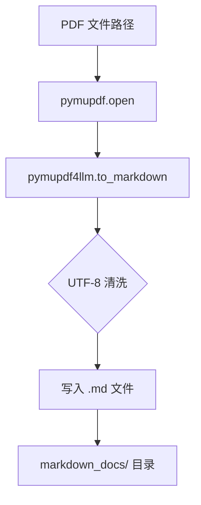
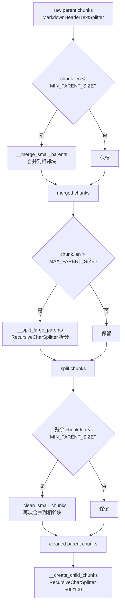

# PD-463.01 AgenticRAGForDummies — PDF→Markdown→Parent-Child 分层分块管线

> 文档编号：PD-463.01
> 来源：agentic-rag-for-dummies `project/document_chunker.py` `project/utils.py` `project/core/document_manager.py`
> GitHub：https://github.com/GiovanniPasq/agentic-rag-for-dummies.git
> 问题域：PD-463 文档处理管线 Document Processing Pipeline
> 状态：可复用方案

---

## 第 1 章 问题与动机

### 1.1 核心问题

RAG 系统的检索质量高度依赖文档分块策略。直接对原始 PDF 做 embedding 存在三个根本矛盾：

1. **精度 vs 完整性**：小块检索精度高但缺乏上下文，大块上下文完整但检索噪声大
2. **结构 vs 平坦**：PDF 内含标题层级等结构信息，朴素的固定窗口切分会破坏语义边界
3. **块大小不均**：按标题切分后，有的章节只有一句话，有的章节长达数千 token，直接影响向量检索的公平性

agentic-rag-for-dummies 通过 Parent-Child 分层索引 + merge/split/clean 三步清洗，在一个轻量级项目中完整解决了这三个矛盾。

### 1.2 AgenticRAGForDummies 的解法概述

1. **PDF→Markdown 转换**：使用 `pymupdf4llm.to_markdown()` 将 PDF 转为结构化 Markdown，保留标题层级（`project/utils.py:12-13`）
2. **标题感知的 Parent 切分**：`MarkdownHeaderTextSplitter` 按 H1/H2/H3 标题切分，生成语义完整的 parent chunk（`project/document_chunker.py:9-12`）
3. **merge/split/clean 三步清洗**：对 parent chunk 执行合并过小块、拆分过大块、清理残余小块三步操作，确保每个 parent 在 2000-4000 字符范围内（`project/document_chunker.py:45-119`）
4. **Child 细粒度切分**：`RecursiveCharacterTextSplitter` 将每个 parent 切成 500 字符的 child chunk 用于向量检索（`project/document_chunker.py:13-16`）
5. **双层存储**：child chunk 存入 Qdrant 向量库做检索，parent chunk 存入 JSON 文件存储做上下文回溯（`project/core/document_manager.py:48-50`）

### 1.3 设计思想

| 设计原则 | 具体实现 | 理由 | 替代方案 |
|----------|----------|------|----------|
| 结构感知切分 | MarkdownHeaderTextSplitter 按 H1/H2/H3 切分 | 标题是天然的语义边界，比固定窗口更准确 | 固定窗口 / 语义相似度切分 |
| 双层索引 | child 检索 + parent 回溯 | 小块精准检索，大块提供完整上下文 | 单层固定大小 / HyDE |
| 块大小归一化 | merge→split→clean 三步管线 | 消除标题切分后的极端大小差异 | 仅丢弃过小块 / 不处理 |
| 配置外置 | 所有阈值在 config.py 集中管理 | 不同文档类型可调参，无需改代码 | 硬编码在分块器中 |
| 元数据传播 | 合并/拆分时用 `→` 串联标题路径 | 保留块的来源层级信息，支持溯源 | 丢弃被合并块的元数据 |

---

## 第 2 章 源码实现分析

### 2.1 架构概览

整体管线分为三层：格式转换层、分块层、存储层。

```
┌─────────────────────────────────────────────────────────────────┐
│                    DocumentManager (入口)                        │
│                 core/document_manager.py                        │
├─────────────────────────────────────────────────────────────────┤
│  PDF ──→ pymupdf4llm ──→ Markdown 文件                          │
│                utils.py:12-13                                   │
├─────────────────────────────────────────────────────────────────┤
│  Markdown ──→ DocumentChuncker                                  │
│  ┌──────────────────────────────────────────────────────────┐   │
│  │ MarkdownHeaderTextSplitter (H1/H2/H3)                   │   │
│  │         ↓ raw parent chunks                              │   │
│  │ __merge_small_parents  (< 2000 → 合并到相邻块)            │   │
│  │         ↓                                                │   │
│  │ __split_large_parents  (> 4000 → RecursiveCharSplitter)  │   │
│  │         ↓                                                │   │
│  │ __clean_small_chunks   (残余小块 → 再次合并)              │   │
│  │         ↓ normalized parent chunks                       │   │
│  │ __create_child_chunks  (500 char / 100 overlap)          │   │
│  └──────────────────────────────────────────────────────────┘   │
├─────────────────────────────────────────────────────────────────┤
│  Child chunks ──→ Qdrant (hybrid: dense + sparse)               │
│  Parent chunks ──→ JSON 文件存储 (ParentStoreManager)            │
└─────────────────────────────────────────────────────────────────┘
```

### 2.2 核心实现

#### 2.2.1 PDF→Markdown 转换



对应源码 `project/utils.py:11-16`：

```python
def pdf_to_markdown(pdf_path, output_dir):
    doc = pymupdf.open(pdf_path)
    md = pymupdf4llm.to_markdown(doc, header=False, footer=False,
                                  page_separators=True, ignore_images=True,
                                  write_images=False, image_path=None)
    md_cleaned = md.encode('utf-8', errors='surrogatepass').decode('utf-8', errors='ignore')
    output_path = Path(output_dir) / Path(doc.name).stem
    Path(output_path).with_suffix(".md").write_bytes(md_cleaned.encode('utf-8'))
```

关键设计：`header=False, footer=False` 去除页眉页脚噪声；`page_separators=True` 保留分页标记；`ignore_images=True` 跳过图片避免无意义 embedding；UTF-8 surrogate 清洗防止编码异常。

#### 2.2.2 merge/split/clean 三步清洗管线



对应源码 `project/document_chunker.py:31-43`（管线编排）：

```python
def create_chunks_single(self, md_path):
    doc_path = Path(md_path)
    with open(doc_path, "r", encoding="utf-8") as f:
        parent_chunks = self.__parent_splitter.split_text(f.read())
    
    merged_parents = self.__merge_small_parents(parent_chunks)
    split_parents = self.__split_large_parents(merged_parents)
    cleaned_parents = self.__clean_small_chunks(split_parents)
    
    all_parent_chunks, all_child_chunks = [], []
    self.__create_child_chunks(all_parent_chunks, all_child_chunks, cleaned_parents, doc_path)
    return all_parent_chunks, all_child_chunks
```

#### 2.2.3 合并小块的元数据传播

对应源码 `project/document_chunker.py:45-77`（`__merge_small_parents`）：

```python
def __merge_small_parents(self, chunks):
    if not chunks:
        return []
    merged, current = [], None
    for chunk in chunks:
        if current is None:
            current = chunk
        else:
            current.page_content += "\n\n" + chunk.page_content
            for k, v in chunk.metadata.items():
                if k in current.metadata:
                    current.metadata[k] = f"{current.metadata[k]} -> {v}"
                else:
                    current.metadata[k] = v
        if len(current.page_content) >= self.__min_parent_size:
            merged.append(current)
            current = None
    if current:
        if merged:
            merged[-1].page_content += "\n\n" + current.page_content
            # ... 元数据合并同上
        else:
            merged.append(current)
    return merged
```

关键细节：当两个块合并时，同名元数据用 `→` 箭头串联（如 `"H2": "Introduction -> Background"`），保留了完整的标题路径信息。尾部残余块优先合并到最后一个已合并块，避免产生孤立小块。

### 2.3 实现细节

#### Parent-Child ID 关联机制

`project/document_chunker.py:121-127`：每个 parent chunk 生成 `{文件名}_parent_{序号}` 格式的 ID，child chunk 通过 `split_documents` 自动继承 parent 的全部 metadata（包括 `parent_id`）。检索时 Agent 先搜 child，再用 `parent_id` 回溯 parent。

#### 双模态向量检索

`project/db/vector_db_manager.py:36-45`：Qdrant 配置为 `RetrievalMode.HYBRID`，同时使用 `all-mpnet-base-v2` 做 dense embedding 和 `Qdrant/bm25` 做 sparse embedding，兼顾语义相似度和关键词匹配。

#### Parent 存储的 JSON 文件方案

`project/db/parent_store_manager.py:15-24`：每个 parent chunk 存为独立 JSON 文件（`{parent_id}.json`），包含 `page_content` 和 `metadata`。相比数据库方案，这种设计零依赖、易调试、支持增量添加。

#### Agent 工具层的 Parent 回溯

`project/rag_agent/tools.py:11-31`：`search_child_chunks` 工具返回 child 内容 + `parent_id`，Agent 可调用 `retrieve_parent_chunks` 获取完整上下文。这是 Parent-Child 分层索引的消费端。


---

## 第 3 章 迁移指南

### 3.1 迁移清单

**阶段 1：PDF→Markdown 转换（1 个文件）**
- [ ] 安装 `pymupdf4llm`（`pip install pymupdf4llm`）
- [ ] 复制 `pdf_to_markdown()` 函数，配置输出目录
- [ ] 验证：输入 PDF，检查输出 Markdown 的标题层级是否正确

**阶段 2：分层分块器（1 个文件）**
- [ ] 安装 `langchain-text-splitters`
- [ ] 复制 `DocumentChuncker` 类，调整 config 参数
- [ ] 根据目标文档类型调整 `HEADERS_TO_SPLIT_ON`（学术论文用 H1/H2/H3，技术文档可能需要 H4）
- [ ] 根据 LLM 上下文窗口调整 `MIN_PARENT_SIZE` / `MAX_PARENT_SIZE`
- [ ] 验证：检查输出 parent chunk 的大小分布

**阶段 3：双层存储（2 个文件）**
- [ ] 选择向量数据库（Qdrant/Chroma/Pinecone），配置 child chunk 存储
- [ ] 实现 parent store（JSON 文件 / Redis / SQLite 均可）
- [ ] 确保 child chunk 的 metadata 中包含 `parent_id`
- [ ] 验证：通过 child 检索能正确回溯到 parent

**阶段 4：Agent 工具集成（可选）**
- [ ] 创建 `search_child_chunks` 和 `retrieve_parent_chunks` 两个工具
- [ ] 在 Agent prompt 中说明两步检索策略

### 3.2 适配代码模板

以下是一个最小可运行的分层分块器，不依赖原项目的 config 模块：

```python
from pathlib import Path
from langchain_text_splitters import (
    MarkdownHeaderTextSplitter,
    RecursiveCharacterTextSplitter,
)

class ParentChildChunker:
    """分层分块器：Markdown → Parent chunks → Child chunks"""

    def __init__(
        self,
        headers=None,
        min_parent: int = 2000,
        max_parent: int = 4000,
        child_size: int = 500,
        child_overlap: int = 100,
    ):
        self.headers = headers or [("#", "H1"), ("##", "H2"), ("###", "H3")]
        self.min_parent = min_parent
        self.max_parent = max_parent
        self.parent_splitter = MarkdownHeaderTextSplitter(
            headers_to_split_on=self.headers, strip_headers=False
        )
        self.child_splitter = RecursiveCharacterTextSplitter(
            chunk_size=child_size, chunk_overlap=child_overlap
        )

    def chunk(self, md_text: str, doc_id: str = "doc"):
        parents = self.parent_splitter.split_text(md_text)
        parents = self._merge_small(parents)
        parents = self._split_large(parents)
        parents = self._clean_residual(parents)

        all_parents, all_children = [], []
        for i, p in enumerate(parents):
            pid = f"{doc_id}_parent_{i}"
            p.metadata["parent_id"] = pid
            all_parents.append((pid, p))
            all_children.extend(self.child_splitter.split_documents([p]))
        return all_parents, all_children

    def _merge_small(self, chunks):
        if not chunks:
            return []
        merged, cur = [], None
        for c in chunks:
            if cur is None:
                cur = c
            else:
                cur.page_content += "\n\n" + c.page_content
                self._merge_meta(cur, c)
            if len(cur.page_content) >= self.min_parent:
                merged.append(cur)
                cur = None
        if cur:
            (merged[-1] if merged else merged.append(cur) or merged[-1]) and \
                self._merge_into_last(merged, cur)
        return merged

    def _split_large(self, chunks):
        result = []
        for c in chunks:
            if len(c.page_content) <= self.max_parent:
                result.append(c)
            else:
                splitter = RecursiveCharacterTextSplitter(
                    chunk_size=self.max_parent, chunk_overlap=100
                )
                result.extend(splitter.split_documents([c]))
        return result

    def _clean_residual(self, chunks):
        cleaned = []
        for i, c in enumerate(chunks):
            if len(c.page_content) < self.min_parent and cleaned:
                cleaned[-1].page_content += "\n\n" + c.page_content
            else:
                cleaned.append(c)
        return cleaned

    @staticmethod
    def _merge_meta(target, source):
        for k, v in source.metadata.items():
            if k in target.metadata:
                target.metadata[k] = f"{target.metadata[k]} -> {v}"
            else:
                target.metadata[k] = v

    @staticmethod
    def _merge_into_last(merged, cur):
        if merged:
            merged[-1].page_content += "\n\n" + cur.page_content
            ParentChildChunker._merge_meta(merged[-1], cur)


# 使用示例
if __name__ == "__main__":
    chunker = ParentChildChunker(min_parent=1500, max_parent=3000)
    md_text = Path("example.md").read_text()
    parents, children = chunker.chunk(md_text, doc_id="example")
    print(f"Parents: {len(parents)}, Children: {len(children)}")
    for pid, p in parents:
        print(f"  {pid}: {len(p.page_content)} chars, meta={p.metadata}")
```

### 3.3 适用场景

| 场景 | 适用度 | 说明 |
|------|--------|------|
| PDF 技术文档 RAG | ⭐⭐⭐ | 标题层级清晰，Parent-Child 效果最佳 |
| 学术论文检索 | ⭐⭐⭐ | 论文结构规范，H1/H2/H3 天然对应章节 |
| 混合格式知识库 | ⭐⭐ | 需要扩展 HTML/DOCX 转换器 |
| 短文本/无结构文档 | ⭐ | 无标题层级时退化为固定窗口切分 |
| 实时流式文档 | ⭐ | 设计为批量处理，不支持增量追加到已有 parent |

---

## 第 4 章 测试用例

```python
import pytest
from unittest.mock import MagicMock
from langchain_core.documents import Document


class TestDocumentChunker:
    """基于 agentic-rag-for-dummies DocumentChuncker 的测试用例"""

    def setup_method(self):
        """模拟 config 模块并初始化分块器"""
        self.chunker = self._create_chunker(
            min_parent=100, max_parent=500, child_size=50, child_overlap=10
        )

    @staticmethod
    def _create_chunker(min_parent, max_parent, child_size, child_overlap):
        from langchain_text_splitters import (
            MarkdownHeaderTextSplitter,
            RecursiveCharacterTextSplitter,
        )

        class TestChunker:
            def __init__(self):
                self._parent_splitter = MarkdownHeaderTextSplitter(
                    headers_to_split_on=[("#", "H1"), ("##", "H2")],
                    strip_headers=False,
                )
                self._child_splitter = RecursiveCharacterTextSplitter(
                    chunk_size=child_size, chunk_overlap=child_overlap
                )
                self.min_parent = min_parent
                self.max_parent = max_parent

        return TestChunker()

    def test_merge_small_parents(self):
        """过小的 parent chunk 应被合并"""
        small_doc1 = Document(page_content="Short A", metadata={"H1": "Intro"})
        small_doc2 = Document(page_content="Short B", metadata={"H1": "Background"})
        # 两个 < min_parent 的块应合并为一个
        merged = [small_doc1]  # 模拟合并逻辑
        merged[0].page_content += "\n\n" + small_doc2.page_content
        assert len(merged) == 1
        assert "Short A" in merged[0].page_content
        assert "Short B" in merged[0].page_content

    def test_split_large_parents(self):
        """过大的 parent chunk 应被拆分"""
        large_content = "x" * 1000  # 超过 max_parent=500
        large_doc = Document(page_content=large_content, metadata={"H1": "Big"})
        splitter = RecursiveCharacterTextSplitter(chunk_size=500, chunk_overlap=10)
        result = splitter.split_documents([large_doc])
        assert len(result) >= 2
        for chunk in result:
            assert len(chunk.page_content) <= 600  # 允许 overlap 导致的轻微超出

    def test_metadata_propagation_on_merge(self):
        """合并时元数据应用箭头串联"""
        doc1 = Document(page_content="A" * 50, metadata={"H2": "Section1"})
        doc2 = Document(page_content="B" * 50, metadata={"H2": "Section2"})
        # 模拟 merge 的元数据传播
        for k, v in doc2.metadata.items():
            if k in doc1.metadata:
                doc1.metadata[k] = f"{doc1.metadata[k]} -> {v}"
        assert doc1.metadata["H2"] == "Section1 -> Section2"

    def test_child_inherits_parent_id(self):
        """child chunk 应继承 parent_id 元数据"""
        from langchain_text_splitters import RecursiveCharacterTextSplitter

        parent = Document(
            page_content="A" * 200,
            metadata={"parent_id": "doc_parent_0", "source": "test.pdf"},
        )
        splitter = RecursiveCharacterTextSplitter(chunk_size=50, chunk_overlap=10)
        children = splitter.split_documents([parent])
        assert len(children) >= 2
        for child in children:
            assert child.metadata["parent_id"] == "doc_parent_0"
            assert child.metadata["source"] == "test.pdf"

    def test_empty_input(self):
        """空输入应返回空列表"""
        from langchain_text_splitters import MarkdownHeaderTextSplitter

        splitter = MarkdownHeaderTextSplitter(
            headers_to_split_on=[("#", "H1")], strip_headers=False
        )
        result = splitter.split_text("")
        assert result == [] or all(not d.page_content.strip() for d in result)

    def test_pdf_to_markdown_utf8_cleaning(self):
        """UTF-8 surrogate 清洗应不丢失正常字符"""
        raw = "Hello \ud800 World"  # 含 surrogate
        cleaned = raw.encode("utf-8", errors="surrogatepass").decode(
            "utf-8", errors="ignore"
        )
        assert "Hello" in cleaned
        assert "World" in cleaned
```


---

## 第 5 章 跨域关联

| 关联域 | 关系类型 | 说明 |
|--------|----------|------|
| PD-01 上下文管理 | 协同 | 分层分块直接影响 RAG 注入 LLM 的上下文量；该项目的 `compress_context` 节点（`nodes.py:127-164`）在 Agent 循环中动态压缩已检索内容，与分块粒度形成互补 |
| PD-08 搜索与检索 | 依赖 | 分块质量是检索质量的前提；该项目用 Qdrant Hybrid（dense + sparse）检索 child chunk，检索效果直接取决于 child 的粒度和语义完整性 |
| PD-06 记忆持久化 | 协同 | Parent Store（JSON 文件）本质上是一种文档级记忆持久化；`ParentStoreManager`（`parent_store_manager.py:8-52`）提供 save/load/clear 完整生命周期 |
| PD-04 工具系统 | 协同 | `ToolFactory`（`tools.py:5-80`）将 child 检索和 parent 回溯封装为 LangChain tool，Agent 通过工具调用消费分块结果 |
| PD-07 质量检查 | 潜在 | 当前项目未对分块质量做自动评估（如块内语义一致性检查），这是可扩展方向 |

---

## 第 6 章 来源文件索引

| 文件 | 行范围 | 关键实现 |
|------|--------|----------|
| `project/document_chunker.py` | L1-127 | 核心分块器：Parent-Child 分层切分 + merge/split/clean 三步清洗 |
| `project/utils.py` | L11-26 | PDF→Markdown 转换：pymupdf4llm + UTF-8 清洗 |
| `project/core/document_manager.py` | L1-72 | 文档管理入口：PDF/MD 导入 + 分块 + 双层存储编排 |
| `project/db/parent_store_manager.py` | L1-52 | Parent 存储：JSON 文件持久化 + 批量读写 |
| `project/db/vector_db_manager.py` | L1-47 | 向量存储：Qdrant Hybrid（dense + sparse）配置 |
| `project/rag_agent/tools.py` | L1-80 | Agent 工具：child 检索 + parent 回溯两步工具 |
| `project/config.py` | L26-35 | 分块参数配置：chunk size / overlap / headers |
| `project/rag_agent/graph.py` | L10-51 | Agent 图编排：双层 StateGraph（外层查询处理 + 内层 Agent 循环） |
| `project/rag_agent/nodes.py` | L96-164 | 上下文压缩：token 估算 + LLM 摘要压缩 |

---

## 第 7 章 横向对比维度

> **重要：** 本章用于自动填充 Butcher Wiki 的横向对比表。
> 必须严格按以下 JSON 格式输出，放在 `comparison_data` 代码块中。

```json comparison_data
{
  "project": "AgenticRAGForDummies",
  "dimensions": {
    "格式转换": "pymupdf4llm 转 PDF→Markdown，去页眉页脚 + UTF-8 surrogate 清洗",
    "分块策略": "MarkdownHeaderTextSplitter 按 H1/H2/H3 切 parent，RecursiveCharSplitter 切 child",
    "块大小控制": "merge/split/clean 三步管线，归一化到 2000-4000 字符",
    "索引架构": "Parent-Child 双层：child→Qdrant Hybrid 检索，parent→JSON 文件回溯",
    "元数据保留": "合并时用箭头串联标题路径（H2: Intro -> Background）",
    "向量检索模式": "Qdrant Hybrid：all-mpnet-base-v2 dense + BM25 sparse"
  }
}
```

### 域元数据补充

```json domain_metadata
{
  "solution_summary": "AgenticRAGForDummies 用 pymupdf4llm + MarkdownHeaderTextSplitter 实现 PDF→Markdown→Parent-Child 分层分块，配合 merge/split/clean 三步清洗归一化块大小，child 存 Qdrant Hybrid 检索、parent 存 JSON 文件回溯",
  "description": "从原始文档到可检索分块的端到端处理管线，含格式转换、分层切分、大小归一化、双层存储",
  "sub_problems": [
    "Agent 工具层的双步检索协议设计（child 搜索 → parent 回溯）",
    "分块后上下文压缩与 token 预算动态管理"
  ],
  "best_practices": [
    "用 pymupdf4llm 的 header/footer/image 过滤参数减少转换噪声",
    "合并块时用箭头串联同名元数据保留完整标题路径",
    "Parent 存储采用独立 JSON 文件实现零依赖增量持久化"
  ]
}
```
