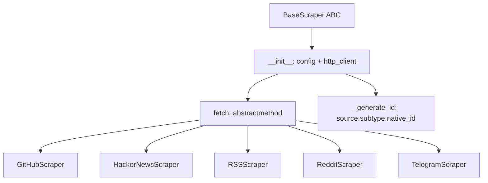
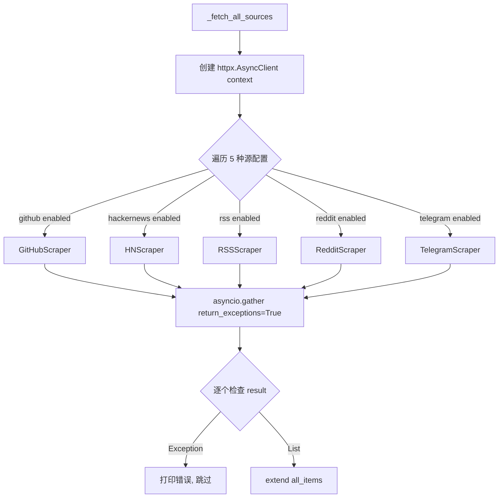
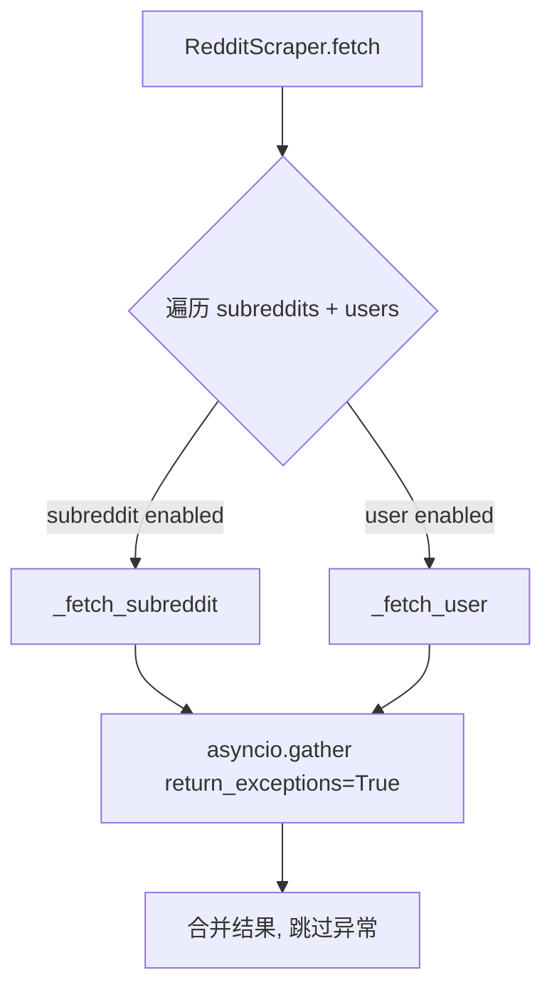

# PD-464.01 Horizon — BaseScraper 抽象基类 + asyncio.gather 五源并发聚合

> 文档编号：PD-464.01
> 来源：Horizon `src/scrapers/base.py`, `src/orchestrator.py`, `src/models.py`
> GitHub：https://github.com/Thysrael/Horizon.git
> 问题域：PD-464 多源数据聚合 Multi-Source Data Aggregation
> 状态：可复用方案

---

## 第 1 章 问题与动机

### 1.1 核心问题

信息聚合系统需要从多个异构数据源（API、RSS、网页抓取）并发获取内容，面临以下工程挑战：

1. **接口异构性**：GitHub 用 REST API + Token 认证，HackerNews 用 Firebase API，Reddit 用 JSON API + User-Agent 限制，Telegram 用 HTML 网页抓取 + BeautifulSoup 解析，RSS 用 feedparser 库——每个源的协议、认证、解析方式完全不同
2. **并发与错误隔离**：5 个数据源中任何一个超时或报错不应影响其他源的正常抓取
3. **数据模型统一**：不同源返回的原始数据结构差异巨大，需要归一化为统一模型才能进入后续 AI 分析管道
4. **配置驱动扩展**：新增数据源不应修改编排逻辑，只需添加配置和实现类
5. **跨源去重**：同一条新闻可能同时出现在 HackerNews 和 Reddit，需要 URL 归一化去重

### 1.2 Horizon 的解法概述

Horizon 采用 **BaseScraper 抽象基类 + 共享 httpx.AsyncClient + asyncio.gather 并发编排** 的三层架构：

1. **统一抽象层**：`BaseScraper` ABC 定义 `fetch(since) -> List[ContentItem]` 契约，所有 5 种 scraper 实现同一接口（`src/scrapers/base.py:11-34`）
2. **共享 HTTP 客户端**：`HorizonOrchestrator._fetch_all_sources()` 创建单个 `httpx.AsyncClient(timeout=30.0)` 上下文，注入所有 scraper 实例，复用连接池（`src/orchestrator.py:172`）
3. **并发 + 错误隔离**：`asyncio.gather(*tasks, return_exceptions=True)` 并发执行所有源，异常作为返回值而非抛出，逐个检查结果（`src/orchestrator.py:201-210`）
4. **Pydantic 配置体系**：每种源有独立的 Pydantic 配置模型（`GitHubSourceConfig`, `HackerNewsConfig`, `RSSSourceConfig`, `RedditConfig`, `TelegramConfig`），由顶层 `Config` 统一管理（`src/models.py:58-148`）
5. **跨源 URL 去重**：`_merge_cross_source_duplicates()` 通过 URL 归一化（去 www、去尾斜杠）合并同一内容的多源条目（`src/orchestrator.py:252-304`）

### 1.3 设计思想

| 设计原则 | 具体实现 | 理由 | 替代方案 |
|----------|----------|------|----------|
| 接口契约统一 | `BaseScraper.fetch(since) -> List[ContentItem]` | 编排层无需知道源的具体协议 | 每个源独立函数（无多态） |
| 共享连接池 | 单个 `httpx.AsyncClient` 注入所有 scraper | 减少 TCP 连接开销，统一超时配置 | 每个 scraper 自建 client |
| 故障隔离 | `return_exceptions=True` | 单源失败不阻塞其他源 | try/except 包裹每个 await |
| 配置即声明 | Pydantic BaseModel 嵌套配置树 | 类型安全 + 默认值 + 验证 | dict/YAML 手动解析 |
| 两层并发 | 编排层并发 5 源 + scraper 内部并发子任务 | 最大化 IO 利用率 | 串行抓取 |

---

## 第 2 章 源码实现分析

### 2.1 架构概览

Horizon 的数据聚合管道分为 4 层：

```
┌─────────────────────────────────────────────────────────┐
│                  HorizonOrchestrator                     │
│  _fetch_all_sources() → _merge_cross_source_duplicates() │
│  → _merge_topic_duplicates() → _analyze_content()        │
└──────────┬──────────────────────────────────────────────┘
           │ asyncio.gather(*tasks, return_exceptions=True)
           │ 共享 httpx.AsyncClient(timeout=30.0)
    ┌──────┼──────┬──────────┬──────────┬──────────┐
    ▼      ▼      ▼          ▼          ▼          ▼
┌───────┐┌───────┐┌────────┐┌────────┐┌──────────┐
│GitHub ││  HN   ││  RSS   ││ Reddit ││ Telegram │
│Scraper││Scraper││Scraper ││Scraper ││ Scraper  │
└───┬───┘└───┬───┘└───┬────┘└───┬────┘└────┬─────┘
    │        │        │         │           │
    ▼        ▼        ▼         ▼           ▼
┌─────────────────────────────────────────────────┐
│          ContentItem (Pydantic BaseModel)         │
│  id | source_type | title | url | content |       │
│  ai_score | ai_summary | ai_tags | metadata       │
└─────────────────────────────────────────────────┘
```

### 2.2 核心实现

#### 2.2.1 BaseScraper 抽象基类



对应源码 `src/scrapers/base.py:11-47`：

```python
class BaseScraper(ABC):
    """Abstract base class for all scrapers."""

    def __init__(self, config: dict, http_client: httpx.AsyncClient):
        self.config = config
        self.client = http_client

    @abstractmethod
    async def fetch(self, since: datetime) -> List[ContentItem]:
        pass

    def _generate_id(self, source_type: str, subtype: str, native_id: str) -> str:
        return f"{source_type}:{subtype}:{native_id}"
```

关键设计点：
- `http_client` 由外部注入而非内部创建，实现连接池共享（`base.py:14`）
- `_generate_id` 生成 `{source}:{subtype}:{native_id}` 格式的全局唯一 ID（`base.py:36-47`）
- `fetch` 接受 `since: datetime` 参数，统一时间窗口过滤语义

#### 2.2.2 编排层并发抓取



对应源码 `src/orchestrator.py:163-211`：

```python
async def _fetch_all_sources(self, since: datetime) -> List[ContentItem]:
    async with httpx.AsyncClient(timeout=30.0) as client:
        tasks = []

        if self.config.sources.github:
            github_scraper = GitHubScraper(self.config.sources.github, client)
            tasks.append(self._fetch_with_progress("GitHub", github_scraper, since))

        if self.config.sources.hackernews.enabled:
            hn_scraper = HackerNewsScraper(self.config.sources.hackernews, client)
            tasks.append(self._fetch_with_progress("Hacker News", hn_scraper, since))

        # ... RSS, Reddit, Telegram 同理

        results = await asyncio.gather(*tasks, return_exceptions=True)

        all_items = []
        for result in results:
            if isinstance(result, Exception):
                self.console.print(f"[red]Error fetching source: {result}[/red]")
            elif isinstance(result, list):
                all_items.extend(result)
        return all_items
```

关键设计点：
- `async with httpx.AsyncClient(timeout=30.0) as client` 确保连接池在所有 scraper 完成后正确关闭（`orchestrator.py:172`）
- 每个 scraper 通过 `_fetch_with_progress` 包装，添加进度显示（`orchestrator.py:213-236`）
- `return_exceptions=True` 使异常不会中断 gather，而是作为结果返回（`orchestrator.py:201`）

#### 2.2.3 Scraper 内部二级并发

以 RedditScraper 为例，内部也使用 `asyncio.gather` 并发抓取多个 subreddit：



对应源码 `src/scrapers/reddit.py:27-49`：

```python
async def fetch(self, since: datetime) -> List[ContentItem]:
    tasks = []
    for sub_cfg in self.reddit_config.subreddits:
        if sub_cfg.enabled:
            tasks.append(self._fetch_subreddit(sub_cfg, since))
    for user_cfg in self.reddit_config.users:
        if user_cfg.enabled:
            tasks.append(self._fetch_user(user_cfg, since))

    results = await asyncio.gather(*tasks, return_exceptions=True)
    items = []
    for result in results:
        if isinstance(result, Exception):
            logger.warning("Error fetching Reddit source: %s", result)
        elif isinstance(result, list):
            items.extend(result)
    return items
```

HackerNewsScraper 同样在内部并发获取 story 详情和 comments（`hackernews.py:39-40`, `hackernews.py:63`）。

### 2.3 实现细节

#### 统一数据模型 ContentItem

`src/models.py:18-35` 定义了所有源共用的 `ContentItem`：

```python
class ContentItem(BaseModel):
    id: str                              # {source}:{subtype}:{native_id}
    source_type: SourceType              # enum: github/hackernews/rss/reddit/telegram
    title: str
    url: HttpUrl
    content: Optional[str] = None
    author: Optional[str] = None
    published_at: datetime
    fetched_at: datetime = Field(default_factory=datetime.utcnow)
    metadata: Dict[str, Any] = Field(default_factory=dict)
    # AI 分析结果
    ai_score: Optional[float] = None
    ai_summary: Optional[str] = None
    ai_tags: List[str] = Field(default_factory=list)
```

`metadata` 字段是各源特有数据的逃生舱：Reddit 存 `subreddit`/`score`/`upvote_ratio`，HN 存 `descendants`/`discussion_url`，Telegram 存 `channel`/`msg_url`。

#### 跨源 URL 去重

`src/orchestrator.py:252-304` 实现了基于 URL 归一化的跨源去重：

```python
def normalize_url(url: str) -> str:
    parsed = urlparse(str(url))
    host = parsed.hostname or ""
    if host.startswith("www."):
        host = host[4:]
    path = parsed.path.rstrip("/")
    return f"{host}{path}"
```

去重策略：以内容最丰富的条目为主（`max(group, key=lambda x: len(x.content or ""))`），合并其他源的 metadata 和 content（`orchestrator.py:285-301`）。

#### 语义去重（Topic Dedup）

`src/orchestrator.py:348-382` 实现了基于标题相似度 + AI 标签重叠的语义去重：

- 标题 token 化：ASCII 词（≥3 字母）+ CJK 双字符 bigram（`orchestrator.py:307-314`）
- Jaccard 相似度 ≥ 0.33 或（标签重叠 ≥ 2 且 Jaccard ≥ 0.15）判定为重复（`orchestrator.py:370`）
- 保留 ai_score 最高的条目，将低分条目的 content 合并到高分条目

#### Telegram 特殊处理：HTML 抓取

TelegramScraper 不使用 API，而是抓取 `https://t.me/s/{channel}` 的公开网页预览，用 BeautifulSoup 解析 HTML（`telegram.py:50-64`）。这是因为 Telegram Bot API 需要 bot token 且无法访问公开频道历史消息，而 web preview 无需认证。

#### 速率限制处理

Reddit 和 Telegram scraper 都实现了 429 重试：检测 `Retry-After` 头，`asyncio.sleep` 后重试一次（`reddit.py:201-205`, `telegram.py:54-58`）。


---

## 第 3 章 迁移指南

### 3.1 迁移清单

**阶段 1：基础框架（必须）**

- [ ] 定义 `BaseScraper` ABC，包含 `fetch(since) -> List[YourItem]` 抽象方法
- [ ] 定义统一数据模型（Pydantic BaseModel），包含 `id`, `source_type`, `title`, `url`, `content`, `metadata`
- [ ] 定义 `SourceType` 枚举，列出所有数据源类型
- [ ] 实现编排函数：创建共享 `httpx.AsyncClient`，注入各 scraper，`asyncio.gather` 并发执行

**阶段 2：源实现（按需）**

- [ ] 为每种数据源实现 `BaseScraper` 子类
- [ ] 每个子类的 `__init__` 接收 typed config + shared http_client
- [ ] 内部多子源（如多个 subreddit）也用 `asyncio.gather` 并发

**阶段 3：去重与后处理（可选）**

- [ ] URL 归一化去重（去 www、去尾斜杠、去 fragment）
- [ ] 语义去重（标题 Jaccard 相似度）
- [ ] AI 评分 + 过滤

### 3.2 适配代码模板

```python
"""可直接复用的多源聚合框架模板。"""

import asyncio
from abc import ABC, abstractmethod
from datetime import datetime
from typing import List, Dict, Any, Optional
from enum import Enum

import httpx
from pydantic import BaseModel, HttpUrl, Field


# ── 1. 统一数据模型 ──

class SourceType(str, Enum):
    SOURCE_A = "source_a"
    SOURCE_B = "source_b"

class AggregatedItem(BaseModel):
    id: str
    source_type: SourceType
    title: str
    url: HttpUrl
    content: Optional[str] = None
    published_at: datetime
    metadata: Dict[str, Any] = Field(default_factory=dict)


# ── 2. 抽象基类 ──

class BaseScraper(ABC):
    def __init__(self, config: dict, http_client: httpx.AsyncClient):
        self.config = config
        self.client = http_client

    @abstractmethod
    async def fetch(self, since: datetime) -> List[AggregatedItem]:
        pass


# ── 3. 编排器 ──

class Aggregator:
    def __init__(self, scraper_configs: List[dict]):
        self.scraper_configs = scraper_configs

    async def fetch_all(self, since: datetime) -> List[AggregatedItem]:
        async with httpx.AsyncClient(timeout=30.0) as client:
            scrapers = self._build_scrapers(client)
            tasks = [s.fetch(since) for s in scrapers]
            results = await asyncio.gather(*tasks, return_exceptions=True)

            items = []
            for result in results:
                if isinstance(result, Exception):
                    print(f"Source failed: {result}")
                elif isinstance(result, list):
                    items.extend(result)
            return items

    def _build_scrapers(self, client: httpx.AsyncClient) -> List[BaseScraper]:
        # 根据配置实例化对应的 scraper
        raise NotImplementedError
```

### 3.3 适用场景

| 场景 | 适用度 | 说明 |
|------|--------|------|
| 新闻/内容聚合器 | ⭐⭐⭐ | 完美匹配，Horizon 本身就是此场景 |
| 多 API 数据采集 | ⭐⭐⭐ | 共享 client + gather 模式通用 |
| 竞品监控系统 | ⭐⭐⭐ | 多源抓取 + AI 评分过滤 |
| 实时流处理 | ⭐ | Horizon 是批处理模式，不适合实时流 |
| 单一 API 集成 | ⭐ | 过度设计，直接调用即可 |

---

## 第 4 章 测试用例

```python
"""基于 Horizon 真实函数签名的测试用例。"""

import asyncio
import pytest
from datetime import datetime, timezone, timedelta
from unittest.mock import AsyncMock, MagicMock, patch
import httpx

from src.models import ContentItem, SourceType, HackerNewsConfig, Config
from src.scrapers.base import BaseScraper
from src.scrapers.hackernews import HackerNewsScraper
from src.orchestrator import HorizonOrchestrator


class TestBaseScraper:
    """测试抽象基类契约。"""

    def test_cannot_instantiate_directly(self):
        """BaseScraper 是 ABC，不能直接实例化。"""
        with pytest.raises(TypeError):
            BaseScraper({}, MagicMock())

    def test_generate_id_format(self):
        """ID 格式为 source:subtype:native_id。"""
        class DummyScraper(BaseScraper):
            async def fetch(self, since):
                return []

        scraper = DummyScraper({}, MagicMock())
        assert scraper._generate_id("github", "event", "123") == "github:event:123"


class TestContentItem:
    """测试统一数据模型。"""

    def test_minimal_creation(self):
        item = ContentItem(
            id="test:story:1",
            source_type=SourceType.HACKERNEWS,
            title="Test Story",
            url="https://example.com",
            published_at=datetime.now(timezone.utc),
        )
        assert item.ai_score is None
        assert item.metadata == {}
        assert item.ai_tags == []

    def test_metadata_extensibility(self):
        """metadata 字段可存储任意源特有数据。"""
        item = ContentItem(
            id="reddit:subreddit:abc",
            source_type=SourceType.REDDIT,
            title="Reddit Post",
            url="https://reddit.com/r/test/abc",
            published_at=datetime.now(timezone.utc),
            metadata={"subreddit": "test", "score": 150, "upvote_ratio": 0.95},
        )
        assert item.metadata["subreddit"] == "test"
        assert item.metadata["score"] == 150


class TestCrossSourceDedup:
    """测试跨源 URL 去重。"""

    def _make_item(self, url: str, source: SourceType, content: str = "") -> ContentItem:
        return ContentItem(
            id=f"{source.value}:test:1",
            source_type=source,
            title="Same Story",
            url=url,
            content=content,
            published_at=datetime.now(timezone.utc),
        )

    def test_merge_same_url_different_sources(self):
        """同一 URL 来自不同源应合并。"""
        config = MagicMock(spec=Config)
        storage = MagicMock()
        orch = HorizonOrchestrator(config, storage)

        items = [
            self._make_item("https://example.com/article", SourceType.HACKERNEWS, "HN content"),
            self._make_item("https://www.example.com/article/", SourceType.REDDIT, "short"),
        ]
        merged = orch._merge_cross_source_duplicates(items)
        assert len(merged) == 1
        assert "merged_sources" in merged[0].metadata

    def test_no_merge_different_urls(self):
        """不同 URL 不应合并。"""
        config = MagicMock(spec=Config)
        storage = MagicMock()
        orch = HorizonOrchestrator(config, storage)

        items = [
            self._make_item("https://example.com/a", SourceType.HACKERNEWS),
            self._make_item("https://example.com/b", SourceType.REDDIT),
        ]
        merged = orch._merge_cross_source_duplicates(items)
        assert len(merged) == 2


class TestErrorIsolation:
    """测试单源故障不影响其他源。"""

    @pytest.mark.asyncio
    async def test_gather_with_exception(self):
        """asyncio.gather + return_exceptions 隔离单源故障。"""
        async def success():
            return [ContentItem(
                id="test:ok:1", source_type=SourceType.RSS,
                title="OK", url="https://ok.com",
                published_at=datetime.now(timezone.utc),
            )]

        async def failure():
            raise httpx.ConnectTimeout("timeout")

        results = await asyncio.gather(success(), failure(), return_exceptions=True)
        items = []
        for r in results:
            if isinstance(r, list):
                items.extend(r)
        assert len(items) == 1
        assert items[0].title == "OK"
```


---

## 第 5 章 跨域关联

| 关联域 | 关系类型 | 说明 |
|--------|----------|------|
| PD-01 上下文管理 | 协同 | ContentItem 的 content 字段在 AI 分析时需要截断（analyzer.py:68 截断到 800 字符），属于上下文窗口管理 |
| PD-03 容错与重试 | 依赖 | enricher.py 使用 tenacity `@retry(stop=stop_after_attempt(3), wait=wait_exponential)` 实现 AI 调用重试；Reddit/Telegram scraper 实现 429 速率限制重试 |
| PD-08 搜索与检索 | 协同 | enricher.py 使用 DuckDuckGo 搜索为高分条目补充背景知识，属于搜索增强 |
| PD-465 内容去重 | 强依赖 | `_merge_cross_source_duplicates` URL 去重和 `_merge_topic_duplicates` 语义去重是聚合后的必要步骤 |
| PD-466 AI 内容评分 | 强依赖 | ContentAnalyzer 对聚合后的 ContentItem 进行 AI 评分（0-10），过滤低分内容 |
| PD-11 可观测性 | 协同 | 编排器通过 Rich Console 输出每个源的抓取数量、子源分布、去重统计，提供运行时可见性 |

---

## 第 6 章 来源文件索引

| 文件 | 行范围 | 关键实现 |
|------|--------|----------|
| `src/scrapers/base.py` | L11-L47 | BaseScraper ABC 定义：fetch 抽象方法 + _generate_id |
| `src/models.py` | L9-L16 | SourceType 枚举（5 种源类型） |
| `src/models.py` | L18-L35 | ContentItem 统一数据模型 |
| `src/models.py` | L58-L148 | 5 种源配置 Pydantic 模型 + Config 顶层模型 |
| `src/orchestrator.py` | L163-L211 | _fetch_all_sources：共享 client + gather 并发 |
| `src/orchestrator.py` | L252-L304 | _merge_cross_source_duplicates：URL 归一化去重 |
| `src/orchestrator.py` | L306-L382 | _merge_topic_duplicates：标题 Jaccard + 标签语义去重 |
| `src/scrapers/hackernews.py` | L19-L142 | HN scraper：Firebase API + 并发 story/comment 获取 |
| `src/scrapers/reddit.py` | L20-L211 | Reddit scraper：多 subreddit 并发 + 429 重试 + 评论抓取 |
| `src/scrapers/telegram.py` | L21-L151 | Telegram scraper：HTML 抓取 + BeautifulSoup 解析 |
| `src/scrapers/rss.py` | L19-L165 | RSS scraper：feedparser + 环境变量 URL 模板 |
| `src/scrapers/github.py` | L15-L222 | GitHub scraper：user events + repo releases |
| `src/ai/enricher.py` | L24-L212 | 二次 AI 富化：概念提取 → 网页搜索 → 背景生成 |
| `src/ai/analyzer.py` | L13-L141 | AI 评分分析：batch 处理 + tenacity 重试 |

---

## 第 7 章 横向对比维度

```json comparison_data
{
  "project": "Horizon",
  "dimensions": {
    "源抽象方式": "BaseScraper ABC + fetch(since) 统一契约，5 种子类实现",
    "并发模型": "两层 asyncio.gather：编排层并发 5 源 + scraper 内部并发子任务",
    "错误隔离": "return_exceptions=True 逐个检查，单源失败不阻塞",
    "HTTP 客户端": "单个 httpx.AsyncClient 共享连接池，async with 上下文管理",
    "配置体系": "Pydantic 嵌套模型树，每种源独立 Config 类，JSON 驱动",
    "去重策略": "URL 归一化 + 标题 Jaccard + AI 标签重叠三层去重",
    "速率限制": "Reddit/Telegram 429 检测 + Retry-After sleep 重试"
  }
}
```

### 域元数据补充

```json domain_metadata
{
  "solution_summary": "Horizon 通过 BaseScraper ABC 统一 5 种异构源接口，共享 httpx.AsyncClient 连接池，两层 asyncio.gather 并发抓取，配合 URL 归一化 + Jaccard 语义三层去重",
  "description": "异构数据源的接口归一化与连接池共享策略",
  "sub_problems": [
    "跨源同一内容的 URL 归一化与内容合并",
    "语义级话题去重（标题相似度 + AI 标签重叠）",
    "无 API 数据源的 HTML 抓取与解析"
  ],
  "best_practices": [
    "共享 httpx.AsyncClient 上下文管理器统一连接池生命周期",
    "scraper 内部二级 gather 实现子源并发（如多 subreddit）",
    "metadata dict 作为源特有数据的逃生舱保持模型统一"
  ]
}
```

