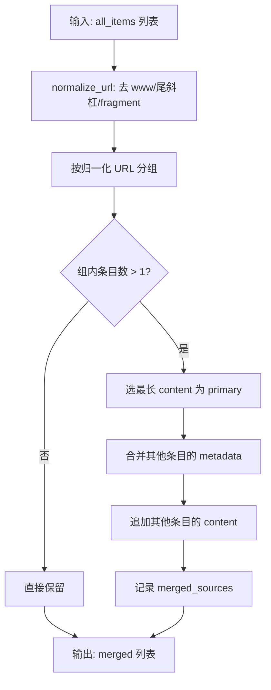
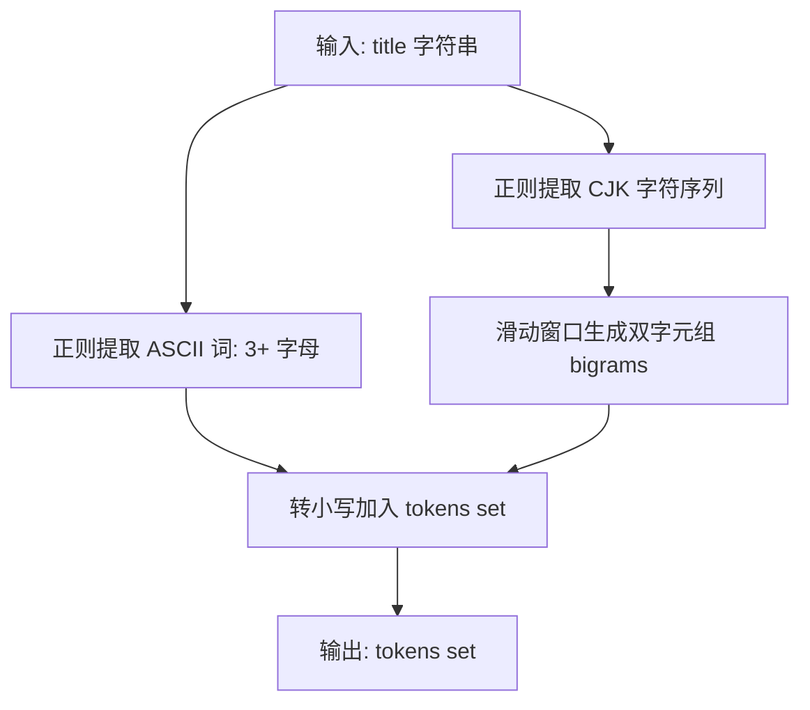
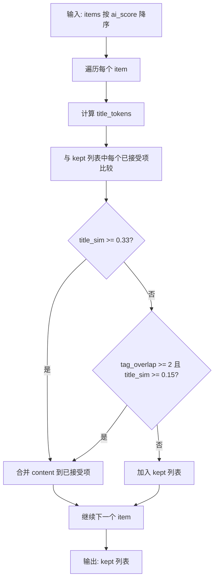

# PD-465.01 Horizon — 两层去重与跨源合并

> 文档编号：PD-465.01
> 来源：Horizon `src/orchestrator.py`
> GitHub：https://github.com/Thysrael/Horizon.git
> 问题域：PD-465 内容去重 Content Deduplication
> 状态：可复用方案

---

## 第 1 章 问题与动机

### 1.1 核心问题

多源信息聚合系统（如 Horizon）从 GitHub、Hacker News、RSS、Reddit、Telegram 等多个渠道并行抓取内容。同一篇文章或同一个话题极易被多个源同时收录，导致：

1. **URL 级重复**：同一篇博客文章同时出现在 HN 和 Reddit，URL 相同但 `www.` 前缀、尾斜杠、fragment 等细节不同
2. **话题级重复**：不同源对同一事件的报道，URL 不同但标题高度相似（如 "OpenAI releases GPT-5" vs "GPT-5 Released by OpenAI"）
3. **CJK 混合文本**：中英混合标题无法用简单的英文分词处理，需要同时支持 ASCII 词和 CJK 双字元组
4. **内容丢失风险**：简单去重会丢弃低分副本中独有的评论和讨论内容

如果不做去重，最终输出的每日摘要中会充斥大量重复条目，严重降低信息密度和用户体验。

### 1.2 Horizon 的解法概述

Horizon 在 `HorizonOrchestrator` 类中实现了两层去重策略，嵌入在主编排流水线的不同阶段：

1. **第一层：URL 归一化跨源合并**（`_merge_cross_source_duplicates`，`src/orchestrator.py:252`）— 在 AI 分析之前执行，基于 URL 归一化（去 `www.`/尾斜杠/fragment）将同 URL 条目合并，保留内容最丰富的条目作为主记录，并将其他源的评论追加到主记录中
2. **第二层：语义话题去重**（`_merge_topic_duplicates`，`src/orchestrator.py:348`）— 在 AI 评分和过滤之后执行，基于标题 Jaccard 相似度（ASCII 词 + CJK 双字元组）和 AI 标签重叠的双重判定，将话题重复的低分条目合并到高分条目中
3. **第三层：搜索结果自去重**（`src/search.py:88`）— 在关联搜索阶段，去除与条目自身 URL 相同的搜索结果

### 1.3 设计思想

| 设计原则 | 具体实现 | 理由 | 替代方案 |
|----------|----------|------|----------|
| 分层去重 | URL 级在 AI 前，语义级在 AI 后 | URL 去重减少 AI 调用量（省钱），语义去重依赖 AI 标签（需先分析） | 单层去重（要么漏要么贵） |
| 保留最丰富内容 | `max(group, key=lambda x: len(x.content or ""))` | 避免丢失有价值的长文本和评论 | 保留最新/最高分（可能丢内容） |
| 内容合并而非丢弃 | 副本的 content 追加到主记录 | 不同源的评论各有价值（HN 技术讨论 vs Reddit 社区反馈） | 直接丢弃副本（丢失讨论） |
| 双信号判定 | Jaccard ≥ 0.33 或 (标签重叠 ≥ 2 且 Jaccard ≥ 0.15) | 单一信号误判率高，双信号互补 | 仅标题相似度（标签不同的同话题会漏） |
| CJK 感知分词 | ASCII 3+ 字母词 + CJK 双字元组 | 中英混合标题需要同时处理两种文字系统 | 仅英文分词（CJK 标题全部漏判） |

---

## 第 2 章 源码实现分析

### 2.1 架构概览

Horizon 的去重逻辑嵌入在主编排流水线中，分布在三个阶段：

```
┌──────────────────────────────────────────────────────────────────┐
│                    HorizonOrchestrator.run()                     │
├──────────────────────────────────────────────────────────────────┤
│                                                                  │
│  1. _fetch_all_sources()          ← 多源并行抓取                  │
│         ↓ all_items                                              │
│  2. _merge_cross_source_duplicates()  ← 【第一层】URL 归一化合并  │
│         ↓ merged_items                                           │
│  3. _analyze_content()            ← AI 评分 + 标签生成            │
│         ↓ analyzed_items                                         │
│  4. filter(ai_score >= threshold) ← 分数过滤                     │
│         ↓ important_items (sorted by score desc)                 │
│  5. _merge_topic_duplicates()     ← 【第二层】语义话题去重        │
│         ↓ deduped_items                                          │
│  6. _enrich_important_items()     ← 二次 AI 富化                 │
│  7. _generate_summary()           ← 生成每日摘要                  │
│                                                                  │
└──────────────────────────────────────────────────────────────────┘
```

关键设计：第一层在 AI 分析之前执行（减少 API 调用），第二层在 AI 分析之后执行（利用 AI 生成的标签）。

### 2.2 核心实现

#### 2.2.1 URL 归一化与跨源合并



对应源码 `src/orchestrator.py:252-304`：

```python
def _merge_cross_source_duplicates(self, items: List[ContentItem]) -> List[ContentItem]:
    def normalize_url(url: str) -> str:
        parsed = urlparse(str(url))
        # Strip www prefix, trailing slashes, and fragments
        host = parsed.hostname or ""
        if host.startswith("www."):
            host = host[4:]
        path = parsed.path.rstrip("/")
        return f"{host}{path}"

    # Group by normalized URL
    url_groups: Dict[str, List[ContentItem]] = {}
    for item in items:
        key = normalize_url(str(item.url))
        url_groups.setdefault(key, []).append(item)

    merged = []
    for key, group in url_groups.items():
        if len(group) == 1:
            merged.append(group[0])
            continue

        # Pick the item with the richest content as primary
        primary = max(group, key=lambda x: len(x.content or ""))

        # Merge metadata and source info from other items
        all_sources = set()
        for item in group:
            all_sources.add(item.source_type.value)
            for mk, mv in item.metadata.items():
                if mk not in primary.metadata or not primary.metadata[mk]:
                    primary.metadata[mk] = mv

            # Append content from other sources
            if item is not primary and item.content:
                if primary.content and item.content not in primary.content:
                    primary.content = (primary.content or "") + \
                        f"\n\n--- From {item.source_type.value} ---\n" + item.content

        primary.metadata["merged_sources"] = list(all_sources)
        merged.append(primary)

    return merged
```

核心要点：
- `normalize_url` 只保留 `host + path`，丢弃 scheme、query、fragment（`src/orchestrator.py:263-270`）
- 主记录选择策略：`max(group, key=lambda x: len(x.content or ""))`（`src/orchestrator.py:285`）
- metadata 合并采用"不覆盖已有值"策略（`src/orchestrator.py:293-294`）
- content 追加带来源标签 `--- From {source} ---`（`src/orchestrator.py:299`）

#### 2.2.2 标题分词器（CJK + ASCII 混合）



对应源码 `src/orchestrator.py:306-314`：

```python
@staticmethod
def _title_tokens(title: str) -> set:
    tokens = set()
    for w in re.findall(r'[a-zA-Z]{3,}', title):
        tokens.add(w.lower())
    cjk = re.sub(r'[^\u4e00-\u9fff]', '', title)
    for i in range(len(cjk) - 1):
        tokens.add(cjk[i:i + 2])
    return tokens
```

设计细节：
- ASCII 词最少 3 个字母，过滤掉 "a"、"of"、"in" 等停用词（`src/orchestrator.py:309`）
- CJK 使用双字元组（bigram）而非单字，提高区分度（`src/orchestrator.py:312-313`）
- 返回 `set` 类型，天然去重，直接支持集合运算

#### 2.2.3 语义话题去重



对应源码 `src/orchestrator.py:348-382`：

```python
def _merge_topic_duplicates(
    self, items: List[ContentItem], threshold: float = 0.33
) -> List[ContentItem]:
    """Merge items covering the same topic into the highest-scored one.

    Two items are considered duplicates when either:
      - Title token Jaccard >= threshold, or
      - They share >= 2 ai_tags AND title Jaccard >= 0.15
    """
    kept: List[ContentItem] = []
    for item in items:
        tokens = self._title_tokens(item.title)
        item_tags = set(item.ai_tags or [])
        merged_into = None
        for accepted in kept:
            a_tokens = self._title_tokens(accepted.title)
            union = a_tokens | tokens
            title_sim = len(a_tokens & tokens) / len(union) if union else 0.0
            tag_overlap = len(set(accepted.ai_tags or []) & item_tags)
            if title_sim >= threshold or (tag_overlap >= 2 and title_sim >= 0.15):
                merged_into = accepted
                break
        if merged_into is not None:
            self._merge_item_content(merged_into, item)
        else:
            kept.append(item)
    return kept
```

关键设计决策：
- **双判定条件**：纯标题相似度 ≥ 0.33，或标签重叠 ≥ 2 且标题相似度 ≥ 0.15（`src/orchestrator.py:370`）
- **贪心策略**：按分数降序遍历，高分条目优先进入 kept 列表，低分副本被合并（`src/orchestrator.py:360-361`）
- **内容不丢弃**：通过 `_merge_item_content` 将副本的评论追加到主记录（`src/orchestrator.py:379`）

### 2.3 实现细节

#### 数据流与去重效果

```
多源抓取 (N 条)
    ↓ _merge_cross_source_duplicates
URL 去重后 (N - D1 条, D1 = URL 重复数)
    ↓ _analyze_content (AI 评分)
    ↓ filter(score >= threshold)
高分条目 (M 条)
    ↓ _merge_topic_duplicates
话题去重后 (M - D2 条, D2 = 话题重复数)
    ↓ _enrich_important_items
最终输出
```

#### 搜索结果自去重

`search.py:88-94` 中的第三层去重确保关联搜索结果不包含条目自身的 URL：

```python
# Dedup: remove results whose URL matches the item's own URL
item_url = str(item.url).rstrip("/")
related = []
for r in hn_results + reddit_results:
    if r["url"].rstrip("/") == item_url:
        continue
    related.append(r)
```

#### ContentItem 数据模型

去重依赖的关键字段定义在 `src/models.py:18-35`：

```python
class ContentItem(BaseModel):
    id: str                              # {source}:{subtype}:{native_id}
    source_type: SourceType              # 来源类型枚举
    title: str                           # 标题（去重核心字段）
    url: HttpUrl                         # URL（第一层去重键）
    content: Optional[str] = None        # 正文+评论（合并目标）
    metadata: Dict[str, Any] = Field(default_factory=dict)  # 元数据（合并目标）
    ai_tags: List[str] = Field(default_factory=list)         # AI 标签（第二层去重信号）
```


---

## 第 3 章 迁移指南

### 3.1 迁移清单

**阶段一：URL 归一化去重（1 个文件）**

- [ ] 定义 `normalize_url(url: str) -> str` 函数
- [ ] 实现 URL 分组逻辑（`dict.setdefault` 模式）
- [ ] 实现主记录选择策略（最长 content）
- [ ] 实现 metadata 合并（不覆盖已有值）
- [ ] 实现 content 追加（带来源标签）

**阶段二：标题分词器（1 个函数）**

- [ ] 实现 ASCII 词提取（`re.findall(r'[a-zA-Z]{3,}', title)`）
- [ ] 实现 CJK 双字元组提取
- [ ] 返回 `set` 类型

**阶段三：语义话题去重（1 个文件）**

- [ ] 确保输入已按相关性/分数降序排列
- [ ] 实现 Jaccard 相似度计算
- [ ] 实现双判定条件（标题相似度 + 标签重叠）
- [ ] 实现内容合并（副本 → 主记录）

### 3.2 适配代码模板

以下是可直接复用的去重模块，不依赖 Horizon 的其他组件：

```python
"""Content deduplication module — extracted from Horizon pattern."""

import re
from typing import List, Dict, Any, Protocol, Optional
from urllib.parse import urlparse


class Deduplicatable(Protocol):
    """Any item that supports deduplication must have these fields."""
    url: str
    title: str
    content: Optional[str]
    metadata: Dict[str, Any]
    tags: List[str]
    source: str
    score: float


def normalize_url(url: str) -> str:
    """Normalize URL for deduplication: strip www, trailing slash, fragment."""
    parsed = urlparse(str(url))
    host = parsed.hostname or ""
    if host.startswith("www."):
        host = host[4:]
    path = parsed.path.rstrip("/")
    return f"{host}{path}"


def title_tokens(title: str) -> set:
    """Extract tokens from title: ASCII words (3+ chars) + CJK bigrams."""
    tokens = set()
    for w in re.findall(r'[a-zA-Z]{3,}', title):
        tokens.add(w.lower())
    cjk = re.sub(r'[^\u4e00-\u9fff]', '', title)
    for i in range(len(cjk) - 1):
        tokens.add(cjk[i:i + 2])
    return tokens


def jaccard_similarity(a: set, b: set) -> float:
    """Compute Jaccard similarity between two sets."""
    union = a | b
    if not union:
        return 0.0
    return len(a & b) / len(union)


def merge_by_url(items: List[Dict[str, Any]], url_key: str = "url",
                 content_key: str = "content", source_key: str = "source") -> List[Dict[str, Any]]:
    """Layer 1: Merge items sharing the same normalized URL.

    Keeps the item with the longest content as primary.
    Appends content from duplicates with source labels.
    """
    groups: Dict[str, List[Dict[str, Any]]] = {}
    for item in items:
        key = normalize_url(item[url_key])
        groups.setdefault(key, []).append(item)

    merged = []
    for group in groups.values():
        if len(group) == 1:
            merged.append(group[0])
            continue

        primary = max(group, key=lambda x: len(x.get(content_key) or ""))
        sources = set()
        for item in group:
            sources.add(item.get(source_key, "unknown"))
            if item is not primary and item.get(content_key):
                existing = primary.get(content_key) or ""
                if item[content_key] not in existing:
                    primary[content_key] = existing + \
                        f"\n\n--- From {item.get(source_key, 'unknown')} ---\n{item[content_key]}"
        primary["merged_sources"] = list(sources)
        merged.append(primary)

    return merged


def merge_by_topic(items: List[Dict[str, Any]], title_key: str = "title",
                   tags_key: str = "tags", content_key: str = "content",
                   source_key: str = "source",
                   title_threshold: float = 0.33,
                   tag_min_overlap: int = 2,
                   tag_title_threshold: float = 0.15) -> List[Dict[str, Any]]:
    """Layer 2: Merge items covering the same topic.

    Items MUST be pre-sorted by score descending.
    Uses dual criteria: title Jaccard OR (tag overlap + relaxed title Jaccard).
    """
    kept: List[Dict[str, Any]] = []
    for item in items:
        tokens = title_tokens(item[title_key])
        item_tags = set(item.get(tags_key) or [])
        merged_into = None

        for accepted in kept:
            a_tokens = title_tokens(accepted[title_key])
            sim = jaccard_similarity(a_tokens, tokens)
            tag_overlap = len(set(accepted.get(tags_key) or []) & item_tags)

            if sim >= title_threshold or (tag_overlap >= tag_min_overlap and sim >= tag_title_threshold):
                merged_into = accepted
                break

        if merged_into is not None:
            # Merge content from duplicate into primary
            dup_content = item.get(content_key)
            if dup_content:
                existing = merged_into.get(content_key) or ""
                if dup_content not in existing:
                    merged_into[content_key] = existing + \
                        f"\n\n--- From {item.get(source_key, 'unknown')} ---\n{dup_content}"
        else:
            kept.append(item)

    return kept
```

### 3.3 适用场景

| 场景 | 适用度 | 说明 |
|------|--------|------|
| 多源新闻/资讯聚合 | ⭐⭐⭐ | 完美匹配：多源 + URL 重复 + 话题重复 |
| RSS 阅读器去重 | ⭐⭐⭐ | URL 归一化层即可覆盖大部分场景 |
| 搜索引擎结果去重 | ⭐⭐ | URL 层有效，语义层需调整阈值 |
| 学术论文去重 | ⭐ | 论文标题结构化程度高，需 DOI 级去重 |
| 社交媒体去重 | ⭐⭐ | 短文本标题 token 少，Jaccard 阈值需降低 |
| 中英混合内容平台 | ⭐⭐⭐ | CJK bigram 分词专为此设计 |

---

## 第 4 章 测试用例

```python
"""Tests for Horizon-style content deduplication."""

import pytest


class TestNormalizeUrl:
    def test_strip_www(self):
        from dedup import normalize_url
        assert normalize_url("https://www.example.com/post") == "example.com/post"

    def test_strip_trailing_slash(self):
        from dedup import normalize_url
        assert normalize_url("https://example.com/post/") == "example.com/post"

    def test_strip_fragment(self):
        from dedup import normalize_url
        assert normalize_url("https://example.com/post#section1") == "example.com/post"

    def test_strip_all(self):
        from dedup import normalize_url
        assert normalize_url("https://www.example.com/post/#top") == "example.com/post"

    def test_preserves_path(self):
        from dedup import normalize_url
        assert normalize_url("https://blog.example.com/2024/01/post") == "blog.example.com/2024/01/post"


class TestTitleTokens:
    def test_ascii_words(self):
        from dedup import title_tokens
        tokens = title_tokens("OpenAI releases GPT-5")
        assert "openai" in tokens
        assert "releases" in tokens
        assert "gpt" in tokens  # 3+ chars

    def test_short_words_excluded(self):
        from dedup import title_tokens
        tokens = title_tokens("A is on the go")
        assert "is" not in tokens  # < 3 chars
        assert "on" not in tokens
        assert "the" not in tokens

    def test_cjk_bigrams(self):
        from dedup import title_tokens
        tokens = title_tokens("人工智能新突破")
        assert "人工" in tokens
        assert "工智" in tokens
        assert "智能" in tokens
        assert "新突" in tokens
        assert "突破" in tokens

    def test_mixed_cjk_ascii(self):
        from dedup import title_tokens
        tokens = title_tokens("OpenAI发布GPT-5模型")
        assert "openai" in tokens
        assert "gpt" in tokens
        assert "发布" in tokens
        assert "模型" in tokens


class TestJaccardSimilarity:
    def test_identical(self):
        from dedup import jaccard_similarity
        assert jaccard_similarity({"a", "b"}, {"a", "b"}) == 1.0

    def test_disjoint(self):
        from dedup import jaccard_similarity
        assert jaccard_similarity({"a", "b"}, {"c", "d"}) == 0.0

    def test_partial_overlap(self):
        from dedup import jaccard_similarity
        sim = jaccard_similarity({"a", "b", "c"}, {"b", "c", "d"})
        assert abs(sim - 0.5) < 0.01  # 2/4

    def test_empty_sets(self):
        from dedup import jaccard_similarity
        assert jaccard_similarity(set(), set()) == 0.0


class TestMergeByUrl:
    def test_no_duplicates(self):
        from dedup import merge_by_url
        items = [
            {"url": "https://a.com/1", "content": "A", "source": "hn"},
            {"url": "https://b.com/2", "content": "B", "source": "reddit"},
        ]
        result = merge_by_url(items)
        assert len(result) == 2

    def test_merge_www_duplicate(self):
        from dedup import merge_by_url
        items = [
            {"url": "https://www.example.com/post", "content": "Short", "source": "hn"},
            {"url": "https://example.com/post", "content": "Longer content here", "source": "reddit"},
        ]
        result = merge_by_url(items)
        assert len(result) == 1
        assert "Longer content here" in result[0]["content"]
        assert "--- From hn ---" in result[0]["content"]

    def test_keeps_richest_content(self):
        from dedup import merge_by_url
        items = [
            {"url": "https://example.com/post/", "content": "x" * 100, "source": "rss"},
            {"url": "https://example.com/post", "content": "y" * 10, "source": "hn"},
        ]
        result = merge_by_url(items)
        assert result[0]["content"].startswith("x" * 100)


class TestMergeByTopic:
    def test_similar_titles_merged(self):
        from dedup import merge_by_topic
        items = [
            {"title": "OpenAI releases GPT-5 model", "tags": ["ai", "gpt"], "content": "A", "source": "hn", "score": 9},
            {"title": "GPT-5 Released by OpenAI", "tags": ["ai", "llm"], "content": "B", "source": "reddit", "score": 7},
        ]
        result = merge_by_topic(items)
        assert len(result) == 1
        assert "--- From reddit ---" in result[0]["content"]

    def test_different_titles_kept(self):
        from dedup import merge_by_topic
        items = [
            {"title": "OpenAI releases GPT-5", "tags": ["ai"], "content": "A", "source": "hn", "score": 9},
            {"title": "Rust 2.0 announced", "tags": ["rust"], "content": "B", "source": "reddit", "score": 8},
        ]
        result = merge_by_topic(items)
        assert len(result) == 2

    def test_tag_overlap_triggers_merge(self):
        from dedup import merge_by_topic
        items = [
            {"title": "New breakthrough in AI safety research", "tags": ["ai-safety", "alignment", "research"],
             "content": "A", "source": "hn", "score": 9},
            {"title": "AI alignment progress report 2024", "tags": ["ai-safety", "alignment"],
             "content": "B", "source": "rss", "score": 7},
        ]
        result = merge_by_topic(items)
        # tag_overlap=2, title_sim likely >= 0.15 → merged
        assert len(result) == 1
```


---

## 第 5 章 跨域关联

| 关联域 | 关系类型 | 说明 |
|--------|----------|------|
| PD-08 搜索与检索 | 协同 | 搜索结果自去重（`search.py:88`）是去重的第三层，确保关联搜索不返回自身 URL |
| PD-01 上下文管理 | 协同 | 内容合并（追加副本 content）会增加单条目的文本长度，影响后续 AI 分析的上下文窗口 |
| PD-07 质量检查 | 依赖 | 语义去重依赖 AI 评分（`ai_score`）和标签（`ai_tags`），必须在 AI 分析之后执行 |
| PD-11 可观测性 | 协同 | 去重过程输出详细日志（`title_sim`、`tag_overlap`），支持调试和阈值调优 |
| PD-02 多 Agent 编排 | 协同 | 去重嵌入在编排流水线的特定阶段，阶段顺序影响去重效果和 API 成本 |
| PD-466 AI 内容评分 | 依赖 | 第二层去重的 `ai_tags` 和排序依据 `ai_score` 均来自 AI 评分阶段 |
| PD-464 多源数据聚合 | 前置 | 去重的输入来自多源聚合的输出，源越多 URL 重复概率越高 |

---

## 第 6 章 来源文件索引

| 文件 | 行范围 | 关键实现 |
|------|--------|----------|
| `src/orchestrator.py` | L25-26 | `HorizonOrchestrator` 类定义 |
| `src/orchestrator.py` | L60-61 | 第一层去重调用点 |
| `src/orchestrator.py` | L84-91 | 第二层去重调用点 |
| `src/orchestrator.py` | L252-304 | `_merge_cross_source_duplicates` — URL 归一化跨源合并 |
| `src/orchestrator.py` | L263-270 | `normalize_url` — URL 归一化函数 |
| `src/orchestrator.py` | L285 | 主记录选择：`max(group, key=lambda x: len(x.content or ""))` |
| `src/orchestrator.py` | L306-314 | `_title_tokens` — CJK + ASCII 混合分词器 |
| `src/orchestrator.py` | L338-346 | `_merge_item_content` — 内容追加辅助函数 |
| `src/orchestrator.py` | L348-382 | `_merge_topic_duplicates` — 语义话题去重（双判定） |
| `src/orchestrator.py` | L370 | 双判定条件：`title_sim >= 0.33 or (tag_overlap >= 2 and title_sim >= 0.15)` |
| `src/models.py` | L18-35 | `ContentItem` 数据模型（去重依赖字段） |
| `src/ai/analyzer.py` | L137-140 | AI 标签生成（`ai_tags`，第二层去重信号源） |
| `src/search.py` | L88-94 | 搜索结果自去重（URL 精确匹配） |

---

## 第 7 章 横向对比维度

```json comparison_data
{
  "project": "Horizon",
  "dimensions": {
    "去重层级": "两层：URL归一化 + Jaccard语义，分别在AI前后执行",
    "相似度算法": "Jaccard(ASCII词+CJK双字元组) + AI标签重叠双判定",
    "合并策略": "保留最长content为主记录，副本content带来源标签追加",
    "CJK支持": "正则提取CJK字符后滑动窗口生成bigram",
    "阈值设计": "标题Jaccard≥0.33 或 标签重叠≥2且Jaccard≥0.15",
    "去重时机": "URL去重在AI分析前(省API)，语义去重在AI分析后(用标签)"
  }
}
```

### 域元数据补充

```json domain_metadata
{
  "solution_summary": "Horizon 用 URL 归一化 + Jaccard(ASCII词+CJK bigram) + AI 标签重叠的两层去重策略，在 AI 分析前后分阶段执行，副本内容追加而非丢弃",
  "description": "多源聚合场景下分阶段去重与内容合并的工程实践",
  "sub_problems": [
    "去重时机选择对API成本的影响",
    "副本内容追加时的来源标注与可追溯性"
  ],
  "best_practices": [
    "URL去重在AI分析前执行以减少API调用量",
    "语义去重后将副本content带来源标签追加到主记录而非丢弃",
    "双判定条件(标题相似度+标签重叠)降低单信号误判率"
  ]
}
```

