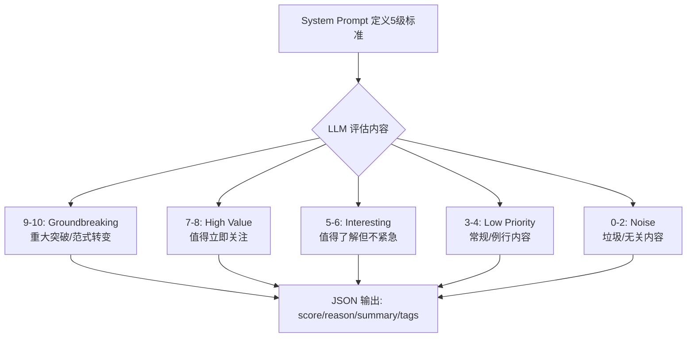
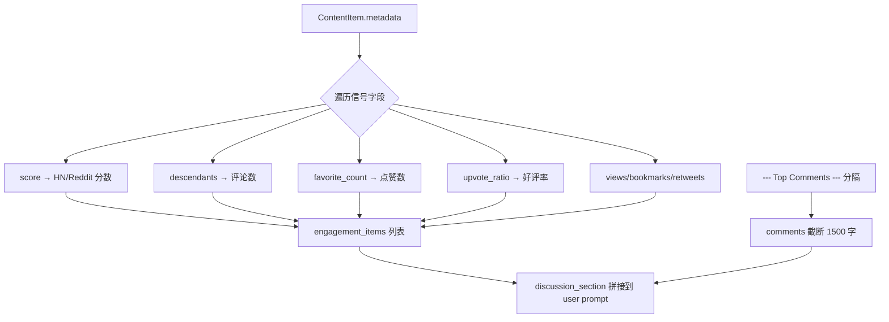

# PD-466.01 Horizon — 结构化 Prompt 五级评分与社区信号融合

> 文档编号：PD-466.01
> 来源：Horizon `src/ai/prompts.py` `src/ai/analyzer.py`
> GitHub：https://github.com/Thysrael/Horizon.git
> 问题域：PD-466 AI 内容评分 AI Content Scoring
> 状态：可复用方案

---

## 第 1 章 问题与动机（≥ 30 行）

### 1.1 核心问题

信息聚合系统每天从 GitHub、Hacker News、RSS、Reddit、Telegram 等多源抓取数百条内容，人工筛选不可持续。需要一个 AI 评分系统，能够：

1. **量化内容重要性**：将主观的"值不值得看"转化为 0-10 分的客观评分
2. **融合社区信号**：不仅看内容本身，还要考虑社区讨论质量（upvotes、comments、ratio）
3. **结构化输出**：AI 返回 JSON 格式的 score/reason/summary/tags，便于下游过滤和展示
4. **容错解析**：LLM 输出不稳定，需要处理 markdown 代码块包裹的 JSON 等非标准格式
5. **批量处理**：支持数百条内容的批量评分，带进度展示和失败降级

### 1.2 Horizon 的解法概述

Horizon 采用"结构化 Prompt + 多源信号融合 + 三层 JSON 容错"的方案：

1. **五级评分标准 Prompt**：在 system prompt 中定义 5 个分级（0-2/3-4/5-6/7-8/9-10），每级含具体示例和判断标准（`src/ai/prompts.py:3-40`）
2. **社区信号注入**：从 ContentItem.metadata 中提取 score/descendants/upvote_ratio/favorites 等互动指标，拼接到 user prompt 的 discussion_section（`src/ai/analyzer.py:78-103`）
3. **评论内容分离**：用 `--- Top Comments ---` 分隔符将正文和评论拆开，分别截断控制 token 消耗（`src/ai/analyzer.py:66-76`）
4. **三层 JSON 解析**：先 `json.loads` 直接解析 → 再尝试 ` ```json ` 代码块提取 → 最后尝试通用 ` ``` ` 代码块提取（`src/ai/analyzer.py:123-134`）
5. **批量进度管理**：Rich Progress 进度条 + 单条失败降级（score=0, reason="Analysis failed"）不阻塞整体流程（`src/ai/analyzer.py:19-48`）

### 1.3 设计思想

| 设计原则 | 具体实现 | 理由 | 替代方案 |
|----------|----------|------|----------|
| 分级评分标准 | 5 级 0-10 分，每级含示例 | 减少 LLM 评分漂移，锚定分数含义 | 单一"请打分"指令（不稳定） |
| 信号融合 | metadata 字段动态拼接到 prompt | 让 AI 综合内容质量+社区反馈 | 纯规则加权（不灵活） |
| 内容截断 | 正文 1000 字 + 评论 1500 字 | 控制 token 成本，保留关键信息 | 全文输入（成本高） |
| 容错解析 | 三层 fallback JSON 解析 | LLM 常在 JSON 外包裹 markdown | 强制 JSON mode（部分模型不支持） |
| 优雅降级 | 单条失败 score=0 继续 | 不因一条内容失败阻塞全部 | 全批次重试（浪费资源） |
| 多提供商抽象 | AIClient ABC + 工厂函数 | 支持 Anthropic/OpenAI/Gemini/Doubao | 硬编码单一提供商 |

---

## 第 2 章 源码实现分析（≥ 60 行，核心章节）

### 2.1 架构概览

Horizon 的 AI 评分系统由 4 个核心模块组成，形成两阶段评分-富化管线：

```
┌──────────────┐     ┌──────────────────┐     ┌──────────────────┐
│  Orchestrator │────→│ ContentAnalyzer   │────→│ ContentEnricher   │
│  (编排入口)    │     │ (第1轮: 评分+标签) │     │ (第2轮: 背景知识)  │
└──────────────┘     └──────────────────┘     └──────────────────┘
        │                     │                        │
        │              ┌──────┴──────┐          ┌──────┴──────┐
        │              │   prompts   │          │  DuckDuckGo  │
        │              │ (评分标准)   │          │  (Web搜索)   │
        │              └─────────────┘          └─────────────┘
        │
        ▼
┌──────────────┐     ┌──────────────────┐
│  AIClient    │────→│ DailySummarizer   │
│  (多提供商)   │     │ (Markdown 输出)   │
└──────────────┘     └──────────────────┘
```

数据流：多源抓取 → AI 评分（第1轮）→ 阈值过滤 → 语义去重 → AI 富化（第2轮）→ Markdown 输出

### 2.2 核心实现

#### 2.2.1 五级评分标准 Prompt



对应源码 `src/ai/prompts.py:3-62`：

```python
CONTENT_ANALYSIS_SYSTEM = """You are an expert content curator helping filter important technical and academic information.

Score content on a 0-10 scale based on importance and relevance:

**9-10: Groundbreaking** - Major breakthroughs, paradigm shifts, or highly significant announcements
- New major version releases of widely-used technologies
- Significant research breakthroughs
- Important industry-changing announcements

**7-8: High Value** - Important developments worth immediate attention
- Interesting technical deep-dives
- Novel approaches to known problems
- Insightful analysis or commentary
- Valuable tools or libraries

**5-6: Interesting** - Worth knowing but not urgent
...
**0-2: Noise** - Not relevant or low quality
...

Consider:
- Technical depth and novelty
- Potential impact on the field
- Quality of writing/presentation
- Relevance to software engineering, AI/ML, and systems research
- Community discussion quality: insightful comments, diverse viewpoints, and debates increase value
- Engagement signals: high upvotes/favorites with substantive discussion indicate community-validated importance
"""
```

关键设计：system prompt 末尾两条 Consider 规则明确要求 LLM 将社区讨论质量和互动信号纳入评分考量，而非仅看内容本身。

#### 2.2.2 社区信号动态拼接



对应源码 `src/ai/analyzer.py:62-113`：

```python
# Prepare content section
content_section = ""
if item.content:
    content_text = item.content
    if "--- Top Comments ---" in content_text:
        main, comments_part = content_text.split("--- Top Comments ---", 1)
        content_section = f"Content: {main.strip()[:800]}"
    else:
        content_section = f"Content: {content_text[:1000]}"

# Prepare discussion section (comments, engagement)
discussion_parts = []
if item.content and "--- Top Comments ---" in item.content:
    comments_part = item.content.split("--- Top Comments ---", 1)[1]
    discussion_parts.append(f"Community Comments:\n{comments_part[:1500]}")

meta = item.metadata
engagement_items = []
if meta.get("score"):
    engagement_items.append(f"score: {meta['score']}")
if meta.get("descendants"):
    engagement_items.append(f"{meta['descendants']} comments")
if meta.get("upvote_ratio"):
    engagement_items.append(f"upvote ratio: {meta['upvote_ratio']:.0%}")
if engagement_items:
    discussion_parts.append(f"Engagement: {', '.join(engagement_items)}")
```

关键设计：engagement 信号采用"有则拼、无则跳"的动态策略，不同来源（HN 有 score/descendants，Reddit 有 upvote_ratio，Twitter 有 views/bookmarks）自动适配。

### 2.3 实现细节

#### 三层 JSON 容错解析

`src/ai/analyzer.py:122-134` 实现了三层 fallback：

```python
try:
    result = json.loads(response)          # 层1: 直接解析
except json.JSONDecodeError:
    if "```json" in response:              # 层2: ```json 代码块
        json_str = response.split("```json")[1].split("```")[0].strip()
        result = json.loads(json_str)
    elif "```" in response:                # 层3: 通用 ``` 代码块
        json_str = response.split("```")[1].split("```")[0].strip()
        result = json.loads(json_str)
    else:
        raise ValueError(f"Invalid JSON response: {response}")
```

同样的三层解析在 `src/ai/enricher.py:168-178` 中被复制使用，说明这是一个经过验证的通用模式。

#### 批量评分与优雅降级

`src/ai/analyzer.py:19-48` 的批量处理逻辑：

- 使用 Rich Progress 显示进度条（SpinnerColumn + BarColumn + MofNCompleteColumn）
- 按 batch_size=10 分批，但实际逐条调用 AI（非并发），避免 rate limit
- 单条失败时降级为 `score=0, reason="Analysis failed", summary=item.title`
- 使用 tenacity `@retry(stop=stop_after_attempt(3), wait=wait_exponential(min=2, max=10))` 自动重试

#### 多提供商 AI 客户端

`src/ai/client.py:15-212` 通过 ABC 抽象 + 工厂模式支持 4 个提供商：

- `AnthropicClient` → Claude 系列
- `OpenAIClient` → GPT 系列 + Doubao（兼容 OpenAI API）
- `GeminiClient` → Google Gemini
- `create_ai_client()` 工厂函数根据 `AIConfig.provider` 枚举分发

#### 阈值过滤与语义去重

`src/orchestrator.py:73-91` 中，评分完成后：

1. 按 `ai_score_threshold`（默认 7.0）过滤低分内容
2. 按分数降序排列
3. `_merge_topic_duplicates()` 用标题 Jaccard 相似度（阈值 0.33）+ AI tags 重叠（≥2 且 title_sim≥0.15）进行语义去重

---

## 第 3 章 迁移指南（≥ 40 行）

### 3.1 迁移清单

**阶段 1：评分 Prompt 设计**
- [ ] 定义你的评分维度（技术深度、影响力、新颖性等）
- [ ] 编写 5 级评分标准，每级含 2-3 个具体示例
- [ ] 在 system prompt 末尾加入"社区信号考量"指令
- [ ] 定义 JSON 输出 schema（score/reason/summary/tags）

**阶段 2：信号融合**
- [ ] 定义 ContentItem 数据模型（Pydantic BaseModel）
- [ ] 实现 metadata 字段的动态拼接逻辑
- [ ] 实现内容/评论分离（用分隔符或独立字段）
- [ ] 设置内容截断阈值（正文 800-1000 字，评论 1500 字）

**阶段 3：容错与批量**
- [ ] 实现三层 JSON 容错解析
- [ ] 添加 tenacity 重试装饰器（3 次，指数退避）
- [ ] 实现单条失败降级逻辑
- [ ] 添加 Rich Progress 进度展示

**阶段 4：过滤与去重**
- [ ] 配置 ai_score_threshold（建议 7.0）
- [ ] 实现标题 Jaccard 语义去重
- [ ] 可选：AI tags 辅助去重

### 3.2 适配代码模板

以下是一个可直接复用的最小评分系统模板：

```python
"""Minimal AI content scoring system adapted from Horizon."""

import json
from typing import List, Optional
from pydantic import BaseModel, Field
from tenacity import retry, stop_after_attempt, wait_exponential


# --- 数据模型 ---
class ScoredItem(BaseModel):
    id: str
    title: str
    content: Optional[str] = None
    metadata: dict = Field(default_factory=dict)
    ai_score: Optional[float] = None
    ai_reason: Optional[str] = None
    ai_summary: Optional[str] = None
    ai_tags: List[str] = Field(default_factory=list)


# --- 评分 Prompt ---
SCORING_SYSTEM = """You are an expert content curator.
Score content on a 0-10 scale:

**9-10: Groundbreaking** - Major breakthroughs, paradigm shifts
**7-8: High Value** - Important, worth immediate attention
**5-6: Interesting** - Worth knowing but not urgent
**3-4: Low Priority** - Generic or routine
**0-2: Noise** - Not relevant or low quality

Consider engagement signals and community discussion quality."""

SCORING_USER = """Analyze and return JSON:
Title: {title}
{content_section}
{discussion_section}

{{"score": <0-10>, "reason": "<why>", "summary": "<one-line>", "tags": ["<tag>"]}}"""


# --- 三层 JSON 容错解析 ---
def parse_llm_json(response: str) -> dict:
    """Parse JSON from LLM response with markdown code block fallback."""
    try:
        return json.loads(response)
    except json.JSONDecodeError:
        if "```json" in response:
            json_str = response.split("```json")[1].split("```")[0].strip()
            return json.loads(json_str)
        elif "```" in response:
            json_str = response.split("```")[1].split("```")[0].strip()
            return json.loads(json_str)
        raise ValueError(f"Cannot parse JSON from: {response[:200]}")


# --- 信号融合 ---
def build_discussion_section(item: ScoredItem) -> str:
    """Dynamically build discussion section from metadata."""
    parts = []
    meta = item.metadata
    signals = []
    for key, label in [
        ("score", "score"), ("descendants", "comments"),
        ("upvote_ratio", "upvote ratio"), ("views", "views"),
    ]:
        if meta.get(key):
            val = f"{meta[key]:.0%}" if key == "upvote_ratio" else str(meta[key])
            signals.append(f"{label}: {val}")
    if signals:
        parts.append(f"Engagement: {', '.join(signals)}")
    return "\n".join(parts)


# --- 评分器 ---
class ContentScorer:
    def __init__(self, llm_complete_fn):
        """llm_complete_fn: async (system, user, temperature) -> str"""
        self.complete = llm_complete_fn

    @retry(stop=stop_after_attempt(3), wait=wait_exponential(min=2, max=10))
    async def score_item(self, item: ScoredItem) -> None:
        content_section = f"Content: {item.content[:1000]}" if item.content else ""
        discussion_section = build_discussion_section(item)

        response = await self.complete(
            system=SCORING_SYSTEM,
            user=SCORING_USER.format(
                title=item.title,
                content_section=content_section,
                discussion_section=discussion_section,
            ),
            temperature=0.3,
        )

        result = parse_llm_json(response)
        item.ai_score = float(result.get("score", 0))
        item.ai_reason = result.get("reason", "")
        item.ai_summary = result.get("summary", item.title)
        item.ai_tags = result.get("tags", [])

    async def score_batch(self, items: List[ScoredItem]) -> List[ScoredItem]:
        for item in items:
            try:
                await self.score_item(item)
            except Exception:
                item.ai_score = 0.0
                item.ai_reason = "Analysis failed"
                item.ai_summary = item.title
        return items
```

### 3.3 适用场景

| 场景 | 适用度 | 说明 |
|------|--------|------|
| 技术新闻聚合 | ⭐⭐⭐ | Horizon 的原生场景，直接复用 |
| 论文筛选系统 | ⭐⭐⭐ | 修改评分标准为学术维度即可 |
| 社交媒体监控 | ⭐⭐ | 需扩展 engagement 信号类型 |
| 内部知识库质量评估 | ⭐⭐ | 无社区信号，需依赖内容本身 |
| 实时流式评分 | ⭐ | 当前为批量模式，需改造为流式 |

---

## 第 4 章 测试用例（≥ 20 行）

```python
"""Tests for Horizon-style AI content scoring system."""

import json
import pytest
from unittest.mock import AsyncMock


# --- parse_llm_json 测试 ---
class TestParseLlmJson:
    def test_direct_json(self):
        """直接 JSON 字符串应正常解析。"""
        raw = '{"score": 8, "reason": "good", "summary": "test", "tags": ["ai"]}'
        result = parse_llm_json(raw)
        assert result["score"] == 8
        assert result["tags"] == ["ai"]

    def test_json_in_markdown_code_block(self):
        """```json 包裹的 JSON 应正确提取。"""
        raw = 'Here is the analysis:\n```json\n{"score": 7, "reason": "ok", "summary": "s", "tags": []}\n```'
        result = parse_llm_json(raw)
        assert result["score"] == 7

    def test_json_in_generic_code_block(self):
        """通用 ``` 包裹的 JSON 应正确提取。"""
        raw = '```\n{"score": 5, "reason": "meh", "summary": "s", "tags": []}\n```'
        result = parse_llm_json(raw)
        assert result["score"] == 5

    def test_invalid_json_raises(self):
        """完全无效的响应应抛出 ValueError。"""
        with pytest.raises(ValueError, match="Cannot parse JSON"):
            parse_llm_json("This is not JSON at all")


# --- build_discussion_section 测试 ---
class TestBuildDiscussionSection:
    def test_with_all_signals(self):
        item = ScoredItem(id="1", title="Test", metadata={
            "score": 150, "descendants": 42, "upvote_ratio": 0.95
        })
        section = build_discussion_section(item)
        assert "score: 150" in section
        assert "comments: 42" in section
        assert "upvote ratio: 95%" in section

    def test_with_no_signals(self):
        item = ScoredItem(id="2", title="Test", metadata={})
        section = build_discussion_section(item)
        assert section == ""

    def test_partial_signals(self):
        item = ScoredItem(id="3", title="Test", metadata={"views": 1000})
        section = build_discussion_section(item)
        assert "views: 1000" in section
        assert "score" not in section


# --- ContentScorer 测试 ---
class TestContentScorer:
    @pytest.mark.asyncio
    async def test_score_item_success(self):
        mock_complete = AsyncMock(return_value='{"score": 8.5, "reason": "Novel approach", "summary": "New tool", "tags": ["ai", "tools"]}')
        scorer = ContentScorer(mock_complete)
        item = ScoredItem(id="1", title="Amazing AI Tool", content="A new AI tool...")
        await scorer.score_item(item)
        assert item.ai_score == 8.5
        assert item.ai_tags == ["ai", "tools"]

    @pytest.mark.asyncio
    async def test_score_batch_with_failure(self):
        call_count = 0
        async def flaky_complete(system, user, temperature):
            nonlocal call_count
            call_count += 1
            if call_count <= 3:  # First item retries exhaust
                raise Exception("API error")
            return '{"score": 6, "reason": "ok", "summary": "s", "tags": []}'

        scorer = ContentScorer(flaky_complete)
        items = [
            ScoredItem(id="1", title="Fail Item"),
            ScoredItem(id="2", title="OK Item", content="content"),
        ]
        results = await scorer.score_batch(items)
        assert results[0].ai_score == 0.0
        assert results[0].ai_reason == "Analysis failed"
        assert results[1].ai_score == 6.0
```

---

## 第 5 章 跨域关联

| 关联域 | 关系类型 | 说明 |
|--------|----------|------|
| PD-01 上下文管理 | 协同 | 评分 prompt 中的内容截断（正文 1000 字 + 评论 1500 字）是上下文窗口管理的具体应用 |
| PD-03 容错与重试 | 依赖 | 三层 JSON 容错解析 + tenacity 指数退避重试是容错域的典型实践 |
| PD-04 工具系统 | 协同 | AIClient ABC + 工厂模式是工具系统可插拔设计的体现 |
| PD-08 搜索与检索 | 协同 | 评分后的高分内容进入 ContentEnricher 的 Web 搜索富化流程 |
| PD-10 中间件管道 | 协同 | 评分→过滤→去重→富化→输出 形成完整的处理管线 |
| PD-11 可观测性 | 协同 | Rich Progress 进度条提供批量评分的实时可观测性 |

---

## 第 6 章 来源文件索引

| 文件 | 行范围 | 关键实现 |
|------|--------|----------|
| `src/ai/prompts.py` | L3-L62 | 五级评分标准 system prompt + user prompt 模板 |
| `src/ai/prompts.py` | L64-L80 | 概念提取 prompt（用于第2轮富化） |
| `src/ai/prompts.py` | L82-L150 | 内容富化 prompt（双语结构化输出） |
| `src/ai/analyzer.py` | L13-L17 | ContentAnalyzer 类定义 |
| `src/ai/analyzer.py` | L19-L48 | analyze_batch 批量评分 + Rich Progress |
| `src/ai/analyzer.py` | L51-L54 | tenacity 重试装饰器配置 |
| `src/ai/analyzer.py` | L55-L141 | _analyze_item 单条评分核心逻辑 |
| `src/ai/analyzer.py` | L62-L103 | 社区信号动态拼接 |
| `src/ai/analyzer.py` | L122-L134 | 三层 JSON 容错解析 |
| `src/ai/client.py` | L15-L37 | AIClient 抽象基类 |
| `src/ai/client.py` | L40-L88 | AnthropicClient 实现 |
| `src/ai/client.py` | L191-L212 | create_ai_client 工厂函数 |
| `src/ai/enricher.py` | L24-L213 | ContentEnricher 第2轮富化（Web搜索+背景生成） |
| `src/ai/enricher.py` | L168-L178 | 富化阶段的三层 JSON 容错（与 analyzer 相同模式） |
| `src/models.py` | L18-L36 | ContentItem 数据模型（含 ai_score/ai_tags 字段） |
| `src/models.py` | L46-L55 | AIConfig 配置模型 |
| `src/models.py` | L134-L148 | FilteringConfig（ai_score_threshold 默认 7.0） |
| `src/orchestrator.py` | L73-L91 | 阈值过滤 + 分数排序 |
| `src/orchestrator.py` | L348-L382 | _merge_topic_duplicates 语义去重（Jaccard + tags） |

---

## 第 7 章 横向对比维度

> **重要：** 本章用于自动填充 Butcher Wiki 的横向对比表。
> 必须严格按以下 JSON 格式输出，放在 `comparison_data` 代码块中。

```json comparison_data
{
  "project": "Horizon",
  "dimensions": {
    "评分标准": "5级0-10分结构化Prompt，每级含示例锚定",
    "信号融合": "metadata动态拼接7类互动指标到user prompt",
    "JSON容错": "三层fallback：直接解析→```json→通用```",
    "批量策略": "逐条串行+tenacity重试+单条降级不阻塞",
    "去重机制": "标题Jaccard+AI tags双条件语义去重",
    "多提供商": "ABC抽象+工厂模式支持4家LLM提供商"
  }
}
```

### 域元数据补充

```json domain_metadata
{
  "solution_summary": "Horizon用5级结构化Prompt定义评分锚点，动态拼接7类社区互动信号到user prompt，三层JSON容错解析，tenacity重试+单条降级保障批量稳定性",
  "description": "多源内容的AI评分需要信号融合与批量容错的工程化设计",
  "sub_problems": [
    "多提供商AI客户端的统一抽象",
    "评分后的语义去重与主题合并",
    "两阶段评分-富化管线的编排"
  ],
  "best_practices": [
    "用tenacity指数退避重试保障单条评分稳定性",
    "评分后用Jaccard+tags双条件语义去重避免重复内容",
    "内容与评论用分隔符拆分独立截断控制token成本"
  ]
}
```
