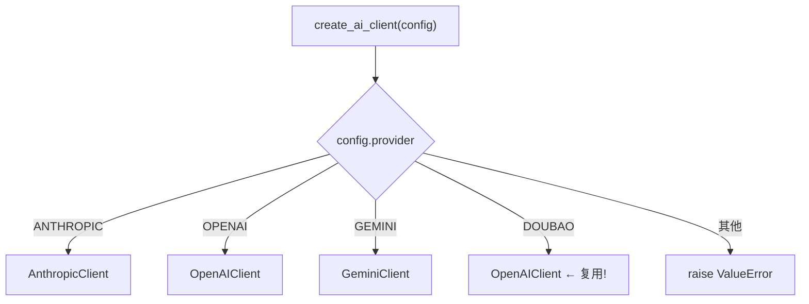

# PD-467.01 Horizon — AIClient 抽象基类与四提供商工厂适配

> 文档编号：PD-467.01
> 来源：Horizon `src/ai/client.py`, `src/models.py`
> GitHub：https://github.com/Thysrael/Horizon.git
> 问题域：PD-467 多 LLM 提供商适配 Multi-LLM Provider Abstraction
> 状态：可复用方案

---

## 第 1 章 问题与动机

### 1.1 核心问题

在 AI 驱动的应用中，团队往往需要同时对接多家 LLM 提供商（OpenAI、Anthropic、Google Gemini、字节豆包等）。每家 SDK 的初始化方式、消息格式、参数命名、响应结构都不同。如果业务代码直接耦合某一家 SDK，切换提供商就意味着大面积改动。更现实的场景是：生产环境用 Claude，开发环境用 DeepSeek（通过 OpenAI 兼容端点），需要一行配置就能切换，而不是改代码。

### 1.2 Horizon 的解法概述

Horizon 是一个 AI 驱动的信息聚合系统，需要对每条抓取的内容调用 LLM 进行评分、摘要、概念提取和背景知识生成。它的多提供商适配方案有以下要点：

1. **ABC 抽象基类** — `AIClient` 定义唯一的 `complete(system, user, temperature, max_tokens) -> str` 接口（`src/ai/client.py:15-37`）
2. **四个具体客户端** — `AnthropicClient`、`OpenAIClient`、`GeminiClient` 分别封装三家 SDK 的差异，Doubao 复用 `OpenAIClient`（`src/ai/client.py:40-212`）
3. **工厂函数路由** — `create_ai_client(config)` 根据 `AIProvider` 枚举值创建对应客户端（`src/ai/client.py:191-212`）
4. **Pydantic 配置模型** — `AIConfig` 统一描述 provider/model/base_url/api_key_env 等参数（`src/models.py:46-55`）
5. **OpenAI 兼容端点复用** — Doubao 和 DeepSeek 等 OpenAI 兼容服务直接复用 `OpenAIClient` + `base_url` 覆盖（`src/ai/client.py:209-210`，`data/config.json:4-7`）

### 1.3 设计思想

| 设计原则 | 具体实现 | 理由 | 替代方案 |
|----------|----------|------|----------|
| 接口隔离 | ABC 只暴露 `complete()` 一个方法 | 业务层只需要"给 system+user 拿回 text"，不关心 SDK 细节 | 多方法接口（stream/embed/complete），但增加适配成本 |
| 工厂模式 | `create_ai_client()` 函数根据枚举路由 | 创建逻辑集中，业务代码零感知 | 注册表模式（dict mapping），更灵活但对 4 家够用 |
| 协议复用 | Doubao/DeepSeek 复用 OpenAIClient | OpenAI 兼容 API 是事实标准，避免重复实现 | 每家单独实现，代码冗余 |
| 环境变量隔离 | `api_key_env` 存变量名而非密钥值 | 配置文件可安全提交 Git，密钥在运行时从环境读取 | 直接存密钥，有泄露风险 |
| 全异步 | 所有客户端使用 Async SDK | 信息聚合场景需要并发调用多个 AI 分析任务 | 同步调用，阻塞主线程 |

---

## 第 2 章 源码实现分析

### 2.1 架构概览

Horizon 的 AI 客户端层采用经典的策略模式 + 工厂模式组合：

```
┌─────────────────────────────────────────────────────────┐
│                    业务层 (orchestrator.py)               │
│  create_ai_client(config) → AIClient                     │
│  analyzer = ContentAnalyzer(ai_client)                   │
│  enricher = ContentEnricher(ai_client)                   │
└──────────────────────┬──────────────────────────────────┘
                       │ complete(system, user)
                       ▼
┌─────────────────────────────────────────────────────────┐
│              AIClient (ABC)  ← src/ai/client.py:15       │
│  + complete(system, user, temperature, max_tokens) → str │
└──────┬──────────┬──────────┬──────────┬─────────────────┘
       │          │          │          │
       ▼          ▼          ▼          ▼
┌──────────┐┌──────────┐┌──────────┐┌──────────┐
│Anthropic ││ OpenAI   ││ Gemini   ││ Doubao   │
│Client    ││ Client   ││ Client   ││(=OpenAI) │
│:40       ││ :90      ││ :142     ││ :209     │
└──────────┘└──────────┘└──────────┘└──────────┘
       │          │          │          │
       ▼          ▼          ▼          ▼
  AsyncAnthropic  AsyncOpenAI  genai    AsyncOpenAI
  messages.create completions  aio      +base_url
                  .create      .generate
```

配置驱动流程：

```
config.json → Pydantic AIConfig → AIProvider enum → create_ai_client() → 具体 Client
```

### 2.2 核心实现

#### 2.2.1 AIClient 抽象基类与 AnthropicClient

```mermaid
graph TD
    A[AIClient ABC] -->|定义接口| B["complete(system, user, temp, max_tokens) → str"]
    C[AnthropicClient.__init__] --> D{config.base_url?}
    D -->|有| E["kwargs['base_url'] = config.base_url"]
    D -->|无| F[仅 api_key]
    E --> G[AsyncAnthropic(**kwargs)]
    F --> G
    H[AnthropicClient.complete] --> I["client.messages.create(model, max_tokens, temperature, system, messages)"]
    I --> J["return message.content[0].text"]
```

对应源码 `src/ai/client.py:15-87`：

```python
class AIClient(ABC):
    """Abstract base class for AI clients."""

    @abstractmethod
    async def complete(
        self,
        system: str,
        user: str,
        temperature: float = 0.3,
        max_tokens: int = 4096
    ) -> str:
        pass


class AnthropicClient(AIClient):
    def __init__(self, config: AIConfig):
        api_key = os.getenv(config.api_key_env)
        if not api_key:
            raise ValueError(f"Missing API key: {config.api_key_env}")
        kwargs = {"api_key": api_key}
        if config.base_url:
            kwargs["base_url"] = config.base_url
        self.client = AsyncAnthropic(**kwargs)
        self.model = config.model
        self.max_tokens = config.max_tokens

    async def complete(self, system: str, user: str,
                       temperature: float = 0.3, max_tokens: int = 4096) -> str:
        message = await self.client.messages.create(
            model=self.model, max_tokens=max_tokens, temperature=temperature,
            system=system, messages=[{"role": "user", "content": user}]
        )
        return message.content[0].text
```

关键差异点：Anthropic SDK 的 `system` 是顶层参数，不在 `messages` 数组中；而 OpenAI 的 `system` 是 `messages[0]` 的 role。

#### 2.2.2 工厂函数与 Doubao 复用



对应源码 `src/ai/client.py:191-212`：

```python
def create_ai_client(config: AIConfig) -> AIClient:
    if config.provider == AIProvider.ANTHROPIC:
        return AnthropicClient(config)
    elif config.provider == AIProvider.OPENAI:
        return OpenAIClient(config)
    elif config.provider == AIProvider.GEMINI:
        return GeminiClient(config)
    elif config.provider == AIProvider.DOUBAO:
        return OpenAIClient(config)  # Doubao 兼容 OpenAI API
    else:
        raise ValueError(f"Unsupported AI provider: {config.provider}")
```

Doubao（字节豆包）提供 OpenAI 兼容 API，因此直接复用 `OpenAIClient`，通过 `base_url` 指向豆包端点。同样的模式也用于 DeepSeek — 实际配置 `data/config.json:3-7` 中 provider 设为 `openai`，model 设为 `deepseek-chat`，`base_url` 指向 `https://api.deepseek.com`。

### 2.3 实现细节

#### Pydantic 配置模型

`src/models.py:38-55` 定义了提供商枚举和配置模型：

```python
class AIProvider(str, Enum):
    ANTHROPIC = "anthropic"
    OPENAI = "openai"
    GEMINI = "gemini"
    DOUBAO = "doubao"

class AIConfig(BaseModel):
    provider: AIProvider
    model: str
    base_url: Optional[str] = None
    api_key_env: str
    temperature: float = 0.3
    max_tokens: int = 4096
    languages: List[str] = Field(default_factory=lambda: ["en"])
```

`AIConfig` 的 `languages` 字段（`src/models.py:55`）是 Horizon 特有的设计——它不属于 LLM 调用参数，而是控制输出语言（中英双语摘要）。这个字段在 `orchestrator.py:107` 被用来循环生成多语言摘要。

#### Gemini 的参数映射差异

`src/ai/client.py:178-186` 展示了 Gemini SDK 与 OpenAI/Anthropic 的显著差异：

- `contents` 参数直接接收字符串（不是 messages 数组）
- `system_instruction` 通过 `GenerateContentConfig` 传入
- `max_output_tokens`（而非 `max_tokens`）
- 使用 `client.aio.models.generate_content()` 异步路径

#### 业务层的依赖注入

`src/orchestrator.py:397` 和 `src/orchestrator.py:413` 展示了工厂函数的使用方式：

```python
# orchestrator.py:397
ai_client = create_ai_client(self.config.ai)
enricher = ContentEnricher(ai_client)

# orchestrator.py:413
ai_client = create_ai_client(self.config.ai)
analyzer = ContentAnalyzer(ai_client)
```

`ContentAnalyzer`（`src/ai/analyzer.py:16-17`）和 `ContentEnricher`（`src/ai/enricher.py:27-28`）都通过构造函数接收 `AIClient` 实例，实现了依赖注入。它们只调用 `self.client.complete()`，完全不知道底层是哪家提供商。

#### tenacity 重试装饰器

`src/ai/analyzer.py:51-54` 和 `src/ai/enricher.py:105-108` 对 AI 调用添加了统一的重试策略：

```python
@retry(stop=stop_after_attempt(3), wait=wait_exponential(min=2, max=10))
async def _analyze_item(self, item: ContentItem) -> None:
    ...
```

重试逻辑在业务层而非客户端层，这意味着无论哪家提供商的瞬时错误都能被统一处理。

---

## 第 3 章 迁移指南

### 3.1 迁移清单

**阶段 1：定义抽象层**

- [ ] 创建 `AIProvider` 枚举，列出需要支持的提供商
- [ ] 创建 `AIConfig` Pydantic 模型，包含 provider/model/base_url/api_key_env/temperature/max_tokens
- [ ] 创建 `AIClient` ABC，定义 `complete(system, user, temperature, max_tokens) -> str`

**阶段 2：实现具体客户端**

- [ ] 实现 `AnthropicClient`：注意 system 是顶层参数
- [ ] 实现 `OpenAIClient`：system 放在 messages[0]
- [ ] 实现 `GeminiClient`：注意 contents 是字符串、max_output_tokens 命名差异
- [ ] 对 OpenAI 兼容提供商（Doubao/DeepSeek/Groq 等），在工厂函数中复用 `OpenAIClient`

**阶段 3：集成**

- [ ] 实现 `create_ai_client()` 工厂函数
- [ ] 业务层通过构造函数注入 `AIClient`，不直接 import 具体客户端
- [ ] 配置文件中用 `api_key_env` 存环境变量名，不存密钥值

### 3.2 适配代码模板

以下模板可直接复用，支持 Anthropic/OpenAI/Gemini 三家 + 任意 OpenAI 兼容服务：

```python
"""Multi-provider AI client — 可直接复用的模板。"""

import os
from abc import ABC, abstractmethod
from enum import Enum
from typing import Optional, List
from pydantic import BaseModel, Field


class AIProvider(str, Enum):
    ANTHROPIC = "anthropic"
    OPENAI = "openai"
    GEMINI = "gemini"
    # 添加更多 OpenAI 兼容提供商只需加枚举值
    DOUBAO = "doubao"
    DEEPSEEK = "deepseek"


class AIConfig(BaseModel):
    provider: AIProvider
    model: str
    base_url: Optional[str] = None
    api_key_env: str
    temperature: float = 0.3
    max_tokens: int = 4096


class AIClient(ABC):
    @abstractmethod
    async def complete(
        self, system: str, user: str,
        temperature: float = 0.3, max_tokens: int = 4096
    ) -> str: ...


class AnthropicClient(AIClient):
    def __init__(self, config: AIConfig):
        from anthropic import AsyncAnthropic
        api_key = os.getenv(config.api_key_env)
        if not api_key:
            raise ValueError(f"Missing env var: {config.api_key_env}")
        kwargs = {"api_key": api_key}
        if config.base_url:
            kwargs["base_url"] = config.base_url
        self.client = AsyncAnthropic(**kwargs)
        self.model = config.model

    async def complete(self, system: str, user: str,
                       temperature: float = 0.3, max_tokens: int = 4096) -> str:
        msg = await self.client.messages.create(
            model=self.model, max_tokens=max_tokens, temperature=temperature,
            system=system, messages=[{"role": "user", "content": user}]
        )
        return msg.content[0].text


class OpenAIClient(AIClient):
    def __init__(self, config: AIConfig):
        from openai import AsyncOpenAI
        api_key = os.getenv(config.api_key_env)
        if not api_key:
            raise ValueError(f"Missing env var: {config.api_key_env}")
        kwargs = {"api_key": api_key}
        if config.base_url:
            kwargs["base_url"] = config.base_url
        self.client = AsyncOpenAI(**kwargs)
        self.model = config.model

    async def complete(self, system: str, user: str,
                       temperature: float = 0.3, max_tokens: int = 4096) -> str:
        resp = await self.client.chat.completions.create(
            model=self.model, temperature=temperature, max_tokens=max_tokens,
            messages=[
                {"role": "system", "content": system},
                {"role": "user", "content": user},
            ],
        )
        return resp.choices[0].message.content


class GeminiClient(AIClient):
    def __init__(self, config: AIConfig):
        from google import genai
        api_key = os.getenv(config.api_key_env)
        if not api_key:
            raise ValueError(f"Missing env var: {config.api_key_env}")
        self.client = genai.Client(api_key=api_key)
        self.model = config.model

    async def complete(self, system: str, user: str,
                       temperature: float = 0.3, max_tokens: int = 4096) -> str:
        from google.genai import types
        resp = await self.client.aio.models.generate_content(
            model=self.model, contents=user,
            config=types.GenerateContentConfig(
                system_instruction=system,
                temperature=temperature,
                max_output_tokens=max_tokens,
            ),
        )
        return resp.text


# OpenAI 兼容提供商集合
_OPENAI_COMPAT_PROVIDERS = {AIProvider.DOUBAO, AIProvider.DEEPSEEK}

_CLIENT_MAP = {
    AIProvider.ANTHROPIC: AnthropicClient,
    AIProvider.OPENAI: OpenAIClient,
    AIProvider.GEMINI: GeminiClient,
}


def create_ai_client(config: AIConfig) -> AIClient:
    if config.provider in _CLIENT_MAP:
        return _CLIENT_MAP[config.provider](config)
    if config.provider in _OPENAI_COMPAT_PROVIDERS:
        return OpenAIClient(config)
    raise ValueError(f"Unsupported provider: {config.provider}")
```

### 3.3 适用场景

| 场景 | 适用度 | 说明 |
|------|--------|------|
| 多提供商切换（开发/生产不同模型） | ⭐⭐⭐ | 核心场景，一行配置切换 |
| OpenAI 兼容端点（DeepSeek/Groq/Together） | ⭐⭐⭐ | 复用 OpenAIClient + base_url，零代码新增 |
| 批量内容分析（评分/摘要/标签） | ⭐⭐⭐ | Horizon 的实际用法，配合 tenacity 重试 |
| 流式输出（聊天/打字机效果） | ⭐ | 当前方案不支持 streaming，需扩展接口 |
| 多模态（图片/音频输入） | ⭐ | complete() 只接受 str，需重新设计消息类型 |
| 嵌入向量生成 | ⭐ | 需要额外的 embed() 接口，当前未覆盖 |

---

## 第 4 章 测试用例

```python
"""Tests for multi-provider AI client abstraction."""

import os
import pytest
from unittest.mock import AsyncMock, patch, MagicMock
from enum import Enum
from pydantic import BaseModel
from typing import Optional, List
from abc import ABC, abstractmethod


# --- 被测代码的最小复现 ---
class AIProvider(str, Enum):
    ANTHROPIC = "anthropic"
    OPENAI = "openai"
    GEMINI = "gemini"
    DOUBAO = "doubao"

class AIConfig(BaseModel):
    provider: AIProvider
    model: str
    base_url: Optional[str] = None
    api_key_env: str
    temperature: float = 0.3
    max_tokens: int = 4096


class TestAIProviderEnum:
    """测试提供商枚举完整性。"""

    def test_all_providers_defined(self):
        assert set(AIProvider) == {"anthropic", "openai", "gemini", "doubao"}

    def test_enum_is_str(self):
        assert isinstance(AIProvider.OPENAI, str)
        assert AIProvider.OPENAI == "openai"


class TestAIConfig:
    """测试配置模型验证。"""

    def test_valid_config(self):
        config = AIConfig(
            provider=AIProvider.OPENAI,
            model="gpt-4",
            api_key_env="OPENAI_API_KEY",
        )
        assert config.temperature == 0.3
        assert config.max_tokens == 4096
        assert config.base_url is None

    def test_config_with_base_url(self):
        config = AIConfig(
            provider=AIProvider.OPENAI,
            model="deepseek-chat",
            base_url="https://api.deepseek.com",
            api_key_env="DEEPSEEK_API_KEY",
        )
        assert config.base_url == "https://api.deepseek.com"

    def test_invalid_provider_rejected(self):
        with pytest.raises(ValueError):
            AIConfig(
                provider="invalid",
                model="x",
                api_key_env="X",
            )


class TestCreateAIClient:
    """测试工厂函数路由。"""

    def test_missing_api_key_raises(self):
        """环境变量缺失时应抛出 ValueError。"""
        from src.ai.client import create_ai_client
        config = AIConfig(
            provider=AIProvider.ANTHROPIC,
            model="claude-3-sonnet",
            api_key_env="NONEXISTENT_KEY_12345",
        )
        with pytest.raises(ValueError, match="Missing API key"):
            create_ai_client(config)

    @patch.dict(os.environ, {"TEST_KEY": "sk-test"})
    def test_anthropic_routing(self):
        """ANTHROPIC 应创建 AnthropicClient。"""
        from src.ai.client import create_ai_client, AnthropicClient
        config = AIConfig(
            provider=AIProvider.ANTHROPIC,
            model="claude-3-sonnet",
            api_key_env="TEST_KEY",
        )
        client = create_ai_client(config)
        assert isinstance(client, AnthropicClient)

    @patch.dict(os.environ, {"TEST_KEY": "sk-test"})
    def test_doubao_reuses_openai_client(self):
        """DOUBAO 应复用 OpenAIClient。"""
        from src.ai.client import create_ai_client, OpenAIClient
        config = AIConfig(
            provider=AIProvider.DOUBAO,
            model="doubao-pro",
            base_url="https://ark.cn-beijing.volces.com/api/v3",
            api_key_env="TEST_KEY",
        )
        client = create_ai_client(config)
        assert isinstance(client, OpenAIClient)

    def test_unsupported_provider_raises(self):
        """不支持的提供商应抛出 ValueError。"""
        from src.ai.client import create_ai_client
        config = MagicMock()
        config.provider = "unsupported"
        with pytest.raises(ValueError, match="Unsupported"):
            create_ai_client(config)


class TestOpenAIClientComplete:
    """测试 OpenAI 客户端的 complete 调用。"""

    @pytest.mark.asyncio
    @patch.dict(os.environ, {"TEST_KEY": "sk-test"})
    async def test_complete_returns_text(self):
        from src.ai.client import OpenAIClient
        config = AIConfig(
            provider=AIProvider.OPENAI,
            model="gpt-4",
            api_key_env="TEST_KEY",
        )
        client = OpenAIClient(config)

        mock_response = MagicMock()
        mock_response.choices = [MagicMock()]
        mock_response.choices[0].message.content = "Hello world"
        client.client.chat.completions.create = AsyncMock(return_value=mock_response)

        result = await client.complete(system="You are helpful.", user="Say hello")
        assert result == "Hello world"
        client.client.chat.completions.create.assert_called_once()
```

---

## 第 5 章 跨域关联

| 关联域 | 关系类型 | 说明 |
|--------|----------|------|
| PD-03 容错与重试 | 协同 | Horizon 在业务层（analyzer/enricher）用 tenacity `@retry` 装饰器统一处理所有提供商的瞬时错误，重试策略与客户端抽象解耦 |
| PD-01 上下文管理 | 协同 | `AIConfig.max_tokens` 控制输出长度上限，analyzer 中对 content 做 `[:1000]` 截断防止超窗口 |
| PD-04 工具系统 | 依赖 | AI 客户端是工具系统的基础设施——ContentAnalyzer 和 ContentEnricher 都依赖 AIClient 完成 LLM 调用 |
| PD-11 可观测性 | 协同 | 当前 Horizon 仅用 `rich.progress` 展示进度，未集成 token 计量或成本追踪，但统一接口为后续添加计量中间件提供了切入点 |
| PD-470 配置驱动架构 | 依赖 | `AIConfig` 从 `Config.ai` 字段读取，整个提供商切换由 JSON 配置驱动，无需改代码 |

---

## 第 6 章 来源文件索引

| 文件 | 行范围 | 关键实现 |
|------|--------|----------|
| `src/ai/client.py` | L15-L37 | AIClient ABC 定义，complete() 抽象方法 |
| `src/ai/client.py` | L40-L87 | AnthropicClient 实现，system 作为顶层参数 |
| `src/ai/client.py` | L90-L139 | OpenAIClient 实现，system 在 messages[0] |
| `src/ai/client.py` | L142-L188 | GeminiClient 实现，contents 为字符串 + GenerateContentConfig |
| `src/ai/client.py` | L191-L212 | create_ai_client() 工厂函数，Doubao 复用 OpenAIClient |
| `src/models.py` | L38-L43 | AIProvider 枚举（4 家提供商） |
| `src/models.py` | L46-L55 | AIConfig Pydantic 模型（provider/model/base_url/api_key_env） |
| `src/orchestrator.py` | L19 | import create_ai_client |
| `src/orchestrator.py` | L397 | 创建 AI 客户端用于内容富化 |
| `src/orchestrator.py` | L413 | 创建 AI 客户端用于内容分析 |
| `src/ai/analyzer.py` | L8, L16-17 | ContentAnalyzer 依赖注入 AIClient |
| `src/ai/analyzer.py` | L51-54 | tenacity @retry 装饰器（3 次重试，指数退避） |
| `src/ai/enricher.py` | L16, L27-28 | ContentEnricher 依赖注入 AIClient |
| `src/ai/enricher.py` | L105-108 | tenacity @retry 装饰器 |
| `data/config.json` | L3-L10 | 实际配置：OpenAI provider + DeepSeek base_url |
| `pyproject.toml` | L11-L13 | 依赖声明：anthropic/openai/google-genai |

---

## 第 7 章 横向对比维度

> **重要：** 本章用于自动填充 Butcher Wiki 的横向对比表。

```json comparison_data
{
  "project": "Horizon",
  "dimensions": {
    "抽象层级": "ABC 抽象基类 + 单方法 complete() 接口",
    "提供商数量": "4 家（Anthropic/OpenAI/Gemini/Doubao），Doubao 复用 OpenAI",
    "路由机制": "工厂函数 if-elif 路由，枚举驱动",
    "兼容端点复用": "OpenAI 兼容提供商直接复用 OpenAIClient + base_url",
    "异步支持": "全异步（AsyncAnthropic/AsyncOpenAI/genai.aio）",
    "重试策略": "业务层 tenacity @retry，3 次指数退避 2-10s",
    "密钥管理": "api_key_env 存环境变量名，运行时 os.getenv 读取",
    "流式支持": "无，全量缓冲返回"
  }
}
```

### 域元数据补充

```json domain_metadata
{
  "solution_summary": "Horizon 用 ABC 抽象基类定义 complete() 单方法接口，工厂函数路由四家提供商，Doubao/DeepSeek 复用 OpenAIClient+base_url 实现零代码扩展",
  "description": "OpenAI 兼容 API 作为事实标准的复用策略与异步全链路适配",
  "sub_problems": [
    "OpenAI 兼容提供商的自动识别与复用",
    "异步 SDK 差异的统一封装"
  ],
  "best_practices": [
    "api_key_env 存变量名而非密钥值，配置文件可安全提交",
    "重试逻辑放在业务层而非客户端层，统一处理所有提供商错误",
    "Gemini 参数映射需特别处理 contents/system_instruction/max_output_tokens 差异"
  ]
}
```
