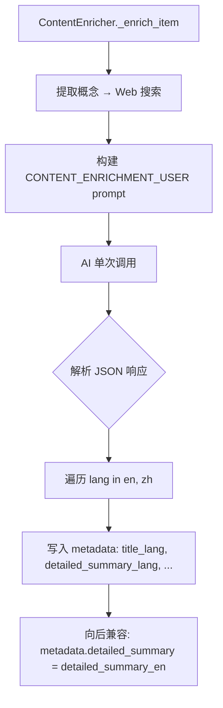
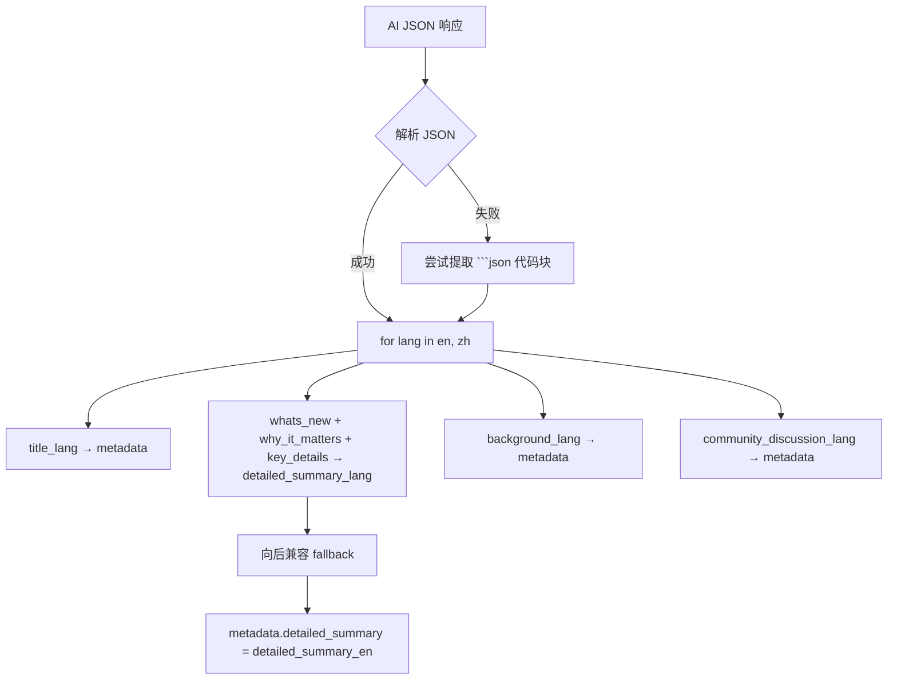

# PD-468.01 Horizon — 双语摘要生成与 Pangu 排版管线

> 文档编号：PD-468.01
> 来源：Horizon `src/ai/enricher.py` `src/ai/summarizer.py` `src/ai/prompts.py`
> GitHub：https://github.com/Thysrael/Horizon.git
> 问题域：PD-468 双语内容生成 Bilingual Content Generation
> 状态：可复用方案

---

## 第 1 章 问题与动机

### 1.1 核心问题

技术资讯聚合产品面向全球用户时，需要同时产出中英双语内容。传统做法是先生成一种语言再翻译，但这会导致：

1. **二次翻译损耗**：翻译后的文本丢失原始语境，技术术语被错误本地化（如 "Transformer" 被译为"变压器"）
2. **CJK-ASCII 混排排版混乱**：中文与英文/数字紧贴在一起（如"使用Python3.12"），可读性差
3. **多语言渲染逻辑分散**：标签、标题、空状态提示等 UI 文案散落在各处，新增语言时改动面大
4. **部署耦合**：中英文内容混在同一页面，无法按语言独立部署和 SEO 优化

Horizon 是一个 AI 驱动的技术资讯聚合工具，每日从 GitHub、Hacker News、Reddit、RSS、Telegram 等多源抓取内容，经 AI 评分筛选后生成每日摘要报告。它需要同时服务中文和英文读者，因此双语内容生成是核心需求。

### 1.2 Horizon 的解法概述

Horizon 采用"一次 AI 调用，双语并行产出"的策略，整条管线分为三个阶段：

1. **AI 富化阶段**（`src/ai/enricher.py:180-212`）：通过精心设计的 prompt，让 LLM 在单次调用中同时输出 `title_en/title_zh`、`whats_new_en/whats_new_zh` 等 12 个双语字段的结构化 JSON
2. **Pangu 排版阶段**（`src/ai/summarizer.py:13-17`）：渲染中文内容时，用正则自动在 CJK 字符与 ASCII 字符之间插入空格，解决混排可读性问题
3. **按语言渲染 + 独立部署**（`src/orchestrator.py:105-148`）：遍历配置的语言列表，为每种语言生成独立的 Markdown 文件，附加 Jekyll front matter 后部署到 GitHub Pages

### 1.3 设计思想

| 设计原则 | 具体实现 | 理由 | 替代方案 |
|----------|----------|------|----------|
| 单次生成避免翻译 | prompt 要求 LLM 同时输出 `_en` 和 `_zh` 后缀字段 | 避免二次翻译的语义损耗和额外 API 成本 | 先生成英文再调翻译 API |
| 结构化双语 JSON | 12 个字段严格命名约定 `{field}_{lang}` | 下游渲染可按语言精确取值，无需解析自然语言 | 自由文本 + 正则提取 |
| 渲染时排版修正 | `_pangu()` 在渲染阶段而非生成阶段应用 | LLM 生成的中文可能已含空格也可能不含，统一在渲染层处理更可靠 | 在 prompt 中要求 LLM 自行加空格 |
| 标签体系国际化 | `LABELS` 字典按语言键组织所有 UI 文案 | 新增语言只需加一个字典条目 | 硬编码 if/else |
| 语言级独立部署 | 每种语言生成独立 `.md` 文件 + Jekyll `lang` 元数据 | 支持按语言 SEO、独立 URL、CDN 缓存 | 单文件内嵌双语 tab 切换 |

---

## 第 2 章 源码实现分析

### 2.1 架构概览

Horizon 的双语内容生成管线贯穿从 AI 富化到最终部署的完整链路：

```
┌──────────────┐     ┌──────────────────┐     ┌──────────────────┐     ┌─────────────────┐
│ ContentItem  │────→│ ContentEnricher  │────→│ DailySummarizer  │────→│  Orchestrator   │
│ (原始内容)    │     │ (AI 双语富化)     │     │ (Pangu + 渲染)    │     │ (按语言部署)     │
└──────────────┘     └──────────────────┘     └──────────────────┘     └─────────────────┘
                            │                         │                        │
                     prompt 要求双语 JSON        _pangu() 修正排版       for lang in languages:
                     metadata 存储 12 字段       LABELS[lang] 选标签       save + Jekyll deploy
```

数据流核心：`ContentItem.metadata` 字典是双语数据的载体，enricher 写入、summarizer 读取。

### 2.2 核心实现

#### 2.2.1 双语 Prompt 设计



对应源码 `src/ai/prompts.py:82-116`：

```python
CONTENT_ENRICHMENT_SYSTEM = """You are a knowledgeable technical writer...

Provide EACH text field in BOTH English and Chinese. Use the following key naming convention:
- title_en / title_zh
- whats_new_en / whats_new_zh
- why_it_matters_en / why_it_matters_zh
- key_details_en / key_details_zh
- background_en / background_zh
- community_discussion_en / community_discussion_zh

Field definitions:
0. **title** (one short phrase, ≤15 words): A clear, accurate headline...
1. **whats_new** (1-2 complete sentences): What exactly happened...
2. **why_it_matters** (1-2 complete sentences): Why this is significant...
3. **key_details** (1-2 complete sentences): Notable technical details...
4. **background** (2-4 sentences): Brief background knowledge...
5. **community_discussion** (1-3 sentences): If community comments are provided...

Guidelines:
- English fields: write in clear, accessible English
- Chinese fields: write in fluent, natural Simplified Chinese (简体中文);
  keep technical abbreviations, acronyms, and widely-used proper nouns
  in their original English form.
"""
```

关键设计点：
- prompt 明确要求中文字段保留技术缩写的英文原形（`src/ai/prompts.py:113`），避免过度翻译
- 每个字段都有最低内容要求（至少一个完整句子），防止 LLM 偷懒返回空值（`src/ai/prompts.py:108`）

#### 2.2.2 双语元数据写入



对应源码 `src/ai/enricher.py:180-212`：

```python
# Combine structured sub-fields into per-language detailed_summary
for lang in ("en", "zh"):
    if result.get(f"title_{lang}"):
        item.metadata[f"title_{lang}"] = result[f"title_{lang}"]

    parts = []
    for field in ("whats_new", "why_it_matters", "key_details"):
        text = result.get(f"{field}_{lang}", "").strip()
        if text:
            parts.append(text)
    if parts:
        item.metadata[f"detailed_summary_{lang}"] = " ".join(parts)

    if result.get(f"background_{lang}"):
        item.metadata[f"background_{lang}"] = result[f"background_{lang}"]

    if result.get(f"community_discussion_{lang}"):
        item.metadata[f"community_discussion_{lang}"] = result[f"community_discussion_{lang}"]

# Backward-compatible fallback fields (English as default)
item.metadata["detailed_summary"] = item.metadata.get("detailed_summary_en", "")
item.metadata["background"] = item.metadata.get("background_en", "")
item.metadata["community_discussion"] = item.metadata.get("community_discussion_en", "")
```

设计亮点：
- 三个子字段（whats_new、why_it_matters、key_details）合并为 `detailed_summary_{lang}`（`src/ai/enricher.py:186-191`），下游只需读一个字段
- 向后兼容层（`src/ai/enricher.py:210-212`）：无语言后缀的字段默认取英文值，确保旧代码不 break

### 2.3 实现细节

#### Pangu 间距算法

`src/ai/summarizer.py:9-17` 实现了轻量级 Pangu 间距：

```python
_CJK = r"[\u4e00-\u9fff\u3400-\u4dbf]"
_ASCII = r"[A-Za-z0-9]"

def _pangu(text: str) -> str:
    """Insert a space between CJK and ASCII letters/digits (Pangu spacing)."""
    text = re.sub(rf"({_CJK})({_ASCII})", r"\1 \2", text)
    text = re.sub(rf"({_ASCII})({_CJK})", r"\1 \2", text)
    return text
```

该函数覆盖 CJK 统一汉字基本区（U+4E00–U+9FFF）和扩展 A 区（U+3400–U+4DBF），用两条正则分别处理"汉字→ASCII"和"ASCII→汉字"的边界。

Pangu 的应用时机在渲染阶段（`src/ai/summarizer.py:101-138`），仅对中文语言生效：

```python
if language == "zh":
    t = _pangu(t)          # TOC 标题
    # ...
    title = _pangu(title)       # 条目标题
    summary = _pangu(summary)   # 摘要
    background = _pangu(background)  # 背景
    discussion = _pangu(discussion)  # 讨论
```

#### 语言感知的字段回退链

`src/ai/summarizer.py:111-132` 展示了优雅的多级回退：

```python
title = (
    item.metadata.get(f"title_{language}")   # 优先取语言特定标题
    or item.title                             # 回退到原始标题
).replace("[", "(").replace("]", ")")

summary = (
    meta.get(f"detailed_summary_{language}")  # 优先取语言特定摘要
    or meta.get("detailed_summary")           # 回退到无后缀版本
    or item.ai_summary                        # 最终回退到 AI 初评摘要
    or ""
)
```

#### 语言配置驱动

`src/models.py:55` 定义了语言列表配置：

```python
class AIConfig(BaseModel):
    languages: List[str] = Field(default_factory=lambda: ["en"])
```

`data/config.json` 中配置 `"languages": ["zh", "en"]`，orchestrator 遍历此列表生成多份报告。

#### 按语言独立部署

`src/orchestrator.py:105-148` 为每种语言生成独立的 Jekyll 文章：

```python
for lang in self.config.ai.languages:
    summary = await self._generate_summary(important_items, today, len(all_items), language=lang)
    summary_path = self.storage.save_daily_summary(today, summary, language=lang)

    post_filename = f"{today}-summary-{lang}.md"
    front_matter = (
        "---\n"
        "layout: default\n"
        f"title: \"Horizon Summary: {today} ({lang.upper()})\"\n"
        f"date: {today}\n"
        f"lang: {lang}\n"
        "---\n\n"
    )
```

文件命名规则：`horizon-{date}-{lang}.md`（存储层）和 `{date}-summary-{lang}.md`（Jekyll 层），通过 `lang` front matter 字段支持 Jekyll 的语言过滤。

---

## 第 3 章 迁移指南

### 3.1 迁移清单

**阶段 1：双语 Prompt 设计**
- [ ] 定义目标语言列表（如 `["en", "zh"]`）
- [ ] 设计 `{field}_{lang}` 命名约定的 JSON schema
- [ ] 编写 system prompt，明确要求 LLM 同时输出所有语言字段
- [ ] 在 prompt 中指定技术术语保留规则（如"保留英文缩写原形"）

**阶段 2：元数据存储与回退**
- [ ] 在数据模型中预留 `metadata: Dict[str, Any]` 或等效的灵活存储
- [ ] 实现 `for lang in languages` 循环写入逻辑
- [ ] 实现向后兼容的无后缀 fallback 字段
- [ ] 编写 JSON 解析容错（处理 LLM 返回的 markdown 代码块包裹）

**阶段 3：渲染层国际化**
- [ ] 实现 Pangu 间距函数（或引入 pangu.js/pangu.py 库）
- [ ] 建立 `LABELS` 字典，集中管理所有 UI 文案
- [ ] 实现语言感知的字段回退链（`title_{lang}` → `title`）
- [ ] 仅对 CJK 语言应用 Pangu 间距

**阶段 4：多语言部署**
- [ ] 按语言生成独立输出文件
- [ ] 添加语言元数据（如 Jekyll front matter 的 `lang` 字段）
- [ ] 配置 CI/CD 按语言部署

### 3.2 适配代码模板

#### 双语 Prompt + 元数据写入模板

```python
from typing import Dict, Any, List
import json
import re

# --- 1. Prompt 模板 ---
BILINGUAL_SYSTEM_PROMPT = """You are a technical writer.
For EACH text field, provide BOTH English and Chinese versions.
Use the naming convention: {field}_en / {field}_zh

Fields:
- title_en / title_zh: Short headline (≤15 words)
- summary_en / summary_zh: 2-3 sentence summary
- background_en / background_zh: Context for non-experts

Guidelines:
- English: clear, accessible
- Chinese: fluent Simplified Chinese; keep technical terms in English
"""

BILINGUAL_USER_PROMPT = """Analyze this content and provide bilingual output.

Title: {title}
Content: {content}

Respond with valid JSON only:
{{
  "title_en": "...", "title_zh": "...",
  "summary_en": "...", "summary_zh": "...",
  "background_en": "...", "background_zh": "..."
}}"""


# --- 2. 元数据写入 ---
BILINGUAL_FIELDS = ["title", "summary", "background"]

def store_bilingual_metadata(
    ai_result: Dict[str, Any],
    metadata: Dict[str, Any],
    languages: List[str] = ("en", "zh"),
    default_lang: str = "en",
) -> None:
    """将 AI 双语结果写入 metadata，并设置向后兼容 fallback。"""
    for lang in languages:
        for field in BILINGUAL_FIELDS:
            key = f"{field}_{lang}"
            if ai_result.get(key):
                metadata[key] = ai_result[key]

    # 向后兼容：无后缀字段默认取 default_lang
    for field in BILINGUAL_FIELDS:
        metadata[field] = metadata.get(f"{field}_{default_lang}", "")


# --- 3. Pangu 间距 ---
_CJK = r"[\u4e00-\u9fff\u3400-\u4dbf]"
_ASCII = r"[A-Za-z0-9]"

def pangu_spacing(text: str) -> str:
    """在 CJK 与 ASCII 字符之间插入空格。"""
    text = re.sub(rf"({_CJK})({_ASCII})", r"\1 \2", text)
    text = re.sub(rf"({_ASCII})({_CJK})", r"\1 \2", text)
    return text


# --- 4. 语言感知渲染 ---
LABELS = {
    "en": {"header": "Daily Digest", "source": "Source", "tags": "Tags"},
    "zh": {"header": "每日速递", "source": "来源", "tags": "标签"},
}

def render_field(metadata: Dict, field: str, language: str, apply_pangu: bool = True) -> str:
    """按语言取字段值，中文自动应用 Pangu 间距。"""
    value = (
        metadata.get(f"{field}_{language}")
        or metadata.get(field)
        or ""
    )
    if apply_pangu and language in ("zh", "ja", "ko"):
        value = pangu_spacing(value)
    return value
```

### 3.3 适用场景

| 场景 | 适用度 | 说明 |
|------|--------|------|
| 技术资讯聚合（中英双语） | ⭐⭐⭐ | Horizon 的核心场景，直接复用 |
| 多语言 Newsletter 生成 | ⭐⭐⭐ | prompt 模式可扩展到更多语言 |
| 文档站点国际化 | ⭐⭐ | 适合 AI 辅助翻译场景，纯人工翻译不需要 |
| 实时聊天双语输出 | ⭐ | 延迟敏感场景不适合单次生成多语言 |
| 3+ 语言支持 | ⭐⭐ | 语言越多 prompt 越长，token 成本线性增长 |

---

## 第 4 章 测试用例

```python
import pytest
import re

# --- Pangu 间距测试 ---
_CJK = r"[\u4e00-\u9fff\u3400-\u4dbf]"
_ASCII = r"[A-Za-z0-9]"

def _pangu(text: str) -> str:
    text = re.sub(rf"({_CJK})({_ASCII})", r"\1 \2", text)
    text = re.sub(rf"({_ASCII})({_CJK})", r"\1 \2", text)
    return text


class TestPanguSpacing:
    def test_cjk_before_ascii(self):
        assert _pangu("使用Python") == "使用 Python"

    def test_ascii_before_cjk(self):
        assert _pangu("Python是") == "Python 是"

    def test_bidirectional(self):
        assert _pangu("使用Python3.12开发") == "使用 Python3.12 开发"

    def test_already_spaced(self):
        assert _pangu("使用 Python") == "使用 Python"

    def test_pure_cjk(self):
        assert _pangu("纯中文文本") == "纯中文文本"

    def test_pure_ascii(self):
        assert _pangu("pure ascii text") == "pure ascii text"

    def test_cjk_extension_a(self):
        # U+3400-U+4DBF 扩展 A 区
        assert _pangu("\u3400test") == "\u3400 test"

    def test_empty_string(self):
        assert _pangu("") == ""


# --- 双语元数据存储测试 ---
BILINGUAL_FIELDS = ["title", "summary", "background"]

def store_bilingual_metadata(ai_result, metadata, languages=("en", "zh"), default_lang="en"):
    for lang in languages:
        for field in BILINGUAL_FIELDS:
            key = f"{field}_{lang}"
            if ai_result.get(key):
                metadata[key] = ai_result[key]
    for field in BILINGUAL_FIELDS:
        metadata[field] = metadata.get(f"{field}_{default_lang}", "")


class TestBilingualMetadata:
    def test_normal_bilingual_storage(self):
        ai_result = {
            "title_en": "New AI Model Released",
            "title_zh": "新 AI 模型发布",
            "summary_en": "A new model was released.",
            "summary_zh": "一个新模型发布了。",
            "background_en": "Background info.",
            "background_zh": "背景信息。",
        }
        metadata = {}
        store_bilingual_metadata(ai_result, metadata)

        assert metadata["title_en"] == "New AI Model Released"
        assert metadata["title_zh"] == "新 AI 模型发布"
        assert metadata["title"] == "New AI Model Released"  # fallback

    def test_missing_zh_field(self):
        ai_result = {"title_en": "Hello", "summary_en": "World"}
        metadata = {}
        store_bilingual_metadata(ai_result, metadata)

        assert metadata["title"] == "Hello"
        assert "title_zh" not in metadata

    def test_fallback_to_default_lang(self):
        ai_result = {"title_en": "EN Title", "title_zh": "中文标题"}
        metadata = {}
        store_bilingual_metadata(ai_result, metadata)

        # 无后缀字段应取 default_lang (en)
        assert metadata["title"] == "EN Title"

    def test_empty_result(self):
        metadata = {}
        store_bilingual_metadata({}, metadata)
        assert metadata["title"] == ""
        assert metadata["summary"] == ""


# --- 语言感知渲染测试 ---
def render_field(metadata, field, language, apply_pangu=True):
    value = metadata.get(f"{field}_{language}") or metadata.get(field) or ""
    if apply_pangu and language in ("zh", "ja", "ko"):
        value = _pangu(value)
    return value


class TestLanguageAwareRendering:
    def test_render_zh_with_pangu(self):
        meta = {"title_zh": "使用Python开发"}
        assert render_field(meta, "title", "zh") == "使用 Python 开发"

    def test_render_en_no_pangu(self):
        meta = {"title_en": "Using Python"}
        assert render_field(meta, "title", "en") == "Using Python"

    def test_fallback_chain(self):
        meta = {"title": "Fallback Title"}
        # 无 title_zh，回退到 title
        result = render_field(meta, "title", "zh")
        assert result == "Fallback Title"

    def test_missing_field(self):
        assert render_field({}, "title", "en") == ""
```

---

## 第 5 章 跨域关联

| 关联域 | 关系类型 | 说明 |
|--------|----------|------|
| PD-01 上下文管理 | 协同 | 双语 prompt 产出的 token 量约为单语的 1.8 倍，需要关注上下文窗口预算；Horizon 通过 `content_text[:4000]` 截断控制输入长度（`enricher.py:126-129`） |
| PD-03 容错与重试 | 依赖 | enricher 使用 `@retry(stop=stop_after_attempt(3), wait=wait_exponential(min=2, max=10))` 装饰器（`enricher.py:105-108`），双语 JSON 解析失败时自动重试 |
| PD-04 工具系统 | 协同 | enricher 的概念提取 → Web 搜索 → 双语富化是一个工具链编排，DuckDuckGo 搜索结果作为 grounding 输入 |
| PD-08 搜索与检索 | 依赖 | 双语背景知识的准确性依赖 Web 搜索结果的质量；`_web_search` 方法（`enricher.py:52-74`）提供搜索能力 |
| PD-11 可观测性 | 协同 | 每种语言的摘要生成和保存都有 Rich console 输出（`orchestrator.py:112, 145`），可追踪多语言生成进度 |
| PD-458 i18n 本地化 | 互补 | PD-458 关注 UI 层面的 i18n（vue-i18n、Crowdin），PD-468 关注 AI 生成内容的双语化，两者互补 |

---

## 第 6 章 来源文件索引

| 文件 | 行范围 | 关键实现 |
|------|--------|----------|
| `src/ai/prompts.py` | L82-L116 | CONTENT_ENRICHMENT_SYSTEM：双语 prompt 设计，12 字段命名约定 |
| `src/ai/prompts.py` | L118-L150 | CONTENT_ENRICHMENT_USER：双语 JSON 响应模板 |
| `src/ai/enricher.py` | L105-L108 | `@retry` 装饰器，3 次重试 + 指数退避 |
| `src/ai/enricher.py` | L109-L178 | `_enrich_item`：概念提取 → Web 搜索 → AI 富化完整流程 |
| `src/ai/enricher.py` | L180-L212 | 双语元数据写入 + 向后兼容 fallback |
| `src/ai/summarizer.py` | L9-L17 | `_pangu()` CJK-ASCII 间距函数 |
| `src/ai/summarizer.py` | L20-L57 | `LABELS` 双语标签字典 |
| `src/ai/summarizer.py` | L66-L109 | `generate_summary()`：语言参数驱动的 Markdown 渲染 |
| `src/ai/summarizer.py` | L111-L187 | `_format_item()`：语言感知的字段回退 + Pangu 应用 |
| `src/models.py` | L46-L55 | `AIConfig.languages`：语言列表配置 |
| `src/orchestrator.py` | L105-L148 | 按语言循环生成摘要 + Jekyll front matter + 部署 |
| `src/storage/manager.py` | L32-L39 | `save_daily_summary()`：语言感知的文件命名 |

---

## 第 7 章 横向对比维度

```json comparison_data
{
  "project": "Horizon",
  "dimensions": {
    "双语生成策略": "单次 AI 调用同时输出 12 个 _en/_zh 后缀字段的结构化 JSON",
    "排版处理": "自实现 _pangu() 正则，渲染阶段对中文内容自动插入 CJK-ASCII 间距",
    "标签国际化": "LABELS 字典按语言键集中管理 UI 文案，新增语言只需加字典条目",
    "部署方式": "按语言生成独立 Markdown + Jekyll front matter，GitHub Pages 分别部署",
    "回退机制": "三级回退链：title_{lang} → title → 原始字段，向后兼容无后缀字段",
    "术语保留策略": "prompt 明确要求中文字段保留技术缩写英文原形"
  }
}
```

### 域元数据补充

```json domain_metadata
{
  "solution_summary": "Horizon 用单次 AI 调用产出 12 个 _en/_zh 后缀双语字段，_pangu() 正则修正 CJK-ASCII 间距，按语言独立渲染 Jekyll 文章并部署 GitHub Pages",
  "description": "AI 生成内容的结构化双语产出与自动排版修正",
  "sub_problems": [
    "双语 JSON 解析容错（LLM 返回 markdown 代码块包裹时的提取）",
    "多子字段合并为单一摘要字段的聚合策略",
    "向后兼容的无语言后缀 fallback 字段设计"
  ],
  "best_practices": [
    "prompt 中明确要求保留技术术语英文原形避免过度本地化",
    "渲染阶段而非生成阶段应用排版修正更可靠",
    "三级回退链确保任何语言缺失时仍有内容可展示"
  ]
}
```
