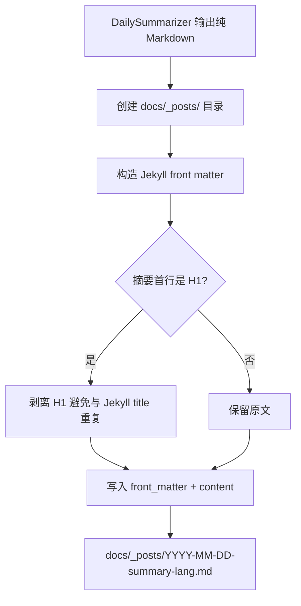
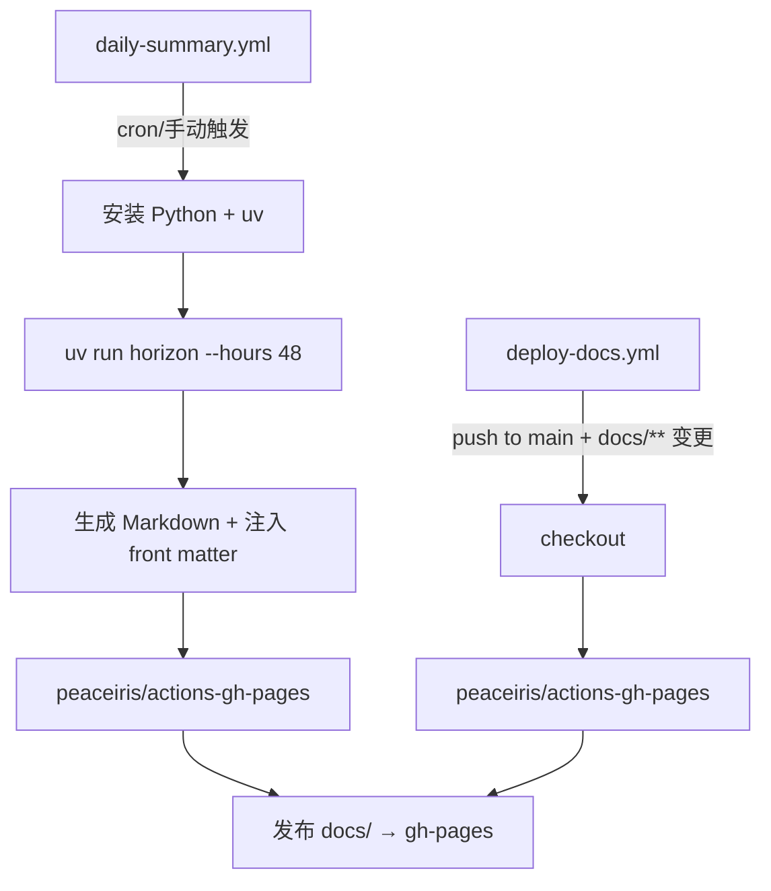

# PD-469.01 Horizon — GitHub Actions + Jekyll 双轨静态站点部署

> 文档编号：PD-469.01
> 来源：Horizon `.github/workflows/daily-summary.yml`, `src/orchestrator.py`, `scripts/daily-run.sh`
> GitHub：https://github.com/Thysrael/Horizon.git
> 问题域：PD-469 静态站点部署 Static Site Deployment
> 状态：可复用方案

---

## 第 1 章 问题与动机

### 1.1 核心问题

AI 驱动的内容聚合系统需要将每日生成的 Markdown 摘要自动发布为可浏览的静态网站。核心挑战包括：

- **自动化发布**：内容由 AI 管线生成，不能依赖人工操作来部署
- **历史累积**：每日摘要需要持久保留，新发布不能覆盖旧内容
- **多语言路由**：同一天的摘要有中英文两个版本，首页需要按语言分类展示
- **双环境一致性**：CI（GitHub Actions）和本地开发（shell 脚本）都需要能触发部署
- **内容与部署解耦**：Markdown 生成逻辑不应感知 Jekyll 的存在，front matter 注入应在管线末端完成

### 1.2 Horizon 的解法概述

Horizon 采用"程序化 Markdown 生成 + Jekyll front matter 注入 + 双轨部署"的三层架构：

1. **纯程序化 Markdown 渲染**：`DailySummarizer` 类生成不含任何 Jekyll 元数据的纯 Markdown（`src/ai/summarizer.py:60-109`）
2. **管线末端 front matter 注入**：`HorizonOrchestrator.run()` 在保存摘要后，单独注入 Jekyll front matter 并写入 `docs/_posts/`（`src/orchestrator.py:114-147`）
3. **CI 轨道**：`peaceiris/actions-gh-pages@v4` 将 `docs/` 目录发布到 `gh-pages` 分支，`keep_files: true` 保留历史（`.github/workflows/daily-summary.yml:39-47`）
4. **本地轨道**：`scripts/daily-run.sh` 用 `git worktree` 在临时目录操作 `gh-pages` 分支，无需切换当前分支（`scripts/daily-run.sh:28-43`）
5. **Jekyll 语言路由**：首页用 Liquid 模板按 `lang` front matter 字段过滤文章（`docs/index.md:19-40`）

### 1.3 设计思想

| 设计原则 | 具体实现 | 理由 | 替代方案 |
|----------|----------|------|----------|
| 内容与部署解耦 | Summarizer 只输出纯 Markdown，Orchestrator 末端注入 front matter | 生成逻辑不依赖 Jekyll，可替换为 Hugo/Astro | 在 Summarizer 中直接生成带 front matter 的内容 |
| 双存储冗余 | 同时写入 `data/summaries/`（原始）和 `docs/_posts/`（Jekyll） | 原始备份不受 Jekyll 格式约束，便于后续数据分析 | 只写一份到 `docs/_posts/` |
| 累积式发布 | `keep_files: true` + `enable_jekyll: true` | 每次部署只增量添加新文件，不清空历史 | 每次全量构建（需维护完整 `_posts/` 目录） |
| 零分支切换部署 | `git worktree` 操作临时目录 | 本地部署不影响当前工作分支的文件状态 | `git checkout gh-pages` 切换分支（会丢失未提交更改） |
| 约定优于配置 | Jekyll 日期前缀文件名 `YYYY-MM-DD-*.md` | 自动按时间排序，无需额外排序逻辑 | 自定义排序字段 |

---

## 第 2 章 源码实现分析

### 2.1 架构概览

Horizon 的静态站点部署涉及 4 个关键层：

```
┌─────────────────────────────────────────────────────────────┐
│                    触发层 (Trigger)                          │
│  ┌──────────────────┐  ┌──────────────────────────────────┐ │
│  │ GitHub Actions   │  │ scripts/daily-run.sh (cron/手动) │ │
│  │ cron / dispatch  │  │                                  │ │
│  └────────┬─────────┘  └──────────────┬───────────────────┘ │
├───────────┼───────────────────────────┼─────────────────────┤
│           ▼           生成层          ▼                     │
│  ┌──────────────────────────────────────────────────────┐   │
│  │ HorizonOrchestrator.run()                            │   │
│  │  ├─ DailySummarizer.generate_summary() → 纯 Markdown │   │
│  │  ├─ StorageManager.save_daily_summary() → data/      │   │
│  │  └─ Jekyll front matter 注入 → docs/_posts/          │   │
│  └──────────────────────────────────────────────────────┘   │
├─────────────────────────────────────────────────────────────┤
│                    部署层 (Deploy)                           │
│  ┌──────────────────┐  ┌──────────────────────────────────┐ │
│  │ peaceiris/       │  │ git worktree + push gh-pages     │ │
│  │ actions-gh-pages │  │ (本地脚本)                        │ │
│  └────────┬─────────┘  └──────────────┬───────────────────┘ │
├───────────┼───────────────────────────┼─────────────────────┤
│           ▼           渲染层          ▼                     │
│  ┌──────────────────────────────────────────────────────┐   │
│  │ GitHub Pages + Jekyll                                │   │
│  │  ├─ _config.yml (Cayman 主题 + kramdown)             │   │
│  │  ├─ index.md (Liquid 双语过滤)                       │   │
│  │  └─ _posts/YYYY-MM-DD-summary-{lang}.md              │   │
│  └──────────────────────────────────────────────────────┘   │
└─────────────────────────────────────────────────────────────┘
```

### 2.2 核心实现

#### 2.2.1 Jekyll Front Matter 注入

Orchestrator 在管线末端将纯 Markdown 转换为 Jekyll 可识别的 post 文件。



对应源码 `src/orchestrator.py:114-147`：

```python
# Copy to docs/ for GitHub Pages
try:
    from pathlib import Path

    post_filename = f"{today}-summary-{lang}.md"
    posts_dir = Path("docs/_posts")
    posts_dir.mkdir(parents=True, exist_ok=True)

    dest_path = posts_dir / post_filename

    # Add Jekyll front matter
    front_matter = (
        "---\n"
        "layout: default\n"
        f"title: \"Horizon Summary: {today} ({lang.upper()})\"\n"
        f"date: {today}\n"
        f"lang: {lang}\n"
        "---\n\n"
    )

    # Strip leading H1 header to avoid duplication with Jekyll title
    summary_content = summary
    first_line = summary_content.strip().split("\n")[0]
    if first_line.startswith("# "):
        parts = summary_content.split("\n", 1)
        if len(parts) > 1:
            summary_content = parts[1].strip()

    with open(dest_path, "w", encoding="utf-8") as f:
        f.write(front_matter + summary_content)
except Exception as e:
    self.console.print(f"[yellow]⚠️  Failed to copy {lang.upper()} summary to docs/: {e}[/yellow]\n")
```

关键设计点：
- **H1 剥离**（L134-140）：Summarizer 生成的 Markdown 以 `# Horizon Daily - 2025-03-01` 开头，但 Jekyll 会从 front matter 的 `title` 字段渲染标题，保留 H1 会导致标题重复
- **异常隔离**（L146-147）：Jekyll 写入失败不影响主流程，`data/summaries/` 中的原始备份仍然保留
- **`lang` 字段**（L130）：注入到 front matter 中，供首页 Liquid 模板按语言过滤

#### 2.2.2 GitHub Actions 双工作流

Horizon 使用两个独立的 GitHub Actions 工作流实现职责分离。



对应源码 `.github/workflows/daily-summary.yml:29-47`：

```yaml
      - name: Run Horizon
        env:
          OPENAI_API_KEY: ${{ secrets.OPENAI_API_KEY }}
          ANTHROPIC_API_KEY: ${{ secrets.ANTHROPIC_API_KEY }}
          GOOGLE_API_KEY: ${{ secrets.GOOGLE_API_KEY }}
          LWN_KEY: ${{ secrets.LWN_KEY }}
        run: uv run horizon --hours 48

      - name: Deploy to GitHub Pages
        uses: peaceiris/actions-gh-pages@v4
        with:
          github_token: ${{ secrets.GITHUB_TOKEN }}
          publish_dir: ./docs
          keep_files: true
          commit_message: "📝 Daily Summary: $(date +'%Y-%m-%d')"
          publish_branch: gh-pages
          enable_jekyll: true
```

两个工作流的分工：
- **daily-summary.yml**：完整管线（抓取 → AI 分析 → 生成 → 部署），由 cron 或手动触发
- **deploy-docs.yml**（`.github/workflows/deploy-docs.yml:1-25`）：纯部署，当 `docs/**` 文件在 main 分支变更时触发，用于手动编辑文档后的快速发布

### 2.3 实现细节

#### 2.3.1 双存储路径

```
生成的 Markdown
    │
    ├─→ data/summaries/horizon-2025-03-01-en.md   (原始备份，无 front matter)
    │   └─ StorageManager.save_daily_summary()      src/storage/manager.py:32-39
    │
    └─→ docs/_posts/2025-03-01-summary-en.md       (Jekyll post，含 front matter)
        └─ HorizonOrchestrator.run()                src/orchestrator.py:114-147
```

`StorageManager` 的实现极简（`src/storage/manager.py:32-39`）：

```python
def save_daily_summary(self, date: str, markdown: str, language: str = "en") -> Path:
    filename = f"horizon-{date}-{language}.md"
    filepath = self.summaries_dir / filename
    with open(filepath, "w", encoding="utf-8") as f:
        f.write(markdown)
    return filepath
```

#### 2.3.2 Jekyll 双语路由

首页 `docs/index.md:18-40` 使用 Liquid 模板按 `lang` 字段过滤：

```html
<ul>
  
  
    <li>
      <a href="{{ post.url | relative_url }}">{{ post.date | date: "%Y-%m-%d" }}</a>
    </li>
  
    <li><em>暂无内容</em></li>
  
</ul>
```

Jekyll 配置（`docs/_config.yml:1-19`）：
- `theme: jekyll-theme-cayman` — GitHub Pages 内置主题，零配置
- `future: true` — 允许发布未来日期的文章（时区差异可能导致日期超前）
- `baseurl: "/Horizon"` — 部署在 `https://thysrael.github.io/Horizon`

#### 2.3.3 git worktree 本地部署

`scripts/daily-run.sh:28-43` 实现无分支切换的本地部署：

```bash
# Use a temporary worktree to update gh-pages without switching branches
TMPDIR=$(mktemp -d)
trap "rm -rf $TMPDIR" EXIT

git fetch origin gh-pages:gh-pages 2>/dev/null || git checkout --orphan gh-pages && git checkout main
git worktree add "$TMPDIR" gh-pages
cp -r docs/* "$TMPDIR/"

cd "$TMPDIR"
git add -A
git commit -m "Daily Summary: $(date '+%Y-%m-%d')" || { echo "$LOG_PREFIX Nothing to commit."; exit 0; }
git push origin gh-pages

cd "$PROJECT_DIR"
git worktree remove "$TMPDIR"
```

关键技巧：
- `mktemp -d` + `trap` 确保临时目录在脚本退出时清理
- `git worktree add` 在临时目录检出 `gh-pages`，不影响当前 main 分支
- 空提交保护：`git commit ... || exit 0` 避免无变更时报错

#### 2.3.4 纯程序化 Markdown 生成

`DailySummarizer`（`src/ai/summarizer.py:60-109`）不使用任何模板引擎，完全用 Python 字符串拼接生成 Markdown：

- TOC 生成（L98-105）：带锚点链接和评分徽章
- Pangu 间距（L13-17）：CJK 与 ASCII 之间自动插入空格，提升双语排版质量
- `<details>` 折叠（L170-173）：参考链接用 HTML 折叠元素包裹，避免页面过长

---

## 第 3 章 迁移指南

### 3.1 迁移清单

**阶段 1：Jekyll 站点骨架**

- [ ] 创建 `docs/` 目录结构：`_config.yml`, `index.md`, `_posts/`, `_includes/`
- [ ] 配置 `_config.yml`：选择主题、设置 `baseurl`、启用 `future: true`
- [ ] 编写 `index.md` 首页模板（可直接复用 Horizon 的 Liquid 过滤逻辑）

**阶段 2：Front Matter 注入模块**

- [ ] 在内容生成管线末端添加 front matter 注入逻辑
- [ ] 实现 H1 标题剥离（避免与 Jekyll title 重复）
- [ ] 确保文件名遵循 Jekyll 日期前缀约定 `YYYY-MM-DD-*.md`

**阶段 3：GitHub Actions 工作流**

- [ ] 创建 daily-summary 工作流（cron + workflow_dispatch）
- [ ] 配置 `peaceiris/actions-gh-pages@v4`，启用 `keep_files` 和 `enable_jekyll`
- [ ] 在 GitHub 仓库 Settings → Secrets 中配置 API 密钥
- [ ] 可选：创建 deploy-docs 工作流用于手动文档变更的快速发布

**阶段 4：本地部署脚本（可选）**

- [ ] 编写 `scripts/deploy.sh`，使用 `git worktree` 操作 `gh-pages` 分支
- [ ] 配置 crontab 定时执行

### 3.2 适配代码模板

#### 3.2.1 Front Matter 注入器（可直接复用）

```python
"""Jekyll front matter injector — 管线末端将纯 Markdown 转为 Jekyll post。"""

from pathlib import Path
from datetime import datetime


def inject_jekyll_post(
    markdown: str,
    date: str,
    language: str = "en",
    layout: str = "default",
    posts_dir: str = "docs/_posts",
    title_prefix: str = "Daily Summary",
) -> Path:
    """将纯 Markdown 注入 Jekyll front matter 并写入 _posts/ 目录。

    Args:
        markdown: 纯 Markdown 内容（不含 front matter）
        date: 日期字符串 YYYY-MM-DD
        language: 语言代码
        layout: Jekyll 布局名
        posts_dir: Jekyll _posts 目录路径
        title_prefix: 标题前缀

    Returns:
        写入的文件路径
    """
    posts_path = Path(posts_dir)
    posts_path.mkdir(parents=True, exist_ok=True)

    # Jekyll 日期前缀文件名
    filename = f"{date}-{title_prefix.lower().replace(' ', '-')}-{language}.md"
    dest = posts_path / filename

    # 构造 front matter
    front_matter = (
        "---\n"
        f"layout: {layout}\n"
        f'title: "{title_prefix}: {date} ({language.upper()})"\n'
        f"date: {date}\n"
        f"lang: {language}\n"
        "---\n\n"
    )

    # 剥离 H1 标题（避免与 Jekyll title 重复）
    content = markdown
    first_line = content.strip().split("\n")[0]
    if first_line.startswith("# "):
        parts = content.split("\n", 1)
        if len(parts) > 1:
            content = parts[1].strip()

    dest.write_text(front_matter + content, encoding="utf-8")
    return dest
```

#### 3.2.2 GitHub Actions 工作流模板

```yaml
name: Daily Content Pipeline

on:
  schedule:
    - cron: '0 0 * * *'  # 每天 UTC 00:00
  workflow_dispatch:

jobs:
  generate-and-deploy:
    runs-on: ubuntu-latest
    permissions:
      contents: write

    steps:
      - uses: actions/checkout@v4

      - name: Set up Python
        uses: actions/setup-python@v5
        with:
          python-version: "3.12"

      - name: Install uv
        uses: astral-sh/setup-uv@v3

      - name: Install dependencies
        run: uv sync

      - name: Run content pipeline
        env:
          API_KEY: ${{ secrets.API_KEY }}
        run: uv run your-cli-command

      - name: Deploy to GitHub Pages
        uses: peaceiris/actions-gh-pages@v4
        with:
          github_token: ${{ secrets.GITHUB_TOKEN }}
          publish_dir: ./docs
          keep_files: true
          publish_branch: gh-pages
          enable_jekyll: true
          commit_message: "📝 Update: $(date +'%Y-%m-%d')"
```

#### 3.2.3 git worktree 本地部署脚本模板

```bash
#!/usr/bin/env bash
set -euo pipefail

PROJECT_DIR="$(cd "$(dirname "$0")/.." && pwd)"
DOCS_DIR="$PROJECT_DIR/docs"
TMPDIR=$(mktemp -d)
trap "rm -rf $TMPDIR" EXIT

cd "$PROJECT_DIR"

# 确保 gh-pages 分支存在
git fetch origin gh-pages:gh-pages 2>/dev/null || {
    git checkout --orphan gh-pages
    git rm -rf . 2>/dev/null || true
    git commit --allow-empty -m "Init gh-pages"
    git push origin gh-pages
    git checkout main
}

# 在临时目录操作 gh-pages，不切换当前分支
git worktree add "$TMPDIR" gh-pages
cp -r "$DOCS_DIR"/* "$TMPDIR/"

cd "$TMPDIR"
git add -A
git commit -m "Deploy: $(date '+%Y-%m-%d %H:%M')" || { echo "Nothing to deploy."; exit 0; }
git push origin gh-pages

cd "$PROJECT_DIR"
git worktree remove "$TMPDIR"
echo "Deployed successfully."
```

### 3.3 适用场景

| 场景 | 适用度 | 说明 |
|------|--------|------|
| AI 生成内容的定期发布 | ⭐⭐⭐ | 完美匹配：cron 触发 + 累积式发布 + 多语言路由 |
| 技术博客 / 日报系统 | ⭐⭐⭐ | Jekyll 日期前缀 + Liquid 过滤天然适合时间序列内容 |
| 文档站点（非时间序列） | ⭐⭐ | 可用但 Jekyll _posts 约定不太适合，考虑 pages 模式 |
| 需要复杂交互的 Web 应用 | ⭐ | 静态站点不适合，考虑 Next.js / Nuxt 等 SSR 框架 |
| 私有部署（非 GitHub） | ⭐⭐ | 需替换 peaceiris action，改用 rsync/scp 部署到自有服务器 |

---

## 第 4 章 测试用例

```python
"""Tests for Jekyll front matter injection and deployment pipeline."""

import os
import tempfile
from pathlib import Path
from unittest.mock import patch, MagicMock

import pytest


class TestJekyllFrontMatterInjection:
    """测试 front matter 注入逻辑（对应 src/orchestrator.py:114-147）。"""

    def setup_method(self):
        self.tmpdir = tempfile.mkdtemp()
        self.posts_dir = Path(self.tmpdir) / "docs" / "_posts"

    def teardown_method(self):
        import shutil
        shutil.rmtree(self.tmpdir, ignore_errors=True)

    def test_front_matter_structure(self):
        """验证生成的 front matter 包含必要字段。"""
        from inject_jekyll_post import inject_jekyll_post  # 使用 3.2.1 的模板

        md = "# Horizon Daily - 2025-03-01\n\nSome content here."
        path = inject_jekyll_post(md, "2025-03-01", "en", posts_dir=str(self.posts_dir))

        content = path.read_text(encoding="utf-8")
        assert "layout: default" in content
        assert 'title: "Daily Summary: 2025-03-01 (EN)"' in content
        assert "date: 2025-03-01" in content
        assert "lang: en" in content

    def test_h1_stripping(self):
        """验证 H1 标题被正确剥离。"""
        from inject_jekyll_post import inject_jekyll_post

        md = "# Horizon Daily - 2025-03-01\n\nActual content starts here."
        path = inject_jekyll_post(md, "2025-03-01", "en", posts_dir=str(self.posts_dir))

        content = path.read_text(encoding="utf-8")
        assert "# Horizon Daily" not in content
        assert "Actual content starts here." in content

    def test_no_h1_preserved(self):
        """验证没有 H1 时内容完整保留。"""
        from inject_jekyll_post import inject_jekyll_post

        md = "Some content without H1 header.\n\nMore content."
        path = inject_jekyll_post(md, "2025-03-01", "zh", posts_dir=str(self.posts_dir))

        content = path.read_text(encoding="utf-8")
        assert "Some content without H1 header." in content
        assert "lang: zh" in content

    def test_filename_convention(self):
        """验证文件名遵循 Jekyll 日期前缀约定。"""
        from inject_jekyll_post import inject_jekyll_post

        path = inject_jekyll_post("content", "2025-03-01", "en", posts_dir=str(self.posts_dir))
        assert path.name == "2025-03-01-daily-summary-en.md"

    def test_bilingual_generation(self):
        """验证中英文摘要生成到不同文件。"""
        from inject_jekyll_post import inject_jekyll_post

        en_path = inject_jekyll_post("English content", "2025-03-01", "en", posts_dir=str(self.posts_dir))
        zh_path = inject_jekyll_post("中文内容", "2025-03-01", "zh", posts_dir=str(self.posts_dir))

        assert en_path != zh_path
        assert en_path.exists() and zh_path.exists()
        assert "lang: en" in en_path.read_text()
        assert "lang: zh" in zh_path.read_text()


class TestKeepFilesAccumulation:
    """测试 keep_files 累积式发布行为。"""

    def test_existing_files_preserved(self):
        """模拟 keep_files=true：新文件不覆盖旧文件。"""
        tmpdir = tempfile.mkdtemp()
        posts_dir = Path(tmpdir) / "_posts"
        posts_dir.mkdir(parents=True)

        # 模拟已有的旧摘要
        old_file = posts_dir / "2025-02-28-daily-summary-en.md"
        old_file.write_text("Old summary content")

        # 写入新摘要
        from inject_jekyll_post import inject_jekyll_post
        inject_jekyll_post("New content", "2025-03-01", "en", posts_dir=str(posts_dir))

        # 旧文件应仍然存在
        assert old_file.exists()
        assert old_file.read_text() == "Old summary content"

        import shutil
        shutil.rmtree(tmpdir, ignore_errors=True)


class TestDailySummarizerMarkdown:
    """测试纯 Markdown 生成（对应 src/ai/summarizer.py:60-109）。"""

    def test_summary_starts_with_h1(self):
        """验证生成的摘要以 H1 标题开头（供后续 front matter 注入剥离）。"""
        # 模拟 DailySummarizer 的输出格式
        header = "# Horizon Daily - 2025-03-01\n\n"
        assert header.startswith("# ")

    def test_pangu_spacing(self):
        """验证 CJK-ASCII 间距插入。"""
        import re
        _CJK = r"[\u4e00-\u9fff\u3400-\u4dbf]"
        _ASCII = r"[A-Za-z0-9]"

        def _pangu(text: str) -> str:
            text = re.sub(rf"({_CJK})({_ASCII})", r"\1 \2", text)
            text = re.sub(rf"({_ASCII})({_CJK})", r"\1 \2", text)
            return text

        assert _pangu("测试test") == "测试 test"
        assert _pangu("test测试") == "test 测试"
        assert _pangu("纯中文") == "纯中文"
```

---

## 第 5 章 跨域关联

| 关联域 | 关系类型 | 说明 |
|--------|----------|------|
| PD-01 上下文管理 | 协同 | Summarizer 生成的 Markdown 长度受 LLM 上下文窗口限制，摘要压缩策略影响最终发布内容的信息密度 |
| PD-08 搜索与检索 | 依赖 | 部署的静态站点内容来源于多源搜索聚合管线（GitHub/HN/RSS/Reddit/Telegram），搜索质量直接决定发布内容质量 |
| PD-11 可观测性 | 协同 | GitHub Actions 工作流日志提供部署可观测性；`keep_files` 的累积历史本身也是一种运行记录 |
| PD-468 双语内容生成 | 依赖 | Jekyll 双语路由（`lang` front matter 过滤）依赖上游的多语言摘要生成能力 |
| PD-466 AI 内容评分 | 依赖 | 只有通过 AI 评分阈值（默认 7.0/10）的内容才会进入发布管线 |
| PD-465 内容去重 | 协同 | 跨源 URL 去重和语义去重在发布前执行，避免重复内容出现在站点上 |

---

## 第 6 章 来源文件索引

| 文件 | 行范围 | 关键实现 |
|------|--------|----------|
| `.github/workflows/daily-summary.yml` | L1-48 | 完整的每日管线工作流：Python 环境 + Horizon 执行 + GitHub Pages 部署 |
| `.github/workflows/deploy-docs.yml` | L1-26 | 纯部署工作流：docs/ 变更时触发 peaceiris/actions-gh-pages |
| `src/orchestrator.py` | L105-147 | 摘要生成 + 双存储写入 + Jekyll front matter 注入 |
| `src/orchestrator.py` | L39-53 | 时间窗口确定 + 多源并发抓取入口 |
| `src/ai/summarizer.py` | L60-109 | DailySummarizer 纯程序化 Markdown 生成（含 TOC、评分徽章） |
| `src/ai/summarizer.py` | L111-187 | 单条内容格式化（锚点、背景、折叠引用、标签） |
| `src/ai/summarizer.py` | L13-17 | Pangu 间距函数：CJK-ASCII 自动空格 |
| `src/storage/manager.py` | L32-39 | save_daily_summary：原始 Markdown 备份存储 |
| `scripts/daily-run.sh` | L28-43 | git worktree 本地部署：临时目录操作 gh-pages 分支 |
| `docs/_config.yml` | L1-19 | Jekyll 配置：Cayman 主题、kramdown、future posts、默认布局 |
| `docs/index.md` | L18-40 | 首页 Liquid 模板：按 lang 字段双语过滤 + limit:20 |
| `docs/_includes/head-custom.html` | L1-3 | Emoji favicon 注入（🌅 SVG data URI） |
| `src/main.py` | L34-66 | CLI 入口：argparse --hours 参数 + StorageManager 初始化 |

---

## 第 7 章 横向对比维度

> **重要：** 本章用于自动填充 Butcher Wiki 的横向对比表。
> 必须严格按以下 JSON 格式输出，放在 `comparison_data` 代码块中。

```json comparison_data
{
  "project": "Horizon",
  "dimensions": {
    "部署工具": "peaceiris/actions-gh-pages@v4 + git worktree 双轨",
    "站点生成器": "Jekyll（GitHub Pages 内置 Cayman 主题 + kramdown）",
    "内容注入方式": "管线末端程序化注入 front matter，H1 剥离防重复",
    "多语言支持": "front matter lang 字段 + Liquid where 过滤器双语路由",
    "历史累积策略": "keep_files: true 增量发布，不清空 gh-pages 历史",
    "本地部署": "git worktree 临时目录操作 gh-pages，零分支切换"
  }
}
```

### 域元数据补充

```json domain_metadata
{
  "solution_summary": "Horizon 用 peaceiris/actions-gh-pages 双工作流 + git worktree 本地脚本实现 Jekyll 站点的累积式自动部署，管线末端注入 front matter 并按 lang 字段双语路由",
  "description": "涵盖从内容生成到静态站点渲染的端到端自动化发布管线设计",
  "sub_problems": [
    "H1 标题与 Jekyll title 的去重处理",
    "双工作流职责分离（生成+部署 vs 纯部署）",
    "双存储冗余（原始备份 + Jekyll post）",
    "Emoji favicon 的 SVG data URI 注入"
  ],
  "best_practices": [
    "管线末端注入 front matter，保持内容生成与部署格式解耦",
    "双工作流分离：daily-summary 负责全管线，deploy-docs 负责快速发布",
    "future: true 配置避免时区差异导致文章不显示",
    "Pangu 间距提升双语 Markdown 排版质量"
  ]
}
```
