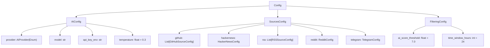
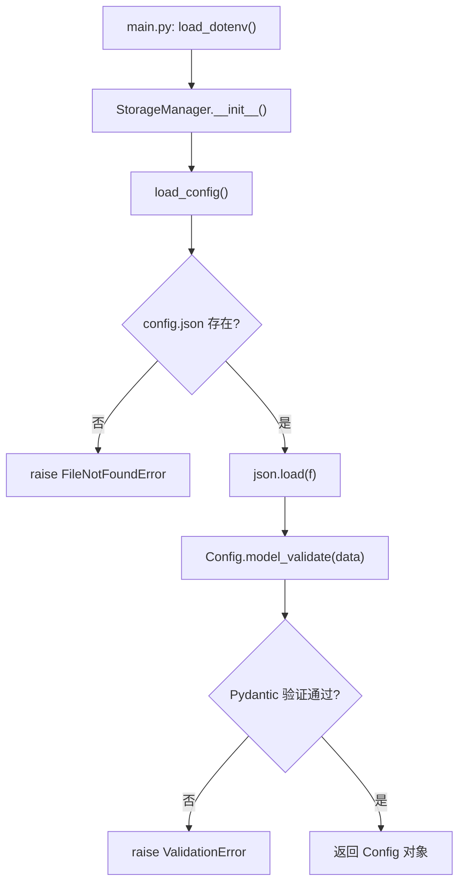
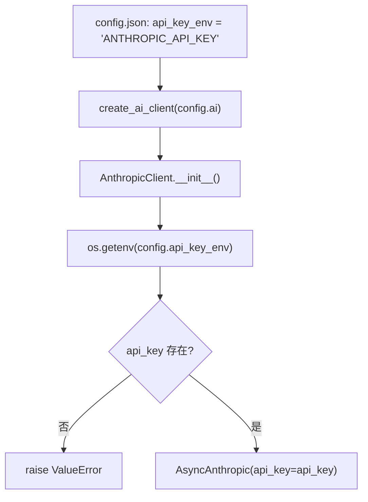
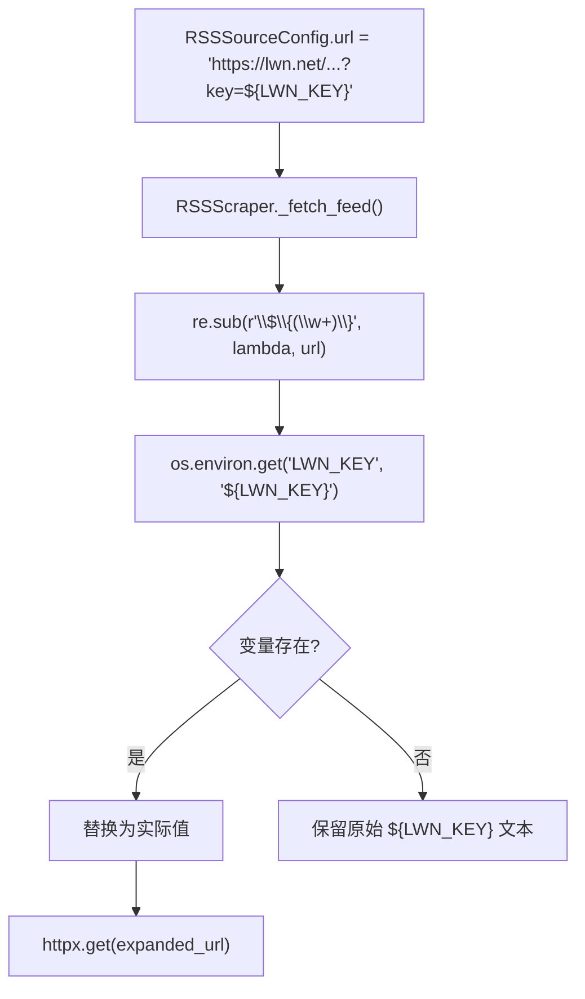

# PD-470.01 Horizon — 单一 JSON 配置驱动全行为的 Pydantic 验证架构

> 文档编号：PD-470.01
> 来源：Horizon `src/models.py` `src/storage/manager.py` `src/scrapers/rss.py`
> GitHub：https://github.com/Thysrael/Horizon.git
> 问题域：PD-470 配置驱动架构 Configuration-Driven Architecture
> 状态：可复用方案

---

## 第 1 章 问题与动机

### 1.1 核心问题

信息聚合系统需要对接多种数据源（GitHub、HackerNews、RSS、Reddit、Telegram）和多种 AI 提供商（Anthropic、OpenAI、Gemini、Doubao），每种数据源和提供商都有独立的参数（API 密钥、抓取数量、评分阈值等）。如果这些参数硬编码在代码中，每次切换提供商或新增数据源都需要改代码、重新部署。

核心挑战：
- **多维配置空间**：AI 提供商 × 数据源类型 × 过滤参数，组合爆炸
- **敏感信息泄露风险**：API 密钥、订阅 Token 不能出现在配置文件或版本控制中
- **运行时灵活性**：用户需要在不改代码的情况下启用/禁用数据源、调整阈值
- **类型安全**：JSON 配置缺乏类型检查，拼写错误或类型不匹配只能在运行时发现

### 1.2 Horizon 的解法概述

Horizon 采用"单一 JSON 配置文件 + Pydantic 模型树 + 环境变量分离"的三层架构：

1. **单一入口**：所有行为由 `data/config.json` 一个文件驱动，无需多个配置文件（`src/storage/manager.py:20-30`）
2. **Pydantic 模型树**：`Config → AIConfig / SourcesConfig / FilteringConfig` 层级结构，每个字段都有类型约束和默认值（`src/models.py:141-148`）
3. **间接密钥引用**：配置中只存环境变量名（`api_key_env: "ANTHROPIC_API_KEY"`），运行时通过 `os.getenv()` 解析（`src/ai/client.py:49-51`）
4. **URL 级变量替换**：RSS URL 中的 `${VAR}` 语法在抓取时动态替换为环境变量值（`src/scrapers/rss.py:69-74`）
5. **启动时 .env 加载**：`load_dotenv()` 在入口统一加载 `.env` 文件到 `os.environ`（`src/main.py:44`）

### 1.3 设计思想

| 设计原则 | 具体实现 | 理由 | 替代方案 |
|----------|----------|------|----------|
| 单一配置源 | 一个 `config.json` 驱动全部行为 | 避免配置散落在多处，降低认知负担 | 多文件配置（如 sources.yaml + ai.yaml） |
| 类型安全验证 | Pydantic BaseModel + Enum 约束 | 启动时即发现配置错误，不等到运行时 | JSON Schema 验证、手动 assert |
| 密钥间接引用 | `api_key_env` 字段存变量名而非值 | 配置文件可安全提交到 Git | 直接在 JSON 中存密钥（危险） |
| 延迟变量替换 | RSS URL 中 `${VAR}` 在 fetch 时替换 | 同一配置文件可在不同环境运行 | 配置预处理脚本 |
| 默认值兜底 | 每个 Pydantic 字段都有合理默认值 | 最小配置即可运行，降低上手门槛 | 要求用户填写所有字段 |
| 工厂模式分发 | `create_ai_client()` 根据 provider 枚举创建客户端 | 新增提供商只需加一个分支 | if-else 散落在业务代码中 |

---

## 第 2 章 源码实现分析

### 2.1 架构概览

Horizon 的配置系统分为三层：配置文件层、模型验证层、运行时消费层。

```
┌─────────────────────────────────────────────────────────┐
│                    .env 文件                              │
│  ANTHROPIC_API_KEY=sk-ant-xxx                           │
│  LWN_KEY=abc123                                         │
└──────────────┬──────────────────────────────────────────┘
               │ load_dotenv()
               ▼
┌─────────────────────────────────────────────────────────┐
│              os.environ (运行时环境)                      │
└──────────────┬──────────────────────────────────────────┘
               │ os.getenv() / ${VAR} 替换
               ▼
┌─────────────────────────────────────────────────────────┐
│           data/config.json (单一配置源)                   │
│  ┌─────────┐  ┌──────────────┐  ┌────────────┐         │
│  │ AIConfig│  │ SourcesConfig│  │FilterConfig │         │
│  │provider │  │ github[]     │  │threshold    │         │
│  │model    │  │ hackernews   │  │time_window  │         │
│  │api_key_ │  │ rss[]        │  └────────────┘         │
│  │  env    │  │ reddit       │                          │
│  └────┬────┘  │ telegram     │                          │
│       │       └──────┬───────┘                          │
└───────┼──────────────┼──────────────────────────────────┘
        │              │
        ▼              ▼
┌──────────────┐ ┌─────────────────┐
│ AI Client    │ │ Scrapers        │
│ Factory      │ │ GitHub/RSS/HN/  │
│ (client.py)  │ │ Reddit/Telegram │
└──────────────┘ └─────────────────┘
```

### 2.2 核心实现

#### 2.2.1 Pydantic 模型树 — 类型安全的配置结构



对应源码 `src/models.py:38-148`：

```python
class AIProvider(str, Enum):
    """Supported AI providers."""
    ANTHROPIC = "anthropic"
    OPENAI = "openai"
    GEMINI = "gemini"
    DOUBAO = "doubao"

class AIConfig(BaseModel):
    """AI client configuration."""
    provider: AIProvider          # Enum 验证：只接受 4 种提供商
    model: str
    base_url: Optional[str] = None
    api_key_env: str              # 间接引用：存变量名而非密钥值
    temperature: float = 0.3      # 默认值兜底
    max_tokens: int = 4096
    languages: List[str] = Field(default_factory=lambda: ["en"])

class SourcesConfig(BaseModel):
    """All sources configuration."""
    github: List[GitHubSourceConfig] = Field(default_factory=list)
    hackernews: HackerNewsConfig = Field(default_factory=HackerNewsConfig)
    rss: List[RSSSourceConfig] = Field(default_factory=list)
    reddit: RedditConfig = Field(default_factory=RedditConfig)
    telegram: TelegramConfig = Field(default_factory=TelegramConfig)

class Config(BaseModel):
    """Main configuration model."""
    version: str = "1.0"
    ai: AIConfig
    sources: SourcesConfig
    filtering: FilteringConfig
```

关键设计点：
- `AIProvider` 是 `str, Enum` 双继承，JSON 中写字符串 `"openai"` 即可，Pydantic 自动验证是否在枚举范围内
- `SourcesConfig` 的每个字段都有 `default_factory`，意味着用户可以只配置需要的数据源，其余自动用空列表/默认值
- `AIConfig.api_key_env` 存的是环境变量名（如 `"ANTHROPIC_API_KEY"`），不是密钥本身

#### 2.2.2 配置加载与验证 — StorageManager



对应源码 `src/storage/manager.py:9-30`：

```python
class StorageManager:
    """Manages file-based storage for configuration and state."""

    def __init__(self, data_dir: str = "data"):
        self.data_dir = Path(data_dir)
        self.config_path = self.data_dir / "config.json"
        self.summaries_dir = self.data_dir / "summaries"
        self.data_dir.mkdir(parents=True, exist_ok=True)
        self.summaries_dir.mkdir(parents=True, exist_ok=True)

    def load_config(self) -> Config:
        if not self.config_path.exists():
            raise FileNotFoundError(
                f"Configuration file not found: {self.config_path}\n"
                f"Please create it based on the template in README.md"
            )
        with open(self.config_path, "r", encoding="utf-8") as f:
            data = json.load(f)
        return Config.model_validate(data)
```

`Config.model_validate(data)` 是 Pydantic v2 的入口，会递归验证整棵模型树。如果 JSON 中 `provider` 写成 `"chatgpt"`（不在枚举中），启动时立即报错，而不是等到调用 AI 时才发现。

#### 2.2.3 密钥间接引用 — api_key_env 模式



对应源码 `src/ai/client.py:43-57` 和 `src/ai/client.py:191-212`：

```python
class AnthropicClient(AIClient):
    def __init__(self, config: AIConfig):
        api_key = os.getenv(config.api_key_env)   # 间接引用
        if not api_key:
            raise ValueError(f"Missing API key: {config.api_key_env}")
        kwargs = {"api_key": api_key}
        if config.base_url:
            kwargs["base_url"] = config.base_url   # 可选 base_url 覆盖
        self.client = AsyncAnthropic(**kwargs)

def create_ai_client(config: AIConfig) -> AIClient:
    """Factory function to create appropriate AI client."""
    if config.provider == AIProvider.ANTHROPIC:
        return AnthropicClient(config)
    elif config.provider == AIProvider.OPENAI:
        return OpenAIClient(config)
    elif config.provider == AIProvider.GEMINI:
        return GeminiClient(config)
    elif config.provider == AIProvider.DOUBAO:
        return OpenAIClient(config)  # Doubao 复用 OpenAI 兼容接口
    else:
        raise ValueError(f"Unsupported AI provider: {config.provider}")
```

这个模式的精妙之处：
- `config.json` 可以安全提交到 Git（不含密钥）
- 同一份配置在不同机器上运行，只需设置对应的环境变量
- `base_url` 可选覆盖，支持代理或自部署端点
- Doubao 复用 OpenAI 客户端（因为 Doubao API 兼容 OpenAI 格式），只需配置不同的 `base_url`

#### 2.2.4 URL 级环境变量替换 — ${VAR} 语法



对应源码 `src/scrapers/rss.py:68-74`：

```python
# Expand environment variables in URL (e.g. ${LWN_TOKEN})
feed_url = re.sub(
    r'\$\{(\w+)\}',
    lambda m: os.environ.get(m.group(1), m.group(0)).strip(),
    str(source.url),
)
```

设计要点：
- 正则 `\$\{(\w+)\}` 精确匹配 `${VAR_NAME}` 格式
- 未找到环境变量时回退到原始文本 `m.group(0)`，不会崩溃
- `.strip()` 防止环境变量值带尾部空白
- 替换发生在 fetch 时（延迟替换），不是配置加载时，因此 Pydantic 的 `HttpUrl` 验证不会被 `${VAR}` 语法干扰

### 2.3 实现细节

#### 配置到 Scraper 的分发流程

`HorizonOrchestrator._fetch_all_sources()` (`src/orchestrator.py:163-211`) 展示了配置如何驱动行为：

```python
async def _fetch_all_sources(self, since: datetime) -> List[ContentItem]:
    async with httpx.AsyncClient(timeout=30.0) as client:
        tasks = []
        if self.config.sources.github:           # 配置驱动：有 github 配置才创建 scraper
            github_scraper = GitHubScraper(self.config.sources.github, client)
            tasks.append(self._fetch_with_progress("GitHub", github_scraper, since))
        if self.config.sources.hackernews.enabled:  # enabled 字段控制开关
            hn_scraper = HackerNewsScraper(self.config.sources.hackernews, client)
            tasks.append(...)
        if self.config.sources.rss:
            rss_scraper = RSSScraper(self.config.sources.rss, client)
            tasks.append(...)
        # ... Reddit, Telegram 同理
        results = await asyncio.gather(*tasks, return_exceptions=True)
```

每个 Scraper 只接收自己需要的配置切片（如 `self.config.sources.github`），不需要知道全局配置结构。这是"配置驱动"的核心：编排器根据配置决定创建哪些 Scraper，Scraper 根据配置决定抓取行为。

#### 错误处理的分层设计

配置错误在三个层级被捕获：

| 层级 | 位置 | 错误类型 | 处理方式 |
|------|------|----------|----------|
| 文件层 | `manager.py:21-25` | 配置文件不存在 | 打印模板 + `sys.exit(1)` |
| 模型层 | `manager.py:30` | Pydantic ValidationError | 打印错误详情 + `sys.exit(1)` |
| 运行时 | `client.py:49-51` | 环境变量缺失 | `raise ValueError` |

`src/main.py:52-62` 的错误处理：

```python
try:
    config = storage.load_config()
except FileNotFoundError:
    console.print("[bold red]❌ Configuration file not found![/bold red]\n")
    print_config_template()    # 贴心地打印配置模板
    sys.exit(1)
except Exception as e:
    console.print(f"[bold red]❌ Error loading configuration: {e}[/bold red]")
    sys.exit(1)
```


---

## 第 3 章 迁移指南

### 3.1 迁移清单

**阶段 1：配置模型定义**
- [ ] 定义 Pydantic 模型树：根 Config → 子模块 Config（AI、数据源、过滤等）
- [ ] 为枚举类型字段使用 `str, Enum` 双继承（支持 JSON 字符串直接反序列化）
- [ ] 为每个可选字段设置合理默认值（`Field(default_factory=...)`)
- [ ] 敏感字段使用间接引用模式（存环境变量名而非值）

**阶段 2：配置加载管道**
- [ ] 实现 `load_config()` 方法：读取 JSON → `Config.model_validate(data)`
- [ ] 添加文件不存在时的友好错误提示（打印配置模板）
- [ ] 在入口函数中调用 `load_dotenv()` 加载 `.env` 文件

**阶段 3：运行时消费**
- [ ] 工厂函数根据配置枚举创建对应实现（如 `create_ai_client()`）
- [ ] 需要 URL 级变量替换的地方实现 `${VAR}` 正则替换
- [ ] 编排器根据配置的 `enabled` 字段决定是否创建对应组件

**阶段 4：配置管理**
- [ ] 创建 `config.example.json` 作为模板（不含真实密钥）
- [ ] 创建 `.env.example` 列出所有需要的环境变量
- [ ] 将 `.env` 和 `config.json`（如含敏感信息）加入 `.gitignore`

### 3.2 适配代码模板

以下是一个可直接复用的配置驱动架构模板：

```python
"""配置驱动架构模板 — 基于 Horizon 模式"""

import json
import os
import re
from enum import Enum
from pathlib import Path
from typing import List, Optional

from dotenv import load_dotenv
from pydantic import BaseModel, Field


# ── 1. 枚举定义 ──────────────────────────────────────

class ProviderType(str, Enum):
    """str, Enum 双继承：JSON 中写 "openai" 即可反序列化"""
    OPENAI = "openai"
    ANTHROPIC = "anthropic"


# ── 2. 配置模型树 ────────────────────────────────────

class AIConfig(BaseModel):
    provider: ProviderType
    model: str = "gpt-4"
    api_key_env: str                    # 间接引用：存变量名
    temperature: float = 0.3
    max_tokens: int = 4096

class SourceConfig(BaseModel):
    name: str
    url: str                            # 支持 ${VAR} 语法
    enabled: bool = True

class AppConfig(BaseModel):
    version: str = "1.0"
    ai: AIConfig
    sources: List[SourceConfig] = Field(default_factory=list)


# ── 3. 配置加载 ──────────────────────────────────────

def load_config(config_path: str = "config.json") -> AppConfig:
    path = Path(config_path)
    if not path.exists():
        raise FileNotFoundError(f"Config not found: {path}")
    with open(path, "r") as f:
        data = json.load(f)
    return AppConfig.model_validate(data)


# ── 4. 密钥解析 ──────────────────────────────────────

def resolve_api_key(config: AIConfig) -> str:
    api_key = os.getenv(config.api_key_env)
    if not api_key:
        raise ValueError(f"Missing env var: {config.api_key_env}")
    return api_key


# ── 5. URL 环境变量替换 ──────────────────────────────

def expand_env_vars(url: str) -> str:
    """将 URL 中的 ${VAR} 替换为环境变量值"""
    return re.sub(
        r'\$\{(\w+)\}',
        lambda m: os.environ.get(m.group(1), m.group(0)).strip(),
        url,
    )


# ── 6. 入口 ─────────────────────────────────────────

def main():
    load_dotenv()                       # 加载 .env → os.environ
    config = load_config()
    api_key = resolve_api_key(config.ai)

    for source in config.sources:
        if not source.enabled:
            continue
        real_url = expand_env_vars(source.url)
        print(f"Fetching: {source.name} → {real_url}")
```

### 3.3 适用场景

| 场景 | 适用度 | 说明 |
|------|--------|------|
| 多数据源聚合系统 | ⭐⭐⭐ | 完美匹配：每个数据源独立配置，enabled 开关控制 |
| 多 AI 提供商切换 | ⭐⭐⭐ | api_key_env + 工厂模式，切换提供商只改 JSON |
| CLI 工具配置 | ⭐⭐⭐ | 单文件配置 + .env 分离，用户友好 |
| 微服务配置 | ⭐⭐ | 可用但缺少配置中心集成（如 Consul/etcd） |
| 需要热更新的系统 | ⭐ | Horizon 启动时加载一次，不支持运行时重载 |
| 多环境部署（dev/staging/prod） | ⭐⭐ | .env 分离支持，但缺少环境感知的配置合并 |

---

## 第 4 章 测试用例

```python
"""基于 Horizon 真实函数签名的测试用例"""

import json
import os
import re
import tempfile
from pathlib import Path
from unittest.mock import patch

import pytest
from pydantic import ValidationError


# ── 模型定义（从 src/models.py 简化） ──────────────

from enum import Enum
from typing import List, Optional
from pydantic import BaseModel, Field


class AIProvider(str, Enum):
    ANTHROPIC = "anthropic"
    OPENAI = "openai"
    GEMINI = "gemini"
    DOUBAO = "doubao"


class AIConfig(BaseModel):
    provider: AIProvider
    model: str
    api_key_env: str
    temperature: float = 0.3
    max_tokens: int = 4096
    languages: List[str] = Field(default_factory=lambda: ["en"])


class FilteringConfig(BaseModel):
    ai_score_threshold: float = 7.0
    time_window_hours: int = 24


class RSSSourceConfig(BaseModel):
    name: str
    url: str
    enabled: bool = True
    category: Optional[str] = None


class SourcesConfig(BaseModel):
    rss: List[RSSSourceConfig] = Field(default_factory=list)


class Config(BaseModel):
    version: str = "1.0"
    ai: AIConfig
    sources: SourcesConfig = Field(default_factory=SourcesConfig)
    filtering: FilteringConfig = Field(default_factory=FilteringConfig)


# ── 辅助函数 ──────────────────────────────────────

def expand_env_vars(url: str) -> str:
    return re.sub(
        r'\$\{(\w+)\}',
        lambda m: os.environ.get(m.group(1), m.group(0)).strip(),
        url,
    )


# ── 测试类 ────────────────────────────────────────

class TestConfigValidation:
    """测试 Pydantic 模型验证"""

    def test_valid_config(self):
        data = {
            "ai": {
                "provider": "openai",
                "model": "gpt-4",
                "api_key_env": "OPENAI_API_KEY",
            }
        }
        config = Config.model_validate(data)
        assert config.ai.provider == AIProvider.OPENAI
        assert config.ai.temperature == 0.3       # 默认值
        assert config.filtering.ai_score_threshold == 7.0

    def test_invalid_provider_rejected(self):
        data = {
            "ai": {
                "provider": "chatgpt",             # 不在枚举中
                "model": "gpt-4",
                "api_key_env": "KEY",
            }
        }
        with pytest.raises(ValidationError):
            Config.model_validate(data)

    def test_missing_required_field(self):
        data = {"ai": {"provider": "openai"}}      # 缺少 model 和 api_key_env
        with pytest.raises(ValidationError):
            Config.model_validate(data)

    def test_default_values_applied(self):
        data = {
            "ai": {
                "provider": "anthropic",
                "model": "claude-sonnet-4-20250514",
                "api_key_env": "ANTHROPIC_API_KEY",
            }
        }
        config = Config.model_validate(data)
        assert config.sources.rss == []
        assert config.filtering.time_window_hours == 24
        assert config.ai.languages == ["en"]


class TestEnvVarSubstitution:
    """测试 ${VAR} 环境变量替换"""

    def test_single_var_replacement(self):
        with patch.dict(os.environ, {"LWN_KEY": "secret123"}):
            result = expand_env_vars("https://lwn.net/feed?key=${LWN_KEY}")
            assert result == "https://lwn.net/feed?key=secret123"

    def test_missing_var_keeps_original(self):
        result = expand_env_vars("https://example.com?key=${NONEXISTENT}")
        assert result == "https://example.com?key=${NONEXISTENT}"

    def test_multiple_vars(self):
        with patch.dict(os.environ, {"USER": "alice", "TOKEN": "xyz"}):
            result = expand_env_vars("https://api.com/${USER}?t=${TOKEN}")
            assert result == "https://api.com/alice?t=xyz"

    def test_no_vars_unchanged(self):
        result = expand_env_vars("https://example.com/feed.xml")
        assert result == "https://example.com/feed.xml"


class TestApiKeyResolution:
    """测试 api_key_env 间接引用"""

    def test_key_resolved_from_env(self):
        with patch.dict(os.environ, {"MY_KEY": "sk-test-123"}):
            key = os.getenv("MY_KEY")
            assert key == "sk-test-123"

    def test_missing_key_raises(self):
        env_var = "DEFINITELY_NOT_SET_12345"
        key = os.getenv(env_var)
        assert key is None  # 应触发 ValueError in real code


class TestConfigFileLoading:
    """测试配置文件加载"""

    def test_load_valid_json(self):
        config_data = {
            "version": "1.0",
            "ai": {
                "provider": "anthropic",
                "model": "claude-sonnet-4-20250514",
                "api_key_env": "ANTHROPIC_API_KEY",
            },
            "sources": {"rss": []},
            "filtering": {"ai_score_threshold": 6.0},
        }
        with tempfile.NamedTemporaryFile(mode="w", suffix=".json", delete=False) as f:
            json.dump(config_data, f)
            f.flush()
            with open(f.name, "r") as rf:
                data = json.load(rf)
            config = Config.model_validate(data)
            assert config.filtering.ai_score_threshold == 6.0
        os.unlink(f.name)

    def test_file_not_found(self):
        with pytest.raises(FileNotFoundError):
            path = Path("/nonexistent/config.json")
            if not path.exists():
                raise FileNotFoundError(f"Config not found: {path}")
```


---

## 第 5 章 跨域关联

| 关联域 | 关系类型 | 说明 |
|--------|----------|------|
| PD-04 工具系统 | 协同 | Horizon 的 Scraper 系统本质上是"工具"，配置驱动决定加载哪些工具。`enabled` 字段等价于工具的动态注册/注销 |
| PD-06 记忆持久化 | 协同 | `StorageManager` 同时管理配置加载和摘要持久化，配置路径和存储路径统一在 `data/` 目录下 |
| PD-11 可观测性 | 依赖 | `FilteringConfig.ai_score_threshold` 直接影响哪些内容被选中，是可观测性指标的上游参数 |
| PD-01 上下文管理 | 协同 | `AIConfig.max_tokens` 和 `temperature` 直接约束 LLM 调用的上下文窗口和生成行为 |
| PD-08 搜索与检索 | 协同 | 每个数据源的 `fetch_limit`、`min_score`、`time_filter` 等参数通过配置控制检索行为 |

---

## 第 6 章 来源文件索引

| 文件 | 行范围 | 关键实现 |
|------|--------|----------|
| `src/models.py` | L1-L148 | 完整 Pydantic 模型树：Config、AIConfig、SourcesConfig 等 10+ 模型 |
| `src/models.py` | L38-L44 | AIProvider 枚举定义（4 种提供商） |
| `src/models.py` | L46-L55 | AIConfig 模型：api_key_env 间接引用模式 |
| `src/models.py` | L76-L82 | RSSSourceConfig：url 字段支持 ${VAR} 语法 |
| `src/models.py` | L124-L131 | SourcesConfig：所有数据源的聚合配置，default_factory 兜底 |
| `src/models.py` | L141-L148 | Config 根模型：version + ai + sources + filtering |
| `src/storage/manager.py` | L9-L30 | StorageManager：配置加载 + Pydantic model_validate |
| `src/ai/client.py` | L40-L87 | AnthropicClient：os.getenv(api_key_env) 密钥解析 |
| `src/ai/client.py` | L191-L212 | create_ai_client() 工厂函数：根据 provider 枚举分发 |
| `src/scrapers/rss.py` | L68-L74 | RSS URL 中 ${VAR} 环境变量替换（re.sub + os.environ.get） |
| `src/scrapers/base.py` | L11-L34 | BaseScraper 抽象基类：接收配置切片 |
| `src/main.py` | L34-L76 | CLI 入口：load_dotenv → load_config → Orchestrator |
| `src/main.py` | L78-L122 | print_config_template()：配置文件不存在时打印模板 |
| `src/orchestrator.py` | L163-L211 | _fetch_all_sources()：根据配置 enabled 字段决定创建哪些 Scraper |
| `src/scrapers/github.py` | L26 | GitHubScraper：os.getenv("GITHUB_TOKEN") 硬编码变量名 |
| `data/config.example.json` | L1-L70 | 完整配置模板：AI + 5 种数据源 + 过滤参数 |

---

## 第 7 章 横向对比维度

> **重要：** 本章用于自动填充 Butcher Wiki 的横向对比表。

```json comparison_data
{
  "project": "Horizon",
  "dimensions": {
    "配置格式": "单一 JSON 文件，Pydantic v2 model_validate 验证",
    "类型安全": "Pydantic BaseModel + str,Enum 双继承，启动时全量验证",
    "密钥管理": "api_key_env 间接引用 + load_dotenv + os.getenv 三层分离",
    "变量替换": "RSS URL 中 ${VAR} 正则延迟替换，未匹配时保留原文",
    "默认值策略": "Field(default_factory) 全覆盖，最小配置即可运行",
    "提供商切换": "工厂函数 + AIProvider 枚举，改 JSON 即切换，Doubao 复用 OpenAI 客户端",
    "错误处理": "三层捕获：文件缺失→打印模板，验证失败→Pydantic 详情，密钥缺失→ValueError"
  }
}
```

### 域元数据补充

```json domain_metadata
{
  "solution_summary": "Horizon 用单一 JSON + Pydantic 模型树驱动 5 种数据源和 4 种 AI 提供商，api_key_env 间接引用分离密钥，RSS URL 支持 ${VAR} 延迟替换",
  "description": "配置如何驱动多数据源聚合系统的全部运行时行为",
  "sub_problems": [
    "多提供商的工厂模式分发与客户端复用",
    "配置缺失时的友好错误提示与模板引导",
    "配置切片传递：编排器按模块分发配置给各子系统"
  ],
  "best_practices": [
    "str,Enum双继承让JSON字符串直接反序列化为枚举",
    "Field(default_factory)为所有可选配置提供兜底默认值",
    "工厂函数根据枚举值创建对应客户端实现",
    "配置文件不存在时打印完整模板引导用户创建"
  ]
}
```

