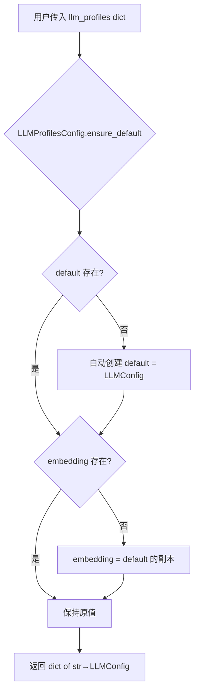
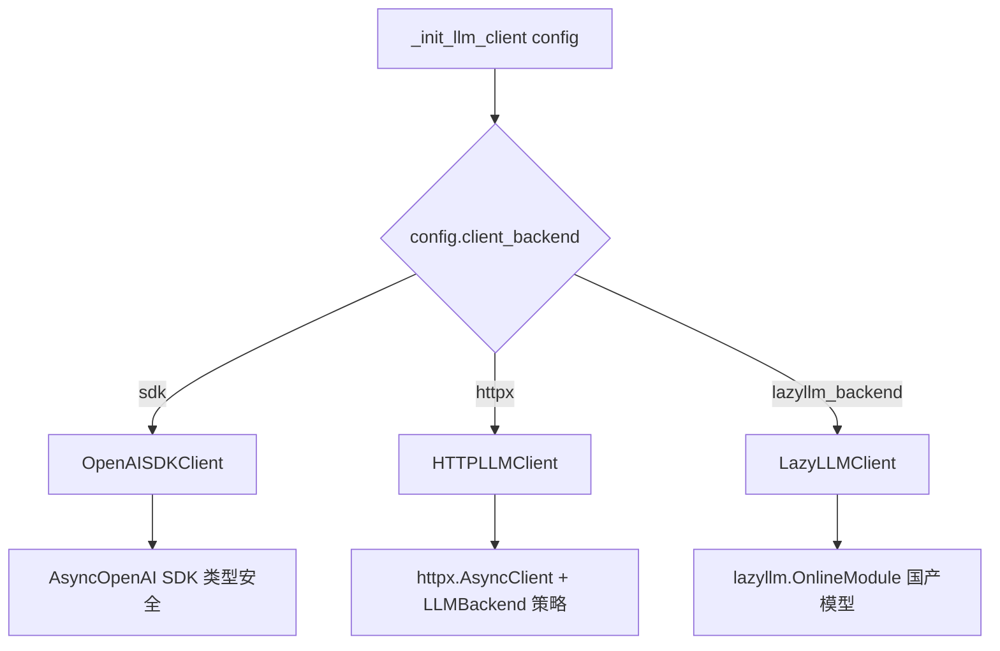
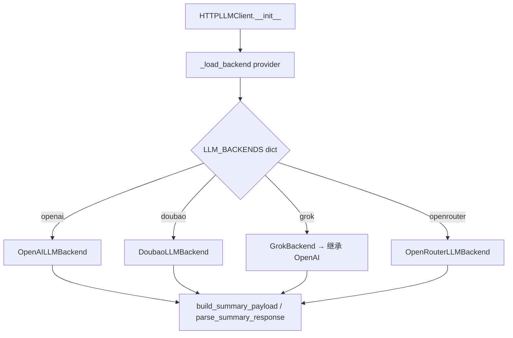
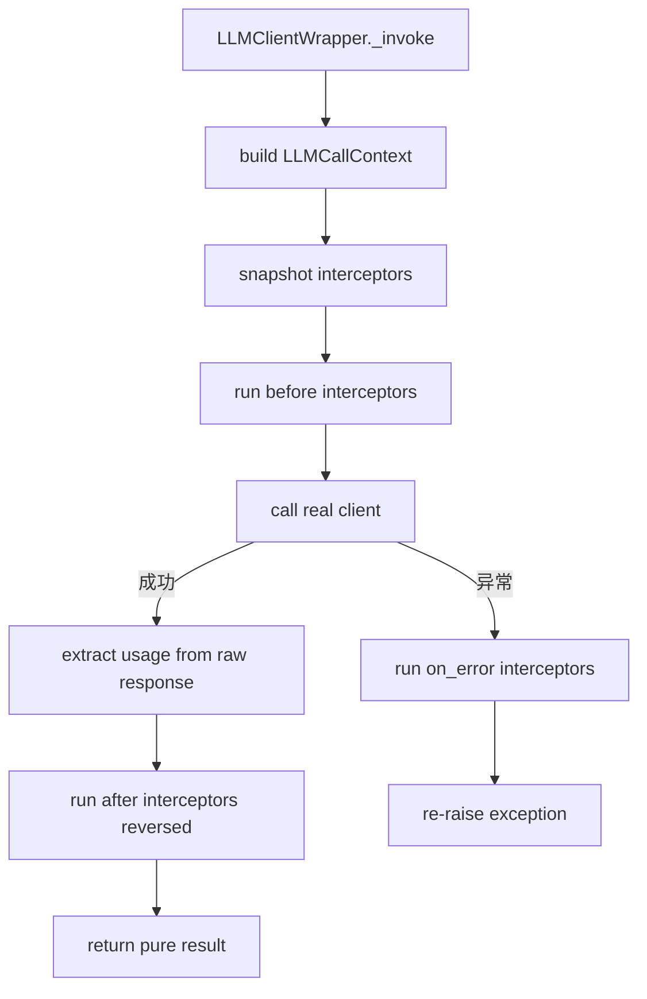

# PD-471.02 memU — 三后端 Profile 驱动多 LLM Provider 抽象

> 文档编号：PD-471.02
> 来源：memU `src/memu/app/settings.py`, `src/memu/llm/`
> GitHub：https://github.com/NevaMind-AI/memU.git
> 问题域：PD-471 多 LLM Provider 抽象 Multi-LLM Provider Abstraction
> 状态：可复用方案

---

## 第 1 章 问题与动机（≥ 30 行）

### 1.1 核心问题

在构建记忆系统（Memory-as-a-Service）时，不同操作对 LLM 的需求差异巨大：

- **记忆提取**需要高质量推理模型（如 GPT-4o）
- **向量嵌入**需要专用 Embedding 模型（如 text-embedding-3-small）
- **语音转写**需要 STT 模型（如 gpt-4o-mini-transcribe）
- **视觉理解**需要 VLM 模型（如 qwen-vl-plus）

同时，不同部署环境可能使用不同的 LLM 提供商：国内用 Doubao（豆包），海外用 OpenAI，成本敏感场景用 OpenRouter，xAI 用户用 Grok。如何在一个统一的接口下支持多 Provider、多模型、多后端，同时保持懒加载和可观测性，是核心挑战。

### 1.2 memU 的解法概述

memU 采用三层架构解决此问题：

1. **Profile 配置层**：`LLMProfilesConfig` 支持命名配置文件（default/embedding/自定义），每个 Profile 独立指定 provider、base_url、api_key、model（`src/memu/app/settings.py:263-296`）
2. **三后端客户端层**：`client_backend` 字段支持 `sdk`（OpenAI SDK）、`httpx`（通用 HTTP）、`lazyllm_backend`（LazyLLM 框架）三种客户端实现（`src/memu/app/service.py:97-135`）
3. **策略模式 Provider 层**：`LLMBackend` 抽象基类 + 4 个 Provider 实现（OpenAI/Doubao/Grok/OpenRouter），通过字典注册表实现工厂模式（`src/memu/llm/http_client.py:72-77`）
4. **拦截器包装层**：`LLMClientWrapper` 代理模式包装任意客户端，注入 before/after/on_error 拦截器链，实现可观测性（`src/memu/llm/wrapper.py:226-504`）
5. **懒加载缓存**：`_get_llm_base_client()` 按 Profile 名称懒初始化并缓存客户端实例（`src/memu/app/service.py:137-151`）

### 1.3 设计思想

| 设计原则 | 具体实现 | 理由 | 替代方案 |
|----------|----------|------|----------|
| Profile 隔离 | `LLMProfilesConfig` 字典，每个 key 对应独立 `LLMConfig` | 不同操作（chat/embed/vision）可用不同 provider+model | 全局单一配置 |
| 三后端可选 | `client_backend` 字段切换 sdk/httpx/lazyllm | SDK 类型安全、httpx 通用、lazyllm 支持国产模型 | 只用 OpenAI SDK |
| 策略模式 | `LLMBackend` 基类 + Provider 子类 + 字典注册表 | 新增 Provider 只需加一个子类 + 注册一行 | if-else 分支 |
| 代理包装 | `LLMClientWrapper.__getattr__` 透传 + 拦截器 | 不侵入客户端代码即可注入可观测性 | 修改每个客户端类 |
| 懒加载 | dict 缓存 + 首次访问时初始化 | 避免启动时连接所有 Provider | 启动时全部初始化 |
| Provider 默认值自动切换 | `set_provider_defaults` model_validator | 用户只需改 `provider: grok`，base_url/api_key/model 自动适配 | 要求用户手动填写所有字段 |

---

## 第 2 章 源码实现分析（核心章节）

### 2.1 架构概览

```
┌─────────────────────────────────────────────────────────────────┐
│                      MemoryService                              │
│  llm_profiles: LLMProfilesConfig                                │
│  _llm_clients: dict[str, Any]  (lazy cache)                    │
│  _llm_interceptors: LLMInterceptorRegistry                     │
├─────────────────────────────────────────────────────────────────┤
│  _get_llm_client(profile)                                       │
│    ├── _get_llm_base_client(profile)  → lazy init + cache       │
│    │     └── _init_llm_client(config)                           │
│    │           ├── sdk       → OpenAISDKClient                  │
│    │           ├── httpx     → HTTPLLMClient                    │
│    │           │               ├── LLM_BACKENDS[provider]       │
│    │           │               │   ├── OpenAILLMBackend         │
│    │           │               │   ├── DoubaoLLMBackend         │
│    │           │               │   ├── GrokBackend              │
│    │           │               │   └── OpenRouterLLMBackend     │
│    │           │               └── _EmbeddingBackend[provider]  │
│    │           └── lazyllm   → LazyLLMClient                    │
│    └── _wrap_llm_client(client)                                 │
│          └── LLMClientWrapper                                   │
│                ├── before interceptors                           │
│                ├── delegate to real client                       │
│                ├── after interceptors                            │
│                └── on_error interceptors                         │
└─────────────────────────────────────────────────────────────────┘
```

### 2.2 核心实现

#### 2.2.1 Profile 配置系统



对应源码 `src/memu/app/settings.py:263-296`：
```python
class LLMProfilesConfig(RootModel[dict[Key, LLMConfig]]):
    root: dict[str, LLMConfig] = Field(default_factory=lambda: {"default": LLMConfig()})

    @model_validator(mode="before")
    @classmethod
    def ensure_default(cls, data: Any) -> Any:
        if data is None:
            data = {}
        elif isinstance(data, dict):
            data = dict(data)
        else:
            return data
        if "default" not in data:
            data["default"] = LLMConfig()
        if "embedding" not in data:
            data["embedding"] = data["default"]
        return data

    @property
    def profiles(self) -> dict[str, LLMConfig]:
        return self.root

    @property
    def default(self) -> LLMConfig:
        return self.root.get("default", LLMConfig())
```

每个 `LLMConfig` 包含完整的 Provider 配置（`src/memu/app/settings.py:102-138`）：
```python
class LLMConfig(BaseModel):
    provider: str = Field(default="openai")
    base_url: str = Field(default="https://api.openai.com/v1")
    api_key: str = Field(default="OPENAI_API_KEY")
    chat_model: str = Field(default="gpt-4o-mini")
    client_backend: str = Field(default="sdk")
    lazyllm_source: LazyLLMSource = Field(default=LazyLLMSource())
    endpoint_overrides: dict[str, str] = Field(default_factory=dict)
    embed_model: str = Field(default="text-embedding-3-small")
    embed_batch_size: int = Field(default=1)

    @model_validator(mode="after")
    def set_provider_defaults(self) -> "LLMConfig":
        if self.provider == "grok":
            if self.base_url == "https://api.openai.com/v1":
                self.base_url = "https://api.x.ai/v1"
            if self.api_key == "OPENAI_API_KEY":
                self.api_key = "XAI_API_KEY"
            if self.chat_model == "gpt-4o-mini":
                self.chat_model = "grok-2-latest"
        return self
```

#### 2.2.2 三后端客户端工厂



对应源码 `src/memu/app/service.py:97-135`：
```python
def _init_llm_client(self, config: LLMConfig | None = None) -> Any:
    cfg = config or self.llm_config
    backend = cfg.client_backend
    if backend == "sdk":
        from memu.llm.openai_sdk import OpenAISDKClient
        return OpenAISDKClient(
            base_url=cfg.base_url, api_key=cfg.api_key,
            chat_model=cfg.chat_model, embed_model=cfg.embed_model,
            embed_batch_size=cfg.embed_batch_size,
        )
    elif backend == "httpx":
        return HTTPLLMClient(
            base_url=cfg.base_url, api_key=cfg.api_key,
            chat_model=cfg.chat_model, provider=cfg.provider,
            endpoint_overrides=cfg.endpoint_overrides,
            embed_model=cfg.embed_model,
        )
    elif backend == "lazyllm_backend":
        from memu.llm.lazyllm_client import LazyLLMClient
        return LazyLLMClient(
            llm_source=cfg.lazyllm_source.llm_source or cfg.lazyllm_source.source,
            vlm_source=cfg.lazyllm_source.vlm_source or cfg.lazyllm_source.source,
            embed_source=cfg.lazyllm_source.embed_source or cfg.lazyllm_source.source,
            stt_source=cfg.lazyllm_source.stt_source or cfg.lazyllm_source.source,
            chat_model=cfg.chat_model, embed_model=cfg.embed_model,
            vlm_model=cfg.lazyllm_source.vlm_model,
            stt_model=cfg.lazyllm_source.stt_model,
        )
```

#### 2.2.3 Provider 策略注册表



对应源码 `src/memu/llm/http_client.py:72-77`：
```python
LLM_BACKENDS: dict[str, Callable[[], LLMBackend]] = {
    OpenAILLMBackend.name: OpenAILLMBackend,      # "openai"
    DoubaoLLMBackend.name: DoubaoLLMBackend,      # "doubao"
    GrokBackend.name: GrokBackend,                 # "grok"
    OpenRouterLLMBackend.name: OpenRouterLLMBackend,  # "openrouter"
}
```

每个 Backend 子类只需定义 `name`、`summary_endpoint` 和 payload 构建/解析方法。Grok 直接继承 OpenAI（`src/memu/llm/backends/grok.py:6-11`）：
```python
class GrokBackend(OpenAILLMBackend):
    name = "grok"
    # 继承 OpenAI 的所有 payload 构建和解析逻辑
```

### 2.3 实现细节

#### 懒加载与缓存机制

`MemoryService._get_llm_base_client()` 实现了按 Profile 名称的懒加载缓存（`src/memu/app/service.py:137-151`）：

```python
def _get_llm_base_client(self, profile: str | None = None) -> Any:
    name = profile or "default"
    client = self._llm_clients.get(name)
    if client is not None:
        return client
    cfg = self.llm_profiles.profiles.get(name)
    if cfg is None:
        raise KeyError(f"Unknown llm profile '{name}'")
    client = self._init_llm_client(cfg)
    self._llm_clients[name] = client
    return client
```

#### 拦截器包装层

`LLMClientWrapper` 使用代理模式包装任意客户端，注入三阶段拦截器（`src/memu/llm/wrapper.py:387-435`）：



拦截器支持按 provider/model/operation/status 过滤（`src/memu/llm/wrapper.py:62-86`）：
```python
@dataclass(frozen=True)
class LLMCallFilter:
    operations: set[str] | None = None
    step_ids: set[str] | None = None
    providers: set[str] | None = None
    models: set[str] | None = None
    statuses: set[str] | None = None

    def matches(self, ctx: LLMCallContext, status: str | None) -> bool:
        if self.operations and (ctx.operation or "").lower() not in self.operations:
            return False
        if self.providers and (ctx.provider or "").lower() not in self.providers:
            return False
        if self.models and (ctx.model or "").lower() not in self.models:
            return False
        return True
```

#### LazyLLM 国产模型适配

`LazyLLMClient` 通过 `lazyllm.namespace("MEMU").OnlineModule()` 按需创建模型客户端，支持 Qwen、Doubao、SiliconFlow 等国产模型源（`src/memu/llm/lazyllm_client.py:62-67`）：

```python
async def chat(self, text: str, *, max_tokens=None, system_prompt=None, temperature=0.2):
    client = lazyllm.namespace("MEMU").OnlineModule(
        source=self.llm_source, model=self.chat_model, type="llm"
    )
    prompt = f"{system_prompt}\n\n" if system_prompt else ""
    full_prompt = f"{prompt}text:\n{text}"
    response = await self._call_async(client, full_prompt)
    return cast(str, response)
```

阻塞调用通过 `asyncio.to_thread` 转为异步（`src/memu/llm/lazyllm_client.py:35-42`）。


---

## 第 3 章 迁移指南

### 3.1 迁移清单

**阶段 1：Profile 配置系统（必选）**
- [ ] 定义 `LLMConfig` Pydantic 模型，包含 provider/base_url/api_key/chat_model/embed_model
- [ ] 定义 `LLMProfilesConfig` 字典容器，确保 default 和 embedding Profile 始终存在
- [ ] 实现 `set_provider_defaults` validator，自动切换 Provider 默认值

**阶段 2：多后端客户端（按需选择）**
- [ ] 实现 SDK 客户端（推荐 OpenAI SDK，类型安全）
- [ ] 实现 HTTP 客户端（通用 httpx，支持自定义 endpoint）
- [ ] 实现 LazyLLM 客户端（可选，国产模型场景）
- [ ] 统一返回格式：`tuple[result, raw_response]`

**阶段 3：Provider 策略层（httpx 后端专用）**
- [ ] 定义 `LLMBackend` 抽象基类（build_payload / parse_response）
- [ ] 实现各 Provider 子类（OpenAI/Doubao/OpenRouter 等）
- [ ] 建立 `LLM_BACKENDS` 字典注册表

**阶段 4：拦截器与可观测性（可选增强）**
- [ ] 实现 `LLMClientWrapper` 代理包装
- [ ] 实现 `LLMInterceptorRegistry` 三阶段拦截器
- [ ] 实现 `LLMCallFilter` 按 provider/model/operation 过滤

### 3.2 适配代码模板

以下是一个最小可运行的 Profile + 多后端实现：

```python
from __future__ import annotations
from typing import Any
from pydantic import BaseModel, Field, RootModel, model_validator


class LLMConfig(BaseModel):
    """单个 LLM Provider 配置"""
    provider: str = "openai"
    base_url: str = "https://api.openai.com/v1"
    api_key: str = ""
    chat_model: str = "gpt-4o-mini"
    embed_model: str = "text-embedding-3-small"
    client_backend: str = "sdk"  # "sdk" | "httpx"

    @model_validator(mode="after")
    def set_provider_defaults(self) -> "LLMConfig":
        """自动切换 Provider 默认值"""
        PROVIDER_DEFAULTS = {
            "grok": {"base_url": "https://api.x.ai/v1", "chat_model": "grok-2-latest"},
            "doubao": {"base_url": "https://ark.cn-beijing.volces.com", "chat_model": "doubao-pro-32k"},
        }
        defaults = PROVIDER_DEFAULTS.get(self.provider, {})
        for key, value in defaults.items():
            if getattr(self, key) == LLMConfig.model_fields[key].default:
                setattr(self, key, value)
        return self


class LLMProfiles(RootModel[dict[str, LLMConfig]]):
    """命名 Profile 集合，确保 default 始终存在"""
    root: dict[str, LLMConfig] = Field(default_factory=lambda: {"default": LLMConfig()})

    @model_validator(mode="before")
    @classmethod
    def ensure_default(cls, data: Any) -> Any:
        if not isinstance(data, dict):
            data = {}
        if "default" not in data:
            data["default"] = {}
        if "embedding" not in data:
            data["embedding"] = data["default"]
        return data

    def get(self, name: str) -> LLMConfig:
        cfg = self.root.get(name)
        if cfg is None:
            raise KeyError(f"Unknown profile '{name}'")
        return cfg


class LLMClientFactory:
    """懒加载客户端工厂"""
    def __init__(self, profiles: LLMProfiles):
        self._profiles = profiles
        self._cache: dict[str, Any] = {}

    def get_client(self, profile: str = "default") -> Any:
        if profile not in self._cache:
            cfg = self._profiles.get(profile)
            self._cache[profile] = self._create_client(cfg)
        return self._cache[profile]

    def _create_client(self, cfg: LLMConfig) -> Any:
        if cfg.client_backend == "sdk":
            from openai import AsyncOpenAI
            return AsyncOpenAI(api_key=cfg.api_key, base_url=cfg.base_url)
        elif cfg.client_backend == "httpx":
            import httpx
            return httpx.AsyncClient(base_url=cfg.base_url, headers={"Authorization": f"Bearer {cfg.api_key}"})
        raise ValueError(f"Unknown backend: {cfg.client_backend}")
```

### 3.3 适用场景

| 场景 | 适用度 | 说明 |
|------|--------|------|
| 多模型记忆系统 | ⭐⭐⭐ | chat/embed/vision 各用不同模型，Profile 天然适配 |
| 多 Provider 切换 | ⭐⭐⭐ | 国内外部署用不同 Provider，只改配置不改代码 |
| Agent 工具调用 | ⭐⭐ | Agent 不同步骤可用不同 Profile（推理用强模型，摘要用便宜模型） |
| 单 Provider 简单场景 | ⭐ | 过度设计，直接用 OpenAI SDK 即可 |
| 流式输出场景 | ⭐ | memU 当前不支持 streaming，需自行扩展 |

---

## 第 4 章 测试用例

```python
import pytest
from unittest.mock import AsyncMock, MagicMock, patch
from typing import Any


# ---- Profile 配置测试 ----

class TestLLMProfilesConfig:
    def test_default_profile_auto_created(self):
        """空配置应自动创建 default 和 embedding Profile"""
        from memu.app.settings import LLMProfilesConfig
        profiles = LLMProfilesConfig.model_validate(None)
        assert "default" in profiles.profiles
        assert "embedding" in profiles.profiles

    def test_custom_profiles_preserved(self):
        """自定义 Profile 应保留，同时确保 default 存在"""
        from memu.app.settings import LLMProfilesConfig
        data = {
            "reasoning": {"provider": "openai", "chat_model": "o1-preview"},
            "cheap": {"provider": "openrouter", "chat_model": "meta-llama/llama-3-8b"},
        }
        profiles = LLMProfilesConfig.model_validate(data)
        assert "default" in profiles.profiles
        assert "reasoning" in profiles.profiles
        assert profiles.profiles["reasoning"].chat_model == "o1-preview"

    def test_grok_provider_defaults(self):
        """provider=grok 应自动切换 base_url 和 model"""
        from memu.app.settings import LLMConfig
        cfg = LLMConfig(provider="grok")
        assert cfg.base_url == "https://api.x.ai/v1"
        assert cfg.chat_model == "grok-2-latest"
        assert cfg.api_key == "XAI_API_KEY"

    def test_grok_custom_values_not_overridden(self):
        """provider=grok 但用户指定了自定义值，不应被覆盖"""
        from memu.app.settings import LLMConfig
        cfg = LLMConfig(provider="grok", base_url="https://custom.api/v1", chat_model="grok-3")
        assert cfg.base_url == "https://custom.api/v1"
        assert cfg.chat_model == "grok-3"


# ---- 客户端工厂测试 ----

class TestClientFactory:
    def test_sdk_backend_creates_openai_client(self):
        """client_backend=sdk 应创建 OpenAISDKClient"""
        from memu.app.settings import LLMConfig
        from memu.app.service import MemoryService
        cfg = LLMConfig(client_backend="sdk", api_key="test-key")
        service = MagicMock(spec=MemoryService)
        service.llm_config = cfg
        client = MemoryService._init_llm_client(service, cfg)
        assert type(client).__name__ == "OpenAISDKClient"

    def test_httpx_backend_creates_http_client(self):
        """client_backend=httpx 应创建 HTTPLLMClient"""
        from memu.app.settings import LLMConfig
        from memu.app.service import MemoryService
        cfg = LLMConfig(client_backend="httpx", api_key="test-key")
        service = MagicMock(spec=MemoryService)
        client = MemoryService._init_llm_client(service, cfg)
        assert type(client).__name__ == "HTTPLLMClient"

    def test_unknown_backend_raises(self):
        """未知 client_backend 应抛出 ValueError"""
        from memu.app.settings import LLMConfig
        from memu.app.service import MemoryService
        cfg = LLMConfig(client_backend="unknown")
        service = MagicMock(spec=MemoryService)
        with pytest.raises(ValueError, match="Unknown llm_client_backend"):
            MemoryService._init_llm_client(service, cfg)


# ---- Provider 注册表测试 ----

class TestProviderRegistry:
    def test_all_providers_registered(self):
        """所有 Provider 应在注册表中"""
        from memu.llm.http_client import LLM_BACKENDS
        assert "openai" in LLM_BACKENDS
        assert "doubao" in LLM_BACKENDS
        assert "grok" in LLM_BACKENDS
        assert "openrouter" in LLM_BACKENDS

    def test_unknown_provider_raises(self):
        """未知 Provider 应抛出 ValueError"""
        from memu.llm.http_client import HTTPLLMClient
        with pytest.raises(ValueError, match="Unsupported LLM provider"):
            HTTPLLMClient(base_url="http://x", api_key="k", chat_model="m", provider="unknown")

    def test_grok_inherits_openai(self):
        """Grok 应继承 OpenAI 的 payload 构建逻辑"""
        from memu.llm.backends.grok import GrokBackend
        from memu.llm.backends.openai import OpenAILLMBackend
        assert issubclass(GrokBackend, OpenAILLMBackend)


# ---- 懒加载测试 ----

class TestLazyLoading:
    def test_client_cached_per_profile(self):
        """同一 Profile 应返回缓存的客户端实例"""
        from memu.app.settings import LLMConfig, LLMProfilesConfig
        profiles = LLMProfilesConfig.model_validate({"default": {"api_key": "k"}})
        service = MagicMock()
        service.llm_profiles = profiles
        service._llm_clients = {}
        service._init_llm_client = MagicMock(return_value="mock_client")
        # 模拟 _get_llm_base_client 逻辑
        result1 = MemoryService._get_llm_base_client(service, "default")
        result2 = MemoryService._get_llm_base_client(service, "default")
        assert result1 is result2
        service._init_llm_client.assert_called_once()

    def test_unknown_profile_raises(self):
        """未知 Profile 应抛出 KeyError"""
        from memu.app.settings import LLMProfilesConfig
        profiles = LLMProfilesConfig.model_validate(None)
        service = MagicMock()
        service.llm_profiles = profiles
        service._llm_clients = {}
        with pytest.raises(KeyError, match="Unknown llm profile"):
            MemoryService._get_llm_base_client(service, "nonexistent")
```


---

## 第 5 章 跨域关联

| 关联域 | 关系类型 | 说明 |
|--------|----------|------|
| PD-01 上下文管理 | 协同 | Profile 机制允许为上下文压缩操作指定专用的便宜模型（如 `memorize_config.preprocess_llm_profile`） |
| PD-06 记忆持久化 | 依赖 | memU 的记忆提取、分类摘要、检索排序均通过 `_get_llm_client(profile)` 获取不同 Profile 的客户端 |
| PD-08 搜索与检索 | 协同 | embedding Profile 独立配置 embed_model，检索时用 `retrieve_config.sufficiency_check_llm_profile` 指定判断模型 |
| PD-10 中间件管道 | 依赖 | `LLMClientWrapper` 的拦截器机制本质是中间件管道，before/after/on_error 三阶段与 PD-10 中间件模式一致 |
| PD-11 可观测性 | 协同 | `LLMInterceptorRegistry` 的 after 拦截器可注入 token 计量、延迟追踪、成本统计等可观测性逻辑 |
| PD-04 工具系统 | 协同 | 不同工具调用可通过 `step_context` 传递 operation/step_id，拦截器按此过滤实现工具级别的 LLM 调用追踪 |

---

## 第 6 章 来源文件索引

| 文件 | 行范围 | 关键实现 |
|------|--------|----------|
| `src/memu/app/settings.py` | L92-138 | `LazyLLMSource` + `LLMConfig` 配置模型，含 provider 默认值自动切换 |
| `src/memu/app/settings.py` | L263-296 | `LLMProfilesConfig` 多 Profile 容器，ensure_default validator |
| `src/memu/app/service.py` | L49-96 | `MemoryService.__init__` 初始化 Profile、懒缓存、拦截器注册表 |
| `src/memu/app/service.py` | L97-135 | `_init_llm_client` 三后端客户端工厂 |
| `src/memu/app/service.py` | L137-189 | `_get_llm_base_client` 懒加载 + `_wrap_llm_client` 拦截器包装 |
| `src/memu/llm/backends/base.py` | L6-31 | `LLMBackend` 抽象基类定义 |
| `src/memu/llm/backends/openai.py` | L8-64 | `OpenAILLMBackend` OpenAI 兼容 payload 构建 |
| `src/memu/llm/backends/doubao.py` | L8-69 | `DoubaoLLMBackend` 豆包 API 适配（条件 max_tokens） |
| `src/memu/llm/backends/grok.py` | L6-11 | `GrokBackend` 继承 OpenAI，零代码适配 |
| `src/memu/llm/backends/openrouter.py` | L8-70 | `OpenRouterLLMBackend` OpenRouter API 适配 |
| `src/memu/llm/http_client.py` | L72-77 | `LLM_BACKENDS` Provider 注册表 |
| `src/memu/llm/http_client.py` | L80-300 | `HTTPLLMClient` 通用 HTTP 客户端 |
| `src/memu/llm/openai_sdk.py` | L20-219 | `OpenAISDKClient` 官方 SDK 客户端（含批量 embedding） |
| `src/memu/llm/lazyllm_client.py` | L9-159 | `LazyLLMClient` LazyLLM 框架客户端（国产模型） |
| `src/memu/llm/wrapper.py` | L17-96 | `LLMCallContext/RequestView/ResponseView/Usage` 数据结构 |
| `src/memu/llm/wrapper.py` | L128-224 | `LLMInterceptorRegistry` 三阶段拦截器注册表 |
| `src/memu/llm/wrapper.py` | L226-504 | `LLMClientWrapper` 代理包装 + 拦截器执行引擎 |

---

## 第 7 章 横向对比维度

```json comparison_data
{
  "project": "memU",
  "dimensions": {
    "Provider 注册方式": "dict 字典注册表 + LLMBackend 策略子类，新增 Provider 一行注册",
    "多配置文件管理": "LLMProfilesConfig RootModel 字典，ensure_default validator 保证 default/embedding 始终存在",
    "客户端后端": "三后端可选：sdk（OpenAI SDK）/ httpx（通用 HTTP）/ lazyllm（国产模型框架）",
    "懒加载机制": "dict 缓存按 Profile 名称懒初始化，首次 _get_llm_base_client 时创建",
    "可观测性集成": "LLMClientWrapper 代理模式 + LLMInterceptorRegistry 三阶段拦截器（before/after/on_error）",
    "Provider 默认值": "Pydantic model_validator 自动切换 base_url/api_key/model，用户只需改 provider 字段",
    "国产模型支持": "LazyLLMClient 通过 lazyllm.OnlineModule 支持 Qwen/Doubao/SiliconFlow 等国产模型源"
  }
}
```

### 域元数据补充

```json domain_metadata
{
  "solution_summary": "memU 通过 LLMProfilesConfig 多 Profile 字典 + 三后端客户端工厂(sdk/httpx/lazyllm) + LLMBackend 策略注册表 + LLMClientWrapper 拦截器代理实现多 Provider 抽象",
  "description": "客户端后端与 Provider 策略的正交组合，实现传输层与协议层解耦",
  "sub_problems": [
    "客户端后端选择（SDK vs HTTP vs 框架封装）",
    "Provider 默认值自动推导与覆盖优先级",
    "拦截器链与 LLM 调用可观测性注入"
  ],
  "best_practices": [
    "三后端正交设计：传输层(sdk/httpx/lazyllm)与协议层(Provider Backend)独立变化",
    "Pydantic model_validator 实现 Provider 默认值自动切换，减少用户配置负担",
    "LLMClientWrapper 代理模式注入拦截器，不侵入任何客户端实现代码"
  ]
}
```

