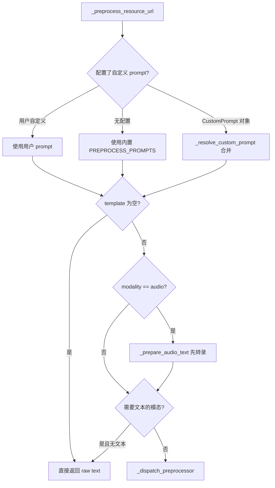
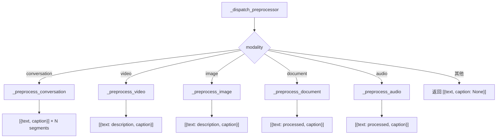
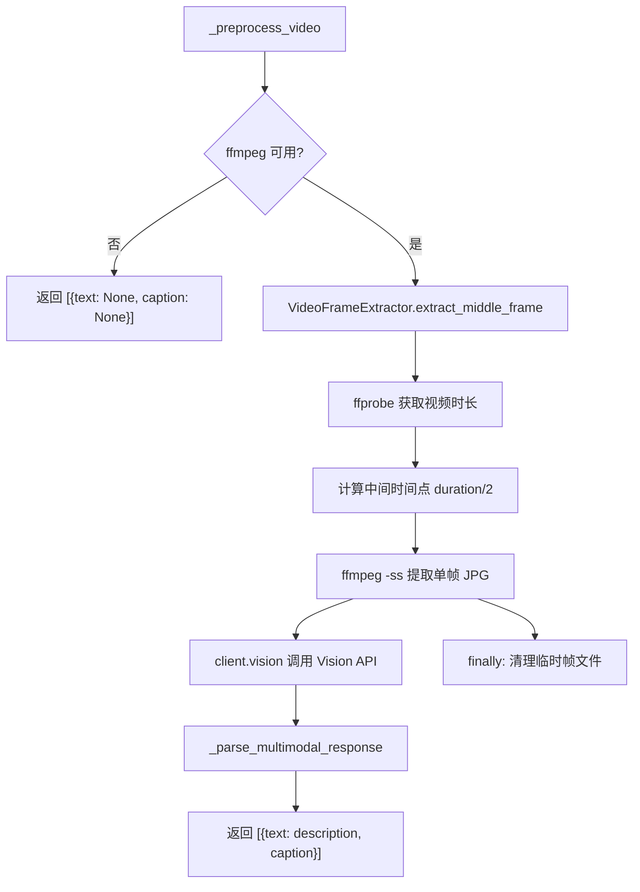
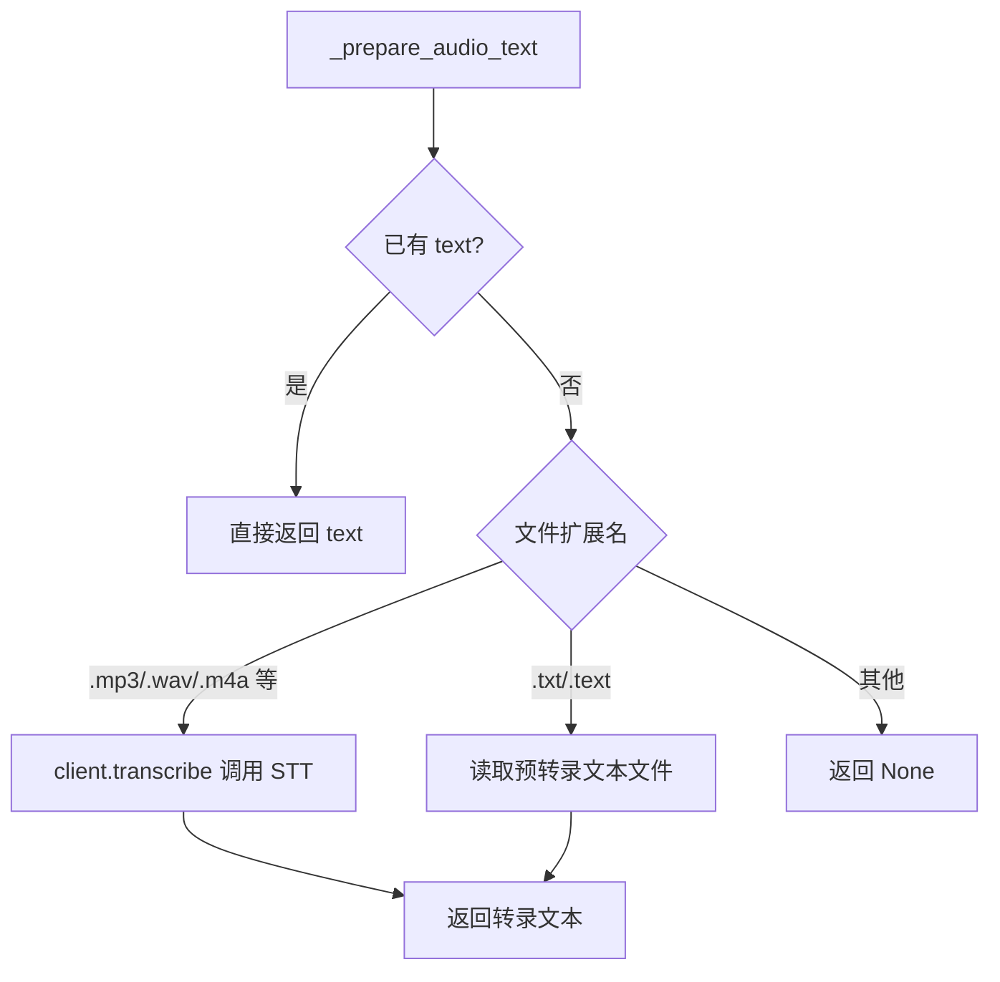

# PD-472.01 memU — 五模态统一预处理管道

> 文档编号：PD-472.01
> 来源：memU `src/memu/app/memorize.py`, `src/memu/llm/wrapper.py`, `src/memu/llm/openai_sdk.py`
> GitHub：https://github.com/NevaMind-AI/memU.git
> 问题域：PD-472 多模态预处理 Multimodal Preprocessing
> 状态：可复用方案

---

## 第 1 章 问题与动机（≥ 30 行）

### 1.1 核心问题

记忆系统需要处理来自多种模态的输入——对话文本、文档、图片、视频、音频——但下游的记忆提取管道只接受文本。如何将五种异构模态统一转换为文本，同时保留每种模态的语义特征（图片的视觉细节、音频的语音内容、视频的时序信息），是多模态记忆系统的核心工程挑战。

关键难点：
- **模态异构性**：图片是像素矩阵，音频是波形信号，视频是帧序列+音轨，文本是字符串——数据结构完全不同
- **预处理逻辑差异**：图片需要 Vision API 描述，音频需要 STT 转录，视频需要关键帧提取后再 Vision 处理，对话需要分段
- **Prompt 定制需求**：不同模态的 LLM 指令完全不同，且用户可能需要覆盖默认 prompt
- **统一输出格式**：无论输入什么模态，下游都需要 `{text, caption}` 的统一结构

### 1.2 memU 的解法概述

memU 采用 **Workflow Step + Dispatcher 模式**，将多模态预处理封装为 7 步工作流中的第 2 步 `preprocess_multimodal`（`memorize.py:107-115`），通过 `_dispatch_preprocessor` 方法（`memorize.py:775-794`）按 modality 字符串路由到五个独立的预处理器：

1. **统一入口**：`_preprocess_resource_url`（`memorize.py:689-735`）作为所有模态的统一入口，负责 prompt 解析和模态路由
2. **五路分发**：`_dispatch_preprocessor` 根据 modality 字符串分发到 conversation/video/image/document/audio 五个处理器
3. **音频两阶段**：音频模态先通过 `_prepare_audio_text`（`memorize.py:737-770`）完成 STT 转录，再进入文本预处理
4. **视频关键帧**：视频通过 `VideoFrameExtractor`（`utils/video.py:15`）提取中间帧，再用 Vision API 分析
5. **统一输出**：所有预处理器返回 `list[dict[str, str | None]]`，每个 dict 包含 `text` 和 `caption`

### 1.3 设计思想

| 设计原则 | 具体实现 | 理由 | 替代方案 |
|----------|----------|------|----------|
| 模态路由分离 | `_dispatch_preprocessor` 按 modality 字符串 if-elif 分发 | 每种模态处理逻辑差异大，硬编码路由最直观 | Strategy 模式注册表 |
| Prompt 三级解析 | 用户自定义 > 配置覆盖 > 内置默认 | 允许用户精细控制每种模态的预处理行为 | 单一 prompt 模板 |
| 音频两阶段管道 | 先 STT 转录再文本预处理 | 音频必须先转为文本才能进入统一管道 | 直接用多模态模型处理音频 |
| 统一输出契约 | 所有预处理器返回 `[{text, caption}]` | 下游 extract_items 步骤只需处理一种数据结构 | 每种模态返回不同结构 |
| WorkflowStep 编排 | 预处理是 7 步工作流的第 2 步，声明 requires/produces | 步骤间依赖显式化，支持拦截器注入 | 直接函数调用链 |

---

## 第 2 章 源码实现分析（≥ 60 行，核心章节）

### 2.1 架构概览

memU 的多模态预处理位于 memorize 工作流的第 2 步，整体架构如下：

```
┌─────────────────────────────────────────────────────────────────┐
│                    Memorize Workflow (7 steps)                   │
├─────────┬──────────────┬──────────┬───────┬──────┬──────┬──────┤
│ ingest  │ preprocess   │ extract  │ dedup │ cat  │ per  │ resp │
│ resource│ multimodal   │ items    │ merge │ egor │ sist │ onse │
│ (Step1) │ (Step2) ★    │ (Step3)  │ (S4)  │ (S5) │ (S6) │ (S7) │
└────┬────┴──────┬───────┴────┬─────┴───────┴──────┴──────┴──────┘
     │           │            │
     │    ┌──────▼──────┐     │
     │    │ _preprocess │     │
     │    │ resource_url│     │
     │    └──────┬──────┘     │
     │           │            │
     │    ┌──────▼──────────────────────────────────┐
     │    │         _dispatch_preprocessor           │
     │    ├────────┬────────┬────────┬───────┬──────┤
     │    │ conver │ video  │ image  │ doc   │audio │
     │    │ sation │        │        │       │      │
     │    └────────┴───┬────┴────┬───┴───────┴──┬───┘
     │                 │         │               │
     │          ┌──────▼───┐ ┌──▼────┐  ┌───────▼──────┐
     │          │ffmpeg    │ │Vision │  │STT transcribe│
     │          │extract   │ │ API   │  │→ text preproc│
     │          │frame→    │ │       │  │              │
     │          │Vision API│ │       │  │              │
     │          └──────────┘ └───────┘  └──────────────┘
     │                                         │
     └─────────────────────────────────────────┘
                    统一输出: [{text, caption}]
```

### 2.2 核心实现

#### 2.2.1 统一预处理入口



对应源码 `src/memu/app/memorize.py:689-735`：

```python
async def _preprocess_resource_url(
    self, *, local_path: str, text: str | None, modality: str, llm_client: Any | None = None
) -> list[dict[str, str | None]]:
    configured_prompt = self.memorize_config.multimodal_preprocess_prompts.get(modality)
    if configured_prompt is None:
        template = PREPROCESS_PROMPTS.get(modality)
    elif isinstance(configured_prompt, str):
        template = configured_prompt
    else:
        template = self._resolve_custom_prompt(configured_prompt, {})

    if not template:
        return [{"text": text, "caption": None}]

    if modality == "audio":
        text = await self._prepare_audio_text(local_path, text, llm_client=llm_client)
        if text is None:
            return [{"text": None, "caption": None}]

    if self._modality_requires_text(modality) and not text:
        return [{"text": text, "caption": None}]

    return await self._dispatch_preprocessor(
        modality=modality, local_path=local_path,
        text=text, template=template, llm_client=llm_client,
    )
```

#### 2.2.2 五路模态分发器



对应源码 `src/memu/app/memorize.py:775-794`：

```python
async def _dispatch_preprocessor(
    self, *, modality: str, local_path: str, text: str | None,
    template: str, llm_client: Any | None = None,
) -> list[dict[str, str | None]]:
    if modality == "conversation" and text is not None:
        return await self._preprocess_conversation(text, template, llm_client=llm_client)
    if modality == "video":
        return await self._preprocess_video(local_path, template, llm_client=llm_client)
    if modality == "image":
        return await self._preprocess_image(local_path, template, llm_client=llm_client)
    if modality == "document" and text is not None:
        return await self._preprocess_document(text, template, llm_client=llm_client)
    if modality == "audio" and text is not None:
        return await self._preprocess_audio(text, template, llm_client=llm_client)
    return [{"text": text, "caption": None}]
```

#### 2.2.3 视频处理：ffmpeg 关键帧 + Vision API



对应源码 `src/memu/app/memorize.py:845-889` 和 `src/memu/utils/video.py:31-118`：

```python
async def _preprocess_video(
    self, local_path: str, template: str, llm_client: Any | None = None
) -> list[dict[str, str | None]]:
    try:
        if not VideoFrameExtractor.is_ffmpeg_available():
            logger.warning("ffmpeg not available, cannot process video. Returning None.")
            return [{"text": None, "caption": None}]

        logger.info(f"Extracting frame from video: {local_path}")
        frame_path = VideoFrameExtractor.extract_middle_frame(local_path)

        try:
            logger.info(f"Analyzing video frame with Vision API: {frame_path}")
            client = llm_client or self._get_llm_client()
            processed = await client.vision(prompt=template, image_path=frame_path, system_prompt=None)
            description, caption = self._parse_multimodal_response(processed, "detailed_description", "caption")
            return [{"text": description, "caption": caption}]
        finally:
            pathlib.Path(frame_path).unlink(missing_ok=True)
    except Exception as e:
        logger.error(f"Video preprocessing failed: {e}", exc_info=True)
        return [{"text": None, "caption": None}]
```

`VideoFrameExtractor.extract_middle_frame`（`utils/video.py:31-118`）的关键实现：
- 用 `ffprobe` 获取视频时长
- 计算 `duration / 2` 作为中间帧时间点
- 用 `ffmpeg -ss {time} -i {video} -vframes 1 -q:v 2` 提取高质量 JPG
- 所有 ffmpeg 命令通过 `_run_ffmpeg_command` 统一执行，带 30 秒超时和路径安全校验

#### 2.2.4 音频两阶段处理



对应源码 `src/memu/app/memorize.py:737-770`：

```python
async def _prepare_audio_text(self, local_path: str, text: str | None, llm_client: Any | None = None) -> str | None:
    if text:
        return text

    audio_extensions = {".mp3", ".mp4", ".mpeg", ".mpga", ".m4a", ".wav", ".webm"}
    text_extensions = {".txt", ".text"}
    file_ext = pathlib.Path(local_path).suffix.lower()

    if file_ext in audio_extensions:
        try:
            client = llm_client or self._get_llm_client()
            transcribed = cast(str, await client.transcribe(local_path))
        except Exception:
            logger.exception("Audio transcription failed for %s", local_path)
            return None
        else:
            return transcribed

    if file_ext in text_extensions:
        path_obj = pathlib.Path(local_path)
        try:
            text_content = path_obj.read_text(encoding="utf-8")
        except Exception:
            logger.exception("Failed to read text file %s", local_path)
            return None
        else:
            return text_content

    logger.warning(f"Unknown audio file type: {file_ext}, skipping transcription")
    return None
```

### 2.3 实现细节

**LLM 客户端包装器的多模态统一接口**

`LLMClientWrapper`（`wrapper.py:226-505`）为所有 LLM 调用提供统一的拦截器管道，支持五种操作类型：

| 操作 | 方法 | 用途 |
|------|------|------|
| `chat` | `wrapper.py:274-306` | 文本对话（conversation/document/audio 预处理） |
| `vision` | `wrapper.py:308-338` | 图片+文本多模态（image/video 预处理） |
| `transcribe` | `wrapper.py:354-385` | 音频转文本（audio 第一阶段） |
| `embed` | `wrapper.py:340-352` | 文本向量化（caption 嵌入） |
| `summarize` | `wrapper.py:247-272` | 文本摘要（segment caption 生成） |

每种操作都经过 `_invoke` 方法（`wrapper.py:387-435`）的统一拦截器管道：before → call → after/on_error，支持 token 用量追踪和延迟测量。

**Vision API 的 base64 编码实现**（`openai_sdk.py:89-153`）：
- 读取图片文件为 bytes，base64 编码
- 根据文件后缀自动检测 MIME 类型（jpeg/png/gif/webp）
- 构建 OpenAI 多模态消息格式：`[text_part, image_url_part]`

**STT 转录实现**（`openai_sdk.py:172-218`）：
- 使用 `gpt-4o-mini-transcribe` 模型
- 支持 prompt 引导、语言指定、多种响应格式（text/json/verbose_json）
- 通过 `openai.audio.transcriptions.create` 调用

**XML 标签解析的统一响应处理**（`memorize.py:1146-1171`）：
- `_parse_multimodal_response` 从 LLM 响应中提取 `<content_tag>` 和 `<caption>` 标签内容
- 带 fallback：无标签时用原始响应作为 content，无 caption 时取 content 首句
- image/video 使用 `detailed_description` + `caption`，document/audio 使用 `processed_content` + `caption`

**Prompt 模板系统**（`prompts/preprocess/__init__.py:1-11`）：
- 五种模态各有独立的 prompt 模板文件
- 通过 `PROMPTS` 字典统一注册：`{"conversation": ..., "video": ..., "image": ..., "document": ..., "audio": ...}`
- 用户可通过 `MemorizeConfig.multimodal_preprocess_prompts` 覆盖任意模态的 prompt

---

## 第 3 章 迁移指南（≥ 40 行）

### 3.1 迁移清单

**阶段 1：基础模态路由**
- [ ] 定义模态枚举或字符串常量（conversation/document/image/video/audio）
- [ ] 实现 `_dispatch_preprocessor` 路由函数
- [ ] 为每种模态创建独立的 prompt 模板文件
- [ ] 实现统一输出格式 `[{text, caption}]`

**阶段 2：LLM 客户端集成**
- [ ] 封装 Vision API 调用（base64 编码 + 多模态消息构建）
- [ ] 封装 STT/Transcribe API 调用
- [ ] 实现 LLM 客户端包装器，统一 chat/vision/transcribe 接口

**阶段 3：视频处理**
- [ ] 集成 ffmpeg（ffprobe 获取时长 + ffmpeg 提取帧）
- [ ] 实现帧提取后的临时文件清理
- [ ] 添加 ffmpeg 可用性检查和优雅降级

**阶段 4：配置化**
- [ ] 实现 prompt 三级解析（用户自定义 > 配置覆盖 > 内置默认）
- [ ] 支持 `CustomPrompt` 多 block 组合
- [ ] 为每种模态配置独立的 LLM profile

### 3.2 适配代码模板

以下是一个可直接复用的多模态预处理分发器模板：

```python
from __future__ import annotations
import pathlib
from typing import Any, Protocol

class LLMClient(Protocol):
    async def chat(self, prompt: str, **kwargs: Any) -> str: ...
    async def vision(self, prompt: str, image_path: str, **kwargs: Any) -> str: ...
    async def transcribe(self, audio_path: str, **kwargs: Any) -> str: ...

# 模态 prompt 注册表
PREPROCESS_PROMPTS: dict[str, str] = {
    "conversation": "Segment this conversation into topics...",
    "image": "Describe this image in detail...",
    "video": "Analyze this video frame...",
    "document": "Condense this document...",
    "audio": "Format this transcription...",
}

TEXT_MODALITIES = {"conversation", "document"}
AUDIO_EXTENSIONS = {".mp3", ".mp4", ".wav", ".m4a", ".webm"}

class MultimodalPreprocessor:
    def __init__(self, llm_client: LLMClient, prompts: dict[str, str] | None = None):
        self._client = llm_client
        self._prompts = prompts or PREPROCESS_PROMPTS

    async def preprocess(
        self, local_path: str, text: str | None, modality: str
    ) -> list[dict[str, str | None]]:
        template = self._prompts.get(modality)
        if not template:
            return [{"text": text, "caption": None}]

        # 音频两阶段：先转录
        if modality == "audio" and not text:
            text = await self._transcribe_audio(local_path)
            if text is None:
                return [{"text": None, "caption": None}]

        # 文本模态需要 text
        if modality in TEXT_MODALITIES and not text:
            return [{"text": text, "caption": None}]

        return await self._dispatch(modality, local_path, text, template)

    async def _dispatch(
        self, modality: str, local_path: str, text: str | None, template: str
    ) -> list[dict[str, str | None]]:
        if modality == "image":
            return await self._preprocess_image(local_path, template)
        if modality == "video":
            return await self._preprocess_video(local_path, template)
        if modality in ("conversation", "document", "audio") and text:
            prompt = template.format(text=text)
            response = await self._client.chat(prompt)
            content, caption = self._parse_xml_response(response)
            return [{"text": content or text, "caption": caption}]
        return [{"text": text, "caption": None}]

    async def _preprocess_image(self, path: str, template: str) -> list[dict[str, str | None]]:
        response = await self._client.vision(template, path)
        content, caption = self._parse_xml_response(response)
        return [{"text": content, "caption": caption}]

    async def _preprocess_video(self, path: str, template: str) -> list[dict[str, str | None]]:
        frame_path = extract_middle_frame(path)  # 需要 ffmpeg
        try:
            response = await self._client.vision(template, frame_path)
            content, caption = self._parse_xml_response(response)
            return [{"text": content, "caption": caption}]
        finally:
            pathlib.Path(frame_path).unlink(missing_ok=True)

    async def _transcribe_audio(self, path: str) -> str | None:
        ext = pathlib.Path(path).suffix.lower()
        if ext in AUDIO_EXTENSIONS:
            try:
                return await self._client.transcribe(path)
            except Exception:
                return None
        return None

    @staticmethod
    def _parse_xml_response(raw: str) -> tuple[str | None, str | None]:
        import re
        def extract(tag: str) -> str | None:
            m = re.search(rf"<{tag}>(.*?)</{tag}>", raw, re.DOTALL | re.IGNORECASE)
            return m.group(1).strip() if m else None
        content = extract("detailed_description") or extract("processed_content")
        caption = extract("caption")
        if not content:
            content = raw.strip()
        if not caption and content:
            caption = content.split(".")[0][:200]
        return content, caption
```

### 3.3 适用场景

| 场景 | 适用度 | 说明 |
|------|--------|------|
| 多模态记忆/知识库系统 | ⭐⭐⭐ | 核心场景，五种模态统一入库 |
| RAG 系统多模态文档处理 | ⭐⭐⭐ | 图片/音频/视频文档统一转文本后索引 |
| 聊天机器人多模态输入 | ⭐⭐ | 用户发送图片/语音消息时预处理 |
| 视频内容分析管道 | ⭐⭐ | 单帧提取适合短视频，长视频需多帧 |
| 纯文本 NLP 管道 | ⭐ | 不需要多模态预处理 |

---

## 第 4 章 测试用例（≥ 20 行）

```python
import pytest
from unittest.mock import AsyncMock, MagicMock, patch

class TestMultimodalPreprocessing:
    """基于 memU memorize.py 的真实函数签名编写测试"""

    @pytest.fixture
    def mock_llm_client(self):
        client = AsyncMock()
        client.chat.return_value = "<processed_content>cleaned text</processed_content><caption>summary</caption>"
        client.vision.return_value = "<detailed_description>a cat on a table</detailed_description><caption>cat photo</caption>"
        client.transcribe.return_value = "Hello, this is a test recording."
        return client

    @pytest.mark.asyncio
    async def test_dispatch_image_calls_vision(self, mock_llm_client):
        """image 模态应调用 vision API"""
        # 模拟 _preprocess_image 的行为
        processed = await mock_llm_client.vision(prompt="Describe this image", image_path="/tmp/test.jpg")
        assert "cat" in processed

    @pytest.mark.asyncio
    async def test_dispatch_audio_two_stage(self, mock_llm_client):
        """audio 模态应先转录再预处理"""
        # Stage 1: transcribe
        text = await mock_llm_client.transcribe("/tmp/test.mp3")
        assert text == "Hello, this is a test recording."
        # Stage 2: chat with template
        result = await mock_llm_client.chat(f"Format: {text}")
        assert "processed_content" in result

    @pytest.mark.asyncio
    async def test_text_modality_requires_text(self):
        """conversation/document 模态在无文本时应直接返回"""
        # _modality_requires_text 的行为
        assert "conversation" in ("conversation", "document")
        assert "document" in ("conversation", "document")
        assert "image" not in ("conversation", "document")

    def test_parse_multimodal_response_with_tags(self):
        """XML 标签解析正常路径"""
        import re
        raw = "<detailed_description>A beautiful sunset</detailed_description><caption>Sunset photo</caption>"
        desc_match = re.search(r"<detailed_description>(.*?)</detailed_description>", raw, re.DOTALL)
        caption_match = re.search(r"<caption>(.*?)</caption>", raw, re.DOTALL)
        assert desc_match and desc_match.group(1).strip() == "A beautiful sunset"
        assert caption_match and caption_match.group(1).strip() == "Sunset photo"

    def test_parse_multimodal_response_fallback(self):
        """无 XML 标签时 fallback 到原始文本"""
        raw = "Just a plain text response without tags."
        # fallback: content = raw.strip(), caption = first sentence
        content = raw.strip()
        caption = content.split(".")[0][:200]
        assert content == "Just a plain text response without tags."
        assert caption == "Just a plain text response without tags"

    def test_audio_extension_detection(self):
        """音频文件扩展名检测"""
        import pathlib
        audio_extensions = {".mp3", ".mp4", ".mpeg", ".mpga", ".m4a", ".wav", ".webm"}
        assert pathlib.Path("/tmp/test.mp3").suffix.lower() in audio_extensions
        assert pathlib.Path("/tmp/test.wav").suffix.lower() in audio_extensions
        assert pathlib.Path("/tmp/test.txt").suffix.lower() not in audio_extensions

    @pytest.mark.asyncio
    async def test_video_ffmpeg_unavailable_graceful_degradation(self):
        """ffmpeg 不可用时视频处理应优雅降级"""
        with patch("memu.utils.video.VideoFrameExtractor.is_ffmpeg_available", return_value=False):
            from memu.utils.video import VideoFrameExtractor
            assert not VideoFrameExtractor.is_ffmpeg_available()
            # 应返回 [{"text": None, "caption": None}]

    def test_segment_resource_url(self):
        """多段资源 URL 生成"""
        import pathlib
        base_url = "/tmp/video.mp4"
        idx, total = 1, 3
        path = pathlib.Path(base_url)
        result = f"{path.stem}_#segment_{idx}{path.suffix}"
        assert result == "video_#segment_1.mp4"

    def test_segment_resource_url_single(self):
        """单段资源不修改 URL"""
        base_url = "/tmp/video.mp4"
        total = 1
        result = base_url if total <= 1 else "modified"
        assert result == "/tmp/video.mp4"
```

---

## 第 5 章 跨域关联

| 关联域 | 关系类型 | 说明 |
|--------|----------|------|
| PD-01 上下文管理 | 协同 | 预处理后的文本长度直接影响下游上下文窗口消耗，document 模态的 condensed 处理本质是上下文压缩 |
| PD-04 工具系统 | 依赖 | Vision API、STT API、ffmpeg 都是外部工具，预处理管道依赖工具系统的封装和调用 |
| PD-06 记忆持久化 | 协同 | 预处理输出的 `{text, caption}` 直接进入记忆提取和持久化管道，caption 用于 embedding 索引 |
| PD-10 中间件管道 | 协同 | `LLMClientWrapper` 的拦截器管道（before/after/on_error）为预处理的每次 LLM 调用提供可观测性和扩展点 |
| PD-11 可观测性 | 协同 | `LLMClientWrapper._invoke` 自动追踪每次调用的延迟、token 用量、finish_reason，支持成本追踪 |
| PD-03 容错与重试 | 协同 | 视频处理的 ffmpeg 不可用降级、音频转录失败返回 None 的容错设计 |

---

## 第 6 章 来源文件索引

| 文件 | 行范围 | 关键实现 |
|------|--------|----------|
| `src/memu/app/memorize.py` | L47-L96 | MemorizeMixin 类定义和 memorize 入口方法 |
| `src/memu/app/memorize.py` | L97-L166 | 7 步工作流定义 `_build_memorize_workflow` |
| `src/memu/app/memorize.py` | L186-L197 | `_memorize_preprocess_multimodal` 工作流步骤 |
| `src/memu/app/memorize.py` | L689-L735 | `_preprocess_resource_url` 统一预处理入口 |
| `src/memu/app/memorize.py` | L737-L770 | `_prepare_audio_text` 音频转录两阶段 |
| `src/memu/app/memorize.py` | L775-L794 | `_dispatch_preprocessor` 五路模态分发 |
| `src/memu/app/memorize.py` | L845-L889 | `_preprocess_video` 视频帧提取+Vision |
| `src/memu/app/memorize.py` | L891-L908 | `_preprocess_image` 图片 Vision API |
| `src/memu/app/memorize.py` | L910-L918 | `_preprocess_document` 文档压缩 |
| `src/memu/app/memorize.py` | L920-L928 | `_preprocess_audio` 音频文本预处理 |
| `src/memu/app/memorize.py` | L1146-L1171 | `_parse_multimodal_response` XML 解析 |
| `src/memu/llm/wrapper.py` | L226-L505 | `LLMClientWrapper` 统一 LLM 客户端包装 |
| `src/memu/llm/wrapper.py` | L308-L338 | `vision` 方法（Vision API 调用） |
| `src/memu/llm/wrapper.py` | L354-L385 | `transcribe` 方法（STT 调用） |
| `src/memu/llm/openai_sdk.py` | L89-L153 | OpenAI Vision API base64 编码实现 |
| `src/memu/llm/openai_sdk.py` | L172-L218 | OpenAI Audio Transcription 实现 |
| `src/memu/utils/video.py` | L15-L272 | `VideoFrameExtractor` ffmpeg 帧提取 |
| `src/memu/prompts/preprocess/__init__.py` | L1-L11 | 五模态 prompt 注册表 |
| `src/memu/prompts/preprocess/image.py` | L1-L34 | 图片描述 prompt 模板 |
| `src/memu/prompts/preprocess/video.py` | L1-L35 | 视频分析 prompt 模板 |
| `src/memu/prompts/preprocess/audio.py` | L1-L35 | 音频转录预处理 prompt 模板 |
| `src/memu/prompts/preprocess/document.py` | L1-L35 | 文档压缩 prompt 模板 |
| `src/memu/prompts/preprocess/conversation.py` | L1-L43 | 对话分段 prompt 模板 |
| `src/memu/app/settings.py` | L204-L242 | `MemorizeConfig` 多模态配置 |
| `src/memu/app/settings.py` | L92-L99 | `LazyLLMSource` VLM/STT 模型配置 |
| `src/memu/blob/local_fs.py` | L10-L81 | `LocalFS` 资源获取（本地/HTTP） |

---

## 第 7 章 横向对比维度

```json comparison_data
{
  "project": "memU",
  "dimensions": {
    "模态覆盖": "conversation/document/image/video/audio 五模态全覆盖",
    "模态路由": "if-elif 字符串匹配分发，_dispatch_preprocessor 集中路由",
    "视频处理": "ffmpeg 提取中间帧 → Vision API 单帧分析",
    "音频处理": "两阶段管道：STT 转录 → 文本预处理，支持预转录 .txt 文件",
    "Prompt 定制": "三级解析：用户自定义 > 配置覆盖 > 内置默认，支持 CustomPrompt 多 block 组合",
    "输出格式": "统一 [{text, caption}] 列表，caption 用于 embedding 索引",
    "LLM 抽象": "LLMClientWrapper 拦截器管道统一 chat/vision/transcribe/embed 四种操作",
    "容错策略": "ffmpeg 不可用降级、音频转录失败返回 None、XML 解析 fallback 到原始文本"
  }
}
```

### 域元数据补充

```json domain_metadata
{
  "solution_summary": "memU 用 Dispatcher 模式将 conversation/document/image/video/audio 五模态路由到独立预处理器，音频经 STT 两阶段转录，视频经 ffmpeg 中间帧提取后 Vision API 分析，统一输出 {text, caption} 进入记忆管道",
  "description": "多模态输入统一转文本的工程管道，涵盖模态路由、API 封装与容错降级",
  "sub_problems": [
    "文档压缩预处理（去冗余保留关键信息）",
    "对话分段与主题切割",
    "预处理 Prompt 三级配置覆盖机制",
    "LLM 客户端多操作类型统一封装"
  ],
  "best_practices": [
    "音频采用两阶段管道：先 STT 转录再文本预处理，解耦转录与语义处理",
    "视频处理前检查 ffmpeg 可用性，不可用时优雅降级而非抛异常",
    "XML 标签解析带 fallback：无标签时用原始响应，无 caption 时取首句截断",
    "所有 LLM 调用经统一包装器的拦截器管道，自动追踪延迟和 token 用量"
  ]
}
```
