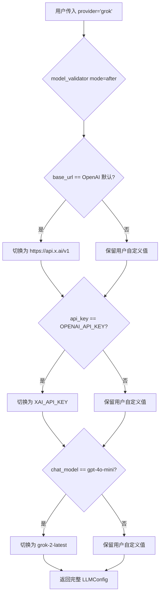
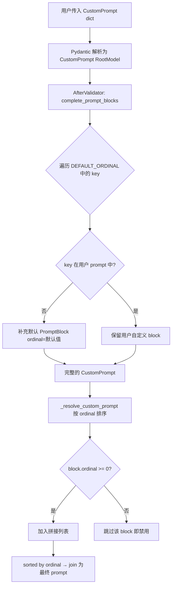
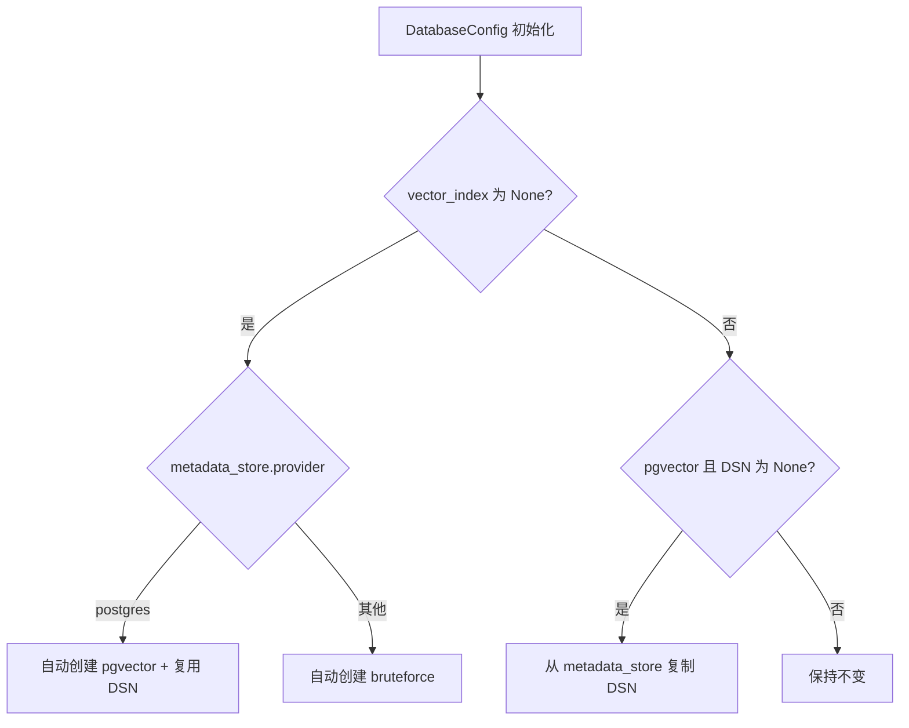

# PD-473.02 memU — Pydantic 多层配置树与块级 Prompt 组合引擎

> 文档编号：PD-473.02
> 来源：memU `src/memu/app/settings.py`, `src/memu/prompts/memory_type/`, `src/memu/prompts/category_summary/`
> GitHub：https://github.com/NevaMind-AI/memU.git
> 问题域：PD-473 配置驱动架构 Configuration-Driven Architecture
> 状态：可复用方案

---

## 第 1 章 问题与动机

### 1.1 核心问题

记忆系统（Memory Service）需要同时管理 LLM 提供商、数据库后端、记忆提取策略、检索行为、Prompt 模板等多个维度的配置。这些配置之间存在复杂的依赖关系：

- **Provider 级联默认值**：切换 LLM 提供商（OpenAI → Grok）时，base_url、api_key、chat_model 都需要联动变更
- **数据库后端自动推导**：选择 postgres 作为 metadata_store 时，vector_index 应自动切换到 pgvector 并复用同一 DSN
- **Prompt 模板可定制**：不同记忆类型（profile/event/knowledge/behavior）的提取 Prompt 需要支持块级覆盖，而非全量替换
- **多 LLM Profile 路由**：不同工作流步骤（提取、摘要、嵌入）可能使用不同的 LLM 配置

传统做法是用 dict + 手动校验，容易遗漏边界条件。memU 的方案是全面采用 Pydantic BaseModel 构建配置树，利用 `model_validator` 和 `model_post_init` 实现声明式的级联默认值推导。

### 1.2 memU 的解法概述

1. **13 个 Pydantic Config 类**构成配置树，覆盖 LLM、数据库、记忆提取、检索、Blob 存储等全部维度（`settings.py:38-322`）
2. **PromptBlock + CustomPrompt + ordinal 排序**实现块级 Prompt 组合，支持单块覆盖/禁用/重排序（`settings.py:38-64`）
3. **model_validator(mode="after")** 实现 provider 感知的默认值自动切换，如 OpenAI → Grok 的 base_url/api_key/model 联动（`settings.py:128-138`）
4. **model_post_init** 实现跨配置推导，如 DatabaseConfig 根据 metadata_store.provider 自动推导 vector_index（`settings.py:314-321`）
5. **LLMProfilesConfig** 支持多 Profile 路由，model_validator(mode="before") 确保 default 和 embedding Profile 始终存在（`settings.py:263-296`）

### 1.3 设计思想

| 设计原则 | 具体实现 | 理由 | 替代方案 |
|----------|----------|------|----------|
| 声明式配置树 | 13 个 Pydantic BaseModel 嵌套组合 | 类型安全 + IDE 自动补全 + 自动序列化 | dict + JSON Schema 校验 |
| 级联默认值 | model_validator + model_post_init | 用户只需指定 provider，其余自动推导 | if-else 链在构造函数中 |
| 块级 Prompt 组合 | PromptBlock(ordinal, prompt) + sorted 拼接 | 支持单块覆盖/禁用（ordinal=-1）/重排序 | Jinja2 模板继承 |
| 多 Profile 路由 | LLMProfilesConfig + step_config.llm_profile | 不同工作流步骤用不同模型 | 全局单一 LLM 配置 |
| 零配置启动 | 所有字段都有 default/default_factory | 用户可以零参数创建 MemoryService() | 必须提供完整配置文件 |

---

## 第 2 章 源码实现分析

### 2.1 架构概览

memU 的配置体系分为三层：

```
┌─────────────────────────────────────────────────────────┐
│                    MemoryService                         │
│  ┌──────────────┐ ┌──────────────┐ ┌──────────────────┐ │
│  │LLMProfilesConfig│ │DatabaseConfig│ │MemorizeConfig    │ │
│  │  ├─ default   │ │  ├─ metadata │ │  ├─ memory_types │ │
│  │  ├─ embedding │ │  │  store    │ │  ├─ type_prompts │ │
│  │  └─ custom... │ │  └─ vector  │ │  ├─ categories   │ │
│  └──────────────┘ │    index     │ │  └─ summary_prompt│ │
│  ┌──────────────┐ └──────────────┘ └──────────────────┘ │
│  │RetrieveConfig│ ┌──────────────┐ ┌──────────────────┐ │
│  │  ├─ method   │ │  BlobConfig  │ │   UserConfig     │ │
│  │  ├─ category │ └──────────────┘ └──────────────────┘ │
│  │  ├─ item     │                                       │
│  │  └─ resource │                                       │
│  └──────────────┘                                       │
└─────────────────────────────────────────────────────────┘
         │                    │                    │
         ▼                    ▼                    ▼
   _validate_config()   build_database()   _resolve_custom_prompt()
   dict → BaseModel     provider 路由       ordinal 排序拼接
```

### 2.2 核心实现

#### 2.2.1 Provider 级联默认值 — model_validator



对应源码 `src/memu/app/settings.py:102-138`：

```python
class LLMConfig(BaseModel):
    provider: str = Field(default="openai")
    base_url: str = Field(default="https://api.openai.com/v1")
    api_key: str = Field(default="OPENAI_API_KEY")
    chat_model: str = Field(default="gpt-4o-mini")
    client_backend: str = Field(default="sdk")
    embed_model: str = Field(default="text-embedding-3-small")
    embed_batch_size: int = Field(default=1)

    @model_validator(mode="after")
    def set_provider_defaults(self) -> "LLMConfig":
        if self.provider == "grok":
            if self.base_url == "https://api.openai.com/v1":
                self.base_url = "https://api.x.ai/v1"
            if self.api_key == "OPENAI_API_KEY":
                self.api_key = "XAI_API_KEY"
            if self.chat_model == "gpt-4o-mini":
                self.chat_model = "grok-2-latest"
        return self
```

关键设计：只在值等于 OpenAI 默认值时才覆盖，用户显式指定的值不会被覆盖。这是"约定优于配置"的精确实现。

#### 2.2.2 块级 Prompt 组合 — PromptBlock + CustomPrompt



对应源码 `src/memu/app/settings.py:38-64`：

```python
class PromptBlock(BaseModel):
    label: str | None = None
    ordinal: int = Field(default=0)
    prompt: str | None = None

class CustomPrompt(RootModel[dict[str, PromptBlock]]):
    root: dict[str, PromptBlock] = Field(default_factory=dict)

def complete_prompt_blocks(prompt: CustomPrompt, default_blocks: Mapping[str, int]) -> CustomPrompt:
    for key, ordinal in default_blocks.items():
        if key not in prompt.root:
            prompt.root[key] = PromptBlock(ordinal=ordinal)
    return prompt

CompleteMemoryTypePrompt = AfterValidator(
    lambda v: complete_prompt_blocks(v, DEFAULT_MEMORY_CUSTOM_PROMPT_ORDINAL)
)
```

运行时拼接逻辑 `src/memu/app/memorize.py:410-422`：

```python
@staticmethod
def _resolve_custom_prompt(prompt: str | CustomPrompt, templates: Mapping[str, str]) -> str:
    if isinstance(prompt, str):
        return prompt
    valid_blocks = [
        (block.ordinal, name, block.prompt or templates.get(name))
        for name, block in prompt.items()
        if (block.ordinal >= 0 and (block.prompt or templates.get(name)))
    ]
    sorted_blocks = sorted(valid_blocks)
    return "\n\n".join(block for (_, _, block) in sorted_blocks if block is not None)
```

### 2.3 实现细节

#### 数据库配置自动推导

`DatabaseConfig.model_post_init` (`settings.py:314-321`) 实现了跨子配置的自动推导：



#### LLMProfilesConfig 多 Profile 保障

`settings.py:269-288` 的 `model_validator(mode="before")` 确保 `default` 和 `embedding` Profile 始终存在：

```python
@model_validator(mode="before")
@classmethod
def ensure_default(cls, data: Any) -> Any:
    if data is None:
        data = {}
    elif isinstance(data, dict):
        data = dict(data)
    if "default" not in data:
        data["default"] = LLMConfig()
    if "embedding" not in data:
        data["embedding"] = data["default"]
    return data
```

#### 配置消费：_validate_config 统一入口

`service.py:380-388` 提供了 dict/BaseModel/None 三态统一校验：

```python
@staticmethod
def _validate_config(config, model_type):
    if isinstance(config, model_type):
        return config
    if config is None:
        return model_type()
    return model_type.model_validate(config)
```

这使得 `MemoryService` 构造函数可以接受 dict、Pydantic 对象或 None，极大降低了使用门槛。

---

## 第 3 章 迁移指南

### 3.1 迁移清单

**阶段 1：配置树骨架**
- [ ] 定义核心 Config 类（LLMConfig、DatabaseConfig 等），所有字段带 Field(default=...)
- [ ] 实现 model_validator(mode="after") 处理 provider 级联默认值
- [ ] 实现 model_post_init 处理跨配置推导（如 DB → Vector Index）

**阶段 2：块级 Prompt 系统**
- [ ] 定义 PromptBlock(ordinal, prompt) 和 CustomPrompt(RootModel)
- [ ] 实现 complete_prompt_blocks 自动补全缺失 block
- [ ] 实现 AfterValidator 将补全逻辑绑定到类型注解
- [ ] 实现 _resolve_custom_prompt 按 ordinal 排序拼接

**阶段 3：多 Profile 路由**
- [ ] 定义 LLMProfilesConfig(RootModel[dict])，model_validator 保障 default 存在
- [ ] 在 Service 层实现 _get_llm_client(profile) 懒加载 + 缓存
- [ ] 在 WorkflowStep.config 中通过 llm_profile 字段路由

**阶段 4：统一入口**
- [ ] 实现 _validate_config(config, model_type) 支持 dict/BaseModel/None 三态

### 3.2 适配代码模板

以下是一个可直接运行的最小配置驱动系统：

```python
from __future__ import annotations
from typing import Any, Mapping
from pydantic import BaseModel, Field, RootModel, model_validator


# --- 块级 Prompt 组合 ---

class PromptBlock(BaseModel):
    ordinal: int = Field(default=0)
    prompt: str | None = None

class CustomPrompt(RootModel[dict[str, PromptBlock]]):
    root: dict[str, PromptBlock] = Field(default_factory=dict)

    def items(self):
        return list(self.root.items())

DEFAULT_BLOCK_ORDINALS = {"objective": 10, "rules": 20, "output": 30, "input": 90}

def complete_blocks(prompt: CustomPrompt, defaults: Mapping[str, int]) -> CustomPrompt:
    for key, ordinal in defaults.items():
        if key not in prompt.root:
            prompt.root[key] = PromptBlock(ordinal=ordinal)
    return prompt

def resolve_prompt(prompt: str | CustomPrompt, templates: dict[str, str]) -> str:
    if isinstance(prompt, str):
        return prompt
    blocks = [
        (b.ordinal, name, b.prompt or templates.get(name))
        for name, b in prompt.items()
        if b.ordinal >= 0 and (b.prompt or templates.get(name))
    ]
    return "\n\n".join(text for _, _, text in sorted(blocks) if text)


# --- Provider 级联默认值 ---

class LLMConfig(BaseModel):
    provider: str = "openai"
    base_url: str = "https://api.openai.com/v1"
    api_key: str = "OPENAI_API_KEY"
    model: str = "gpt-4o-mini"

    @model_validator(mode="after")
    def apply_provider_defaults(self) -> "LLMConfig":
        PROVIDER_DEFAULTS = {
            "grok": ("https://api.x.ai/v1", "XAI_API_KEY", "grok-2-latest"),
            "deepseek": ("https://api.deepseek.com/v1", "DEEPSEEK_API_KEY", "deepseek-chat"),
        }
        if self.provider in PROVIDER_DEFAULTS:
            url, key, model = PROVIDER_DEFAULTS[self.provider]
            if self.base_url == "https://api.openai.com/v1":
                self.base_url = url
            if self.api_key == "OPENAI_API_KEY":
                self.api_key = key
            if self.model == "gpt-4o-mini":
                self.model = model
        return self


# --- 多 Profile 路由 ---

class LLMProfiles(RootModel[dict[str, LLMConfig]]):
    root: dict[str, LLMConfig] = Field(default_factory=lambda: {"default": LLMConfig()})

    @model_validator(mode="before")
    @classmethod
    def ensure_default(cls, data: Any) -> Any:
        if data is None:
            data = {}
        elif isinstance(data, dict):
            data = dict(data)
        if "default" not in data:
            data["default"] = LLMConfig()
        return data


# --- 统一校验入口 ---

def validate_config(config: Any, model_type: type[BaseModel]) -> BaseModel:
    if isinstance(config, model_type):
        return config
    if config is None:
        return model_type()
    return model_type.model_validate(config)


# --- 使用示例 ---
if __name__ == "__main__":
    # 零配置启动
    cfg = LLMConfig()
    print(f"默认: {cfg.provider} {cfg.base_url} {cfg.model}")

    # Provider 级联
    cfg_grok = LLMConfig(provider="grok")
    print(f"Grok: {cfg_grok.base_url} {cfg_grok.model}")

    # 块级 Prompt：禁用 rules，自定义 objective
    custom = CustomPrompt.model_validate({
        "objective": {"ordinal": 10, "prompt": "你是一个记忆提取专家"},
        "rules": {"ordinal": -1},  # ordinal=-1 禁用该 block
    })
    custom = complete_blocks(custom, DEFAULT_BLOCK_ORDINALS)
    templates = {"output": "输出 JSON 格式", "input": "原始对话：{resource}"}
    print(resolve_prompt(custom, templates))
```

### 3.3 适用场景

| 场景 | 适用度 | 说明 |
|------|--------|------|
| 多 LLM 提供商切换 | ⭐⭐⭐ | model_validator 级联默认值，一行 provider="grok" 搞定 |
| Prompt 模板定制 | ⭐⭐⭐ | 块级覆盖比全量替换灵活，ordinal=-1 禁用比删除安全 |
| 多模型路由（提取/摘要/嵌入用不同模型） | ⭐⭐⭐ | LLMProfilesConfig + step_config 天然支持 |
| 简单单模型应用 | ⭐⭐ | 配置树过重，直接用 env var 更简单 |
| 需要运行时热更新配置 | ⭐ | Pydantic 模型是不可变的，需要额外机制 |

---

## 第 4 章 测试用例

```python
import pytest
from pydantic import BaseModel, Field, RootModel, model_validator
from typing import Any


# --- 被测代码（从 memU settings.py 提取的核心逻辑） ---

class PromptBlock(BaseModel):
    ordinal: int = Field(default=0)
    prompt: str | None = None

class CustomPrompt(RootModel[dict[str, PromptBlock]]):
    root: dict[str, PromptBlock] = Field(default_factory=dict)
    def items(self):
        return list(self.root.items())

def complete_prompt_blocks(prompt: CustomPrompt, defaults: dict[str, int]) -> CustomPrompt:
    for key, ordinal in defaults.items():
        if key not in prompt.root:
            prompt.root[key] = PromptBlock(ordinal=ordinal)
    return prompt

def resolve_custom_prompt(prompt: str | CustomPrompt, templates: dict[str, str]) -> str:
    if isinstance(prompt, str):
        return prompt
    valid_blocks = [
        (b.ordinal, name, b.prompt or templates.get(name))
        for name, b in prompt.items()
        if b.ordinal >= 0 and (b.prompt or templates.get(name))
    ]
    return "\n\n".join(text for _, _, text in sorted(valid_blocks) if text)

class LLMConfig(BaseModel):
    provider: str = "openai"
    base_url: str = "https://api.openai.com/v1"
    api_key: str = "OPENAI_API_KEY"
    chat_model: str = "gpt-4o-mini"

    @model_validator(mode="after")
    def set_provider_defaults(self) -> "LLMConfig":
        if self.provider == "grok":
            if self.base_url == "https://api.openai.com/v1":
                self.base_url = "https://api.x.ai/v1"
            if self.api_key == "OPENAI_API_KEY":
                self.api_key = "XAI_API_KEY"
            if self.chat_model == "gpt-4o-mini":
                self.chat_model = "grok-2-latest"
        return self


# --- 测试用例 ---

class TestLLMConfigProviderDefaults:
    def test_openai_defaults_unchanged(self):
        cfg = LLMConfig()
        assert cfg.provider == "openai"
        assert cfg.base_url == "https://api.openai.com/v1"
        assert cfg.api_key == "OPENAI_API_KEY"

    def test_grok_cascading_defaults(self):
        cfg = LLMConfig(provider="grok")
        assert cfg.base_url == "https://api.x.ai/v1"
        assert cfg.api_key == "XAI_API_KEY"
        assert cfg.chat_model == "grok-2-latest"

    def test_grok_preserves_explicit_values(self):
        cfg = LLMConfig(provider="grok", base_url="https://custom.api/v1")
        assert cfg.base_url == "https://custom.api/v1"  # 不被覆盖
        assert cfg.api_key == "XAI_API_KEY"  # 默认值被覆盖

    def test_unknown_provider_no_cascade(self):
        cfg = LLMConfig(provider="anthropic")
        assert cfg.base_url == "https://api.openai.com/v1"  # 保持默认


class TestPromptBlockComposition:
    DEFAULTS = {"objective": 10, "rules": 20, "output": 30, "input": 90}
    TEMPLATES = {
        "objective": "默认目标",
        "rules": "默认规则",
        "output": "默认输出格式",
        "input": "原始输入：{resource}",
    }

    def test_complete_fills_missing_blocks(self):
        prompt = CustomPrompt.model_validate({"objective": {"ordinal": 10, "prompt": "自定义目标"}})
        completed = complete_prompt_blocks(prompt, self.DEFAULTS)
        assert "rules" in completed.root
        assert completed.root["rules"].ordinal == 20

    def test_ordinal_negative_disables_block(self):
        prompt = CustomPrompt.model_validate({
            "objective": {"ordinal": 10, "prompt": "目标"},
            "rules": {"ordinal": -1, "prompt": "不应出现"},
        })
        result = resolve_custom_prompt(prompt, self.TEMPLATES)
        assert "不应出现" not in result
        assert "目标" in result

    def test_ordinal_sorting(self):
        prompt = CustomPrompt.model_validate({
            "output": {"ordinal": 5, "prompt": "先输出"},
            "objective": {"ordinal": 10, "prompt": "后目标"},
        })
        result = resolve_custom_prompt(prompt, {})
        assert result.index("先输出") < result.index("后目标")

    def test_fallback_to_template(self):
        prompt = CustomPrompt.model_validate({
            "objective": {"ordinal": 10},  # 无 prompt，使用 template
        })
        result = resolve_custom_prompt(prompt, {"objective": "模板目标"})
        assert "模板目标" in result

    def test_string_prompt_passthrough(self):
        result = resolve_custom_prompt("直接字符串", {})
        assert result == "直接字符串"
```

---

## 第 5 章 跨域关联

| 关联域 | 关系类型 | 说明 |
|--------|----------|------|
| PD-04 工具系统 | 协同 | MemorizeConfig.memory_type_prompts 通过配置驱动不同记忆类型的提取工具行为 |
| PD-06 记忆持久化 | 依赖 | DatabaseConfig 控制记忆存储后端（inmemory/postgres/sqlite），CategoryConfig 定义记忆分类结构 |
| PD-10 中间件管道 | 协同 | PipelineManager 的 config_step() 允许通过配置修改工作流步骤的 LLM Profile，配置驱动管道行为 |
| PD-01 上下文管理 | 协同 | MemorizeConfig.default_category_summary_target_length 控制摘要长度，间接管理上下文窗口 |
| PD-475 记忆去重与强化 | 协同 | MemorizeConfig.enable_item_reinforcement 和 RetrieveItemConfig.ranking="salience" 通过配置开关控制强化检索 |

---

## 第 6 章 来源文件索引

| 文件 | 行范围 | 关键实现 |
|------|--------|----------|
| `src/memu/app/settings.py` | L38-L64 | PromptBlock + CustomPrompt + complete_prompt_blocks 块级 Prompt 组合 |
| `src/memu/app/settings.py` | L67-L89 | CategoryConfig 记忆分类配置 + 10 个默认分类 |
| `src/memu/app/settings.py` | L102-L138 | LLMConfig + model_validator provider 级联默认值 |
| `src/memu/app/settings.py` | L175-L201 | RetrieveConfig 三层检索配置（category/item/resource） |
| `src/memu/app/settings.py` | L204-L243 | MemorizeConfig 记忆提取配置（类型/Prompt/分类/强化） |
| `src/memu/app/settings.py` | L263-L296 | LLMProfilesConfig 多 Profile 路由 + ensure_default |
| `src/memu/app/settings.py` | L299-L321 | MetadataStoreConfig + VectorIndexConfig + DatabaseConfig 自动推导 |
| `src/memu/app/service.py` | L49-L95 | MemoryService.__init__ 配置消费 + _validate_config |
| `src/memu/app/service.py` | L97-L151 | _init_llm_client 三后端路由 + _get_llm_base_client 懒加载缓存 |
| `src/memu/app/service.py` | L380-L388 | _validate_config 统一校验入口 |
| `src/memu/app/memorize.py` | L410-L422 | _resolve_custom_prompt ordinal 排序拼接 |
| `src/memu/prompts/memory_type/__init__.py` | L1-L46 | DEFAULT_MEMORY_TYPES + PROMPTS + DEFAULT_MEMORY_CUSTOM_PROMPT_ORDINAL |
| `src/memu/prompts/memory_type/profile.py` | L56-L190 | 7 个 PROMPT_BLOCK_* 块定义 + CUSTOM_PROMPT dict |
| `src/memu/prompts/category_summary/__init__.py` | L1-L22 | DEFAULT_CATEGORY_SUMMARY_PROMPT_ORDINAL |
| `src/memu/prompts/category_summary/category.py` | L146-L296 | 6 个 PROMPT_BLOCK_* 块 + CUSTOM_PROMPT dict |
| `src/memu/workflow/pipeline.py` | L21-L170 | PipelineManager 配置驱动的工作流管道管理 |
| `src/memu/database/factory.py` | L15-L43 | build_database provider 路由工厂 |
| `examples/proactive/memory/config.py` | L1-L66 | 用户自定义配置示例（自定义记忆类型 + 块级 Prompt 覆盖） |

---

## 第 7 章 横向对比维度

```json comparison_data
{
  "project": "memU",
  "dimensions": {
    "配置建模": "13 个 Pydantic BaseModel 嵌套树，全字段带 Field(default=...)",
    "校验机制": "model_validator(after) 级联默认值 + model_post_init 跨配置推导",
    "Prompt 模板": "PromptBlock(ordinal) 块级组合，ordinal=-1 禁用，AfterValidator 自动补全",
    "多 Profile": "LLMProfilesConfig(RootModel[dict]) + step_config.llm_profile 路由",
    "零配置启动": "_validate_config 支持 dict/BaseModel/None 三态，所有字段有默认值"
  }
}
```

### 域元数据补充

```json domain_metadata
{
  "solution_summary": "memU 用 13 个 Pydantic BaseModel 构建配置树，PromptBlock(ordinal) 实现块级 Prompt 组合与禁用，model_validator 级联 provider 默认值，LLMProfilesConfig 支持多模型路由",
  "description": "配置不仅控制系统参数，还驱动 Prompt 模板的块级组合与排序",
  "sub_problems": [
    "多 LLM Profile 路由与懒加载",
    "跨配置自动推导（DB provider → Vector Index）",
    "配置三态统一校验（dict/BaseModel/None）"
  ],
  "best_practices": [
    "用 PromptBlock(ordinal) 实现块级 Prompt 组合，ordinal=-1 禁用单块而非全量替换",
    "用 AfterValidator 将配置补全逻辑绑定到类型注解，校验与补全一体化",
    "用 RootModel[dict] + model_validator(before) 保障必需 Profile 始终存在"
  ]
}
```
